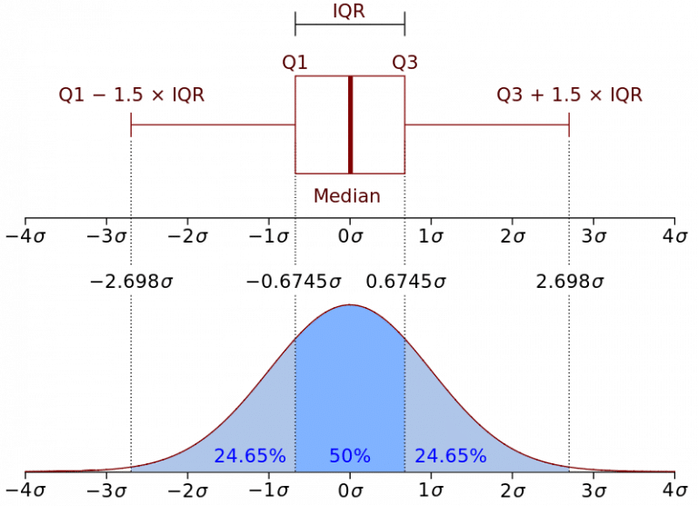
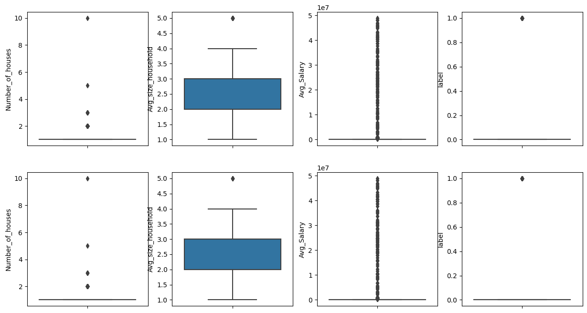
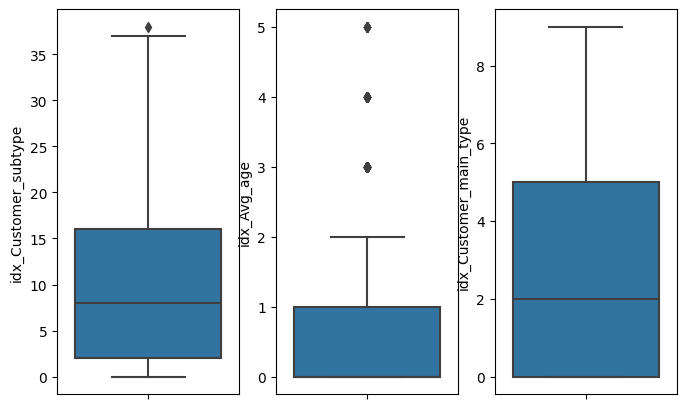

Hello today we are going to discuss how to perform data analysis of one dataset by using pyspark.

When you are dealing with **BigData** and you want to perform data analysis, the first step to do is understand the data and identify anomalies in the raw data.

In ordering to work with **BigData** we can use different tecchnologies such as:

- **Spark**.  Fastest Batch processor or the most voluminous stream processor -  Spark is an open-source unified analytics engine for large-scale data processing. Spark provides an interface for programming clusters with implicit data parallelism and fault tolerance
- **Hadoop**.  - Hadoop is a collection of open-source software utilities that facilitates using a network of many computers to solve problems involving massive amounts of data and computation. It provides a software framework for distributed storage and processing of big data using the MapReduce programming mode
- **MapReduce** is a programming model and an associated implementation for processing and generating big data sets with a parallel, distributed algorithm on a cluster. A MapReduce program is composed of a map procedure, which performs filtering and sorting, and a reduce method, which performs a summary operation
- **Hive**.  Big data analytics framework. Hive is a data warehouse software project built on top of Apache Hadoop for providing data query and analysis. Hive gives an SQL-like interface to query data stored in various databases and file systems that integrate with Hadoop
- **Samza**. Streaming processor made for Kafka - Is an open-source, near-realtime, asynchronous computational framework for stream processing developed by the Apache Software Foundation in Scala and Java. 
- **Flink**. A true hybrid Big data processor . The core of Apache Flink is a distributed streaming data-flow engine written in Java and Scala. Flink executes arbitrary dataflow programs in a data-parallel and pipelined manner

In this blog post we will focus on **Pyspark** based in **Spark**.

## Outlier Detection

There are several methods for identifing the outiers into a big dataframe. The method that we are going to use is the **Interquartile Range method**, also known as IQR, was developed by John Widler Turky, an American mathematician best known for development of the FFT algorithm and box plot. IQR is a measure of statistical dispersion, which is equal to the difference between the 75th [percentile](https://en.wikipedia.org/wiki/Percentile) and the 25th [percentile](https://en.wikipedia.org/wiki/Percentile). In other words:


Representation of the Interquartile Range - Wikipedia

IQR is a fairly interpretable method, often used to draw Box Plots and display the distribution of a dataset.

First we are going to install the environment and then we proceed with the data analysis.

## Step 1. Installation of Conda

First you need to install anaconda at this [link](https://www.anaconda.com/products/individual)


in this location **C:\Anaconda3** , then you, check that your terminal , recognize **conda**

```
C:\conda --version
conda 23.1.0
```

## Step 2. Environment creation

The environments supported that I will consider is Python 3.10,

I will create an environment called **analysis**, but you can put the name that you like.

```
conda create -n analysis python==3.10
```

then we activate

```
conda activate analysis
```

then in your terminal type the following commands:

```
conda install ipykernel notebook
```

then

```
python -m ipykernel install --user --name analysis --display-name "Python (Analysis)"
```

then we install the following libraries used to the data analysis

```
pip install wget seaborn matplotlib requests tqdm
```

If you are in Google Colab `pip install pyspark`  and go to the step 4.


## Step 3. Pyspark Installation

If you have installed pyspark before you can skip this step.


```python
# Import the os module
import os
import requests
import wget
from tqdm import tqdm
```


```python
def download(url: str, fname: str):
    resp = requests.get(url, stream=True)
    total = int(resp.headers.get('content-length', 0))
    # Can also replace 'file' with a io.BytesIO object
    with open(fname, 'wb') as file, tqdm(
        desc=fname,
        total=total,
        unit='iB',
        unit_scale=True,
        unit_divisor=1024,
    ) as bar:
        for data in resp.iter_content(chunk_size=1024):
            size = file.write(data)
            bar.update(size)
```


```python
#import zipfile module
from zipfile import ZipFile
def extract_zip(filename):
    with ZipFile(filename, 'r') as f:
        #extract in current directory
        f.extractall()
```


```python
# importing the "tarfile" module
import tarfile
def extract_tar(filename):
    # open file
    file = tarfile.open(filename)
    # extracting file
    file.extractall()
    file.close()
```

## Spark Installation


```python
SPARK_FILE="spark-3.3.2-bin-hadoop3.tgz"
URL = "https://dlcdn.apache.org/spark/spark-3.3.2/spark-3.3.2-bin-hadoop3.tgz"
#response = wget.download(URL, SPARK_FILE)
download(URL,SPARK_FILE)
```

    spark-3.3.2-bin-hadoop3.tgz: 100%|█████████████████████████████████████████████████| 285M/285M [00:13<00:00, 22.9MiB/s]


```python
# Path
home = os.getcwd()
# Print the current working directory
#print("Current working directory: {0}".format(home))
```


```python
#set filename
fpath = os.path.join(home, SPARK_FILE)
```


```python
extract_tar(fpath)
```


```python
if os.name == 'nt':

    !del spark-3.3.2-bin-hadoop3.tgz
else:

    !rm spark-3.3.2-bin-hadoop3.tgz
```

## Java Installation


```python
if os.name == 'nt':
    url_java='https://builds.openlogic.com/downloadJDK/openlogic-openjdk/11.0.18+10/openlogic-openjdk-11.0.18+10-windows-x64.zip'
    JAVA_FILE='openjdk-11.zip'
else:
    JAVA_FILE='openjdk-11.tar.gz'
    url_java='https://builds.openlogic.com/downloadJDK/openlogic-openjdk/11.0.18+10/openlogic-openjdk-11.0.18+10-linux-x64.tar.gz'
```


```python
download(url_java,JAVA_FILE)
```

    openjdk-11.zip: 100%|██████████████████████████████████████████████████████████████| 214M/214M [00:07<00:00, 31.6MiB/s]


```python
try:
    if os.name == 'nt':
        extract_zip(JAVA_FILE)
        !del openjdk-11.zip
    else:
        extract_tar(JAVA_FILE)
        !rm openjdk-11.tar.gz
except:
    print("")
```


​    

## Environment setup of Spark


```python
import os
# Path
home = os.getcwd()
JAVA_FOLDER='openlogic-openjdk-11.0.18+10-windows-x64'
#set filename
JAVA_HOME = os.path.join(home, JAVA_FOLDER)
SPARK_FOLDER='spark-3.3.2-bin-hadoop3'
#set filename
SPARK_HOME = os.path.join(home, SPARK_FOLDER)
```


```python
import os
os.environ['JAVA_HOME']=JAVA_HOME
os.environ['SPARK_HOME']=SPARK_HOME
```

## Step 4 Importing  libraries


```python
import pyspark
import seaborn as sns
import matplotlib.pyplot as plt
from pyspark.sql import SparkSession
```

### Creating a Spark Session


```python
spark = SparkSession.builder.appName('Data Analysis').getOrCreate()
```


## Step 5. Begin Analysis 

The  sample dataset that we are going to analyze is [here](https://github.com/ruslanmv/How-to-do-Data-Analysis-with-Pyspark/blob/master/customer_data.csv).  

### Reading the dataset  using spark session


```python
df = spark.read.csv('customer_data.csv',header = True)
df.show()
```

    +--------------------+----------------+------------------+-----------+--------------------+----------+-----+
    |    Customer_subtype|Number_of_houses|Avg_size_household|    Avg_age|  Customer_main_type|Avg_Salary|label|
    +--------------------+----------------+------------------+-----------+--------------------+----------+-----+
    |Lower class large...|               1|                 3|30-40 years|Family with grown...|     44905|    0|
    |Mixed small town ...|               1|                 2|30-40 years|Family with grown...|     37575|    0|
    |Mixed small town ...|               1|                 2|30-40 years|Family with grown...|     27915|    0|
    |Modern, complete ...|               1|                 3|40-50 years|      Average Family|     19504|    0|
    |  Large family farms|               1|                 4|30-40 years|             Farmers|     34943|    0|
    |    Young and rising|               1|                 2|20-30 years|         Living well|     13064|    0|
    |Large religious f...|               2|                 3|30-40 years|Conservative fami...|     29090|    0|
    |Lower class large...|               1|                 2|40-50 years|Family with grown...|      6895|    0|
    |Lower class large...|               1|                 2|50-60 years|Family with grown...|     35497|    0|
    |     Family starters|               2|                 3|40-50 years|      Average Family|     30800|    0|
    |       Stable family|               1|                 4|40-50 years|      Average Family|     39157|    0|
    |Modern, complete ...|               1|                 3|40-50 years|      Average Family|     40839|    0|
    |Lower class large...|               1|                 2|40-50 years|Family with grown...|     30008|    0|
    |        Mixed rurals|               1|                 3|40-50 years|             Farmers|     37209|    0|
    |    Young and rising|               1|                 1|30-40 years|         Living well|     45361|    0|
    |Lower class large...|               1|                 2|40-50 years|Family with grown...|     45650|    0|
    |Traditional families|               1|                 2|40-50 years|Conservative fami...|     18982|    0|
    |Mixed apartment d...|               2|                 3|40-50 years|         Living well|     30093|    0|
    |Young all america...|               1|                 4|30-40 years|      Average Family|     27097|    0|
    |Low income catholics|               1|                 2|50-60 years|Retired and Relig...|     23511|    0|
    +--------------------+----------------+------------------+-----------+--------------------+----------+-----+
    only showing top 20 rows


​    

### Get DataFrame Schema

Printing the schema, to check the datatypes


```python
df.printSchema()
```

    root
     |-- Customer_subtype: string (nullable = true)
     |-- Number_of_houses: string (nullable = true)
     |-- Avg_size_household: string (nullable = true)
     |-- Avg_age: string (nullable = true)
     |-- Customer_main_type: string (nullable = true)
     |-- Avg_Salary: string (nullable = true)
     |-- label: string (nullable = true)


​    

First at all  found the following issues:

1. All the columns are defined as strings datatypes
2. There are categorical fields that should be indentifed
3. There are columns that have to be converted into numerical data types

### Counting the number of records


```python
df.count()
```


    2000

### Checking the number of columns


```python
len(df.columns)
```


    7

## Identifying Data types columns


```python
#Get All column names and it's types
for col in df.dtypes:
    print(col[0]+" , "+col[1])
```

    Customer_subtype , string
    Number_of_houses , string
    Avg_size_household , string
    Avg_age , string
    Customer_main_type , string
    Avg_Salary , string
    label , string


```python
#store all column names in a list
allCols = [item[0] for item in df.dtypes]
print(allCols)
```

    ['Customer_subtype', 'Number_of_houses', 'Avg_size_household', 'Avg_age', 'Customer_main_type', 'Avg_Salary', 'label']


```python
#store all column names that are categorical in a list
categoricalCols = [item[0] for item in df.dtypes if item[1].startswith('string')]
print(categoricalCols)
```

    ['Customer_subtype', 'Number_of_houses', 'Avg_size_household', 'Avg_age', 'Customer_main_type', 'Avg_Salary', 'label']


```python
#store all column names that are continous in a list
continuousCols =[item[0] for item in df.dtypes if item[1].startswith('bigint')]
print(continuousCols)
```

    []


### Segregating the desired columns to convert the data type into IntegerType


```python
numeric_index = [1,2,5,6]
numeric_cols = [allCols[val] for val in numeric_index]
```


```python
numeric_cols
```


    ['Number_of_houses', 'Avg_size_household', 'Avg_Salary', 'label']


```python
from pyspark.sql import functions as f
from pyspark.sql.types import IntegerType
```


The first option you have when it comes to converting data types is pyspark.sql.Column.cast() function that converts the input column to the specified data type.


```python
for column in numeric_cols:
    df = df.withColumn(column,f.col(column).cast(IntegerType()))
```

### Checking the schema after converting the numerical columns into IntegerType


```python
df.printSchema()
```

    root
     |-- Customer_subtype: string (nullable = true)
     |-- Number_of_houses: integer (nullable = true)
     |-- Avg_size_household: integer (nullable = true)
     |-- Avg_age: string (nullable = true)
     |-- Customer_main_type: string (nullable = true)
     |-- Avg_Salary: integer (nullable = true)
     |-- label: integer (nullable = true)


​    

## Complementary information

Alternatively, you can use pyspark.sql.DataFrame.selectExpr function by specifying the corresponding SQL expressions that can cast the data type of desired columns, as shown below.


```python
dfa = df.selectExpr(
    'cast(Number_of_houses as int) Number_of_houses',
)
```


```python
dfa.printSchema()
```

    root
     |-- Number_of_houses: integer (nullable = true)


​    

Sometimes we need add date type

```
'to_date(colA, \'dd-MM-yyyy\') colA',
```


```python
from datetime import datetime
from pyspark.sql.functions import col, udf
from pyspark.sql.types import DoubleType, IntegerType, DateType
dfa = df \
    .withColumn('Number_of_houses', col('Number_of_houses').cast(IntegerType()))
```

and the datatype equivalent, first we define dhe universal defined function 

```
# UDF to process the date column
func = udf(lambda x: datetime.strptime(x, '%d-%m-%Y'), DateType())

with 

.withColumn('colA', func(col('colA'))) \
```


```python
dfa.printSchema()
```

    root
     |-- Customer_subtype: string (nullable = true)
     |-- Number_of_houses: integer (nullable = true)
     |-- Avg_size_household: integer (nullable = true)
     |-- Avg_age: string (nullable = true)
     |-- Customer_main_type: string (nullable = true)
     |-- Avg_Salary: integer (nullable = true)
     |-- label: integer (nullable = true)


​    


```python
from pyspark.sql import SparkSession
# Create an instance of spark session
spark_session = SparkSession.builder \
    .master('local[1]') \
    .appName('Example') \
    .getOrCreate()
```


```python
# Removing Global views
spark.catalog.dropGlobalTempView("dfa")
```


    False


```python
# First we need to register the DF as a global temporary view
df.createGlobalTempView("dfa")
dfa = spark_session.sql(
    """
    SELECT 
        cast(Number_of_houses as int) Number_of_houses
    FROM global_temp.dfa
    """
)
```


```python
dfa.printSchema()
```

    root
     |-- Number_of_houses: integer (nullable = true)


​    

### Creating a variable to store all the numerical columns into a list


```python
numeric_columns = [column[0] for column in df.dtypes if column[1]=='int']
numeric_columns
```


    ['Number_of_houses', 'Avg_size_household', 'Avg_Salary', 'label']


```python
df.show()
```

    +--------------------+----------------+------------------+-----------+--------------------+----------+-----+
    |    Customer_subtype|Number_of_houses|Avg_size_household|    Avg_age|  Customer_main_type|Avg_Salary|label|
    +--------------------+----------------+------------------+-----------+--------------------+----------+-----+
    |Lower class large...|               1|                 3|30-40 years|Family with grown...|     44905|    0|
    |Mixed small town ...|               1|                 2|30-40 years|Family with grown...|     37575|    0|
    |Mixed small town ...|               1|                 2|30-40 years|Family with grown...|     27915|    0|
    |Modern, complete ...|               1|                 3|40-50 years|      Average Family|     19504|    0|
    |  Large family farms|               1|                 4|30-40 years|             Farmers|     34943|    0|
    |    Young and rising|               1|                 2|20-30 years|         Living well|     13064|    0|
    |Large religious f...|               2|                 3|30-40 years|Conservative fami...|     29090|    0|
    |Lower class large...|               1|                 2|40-50 years|Family with grown...|      6895|    0|
    |Lower class large...|               1|                 2|50-60 years|Family with grown...|     35497|    0|
    |     Family starters|               2|                 3|40-50 years|      Average Family|     30800|    0|
    |       Stable family|               1|                 4|40-50 years|      Average Family|     39157|    0|
    |Modern, complete ...|               1|                 3|40-50 years|      Average Family|     40839|    0|
    |Lower class large...|               1|                 2|40-50 years|Family with grown...|     30008|    0|
    |        Mixed rurals|               1|                 3|40-50 years|             Farmers|     37209|    0|
    |    Young and rising|               1|                 1|30-40 years|         Living well|     45361|    0|
    |Lower class large...|               1|                 2|40-50 years|Family with grown...|     45650|    0|
    |Traditional families|               1|                 2|40-50 years|Conservative fami...|     18982|    0|
    |Mixed apartment d...|               2|                 3|40-50 years|         Living well|     30093|    0|
    |Young all america...|               1|                 4|30-40 years|      Average Family|     27097|    0|
    |Low income catholics|               1|                 2|50-60 years|Retired and Relig...|     23511|    0|
    +--------------------+----------------+------------------+-----------+--------------------+----------+-----+
    only showing top 20 rows


​    

# Case 1 - Working with only integers


```python
dfa=df.select(*numeric_columns)
```


```python
dfa.printSchema()
```

    root
     |-- Number_of_houses: integer (nullable = true)
     |-- Avg_size_household: integer (nullable = true)
     |-- Avg_Salary: integer (nullable = true)
     |-- label: integer (nullable = true)


​    

### Creating a customized function 


```python
def find_outliers(df,numerical_columns=None):
    if numerical_columns==None:
        # Identifying the numerical columns in a spark dataframe
        numeric_columns = [column[0] for column in df.dtypes if column[1]=='int'or column[1]=='double']
    else:
        #Custom numerical columns
        numeric_columns =numerical_columns

    # Using the `for` loop to create new columns by identifying the outliers for each feature
    for column in numeric_columns:

        less_Q1 = 'less_Q1_{}'.format(column)
        more_Q3 = 'more_Q3_{}'.format(column)
        Q1 = 'Q1_{}'.format(column)
        Q3 = 'Q3_{}'.format(column)

        # Q1 : First Quartile ., Q3 : Third Quartile
        Q1 = df.approxQuantile(column,[0.25],relativeError=0)
        Q3 = df.approxQuantile(column,[0.75],relativeError=0)
        
        # IQR : Inter Quantile Range
        # We need to define the index [0], as Q1 & Q3 are a set of lists., to perform a mathematical operation
        # Q1 & Q3 are defined seperately so as to have a clear indication on First Quantile & 3rd Quantile
        IQR = Q3[0] - Q1[0]
        
        #selecting the data, with -1.5*IQR to + 1.5*IQR., where param = 1.5 default value
        less_Q1 =  Q1[0] - 1.5*IQR
        more_Q3 =  Q3[0] + 1.5*IQR
        
        isOutlierCol = 'is_outlier_{}'.format(column)
        
        df = df.withColumn(isOutlierCol,f.when((df[column] > more_Q3) | (df[column] < less_Q1), 1).otherwise(0))
    

    # Selecting the specific columns which we have added above, to check if there are any outliers
    selected_columns = [column for column in df.columns if column.startswith("is_outlier")]

    # Adding all the outlier columns into a new colum "total_outliers", to see the total number of outliers
    df = df.withColumn('total_outliers',sum(df[column] for column in selected_columns))

    # Dropping the extra columns created above, just to create nice dataframe., without extra columns
    df = df.drop(*[column for column in df.columns if column.startswith("is_outlier")])

    return df
```

### Using the customized Outlier function and applying it to a spark dataframe


```python
new_df = find_outliers(dfa)
new_df.show()
```

    +----------------+------------------+----------+-----+--------------+
    |Number_of_houses|Avg_size_household|Avg_Salary|label|total_outliers|
    +----------------+------------------+----------+-----+--------------+
    |               1|                 3|     44905|    0|             0|
    |               1|                 2|     37575|    0|             0|
    |               1|                 2|     27915|    0|             0|
    |               1|                 3|     19504|    0|             0|
    |               1|                 4|     34943|    0|             0|
    |               1|                 2|     13064|    0|             0|
    |               2|                 3|     29090|    0|             1|
    |               1|                 2|      6895|    0|             0|
    |               1|                 2|     35497|    0|             0|
    |               2|                 3|     30800|    0|             1|
    |               1|                 4|     39157|    0|             0|
    |               1|                 3|     40839|    0|             0|
    |               1|                 2|     30008|    0|             0|
    |               1|                 3|     37209|    0|             0|
    |               1|                 1|     45361|    0|             0|
    |               1|                 2|     45650|    0|             0|
    |               1|                 2|     18982|    0|             0|
    |               2|                 3|     30093|    0|             1|
    |               1|                 4|     27097|    0|             0|
    |               1|                 2|     23511|    0|             0|
    +----------------+------------------+----------+-----+--------------+
    only showing top 20 rows


​    

### Fitering the above dataframe, to select only those records where the outlier count is < = 1


```python
new_df_with_no_outliers = new_df.filter(new_df['total_Outliers']<=1)
new_df_with_no_outliers = new_df_with_no_outliers.select(*dfa.columns)

new_df_with_no_outliers.show()
```

    +----------------+------------------+----------+-----+
    |Number_of_houses|Avg_size_household|Avg_Salary|label|
    +----------------+------------------+----------+-----+
    |               1|                 3|     44905|    0|
    |               1|                 2|     37575|    0|
    |               1|                 2|     27915|    0|
    |               1|                 3|     19504|    0|
    |               1|                 4|     34943|    0|
    |               1|                 2|     13064|    0|
    |               2|                 3|     29090|    0|
    |               1|                 2|      6895|    0|
    |               1|                 2|     35497|    0|
    |               2|                 3|     30800|    0|
    |               1|                 4|     39157|    0|
    |               1|                 3|     40839|    0|
    |               1|                 2|     30008|    0|
    |               1|                 3|     37209|    0|
    |               1|                 1|     45361|    0|
    |               1|                 2|     45650|    0|
    |               1|                 2|     18982|    0|
    |               2|                 3|     30093|    0|
    |               1|                 4|     27097|    0|
    |               1|                 2|     23511|    0|
    +----------------+------------------+----------+-----+
    only showing top 20 rows


​    

### The count of the dataframe, after removing the outliers


```python
new_df_with_no_outliers.count()
```


    1938


### The dataset, which contains 2 or more outliers in each record


```python
data_with_outliers = new_df.filter(new_df['total_Outliers']>=2)
data_with_outliers.show()
```

    +----------------+------------------+----------+-----+--------------+
    |Number_of_houses|Avg_size_household|Avg_Salary|label|total_outliers|
    +----------------+------------------+----------+-----+--------------+
    |               2|                 5|     40832|    0|             2|
    |               1|                 3|    762769|    1|             2|
    |               2|                 3|   6138618|    0|             2|
    |               1|                 2|  12545905|    1|             2|
    |               2|                 3|     30117|    1|             2|
    |               2|                 2|    690080|    0|             2|
    |               2|                 5|     37394|    0|             2|
    |               1|                 4|  35032441|    1|             2|
    |               1|                 4|    682348|    1|             2|
    |               2|                 3|    762483|    0|             2|
    |               2|                 4|     20503|    1|             2|
    |               2|                 2|    315815|    0|             2|
    |               2|                 3|     14798|    1|             2|
    |               2|                 4|    681714|    0|             2|
    |               1|                 3|    903291|    1|             2|
    |               1|                 1|  17462103|    1|             2|
    |               1|                 5|  18657560|    0|             2|
    |               2|                 5|     26224|    0|             2|
    |               3|                 2|    596723|    0|             2|
    |               1|                 2|  48069548|    1|             2|
    +----------------+------------------+----------+-----+--------------+
    only showing top 20 rows


```python
# Selecting the numerical columns from the original dataframe and converting into pandas

numeric_columns
```


    ['Number_of_houses', 'Avg_size_household', 'Avg_Salary', 'label']


### Converting a spark dataframe into pandas dataframe, which enables us to plot the graphs using seaborn and matplotlib

If we can get an small subset of dataset we can use pandas. It is not recommendable use pandas if you are working with real big data. Because you will have problems of memory. Just for illustrative purposes , I will show the pandas dataframes.


```python
original_numerical_df = dfa.select(*numeric_columns).toPandas()

original_numerical_df.head(10)
```

<table border="1" class="dataframe">
  <thead>
    <tr style="text-align: right;">
      <th></th>
      <th>Number_of_houses</th>
      <th>Avg_size_household</th>
      <th>Avg_Salary</th>
      <th>label</th>
    </tr>
  </thead>
  <tbody>
    <tr>
      <th>0</th>
      <td>1</td>
      <td>3</td>
      <td>44905</td>
      <td>0</td>
    </tr>
    <tr>
      <th>1</th>
      <td>1</td>
      <td>2</td>
      <td>37575</td>
      <td>0</td>
    </tr>
    <tr>
      <th>2</th>
      <td>1</td>
      <td>2</td>
      <td>27915</td>
      <td>0</td>
    </tr>
    <tr>
      <th>3</th>
      <td>1</td>
      <td>3</td>
      <td>19504</td>
      <td>0</td>
    </tr>
    <tr>
      <th>4</th>
      <td>1</td>
      <td>4</td>
      <td>34943</td>
      <td>0</td>
    </tr>
    <tr>
      <th>5</th>
      <td>1</td>
      <td>2</td>
      <td>13064</td>
      <td>0</td>
    </tr>
    <tr>
      <th>6</th>
      <td>2</td>
      <td>3</td>
      <td>29090</td>
      <td>0</td>
    </tr>
    <tr>
      <th>7</th>
      <td>1</td>
      <td>2</td>
      <td>6895</td>
      <td>0</td>
    </tr>
    <tr>
      <th>8</th>
      <td>1</td>
      <td>2</td>
      <td>35497</td>
      <td>0</td>
    </tr>
    <tr>
      <th>9</th>
      <td>2</td>
      <td>3</td>
      <td>30800</td>
      <td>0</td>
    </tr>
  </tbody>
</table>


```python
# Plotting the box for the dataset after removing the outliers

dataset_after_removing_outliers = new_df_with_no_outliers.toPandas()
dataset_after_removing_outliers.head(10)
```


<table border="1" class="dataframe">
  <thead>
    <tr style="text-align: right;">
      <th></th>
      <th>Number_of_houses</th>
      <th>Avg_size_household</th>
      <th>Avg_Salary</th>
      <th>label</th>
    </tr>
  </thead>
  <tbody>
    <tr>
      <th>0</th>
      <td>1</td>
      <td>3</td>
      <td>44905</td>
      <td>0</td>
    </tr>
    <tr>
      <th>1</th>
      <td>1</td>
      <td>2</td>
      <td>37575</td>
      <td>0</td>
    </tr>
    <tr>
      <th>2</th>
      <td>1</td>
      <td>2</td>
      <td>27915</td>
      <td>0</td>
    </tr>
    <tr>
      <th>3</th>
      <td>1</td>
      <td>3</td>
      <td>19504</td>
      <td>0</td>
    </tr>
    <tr>
      <th>4</th>
      <td>1</td>
      <td>4</td>
      <td>34943</td>
      <td>0</td>
    </tr>
    <tr>
      <th>5</th>
      <td>1</td>
      <td>2</td>
      <td>13064</td>
      <td>0</td>
    </tr>
    <tr>
      <th>6</th>
      <td>2</td>
      <td>3</td>
      <td>29090</td>
      <td>0</td>
    </tr>
    <tr>
      <th>7</th>
      <td>1</td>
      <td>2</td>
      <td>6895</td>
      <td>0</td>
    </tr>
    <tr>
      <th>8</th>
      <td>1</td>
      <td>2</td>
      <td>35497</td>
      <td>0</td>
    </tr>
    <tr>
      <th>9</th>
      <td>2</td>
      <td>3</td>
      <td>30800</td>
      <td>0</td>
    </tr>
  </tbody>
</table>


```python
numeric_columns
```


    ['Number_of_houses', 'Avg_size_household', 'Avg_Salary', 'label']


### Plotting the box plot, to check the outliers in the original dataframe., and comaring it with the new dataframe after removing outliers


```python
original_numerical_df
```

<table border="1" class="dataframe">
  <thead>
    <tr style="text-align: right;">
      <th></th>
      <th>Number_of_houses</th>
      <th>Avg_size_household</th>
      <th>Avg_Salary</th>
      <th>label</th>
    </tr>
  </thead>
  <tbody>
    <tr>
      <th>0</th>
      <td>1</td>
      <td>3</td>
      <td>44905</td>
      <td>0</td>
    </tr>
    <tr>
      <th>1</th>
      <td>1</td>
      <td>2</td>
      <td>37575</td>
      <td>0</td>
    </tr>
    <tr>
      <th>2</th>
      <td>1</td>
      <td>2</td>
      <td>27915</td>
      <td>0</td>
    </tr>
    <tr>
      <th>3</th>
      <td>1</td>
      <td>3</td>
      <td>19504</td>
      <td>0</td>
    </tr>
    <tr>
      <th>4</th>
      <td>1</td>
      <td>4</td>
      <td>34943</td>
      <td>0</td>
    </tr>
    <tr>
      <th>...</th>
      <td>...</td>
      <td>...</td>
      <td>...</td>
      <td>...</td>
    </tr>
    <tr>
      <th>1995</th>
      <td>1</td>
      <td>2</td>
      <td>45857</td>
      <td>0</td>
    </tr>
    <tr>
      <th>1996</th>
      <td>1</td>
      <td>4</td>
      <td>45665</td>
      <td>0</td>
    </tr>
    <tr>
      <th>1997</th>
      <td>1</td>
      <td>2</td>
      <td>32903</td>
      <td>0</td>
    </tr>
    <tr>
      <th>1998</th>
      <td>1</td>
      <td>3</td>
      <td>46911924</td>
      <td>0</td>
    </tr>
    <tr>
      <th>1999</th>
      <td>1</td>
      <td>3</td>
      <td>45401</td>
      <td>0</td>
    </tr>
  </tbody>
</table>
<p>2000 rows × 4 columns</p>


```python
size_columns=len(original_numerical_df.columns)
fig,ax = plt.subplots(2,size_columns,figsize=(15,8))
for i,dfa in enumerate([original_numerical_df,dataset_after_removing_outliers]):
  
    for j, col in enumerate(numeric_columns):
        sns.boxplot(data = dfa, y=col,ax=ax[i][j])
```


​    

​    


# Case 2 - Working with strings


```python
df.show(5)
```

    +--------------------+----------------+------------------+-----------+--------------------+----------+-----+
    |    Customer_subtype|Number_of_houses|Avg_size_household|    Avg_age|  Customer_main_type|Avg_Salary|label|
    +--------------------+----------------+------------------+-----------+--------------------+----------+-----+
    |Lower class large...|               1|                 3|30-40 years|Family with grown...|     44905|    0|
    |Mixed small town ...|               1|                 2|30-40 years|Family with grown...|     37575|    0|
    |Mixed small town ...|               1|                 2|30-40 years|Family with grown...|     27915|    0|
    |Modern, complete ...|               1|                 3|40-50 years|      Average Family|     19504|    0|
    |  Large family farms|               1|                 4|30-40 years|             Farmers|     34943|    0|
    +--------------------+----------------+------------------+-----------+--------------------+----------+-----+
    only showing top 5 rows


```python
df.printSchema()
```

    root
     |-- Customer_subtype: string (nullable = true)
     |-- Number_of_houses: integer (nullable = true)
     |-- Avg_size_household: integer (nullable = true)
     |-- Avg_age: string (nullable = true)
     |-- Customer_main_type: string (nullable = true)
     |-- Avg_Salary: integer (nullable = true)
     |-- label: integer (nullable = true)


## Encoding string values into numeric values in Spark DataFrame

Let us assume that we are interested to encoding the columns that are strings.

StringIndexer encodes a string column of labels to a column of label indices. StringIndexer can encode multiple columns. 

## Single Column Encoding


```python
from pyspark.ml.feature import StringIndexer
label_col ='Customer_subtype'
indexer = StringIndexer(inputCol=label_col, outputCol="idx_{0}".format(label_col))
indexed = indexer.fit(df).transform(df)
indexed.printSchema()
```

    root
     |-- Customer_subtype: string (nullable = true)
     |-- Number_of_houses: integer (nullable = true)
     |-- Avg_size_household: integer (nullable = true)
     |-- Avg_age: string (nullable = true)
     |-- Customer_main_type: string (nullable = true)
     |-- Avg_Salary: integer (nullable = true)
     |-- label: integer (nullable = true)
     |-- idx_Customer_subtype: double (nullable = false)


​    

## Multiple Columns Encodings

We assume that we want to encode all string columns


```python
from pyspark.ml.feature import StringIndexer
from pyspark.ml.pipeline import Pipeline
from pyspark.ml.feature import VectorAssembler
```


```python
#Get data type of a specific column from dtypes
#store all column names that are categorical in a list
categoricalCols = [item[0] for item in df.dtypes if item[1].startswith('string')]
print(categoricalCols)
```

    ['Customer_subtype', 'Avg_age', 'Customer_main_type']


```python
label_col =categoricalCols  # List of string columns to encode
```


```python
label_col
```


    ['Customer_subtype', 'Avg_age', 'Customer_main_type']


For classifications problems,
if you want to use ML you should index label as well
if you want to use MLlib it is not necessary
For regression problems you should omit label in the indexing
as shown below


```python
# Indexers encode strings with doubles
string_indexers = [
   StringIndexer(inputCol=x, outputCol="idx_{0}".format(x))

   for x in df.columns if x in label_col # Exclude other columns if needed
]
```


```python
df.printSchema()
```

    root
     |-- Customer_subtype: string (nullable = true)
     |-- Number_of_houses: integer (nullable = true)
     |-- Avg_size_household: integer (nullable = true)
     |-- Avg_age: string (nullable = true)
     |-- Customer_main_type: string (nullable = true)
     |-- Avg_Salary: integer (nullable = true)
     |-- label: integer (nullable = true)


​    


```python
inputCols=["idx_{0}".format(x) for x in label_col]
```


```python
inputCols
```


    ['idx_Customer_subtype', 'idx_Avg_age', 'idx_Customer_main_type']


```python
# Assembles multiple columns into a single vector
assembler = VectorAssembler(
    inputCols=inputCols,
    outputCol="features"
)
```


```python
pipeline = Pipeline(stages=string_indexers + [assembler])
#pipeline = Pipeline(stages=string_indexers )
model = pipeline.fit(df)
new_df = model.transform(df)
```


```python
new_df.printSchema()
```

    root
     |-- Customer_subtype: string (nullable = true)
     |-- Number_of_houses: integer (nullable = true)
     |-- Avg_size_household: integer (nullable = true)
     |-- Avg_age: string (nullable = true)
     |-- Customer_main_type: string (nullable = true)
     |-- Avg_Salary: integer (nullable = true)
     |-- label: integer (nullable = true)
     |-- idx_Customer_subtype: double (nullable = false)
     |-- idx_Avg_age: double (nullable = false)
     |-- idx_Customer_main_type: double (nullable = false)
     |-- features: vector (nullable = true)


​    


```python
new_df.show(3)
```

    +--------------------+----------------+------------------+-----------+--------------------+----------+-----+--------------------+-----------+----------------------+--------------+
    |    Customer_subtype|Number_of_houses|Avg_size_household|    Avg_age|  Customer_main_type|Avg_Salary|label|idx_Customer_subtype|idx_Avg_age|idx_Customer_main_type|      features|
    +--------------------+----------------+------------------+-----------+--------------------+----------+-----+--------------------+-----------+----------------------+--------------+
    |Lower class large...|               1|                 3|30-40 years|Family with grown...|     44905|    0|                 0.0|        1.0|                   0.0| [0.0,1.0,0.0]|
    |Mixed small town ...|               1|                 2|30-40 years|Family with grown...|     37575|    0|                18.0|        1.0|                   0.0|[18.0,1.0,0.0]|
    |Mixed small town ...|               1|                 2|30-40 years|Family with grown...|     27915|    0|                18.0|        1.0|                   0.0|[18.0,1.0,0.0]|
    +--------------------+----------------+------------------+-----------+--------------------+----------+-----+--------------------+-----------+----------------------+--------------+
    only showing top 3 rows


​    


```python
#new_df.show(5)
```


```python
pandasDF = new_df.toPandas()
pandasDF.head()
```


<table border="1" class="dataframe">
  <thead>
    <tr style="text-align: right;">
      <th></th>
      <th>Customer_subtype</th>
      <th>Number_of_houses</th>
      <th>Avg_size_household</th>
      <th>Avg_age</th>
      <th>Customer_main_type</th>
      <th>Avg_Salary</th>
      <th>label</th>
      <th>idx_Customer_subtype</th>
      <th>idx_Avg_age</th>
      <th>idx_Customer_main_type</th>
      <th>features</th>
    </tr>
  </thead>
  <tbody>
    <tr>
      <th>0</th>
      <td>Lower class large families</td>
      <td>1</td>
      <td>3</td>
      <td>30-40 years</td>
      <td>Family with grown ups</td>
      <td>44905</td>
      <td>0</td>
      <td>0.0</td>
      <td>1.0</td>
      <td>0.0</td>
      <td>[0.0, 1.0, 0.0]</td>
    </tr>
    <tr>
      <th>1</th>
      <td>Mixed small town dwellers</td>
      <td>1</td>
      <td>2</td>
      <td>30-40 years</td>
      <td>Family with grown ups</td>
      <td>37575</td>
      <td>0</td>
      <td>18.0</td>
      <td>1.0</td>
      <td>0.0</td>
      <td>[18.0, 1.0, 0.0]</td>
    </tr>
    <tr>
      <th>2</th>
      <td>Mixed small town dwellers</td>
      <td>1</td>
      <td>2</td>
      <td>30-40 years</td>
      <td>Family with grown ups</td>
      <td>27915</td>
      <td>0</td>
      <td>18.0</td>
      <td>1.0</td>
      <td>0.0</td>
      <td>[18.0, 1.0, 0.0]</td>
    </tr>
    <tr>
      <th>3</th>
      <td>Modern, complete families</td>
      <td>1</td>
      <td>3</td>
      <td>40-50 years</td>
      <td>Average Family</td>
      <td>19504</td>
      <td>0</td>
      <td>4.0</td>
      <td>0.0</td>
      <td>1.0</td>
      <td>[4.0, 0.0, 1.0]</td>
    </tr>
    <tr>
      <th>4</th>
      <td>Large family farms</td>
      <td>1</td>
      <td>4</td>
      <td>30-40 years</td>
      <td>Farmers</td>
      <td>34943</td>
      <td>0</td>
      <td>25.0</td>
      <td>1.0</td>
      <td>7.0</td>
      <td>[25.0, 1.0, 7.0]</td>
    </tr>
  </tbody>
</table>


```python
dfb=new_df
```


```python
dfb.show(5)
```

    +--------------------+----------------+------------------+-----------+--------------------+----------+-----+--------------------+-----------+----------------------+--------------+
    |    Customer_subtype|Number_of_houses|Avg_size_household|    Avg_age|  Customer_main_type|Avg_Salary|label|idx_Customer_subtype|idx_Avg_age|idx_Customer_main_type|      features|
    +--------------------+----------------+------------------+-----------+--------------------+----------+-----+--------------------+-----------+----------------------+--------------+
    |Lower class large...|               1|                 3|30-40 years|Family with grown...|     44905|    0|                 0.0|        1.0|                   0.0| [0.0,1.0,0.0]|
    |Mixed small town ...|               1|                 2|30-40 years|Family with grown...|     37575|    0|                18.0|        1.0|                   0.0|[18.0,1.0,0.0]|
    |Mixed small town ...|               1|                 2|30-40 years|Family with grown...|     27915|    0|                18.0|        1.0|                   0.0|[18.0,1.0,0.0]|
    |Modern, complete ...|               1|                 3|40-50 years|      Average Family|     19504|    0|                 4.0|        0.0|                   1.0| [4.0,0.0,1.0]|
    |  Large family farms|               1|                 4|30-40 years|             Farmers|     34943|    0|                25.0|        1.0|                   7.0|[25.0,1.0,7.0]|
    +--------------------+----------------+------------------+-----------+--------------------+----------+-----+--------------------+-----------+----------------------+--------------+
    only showing top 5 rows


​    


```python
new_df_b = find_outliers(dfb,inputCols)
new_df_b.printSchema()
```

    root
     |-- Customer_subtype: string (nullable = true)
     |-- Number_of_houses: integer (nullable = true)
     |-- Avg_size_household: integer (nullable = true)
     |-- Avg_age: string (nullable = true)
     |-- Customer_main_type: string (nullable = true)
     |-- Avg_Salary: integer (nullable = true)
     |-- label: integer (nullable = true)
     |-- idx_Customer_subtype: double (nullable = false)
     |-- idx_Avg_age: double (nullable = false)
     |-- idx_Customer_main_type: double (nullable = false)
     |-- features: vector (nullable = true)
     |-- total_outliers: integer (nullable = false)


​    


```python
pandasDFb = new_df_b.toPandas()
pandasDFb.head()
```


<table border="1" class="dataframe">
  <thead>
    <tr style="text-align: right;">
      <th></th>
      <th>Customer_subtype</th>
      <th>Number_of_houses</th>
      <th>Avg_size_household</th>
      <th>Avg_age</th>
      <th>Customer_main_type</th>
      <th>Avg_Salary</th>
      <th>label</th>
      <th>idx_Customer_subtype</th>
      <th>idx_Avg_age</th>
      <th>idx_Customer_main_type</th>
      <th>features</th>
      <th>total_outliers</th>
    </tr>
  </thead>
  <tbody>
    <tr>
      <th>0</th>
      <td>Lower class large families</td>
      <td>1</td>
      <td>3</td>
      <td>30-40 years</td>
      <td>Family with grown ups</td>
      <td>44905</td>
      <td>0</td>
      <td>0.0</td>
      <td>1.0</td>
      <td>0.0</td>
      <td>[0.0, 1.0, 0.0]</td>
      <td>0</td>
    </tr>
    <tr>
      <th>1</th>
      <td>Mixed small town dwellers</td>
      <td>1</td>
      <td>2</td>
      <td>30-40 years</td>
      <td>Family with grown ups</td>
      <td>37575</td>
      <td>0</td>
      <td>18.0</td>
      <td>1.0</td>
      <td>0.0</td>
      <td>[18.0, 1.0, 0.0]</td>
      <td>0</td>
    </tr>
    <tr>
      <th>2</th>
      <td>Mixed small town dwellers</td>
      <td>1</td>
      <td>2</td>
      <td>30-40 years</td>
      <td>Family with grown ups</td>
      <td>27915</td>
      <td>0</td>
      <td>18.0</td>
      <td>1.0</td>
      <td>0.0</td>
      <td>[18.0, 1.0, 0.0]</td>
      <td>0</td>
    </tr>
    <tr>
      <th>3</th>
      <td>Modern, complete families</td>
      <td>1</td>
      <td>3</td>
      <td>40-50 years</td>
      <td>Average Family</td>
      <td>19504</td>
      <td>0</td>
      <td>4.0</td>
      <td>0.0</td>
      <td>1.0</td>
      <td>[4.0, 0.0, 1.0]</td>
      <td>0</td>
    </tr>
    <tr>
      <th>4</th>
      <td>Large family farms</td>
      <td>1</td>
      <td>4</td>
      <td>30-40 years</td>
      <td>Farmers</td>
      <td>34943</td>
      <td>0</td>
      <td>25.0</td>
      <td>1.0</td>
      <td>7.0</td>
      <td>[25.0, 1.0, 7.0]</td>
      <td>0</td>
    </tr>
  </tbody>
</table>


```python
pandasDFb[pandasDFb["total_outliers"] > 0]
```


<table border="1" class="dataframe">
  <thead>
    <tr style="text-align: right;">
      <th></th>
      <th>Customer_subtype</th>
      <th>Number_of_houses</th>
      <th>Avg_size_household</th>
      <th>Avg_age</th>
      <th>Customer_main_type</th>
      <th>Avg_Salary</th>
      <th>label</th>
      <th>idx_Customer_subtype</th>
      <th>idx_Avg_age</th>
      <th>idx_Customer_main_type</th>
      <th>features</th>
      <th>total_outliers</th>
    </tr>
  </thead>
  <tbody>
    <tr>
      <th>5</th>
      <td>Young and rising</td>
      <td>1</td>
      <td>2</td>
      <td>20-30 years</td>
      <td>Living well</td>
      <td>13064</td>
      <td>0</td>
      <td>6.0</td>
      <td>4.0</td>
      <td>5.0</td>
      <td>[6.0, 4.0, 5.0]</td>
      <td>1</td>
    </tr>
    <tr>
      <th>63</th>
      <td>Young and rising</td>
      <td>2</td>
      <td>1</td>
      <td>20-30 years</td>
      <td>Living well</td>
      <td>28875</td>
      <td>0</td>
      <td>6.0</td>
      <td>4.0</td>
      <td>5.0</td>
      <td>[6.0, 4.0, 5.0]</td>
      <td>1</td>
    </tr>
    <tr>
      <th>69</th>
      <td>Porchless seniors: no front yard</td>
      <td>1</td>
      <td>2</td>
      <td>60-70 years</td>
      <td>Retired and Religious</td>
      <td>31553</td>
      <td>0</td>
      <td>24.0</td>
      <td>3.0</td>
      <td>3.0</td>
      <td>[24.0, 3.0, 3.0]</td>
      <td>1</td>
    </tr>
    <tr>
      <th>71</th>
      <td>Young seniors in the city</td>
      <td>1</td>
      <td>2</td>
      <td>60-70 years</td>
      <td>Cruising Seniors</td>
      <td>10511</td>
      <td>0</td>
      <td>26.0</td>
      <td>3.0</td>
      <td>8.0</td>
      <td>[26.0, 3.0, 8.0]</td>
      <td>1</td>
    </tr>
    <tr>
      <th>84</th>
      <td>Young and rising</td>
      <td>1</td>
      <td>2</td>
      <td>20-30 years</td>
      <td>Living well</td>
      <td>37780</td>
      <td>0</td>
      <td>6.0</td>
      <td>4.0</td>
      <td>5.0</td>
      <td>[6.0, 4.0, 5.0]</td>
      <td>1</td>
    </tr>
    <tr>
      <th>...</th>
      <td>...</td>
      <td>...</td>
      <td>...</td>
      <td>...</td>
      <td>...</td>
      <td>...</td>
      <td>...</td>
      <td>...</td>
      <td>...</td>
      <td>...</td>
      <td>...</td>
      <td>...</td>
    </tr>
    <tr>
      <th>1888</th>
      <td>Young and rising</td>
      <td>1</td>
      <td>2</td>
      <td>20-30 years</td>
      <td>Living well</td>
      <td>13647</td>
      <td>0</td>
      <td>6.0</td>
      <td>4.0</td>
      <td>5.0</td>
      <td>[6.0, 4.0, 5.0]</td>
      <td>1</td>
    </tr>
    <tr>
      <th>1899</th>
      <td>Own home elderly</td>
      <td>1</td>
      <td>1</td>
      <td>60-70 years</td>
      <td>Cruising Seniors</td>
      <td>22087</td>
      <td>0</td>
      <td>30.0</td>
      <td>3.0</td>
      <td>8.0</td>
      <td>[30.0, 3.0, 8.0]</td>
      <td>1</td>
    </tr>
    <tr>
      <th>1925</th>
      <td>Own home elderly</td>
      <td>1</td>
      <td>2</td>
      <td>60-70 years</td>
      <td>Cruising Seniors</td>
      <td>21040</td>
      <td>0</td>
      <td>30.0</td>
      <td>3.0</td>
      <td>8.0</td>
      <td>[30.0, 3.0, 8.0]</td>
      <td>1</td>
    </tr>
    <tr>
      <th>1953</th>
      <td>Mixed seniors</td>
      <td>1</td>
      <td>1</td>
      <td>70-80 years</td>
      <td>Successful hedonists</td>
      <td>15518</td>
      <td>0</td>
      <td>9.0</td>
      <td>5.0</td>
      <td>4.0</td>
      <td>[9.0, 5.0, 4.0]</td>
      <td>1</td>
    </tr>
    <tr>
      <th>1956</th>
      <td>Mixed seniors</td>
      <td>1</td>
      <td>2</td>
      <td>60-70 years</td>
      <td>Retired and Religious</td>
      <td>36748</td>
      <td>0</td>
      <td>9.0</td>
      <td>3.0</td>
      <td>3.0</td>
      <td>[9.0, 3.0, 3.0]</td>
      <td>1</td>
    </tr>
  </tbody>
</table>
<p>103 rows × 12 columns</p>


```python
pandasDFb.head()
```


<table border="1" class="dataframe">
  <thead>
    <tr style="text-align: right;">
      <th></th>
      <th>Customer_subtype</th>
      <th>Number_of_houses</th>
      <th>Avg_size_household</th>
      <th>Avg_age</th>
      <th>Customer_main_type</th>
      <th>Avg_Salary</th>
      <th>label</th>
      <th>idx_Customer_subtype</th>
      <th>idx_Avg_age</th>
      <th>idx_Customer_main_type</th>
      <th>features</th>
      <th>total_outliers</th>
    </tr>
  </thead>
  <tbody>
    <tr>
      <th>0</th>
      <td>Lower class large families</td>
      <td>1</td>
      <td>3</td>
      <td>30-40 years</td>
      <td>Family with grown ups</td>
      <td>44905</td>
      <td>0</td>
      <td>0.0</td>
      <td>1.0</td>
      <td>0.0</td>
      <td>[0.0, 1.0, 0.0]</td>
      <td>0</td>
    </tr>
    <tr>
      <th>1</th>
      <td>Mixed small town dwellers</td>
      <td>1</td>
      <td>2</td>
      <td>30-40 years</td>
      <td>Family with grown ups</td>
      <td>37575</td>
      <td>0</td>
      <td>18.0</td>
      <td>1.0</td>
      <td>0.0</td>
      <td>[18.0, 1.0, 0.0]</td>
      <td>0</td>
    </tr>
    <tr>
      <th>2</th>
      <td>Mixed small town dwellers</td>
      <td>1</td>
      <td>2</td>
      <td>30-40 years</td>
      <td>Family with grown ups</td>
      <td>27915</td>
      <td>0</td>
      <td>18.0</td>
      <td>1.0</td>
      <td>0.0</td>
      <td>[18.0, 1.0, 0.0]</td>
      <td>0</td>
    </tr>
    <tr>
      <th>3</th>
      <td>Modern, complete families</td>
      <td>1</td>
      <td>3</td>
      <td>40-50 years</td>
      <td>Average Family</td>
      <td>19504</td>
      <td>0</td>
      <td>4.0</td>
      <td>0.0</td>
      <td>1.0</td>
      <td>[4.0, 0.0, 1.0]</td>
      <td>0</td>
    </tr>
    <tr>
      <th>4</th>
      <td>Large family farms</td>
      <td>1</td>
      <td>4</td>
      <td>30-40 years</td>
      <td>Farmers</td>
      <td>34943</td>
      <td>0</td>
      <td>25.0</td>
      <td>1.0</td>
      <td>7.0</td>
      <td>[25.0, 1.0, 7.0]</td>
      <td>0</td>
    </tr>
  </tbody>
</table>

</div>


```python
data=pandasDFb
size_columns=len(inputCols)
fig,ax = plt.subplots(1,size_columns,figsize=(8,5))
for i in enumerate(inputCols):
    print(i)
    sns.boxplot(data=data, y=i[1],ax=ax[i[0]])
```

    (0, 'idx_Customer_subtype')
    (1, 'idx_Avg_age')
    (2, 'idx_Customer_main_type')



    

```python
inputCols
```


    ['idx_Customer_subtype', 'idx_Avg_age', 'idx_Customer_main_type']


```python
def calculate_bounds(df):
    bounds = {
        c: dict(
            zip(["q1", "q3"], df.approxQuantile(c, [0.25, 0.75], 0))
        )
        for c,d in zip(df.columns, df.dtypes) if d[1] == "int" or d[1]=='double'
    }

    for c in bounds:
        iqr = bounds[c]['q3'] - bounds[c]['q1']
        bounds[c]['min'] = bounds[c]['q1'] - (iqr * 1.5)
        bounds[c]['max'] = bounds[c]['q3'] + (iqr * 1.5)

    return bounds
```


```python
calculate_bounds(df)
```


    {'Number_of_houses': {'q1': 1.0, 'q3': 1.0, 'min': 1.0, 'max': 1.0},
     'Avg_size_household': {'q1': 2.0, 'q3': 3.0, 'min': 0.5, 'max': 4.5},
     'Avg_Salary': {'q1': 20315.0, 'q3': 42949.0, 'min': -13636.0, 'max': 76900.0},
     'label': {'q1': 0.0, 'q3': 0.0, 'min': 0.0, 'max': 0.0}}


```python
dfc=dfb.select(inputCols)
```


```python
calculate_bounds(dfc)
```


    {'idx_Customer_subtype': {'q1': 2.0, 'q3': 16.0, 'min': -19.0, 'max': 37.0},
     'idx_Avg_age': {'q1': 0.0, 'q3': 1.0, 'min': -1.5, 'max': 2.5},
     'idx_Customer_main_type': {'q1': 0.0, 'q3': 5.0, 'min': -7.5, 'max': 12.5}}


```python
def single_flag_outliers(df, singleCol):
    c=singleCol
    dfc=df.select(c)
    bounds = calculate_bounds(dfc)
    outliers = {}
    
    return df.select(*df.columns,
        *[f.when(~f.col(c).between(bounds[c]['min'], bounds[c]['max']),"yes").otherwise("no").alias(c+'_outlier')]
    )
```


```python
inputCols[0]
```


    'idx_Customer_subtype'


```python
res=single_flag_outliers(dfc,inputCols[0])
res.show(5)
```

    +--------------------+-----------+----------------------+----------------------------+
    |idx_Customer_subtype|idx_Avg_age|idx_Customer_main_type|idx_Customer_subtype_outlier|
    +--------------------+-----------+----------------------+----------------------------+
    |                 0.0|        1.0|                   0.0|                          no|
    |                18.0|        1.0|                   0.0|                          no|
    |                18.0|        1.0|                   0.0|                          no|
    |                 4.0|        0.0|                   1.0|                          no|
    |                25.0|        1.0|                   7.0|                          no|
    +--------------------+-----------+----------------------+----------------------------+
    only showing top 5 rows


​    


```python
def multiple_flag_outliers(df, columns):
    dfc=df.select(*columns)
    bounds = calculate_bounds(dfc)
    outliers = {}
    
    return df.select(*df.columns,*[
        f.when(~f.col(c).between(bounds[c]['min'], bounds[c]['max']),"yes").otherwise("no").alias(c+'_outlier') for c in columns
    ]
    )
```


```python
res=multiple_flag_outliers(dfc,inputCols)
res.show(5)
```

    +--------------------+-----------+----------------------+----------------------------+-------------------+------------------------------+
    |idx_Customer_subtype|idx_Avg_age|idx_Customer_main_type|idx_Customer_subtype_outlier|idx_Avg_age_outlier|idx_Customer_main_type_outlier|
    +--------------------+-----------+----------------------+----------------------------+-------------------+------------------------------+
    |                 0.0|        1.0|                   0.0|                          no|                 no|                            no|
    |                18.0|        1.0|                   0.0|                          no|                 no|                            no|
    |                18.0|        1.0|                   0.0|                          no|                 no|                            no|
    |                 4.0|        0.0|                   1.0|                          no|                 no|                            no|
    |                25.0|        1.0|                   7.0|                          no|                 no|                            no|
    +--------------------+-----------+----------------------+----------------------------+-------------------+------------------------------+
    only showing top 5 rows


​    


```python
# specify column names
columns = inputCols
  
# creating a dataframe from the lists of data
dataframe = res
  
# select ID where ID less than 3
dataframe.select(*res.columns,'idx_Avg_age_outlier').where(dataframe.idx_Avg_age_outlier == 'yes').show()
```

    +--------------------+-----------+----------------------+----------------------------+-------------------+------------------------------+-------------------+
    |idx_Customer_subtype|idx_Avg_age|idx_Customer_main_type|idx_Customer_subtype_outlier|idx_Avg_age_outlier|idx_Customer_main_type_outlier|idx_Avg_age_outlier|
    +--------------------+-----------+----------------------+----------------------------+-------------------+------------------------------+-------------------+
    |                 6.0|        4.0|                   5.0|                          no|                yes|                            no|                yes|
    |                 6.0|        4.0|                   5.0|                          no|                yes|                            no|                yes|
    |                24.0|        3.0|                   3.0|                          no|                yes|                            no|                yes|
    |                26.0|        3.0|                   8.0|                          no|                yes|                            no|                yes|
    |                 6.0|        4.0|                   5.0|                          no|                yes|                            no|                yes|
    |                30.0|        3.0|                   8.0|                          no|                yes|                            no|                yes|
    |                16.0|        3.0|                   1.0|                          no|                yes|                            no|                yes|
    |                 6.0|        4.0|                   5.0|                          no|                yes|                            no|                yes|
    |                 5.0|        3.0|                   0.0|                          no|                yes|                            no|                yes|
    |                30.0|        3.0|                   8.0|                          no|                yes|                            no|                yes|
    |                16.0|        3.0|                   1.0|                          no|                yes|                            no|                yes|
    |                 5.0|        3.0|                   0.0|                          no|                yes|                            no|                yes|
    |                 1.0|        4.0|                   2.0|                          no|                yes|                            no|                yes|
    |                 6.0|        4.0|                   5.0|                          no|                yes|                            no|                yes|
    |                 7.0|        3.0|                   4.0|                          no|                yes|                            no|                yes|
    |                 9.0|        5.0|                   3.0|                          no|                yes|                            no|                yes|
    |                24.0|        4.0|                   3.0|                          no|                yes|                            no|                yes|
    |                31.0|        4.0|                   9.0|                          no|                yes|                            no|                yes|
    |                 9.0|        3.0|                   3.0|                          no|                yes|                            no|                yes|
    |                19.0|        3.0|                   3.0|                          no|                yes|                            no|                yes|
    +--------------------+-----------+----------------------+----------------------------+-------------------+------------------------------+-------------------+
    only showing top 20 rows


```python
pandasDFc = res.toPandas()
pandasDFc.head()
```

<table border="1" class="dataframe">
  <thead>
    <tr style="text-align: right;">
      <th></th>
      <th>idx_Customer_subtype</th>
      <th>idx_Avg_age</th>
      <th>idx_Customer_main_type</th>
      <th>idx_Customer_subtype_outlier</th>
      <th>idx_Avg_age_outlier</th>
      <th>idx_Customer_main_type_outlier</th>
    </tr>
  </thead>
  <tbody>
    <tr>
      <th>0</th>
      <td>0.0</td>
      <td>1.0</td>
      <td>0.0</td>
      <td>no</td>
      <td>no</td>
      <td>no</td>
    </tr>
    <tr>
      <th>1</th>
      <td>18.0</td>
      <td>1.0</td>
      <td>0.0</td>
      <td>no</td>
      <td>no</td>
      <td>no</td>
    </tr>
    <tr>
      <th>2</th>
      <td>18.0</td>
      <td>1.0</td>
      <td>0.0</td>
      <td>no</td>
      <td>no</td>
      <td>no</td>
    </tr>
    <tr>
      <th>3</th>
      <td>4.0</td>
      <td>0.0</td>
      <td>1.0</td>
      <td>no</td>
      <td>no</td>
      <td>no</td>
    </tr>
    <tr>
      <th>4</th>
      <td>25.0</td>
      <td>1.0</td>
      <td>7.0</td>
      <td>no</td>
      <td>no</td>
      <td>no</td>
    </tr>
  </tbody>
</table>


```python
dfd=pandasDFc
```


```python
dfd[(dfd.idx_Customer_subtype_outlier == 'yes') | (dfd.idx_Avg_age_outlier == 'yes') | (dfd.idx_Customer_main_type_outlier == 'yes')]

```

<table border="1" class="dataframe">
  <thead>
    <tr style="text-align: right;">
      <th></th>
      <th>idx_Customer_subtype</th>
      <th>idx_Avg_age</th>
      <th>idx_Customer_main_type</th>
      <th>idx_Customer_subtype_outlier</th>
      <th>idx_Avg_age_outlier</th>
      <th>idx_Customer_main_type_outlier</th>
    </tr>
  </thead>
  <tbody>
    <tr>
      <th>5</th>
      <td>6.0</td>
      <td>4.0</td>
      <td>5.0</td>
      <td>no</td>
      <td>yes</td>
      <td>no</td>
    </tr>
    <tr>
      <th>63</th>
      <td>6.0</td>
      <td>4.0</td>
      <td>5.0</td>
      <td>no</td>
      <td>yes</td>
      <td>no</td>
    </tr>
    <tr>
      <th>69</th>
      <td>24.0</td>
      <td>3.0</td>
      <td>3.0</td>
      <td>no</td>
      <td>yes</td>
      <td>no</td>
    </tr>
    <tr>
      <th>71</th>
      <td>26.0</td>
      <td>3.0</td>
      <td>8.0</td>
      <td>no</td>
      <td>yes</td>
      <td>no</td>
    </tr>
    <tr>
      <th>84</th>
      <td>6.0</td>
      <td>4.0</td>
      <td>5.0</td>
      <td>no</td>
      <td>yes</td>
      <td>no</td>
    </tr>
    <tr>
      <th>...</th>
      <td>...</td>
      <td>...</td>
      <td>...</td>
      <td>...</td>
      <td>...</td>
      <td>...</td>
    </tr>
    <tr>
      <th>1888</th>
      <td>6.0</td>
      <td>4.0</td>
      <td>5.0</td>
      <td>no</td>
      <td>yes</td>
      <td>no</td>
    </tr>
    <tr>
      <th>1899</th>
      <td>30.0</td>
      <td>3.0</td>
      <td>8.0</td>
      <td>no</td>
      <td>yes</td>
      <td>no</td>
    </tr>
    <tr>
      <th>1925</th>
      <td>30.0</td>
      <td>3.0</td>
      <td>8.0</td>
      <td>no</td>
      <td>yes</td>
      <td>no</td>
    </tr>
    <tr>
      <th>1953</th>
      <td>9.0</td>
      <td>5.0</td>
      <td>4.0</td>
      <td>no</td>
      <td>yes</td>
      <td>no</td>
    </tr>
    <tr>
      <th>1956</th>
      <td>9.0</td>
      <td>3.0</td>
      <td>3.0</td>
      <td>no</td>
      <td>yes</td>
      <td>no</td>
    </tr>
  </tbody>
</table>
<p>103 rows × 6 columns</p>

If you are interested to the removal outliers part you can see the whole notebook [here](https://github.com/ruslanmv/How-to-do-Data-Analysis-with-Pyspark/blob/master/Data_Analysis_Pyspark.ipynb), in the optional part.


**Congratulations!** We have identified the outliers in **Pyspark**.