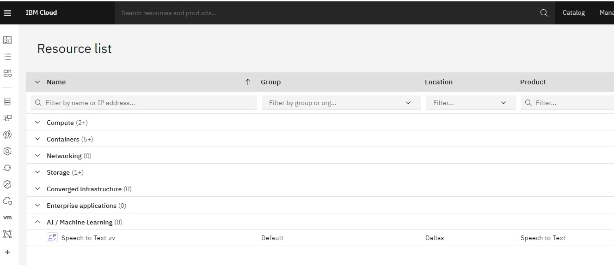
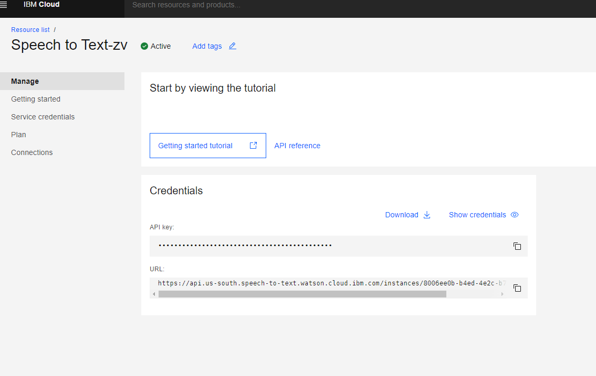
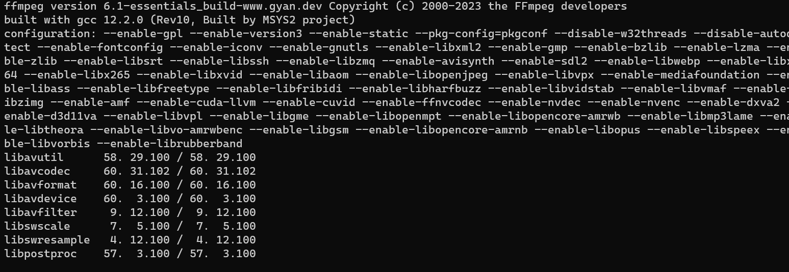
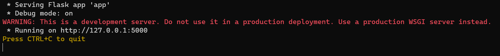
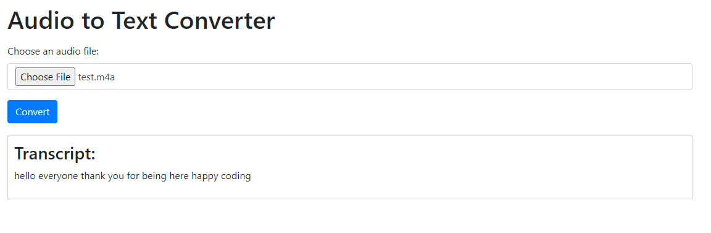

Hello everyone, today we are going to build a webapp that convert speech to text.

We are going to create a Python application that converts audio to text using IBM Watson Speech to Text service. The guide will cover obtaining the necessary credentials from IBM Cloud, setting up the Python environment, and running the application.

## Prerequisites:

- Python installed on your machine. For this demo we are going to use Python 3.10.11,
- ffmpeg
- IBM Cloud account (sign up at https://cloud.ibm.com/registration)

### Step 1: Create Speech to Text service on IBM Cloud

1. Log in to your IBM Cloud account.
2. Go to the IBM Cloud Catalog (https://cloud.ibm.com/catalog).
3. Search for "Speech to Text" in the catalog.
4. Click on the "Speech to Text" service and select a pricing plan that suits your needs.
5. Give a unique name to your Speech to Text instance, and click on "Create" to provision the service.
6. Once the service is created, navigate to the service dashboard.



### Step 2: Obtain the Service Credentials

1. In the Speech to Text service dashboard, click on "Service credentials" in the left-hand menu.
2. Click on "New credential" to create a new set of credentials.
3. Give a unique name to the credentials and click on "Add".



### Step 3: Set up the Python Environment

1. Open a terminal or command prompt.

2. Create a new directory for your project and navigate to it.

3. Create a new Python virtual environment by running the following command:

   ```
   python -m venv .venv
   ```

4. Activate the virtual environment:

   - On Windows:

     ```
     .venv\Scripts\activate
     ```

   - On macOS/Linux:

     ```
     source .venv/bin/activate
     ```

5. We update our pip

   ```
    python.exe -m pip install --upgrade pip
   ```

   

6. Install the required Python packages:

   ```
   pip install flask ibm-watson python-dotenv pydub flask ibm-cloud-sdk-core  ffmpeg-python
   ```

7. We need instal ffmpeg, If we are in windows we can install ffmpeg

   ```
   choco install ffmpeg
   ```

   if you are in linux based debian you can 

   ```
   sudo apt-get update
   sudo apt-get install ffmpeg
   ```

   for further information visit the official site https://ffmpeg.org/download.html.

 To verify that ffmpeg is installed correctly, you can run the following command:

```
 ffmpeg -version 
```



If ffmpeg is installed properly, it will display the version information in the command prompt. That's it! ffmpeg is now installed on your Windows 11 system. You can use it for various multimedia operations or in conjunction with other applications or librarie

### Step 4: Create the Flask Application

1. Create a new file named `app.py` in your project directory.

2. Open `app.py` in a text editor and add the following code:

   ```python
   from flask import Flask, request, jsonify, render_template
   from ibm_watson import SpeechToTextV1
   from ibm_cloud_sdk_core.authenticators import IAMAuthenticator
   import os
   from dotenv import load_dotenv
   import mimetypes
   from pydub import AudioSegment
   
   load_dotenv()
   
   authenticator = IAMAuthenticator(os.getenv("API_KEY"))
   speech_to_text = SpeechToTextV1(authenticator=authenticator)
   speech_to_text.set_service_url(os.getenv("SERVICE_URL"))
   
   app = Flask(__name__)
   
   @app.route('/')
   def index():
       return render_template('index.html')
   
   @app.route('/convert', methods=['POST'])
   def convert_audio_to_text():
       if 'file' not in request.files:
           return jsonify({'error': 'No file provided'}), 400
   
       audio_file = request.files['file']
       file_name = audio_file.filename
       content_type, _ = mimetypes.guess_type(file_name)
       
       if content_type not in ['audio/mpeg', 'audio/mp3','audio/mp4', 'audio/x-m4a']:
           return jsonify({'error': 'Invalid file format'}), 400
   
       file_path = file_name
       audio_file.save(file_path)
   
       if content_type == 'audio/mpeg':
           audio = AudioSegment.from_file(file_path, "mp3")
       else:
           audio = AudioSegment.from_file(file_path, "mp4")
           audio.export("converted_audio.mp3", format="mp3")
           file_path = "converted_audio.mp3"
           content_type = "audio/mp3"
   
       with open(file_path, 'rb') as audio_file:
           response = speech_to_text.recognize(audio=audio_file,
                                               content_type=content_type,
                                               speaker_labels=True,
                                               inactivity_timeout=-1).get_result()
   
       transcripts = [result['alternatives'][0]['transcript'] for result in response['results']]
       transcript = " ".join(x for x in transcripts)
       
       return jsonify({'transcript': transcript})
   
   if __name__ == '__main__':
       app.run(debug=True, use_reloader=False)
   ```

### Step 5: Create the HTML Template

1. Create a new directory named `templates` in your project directory.

2. Inside the `templates` directory, create a new file named `index.html`.

3. Open `index.html` in a text editor and add the following code:

   ```html
   <!doctype html>
   <html lang="en">
     <head>
       <meta charset="utf-8">
       <meta name="viewport" content="width=device-width, initial-scale=1, shrink-to-fit=no">
       <link rel="stylesheet" href="https://maxcdn.bootstrapcdn.com/bootstrap/4.0.0/css/bootstrap.min.css" integrity="sha384-Gn5384xqQ1aoWXA+058RXPxPg6fy4IWvTNh0E263XmFcJlSAwiGgFAW/dAiS6JXm" crossorigin="anonymous">
       <title>Audio to Text Converter</title>
       <style>
           .transcript-container {
               border: 1px solid #ccc;
               padding: 10px;
               margin-top: 20px;
           }
           
           .spinner {
               display: none;
               margin: 20px auto;
               width: 50px;
               height: 50px;
               border: 5px solid #f3f3f3;
               border-top: 5px solid #007bff;
               border-radius: 50%;
               animation: spin 1s linear infinite;
           }
           
           @keyframes spin {
               0% { transform: rotate(0deg); }
               100% { transform: rotate(360deg); }
           }
       </style>
     </head>
     <body>
       <div class="container">
         <h1 class="my-3">Audio to Text Converter</h1>
         <form id="convert-form" enctype="multipart/form-data">
           <div class="form-group">
             <label for="file">Choose an audio file:</label>
             <input type="file" name="file" id="file" class="form-control">
           </div>
           <button type="submit" id="convert-btn" class="btn btn-primary">Convert</button>
         </form>
         
         <div class="spinner"></div>
         
         <div class="transcript-container">
           <h3>Transcript:</h3>
           <p id="transcript"></p>
         </div>
       </div>
       <script src="https://code.jquery.com/jquery-3.2.1.slim.min.js" integrity="sha384-KJ3o2DKtIkvYIK3UENzmM7KCkRr/rE9/Qpg6aAZGJwFDMVNA/GpGFF93hXpG5KkN" crossorigin="anonymous"></script>
       <script src="https://cdnjs.cloudflare.com/ajax/libs/popper.js/1.12.9/umd/popper.min.js" integrity="sha384-ApNbgh9B+Y1QKtv3Rn7W3mgPxhU9K/ScQsAP7hUibX39j7fakFPskvXusvfa0b4Q" crossorigin="anonymous"></script>
       <script src="https://maxcdn.bootstrapcdn.com/bootstrap/4.0.0/js/bootstrap.min.js" integrity="sha384-JZR6Spejh4U02d8jOt6vLEHfe/JQGiRRSQQxSfFWpi1MquVdAyjUar5+76PVCmYl" crossorigin="anonymous"></script>
       <script>
           document.addEventListener('DOMContentLoaded', () => {
               const form = document.getElementById('convert-form');
               const convertBtn = document.getElementById('convert-btn');
               const transcript = document.getElementById('transcript');
               const spinner = document.querySelector('.spinner');
               
               form.addEventListener('submit', async (e) => {
                   e.preventDefault();
                   const formData = new FormData(form);
                   
                   convertBtn.disabled = true;
                   spinner.style.display = 'block';
   
                   try {
                       const response = await fetch('/convert', {
                           method: 'POST',
                           body: formData
                       });
   
                       const data = await response.json();
                       
                       transcript.innerText = data.transcript;
                       convertBtn.disabled = false;
                       spinner.style.display = 'none';
                   } catch (error) {
                       console.error(error);
                       convertBtn.disabled = false;
                       spinner.style.display = 'none';
                   }
               });
           });
       </script>
     </body>
   </html>
   ```

### Step 6: Set Environment Variables

1. Create a new file named `.env` in your project directory.

2. Open `.env` in a text editor and add the following lines:

   ```
   API_KEY=<your-api-key>
   SERVICE_URL=<your-service-url>
   ```

   Replace `<your-api-key>` with the API key obtained from the Speech to Text service credentials, and `<your-service-url>` with the URL of your Speech to Text service instance.

### Step 7: Run the Application

1. Make sure you are in the project directory and the virtual environment is activated.

2. Run the following command to start the Flask application:

   ```
   python app.py
   ```

3. Open a web browser and go to `http://localhost:5000` to access the application.

   

   

4. Choose an audio file and click the "Convert" button.

   

5. The application will convert the audio to text using the IBM Watson Speech to Text service and display the transcript on the page.

That's it! You have successfully created a Python application that converts audio to text using IBM Watson Speech to Text service. Feel free to customize the application and add more features as per your requirements.