Hello today we are going to download some pretrained models for generation of text  to ask interesting questions offline.  For example if we ask some interesting questions about science our bot is capable to answer them. I will show a simple text-generation web application.

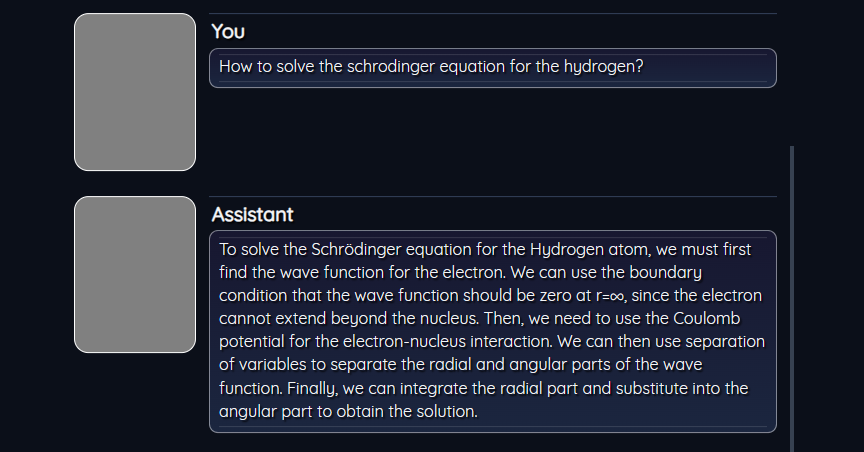

​								*Fig1.  Llama model running on a Laptop with 16Gb of ram and simple GPU with 8gb of ram.*

​								

You can run this assistant on you local computer as you want. 

## Introduction

In recent years, Large Language Models (LLMs), also known as **Foundational Models**, have been trained using large datasets and models with a massive number of parameters, such as the common GPT-3 (175B parameters).  Due to the size of the models , those models requires high performance computing with GPUs that can run fluently.

For this special reason currently the Foundational Models runs in several cloud public services  such as **IBM**, **Microsoft**, **OpenAI** , **Google** , etc.

Therefore, researchers have focused on efficient fine-tuning, known as Parameter-Efficient Fine-Tuning (PEFT).  For example the LoRA network inserted into specific layers to make the model adaptable to different tasks. Instead of fine-tuning the parameters of a large neural network model, the approach may shift towards training a smaller model or weight, and combining it with the specific layer weights of the original LLM. 

There are my models out there that you can test such as:

| Model                                                        | Description                                                  | Paremeters | Supported Laptop | Speed           |
| ------------------------------------------------------------ | ------------------------------------------------------------ | ---------- | ---------------- | --------------- |
| [CodeLlama-7b-Instruct-hf](https://huggingface.co/codellama/CodeLlama-7b-Instruct-hf) | This is the repository for the 7B instruct-tuned version in the Hugging Face Transformers format. This model is designed for general code synthesis and understanding. Links to other models can be found in the index at the bottom. | **7B**     | **Yes**          | **Little Slow** |
| [gpt-j-6b](https://huggingface.co/EleutherAI/gpt-j-6b)       | GPT-J or GPT-J-6B is an open-source large language model developed by EleutherAI in 2021. As the name suggests, it is a generative pre-trained transformer model designed to produce human-like text that continues from a prompt. The optional "6B" in the name refers to the fact that it has 6 billion parameters. | **6B**     | **Yes**          | **Fast**        |
| [gpt2](https://huggingface.co/gpt2)                          | GPT-2 is a transformers model pretrained on a very large corpus of English data in a self-supervised fashion. This means it was pretrained on the raw texts only, with no humans labelling them in any way (which is why it can use lots of publicly available data) with an automatic process to generate inputs and labels from those texts. More precisely, it was trained to guess the next word in sentences. | **124M**   | **Yes**          | **Fast**        |
| [gpt2-xl](https://huggingface.co/gpt2-xl)                    | GPT-2 XL is the 1.5B parameter version of GPT-2, a transformer-based language model created and released by OpenAI. | **1.5B**   | Yes              | **Super Fast**  |
| [flan-t5-large](https://huggingface.co/google/flan-t5-large) | It has strong zero-shot, few-shot, and chain of thought abilities. Because of these abilities, FLAN-T5 is useful for a wide array of natural language tasks. This model is FLAN-T5-Large, the 780M parameter version of FLAN-T5 | **783M**   | **Yes**          | **Fast**        |
| [mpt-7b-instruct2](https://huggingface.co/ibm/mpt-7b-instruct2) | MPT-7B-Instruct2 is a retrained version of the orignal MPT-7B-Instruct model | **7B**     | **Yes**          | **Very Slow**   |
| [NousResearch/Llama-2-13b-hf](https://huggingface.co/NousResearch/Llama-2-13b-hf) | Llama 2 is a collection of pretrained and fine-tuned generative text models ranging in scale from 7 billion to 70 billion parameters. This is the repository for the 13B pretrained model, converted for the Hugging Face Transformers format. | **13B**    | **Yes**          | **Super Slow**  |
| [llama-2-70b-chat](https://huggingface.co/meta-llama/Llama-2-70b-chat-hf) | Llama 2 is a collection of pretrained and fine-tuned generative text models ranging in scale from 7 billion to 70 billion parameters | **7B**     | **No**           | --              |
| [starcoder-15.5b](https://huggingface.co/smangrul/starcoder15B-personal-copilot-merged) | The StarCoder models are 15.5B parameter models trained on 80+ programming languages | **15.5B**  | **No**           | --              |
| [mt0-xxl-13b](https://huggingface.co/bigscience/mt0-xxl-mt)  | BLOOMZ & mT0, a family of models capable of following human instructions in dozens of languages zero-shot. We finetune BLOOM & mT5 pretrained multilingual language models on our crosslingual | **13B**    | **No**           | --              |
| [flan-ul2-20b](https://huggingface.co/google/flan-ul2)       | Flan-UL2 (20B params) from Google is the best open source LLM out there, as measured on MMLU (55.7) and BigBench Hard (45.9). It surpasses Flan-T5-XXL (11B). It's been instruction fine-tuned with a 2048 token window. It uses the same configuration as the [`UL2 model`](https://huggingface.co/google/ul2) | **20B**    | **No**           | --              |
|                                                              |                                                              |            |                  |                 |

There are three models that I will focus more.

## CodeLlama, Flan-T5  and GPT-J 6B

CodeLlama is a collection of pretrained and fine-tuned generative text models ranging in scale from 7 billion to 34 billion parameters, the advantage of this model is that can run on a simple laptop not high end with a gpu.

FLAN-T5 is a pre-trained encoder-decoder model that can perform various text-to-text tasks, It is based on T5, but outperforms it on a large variety of tasks.It is multilingual and uses instruction fine-tuning to improve generalization and usability. FLAN-T5 is intended to be used as a conversational AI assistant that can answer questions, provide explanations, generate text, and engage in dialogue Flan-T5 is released with different sizes: Small, Base, Large, XL and XXL. XXL is the biggest version of Flan-T5, containing 11B parameters

‍GPT-J-6B is an open source, autoregressive language model created by a group of researchers called [EleutherAI](https://www.eleuther.ai/). It’s one of the most advanced alternatives to [OpenAI’s](https://openai.com/) GPT-3 and performs well on a wide array of natural language tasks such as chat, summarization, and question answering, to name a few

## Step 1 . Setup Environment

First we need to install **Conda**

[https://docs.conda.io/en/latest/miniconda.html](https://docs.conda.io/en/latest/miniconda.html)

then we create a new conda environment

```
conda create -n textgen python=3.10.9
conda activate textgen
```

we require   Install  Pytorch, depending on you system you can choose the appropriate command

| System      | GPU      | Command                                                      |      |      |      |
| ----------- | -------- | ------------------------------------------------------------ | ---- | ---- | ---- |
| Windows     | NVIDIA   | `pip3 install torch torchvision torchaudio --index-url https://download.pytorch.org/whl/cu117` |      |      |      |
| Windows     | CPU only | `pip3 install torch torchvision torchaudio`                  |      |      |      |
| MacOS + MPS | Any      | `pip3 install torch torchvision torchaudio`                  |      |      |      |
| Linux/WSL   | NVIDIA   | `pip3 install torch torchvision torchaudio`                  |      |      |      |
| Linux/WSL   | CPU only | `pip3 install torch torchvision torchaudio --index-url https://download.pytorch.org/whl/cpu` |      |      |      |
| Linux       | AMD      | `pip3 install torch torchvision torchaudio --index-url https://download.pytorch.org/whl/rocm5.4.2` |      |      | n    |

For example, I am using a laptop with a Nvidia 2070 RTX.  First I have installed  cuda

[https://developer.nvidia.com/cuda-11-7-0-download-archive](https://developer.nvidia.com/cuda-11-7-0-download-archive)

and later

```
pip3 install torch torchvision torchaudio --index-url https://download.pytorch.org/whl/cu117
```

The up-to-date commands can be found here: [https://pytorch.org/get-started/locally/.](https://pytorch.org/get-started/locally/.)

Then we  Install the web UI

```
git clone https://github.com/Cloud-Data-Science/text-generation-webui.git
cd text-generation-webui
pip install -r requirements.txt
```


## Step 2. Downloading models

The second important step is download the model. Here we must be carefully, not all models can be loaded . You have  to choose the model that are compatible with the the loader.

There are different loaders


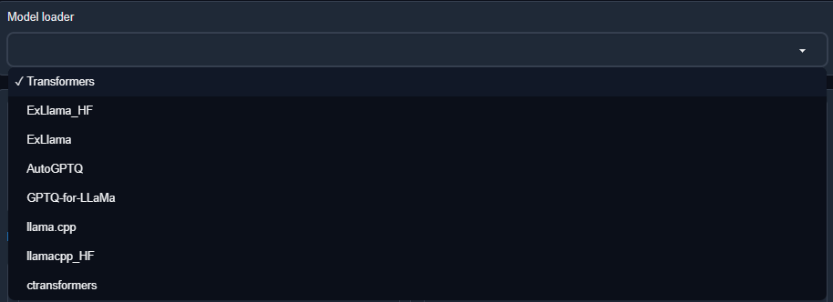

Models should be placed in the `text-generation-webui/models` folder. They are usually downloaded from [Hugging Face](https://huggingface.co/models?pipeline_tag=text-generation&sort=downloads).

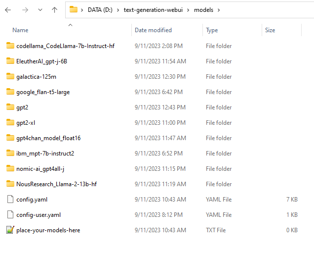


There are different input files of the models. In this loader we can deal with **GPTQ** and **GGUF** types.

- Transformers or **GPTQ** models are made of several files and must be placed in a subfolder. 

- **GGUF** models are a single file and should be placed directly into `models`.

In both cases, you can use the "Model" tab of the UI to download the model from Hugging Face automatically.

 It is also possible to download via the command-line with `python download-model.py organization/model` (use `--help` to see all the options).

For our case we are going to install  **CodeLlama** with **7 billion** parameters , that uses **transformers**,  then  you will need **12.5 GB** of extra space to download.

```
python download-model.py codellama/CodeLlama-7b-Instruct-hf
```

**flan-t5-large** **2.91 GB** 

```
python download-model.py google/flan-t5-large
```

and **GPT 2**   with **124M**   you will need  **10.4 GB** 

```
python download-model.py gpt2																									
```

**[EleutherAI](https://huggingface.co/EleutherAI)/[gpt-j-6b](https://huggingface.co/EleutherAI/gpt-j-6b)**   with **6 billion** parameters you will requiere **22.5 GB**

```
python download-model.py EleutherAI/gpt-j-6b
```

and finally you can download **gpt2-xl**  with **5.99 GB**

```
python download-model.py gpt2-xl
```

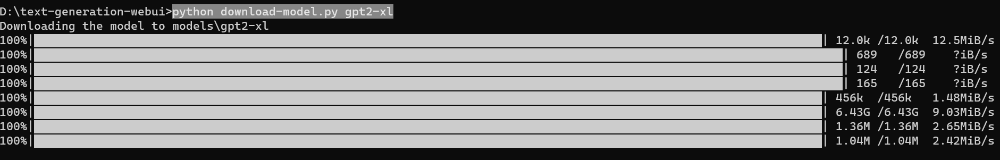

Due to I am planning to run the models in my laptop with 16Gb of Ram and 8GB of GPU NVIDIA 2070 it does not makes sense use larger more than **7 billion** parameters like google/flan-ul2  that has a size of **36.7 GB** 

## Starting the web UI

```
conda activate textgen
cd text-generation-webui
python server.py
```

then 

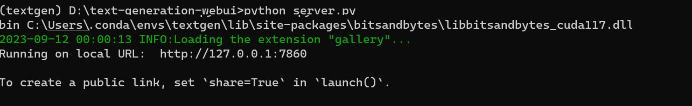

If your enviroment were well installed you simply open your web browser

[http://127.0.0.1:7860/](http://127.0.0.1:7860/)

and you will see your Loader

## Step 3. Setup Loader

Once the program is loaded , go to Model.

1. First click on Refresh models.
2. Select the model, for example codellama
3. Assign a GPU memory, in my case I have assigned `5240` MB
4. Assign a CPU memory, in my case I have assigned `13800` MB
5. Add rope freq

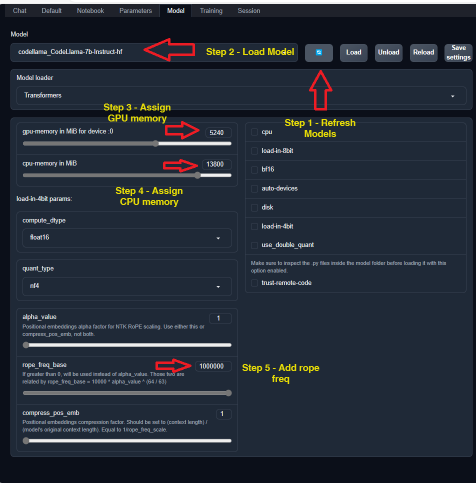

The parameters of the model that I will use are the default ones. So we do not modify them.

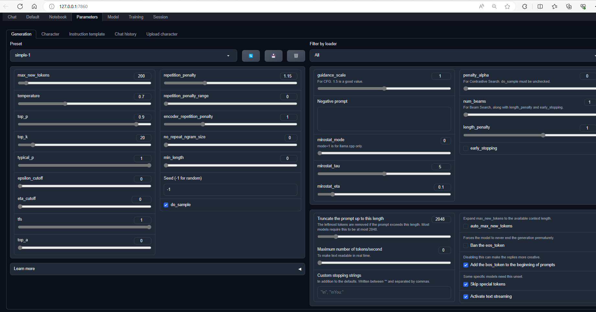

## Testing chat models.

Let us try to ask a complex question for our models.

```
How to solve the schrodinger equation for the hydrogen?
```

LLaMA (Large Language Model **Meta AI**) is a family of large language models (LLMs), released by Meta AI starting in February 2023. For the first version of LLaMa, four model sizes were trained: 7, 13, 33 and 65 billion parameters.

Let us first test a model with **7 billions** of parameters

by using   **CodeLlama-7b-Instruct-hf** developed by **Facebook**

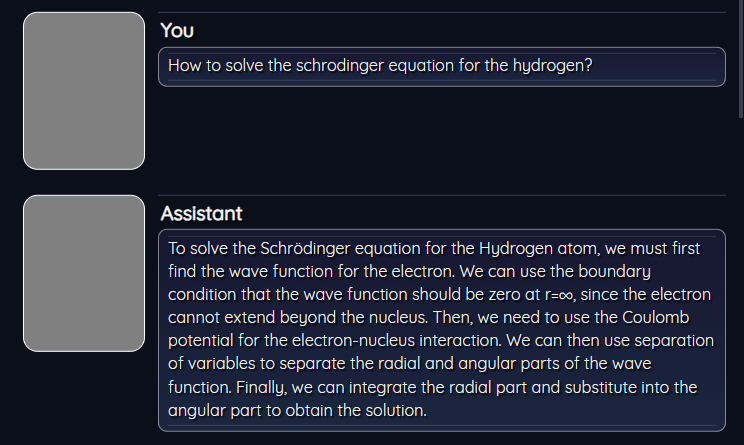

Let us now go  **GPT-J 6B**  developed by  **EleutherAI** we got the following result

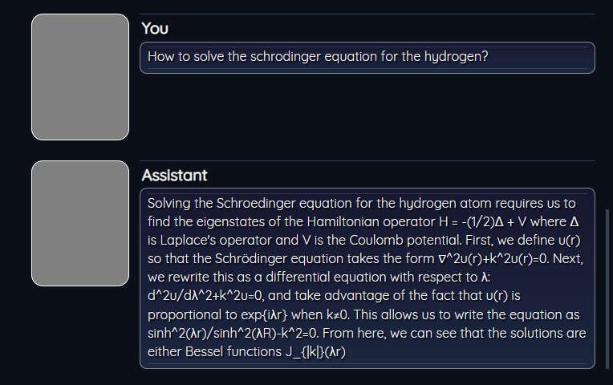

Solution with  **flan-t5-large** developed by **Google** you got:

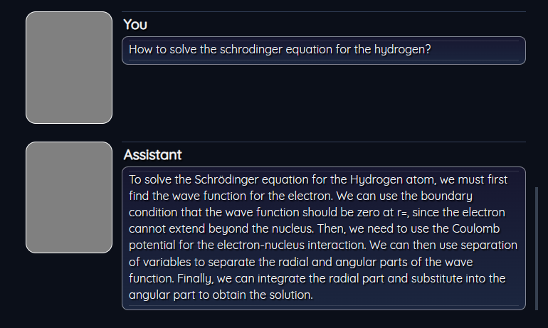

and for **gpt2-xl** developed by **OpenAI** .

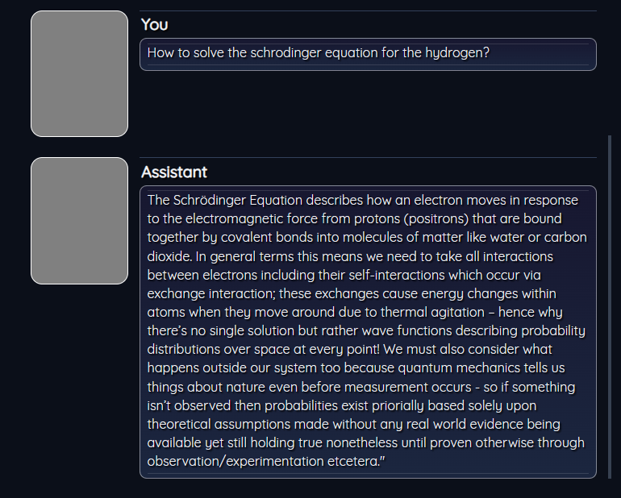

and finally with **mpt-7b-instruct2**, we got the following results:

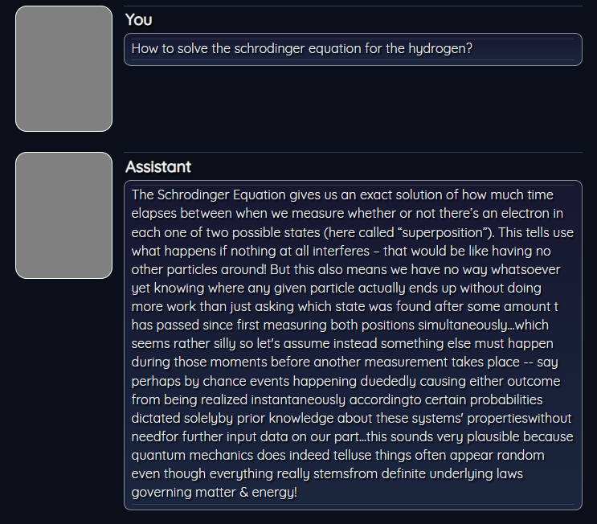

as you see, different models gives different results.

## Conclusions.

We have tested different models among the and we rank them:

| Model                | Comments                                |
| -------------------- | --------------------------------------- |
| 1. **FLAN-T5 LARGE** | Load fast and give good results         |
| 2. **LLaMA-7B**      | Load fast and give excellent results    |
| 3. **GPT-J 6B**      | Load is slow but give standard results  |
| 4. **gpt2-xl**       | Load super fast but results are general |
| 5. **MPT-7B**        | Load is slow and results are poor       |
| 6. **LLaMA2-7B**     | Cannot load properlty                   |

 The most accurate model that answer to our question was  **flan-t5-large**, also is fast,  the second place is for **CodeLlama-7b-Instruct-hf**, is also very concrete.  

The second **CodeLlama-7b-Instruct-hf** the results are very good but due to the performance is not really fast lost the first position. If you dont take care about the performance so this model is a good fit for you. The **mpt-7b-instruct2** and **gpt2-xl** at least for our questions does not give accurate results.

Unfortunately due to our laptop that was used for the test has low specs, we cannot run the latest models with more than 13 billions of parameters. The Llama-2-13b-hf for example has 13 billions ran slow with our testing laptop.

Additional test done by  [Baichuan Group](https://huggingface.co/baichuan-inc/Baichuan2-13B-Chat)  maked an English evaluation dataset comprising 57 tasks, encompassing elementary math, American history, computer science, law, etc [MMLU](https://arxiv.org/abs/2009.03300) . The difficulty ranges from high school level to expert level. It's a mainstream LLM evaluation dataset. With the [open-source](https://github.com/hendrycks/test) evaluation approach.

### 7B Model Results

| Model             | **MMLU** |
| ----------------- | -------- |
|                   | 5-shot   |
| **GPT-4**         | 83.93    |
| **GPT-3.5 Turbo** | 68.54    |
| **LLaMA-7B**      | 35.10    |
| **LLaMA2-7B**     | 45.73    |
| **MPT-7B**        | 27.93    |
| **Falcon-7B**     | 26.03    |

For more references  about how to download more models, you can visit this  [site](https://www.reddit.com/r/ChatGPT/comments/znayz7/downloading_gpt/). If you are interested to see the latest benchmarks of llm models  you can see this [site](https://huggingface.co/spaces/HuggingFaceH4/open_llm_leaderboard).

**Congratulations!** We have tested some foundational models by using our local computer.


