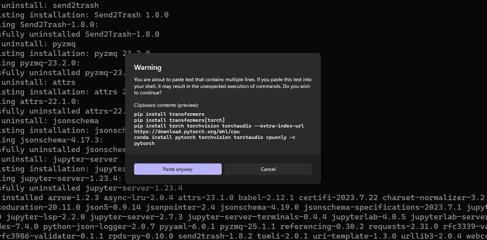
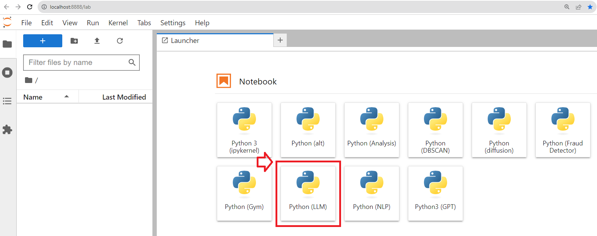
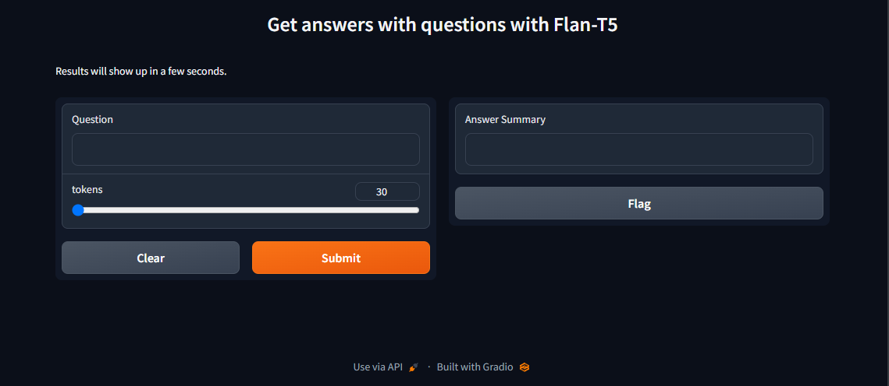
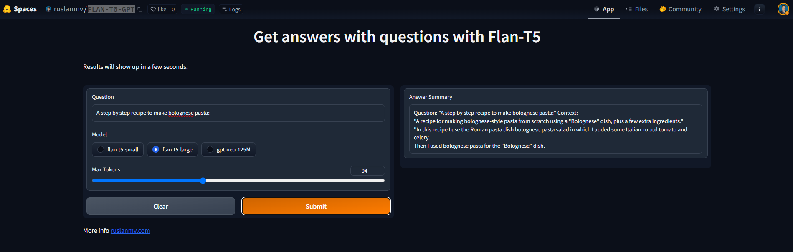

Hello everyone, today we are going to run a Large Language Model (LLM)  Google FLAN-T5 locally and GPT2.

When you are building new applications by using **LLM** and you require a **development environment** in this tutorial I will explain how to do it.

## Introduction 


## FLAN-T5

FLAN-T5 is a Large Language Model open sourced by Google under the Apache license at the end of 2022. It is available in different sizes - see the [model card](https://huggingface.co/docs/transformers/model_doc/flan-t5).

- google/flan-t5-small: 80M parameters; 300 MB download
- google/flan-t5-base: 250M parameters
- google/flan-t5-large: 780M parameters; 1 GB download
- google/flan-t5-xl: 3B parameters; 12 GB download
- google/flan-t5-xxl: 11B parameters

**FLAN-T5 models use the following models and techniques:**

- The pretrained model T5 (Text-to-Text Transfer Transformer)
- The FLAN (Finetuning Language Models) collection to do fine-tuning multiple tasks

**GPTNeo**

The GPTNeo model was released in the [EleutherAI/gpt-neo](https://github.com/EleutherAI/gpt-neo) repository by Sid Black, Stella Biderman, Leo Gao, Phil Wang and Connor Leahy. It is a GPT2 like causal language model trained on the [Pile](https://pile.eleuther.ai/) dataset.


##   Step 1. Installation of Conda

First you need to install anaconda at this [link](https://www.anaconda.com/products/individual)


in this location **C:\Anaconda3** , then you, check that your terminal , recognize **conda**

```
C:\conda --version
conda 23.1.0
```

## Step 2. Environment creation

The environments supported that I will consider is Python 3.10,

I will create an environment called **LLM**, but you can put the name that you like.

```
conda create -n LLM python==3.10
```

then we activate

```
conda activate LLM
```

then in your terminal type the following commands:

```
python -m pip install --upgrade pip
```

```
conda install ipykernel notebook
```

then

```
python -m ipykernel install --user --name LLM --display-name "Python (LLM)"
```

then we can install jupyter lab

```
pip install jupyterlab
```

then we install the following libraries used to the  creation of our environment 

For this 

```
pip install transformers
pip install transformers[torch]
```

If we have CUDA capability we are going to use **CUDA 11.4** and you can download [here](https://developer.nvidia.com/cuda-11-4-0-download-archive)

```
pip install torch==1.12.1+cu113 torchvision==0.13.1+cu113 torchaudio==0.12.1 --extra-index-url https://download.pytorch.org/whl/cu113
```

otherwise

```
pip install torch torchvision torchaudio --extra-index-url https://download.pytorch.org/whl/cpu
conda install pytorch torchvision torchaudio cpuonly -c pytorch
```



```
pip install chardet
pip install fitz
pip install PyMuPDF
conda install -c conda-forge ipywidgets
jupyter nbextension enable --py widgetsnbextension
```

If you have different versions of **CUDA** you can install the best version of torch that fit your computer [here](https://pytorch.org/get-started/previous-versions/)

we would like to create a folder to work

```
mkdir workspace && cd workspace
```

later we open a the jupyter lab

```
jupyter lab
```

then you create a new notebook `Python (LLM)`




## Google FLAN-T5

There are different models of FLAN-T5 out there. For this demo we will use the following Google Models:

- google/flan-t5-small

- google/flan-t5-large

and from EleutherAI the GPT2 model

- EleutherAI/gpt-neo-125M

# Step 3. Large Language Model FLAN-T5 and GTP locally

In this notebook we are going to run different versions of FLAN-T5 and GTP

We define the following prompt:


```python
prompt ="A step by step recipe to make bolognese pasta:"
```

## FLAN-T5-small 

Here we are going to download 300 MB of data of the model


```python
from transformers import AutoModelForSeq2SeqLM, AutoTokenizer
model = AutoModelForSeq2SeqLM.from_pretrained("google/flan-t5-small")
tokenizer = AutoTokenizer.from_pretrained("google/flan-t5-small")
inputs = tokenizer(prompt, return_tensors="pt")
outputs = model.generate(**inputs)
print(tokenizer.batch_decode(outputs, skip_special_tokens=True))
```

    ['Pour a cup of bolognese into a large bowl and add the pasta']


## FLAN-T5-large

Here we are going to download 3GB MB of data of the model


```python
from transformers import AutoModelForSeq2SeqLM, AutoTokenizer
model = AutoModelForSeq2SeqLM.from_pretrained("google/flan-t5-large")
tokenizer = AutoTokenizer.from_pretrained("google/flan-t5-large")
inputs = tokenizer(prompt, return_tensors="pt")
outputs = model.generate(**inputs)
print(tokenizer.batch_decode(outputs, skip_special_tokens=True))
```

    ['Toss the pasta with the sauce, then add the meat and toss again.']


## CUDA Capability


```python
import torch
is_cuda=torch.cuda.is_available()
if is_cuda:
    print("This computer uses CUDA") 
else:  
    print("This computer uses CPU") 
```

    This computer uses CUDA

```python
from transformers import AutoModelForSeq2SeqLM, AutoTokenizer
device = torch.device("cuda" if torch.cuda.is_available() else "cpu")
tokenizer = AutoTokenizer.from_pretrained("google/flan-t5-large")
model = AutoModelForSeq2SeqLM.from_pretrained("google/flan-t5-large").to(device)
```


```python
inputs = tokenizer(prompt, return_tensors="pt").to(device)
```


```python
outputs = model.generate(**inputs)
print(tokenizer.batch_decode(outputs, skip_special_tokens=True))
```

    ['Toss the pasta with the sauce, then add the meat and toss again.']


##  GPT-neo-125M


```python
from transformers import AutoModelForSeq2SeqLM, AutoTokenizer, AutoModelForCausalLM
model = AutoModelForCausalLM.from_pretrained("EleutherAI/gpt-neo-125M")
model.to(device)
tokenizer = AutoTokenizer.from_pretrained("EleutherAI/gpt-neo-125M")
input_ids = tokenizer(prompt, return_tensors="pt").to(device) 
```


```python
#outputs = model.generate(**input_ids)
outputs = model.generate(**input_ids, do_sample=True, max_length=400)
```

    Setting `pad_token_id` to `eos_token_id`:50256 for open-end generation.


```python
generation =tokenizer.batch_decode(outputs, skip_special_tokens=False)
```


```python
print('\n'.join(generation))
```

We got the following results

    A step by step recipe to make bolognese pasta:
    Formalizing the ingredients and sauces
    Wipe up the ingredients
    Wipe the sauce without over or overstitching the ingredients.
    
    FRENCH TENDER
    
    I make a bolognese pasta for a wedding reception, using what I have learned from many other things but one thing about bolognese pasta is that I want a traditional Italian recipe for a wedding. This recipe has an Italian twist:
    
    1/4 ounce Italian sausage cheese
    1/4 ounce Italian sausage salt
    2/3 ounce Italian sausage fresh ramekins
    1/2 ounce Italian sausage chopped onions
    1/2 ounce Italian sausage chopped parsley
    
    In a shallow saucepan, melt butter and sauté onion
    2/3 ounce Italian sausage with and sauce
    salt and pepper
    2/3 ounce Italian sausage chopped parsley
    
    Thoroughly sauté onion until it softens
    2/3 ounce Italian sausage with and sauce
    salt and pepper
    
    Preheat the oven to 325 degrees
    
    Bring a large kettle to 50 to 60°
    
    Sauté onion over medium-high heat
    2/3 ounce Italian sausage with and sauce
    salt and pepper
    
    In a skillet lightly butter a small pot with 2/3 ounce Italian sauce
    salt and pepper
    
    Add 2/3 ounce Italian sauce seasoned with salt, pepper and mix well.
    Sift together sausage, seasoning and garlic
    Add enough water to bring to boil
    
    Slowly pour in ingredients while stirring
    Add enough water to bring to boil
    
    Gravfry the pasta to lightly coat with oil
    Place the pasta on the bottom rack with foil
    
    Heat oil in skillet
    Oil a small stovetop dish with hot brown sugar
    Smoke the sauce. Place your fingers into the meat
    sauté onion over hot oven(s)/heat   


# HuggingFace Enviroment


```python
from transformers import AutoTokenizer, AutoModelForSeq2SeqLM
import torch
import gradio as gr
import re
device = torch.device("cuda" if torch.cuda.is_available() else "cpu")
tokenizer = AutoTokenizer.from_pretrained("google/flan-t5-large")
model = AutoModelForSeq2SeqLM.from_pretrained("google/flan-t5-large").to(device)
class GUI:
    def query(self,query,tokens=30):
        options=""
        tok_len=tokens
        t5query = f"""Question: "{query}" Context: {options}"""
        inputs = tokenizer(t5query, return_tensors="pt").to(device)
        outputs = model.generate(**inputs, max_new_tokens=tok_len)
        return tokenizer.batch_decode(outputs, skip_special_tokens=True)
        
    def begin(self,question,tokens):
        results = app.query(question,tokens)
        return results

app = GUI()
title = "Get answers with questions with Flan-T5"
description = "Results will show up in a few seconds."
css = """.output_image, .input_image {height: 600px !important}"""

iface = gr.Interface(fn=app.begin, 
                     inputs=[ gr.Textbox(label="Question"),
                             gr.Slider(30, 100, value=30, step = 1)
                            ],
                     outputs = gr.Text(label="Answer Summary"),
                     title=title,
                     description=description,
                     #article=article,
                     css=css,
                     analytics_enabled = True, enable_queue=True)
iface.launch(inline=False, share=False, debug=False)
```


    Running on local URL:  http://127.0.0.1:7860
    
    To create a public link, set `share=True` in `launch()`.


```python
iface.launch()
```




## FLAN-T5 vs GTP Neo

Now let us merge all tree models together and check the differences


```python
from transformers import AutoTokenizer, AutoModelForSeq2SeqLM, AutoModelForCausalLM
import torch
import gradio as gr
import re
device = torch.device("cuda" if torch.cuda.is_available() else "cpu")
class GUI:
    def query(self,query,modelo="flan-t5-small",tokens=100):
        options=""
        tok_len=tokens
        t5query = f"""Question: "{query}" Context: {options}"""        
        if (modelo=="flan-t5-small" or modelo=="flan-t5-large"):
           tokenizer = AutoTokenizer.from_pretrained("google/{}".format(modelo))
           model = AutoModelForSeq2SeqLM.from_pretrained("google/{}".format(modelo)).to(device)
           inputs = tokenizer(t5query, return_tensors="pt").to(device)
           outputs = model.generate(**inputs, max_new_tokens=tok_len)
        else:
            model = AutoModelForCausalLM.from_pretrained("EleutherAI/gpt-neo-125M").to(device)
            tokenizer = AutoTokenizer.from_pretrained("EleutherAI/gpt-neo-125M")
            input_ids = tokenizer(t5query, return_tensors="pt").to(device) 
            outputs = model.generate(**input_ids, do_sample=True, max_length=tok_len) 
        generation=tokenizer.batch_decode(outputs, skip_special_tokens=True)
        
        return '\n'.join(generation)
    def begin(self,question,modelo,tokens):
        results = app.query(question,tokens)
        return results

app = GUI()
title = "Get answers with questions with Flan-T5"
description = "Results will show up in a few seconds."
article="More info  <a href='https://ruslanmv.com/'>ruslanmv.com</a><br>" 
css = """.output_image, .input_image {height: 600px !important}"""

iface = gr.Interface(fn=app.begin, 
                     inputs=[ gr.Textbox(label="Question"),
                     gr.Radio(["flan-t5-small", "flan-t5-large","gpt-neo-125M"],label="Model",value="flan-t5-small"),
                     gr.Slider(30, 200, value=100, step = 1,label="Max Tokens"),],
                     outputs = gr.Text(label="Answer Summary"),
                     title=title,
                     description=description,
                     article=article,
                     css=css,
                     analytics_enabled = True
                    ,enable_queue=True)
iface.launch(inline=False, share=False, debug=False)
```


    Running on local URL:  http://127.0.0.1:7860
    To create a public link, set `share=True` in `launch()`.


```python
iface.launch()
```

You can check out this program in the following link:

[https://huggingface.co/spaces/ruslanmv/FLAN-T5-GPT](https://huggingface.co/spaces/ruslanmv/FLAN-T5-GPT)




## Uninstall Environment 

If you have issues to the installation of the kernel you can remove the kernel  and the environment and try again.

To list the kernels currently installed execute

```
jupyter kernelspec list
```

To remove a kernel execute

```
jupyter kernelspec remove LLM
```

and to remove the environment 

```
conda remove -n llm --all
```


**Congratulations!** You have created a web app with Gradio by using LLM Model FLAN-T5 and GPT Neo.

