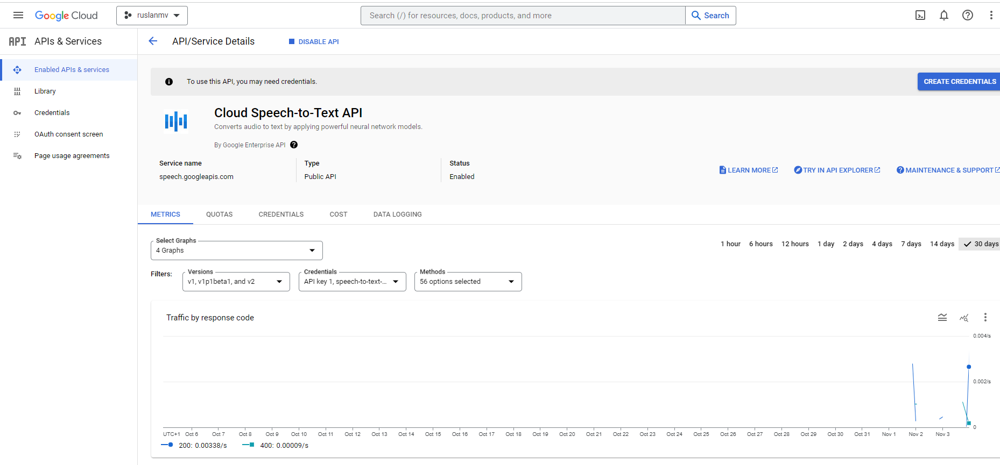
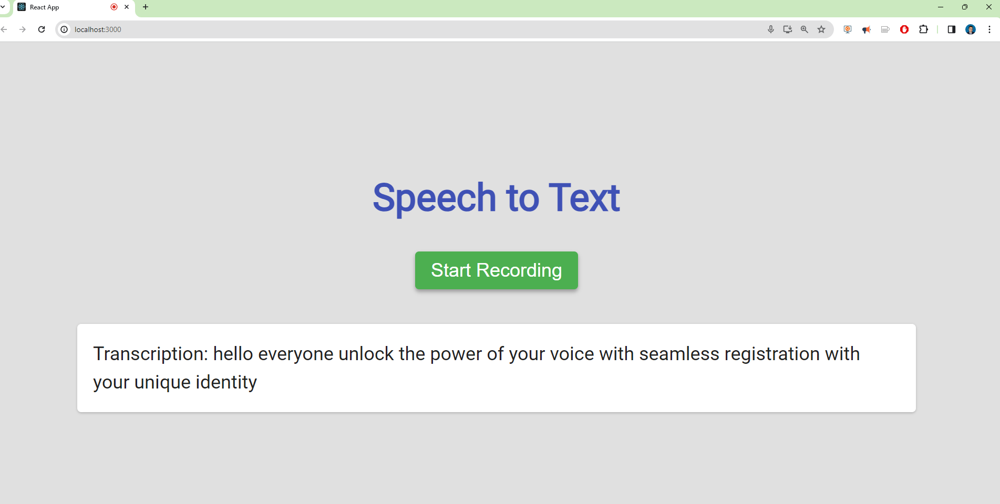
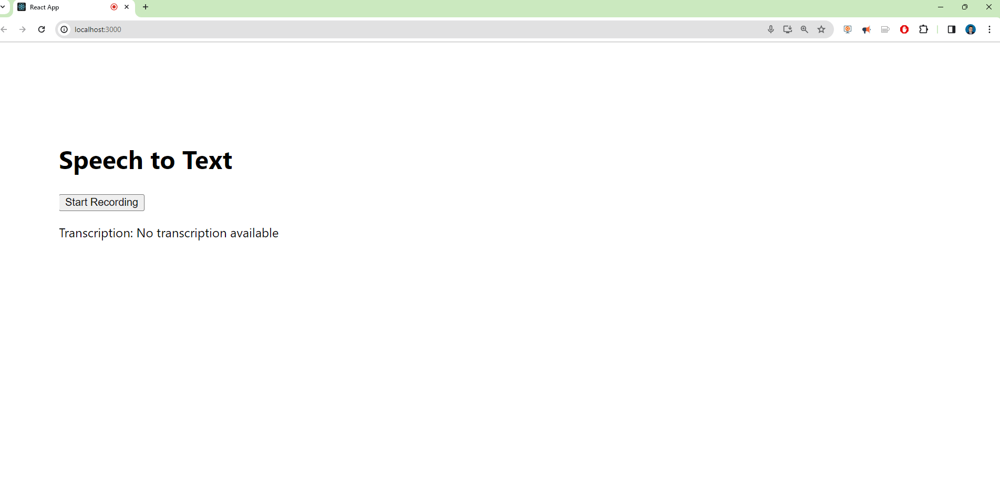

Hello everyone, today we are going to build a **React** **Application** that will convert audio speech to text by using **Google Cloud Platform**.

A React application is a web application or user interface built using the **React** **JavaScript** library. React is a popular and widely used open-source library developed by Facebook. It's specifically designed for building user interfaces and is known for its component-based architecture, which allows developers to create modular, reusable UI elements.

To run  React application in your web browser, follow these steps:

1. Make sure you have Node.js installed on your computer. If you don't, download and install it from the [official Node.js website](https://nodejs.org/). I suggest use ubuntu 22.04 and there install  Node.js.

2. Open a terminal or command prompt.

3. Execute the following commands to create a new React application and navigate to the project folder:

   ```
   npx create-react-app speech-to-text
   cd speech-to-text
   ```

4. Install Axios by running the following command:

   ```
   npm install axios
   ```

5. To get the API key for Google Cloud Platform (GCP) to use the Speech-to-Text service, we need a Google Cloud Platform Account: If you don't already have a Google Cloud Platform account, you'll need to create one. Visit the Google Cloud Platform website and sign up for an account [here](https://console.cloud.google.com/)

6. Create a New Project: Once logged in to the GCP console, create a new project (or use an existing one). The project will serve as the container for resources and services you use.

7. Enable the Speech-to-Text API: In the Google Cloud Console, navigate to the API & Services section. Find the "Library" option and search for "Cloud Speech-to-Text API" or simply "Speech-to-Text API". Enable this API for your project.

8. Create Credentials: After enabling the API, you'll need to create credentials. Go to the "Credentials" section in the Google Cloud Console. Click "Create Credentials" and select "API key". This will generate an API key that you can use to access the Speech-to-Text API.

9. Using the API Key: Once you've obtained the API key, you can use it in your applications to access the Speech-to-Text service.

   

10. To read the API key from a `.env` file,  in the root directory of your project (where `package.json` is located), create a new file named `.env`.

11. Add your API key to the `.env` file in the following format:

    ```
    REACT_APP_GOOGLE_API_KEY=your_api_key   
    ```

    Replace `your_api_key` with your actual Google Cloud Speech-to-Text API key.

12. Replace the contents of the `src/App.js` file with the following code:

    ```javascript
    import axios from 'axios';
    import React, { useState, useEffect } from 'react';

    // Function to convert audio blob to base64 encoded string
    const audioBlobToBase64 = (blob) => {
      return new Promise((resolve, reject) => {
        const reader = new FileReader();
        reader.onloadend = () => {
          const arrayBuffer = reader.result;
          const base64Audio = btoa(
            new Uint8Array(arrayBuffer).reduce(
              (data, byte) => data + String.fromCharCode(byte),
              ''
            )
          );
          resolve(base64Audio);
        };
        reader.onerror = reject;
        reader.readAsArrayBuffer(blob);
      });
    };

    const App = () => {
      const [recording, setRecording] = useState(false);
      const [mediaRecorder, setMediaRecorder] = useState(null);
      const [transcription, setTranscription] = useState('');

      // Cleanup function to stop recording and release media resources
      useEffect(() => {
        return () => {
          if (mediaRecorder) {
            mediaRecorder.stream.getTracks().forEach(track => track.stop());
          }
        };
      }, [mediaRecorder]);

      if (!process.env.REACT_APP_GOOGLE_API_KEY) {
        throw new Error("REACT_APP_GOOGLE_API_KEY not found in the environment");
      }

      const apiKey = process.env.REACT_APP_GOOGLE_API_KEY;
      const startRecording = async () => {
        try {
          const stream = await navigator.mediaDevices.getUserMedia({ audio: true });
          const recorder = new MediaRecorder(stream);
          recorder.start();
          console.log('Recording started');

          // Event listener to handle data availability
          recorder.addEventListener('dataavailable', async (event) => {
            console.log('Data available event triggered');
            const audioBlob = event.data;

            const base64Audio = await audioBlobToBase64(audioBlob);
            //console.log('Base64 audio:', base64Audio);

            try {
              const startTime = performance.now();

              const response = await axios.post(
                `https://speech.googleapis.com/v1/speech:recognize?key=${apiKey}`,
                {
                  config: {
                    encoding: 'WEBM_OPUS',
                    sampleRateHertz: 48000,
                    languageCode: 'en-US',
                  },
                  audio: {
                    content: base64Audio,
                  },
                }
              );

              const endTime = performance.now();
              const elapsedTime = endTime - startTime;

              //console.log('API response:', response);
              console.log('Time taken (ms):', elapsedTime);

              if (response.data.results && response.data.results.length > 0) {
                setTranscription(response.data.results[0].alternatives[0].transcript);
              } else {
                console.log('No transcription results in the API response:', response.data);
                setTranscription('No transcription available');
              }
            } catch (error) {
              console.error('Error with Google Speech-to-Text API:', error.response.data);
            }
          });

          setRecording(true);
          setMediaRecorder(recorder);
        } catch (error) {
          console.error('Error getting user media:', error);
        }
      };

      const stopRecording = () => {
        if (mediaRecorder) {
          mediaRecorder.stop();
          console.log('Recording stopped');
          setRecording(false);
        }
      };

    const mode4 =(
      <div style={{ background: '#E0E0E0', minHeight: '100vh', display: 'flex', flexDirection: 'column', justifyContent: 'center', alignItems: 'center', fontFamily: 'Roboto, sans-serif' }}>
        <h1 style={{ fontSize: '48px', color: '#3F51B5', marginBottom: '40px' }}>Speech to Text</h1>
        {!recording ? (
          <button onClick={startRecording} style={{ background: '#4CAF50', color: 'white', fontSize: '24px', padding: '10px 20px', borderRadius: '5px', border: 'none', cursor: 'pointer', marginBottom: '20px', boxShadow: '0 3px 5px rgba(0,0,0,0.3)' }}>Start Recording</button>
        ) : (
          <button onClick={stopRecording} style={{ background: '#F44336', color: 'white', fontSize: '24px', padding: '10px 20px', borderRadius: '5px', border: 'none', cursor: 'pointer', marginBottom: '20px', boxShadow: '0 3px 5px rgba(0,0,0,0.3)' }}>Stop Recording</button>
        )}
        <p style={{ fontSize: '24px', color: '#212121', maxWidth: '80%', lineHeight: '1.5', textAlign: 'left', background: 'white', padding: '20px', borderRadius: '5px', boxShadow: '0 1px 3px rgba(0,0,0,0.2)' }}>Transcription: {transcription}</p>
      </div>
    );

    return (mode4);
    };
    export default App;

    ```

14. Save the changes to `src/App.js`.
15. Start the development server by running the following command in the terminal or command prompt:

   ```
npm start
   ```

The application should automatically open in your default web browser. If it doesn't, open your browser and navigate to `http://localhost:3000`.

Now you should see the application running in your browser, with a button to start and stop recording and a section to display the transcribed text.




## Description of the Code

The provided code snippet is part of a React application that allows users to start and stop voice recording. When the "Start Recording" button is clicked, the code initiates the recording process by calling the "startRecording" function.

It requests permission from the user to access the audio device using "navigator.mediaDevices.getUserMedia". Inside the function, a MediaRecorder object is created, which captures the audio stream from the microphone.

The recording starts, and an event listener is added to handle "dataavailable" events. These events are triggered whenever there is new audio data available from the microphone.

When a "dataavailable" event occurs, the code converts the captured audio data into a "base64" encoded string and sends it to the Google Speech-to-Text API using the "axios" library. The API request includes audio content, language configuration, and an API key.

 The response from the API is received, and the transcription results are processed. If the API returns a transcription, it is displayed on the screen using a "p" element.

The recording stops when the "Stop Recording" button is clicked. In the code, the "setRecording" and "setMediaRecorder" states are used to track the recording state. The transcription state is also stored in the "transcription" state variable. Overall, this code provides a simple interface for voice recording, sends the audio data to the Google Speech-to-Text API, and displays the resulting transcription on the screen

You can personalize your own colors, I have added some colors examples :

The default theme color is the Google color,  called mode4


```
const mode4 =(
  <div style={{ background: '#E0E0E0', minHeight: '100vh', display: 'flex', flexDirection: 'column', justifyContent: 'center', alignItems: 'center', fontFamily: 'Roboto, sans-serif' }}>
    <h1 style={{ fontSize: '48px', color: '#3F51B5', marginBottom: '40px' }}>Speech to Text</h1>
    {!recording ? (
      <button onClick={startRecording} style={{ background: '#4CAF50', color: 'white', fontSize: '24px', padding: '10px 20px', borderRadius: '5px', border: 'none', cursor: 'pointer', marginBottom: '20px', boxShadow: '0 3px 5px rgba(0,0,0,0.3)' }}>Start Recording</button>
    ) : (
      <button onClick={stopRecording} style={{ background: '#F44336', color: 'white', fontSize: '24px', padding: '10px 20px', borderRadius: '5px', border: 'none', cursor: 'pointer', marginBottom: '20px', boxShadow: '0 3px 5px rgba(0,0,0,0.3)' }}>Stop Recording</button>
    )}
    <p style={{ fontSize: '24px', color: '#212121', maxWidth: '80%', lineHeight: '1.5', textAlign: 'left', background: 'white', padding: '20px', borderRadius: '5px', boxShadow: '0 1px 3px rgba(0,0,0,0.2)' }}>Transcription: {transcription}</p>
  </div>
);
```

The next theme is the Matrix color  named mode3


```
const mode3 = (
  <div style={{ background: 'black', minHeight: '100vh', display: 'flex', flexDirection: 'column', justifyContent: 'center', alignItems: 'center', fontFamily: 'monospace' }}>
    <h1 style={{ fontSize: '48px', color: '#00ff00', marginBottom: '40px' }}>Speech to Text</h1>
    {!recording ? (
      <button onClick={startRecording} style={{ background: 'rgba(0, 255, 0, 0.8)', color: 'black', fontSize: '24px', padding: '10px 20px', borderRadius: '5px', border: '2px solid #00ff00', cursor: 'pointer', marginBottom: '20px' }}>Start Recording</button>
    ) : (
      <button onClick={stopRecording} style={{ background: 'rgba(0, 255, 0, 0.8)', color: 'black', fontSize: '24px', padding: '10px 20px', borderRadius: '5px', border: '2px solid #00ff00', cursor: 'pointer', marginBottom: '20px' }}>Stop Recording</button>
    )}
    <p style={{ fontSize: '24px', color: '#00ff00', maxWidth: '80%', lineHeight: '1.5', textAlign: 'left', background: 'rgba(0, 0, 0, 0.8)', padding: '20px', borderRadius: '5px', border: '2px solid #00ff00' }}>Transcription: {transcription}</p>
  </div>
  );
```

then the next theme multicolors  named mode2


```
const mode2 = (
<div style={{ textAlign: 'center', fontFamily: 'Arial, sans-serif', background: 'linear-gradient(45deg, #a8edea 0%, #fed6e3 100%)', minHeight: '100vh', display: 'flex', flexDirection: 'column', justifyContent: 'center', alignItems: 'center' }}>
<h1 style={{ fontSize: '48px', color: '#4b6cb7', marginBottom: '40px' }}>Speech to Text</h1>
{!recording ? (
  <button onClick={startRecording} style={{ background: '#4b6cb7', color: 'white', fontSize: '24px', padding: '10px 20px', borderRadius: '5px', border: 'none', cursor: 'pointer', marginBottom: '20px' }}>Start Recording</button>
) : (
  <button onClick={stopRecording} style={{ background: '#4b6cb7', color: 'white', fontSize: '24px', padding: '10px 20px', borderRadius: '5px', border: 'none', cursor: 'pointer', marginBottom: '20px' }}>Stop Recording</button>
)}
<p style={{ fontSize: '24px', color: '#333', maxWidth: '80%', lineHeight: '1.5', textAlign: 'left', background: 'white', padding: '20px', borderRadius: '5px' }}>Transcription: {transcription}</p>
</div>
  );
```

and finally the simplest theme the mode1



```
const mode1 = (
    <div>
      <h1>Speech to Text</h1>
      {!recording ? (
        <button onClick={startRecording}>Start Recording</button>
      ) : (
        <button onClick={stopRecording}>Stop Recording</button>
      )}
      <p>Transcription: {transcription}</p>
    </div>
  );
```

Notes: if you have special types of input audio in your programs you can check the supported encodings available at the official google documentation [here](https://cloud.google.com/speech-to-text/docs/encoding).

**Congratulations!** You have learned how to create your React Application that uses speech to text by using Google Cloud Platform.
