As **Generative AI** and large language models (LLMs) have become the center of attention in the artificial intelligence conversation, many organizations are still working on **integrating traditional predictive models** into their operations. These endeavors are often hindered by increasing regulations and public scrutiny, leading to a lesser focus on predictive machine learning models compared to their generative counterparts. Despite this, there remains a significant opportunity to assist clients in addressing various use cases with predictive models.

This project aims to explore a predictive model for assessing the risk associated with auto insurance policies, taking into account different factors about the policyholder. Throughout the project, we will follow the **model's lifecycle from its development phase to the testing and deployment stages**. Additionally, we will set up the model for monitoring and examine how the evaluations are conducted and documented using the **watsonx.governance** platform. This hands-on approach will provide valuable insights into the integration and management of predictive models in the context of auto insurance risk prediction and regulatory compliance.

## Define a Model Use Case

We  will create a use case for a predictive risk model in the model inventory. Let's consider an insurance company that wants to assess the risk associated with auto insurance policies. The company's data science team has gathered data on accident "hotspots" in metro Chicago, where traffic accidents happen more frequently. They have found that policyholders who live closer to these hotspots are more likely to be involved in an accident and file a claim. The team wants to incorporate this data along with other risk factors such as driver age, gender, and vehicle type to build an AI risk prediction model.

To create a use case for the policy evaluation model, follow these steps:

1. Sign in to **IBM Watsonx** using the appropriate link for your region.

2. We go to Resources List and we Launch **Watsonx.Governance**
   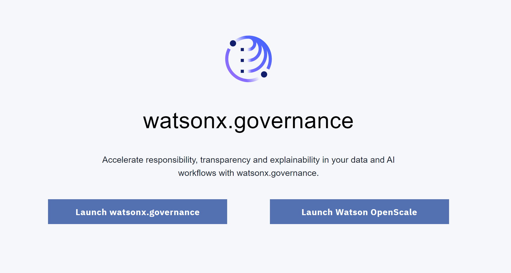

3. Then we click on create  a Sandbox
   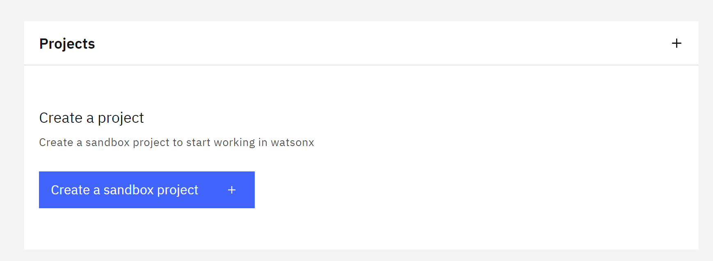

4. Click on the hamburger menu in the upper left to expand it.
   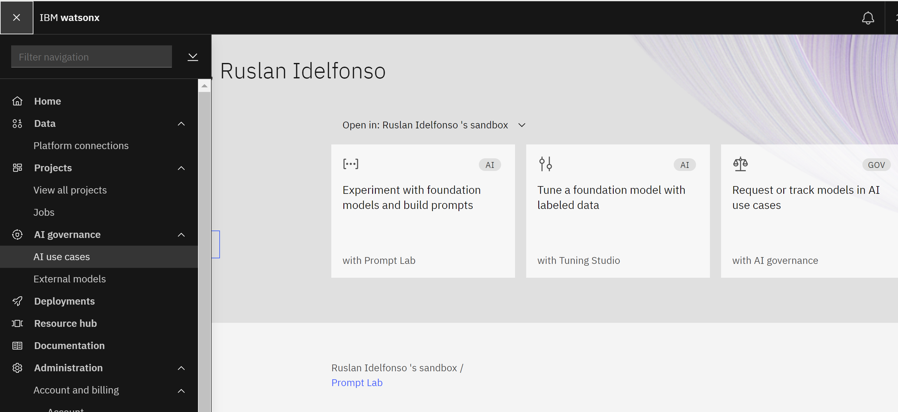

5. Locate the AI governance section of the menu, expanding it if necessary, and click on AI use cases.
   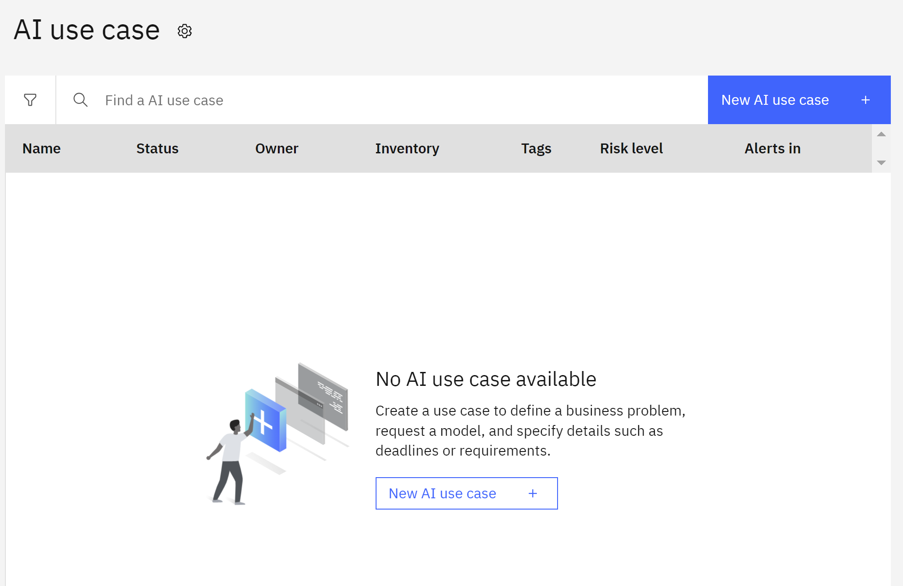

6. Click on the Gear icon to open the Manage menu for AI use cases.
   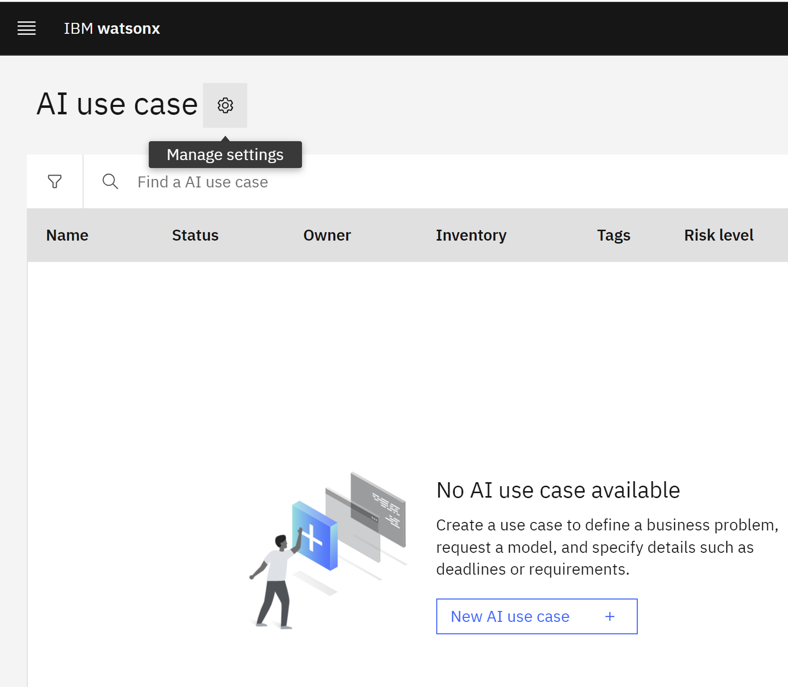

7. Click on the Inventories item from the menu on the left to see the full list of inventories.
   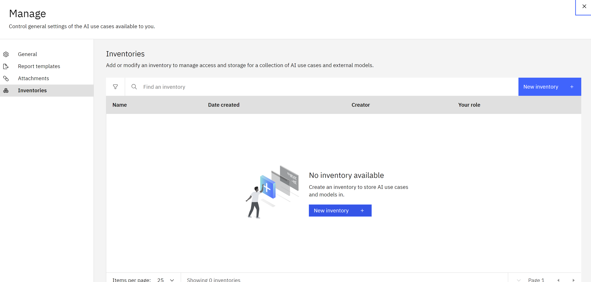

8. Give your inventory a name that includes some identifying
   information such as your email address and the purpose it will be used for. In this case, your inventory will deal with auto insurance models. You may also give your inventory a description. Use the Object storage instance dropdown to select your object storage service.
    

   Once the inventory has been created, you will have the opportunity to add collaborators. Click the x in the upper right to close the Set collaborators window, then click the x in the upper right to close the Manage window.

9. Locate the AI governance section of the menu, expanding it if necessary, and click on AI use cases.
   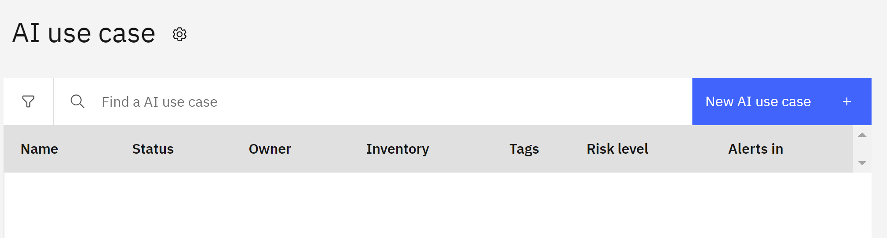

10. Click the New AI use case button to open the New AI use case window
    Give your use case a name. If you are using a shared account, use some identifying information to mark it as belonging to you.
    Provide a description for the business issue the use case is attempting to solve.
     

     Use the Risk level dropdown to set the associated level of risk.
     Use the Inventory dropdown to select the model inventory you identified

    11. Click on the Status dropdown on the right side of the screen and select the Development in progress status.
        Click Create to create the use case.
        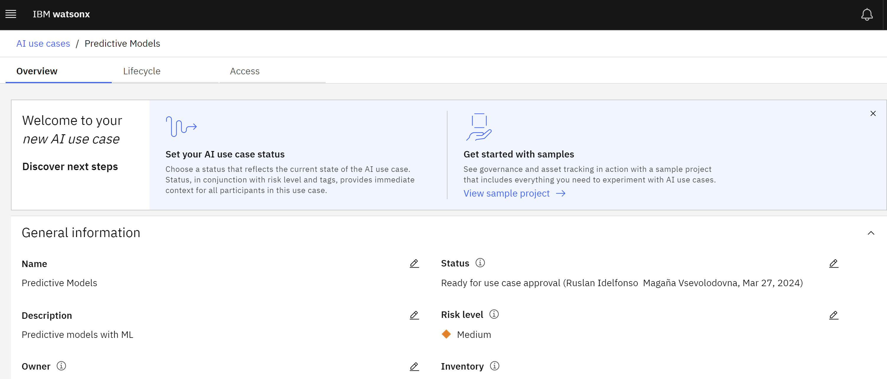

Take a moment to review the use case screen, and note the Access tab, which allows sharing of the use case with other stakeholders to allow collaboration on the model lifecycle.

## Set up a Watsonx Project

In this section, we will create an IBM Watsonx project that will contain all the assets used to deploy and work with the predictive model. Watsonx projects provide a central location for collaboration on data science projects.

To create the project, follow these steps:

1. Right-click on the link for the [project file](https://github.com/ruslanmv/Watsonx-Governance-for-Predictive-Modeling/raw/master/data/Auto-insurance-policy-risk.zip) and choose the appropriate menu option for your browser to download it to your machine. Do not unzip the file.
2. In a separate browser window, navigate to the IBM Watsonx projects screen using the appropriate link for your region.
   [Americas](https://dataplatform.cloud.ibm.com/projects/?context=wx) | [Europe](https://eu-de.dataplatform.cloud.ibm.com/projects/?context=wx) | [Asia Pacific](https://jp-tok.dataplatform.cloud.ibm.com/projects/?context=wx).

3. Create A New project project button on the right.
4. Click the Local file option on the left.

5. Click the Browse button in the middle of the screen, and browse to the zipped Auto-insurance-policy-risk file you downloaded in step one.
6. Give your project a name, ensuring that the name begins with some identifying information such as the beginning of your email address or IBM ID. For example, `Predictive Analytics` - Auto policy risk.
7. Give your project an optional description, then click Create to create the project from a file.
   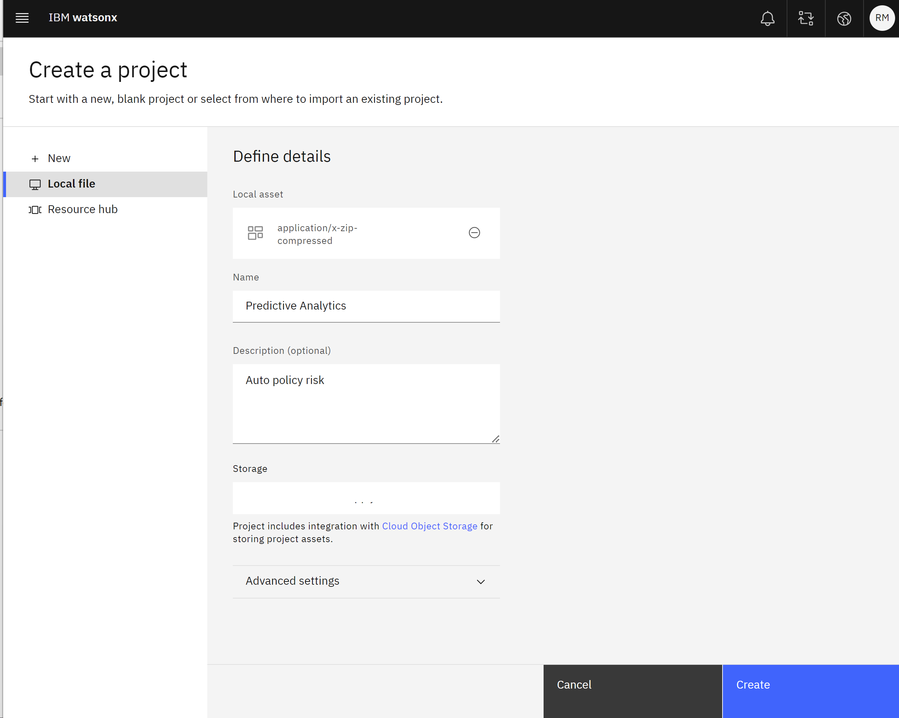

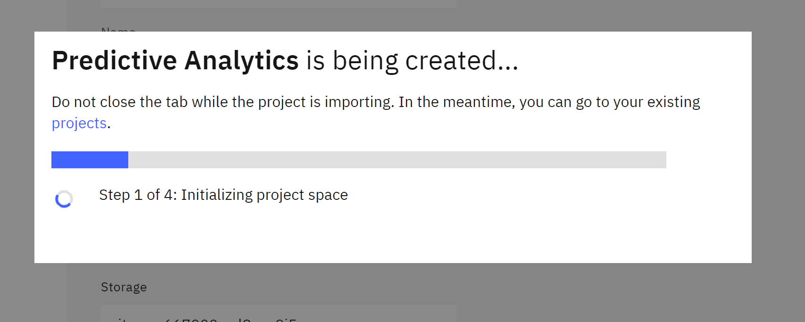

Take a moment to verify and configure the project by following these steps:

1. Click the View import summary button in the Project History tile and ensure that nothing is listed in the Incomplete or Failed categories on the left side of the screen.
   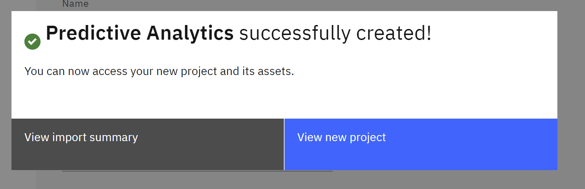
2. If an asset failed to import, you will need to delete and re-import the project.
   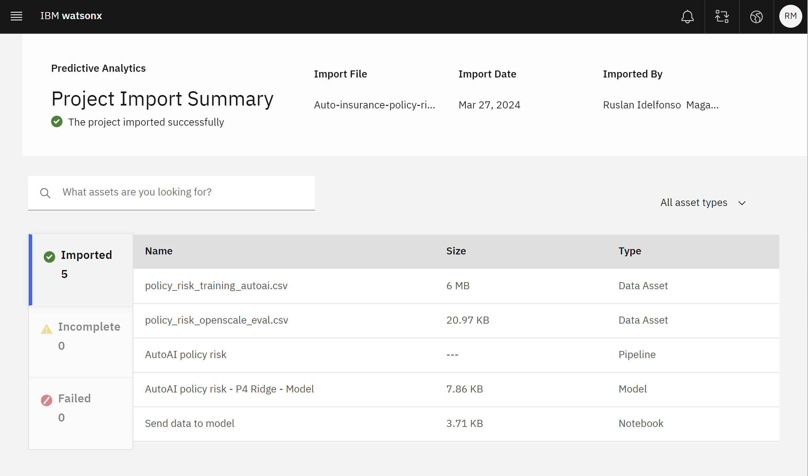
3. Once the project has successfully imported, click the Close button.
4. Click on the Manage tab.
   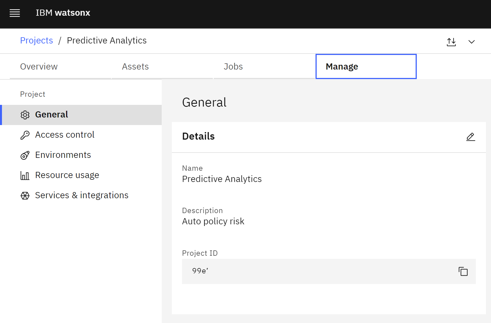
5. Click the Services & integrations item from the menu on the left.
6. Click the blue Associate service button on the right.
   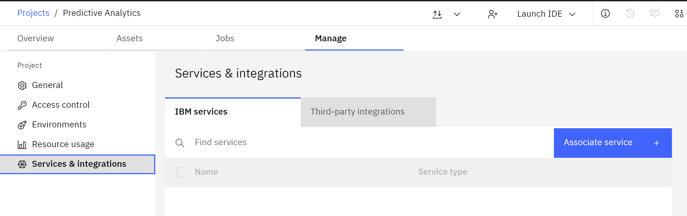
7. Locate the appropriate machine learning service for the account in the table.
8. Check the box to the left of the service.
9. Click the blue Associate button.
   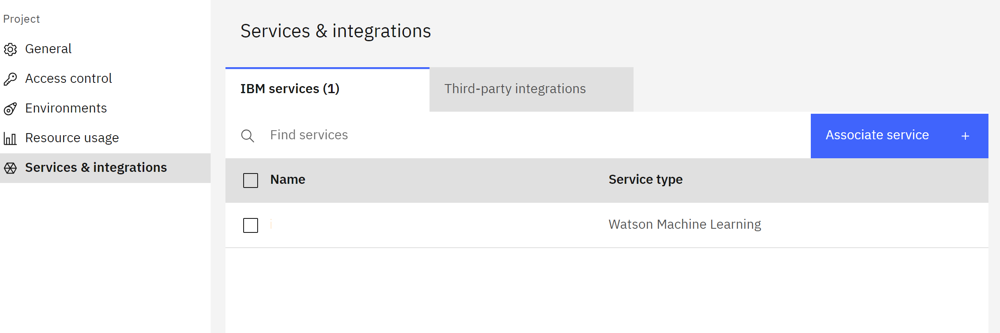
   The project is now configured and ready to use.

## Track the Model

In this section, we will track a model built with AutoAI, IBM's rapid model prototyping service. This service can quickly generate predictive machine learning models from tabular data and save the output as either a Jupyter notebook or a ready-to-deploy model.

To configure model tracking, follow these steps:

1. Click on the Assets tab of the project. Note that the policy_risk_training_autoai.csv file has been provided if you would like to run your own AutoAI experiment or use a different method to create the model.
2. From the list of assets, locate and click on the AutoAI policy risk - P4 Ridge - Model entry to open the model information screen.
   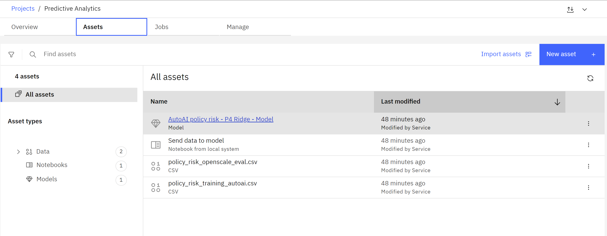
3. Take a moment to review the information presented and note that it can be exported as a PDF report by clicking the Export report link. The metadata includes when the model was created, the identity of the creator, the prediction type, algorithm used, and information on the training dataset.
4. Scroll down to the Training metrics section and note that the initial quality metrics generated by AutoAI during model creation have been captured here. Finally, note that the model's input schema is included.
5. Scroll back up to the top of the model information screen and click the Track this model button. The Track model screen will open.
   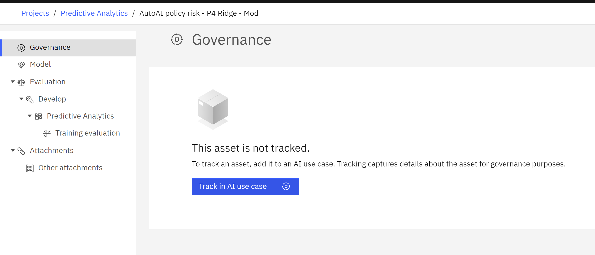
6. Click the radio button to the left of the AI use case you created in a previous step.
7. Click Next.
   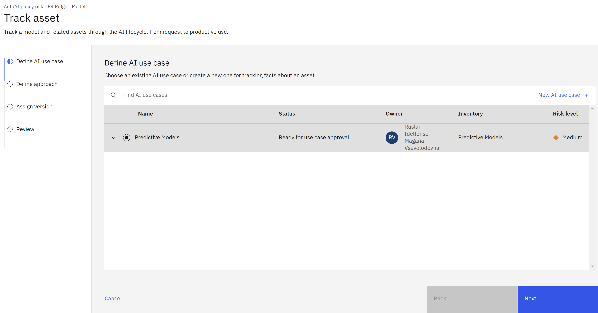
8. When asked to define an approach, leave Default approach selected and click Next.
   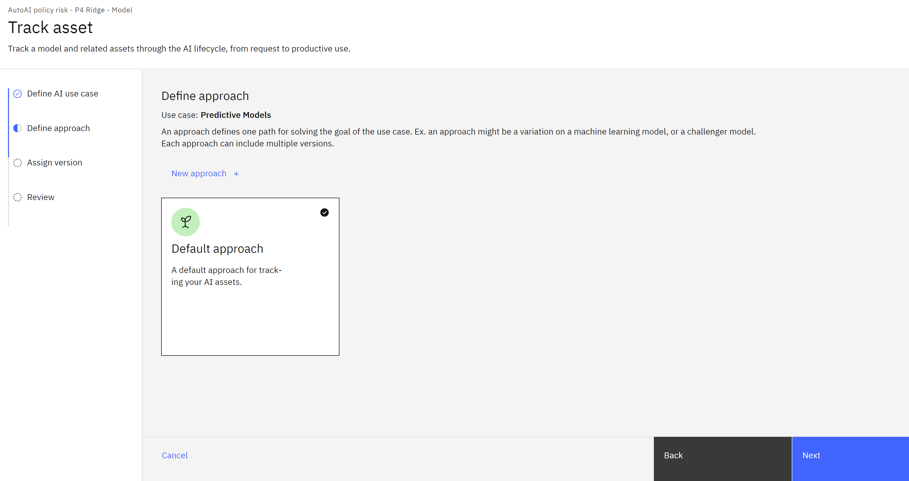
9. When asked to assign a model version, leave Experimental selected. Note that you can manually assign a version number here or choose a more production-ready version number depending on the state of the model.
   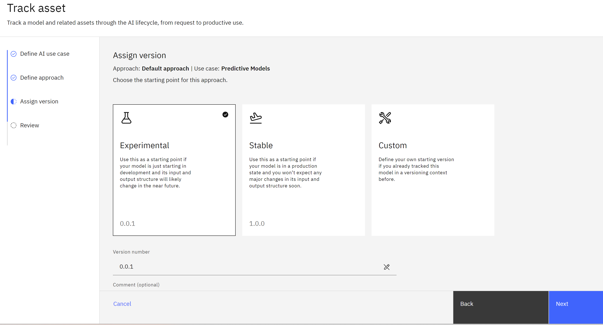
10. Click Track asset to start tracking the model.
    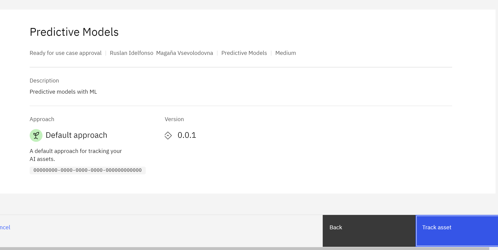
    Once the model tracking has been enabled, you will be returned to the model information screen. You can now view the model information in the use case. Click the View details arrow icon button, and a new tab will open in your browser showing the model use case in your model inventory.
    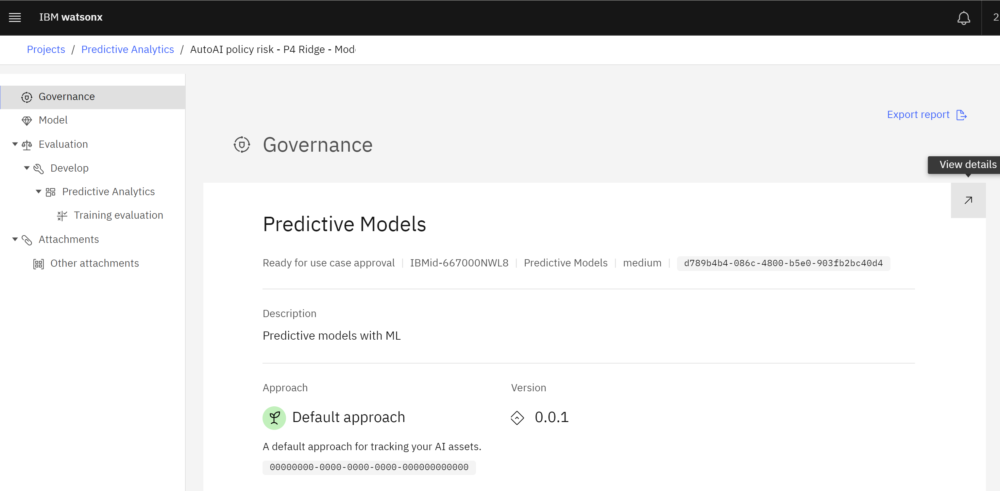
    To view the tracked model, follow these steps:

11. Click on the Lifecycle tab of the use case.
    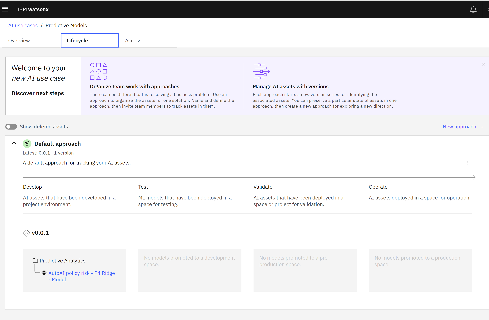

### Lifecycle tab

1. Scroll down to the map of models contained in the Default approach section. Note that there are four lifecycle sections listed (Develop, Test, Validate, and Operate). The tracked model has not yet been promoted to a deployment space, so it is listed in the Develop section of the lifecycle.
2. Clicking on the model name from this screen will show the full model information available from clicking on it from the project.
3. The Lifecycle tab provides a quick overview of all the models attempting to address a particular issue, allowing stakeholders and business users to drill down for more information without needing access to the project where developers and data engineers are working.
4. Model tracking has been enabled, allowing observation of changes as the model goes through the lifecycle.

### Deploy the model

1. Promote the model to a deployment space and deploy it. Deployment spaces are used to organize models and related assets for validation and production access. Deploying the model enables REST API access for further testing.
2. Return to the browser tab showing the model in the project. You can do this by navigating back to your project list and clicking on the model from the Assets tab or the Open in project button in the AI use case view.
3. Click the rocket ship icon to promote the model to a deployment space. The Promote to space screen will open.
   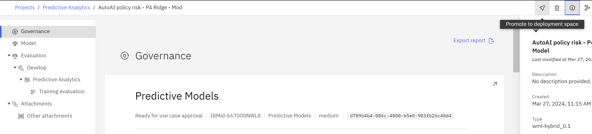
4. Create a new deployment space to contain the models. You can also use an existing space if it is tagged with the correct lifecycle phase.
5. Click on the Target space dropdown and select Create a new deployment space from the list. The Create a deployment space window will open.
   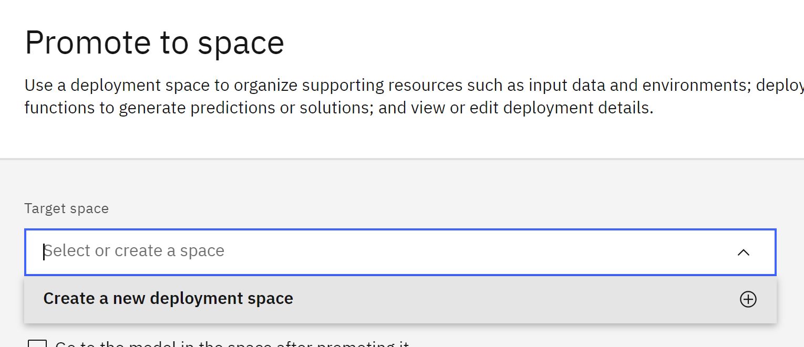
6. Provide a name for the deployment space, including "testing" to indicate it is for testing purposes such `Policy Risk - Testing`.
   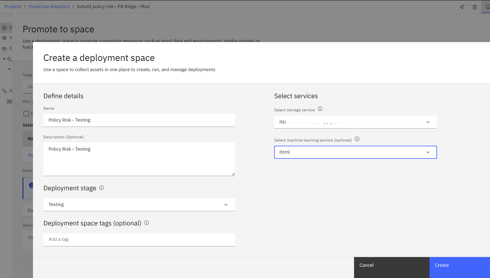

7. Add a description for the space.
8. Select Testing from the Deployment stage dropdown. This ensures that the models deployed in this space will appear in the correct phase of the lifecycle map in the AI use case and use the testing view in the metrics and evaluation screens.
9. Make sure the Select storage service dropdown is set to the correct object storage service for the lab.
10. Select the machine learning service you are using for the lab from the Select machine learning service dropdown.
11. Click the Create button.
    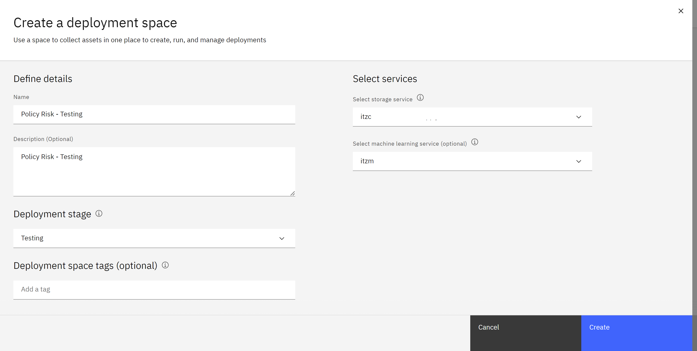
12. Once the space is created, click the Close button to return to the Promote to space screen.
    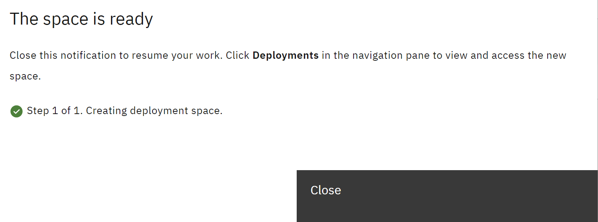
13. The newly created space should appear in the Target space dropdown. Check the box next to Go to the model in the space after promoting it.
14. Click Promote. The deployment space screen will load, with the entry for the model open.
    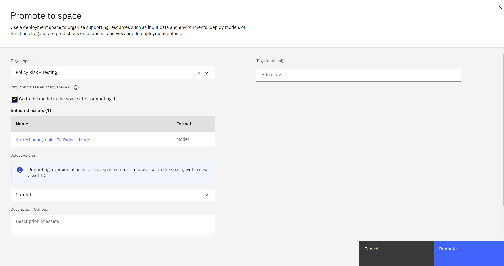

### Create a deployment

1. The model has been promoted to the space. Deployment spaces can contain different types of assets, including models and data for batch processing jobs. Spaces are fully governed, allowing administrators to provide different levels of access for stakeholders.
2. Click the New deployment button. The Create a deployment screen will open.
   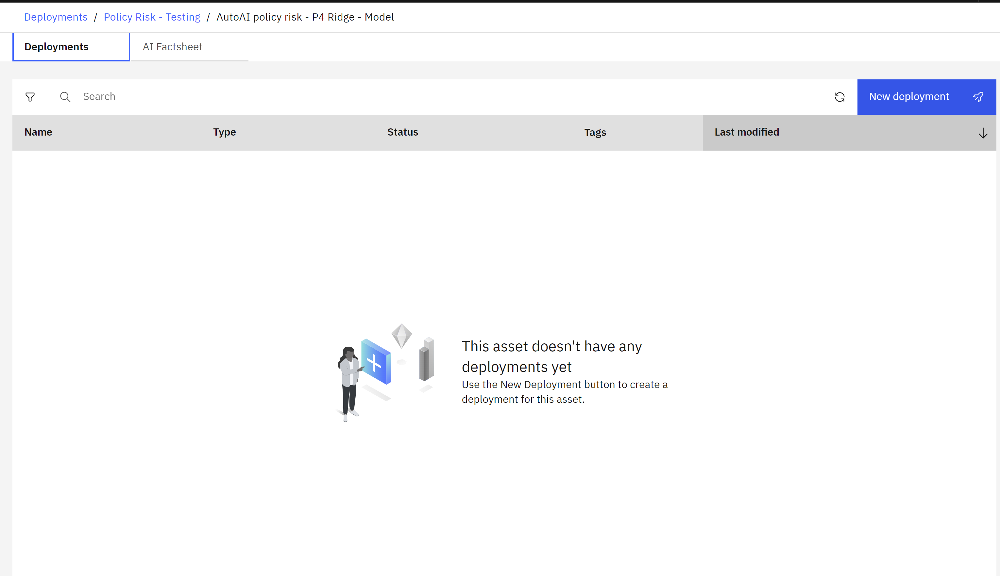
3. Make sure the Online tile is selected, as this deployment type allows REST API access.
4. Give the deployed model a name with personally identifiable information.
   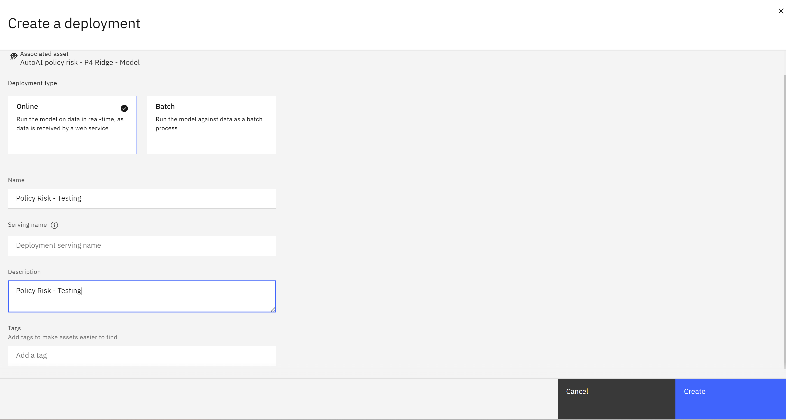
5. Click the Create button. The model deployment will take approximately a minute.
   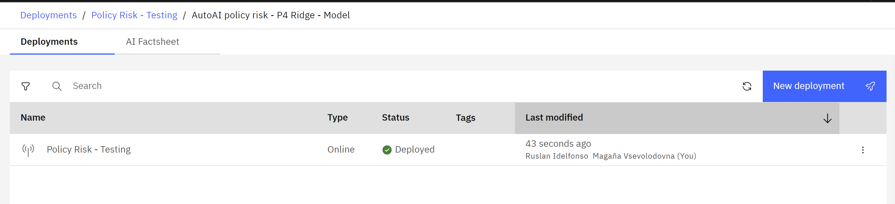

### View the changes in the lifecycle

1. When the deployment is finished, the Status in the displayed table will change to Deployed. Click on the name of the deployment.
2. The deployment details screen will open.
3. Note that the API Reference tab provides details such as direct URLs to the model and code snippets in various programming languages for application developers to include the model in their apps.
   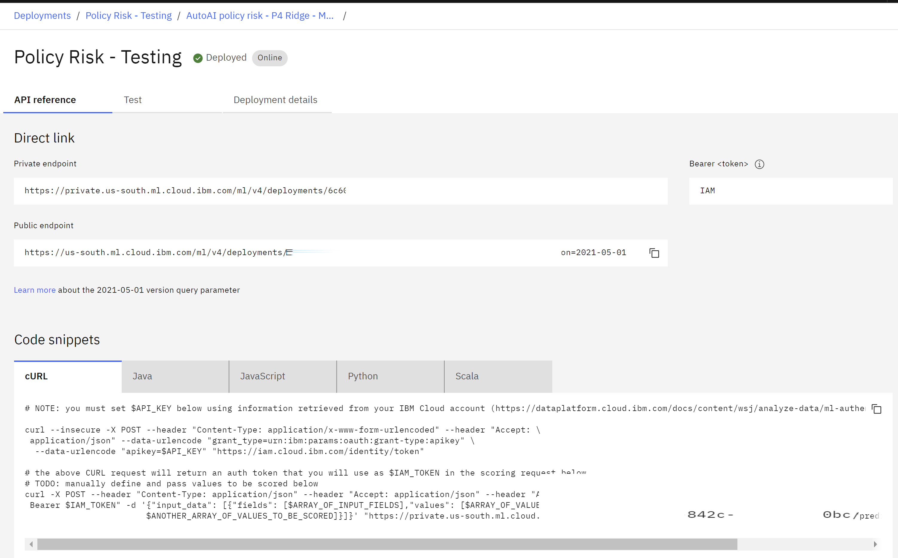
4. Click on the Deployment details tab.
   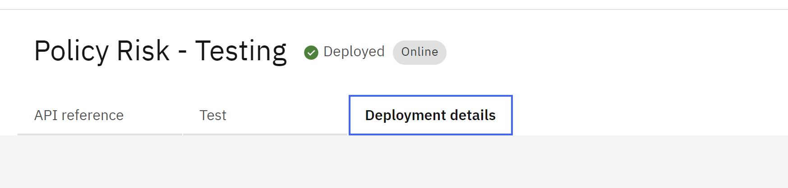
5. In the Track this model section, the model tracking carried over from the project will be shown.
6. Scroll to the bottom of the deployment details screen. In the Interested in more details? tile, click on the arrow icon to open the model factsheet.
   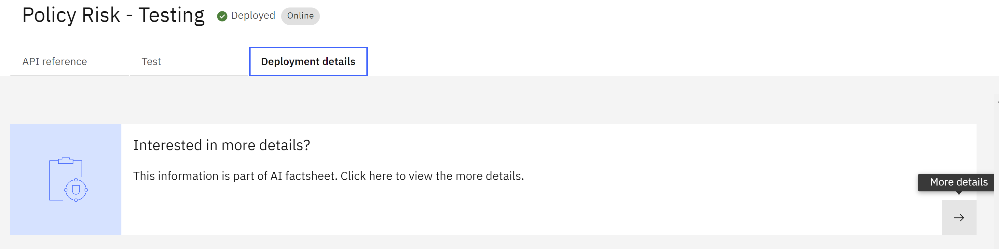
7. Scroll down to the Lifecycle section of the factsheet. The model lifecycle indicator will show that the model is in the Test phase, with a badge indicating an evaluation is pending. This stage allows application developers and data science teams to test the model connection to ensure proper functionality and accessibility.
   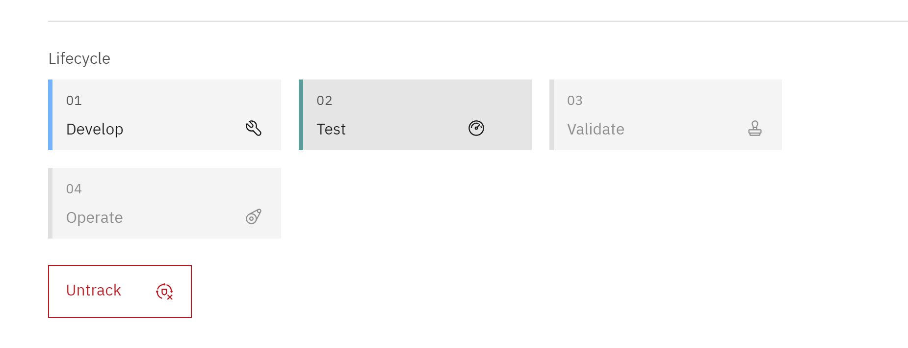
   The next step will be to validate that the model is making fair, accurate decisions.

# Evaluate the Model

In this section, we will evaluate the model for quality and fairness.

## Configure the Deployment Space for Monitoring

Before evaluating the model, we need to configure the deployment space for monitoring. If you have already created a new deployment space for this lab, or if you are using a space that has not been added to the monitoring tool as a machine learning provider, follow these steps:

1. Click [here](https://aiopenscale.cloud.ibm.com/aiopenscale/insights) to navigate to the watsonx.governance monitoring tool's Insights dashboard.
2. Verify that you are signed into the correct account by clicking the avatar icon in the upper right corner of the screen.
3. Ensure that the correct account  is selected in the Account dropdown.
4. If you are using a shared account and are being asked if you would like to run the auto-setup utility or manually configure the service, STOP. Verify once again using the previous steps that you are using the correct account. Do not attempt to configure the service or provision a new service. 
   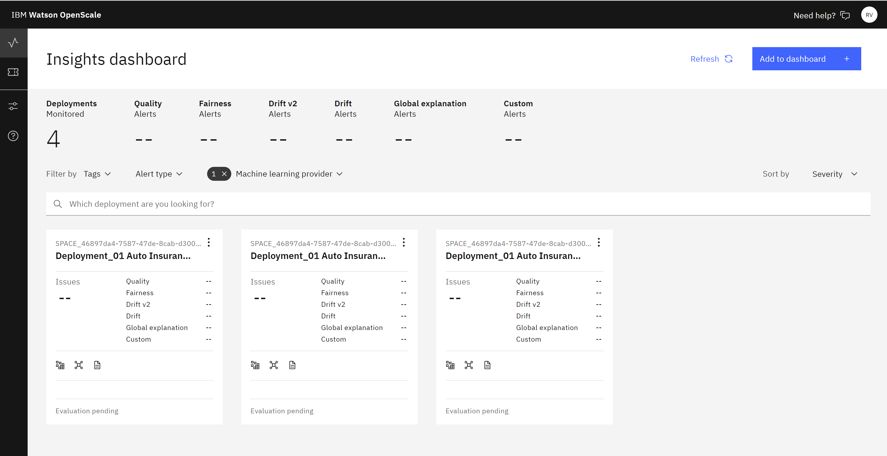
5. Click on the Configure button on the left menu bar.
   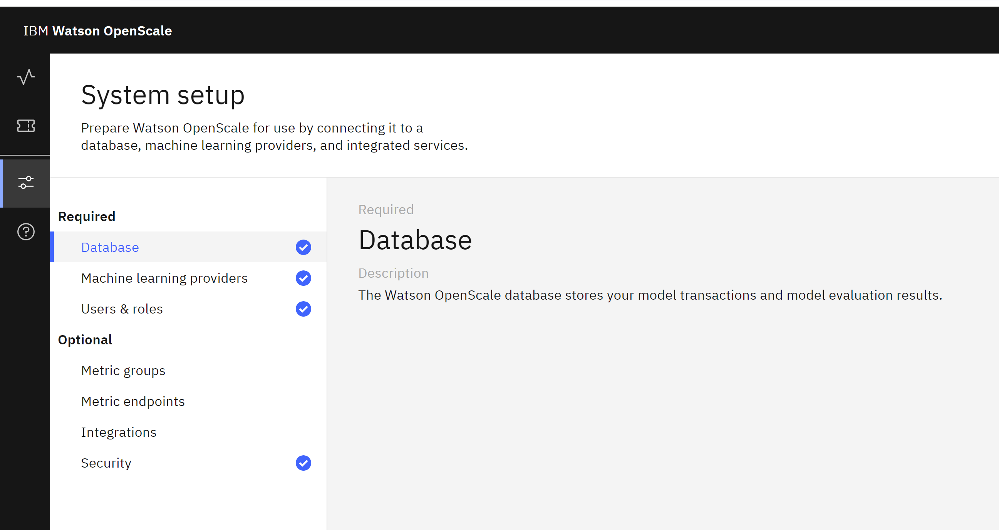
6. From the Required section, click on Machine learning providers.

7. Click on the Add machine learning provider button.
8. Click on the pencil icon to edit the name of the machine learning provider.
9. Give your provider a name with personally identifiable information, and click the blue Apply button.
   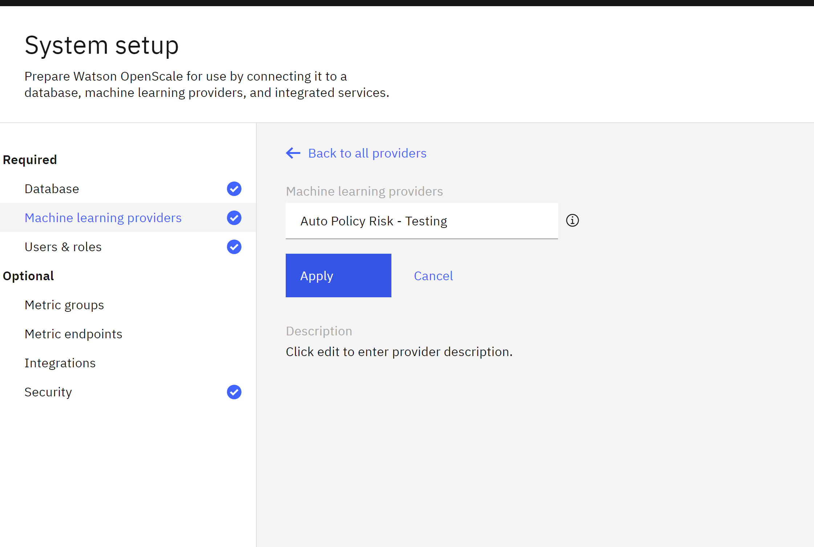
10. Click on the pencil icon in the Connection tile.
    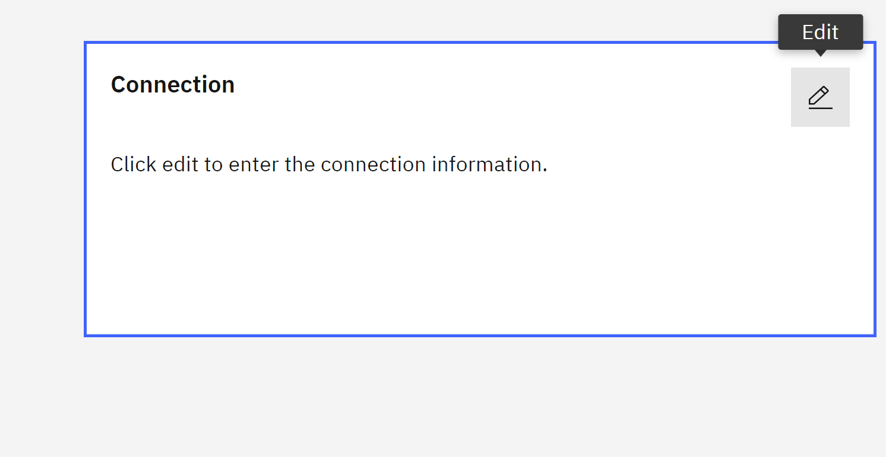
11. Click on the Service provider dropdown, then click on the Watson Machine Learning (V2) option.
12. Click on the Deployment space dropdown, then locate and click on the deployment space you created for this lab. Note that you are specifying the models in this space as Pre-production models.
13. Click on the Save button.
    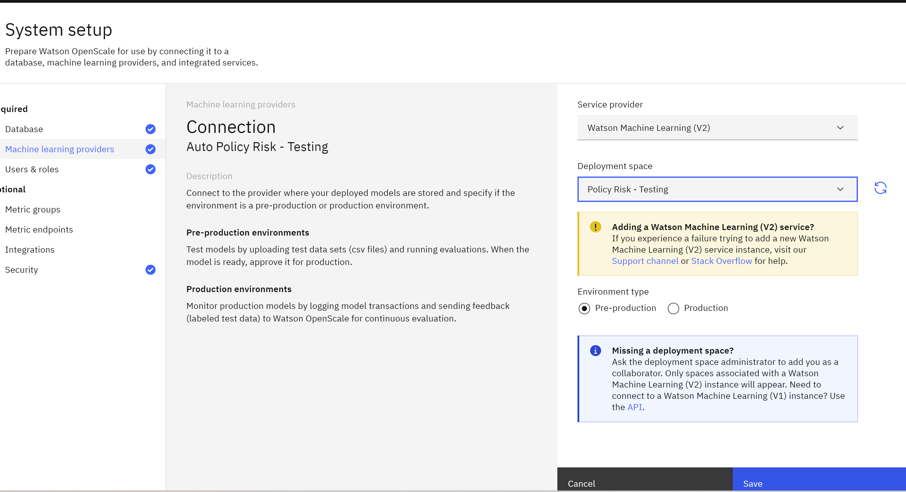

Your deployment space has now been identified as a machine learning provider for the monitoring service. You may now configure monitoring for the model itself.

Click on the monitor icon to return to the Insights dashboard.
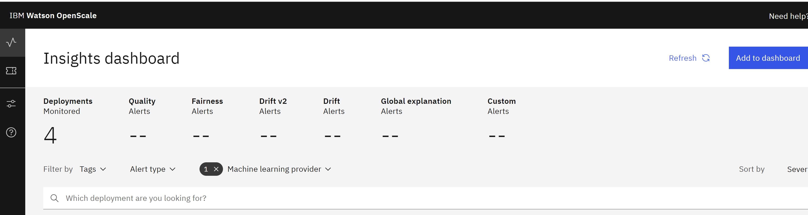

## Add the Model to the Dashboard

To add the model to the dashboard for monitoring, follow these steps:

1. Click on the blue Add to dashboard button. The Select a model deployment screen will open.
2. Click on the Machine learning providers button.
3. From the list of providers, select the one you are using for this lab.
   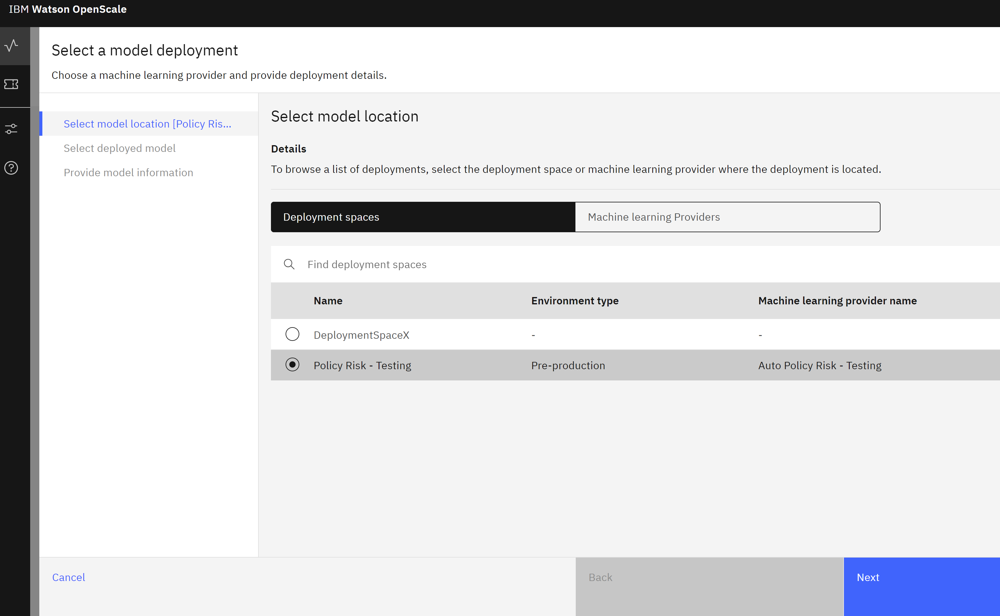
4. Click Next. The monitoring tool will retrieve the list of deployed models in this space.
5. Choose the model you are using for this lab from the list of deployed models.
6. Click Next.
   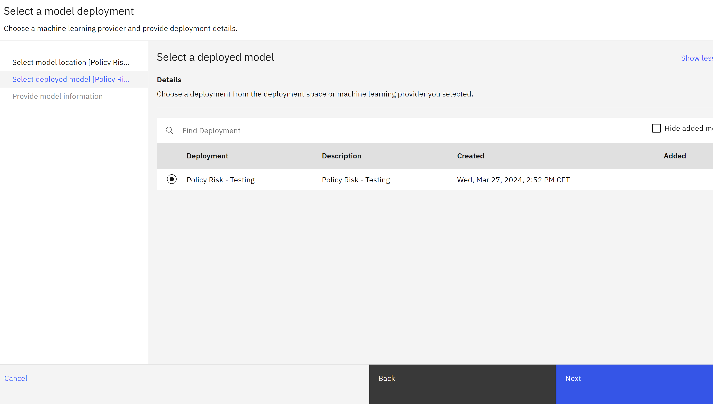
7. The information on the Provide model information screen will be retrieved from the available model metadata. Click the View summary button, then click Finish.
   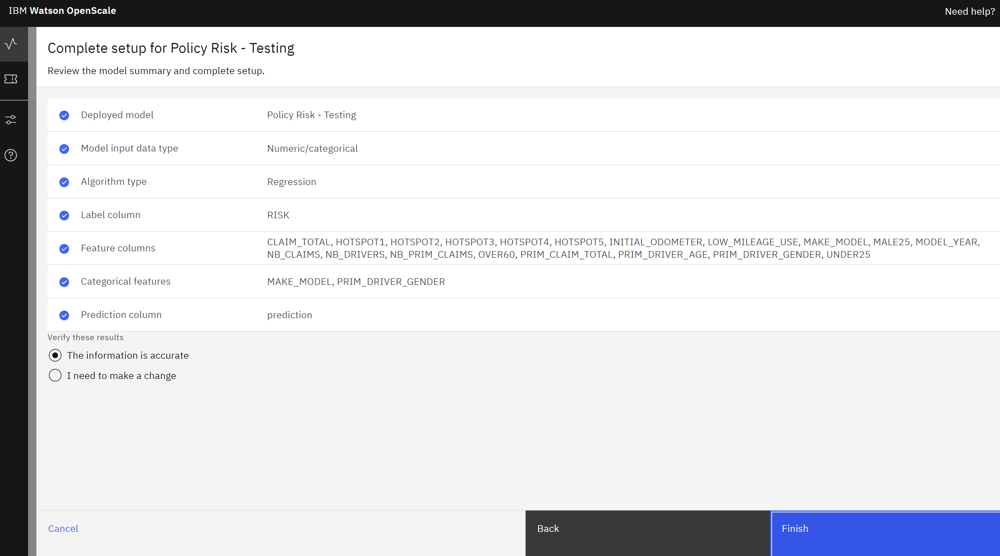
8. After a brief wait, the metrics overview screen for the model will open.

## Gather the Necessary Information

Configuring monitoring for the model requires sending some data to it, which in turn requires some information about the model subscription in the monitoring service. Follow these steps to gather the necessary information:

1. From the model metrics overview screen, click Actions.
2. From the dropdown menu, click View model information.
   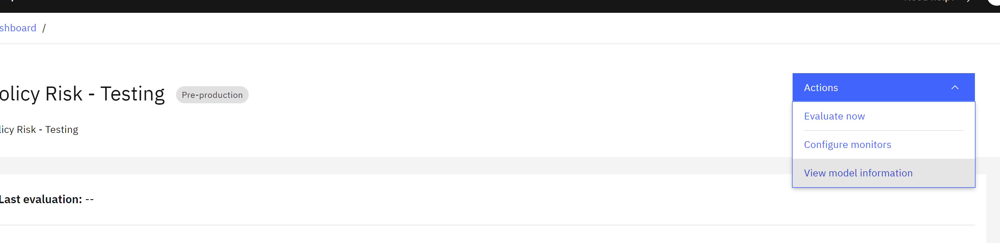
3. Copy and paste the values for Evaluation datamart ID and Subscription ID into a text file, making sure to note which value is which. You will use these two values in a Jupyter notebook in the next step.

In a different browser window, navigate to the IBM [Cloud API keys page](https://cloud.ibm.com/iam/apikeys) for your account, signing in if necessary.
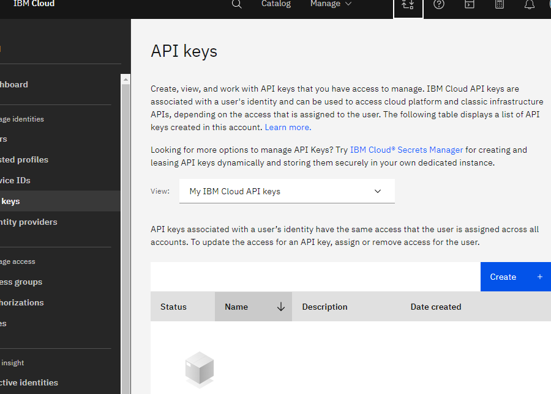

1. Click the Create button.
2. Give your API key a name and click Create.
3. Click the Copy icon beneath your API key to copy it to your clipboard. Paste it into a text file for later use.
   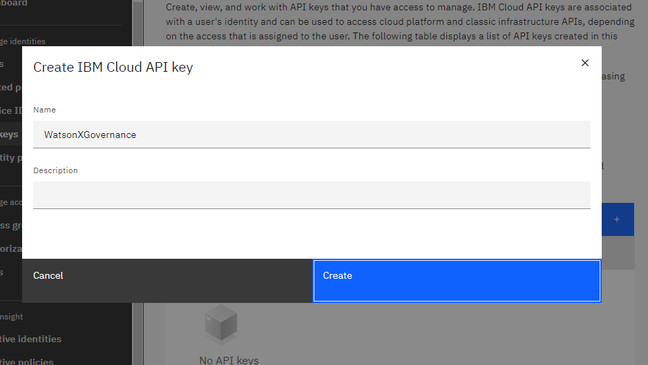

## Send Data to the Model

To send data to the model and run an evaluation, follow these steps:

1. Return to the project you are using for this lab. If necessary, you can find it from the project list accessed from the link: Americas | Europe | Asia Pacific.
2. Click on the Assets tab of the project.
3. Locate the Send data to the model notebook from the list of assets. Click on the three dots to the right of it to open the options menu.
   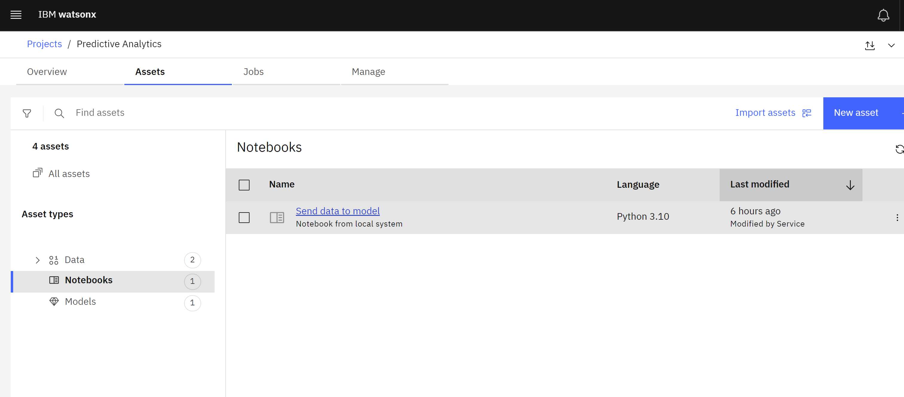
4. Click Edit. The watsonx Jupyter notebook editor will open.
5. Copy and paste the values you gathered in the previous step into the first code cell, ensuring that they are contained within the quotation marks on each line.
   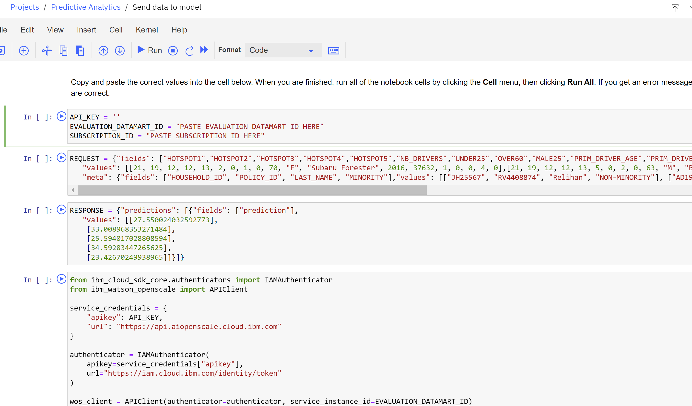  
6. Click the Cell item from the menu above the code cells.
7. Click Run All to run all the code cells. They should take roughly 30 seconds to complete.
8. If the code cells ran successfully, you should see a message below the bottom code cell indicating a successful completion. If you received an error message, double check that you used the correct values in the first code cell and run all the code cells again.
   

## Connect to the Training Data

Next, we will configure the individual monitors for the model. Follow these steps:

1. Return to the monitoring Insights dashboard.[https://aiopenscale.cloud.ibm.com/aiopenscale/insights](https://aiopenscale.cloud.ibm.com/aiopenscale/insights)
2. Click on the tile for the model you configured for monitoring in a previous step.
3. Click on the Actions button to open the Actions dropdown.
4. Click on Configure monitors.
   
5. Click the Edit icon in the Training data tile.
   
6. Leave the Use manual setup option selected for Configuration method, and click Next.
   
    The Specify training data screen opens.
7. Click on the Training data option dropdown, and click Database or cloud storage.
8. Click on the Location dropdown, and click Cloud Object Storage.
9. Copy and paste the provided value into the Resource instance ID field.
10. Copy and paste the provided value into the API key field.
11. Click Connect.
    
12. Click on the Bucket dropdown and click on the desired bucket.
13. Click on the Data set dropdown to select the desired data set.
    
14. Click Next.
15. The monitoring tool should correctly identify the feature and label columns. Click Next.
    
16. The monitoring tool also correctly identifies the prediction field. Click View summary to continue.
17. Click Finish to save the training data setup.
    

## Configure the Fairness Monitor

To configure the fairness monitor, follow these steps:

1. From the list of Evaluations on the left, click on Fairness.
   

2. Click on the Edit icon in the Configuration tile.
   

3. Leave the Configure manually option selected and click Next.
   

4. Follow the instructions to specify the favorable , bdteween 0 and 39 and unfavorable outcomes between 40 and 100.

5. Set the minimum sample size and click Next.
   

6. Leave the selected monitored metrics set to Disparate impact and click Next.

   

7. Set the Minimum sample size to 100 and click Next.

8. 

   

   Use the checkboxes to deselect PRIM_DRIVER_AGE and PRIM_DRIVER_GENDER.
   

Scroll to the bottom of the feature list, and check the box next to MINORITY. Click Next.
      

11. Use the checkboxes to specify MINORITY as the Monitored group and NON-MINORITY as the reference group. Click Next.
    
    Use the default alert threshold (80), and click Save to finish configuring the fairness monitor. It may take up to a minute for the configuration to save, at which point you will be returned to the model settings screen.

## Configure the Quality Monitor

To configure the quality monitor, follow these steps:

1. From the list of Evaluations on the left, click on Quality.
   
2. Click the Edit icon on the Quality thresholds tile.
3. Leave the default threshold values as they are and click Next.
4. Set the Minimum sample size 100 value and click Save to save the quality configuration.
   

## Configure the Explainability Service

To configure the explainability service, follow these steps:

1. In the Explainability section, click on General settings
   
2. In the Explanation method tile, click on the Edit icon.
   
3. Two different methods are available for explanations: Shapley Additive Explanations (SHAP) or Local Interpretable Model-agnostic Explanations (LIME). As described in hint that appears when you click the Information box, SHAP often provides more thorough explanations, but LIME is faster.

Leave the LIME method selected and click Save.

## Run an Evaluation

Now that the model monitors have been configured, you can run an evaluation of the model. Follow these steps:

1. Return to the Insights dashboard by clicking on the Dashboard link in the upper left.
2. Click on the tile for the model you configured for monitoring.
3. Click on the Actions button to open the Actions menu.
4. Click on Evaluate now.
   
5. Download import test data [policy_risk_openscale_eval.csv](https://github.com/ruslanmv/Watsonx-Governance-for-Predictive-Modeling/raw/master/data/policy_risk_openscale_eval.csv) and run the evaluation.
6. Click Upload and evaluate. Note that the evaluation can take up to several minutes to perform. If it fails for any reason, following the same steps and re-running the evaluation typically fixes the issue.
   

## View the Results

Once the evaluation is complete, you can view the quality and fairness results. Take a moment to review the different metrics and understand the results.

Note: The results may vary each time you perform the evaluation based on the content of the random sample of the evaluation data.

To view the quality results, click on the Quality tile.

 The quality table will display the metrics and any violations.

To view the fairness results, click on the Fairness tile. The fairness graph will show the calculated fairness and any alerts for fairness issues.

Once you have reviewed the results, you can proceed to the next steps as needed.


### 6. Explain a prediction

AI models are not only required to meet standards for quality and fairness, but they also need to provide explanations for the decisions or predictions they make. 

To generate detailed explanations for predictive models, Watsonx.governance offers an explainability service. When configuring the explainability service, you can specify the algorithm to be used. From the table of transactions, you can click on one of the "Explain prediction" links. For more interesting results, try to find a prediction that is close to the threshold for an unfavorable outcome, which is set at 39 when configuring the fairness monitor.

The explainability service will use the LIME algorithm to generate a detailed explanation, but please note that this process may take a few minutes to complete. Once the explanation is generated, you can scroll down to the graph that depicts the influence different features had on the model's outcome. In the graph, features displayed in blue indicate an increase in the final score, while features in red indicate a decrease.

From the table of transactions, click one of the Explain prediction links.


For classification models, blue features signify a positive contribution to the model's confidence in the prediction, while red features indicate a decrease in confidence. It's important to remember that your explanation may differ from the provided screenshot, as it depends on the specific contributors to the risk score assigned. You can hover your cursor over the individual columns of the graph for more information.

To further explore the model's behavior, you can click on the "Inspect" tab. Here, you have the ability to alter values associated with a record and re-submit it to the model. This allows you to see how the final risk calculation changes based on different inputs. It can be particularly useful for gaining insights into the model's functioning or for policyholders seeking ways to decrease their risk assessment.


### 7. View the updated lifecycle

After generating metrics for your model, you can now observe the updates in the model lifecycle. To do this, follow these steps:

1. Sign in to IBM Watsonx using the appropriate link for your region
2. Click on the hamburger menu located in the upper left corner to expand it.
3. Locate the AI governance section in the menu and expand it if necessary.
4. Click on "AI use cases" in the AI governance section.
5. In the table of use cases, you will see an alert listed in the "Alerts" column. This alert reflects the quality alerts discovered during the previous evaluation.
   
   
6. Click on the your use case that you have been using for this section of the lab.
7. On the use case page, click on the "Lifecycle" tab.
   
8. Scroll down to the lifecycle visualization. You will notice that the model now appears in the "Validate" section of the lifecycle.
9. Next to the name of the deployed model, you will see a red alert badge, indicating that there may be issues with the model.
10. Click on the name of the deployed model to access its information screen.
11. Scroll down to the "Quality" and "Fairness" sections of the model information screen.
    
        
     Here, you can see the evaluation metrics generated by the monitoring tool. These metrics are automatically stored on the model's factsheet, providing stakeholders such as risk managers and data scientists with access to the information they need to assess model performance. If further information is required, there is an optional link provided that will open the monitoring tool.

## Conclusion, 

AI models should not only meet quality and fairness standards but also provide explanations for their predictions. By using tools like **Watsonx.governance**, you can generate detailed explanations for your predictive models, assess their performance, and make necessary adjustments. This ensures a transparent and reliable AI system that respects users' rights and complies with regulations.