Hello everyone, today we are going  to create a chatbot with **Generative AI** with IBM  **WatsonX**. We are going to discuss how to connect **IBM WatsonX.ai** with **Watson Assistant.**


There are different ways to integrate **WatsonX** with **Watson Assistant.** One way is by using an third party integration [NeuralSeek](https://cerebralblue.github.io/neuralseekweb/overview/)  by  Cerebral Blue LLC that turns Watson Discovery into an intelligent, conversational answer and curation service for Watson Assistant. A second way that I will present in this blog is by simple beta toolkit addon of Watson Assistant to WatsonX 

## Step 1 - Download the json extension.

First we need to download the following json file
[https://github.com/watson-developer-cloud/assistant-toolkit/blob/master/integrations/extensions/starter-kits/language-model-watsonx/watsonx-openapi.json](https://github.com/watson-developer-cloud/assistant-toolkit/blob/master/integrations/extensions/starter-kits/language-model-watsonx/watsonx-openapi.json)

## Step 2 - Create your Watson Assistant at IBM Cloud

Then we need to create our Watson Assistant.

[https://www.ibm.com/products/watson-assistant/artificial-intelligence](https://www.ibm.com/products/watson-assistant/artificial-intelligence)

After it is created  we go to **Integrations**

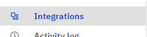

then we go to **Extensions** and click Build custom extension

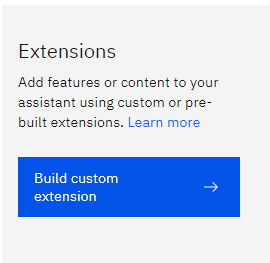

We click next and then we can name like WatsonX extension then next and we attach our wasonx openapi.json

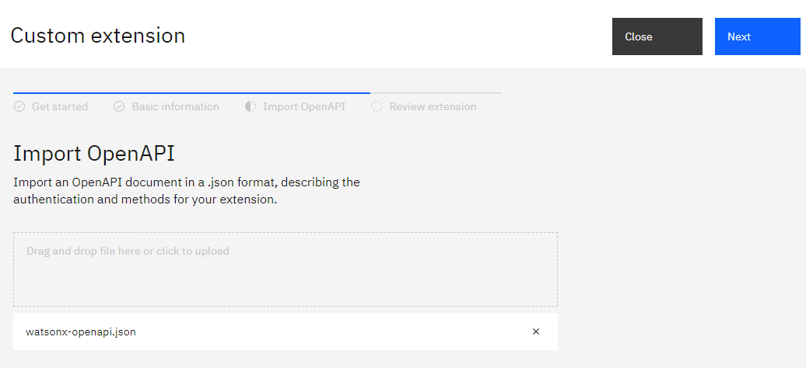then we have to add the **WatsonX** extension to Watson Assistant by click in Add
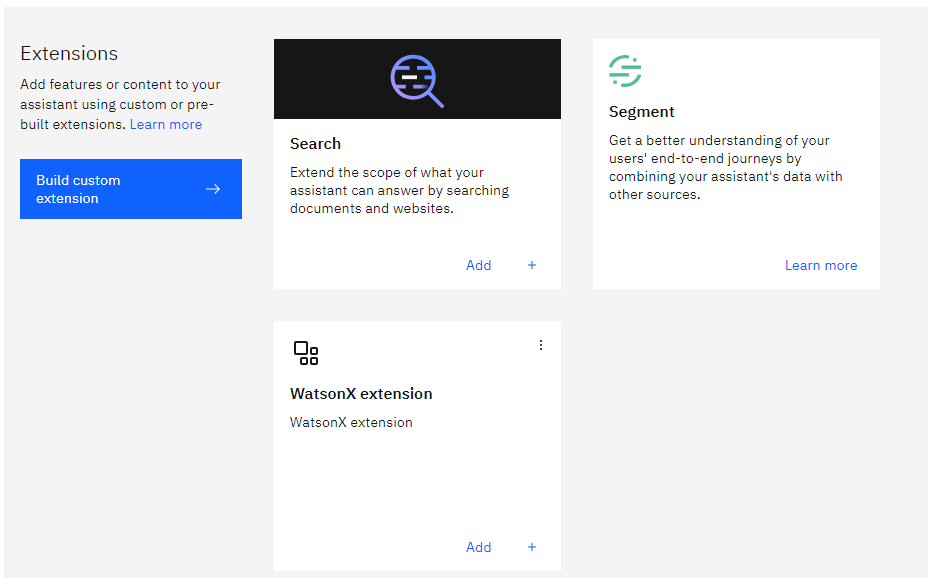
you click Add
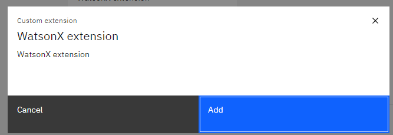

During the setup of this extension, you require to get the API of the **WatsonX**.

## Step 3 - Create WatsonX account 

To get his, first you need to go to your **WatsonX** account

[https://www.ibm.com/watsonx](https://www.ibm.com/watsonx)


## Step 4 - Create a prompt Lab

Then you can open the **Experiment** with the foundation models with **Prompt Lab**

Let us choose an simple example like **Marketing Generation**
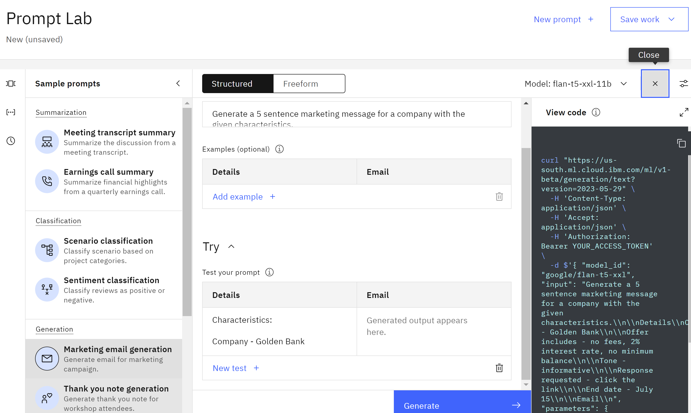

## Step 5 - Create personal API key

then under the view code we click  create personal API key


then we create our API key

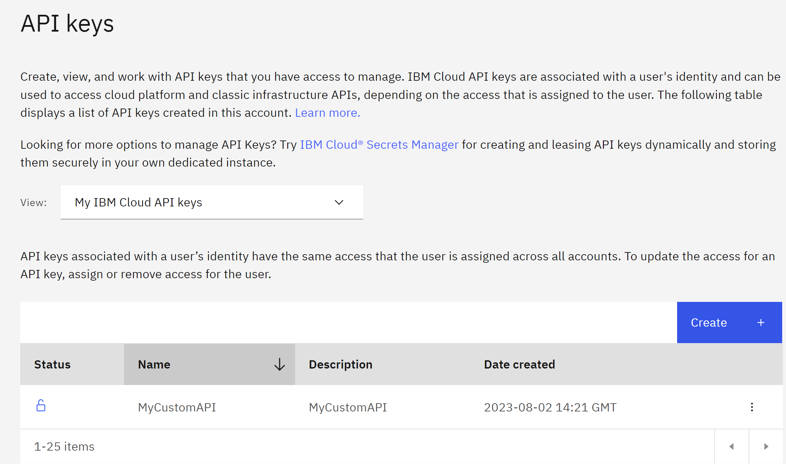


## Step 6- Setup WatsonX extension

then we copy it and we paste in our **WatsonX extension**

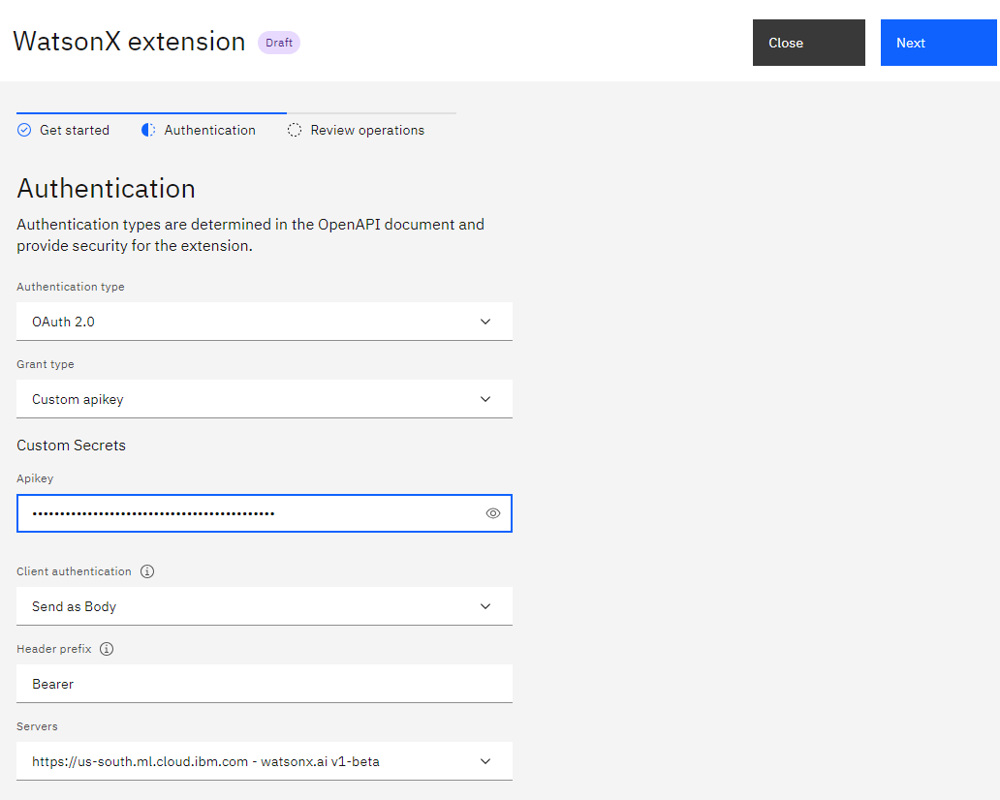
then we save and finish
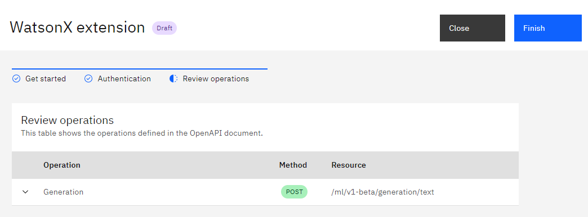

## Step 7- Setup Watson Assistant with WatsonX

We return back to our Watson Assistant and we can create an action

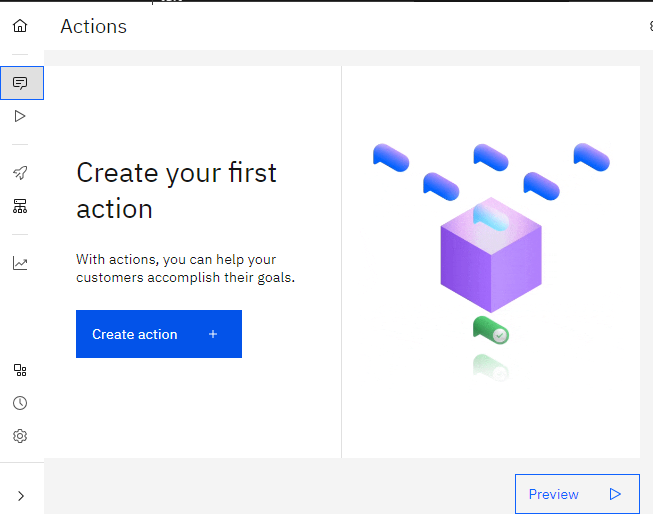

for example Marketing Generation

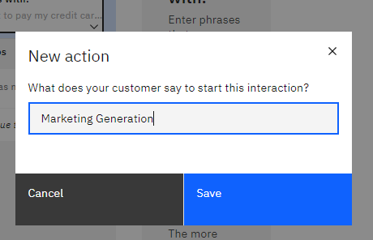

We create the first step, we can say

```
Please enter in your prompt
```

and then we define a custemer response like Free text

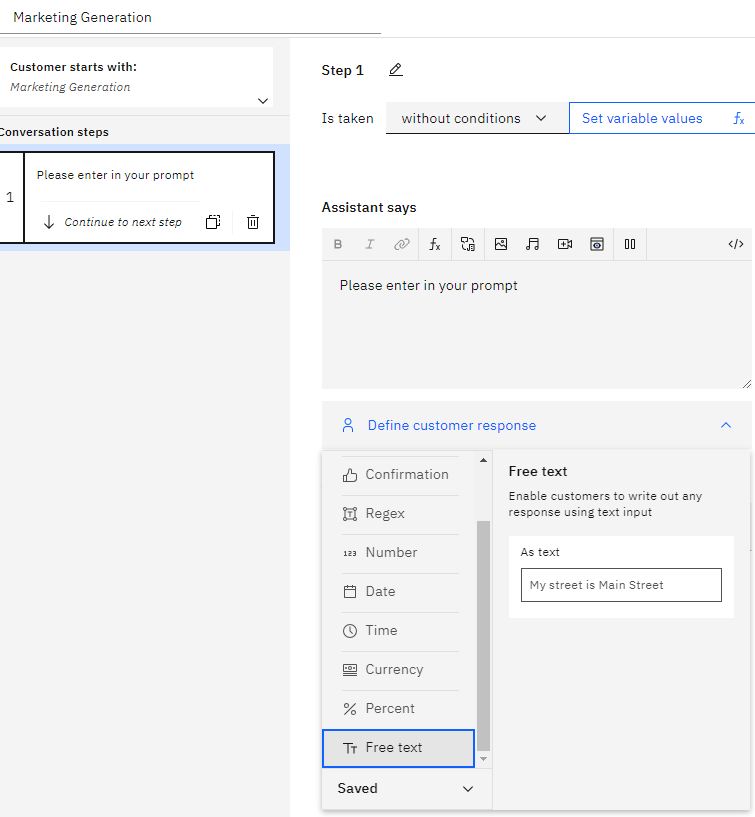


then we create an extra step, the step we name

```
Call watson extension
```

and then we continue to next step by using an extension

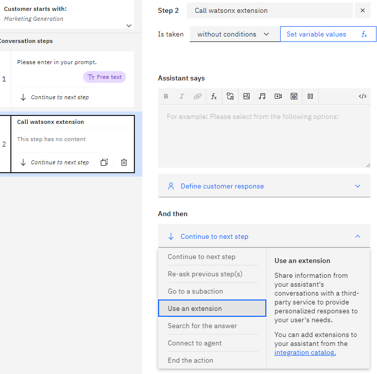

In ordering to setup the extension you requiere to go back to your WatsonX and see the code

in my example  will have something like

```
curl "https://us-south.ml.cloud.ibm.com/ml/v1-beta/generation/text?version=2023-05-29" \
  -H 'Content-Type: application/json' \
  -H 'Accept: application/json' \
  -H 'Authorization: Bearer YOUR_ACCESS_TOKEN' \
  -d $'{
  "model_id": "google/flan-t5-xxl",
  "input": "Generate a 5 sentence marketing message for a company with the given characteristics.\\n\\nDetails\\nCharacteristics:\\n\\nCompany - Golden Bank\\n\\nOffer includes - no fees, 2% interest rate, no minimum balance\\n\\nTone - informative\\n\\nResponse requested - click the link\\n\\nEnd date - July 15\\n\\nEmail\\n",
  "parameters": {
    "decoding_method": "sample",
    "max_new_tokens": 200,
    "min_new_tokens": 50,
    "random_seed": 111,
    "stop_sequences": [],
    "temperature": 0.8,
    "top_k": 50,
    "top_p": 1,
    "repetition_penalty": 2
  },
  "project_id": "4asdasdds-56ed-4eea-b36d"
}'
```

we will use the previous information to setup our extension in Watson Assistant

- For the version you will use a text with `2023-05-29`

- For input you will choose Action Step Variables and then you choose the first step `1.Please enter in your promt`

  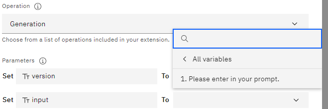

- For model_id `google/flan-t5-xxl`

- for project_id  you paste your project id for example `4asdasdds-56ed-4eea-b36d`
  you will have something like

- 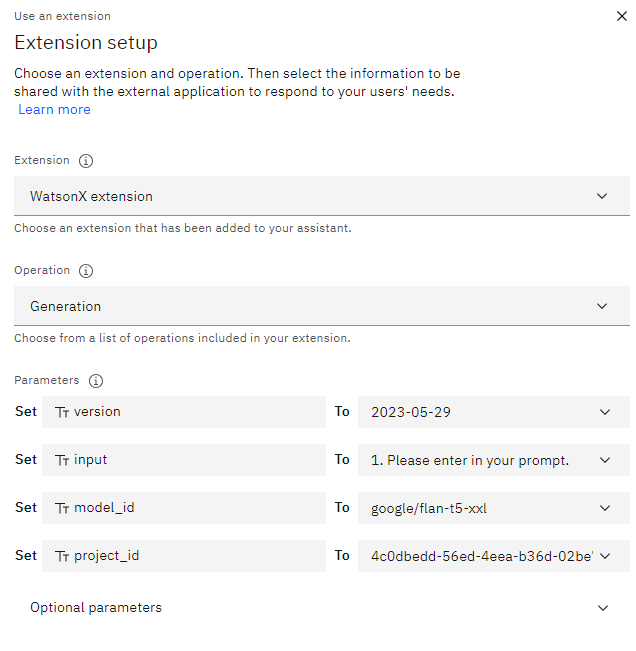

then for this example we will requiere additional options

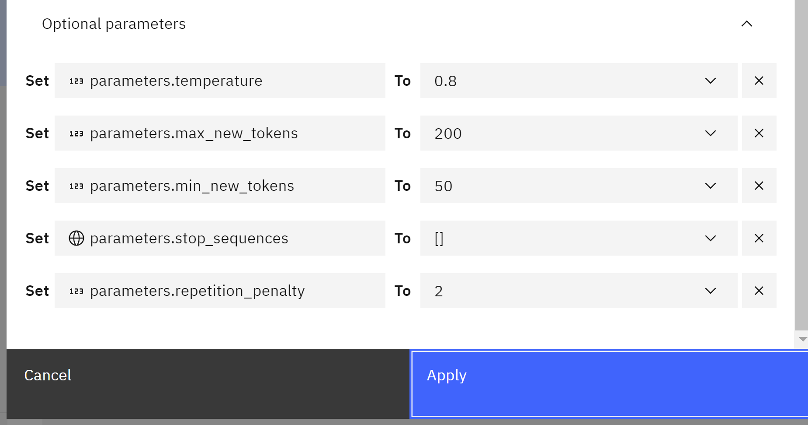

then click apply. Then we create a new step, with conditions, we choose `WatsonX extension(step2)` 

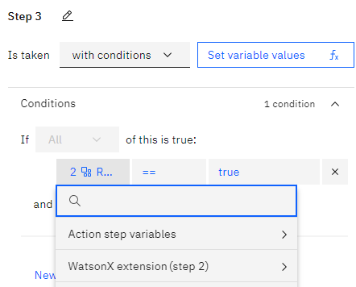

then `Ran successfully `

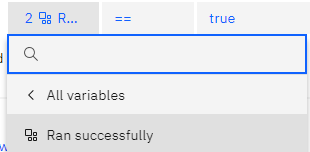

in order to express code we set variable values, and we create a `New session variable`

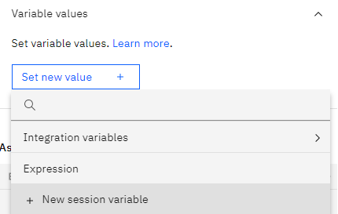

we name `result` and will be `free text`  and then apply.

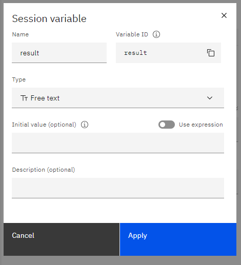

then we click set variable values and then expression 


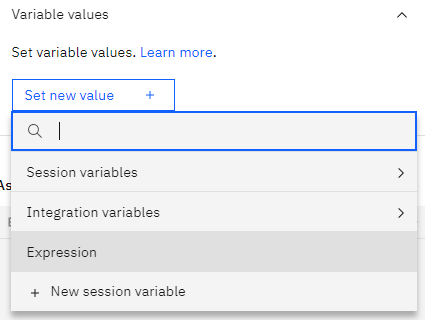 

then we type in the value of the variable

`${result}=$`

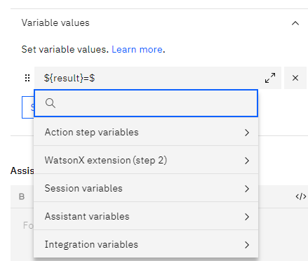

and search action step variables

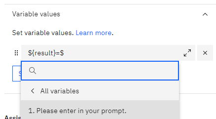

and select `1.Please enter in your propmt.` Then you add an space then ` + " "$` and find `WatsonX extension(step2)` 

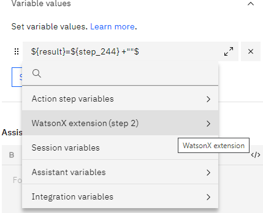

then click on `Body.results`

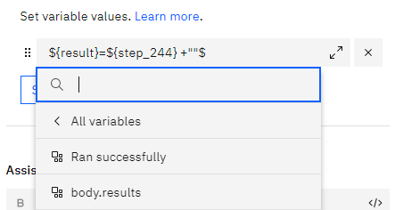


and you are going to have something like this

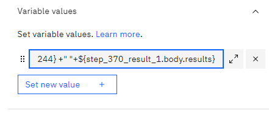

due to you get an array, you add the following `[0]["generated_text"]` that together in my case in something like this

```
${result} =${step_244} +" \\nOutput: \\n"+${step_370_result_1.body.results}[0]["generated_text"]
```


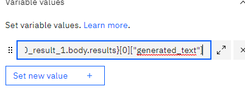


then in the assitant says you add a function `result`

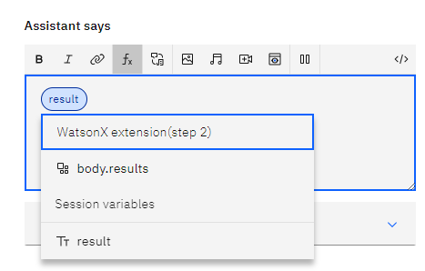

and finally we click on preview

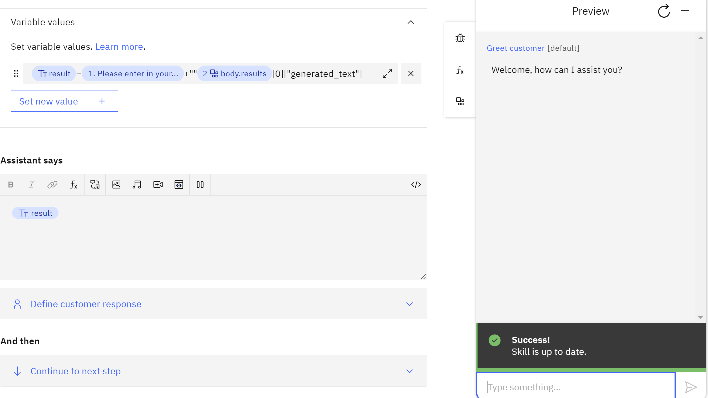

then type 

```
Marketing Generation
```

`
then

```
Generate 5 sentence marketing message for a company with the given characteristics. Details Characteristics: Company - Golden Bank Offer includes - no fees, 2% interest rate, no minimum balance Tone - informative Response requested - click the link End date - July 15 Email

```

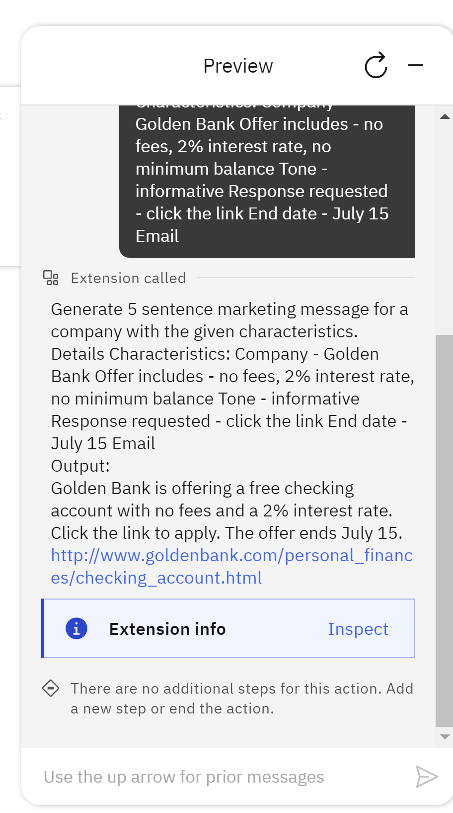


additionally you can analyze the output in the Extension inspector, to debug and analyze the results.

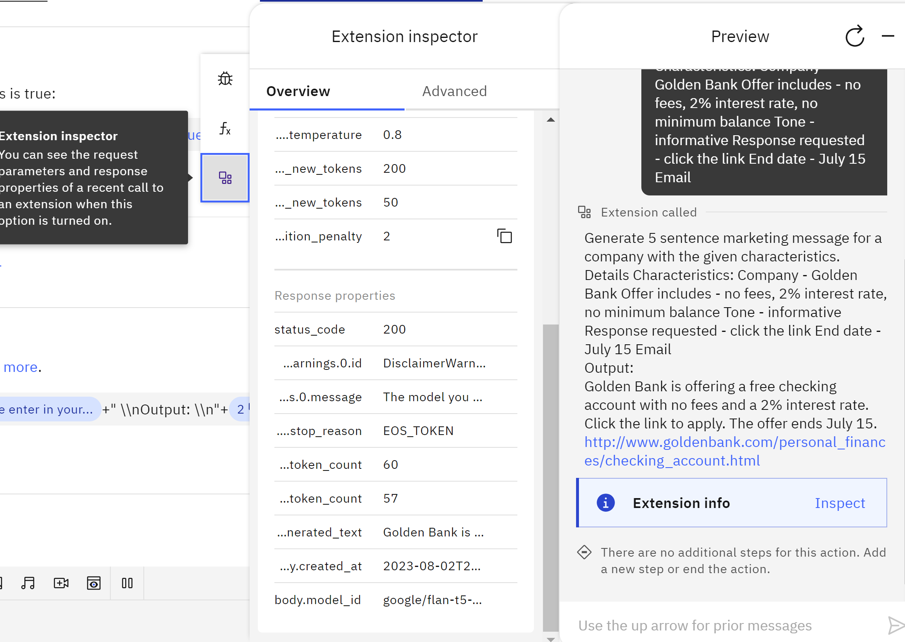


**Congratulations!** We have created a chatbot with **LLM capability** by using **IBM WatsonX** and **IBM Watson Assistant.**