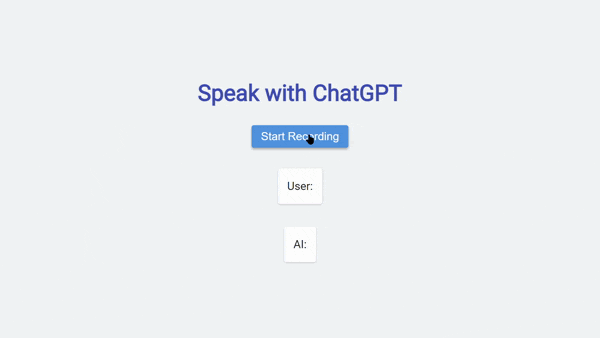
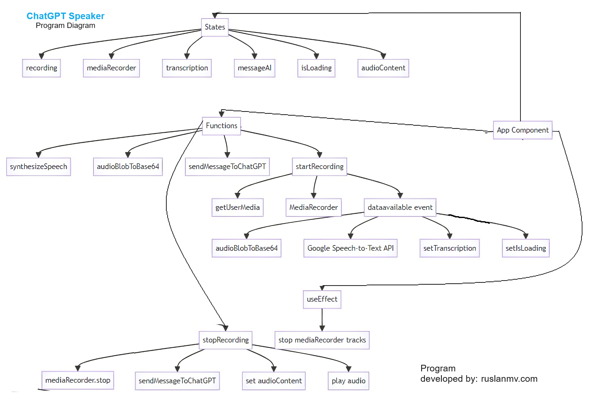
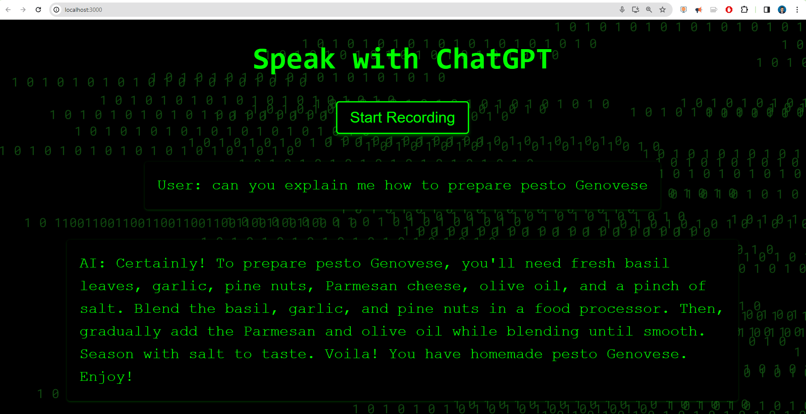
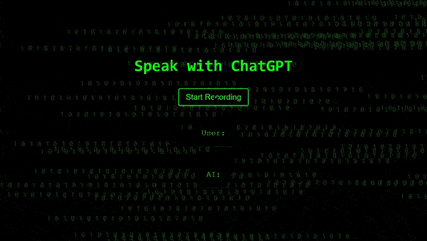

Hello everyone, today we are going to build an interesting application that allow us speak with **ChatGPT** by recording your **voice** in and reproduce the **audio answer** your web browser.

<iframe src="https://player.vimeo.com/video/881302541?badge=0&amp;autopause=0&amp;quality_selector=1&amp;player_id=0&amp;app_id=58479" width="640" height="360" frameborder="0" allow="autoplay; fullscreen; picture-in-picture" title="Speak with ChatGPT - The matrix"></iframe>

## Introduction:

In recent years, conversational artificial intelligence (AI) has made significant advancements, allowing us to interact with AI models in a more natural and conversational manner. One such model is ChatGPT, developed by OpenAI. In this blog post, we will walk you through the process of speaking with ChatGPT using a React application that records your voice, converts it to text, sends it to ChatGPT, and plays back the AI's response.

Prerequisites:
Before we begin, make sure you have the following requirements:

- Node.js: Visit the official Node.js website (https://nodejs.org) and download the latest version of Node.js. Follow the installation instructions for your operating system.
- Google Cloud Platform Account
- OpenAI Account

## Step 1: Set Up the Development Environment:

Create a new React project by opening your terminal and running the following command:

```
npx create-react-app speakgpt-app
```

Navigate to the project directory:

```
cd speakgpt-app
```

Open the project in your favorite code editor.

## Step 2: Obtain the Necessary API Keys:

To use the Google Text-to-Speech and Google Speech-to-Text APIs, you need API keys. Here's how to obtain them:

Visit the Google Cloud Console ([console.cloud.google.com)](https://cloud.google.com/) and create a new project. Enable the Text-to-Speech and Speech-to-Text APIs for your project.  Obtain the API keys for these services. For choose your speech voice you can see [here](https://cloud.google.com/text-to-speech/docs/voices). 

## Step 3: Configure the API Keys:

In the project root directory, create a new file called `.env`.

Open the `.env` file in a text editor and add the following lines:

```
REACT_APP_GOOGLE_API_KEY=YOUR_GOOGLE_API_KEY
REACT_APP_OPENAI_API_KEY=YOUR_OPENAI_API_KEY
```

Replace `YOUR_GOOGLE_API_KEY` with your actual Google API key and `YOUR_OPENAI_API_KEY` with your actual OpenAI API key. Save and close the `.env` file.

## Step 4: Install Dependencies:

In your terminal, navigate to the project directory and run the following command to install the required dependencies:

```
npm install axios
```

## Step 5: Edit App.js

Replace the contents of the `src/App.js` file with the following code:

```javascript
/*
  Code by Ruslan Magana Vsevolodovna
  This code is provided as-is and I am not responsible for its usage.
  For any inquiries, please contact me at contact@ruslanmv.com.
*/
import axios from 'axios';
import React, { useState, useEffect } from 'react';
async function synthesizeSpeech(text) {
  if (!process.env.REACT_APP_GOOGLE_API_KEY) {
    throw new Error("GOOGLE_API_KEY not found in the environment");
  }
  if (typeof text !== "string") {
    throw new Error(`Invalid input type: ${typeof text}. Type has to be text or SSML.`);
  }
  const apiKey = process.env.REACT_APP_GOOGLE_API_KEY;
  const apiURL = `https://texttospeech.googleapis.com/v1/text:synthesize?key=${apiKey}`;
  const requestBody = {
    input: {
      text,
    },
    voice: { languageCode: 'en-US', name: 'en-US-Polyglot-1', ssmlGender: 'MALE' },
    //voice: { languageCode: 'en-US', name: 'en-US-Neural2-H', ssmlGender: 'FEMALE' },
    //voice: { languageCode: 'it-IT', name: 'it-IT-Standard-B', ssmlGender: 'FEMALE' },
    audioConfig: {
      audioEncoding: "MP3",
    },
  };
  const response = await fetch(apiURL, {
    method: "POST",
    headers: {
      "Content-Type": "application/json",
    },
    body: JSON.stringify(requestBody),
  });

  if (!response.ok) {
    const errorData = await response.json();
    throw new Error(`Google Cloud TTS API Error: ${errorData.error.message}`);
  }
  const responseData = await response.json();
  const audioContent = responseData.audioContent;

  return audioContent;
}

// Function to convert audio blob to base64 encoded string
const audioBlobToBase64 = (blob) => {
  return new Promise((resolve, reject) => {
    const reader = new FileReader();
    reader.onloadend = () => {
      const arrayBuffer = reader.result;
      const base64Audio = btoa(
        new Uint8Array(arrayBuffer).reduce(
          (data, byte) => data + String.fromCharCode(byte),
          ''
        )
      );
      resolve(base64Audio);
    };
    reader.onerror = reject;
    reader.readAsArrayBuffer(blob);
  });
};


//Simple version gpt-3.5-turbo
async function sendMessageToChatGPT(inputText) {
  console.log(`ChatGPT message received: ${inputText}`);
  const MAX_WORD_SUGGESTION = 60;
  try {
    const response = await axios.post(
      'https://api.openai.com/v1/chat/completions',
      JSON.stringify({
        model: 'gpt-3.5-turbo',
        messages: [
          { role: "system", content: `You are a friendly and humorous assistant, providing users with a fun and engaging conversation. Keep your responses concise, no longer than ${MAX_WORD_SUGGESTION} words per response.` },
          { role: "user", content: inputText },
        ],
        //max_tokens: 70,
        temperature: 0
      }),
      {
        headers: {
          'Content-Type': 'application/json',
          'Authorization': `Bearer ${process.env.REACT_APP_OPENAI_API_KEY}`,
        },
      }
    );
    //console.log(`ChatGPT response :`, response);
    const message = response.data.choices[0].message.content.trim();
    return message;
  } catch (error) {
    console.error(error);
    throw new Error('Failed to send message to ChatGPT');
  }
}

const App = () => {
  const [recording, setRecording] = useState(false);
  const [mediaRecorder, setMediaRecorder] = useState(null);
  const [transcription, setTranscription] = useState('');
  const [messageAI, setMessageAI] = useState('');
  const [isLoading, setIsLoading] = useState(false); // Added isLoading state
  const [audioContent, setAudioContent] = useState(null); // Added useState for audioContent
  // Cleanup function to stop recording and release media resources
  useEffect(() => {
    return () => {
      if (mediaRecorder) {
        mediaRecorder.stream.getTracks().forEach(track => track.stop());
      }
    };
  }, [mediaRecorder]);

  if (!process.env.REACT_APP_GOOGLE_API_KEY) {
    throw new Error("REACT_APP_GOOGLE_API_KEY not found in the environment");
  }

  const apiKey = process.env.REACT_APP_GOOGLE_API_KEY;
  const startRecording = async () => {
    try {
      const stream = await navigator.mediaDevices.getUserMedia({ audio: true });
      const recorder = new MediaRecorder(stream);
      recorder.start();
      console.log('Recording started');

      // Event listener to handle data availability
      recorder.addEventListener('dataavailable', async (event) => {
        console.log('Data available event triggered');
        const audioBlob = event.data;

        const base64Audio = await audioBlobToBase64(audioBlob);
        //console.log('Base64 audio:', base64Audio);

        try {
          const startTime = performance.now();

          const response = await axios.post(
            `https://speech.googleapis.com/v1/speech:recognize?key=${apiKey}`,
            {
              config: {
                encoding: 'WEBM_OPUS',
                sampleRateHertz: 48000,
                languageCode: 'en-US',
              },
              audio: {
                content: base64Audio,
              },
            }
          );

          const endTime = performance.now();
          const elapsedTime = endTime - startTime;

          //console.log('API response:', response);
          console.log('Voice Recognition - Time taken (ms):', elapsedTime);

          if (response.data.results && response.data.results.length > 0) {

            const transcription = response.data.results[0].alternatives[0].transcript;
            setTranscription(transcription);
            setIsLoading(true); // Set isLoading to true during processing
            const startTimeGPT = performance.now();

            //sendMessageToChatGPT(transcription).then((message) => {
            //  console.log(message);
            //  setMessageAI(message);
            //});
            const output = await sendMessageToChatGPT(transcription);
            console.log(output);
            setMessageAI(output);

            const endTimeGPT = performance.now();
            const elapsedTimeGPT = endTimeGPT - startTimeGPT;
            console.log('AI processing -  Time taken (ms):', elapsedTimeGPT);
            setIsLoading(false); // Set isLoading back to false after processing
            const synthesizedAudio = await synthesizeSpeech(output);
            setAudioContent(synthesizedAudio);
            const audio = new Audio(`data:audio/mp3;base64,${synthesizedAudio}`);
            audio.play();

          } else {
            console.log('No transcription results in the API response:', response.data);
            setTranscription('No transcription available');
          }
        } catch (error) {
          console.error('Error with Google Speech-to-Text API:', error.response.data);
        }
      });

      setRecording(true);
      setMediaRecorder(recorder);
    } catch (error) {
      console.error('Error getting user media:', error);
    }
  };

  const stopRecording = () => {
    if (mediaRecorder) {
      mediaRecorder.stop();
      console.log('Recording stopped');
      setRecording(false);
    }
  };


 //OpenAI Theme
const default_mode = (
  <div style={{ background: '#F1F3F5', minHeight: '100vh', display: 'flex', flexDirection: 'column', justifyContent: 'center', alignItems: 'center', fontFamily: 'Roboto, sans-serif' }}>
    <h1 style={{ fontSize: '48px', color: '#3F51B5', marginBottom: '40px' }}>Speak with ChatGPT</h1>
    {!recording ? (
      <button onClick={startRecording} style={{ background: '#4A90E2', color: 'white', fontSize: '24px', padding: '10px 20px', borderRadius: '5px', border: 'none', cursor: 'pointer', marginBottom: '20px', boxShadow: '0 3px 5px rgba(0,0,0,0.3)' }}>Start Recording</button>
    ) : (
      <button onClick={stopRecording} style={{ background: '#F87676', color: 'white', fontSize: '24px', padding: '10px 20px', borderRadius: '5px', border: 'none', cursor: 'pointer', marginBottom: '20px', boxShadow: '0 3px 5px rgba(0,0,0,0.3)' }}>Stop Recording</button>
    )}
    <p style={{ fontSize: '24px', color: '#212121', maxWidth: '80%', lineHeight: '1.5', textAlign: 'left', background: 'white', padding: '20px', borderRadius: '5px', boxShadow: '0 1px 3px rgba(0,0,0,0.2)' }}>User: {transcription}</p>
    {isLoading ? (
      <div style={{ fontSize: '24px', color: '#212121', maxWidth: '80%', lineHeight: '1.5', textAlign: 'left', background: '#4CAF50', padding: '20px', borderRadius: '5px', boxShadow: '0 1px 3px rgba(0,0,0,0.2)' }}>
         <span style={{ fontSize: '20px', fontWeight: 'bold', color: 'white', textShadow: '1px 1px 2px rgba(0,0,0,0.4)' }}>Processing...</span> {/* Added styling to the processing icon */}
      </div>
    ) : (
      <p style={{ fontSize: '24px', color: '#212121', maxWidth: '80%', lineHeight: '1.5', textAlign: 'left', background: 'white', padding: '20px', borderRadius: '5px', boxShadow: '0 1px 3px rgba(0,0,0,0.2)' }}>AI: {messageAI}</p>
    )}
  </div>
);

return (default_mode);
};
export default App;
```

Save the changes to `src/App.js`.

## Step 6:  Run the Application

In the terminal, run the following command to start the React development server:

   ```
npm start
   ```

The application should automatically open in your default web browser. If it doesn't, open your browser and navigate to `http://localhost:3000`. You should see the interface for speaking with ChatGPT.

## Step 7: Interact with ChatGPT:

[](https://vimeo.com/manage/videos/881302904)

1. On the web page, you will find a "Start Recording" button. Click on it to begin speaking.
2. As you speak, the application will convert your voice into text and display the transcription in the user section of the interface.
3. Once you stop speaking, the application will send the transcribed text to the ChatGPT API for generating a response. The AI's response will be displayed in the AI section of the interface.
4. You can continue the conversation by speaking again. The application will transcribe your speech, send it to ChatGPT, and display the AI's response.

## Description of the code

For people who is interested in the coding,  I have created this program by keeping i mind the following diagram flow.



## Description

1. The code starts by importing the necessary dependencies, including the axios library for making HTTP requests and React for building the user interface.

2. The code defines an asynchronous function called `synthesizeSpeech` that takes in a text input and uses the Google Text-to-Speech API to synthesize that text into audio. The function checks for the presence of a Google API key and validates the input. It then constructs the necessary API request and sends it using the `fetch` function. If the response is successful, the function extracts the audio content and returns it.

3. The code defines another function called `audioBlobToBase64` that converts an audio blob to a base64 encoded string. This function uses the `FileReader` API to read the blob as an array buffer and then converts it to a base64 string.

4. The code defines an asynchronous function called `sendMessageToChatGPT` that sends a user's input text to the OpenAI ChatGPT API for a response. The function constructs the API request with the necessary parameters, including the model version, messages, and authorization headers. It uses the axios library to make the POST request to the API. If the response is successful, the function extracts the message content from the response and returns it.

5. The code defines the main component of the React application called `App`. It sets up several state variables using the `useState` hook, including `recording` to track the recording state, `mediaRecorder` to hold the media recorder object, `transcription` to store the text transcription of the user's voice, `messageAI` to store the response from ChatGPT, `isLoading` to indicate if the application is processing the user's voice, and `audioContent` to hold the synthesized audio content.

6. The code also includes a cleanup function that stops recording and releases media resources when the component is unmounted.

7. In the component's render function, it first checks for the presence of the Google API key and throws an error if it is not found.

8. The `startRecording` function is defined to start recording the user's voice. It uses the `getUserMedia` function from the `navigator.mediaDevices` API to request access to the user's microphone. If access is granted, it creates a new `MediaRecorder` object and starts recording. It also sets up an event listener for the `dataavailable` event, which is triggered when data is available from the recording. In the event listener, it converts the recorded audio to base64 using the `audioBlobToBase64` function and sends it to the Google Speech-to-Text API for transcription. It then calls the `sendMessageToChatGPT` function with the transcription and sets the `transcription`, `isLoading`, and `messageAI` state variables accordingly. It also calls the `synthesizeSpeech` function with the response from ChatGPT to convert it to audio, sets the `audioContent` state variable, and plays the audio using the `Audio` object.

9. The `stopRecording` function is defined to stop the recording by calling the `stop` method on the `mediaRecorder` object.

10. The code defines a React component called `mode` that represents the user interface for the application. It displays a heading, a button to start or stop recording, a text area to display the user's transcription, and a text area to display the AI's response. If the application is currently processing the user's voice, it displays a loading message. For the Matrix Animation I will explain later.

11. Finally, the `App` component returns the `mode` component as the rendered output.

That's a high-level overview of what the code does. Let me know if you have any specific questions about any part of the code!

## GPT Matrix Theme

If you want to add the Matrix animation.



Create a new CSS file in your project folder. You can create it in the same folder as your React component or in a separate folder for styles. For this example, let's create a file called `MatrixTheme.css` in the `src` folder.

Open the `MatrixTheme.css` file and paste the provided CSS code:

  ```javascript
@import url('https://fonts.googleapis.com/css2?family=Roboto+Mono:wght@400;700&display=swap');

.matrix-background {
  position: fixed;
  top: 0;
  left: 0;
  width: 100%;
  height: 100%;
  overflow: hidden;
  z-index: -1;
}

.matrix-background span {
  position: absolute;
  font-family: 'Roboto Mono', monospace;
  font-size: 20px;
  color: #104c10;
  display: inline-block;
  white-space: nowrap;
  animation: fall linear infinite;
}

@keyframes fall {
  0% {
    transform: translateY(-100%);
  }
  100% {
    transform: translateY(100%);
  }
}

  ```

In your React component file (e.g., `MatrixComponent.js`), import the `MatrixTheme.css` file at the top by adding the following line:

  ```
import './MatrixTheme.css';
  ```

Make sure the path to the CSS file is correct. If you created the CSS file in a different folder, adjust the path accordingly. Now, you can use the CSS classes defined in `MatrixTheme.css` in your React component you use the code [here](https://github.com/ruslanmv/Speak-with-ChatGPT-with-React/blob/master/templates/matrix.md) and wuala you got this:



In this blog post, we explored the process of speaking with **ChatGPT** using a **React application**. By leveraging the **Google Text-to-Speech** and **Speech-to-Text APIs**, we were able to create a voice-enabled interface that transcribes user speech, sends it to **ChatGPT** for response generation, and converts the AI's response into audio for playback. This showcases the exciting possibilities of conversational AI and its potential for creating engaging user experiences. Remember to handle the security and privacy aspects of using API keys and ensure proper error handling in your code.

**Congratulation!** You have build your own **ChatGPT** in **JavaScript** with **Google Cloud Platform**
