In today's fast-paced world, leveraging the power of artificial intelligence to assist with exam solutions is no longer a distant dream. In this blog post, we will introduce you to an innovative web application called question-answer, which utilizes cutting-edge AI technologies to transform the way students tackle tests and quizzes.

In this tutorial, we will demonstrate how to develop a web application that uses artificial intelligence to solve questionnaires. The application will be able to read and analyze exam questions, then generate answers using AI.

Our web application will utilize a Language Model (LLM) from IBM WatsonX to process and answer questions from a text document. This can be particularly useful in situations where you are taking a test and do not have enough time to search for answers online. Simply create a document containing the questions, upload it to the application, and let the generative AI provide the answers.

<iframe src="https://player.vimeo.com/video/888379674?badge=0&amp;autopause=0&amp;quality_selector=1&amp;player_id=0&amp;app_id=58479" width="640" height="344" frameborder="0" allow="autoplay; fullscreen; picture-in-picture" title="Exam Solver with WatsonX"></iframe>

We will begin by setting up our development environment locally, followed by building a container to deploy the application on the IBM Cloud.

## Step 1: Setting up the Environment

To begin with, we need to set up our development environment. Make sure you have the following components installed:

- Python
- Streamlit
- IBM Cloud CLI
- IBM Cloud Object Storage (COS) service provisioned

## Develop Environment

Our application is built on **IBM Code Engine**, a powerful platform that simplifies the deployment and management of containerized applications. With the help of **WatsonX.ai**, we will incorporate a **Language Model** (LLM) to analyze and generate answers to exam questions. This generative AI technology enables the application to provide accurate and reliable solutions, making it an invaluable tool for students in need of assistance during their exams.

Let us first create our working directory 

```
mkdir Code-Engine-Application

```

then we clear it `prompt Code-Engine-Application$G` or you can revert it by typing `prompt`. In particular I like the green color.

```
prompt $E[32mCode-Engine-Application$E[37m$G

```

For the development section of this application, we are going to use **Python 3.10.11**. Visit the [Python 3.10.11 download page](https://www.python.org/downloads/release/python-31011/) and download the appropriate installer for your system (Windows installer, 32-bit or 64-bit). Run the installer. In the installation window, check the box for "Add Python 3.10 to PATH" and click on "Install Now."  After the installation is complete, open a new Command Prompt or PowerShell window and verify the installation by running the following command:

```
 python --version
```

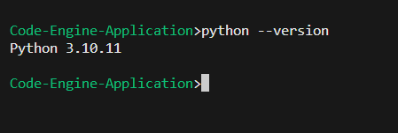


Then, create a virtual environment by running the following command:

```
python -m venv .venv
```

You will notice a new directory in your current working directory with the same name as your virtual environment. Activate the virtual environment:

```
.venv\Scripts\activate.bat
```

Upgrade pip:

```
python -m pip install --upgrade pip
```

then we install the necessary packages

```
pip install -r requirements.txt
```

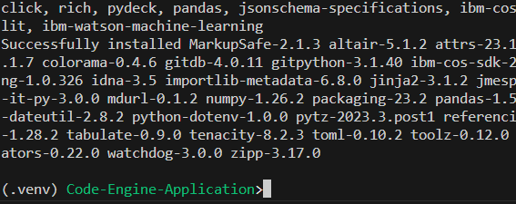


## Step 2: Writing the Streamlit App (app.py)

Now we will walk through the process of creating a web application using Streamlit that allows users to upload a document text file. The uploaded file will be stored in an IBM Cloud Object Storage (COS) bucket, and then the text will be sent to IBM WatsonX for processing. The result from WatsonX will be displayed back to the user. Let's dive into the steps involved in creating this web app.

First, let's create a file called `app.py` and import the necessary libraries and modules. Here's an overview of the code:

```python
# Import required libraries
import streamlit as st
import ibm_boto3
from ibm_botocore.client import Config, ClientError
from io import BytesIO
import os
from dotenv import load_dotenv
from cloudfunction.watsonx import main as watsonx

# Load environment variables
load_dotenv()
credentials = {
    "COS_ENDPOINT": os.environ.get("COS_ENDPOINT", None),
    "COS_API_KEY_ID": os.environ.get("COS_API_KEY_ID", None),
    "COS_INSTANCE_CRN": os.environ.get("COS_INSTANCE_CRN", None),
    "COS_BUCKET": os.environ.get("COS_BUCKET", None),
}

# Create IBM COS client
cos = ibm_boto3.client(
    "s3",
    ibm_api_key_id=credentials['COS_API_KEY_ID'],
    ibm_service_instance_id=credentials['COS_INSTANCE_CRN'],
    config=Config(signature_version="oauth"),
    endpoint_url=credentials['COS_ENDPOINT']
)

# Function to upload a file to the specified IBM COS bucket
def FileUpload(bucket_name, item_name, file_obj):
    print("Creating new item: {0}".format(item_name))
    try:
        cos.upload_fileobj(
            Fileobj=file_obj,
            Bucket=bucket_name,
            Key=item_name
        )
        print("Item: {0} created!".format(item_name))
        return True
    except ClientError as be:
        print("CLIENT ERROR: {0}\n".format(be))
        return False
    except Exception as e:
        print("Unable to create text file: {0}".format(e))
        return False

# Main function for the Streamlit app
def main():
    # Set page configuration
    st.set_page_config(
        page_title="Questions Solver with IBM WatsonX",
        page_icon=":question:",
        layout="centered",
        initial_sidebar_state="expanded",
    )

    # Add custom CSS
    st.markdown(
        """
        <style>
            .menu {
                background-color: black;
                padding: 10px 20px;
                border-radius: 5px;
            }
            .menu h1 {
                color: white;
                margin: 0;
                padding: 0;
                font-size: 24px;
                font-weight: bold;
            }
            .title {
                font-size: 36px;
                font-weight: bold;
                color: #0f62fe;
            }
            .response-container {
                padding: 10px;
                background-color: white;
                border-radius: 5px;
            }
            body {
                background-color: #f0f0f0;
            }
        </style>
        """,
        unsafe_allow_html=True,
    )

    # Display title and menu
    st.markdown('<div class="menu"><h1>Questions Solver with IBM WatsonX</h1></div>', unsafe_allow_html=True)

    # File uploader
    uploaded_file = st.file_uploader("Choose a file to upload", type=["txt"], help="Upload a text with max of 20 questions")
    if uploaded_file is not None:
        file_name = uploaded_file.name
        file_contents = uploaded_file.read()
        file_obj = BytesIO(file_contents)
        
        # Upload the file and process the response
        if FileUpload(credentials['COS_BUCKET'], file_name, file_obj):
            st.markdown(f"<div style='color:#0f62fe'><strong>File '{file_name}' uploaded successfully!</strong></div>", unsafe_allow_html=True)
            payload = {
                "bucket_name": credentials['COS_BUCKET'],
                "object_name": file_name
            }
            print("Payload", payload)
            response = watsonx(payload)
            st.markdown(f"<div class='response-container'><strong>Response:</strong> <pre>{response['body']}</pre></div>", unsafe_allow_html=True)
        else:
            st.markdown(f"<div style='color:#da1e28'><strong>Failed to upload file '{file_name}'</strong></div>", unsafe_allow_html=True)

# Run the Streamlit app
if __name__ == "__main__":
    main()

```


The code above sets up the Streamlit app, creates a function to upload the file to the COS bucket, and calls the WatsonX function after successful upload.

## Step 3: Creating the Cloud Functions Folder

Now, let's create a folder called `cloudfunctions`. Inside this folder, we will have two files: `solver.py` and `watsonx.py`.

In `solver.py`, we will have the following code:

```python
# Import necessary libraries
import os
from dotenv import load_dotenv
from ibm_watson_machine_learning.metanames import GenTextParamsMetaNames as GenParams
from ibm_watson_machine_learning.foundation_models.utils.enums import ModelTypes
import requests

# Set parameters for text generation
parameters = {
    GenParams.DECODING_METHOD: "greedy",
    GenParams.MAX_NEW_TOKENS: 1000
}

# Load environment variables
load_dotenv()
project_id = os.getenv("PROJECT_ID", None)
credentials = {
    #"url": "https://us-south.ml.cloud.ibm.com",
    "url":  "https://eu-de.ml.cloud.ibm.com",
    "apikey": os.getenv("API_KEY", None)
}

# Function to get the bearer token
def getBearer(apikey):
    form = {'apikey': apikey, 'grant_type': "urn:ibm:params:oauth:grant-type:apikey"}
    print("About to create bearer")
    response = requests.post("https://iam.cloud.ibm.com/oidc/token", data=form)
    if response.status_code != 200:
        print("Bad response code retrieving token")
        raise Exception("Failed to get token, invalid status")
    json = response.json()
    if not json:
        print("Invalid/no JSON retrieving token")
        raise Exception("Failed to get token, invalid response")
    print("Bearer retrieved")
    return json.get("access_token")

# Get and store bearer token
credentials["token"] = getBearer(credentials["apikey"])

# Import Model class
from ibm_watson_machine_learning.foundation_models import Model

# Function to call the AI model for text generation
def call_model(text):
    model_id = ModelTypes.LLAMA_2_70B_CHAT
    # Initialize the Watsonx foundation model
    llm_model = Model(
        model_id=model_id,
        params=parameters,
        credentials=credentials,
        project_id=project_id)
    print("OK")
    # Create the prompt for the model
    prompt = f"""<s>[INST] <<SYS>> You have been given a text containing several questions from a test or exam. Your task is to create a document where each question is followed by its answer, provided by you (the AI). Use your knowledge to answer the questions as accurately as possible. For each question, print the question and write the answer below it, starting with "Answer:". The given text is as follows: {text} <</SYS>>[/INST]
    """
    # Generate the result from the model
    result = llm_model.generate(prompt)['results'][0]['generated_text']
    return result

```

In `watsonx.py`, we will have the following code:

```python
import ibm_boto3
from ibm_botocore.client import Config, ClientError
import os
from dotenv import load_dotenv
#from solver import call_model
from cloudfunction.solver import call_model
# Constants for IBM COS values
load_dotenv()
credentials = {
        "COS_ENDPOINT": os.environ.get("COS_ENDPOINT", None),
        "COS_API_KEY_ID": os.environ.get("COS_API_KEY_ID", None),
        "COS_INSTANCE_CRN": os.environ.get("COS_INSTANCE_CRN", None),
        "COS_BUCKET": os.environ.get("COS_BUCKET", None),
        } 
        
# Create client
cos = ibm_boto3.client(
    "s3",
    ibm_api_key_id=credentials['COS_API_KEY_ID'],
    ibm_service_instance_id=credentials['COS_INSTANCE_CRN'],
    config=Config(signature_version="oauth"),
    endpoint_url=credentials['COS_ENDPOINT']
) 
def GetFile(bucket_name, object_name):
    print("Get item: {0}".format(object_name))
    try:
        response = cos.get_object(
            Bucket=bucket_name,
            Key=object_name
        )
        return response["Body"].read()
    except ClientError as be:
        print("CLIENT ERROR: {0}\n".format(be))
        return False
    except Exception as e:
        print("Unable to create text file: {0}".format(e))
        return False
        
def main(params): 
  print("Argument of WatsonX:",params)   
  bucket_name = params.get("bucket_name","questions" )
  object_name = params.get("object_name","questions.txt")  
  print("bucket_name", bucket_name)
  print("object_name", object_name)
  response = GetFile(bucket_name, object_name)
  # Do answering
  answers=call_model(str(response))
  return {
        "headers": {
            "Content-Type": "application/json",
        },
        "statusCode": 200,
        "body": answers
  }        
```

## Step 4: Setting up the Environment Variables

Create a `.env` file in the root folder to store the credentials, for example

```
COS_ENDPOINT='https://s3.us-south.cloud-object-storage.appdomain.cloud'
COS_API_KEY_ID='1234567890abcdef'
COS_INSTANCE_CRN='crn:v1:bluemix:public:cloud-object-storage:global:a/9f2d81f38387467f857ee00f0bf03c36:c5809310-1f23-4bb9-886c-174dfa44a8::'
COS_BUCKET='fake-bucket'
API_KEY='1234567890abcdef'
PROJECT_ID='1234567890abcdef'

```

we have to copy the previous  `.env` file and have `secrets.env` without strings. Make sure to replace the values with your own IBM Cloud Object Storage and WatsonX credentials.


Once you have created all the files, you can test your program, you can upload this example of  [questions.txt](https://github.com/ruslanmv/Code-Engine-Application/blob/master/questions.txt)

```
streamlit run app.py
```

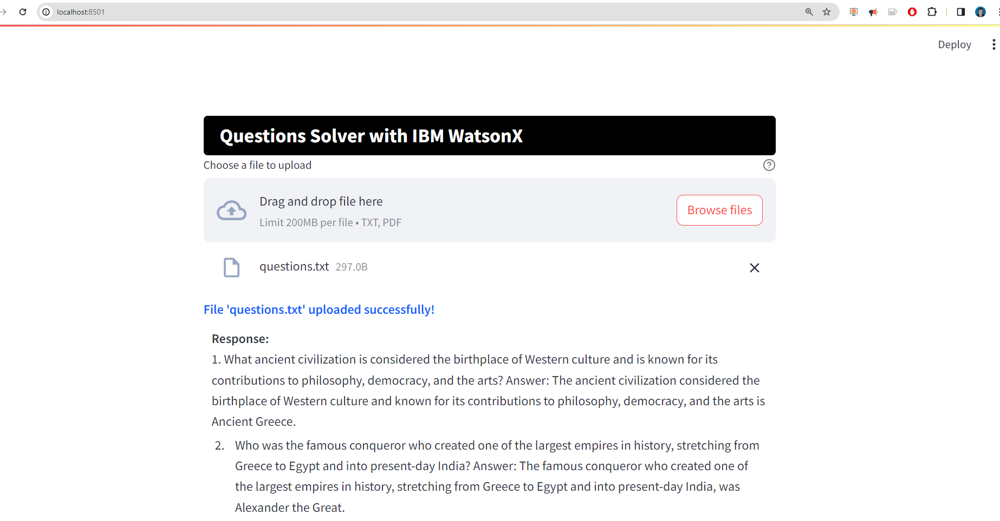


Program Tree:

```
- app.py
- cloudfunctions
  - solver.py
  - watsonx.py
- .env
- secrets.env
- Dockerfile
```


## Step 5 - Container Installation

1. Install the IBM Cloud CLI. Visit the [IBM Cloud CLI installation page](https://cloud.ibm.com/docs/cli?topic=cli-install-ibmcloud-cli) .

2. After the installation is complete, open a new Command Prompt  window and verify the installation by running the following command:

```
ibmcloud --version
```

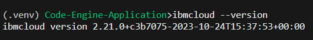


3. Install the Docker CLI. Visit the [Docker Desktop for Windows download page](https://hub.docker.com/editions/community/docker-ce-desktop-windows/) and click on "Get Docker." Run the installer and follow the on-screen prompts to complete the installation . After the installation is complete, open a new Command Prompt or PowerShell window and verify the installation by running the following command:

```
docker --version 
```

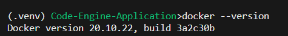


4. Log in to your IBM Cloud account where we want to create the container

```
ibmcloud login -a https://cloud.ibm.com
```

If you have a federated ID, use ibmcloud login --sso to log in to the IBM Cloud CLI.

```
ibmcloud login --sso
```


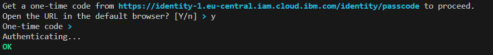
Here you should choose fist the account where you will have the Container Registry.

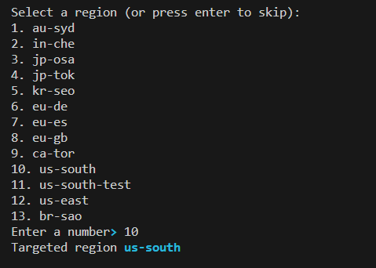


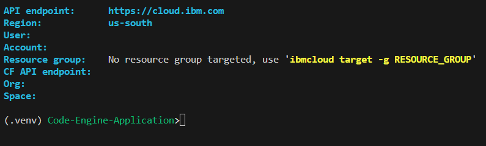

4. Install the Container Registry plug-in.

```
ibmcloud plugin install container-registry 
```

5. We create the Dockerfile for the app.py, 


```Docker
FROM python:3.10-slim
WORKDIR /app
COPY requirements.txt .
COPY cloudfunction/ cloudfunction/
RUN pip install -r requirements.txt
COPY app.py .
EXPOSE 8501
CMD ["streamlit", "run", "app.py"]
```

   the  cloudfunction folder with the files and the requirements.txt files 

Then we open our docker destkop.

6. Log in to the IBM Cloud Container Registry:

```
ibmcloud cr login
```

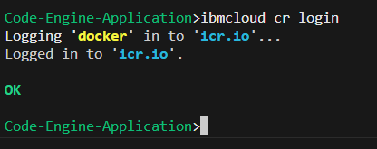

7. Ensure that you're targeting the correct IBM Cloud Container Registry region.

```
ibmcloud cr region-set global
```

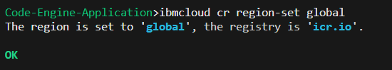
Or if you want another region you can use

```
ibmcloud cr region-set
```

8. We create the namespace

```
ibmcloud cr namespace-add question-answer-namespace
```

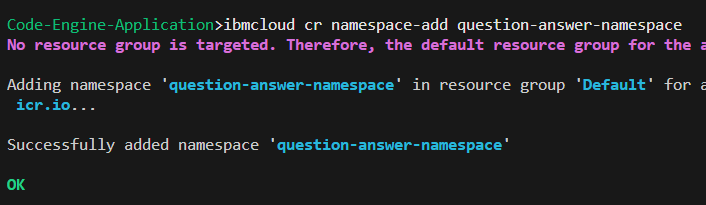

## Step 6. Run Image Locally ##

To run a Docker image locally, you need to follow these steps: 

9. Build the Docker image by running this command in the same directory as your Dockerfile

```bash
docker build -t ruslanmv/question-answer:latest .
```


To load environment variables from a `secrets.env` file without copying it into the Docker container, you can use the `--env-file` option when running the `docker run` command. This way, the environment variables will be available in the container, but the `secrets.env` file will not be stored inside the container.
First, make sure your `secrets.env` file is in the same directory as your Dockerfile. The file should have key-value pairs, one per line, like this:

API_KEY=my_api_key
SECRET=my_secret

10. After the image is built successfully, run the Docker container using the following command 

```bash
docker run -p 8501:8501 --env-file secrets.env ruslanmv/question-answer:latest
```

This command maps the container's port 8501 to your local machine's port 8501.

11. Once the container is running, open a web browser and go to http://localhost:8501 to access your app.

If there are any issues in the Dockerfile or the app itself, make sure to check the error messages and fix them accordingly.
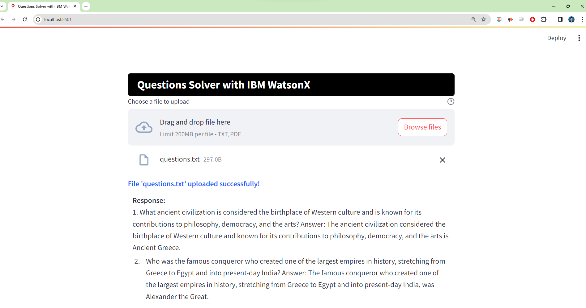

## Step 7 - Upload Image on IBM Container Registry 

1. Tag an image to point to the registry. Choose a local image, target namespace, and target repository and an optional tag 

```bash
docker tag ruslanmv/question-answer:latest icr.io/question-answer-namespace/question-answer:latest
```

2. Push the tagged image to IBM Cloud Container Registry.
   If you want store the Container in the IBM Cloud you can type:

```
docker push icr.io/question-answer-namespace/question-answer:latest
```


If we have different accounts one where we have the container and another with the Code Engine, we requiere to create an API Key for the Container Account

```
ibmcloud iam api-key-create cliapikey -d "My CLI API key" --file key_file
```


## Docker Container Store

If you want to store also the container outside IBM cloud, for example in 
Docker site. You can push to Docker by typing the command

```
docker push ruslanmv/question-answer:latest
```

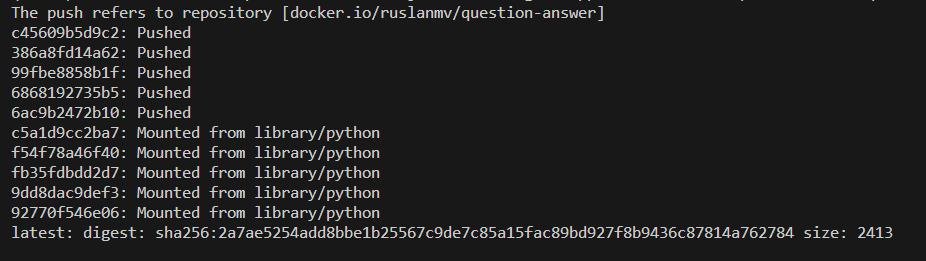

Then if you are in an another computer you can pull

```
docker pull ruslanmv/question-answer:latest
```

## Step 8 - Connect bucket to Code Engine Application

1. Login to Code Engine
   First we need to login to our account that has the Code Engine enabeled.

```
ibmcloud login -sso
```

2. Install the IBM Cloud Code Engine plugin:

```
ibmcloud plugin install code-engine
```

4. Choose the resource group targeted. Run 'ibmcloud target -g RESOURCE_GROUP_NAME', for example

```
ibmcloud target -g code-engine-667000nwl8-qlz0g5vj
```

5. Create a Code Engine project 

```
ibmcloud ce project create --name question-answer-project
```

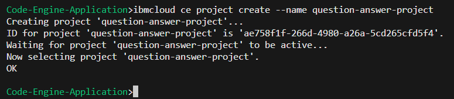

6. Set the current project context

```
ibmcloud ce project select -n question-answer-project
```

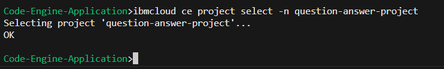


7. We have to create the Registry Container

### For IBM Cloud Container

If you want to to load your container from the IBM Cloud you can type the following command

```
ibmcloud ce secret create --format registry --name question-answer-registry --server icr.io --username iamapikey --password YOUR_API_KEY
```

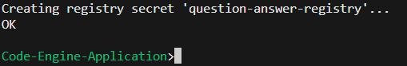
In the console you should have something like 
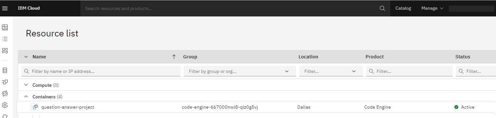

with
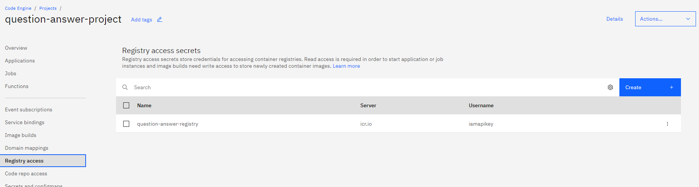

### For Docker Container

If you want to load  your Docker Container from Docker site, we setup the Docker credentials in the Code Engine

```
ibmcloud ce secret create --format registry --name my-docker-registry --server https://index.docker.io/v1/ --username YOUR_USERNAME --password YOUR_PASSWORD
```

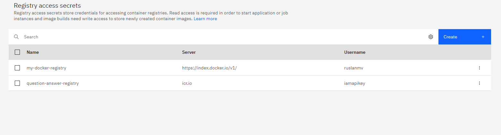

## Step 9 - Secrets and configmaps

It is possible to use the 'Secret' object in Code Engine to store sensitive information for connection in a secure way. 


```
ibmcloud code-engine secret create --name bucket-secret --from-env-file secrets.env
```


 In the project's dashboard navigate to 'Secret and Configmap' and create a Secret you will have something like

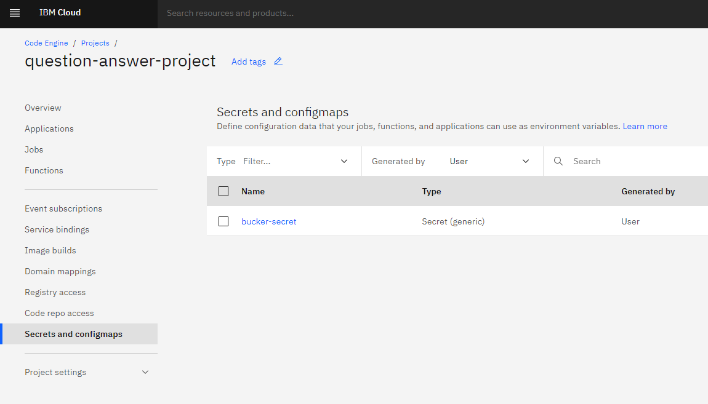

 You can see the secret  This will be store in a key:value format.
 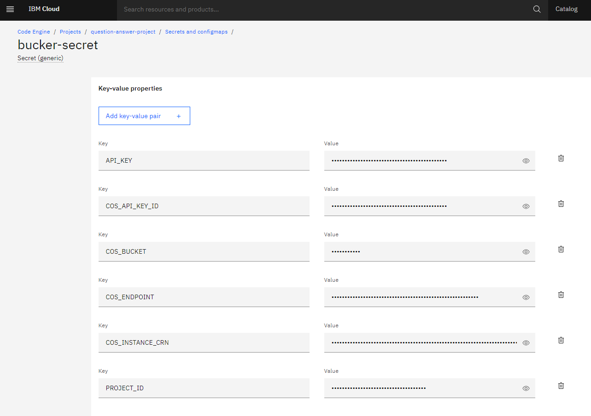

After that it is possible to create the application and, in the environment variable section, connect the application to the secret. The application can now access the data with the standard API for environment variables.


7. Create the Code Engine application using the image from IBM Cloud Container Registry.
   To create an application in IBM Cloud Code Engine with the previously created secrets 


## Step 10 - Create application from IBM Cloud Container

To create an application in IBM Cloud Code Engine using an image from IBM Cloud Container Registry and the previously created secrets, you can modify the command as follows:

```bash
ibmcloud code-engine application create --name question-answer --image icr.io/question-answer-namespace/question-answer:latest --port 8501 --env-from-secret bucket-secret --registry-secret question-answer-registry
```

In this command:

- `question-answer` is the name you want to give to your application.

- `icr.io/question-answer-namespace/question-answer:latest` is the image reference for your application.
  The `question-answer-namespace` is the namespace with the image tag `latest` .
- `8501` is the port on which your application will listen.

- `--env-from-secret bucket-secret` specifies the secret you previously created (`bucket-secret`) to be used as environment variables for your application.

- `--registry-secret question-answer-registry` specifies the name of the registry secret `question-answer-registry` that contains the credentials for accessing the container registry.

By providing the `--registry-secret` flag, you are ensuring that the necessary credentials are available to access the container registry where the image is stored. 


### Create Application from Docker

If you want to create the application form the Docker Container 

```
ibmcloud code-engine application create --name question-answer --image docker.io/ruslanmv/question-answer:latest --port 8501 --env-from-secret bucket-secret --registry-secret my-docker-registry
```

After you typed the previous command you will get the following response
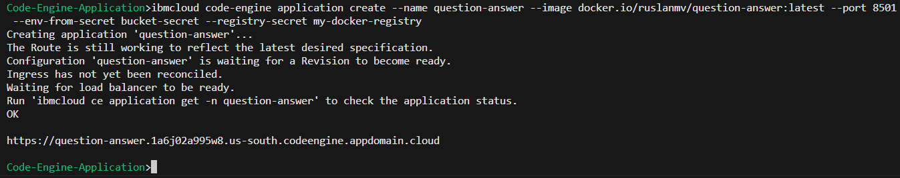

In my case when you open your browser with the following  url

https://question-answer.1a6j02a995w8.us-south.codeengine.appdomain.cloud

The application will loading, after that you can upload a sample [questions.txt](questions.txt),
then you upload this file then it is processed and you got the following results: 
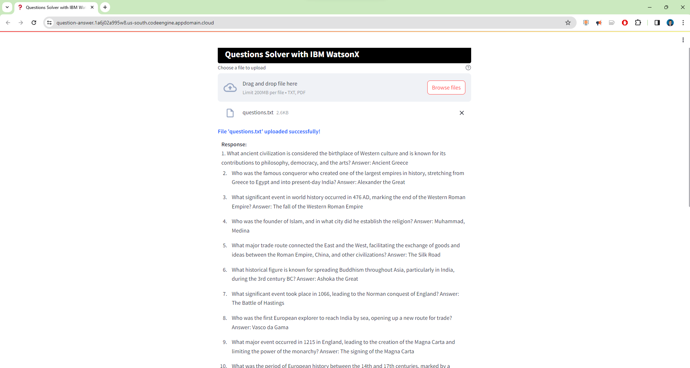
You can check this application in the console in IBM Cloud, 
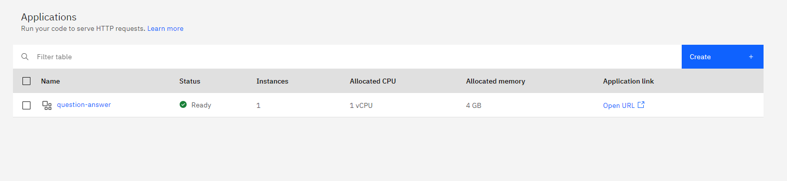
in the Code Engine within overview 

with the following configuration
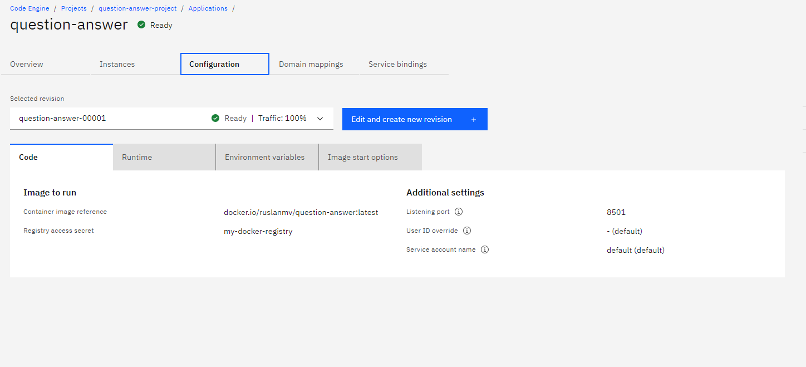


By following the steps outlined above, you can create an **AI-Powered Exam Solver web app using Streamlit**, IBM Cloud Object Storage, and WatsonX. Users will be able to upload a document text file with questions, and the app will process it using WatsonX, providing a the answers as the result.  Feel free to customize and enhance the app based on your specific requirements.

**Congratulations!** We hope this blog has been helpful in guiding you through the process of creating this web app. Happy coding!

