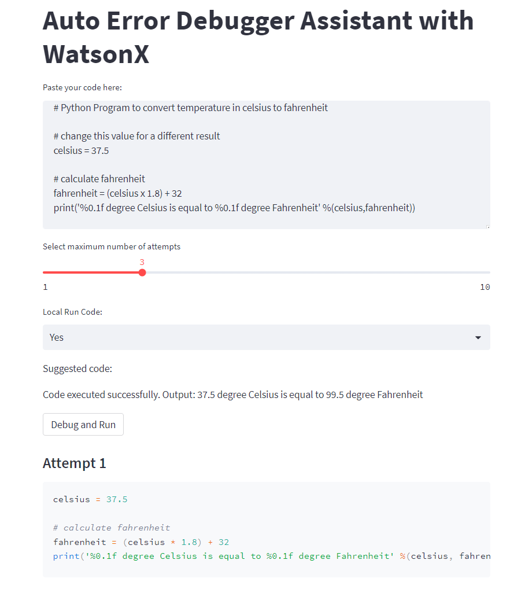
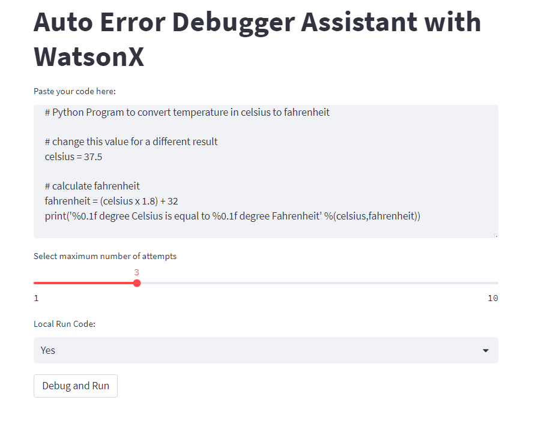
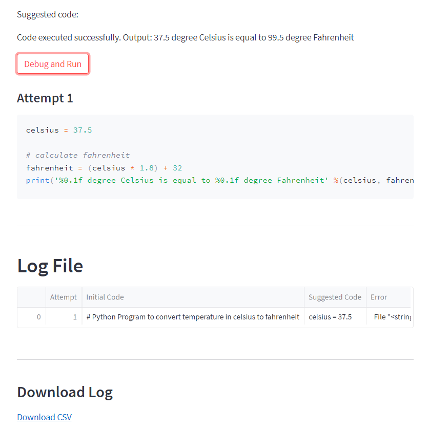
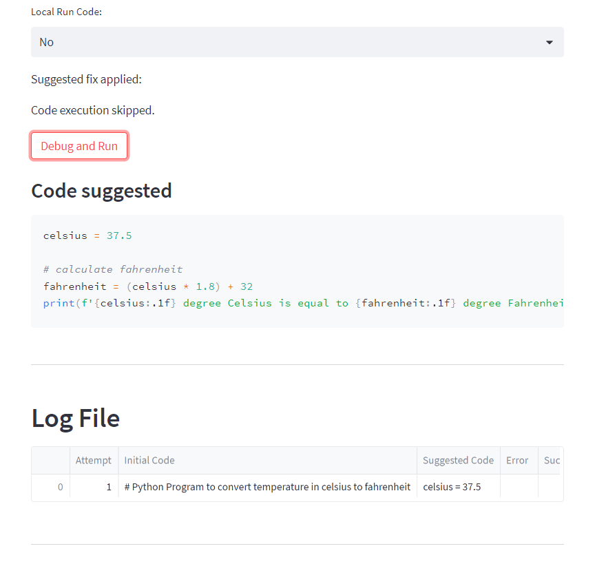
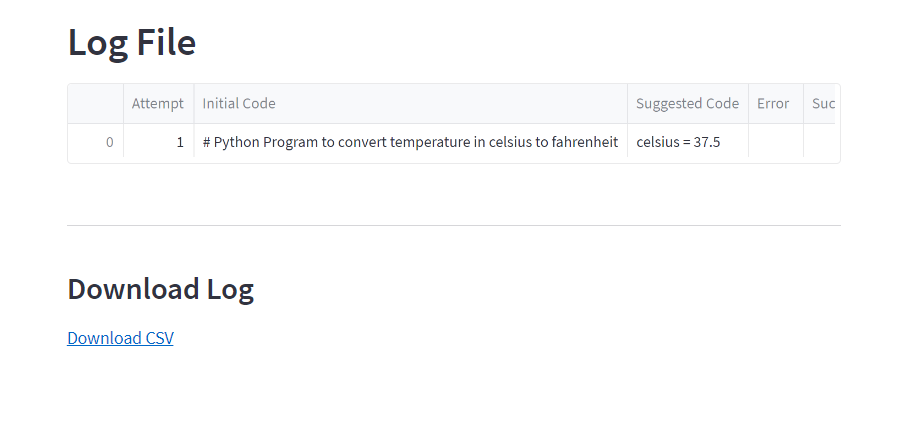
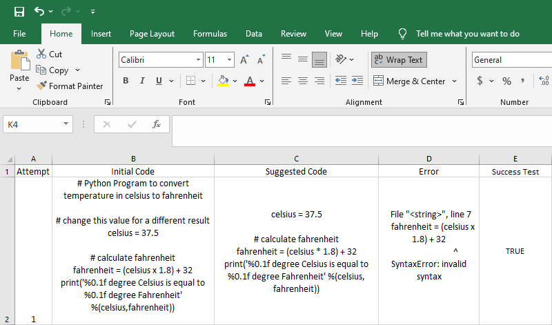

Welcome to the Auto Error Debugger Assistant with **WatsonX.ai**! This tool helps you debug and run your code efficiently by automatically suggesting fixes based on error messages. Let's understand how this assistant works and how you can use it effectively.

The idea behind this program is to create an automated debugging assistant using a chatbot with **WatsonX.ai**. Here's a step-by-step explanation of how it could work:

1. First, a user provides a piece of code to the program, which attempts to run it.
2. If the code runs without any errors, the program completes its task, and the user receives the output.
3. However, if an error occurs during execution, the program captures the error message and relevant code.
4. The error message and problematic code are then passed to the chatbot prompt, which is designed to understand and resolve code issues.
5. The chatbot analyzes the error message and code, identifies the problem, and suggests a solution to fix it.
6. The user receives the chatbot's proposed fix and can choose to apply the suggested changes to the code.
7. The modified code is then run again by the program.
8. If additional errors are encountered, steps 3-7 are repeated until the code runs without any issues.
   

## Introduction

In this blog post, we will discuss how to create an Auto Error Debugger Assistant using **WatsonX.ai** and **Streamlit**. This application will allow users to paste their Python code, and the assistant will debug it, providing fixes in real-time. We will guide you through setting up the Python environment, installing necessary packages, and implementing the full application code.

Prerequisites:

- Python 3.x installed
- Access to a terminal or command prompt
- IBM Account with WatsonX.ai enabled

## Step 1: Set up a Python Virtual Environment

First, open a terminal or command prompt and navigate to the directory where you want to create your project. Then, create a virtual environment to isolate the project dependencies.

For macOS and Linux:

```bash
python3 -m venv myenv
source myenv/bin/activate
```

For Windows:

```bash
python -m venv myenv
myenv\Scripts\activate
```

## Step 2: Install Streamlit

With the virtual environment activated, install Streamlit using pip:

```bash
pip install streamlit ibm-watson python-dotenv pandas ibm-cloud-sdk-core
```

## Step 3: Integrate Chatbot API

For this application, you will need to integrate a chatbot API, like WatsonX, which can analyze errors and provide code fixes. In this example, we assume you have access to a chatbot API and have implemented a function called `get_chatbot_suggestion` that takes the error and code as input and returns a suggested fix.

1. Create a new file named `.env` in your project directory.

2. Open `.env` in a text editor and add the following lines:

   ```
   API_KEY=<your-api-key>
   PROJECT_ID=<your-project-id>
   ```

   

   Replace `<your-api-key>` with the API key obtained from the WatsonX.ai service credentials, and `<your-project-id>` with the URL of  WatsonX.ai service instance.


## Step 4: Create the Streamlit Application

The code is written in Python and uses the Streamlit library for building the web interface. It also relies on the `subprocess` module to run the code snippets and the `pandas` library to handle and display the log data. The `utils` module contains additional helper functions that are used in the code.
First, create a new Python file (e.g., `debugger_app.py`) and paste the following code:

```python
import streamlit as st
import subprocess
import pandas as pd
from utils import *
import base64

def run_code(code):
    result = subprocess.run(["python", "-c", code], capture_output=True, text=True)
    if result.returncode == 0:
        return True, result.stdout
    else:
        return False, result.stderr  

st.title("Auto Error Debugger Assistant with WatsonX")

code_input = st.text_area("Paste your code here:", height=200)
max_attempts = st.slider("Select maximum number of attempts", 1, 10, 3)
run_option = st.selectbox("Local Run Code:", ("Yes", "No"))
fixed_code = st.empty()
output_zone = st.empty()


log_data = []

if st.button("Debug and Run"):
    if run_option == "Yes":
        code = code_input
        attempt = 1
        success = False
        error = ""  # Initialize the error variable
        while success == False and attempt <= max_attempts:
            output_zone.write(f"Attempt {attempt}: Running code...")
            success, output = run_code(code)
            if success:
                output_zone.write(f"Code executed successfully.\nOutput: {output}")
                fixed_code.write("Suggested code:")
                st.markdown("### Code suggested")
                st.code(code, language='python')
                log_data.append([attempt, code_input, code, "", success])
                break
            else:
                error = output
                suggestion = get_chatbot_suggestion(error, code)  # Use your chatbot API to get the suggestion
                code = suggestion  # Update the code with the fixed version from the chatbot
                output_zone.write("Trying again with the fixed code...")
                success, output = run_code(code)
                output_zone.write(f"Code executed successfully.\nOutput: {output}")
                fixed_code.write("Suggested code:")
                st.markdown("#### Attempt "+str(attempt))
                st.code(code, language='python')
                log_data.append([attempt, code_input, code, error, success])
                attempt += 1
    else:
        output_zone.write("Code execution skipped.")
        error = ""
        code = code_input
        suggestion = get_chatbot_suggestion(error, code)  # Use your chatbot API to get the suggestion
        code = suggestion  # Update the code with the fixed version from the chatbot
        fixed_code.write("Suggested fix applied:")
        st.markdown("### Code suggested")
        st.code(code, language='python')
        attempt = 1
        log_data.append([attempt, code_input, code, "", ""])

log_df = pd.DataFrame(log_data, columns=["Attempt", "Initial Code", "Suggested Code", "Error", "Success Test"])
log_df = log_df.reset_index(drop=True)

if len(log_data) > 0:
    st.markdown("---")
    st.markdown("## Log File")
    st.dataframe(log_df)
    st.markdown("---")
    st.markdown("### Download Log")
    csv = log_df.to_csv(index=False)
    b64 = base64.b64encode(csv.encode()).decode()
    href = f'<a href="data:file/csv;base64,{b64}" download="log.csv">Download CSV</a>'
    st.markdown(href, unsafe_allow_html=True)


```


## Step 5. WatsonX.ai Debugger

We are going to use the chatbot API and  implement the `get_chatbot_suggestion` function to communicate with the chatbot.

We create a file  called utils.py and we paste the following code:

```python
import os
import logging
import requests
from dotenv import load_dotenv
from ibm_watson_machine_learning.foundation_models import Model
from ibm_watson_machine_learning.metanames import GenTextParamsMetaNames as GenParams
from ibm_watson_machine_learning.foundation_models.utils.enums import ModelTypes

load_dotenv()
def getBearer(apikey):
    form = {
        'apikey': apikey,
        'grant_type': "urn:ibm:params:oauth:grant-type:apikey"
    }
    logging.info("About to create bearer")
    response = requests.post(
        "https://iam.cloud.ibm.com/oidc/token",
        data=form
    )
    if response.status_code != 200:
        logging.error("Bad response code retrieving token")
        raise Exception("Failed to get token, invalid status")
    json = response.json()
    if not json:
        logging.error("Invalid/no JSON retrieving token")
        raise Exception("Failed to get token, invalid response")
    logging.info("Bearer retrieved")
    return json.get("access_token")


load_dotenv()
parameters = {
    GenParams.DECODING_METHOD: "greedy",
    GenParams.MAX_NEW_TOKENS: 1000,
    GenParams.STOP_SEQUENCES: ["\n\n\n"]
}
project_id = os.getenv("PROJECT_ID", None)
credentials = {
    #"url": "https://eu-de.ml.cloud.ibm.com",
    "url": "https://us-south.ml.cloud.ibm.com",
    "apikey": os.getenv("API_KEY", None)
}
credentials["token"] = getBearer(credentials["apikey"])
model_id = ModelTypes.LLAMA_2_70B_CHAT
# Initialize the Watsonx foundation model
llm_model = Model(
    model_id=model_id,
    params=parameters,
    credentials=credentials,
    project_id=project_id
)


def generate_code(code, language, message_error):
    code_prompts = []
    code_prompt = f"""You are given a code snippet in {language} that contains syntax errors and logical issues. 
    Your task is to fix the code and provide the corrected version as the final result. 
    You should not provide any explanation or additional information; only the fixed code should be included in your response."""
    print("Input Error",message_error)
    print(type(message_error))
    if message_error:
        print("Prompt has error")
        inst_prompt = f"""<s>[INST] <<SYS>> 
            {code_prompt}
            <</SYS>> 
            The following is input code: {code}.
            [/INST]  
            The error is: {message_error}.
            Answer only in {language} code:"""
        
    else:
        print("Prompt has no error")
        inst_prompt = f"""<s>[INST] <<SYS>> 
            {code_prompt}
            <</SYS>> 
            The following is input code: {code}.
            [/INST]  Answer only in {language} code: """
        
    code_prompts.append(inst_prompt)
    logging.info("The code prompt is" + str(code_prompts))
    logging.info("Sending prompt for code")
    result = llm_model.generate(
        code_prompts
    )
    code = ""
    for item in result:
        code += item['results'][0]['generated_text']
    logging.info("Obtained result")
    return code.strip()

def get_chatbot_suggestion(error, code):
    # Generate code fix using CodeGenerator
    generated_code = generate_code(code=code, language="Python", message_error=error)
    return generated_code
```


Step 5: Run the Streamlit Application

To run the application, type the following command in your terminal or command prompt:

```bash
streamlit run debugger_app.py
```

This will launch the Streamlit application.


### Inputting the Code

To start using the assistant, simply paste your code into the provided text area. You can write any Python code you want to debug and run. The code will be displayed in a gray code block for better readability.

### Selecting the Run Option

Next, you can select the run option from the drop-down menu. You have two options: "Yes" and "No". If you select "Yes", the code will be executed and debugged. If you select "No", the code execution will be skipped, and no debugging will occur. This option is useful when you just want to see the suggested fix without running the code.

### Setting the Maximum Attempts

Another option available is to set the maximum number of attempts allowed for debugging. By default, it is set to 3 attempts. However, you can adjust this value using the slider provided. You can choose any value between 1 and 10 attempts.

### Debugging the Code

When you click the "Debug and Run" button, the assistant starts executing your code. If you selected "No" for the run option, it will display a message indicating that the code execution is skipped. Otherwise, it will proceed with the debugging process.

The assistant will attempt to run the code and check if it executes successfully. If it does, the assistant will display the output of the code execution and provide the suggested code as a fix for any errors encountered. The suggested code will be displayed in a gray code block.

If the code execution fails, the assistant will capture the error message and use it to obtain a suggestion from the WatsonX chatbot API (replace `get_chatbot_suggestion()` with your own chatbot API call). The suggestion is then applied as a fix to the code, and the assistant will display the fixed code and retry the execution. This process will be repeated until either the code executes successfully or the maximum number of attempts is reached.

### Logging the Attempts

The assistant keeps track of all the attempts made during the debugging process. It logs the initial code, the attempt number, the suggested code, the error encountered, and whether the code executed successfully. The log data is displayed in a table format below the code area.

### Downloading the Log

At the end of the web interface, you will find a button to download the log as a CSV file. This log file contains all the attempts made during the debugging process, allowing you to review and analyze the results later.


## Step 7. Example of Run

Let use consider the following python code that has a typo error

```python
# Python Program to convert temperature in celsius to fahrenheit

# change this value for a different result
celsius = 37.5

# calculate fahrenheit
fahrenheit = (celsius x 1.8) + 32
print('%0.1f degree Celsius is equal to %0.1f degree Fahrenheit' %(celsius,fahrenheit))

```

we copy it and paste in our program and click Debug and Run

then we wait and then we go the following:

If we choose perform the correction without run the test

You can download the logs in the log section

and you can check it with excel for example to analize the changes



With the Auto Error Debugger Assistant using **WatsonX** and **Streamlit**, developers can efficiently debug their Python code and receive real-time suggestions for fixing errors. This application serves as a valuable tool for enhancing code quality and performance, saving time and effort in the debugging process.

**Congratulations!** You have learned how to debug you python code with multiple chatbots by using Llama 2.