Hello everyone, today we are going to learn how to install some amazing models in **Generative AI** for image generation from text, specifically installing the models on **Google Colab**.

We will be creating images using **Diffusion Models** similar to the examples shown below:


There are tons of models available for generating images from text, and the name for those models, based on the architecture from which they come, is **Stable Diffusion Models.** For more information, you can visit this blog [here](https://ruslanmv.com/blog/Diffusion-Models-in-Machine-Learning).

Fortunately, there are many hubs where enthusiastic individuals upload their models to the public, and we can download and use them as needed.

Among the most famous sites to download these models are:

[https://huggingface.co/](https://huggingface.co/models?pipeline_tag=text-to-image&sort=trending)


[https://civitai.com/](https://civitai.com/)


In this tutorial, we are going to learn how to download and run the models.

What you need:

- A **Google Drive** account (free): [Create or log in here](https://www.google.com/intl/fr/drive/).
- **Automatic 1111 Notebook**

The Automatic 1111 Notebook is a web UI that utilizes powerful AI scripts.

First, we will run the models, and in a subsequent blog post, we will discuss in detail how to load them manually in a simple Python code.

## Step 1 - Load the Notebook

First let us open the following notebook [here](https://colab.research.google.com/github/TheLastBen/fast-stable-diffusion/blob/main/fast_stable_diffusion_AUTOMATIC1111.ipynb).

Once you opened it, click on **Copy to Drive**

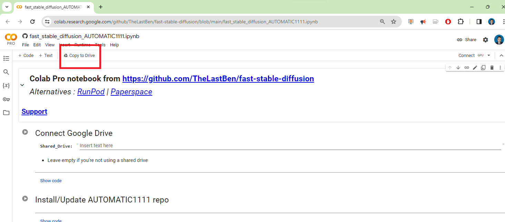

Then will be requested to log in your Google Drive Account (your mobile may be required for confirmation)

## Step 2 - Change Runtime Type

In the top left menu of the notebook we click the  small down arrow icon and click change Runtime Type.


We choose a suitable hardware accelerator based on the model we are going to run. In this demo, we will select the basic **T4 GPU**. I am using **Colab Pro** for this demo, and you can opt for up to an **A100 GPU** with **High RAM** if you desire high specifications for your image generation.

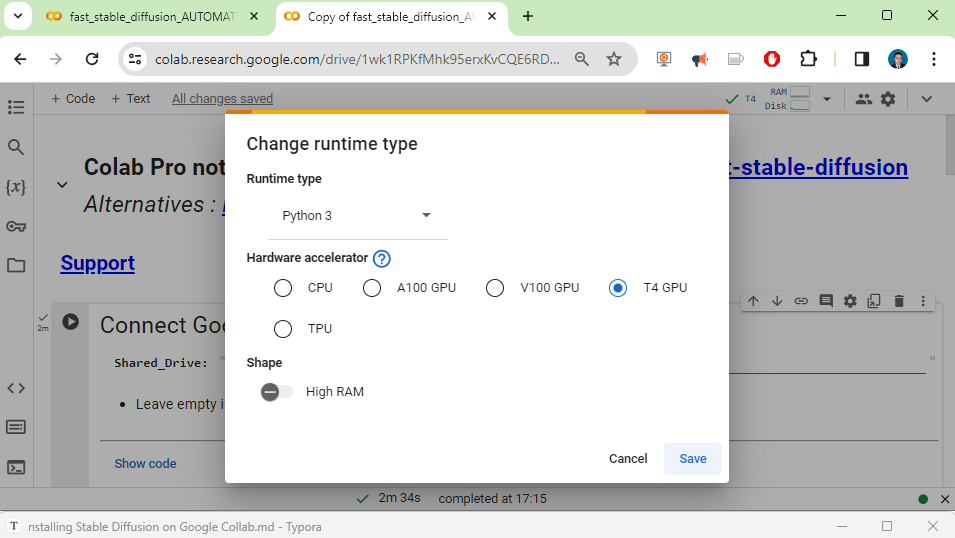

More info about GPUs [here](https://research.google.com/colaboratory/faq.html#gpu-availability).

## Step 3 - Running the Notebook

When you run the first cell, it will ask for access to your Google Drive files. We will need your permission to connect your Colab Notebook to your Drive account.


and we connect with our google drive


then you can run the cell Install Update Automatic and Requirements

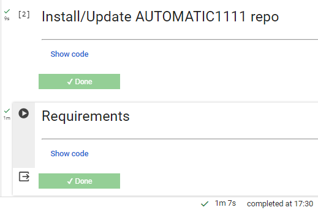

## Step 4   Load  Models

The Model Download block needs special attention, since this is where you can customize your Stable Diffusion.

Due to I would like to do a simple test let us use Temp Storage.


If would want use the default model, you can choose, one of the previous models listed there.

## Step 5   Download Model  

If you want to add other models, you can now re-run this Model block , to add other *Models* engine. These models engine are to be downloaded from  **Hugging Face** or **Civitai**

### Downloading from Hugging Face

You can download your models from Hugging face , you may search by name or scroll all of them. [here](https://huggingface.co/models?pipeline_tag=text-to-image&sort=downloads)

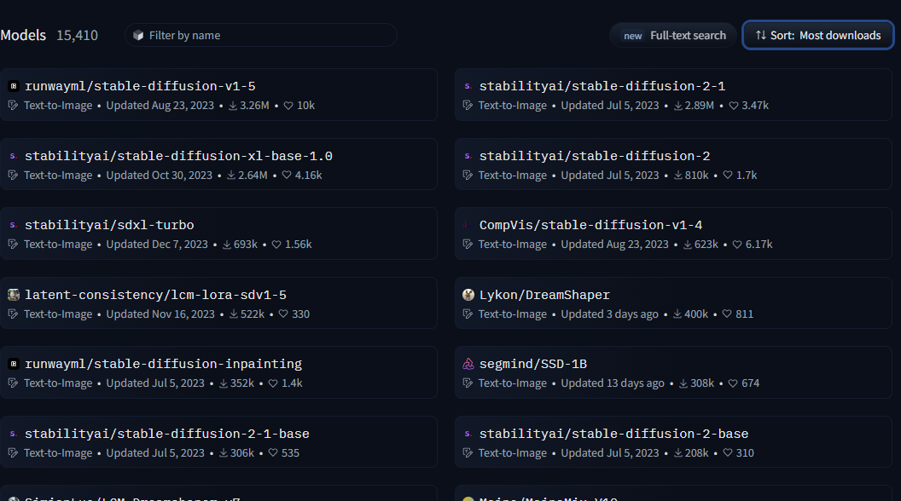

Choose a model that you like, look for a big file. There are different type files of the models like `.safetensors`, `.bin`, `.pickle`, etc. These models are designed to convert textual information into images or generate images based on textual input. Diffusion models are a type of generative model that can be used to create realistic images, videos, and text.

| Feature        | Safetensors  | pickle                   | .bin           | HDF5                              |
| -------------- | ------------ | ------------------------ | -------------- | --------------------------------- |
| Safety         | Safe         | Unsafe                   | Unsafe         | Safe                              |
| Performance    | Fast         | Slow                     | Fast           | Fast                              |
| Cross-platform | Yes          | Yes                      | Yes            | Yes                               |
| Serialization  | Tensors only | Arbitrary Python objects | Arbitrary data | Tensors and other data structures |

**Table 1.0 Common Filetypes of Difussion Models.** 

However, diffusion models can also be used to generate harmful or offensive content. One way to make diffusion models safer is to use a file format that does not allow for code execution.

Pickle is a common file format for storing Python objects, but it is not safe for diffusion models. This is because pickle can be used to serialize arbitrary Python objects, including code. When a pickle file is loaded, the code is executed, which could potentially be malicious. 

A safer file format for diffusion models is Safetensors. Safetensors is a file format that only supports serializing tensors, which are immutable data structures that cannot be used to execute code. This makes Safetensors a more secure way to share diffusion model weights

There some points into consider about Safetensors:

- **Safetensors** is a new serialization format developed by a Hugging Face; it is like a special way to save and retrieve big and complicated data chunks called tensors which are crucial in deep learning; deep learning involves working with lots of data and sometimes dealing with these big data pieces can be tricky.
- **Safer:** Safetensors does not allow for code execution, making it a more secure way to share model weights.
- **Faster:** Safetensors uses a zero-copy approach to loading tensors, which can significantly speed up loading times, especially for large tensors.
- **Cross-platform:** Safetensors is designed to be cross-platform, so you can use it to store and load 

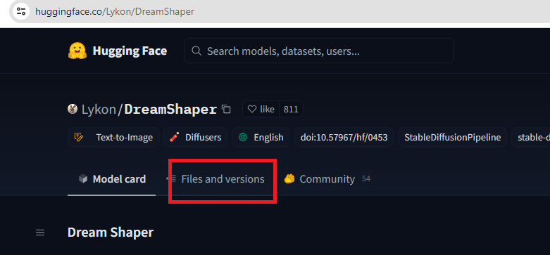

Then you can download the latest version

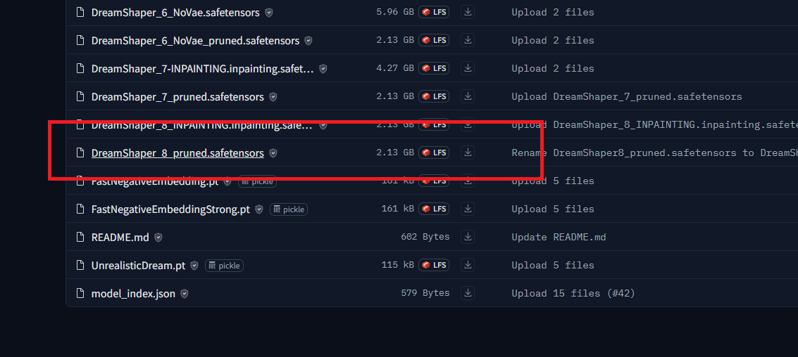


Diffusion models can use either **FP32** or **FP16** datatypes, but FP32 is generally preferred for its higher precision. However, FP16 can be a good option for models that are memory-intensive or that need to run on devices with limited processing power.

FP32 stands for **single-precision floating-point format** and it is the most common data type used in machine learning. It has a precision of 32 bits and can represent a wide range of numbers.

FP16 stands for **half-precision floating-point format** and it is a less precise data type that uses only 16 bits. This makes it smaller and faster than FP32, but it can also lead to loss of precision.

Here is a table of the pros and cons of using FP32 and FP16 in diffusion models:

| Data type | Pros                              | Cons                                        |
| :-------- | :-------------------------------- | :------------------------------------------ |
| FP32      | Higher precision, better accuracy | Larger size, slower                         |
| FP16      | Smaller size, faster              | Lower precision, potential loss of accuracy |

The best data type for a diffusion model will depend on the specific needs of the model. If accuracy is paramount, then FP32 is the best choice. However, if memory or processing power is limited, then FP16 may be a better option.

You also can download some of the **Hugging Face** models in from **Civitai.**

### Downloading from Civitai

There different models that you can choose, choose the one that you like, you can  choose a nice model in the library. It's categorized by theme.


Click on the model that you would like use to create and download it. Read the information about the Model, and if it suits you, Download it.


If you want to automatize the downloading procedure  of your favorite models, you can use `civitdl` by installing it

```
pip3 install civitdl
```

We can type this after the cell of requirements


This program can be executed by this syntaxy's  `civitdl batchfile <txt file path> <destination model folder path>`

For example  assuming that you have a model like this:

`https://civitai.com/models/4384/dreamshaper`

```
civitdl batchstr "https://civitai.com/models/4384/dreamshaper," ./Models
```

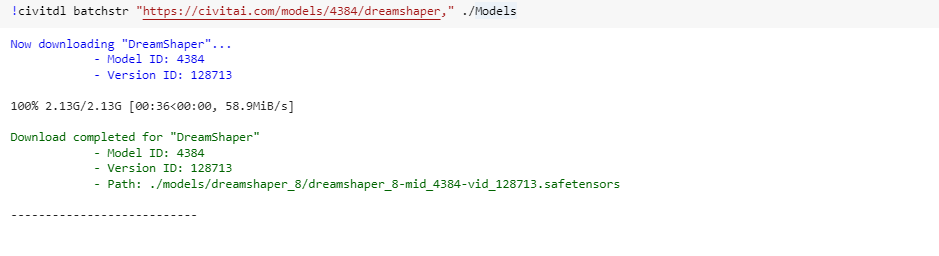

Or if you want to download multiple models for example you can  a create a **batchfile.txt** with a list of the models that you want to download and use , for example

```
text = '''https://civitai.com/models/140737/albedobase-xl,
https://civitai.com/models/46422/juggernaut,
https://civitai.com/models/241415/picxreal,
https://civitai.com/models/97744/realcartoon-realistic
'''
models = text.split('\n')
with open('batchfile.txt', 'w') as file:
    for model in models:
        file.write(model + '\n')
```

the previous program download the models like

```
civitdl batchfile batchfile.txt ./Models
```

## Step 6 Copy the folder path

Now go back to your Colab space (it should be the tab before) , and right-click on the Model Folder to copy the full path of the folder

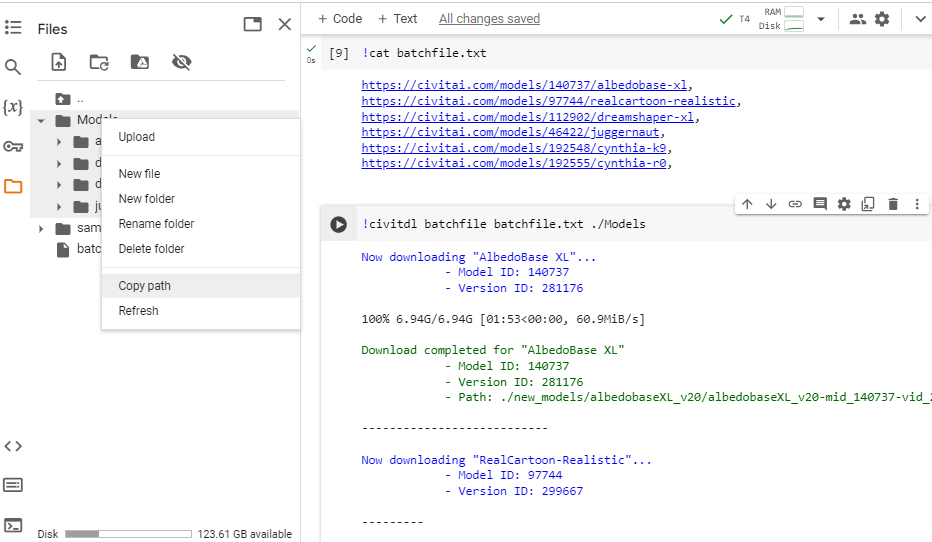

We copy the path of the folder Model.

Now you can fill the required field **Path_to_MODEL** in the block `Model Download`, and run the script with the play icon.

It will load all the models that are in the Model folder. You're done with the Models import.


then you run the latest two cells without changing something


and finally


and you got


## Step 7 Playground Generation - Prompting

This is one of the most funny and interesting parts of this demo — the generation of images and the improvement.

Once we have the previous screen, let's try to play with this prompt.

```
A woman wearing an ais-metal bikini, standing on a tropical beach
```

Let us just to reproduce the following image for yours, let use the model `albedobaseXL_v20/albedobaseXL_v20-mid_140737-vid_281176.safetensors [a928fee35b]` and we keep the default settings we set only

**seed** =`1922608063`

as follows:

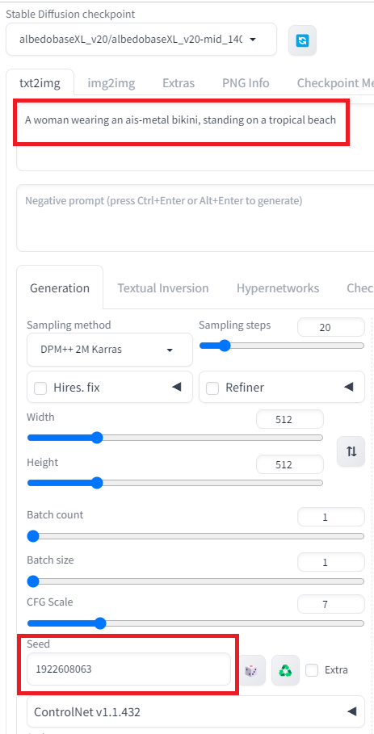

Then when we click Generate

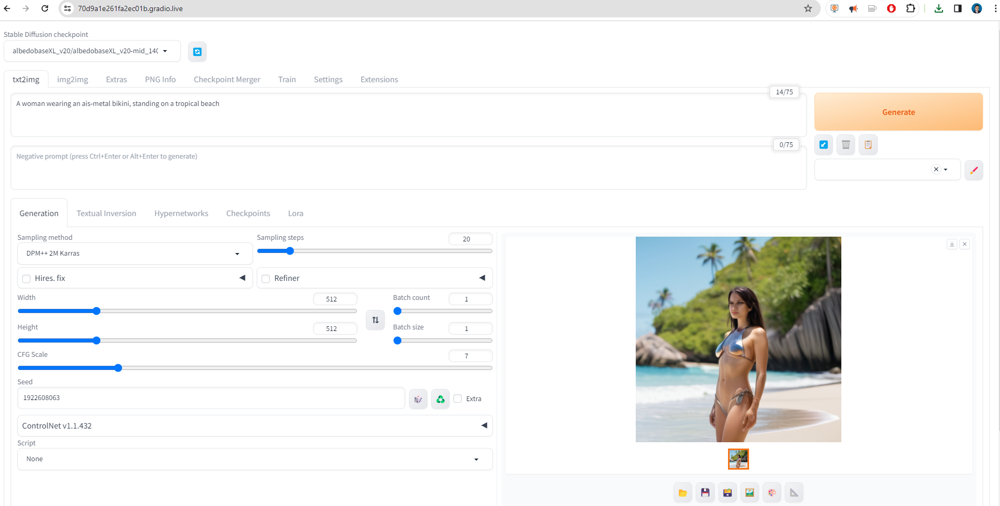

we got the following picture


```
An woman wearing an ais-metal bikini, standing on a tropical beach
Steps: 20, Sampler: DPM++ 2M Karras, CFG scale: 7, Seed: 1922608063, Size: 512x512, Model hash: a928fee35b, Model: albedobaseXL_v20-mid_140737-vid_281176, Version: v1.7.0
```

as you see is not perfect the imagen and is blurred is not great picture, however, it is possible improve it.

Below of the picture you can  see the properties of the picture to be generated

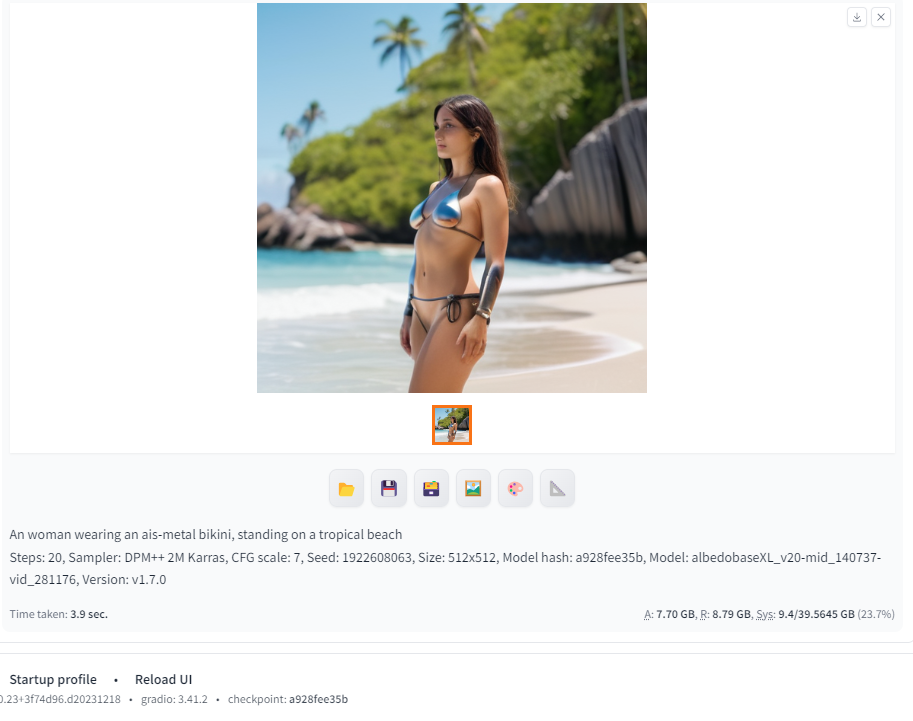


Let us try to improve this part.

## Step 8  - Sampling Methods and  Lora

 Sampling methods and LoRA are important techniques for improving the performance and efficiency of diffusion models, which are a type of generative model used to create realistic images and videos. Sampling methods control how the latent space of the model is navigated to create the final image, while LoRA reduces the computational burden associated with fine-tuning large-scale diffusion models. By combining these techniques, we can create more powerful and versatile diffusion models.

First, we can improve the previous model by using another model called **Metallic Iridescence SDXL**, which you can download  [here](https://civitai.com/models/270394/metallic-iridescence-sdxl?modelVersionId=304805).

](../assets/images/posts/2024-01-20-How-to-install-Stable-Diffusion-Models-on-Google-Colab/image-20240120223800707.png)

With this model we can download it `Metallic_Iridescence_SDXL.safetensors`

and paste into the path `/content/gdrive/MyDrive/sd/stable-diffusion-webui/models/Lora`, by uploading

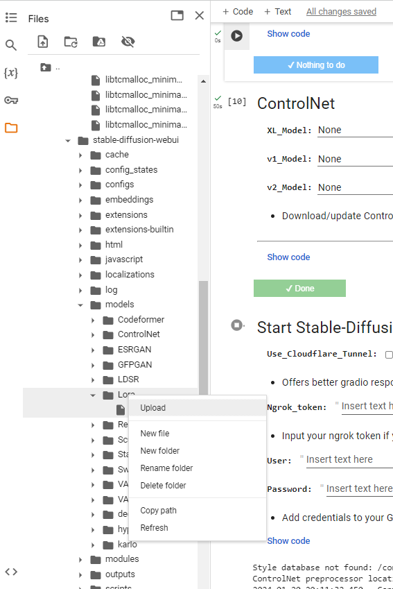

once you uploaded this model, you can  go to the Lora menu and then refresh and you install the add on.

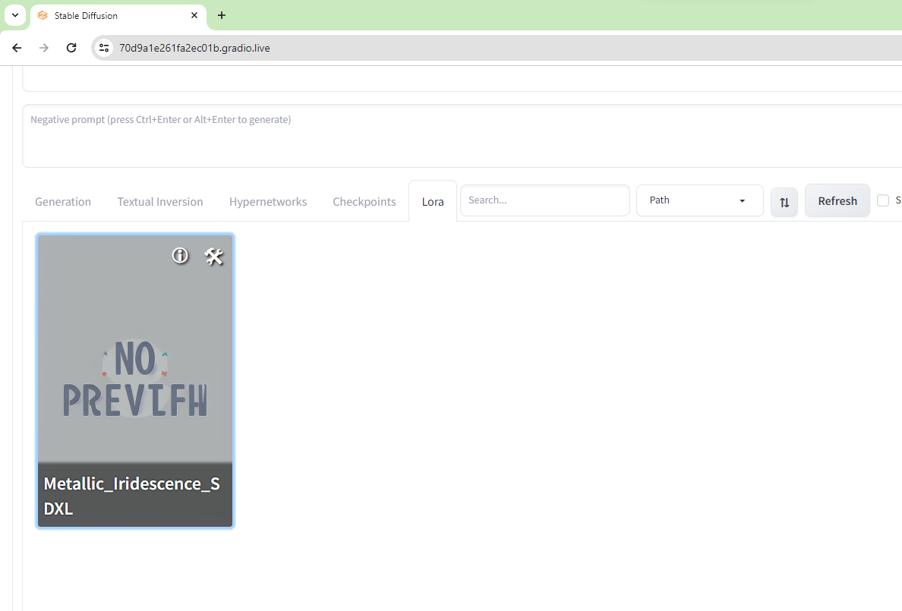

you return back to your Generation menu and change the **Sampling method** to **DPM++ 3M SDE Karras**


then you change the following parameters:  **Sampling steps** = **42**

.png)

```
A woman wearing an ais-metal bikini, standing on a tropical beach
Steps: 42, Sampler: DPM++ 3M SDE Karras, CFG scale: 7, Seed: 1922608063, Size: 512x512, Model hash: a928fee35b, Model: albedobaseXL_v20-mid_140737-vid_281176, Version: v1.7.0
```

Still you don't see something good, we just changed the Sampler, let us now add the Lora. This is possible now by changing the prompt to

```
A woman wearing an ais-metal bikini, standing on a tropical beach <lora:Metallic_Iridescence_SDXL:0.5>
```

.png)

```
A woman wearing an ais-metal bikini, standing on a tropical beach <lora:Metallic_Iridescence_SDXL:0.5>
Steps: 42, Sampler: DPM++ 3M SDE Karras, CFG scale: 7, Seed: 1922608063, Size: 512x512, Model hash: a928fee35b, Model: albedobaseXL_v20-mid_140737-vid_281176, Lora hashes: "Metallic_Iridescence_SDXL: faec5ae5859d", Version: v1.7.0
```

As you see now **Metallic_Iridescence_SDXL** add some special effects to the previous picture.

## Step 8  - Upscaling and Refiner

Upscaling and Refiner are two methods used in diffusion models to improve the quality and detail of generated images. Upscaling involves enlarging the size of the image while preserving its resolution, while Refiner enhances the image's sharpness and clarity. Together, Upscaling and Refiner work to create high-quality images that are more visually appealing and realistic.

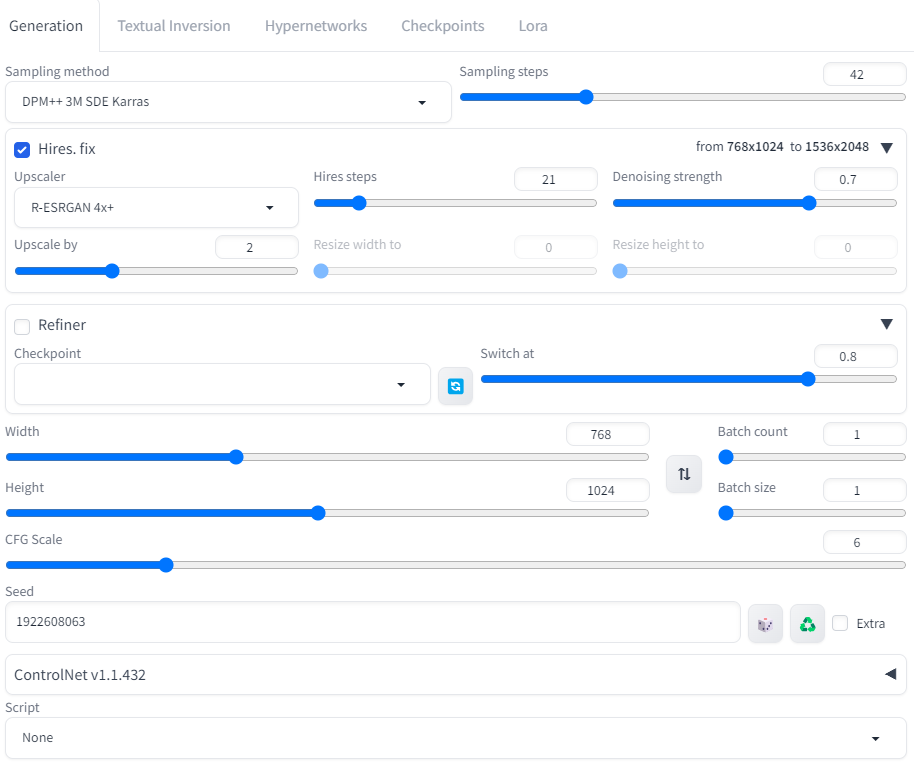

Finally the last  improvment that we will show is the upscaling we enable **Hires. fix** and we add the following parameters:

**Hires steps**:21

**Upscaler:**R-ESRGAN 4x+

**Upscale by**: 1.5

we enable **Refiner** and we add the following parameters:

**Width:**768

**Height:**1024

**CFG Scale**: 6

.png)

```
A woman wearing an ais-metal bikini, standing on a tropical beach <lora:Metallic_Iridescence_SDXL:0.5>
Steps: 42, Sampler: DPM++ 3M SDE Karras, CFG scale: 6, Seed: 1922608063, Size: 768x1024, Model hash: a928fee35b, Model: albedobaseXL_v20-mid_140737-vid_281176, Denoising strength: 0.7, Hires upscale: 2, Hires steps: 21, Hires upscaler: R-ESRGAN 4x+, Lora hashes: "Metallic_Iridescence_SDXL: faec5ae5859d", Version: v1.7.0
```

And finally if you want you can change the resolution

**Width:**1024

**Height:**768

.png)

```
A woman wearing an ais-metal bikini, standing on a tropical beach <lora:Metallic_Iridescence_SDXL:0.5>
Steps: 42, Sampler: DPM++ 3M SDE Karras, CFG scale: 6, Seed: 1922608063, Size: 1024x768, Model hash: a928fee35b, Model: albedobaseXL_v20-mid_140737-vid_281176, Denoising strength: 0.7, Hires upscale: 2, Hires steps: 21, Hires upscaler: R-ESRGAN 4x+, Lora hashes: "Metallic_Iridescence_SDXL: faec5ae5859d", Version: v1.7.0
```

You can have more details of the beach.

Or just if you want to remove the metalic effect you can change the prompt:

```
A  woman in, sexy bikini standing on a tropical beach
```

.png)

Or just try with this prompt

```
A  woman , sexy bikini standing on a tropical beach
```

.png)

Moreover you can return back with your favorite metal design as follows:

```
A woman , sexy metalicl bikini standing on a tropical beach <lora:Metallic_Iridescence_SDXL:0.5>
```

.png)

```
A woman , sexy metalicl bikini standing on a tropical beach <lora:Metallic_Iridescence_SDXL:0.5>
Steps: 42, Sampler: DPM++ 3M SDE Karras, CFG scale: 6, Seed: 1922608063, Size: 1024x768, Model hash: a928fee35b, Model: albedobaseXL_v20-mid_140737-vid_281176, Denoising strength: 0.7, Hires upscale: 2, Hires steps: 21, Hires upscaler: R-ESRGAN 4x+, Version: v1.7.0
```

As you see we can improve our pictures by fine tunning the parameters.

You can download this notebook used  [here](https://colab.research.google.com/github/ruslanmv/How-to-install-Stable-Difussion-Models-on-Google-Collab/blob/master/fast_stable_diffusion_AUTOMATIC1111_ruslanmv.ipynb).

**Congratulations!** You have learned how to create amazing pictures by using **Diffusion  Models** in **Google Colab.**
