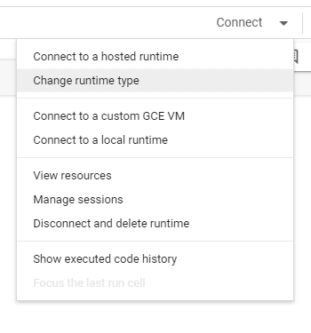
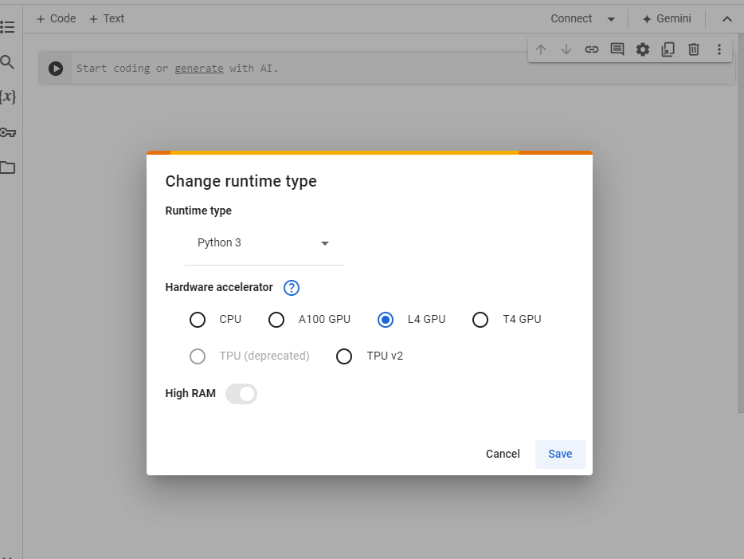
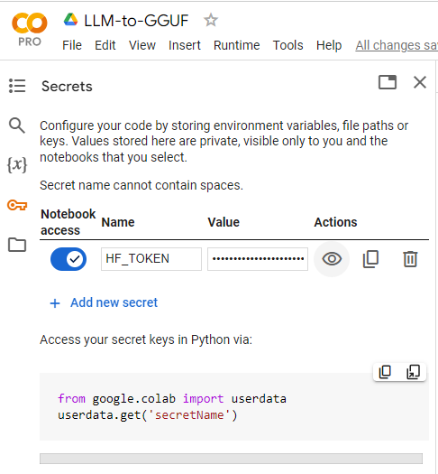
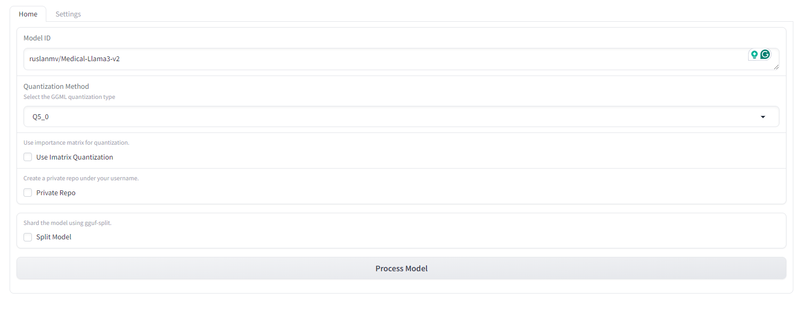
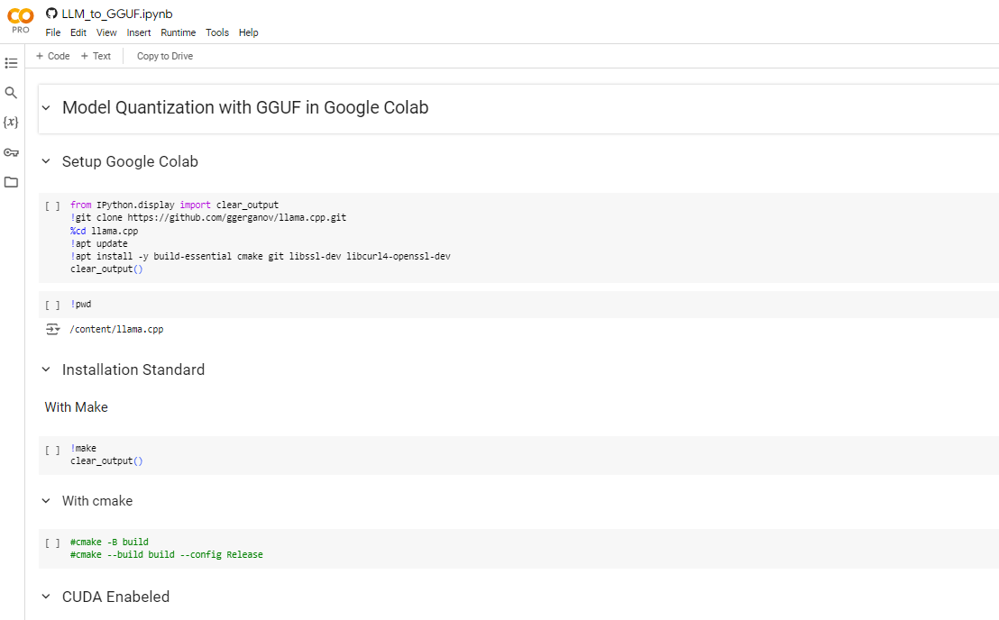

Hello everyone today we are going to convert a LLM model from Hugging Face to GGUF Format by using Google Colab.


## Introduction

GGUF (General Graph Universal Format) is an efficient format optimized for deploying large language models (LLMs) on GPUs. This tutorial will guide you through converting the "ruslanmv/Medical-Llama3-v2" model from Hugging Face to GGUF format using Google Colab.

## Why GGUF?

- **Performance:** Optimized for fast inference on GPUs.
- **Compatibility:** Works seamlessly with the `llama.cpp` library.
- **Customization:** Supports quantization and fine-tuning for specific needs.

## Prerequisites

- **Google Colab Account:** Access to Google Colab.
- **Hugging Face Account and Token:** Obtain from your Hugging Face account settings.
- **`llama.cpp` Repository:** We will clone this repository for conversion tools.

## Step-by-Step Guide

### Step 1: Set Up Google Colab Environment

1. **Open Google Colab:**
   - Go to [Google Colab](https://colab.research.google.com/) in your browser.
   - Click on "New Notebook" to create a new notebook.
     then click on change runtime type



and select L4 GPU and click save.




### Step 2: Install and Clone Repositories

1. **Install Libraries:**

   - Execute the following command in a Colab cell to install essential libraries:

     ```python
     !pip install transformers sentencepiece protobuf accelerate
     ```

2. **Clone `llama.cpp`:**

   - Clone the `llama.cpp` repository to access the conversion tools:

     ```python
     !git clone https://github.com/ggerganov/llama.cpp.git
     ```


### Step 3: Authenticate with Hugging Face

## Add the Secret:

In your Colab notebook, click "Secrets."
Click "Add a new secret."
For the "Name," enter HUGGINGFACE_TOKEN.
For the "Value," paste your actual Hugging Face token.
Click "Add secret."




## Model Quantization with GGUF: A Hands-On Guide in Google Colab


In the world of large language models (LLMs), size matters. These models, like the powerful GPT series, are known for their impressive capabilities but also for their hefty storage requirements. This can make them challenging to run on resource-constrained devices or environments. 

Model quantization offers a solution. It's a technique to reduce the model's size while preserving most of its performance. In this guide, we'll walk through how to quantize a Hugging Face model using the efficient GGUF (GGML Universal File) format within the convenient Google Colab environment.

**Setting Up the Environment**

```python
!git clone https://github.com/ggerganov/llama.cpp.git
!apt update
!apt install -y build-essential cmake git libssl-dev libcurl4-openssl-dev
```

We start by cloning the `llama.cpp` repository, which provides essential tools for working with LLMs. Next, we update our Colab environment and install some necessary libraries for building and interacting with our models.

**Building the Tools**

```python
from IPython.display import clear_output
!make
clear_output(wait=True)
```

Here, we use the `make` command to compile the code within `llama.cpp`, providing us with the tools we need for quantization. (If you're using CUDA, there are specific commands for enabling it, but we'll keep it simple for now.)

**Core Quantization Process**

```python
!pip install -r llama.cpp/requirements.txt
!pip install gradio "huggingface-hub" "gradio_huggingfacehub_search==0.0.7" "APScheduler"

```

Now, we install the Python libraries required by `llama.cpp` and additional tools for user interface and model interaction.

```python
import os
import shutil
import subprocess
import signal
import gradio as gr

from huggingface_hub import create_repo, HfApi
from huggingface_hub import snapshot_download
from huggingface_hub import whoami
from huggingface_hub import ModelCard

from gradio_huggingfacehub_search import HuggingfaceHubSearch

from apscheduler.schedulers.background import BackgroundScheduler

from textwrap import dedent
```

This section imports various Python modules, primarily for handling files, interacting with the Hugging Face Hub (where you might find your model), and creating a user interface.

```python
def generate_importance_matrix(model_path, train_data_path):
    imatrix_command = f"./llama-imatrix -m ../{model_path} -f {train_data_path} -ngl 99 --output-frequency 10"

    os.chdir("llama.cpp")

    print(f"Current working directory: {os.getcwd()}")
    print(f"Files in the current directory: {os.listdir('.')}")

    if not os.path.isfile(f"../{model_path}"):
        raise Exception(f"Model file not found: {model_path}")

    print("Running imatrix command...")
    process = subprocess.Popen(imatrix_command, shell=True)

    try:
        process.wait(timeout=60)
    except subprocess.TimeoutExpired:
        print("Imatrix computation timed out. Sending SIGINT to allow graceful termination...")
        process.send_signal(signal.SIGINT)
        try:
            process.wait(timeout=5)
        except subprocess.TimeoutExpired:
            print("Imatrix process still didn't terminate. Forcibly terminating process...")
            process.kill()

    os.chdir("..")

    print("Importance matrix generation completed.")

def split_upload_model(model_path, repo_id,HF_TOKEN, split_max_tensors=256, split_max_size=None):
    if HF_TOKEN is None:
        raise ValueError("You have to be logged in.")
    
    split_cmd = f"llama.cpp/llama-gguf-split --split --split-max-tensors {split_max_tensors}"
    if split_max_size:
        split_cmd += f" --split-max-size {split_max_size}"
    split_cmd += f" {model_path} {model_path.split('.')[0]}"
    
    print(f"Split command: {split_cmd}") 
    
    result = subprocess.run(split_cmd, shell=True, capture_output=True, text=True)
    print(f"Split command stdout: {result.stdout}") 
    print(f"Split command stderr: {result.stderr}") 
    
    if result.returncode != 0:
        raise Exception(f"Error splitting the model: {result.stderr}")
    print("Model split successfully!")
     
    
    sharded_model_files = [f for f in os.listdir('.') if f.startswith(model_path.split('.')[0])]
    if sharded_model_files:
        print(f"Sharded model files: {sharded_model_files}")
        api = HfApi(token=HF_TOKEN)
        for file in sharded_model_files:
            file_path = os.path.join('.', file)
            print(f"Uploading file: {file_path}")
            try:
                api.upload_file(
                    path_or_fileobj=file_path,
                    path_in_repo=file,
                    repo_id=repo_id,
                )
            except Exception as e:
                raise Exception(f"Error uploading file {file_path}: {e}")
    else:
        raise Exception("No sharded files found.")
    
    print("Sharded model has been uploaded successfully!")

```

This function is optional but powerful. It generates an "importance matrix" for your model, which can improve the quantization results. It essentially figures out which parts of the model are most critical for performance.

```python
To display the given Python code as Markdown for a blog on GitHub, you can use the following Markdown syntax with proper indentation and formatting:

```python
from huggingface_hub import HfApi, login, CommitOperationAdd
import io
import tempfile

def update_model_card(model_id, username, model_name, q_method, hf_token, new_repo_id, quantized_gguf_name):
    """
    Creates or updates the model card (README.md) for the GGUF-converted model on the Hugging Face Hub.
    """
    
    # Log in to Hugging Face
    # login(token=hf_token, add_to_git_credential=True)
    api = HfApi()

    # Model card content (Markdown format) with YAML metadata
    card_text = f"""
---
tags:
- gguf
- llama.cpp
- quantized
- {model_id}
license: apache-2.0
---

# {new_repo_id}

This model was converted to GGUF format from [`{model_id}`](https://huggingface.co/{model_id}) using llama.cpp via
[Convert Model to GGUF](https://github.com/ruslanmv/convert-model-to-GGUF).

**Key Features:**

* Quantized for reduced file size (GGUF format)
* Optimized for use with llama.cpp
* Compatible with llama-server for efficient serving

Refer to the [original model card](https://huggingface.co/{model_id}) for more details on the base model.

## Usage with llama.cpp

**1. Install llama.cpp:**


brew install llama.cpp  # For macOS/Linux


**2. Run Inference:**

**CLI:**


llama-cli --hf-repo {new_repo_id} --hf-file {quantized_gguf_name} -p "Your prompt here"


**Server:**


llama-server --hf-repo {new_repo_id} --hf-file {quantized_gguf_name} -c 2048


For more advanced usage, refer to the [llama.cpp repository](https://github.com/ggerganov/llama.cpp).
"""

    # Convert card_text to BytesIO object
    card_text_bytes = io.BytesIO(card_text.encode())

    # Write card_text to a temporary file
    with tempfile.NamedTemporaryFile(mode="w", delete=False, suffix=".md") as temp_file:
        temp_file.write(card_text)
        temp_path = temp_file.name

    # Create or update the README.md file
    operations = [
        CommitOperationAdd(path_in_repo="README.md", path_or_fileobj=temp_path)
    ]

    api.create_commit(
        repo_id=new_repo_id,
        operations=operations,
        commit_message="Create/update model card (README.md)"
    )

    print("Model card (README.md) updated/created successfully!")
```


```python
def process_model(model_id, q_method, use_imatrix, private_repo, train_data_file, split_model, split_max_tensors, split_max_size, hf_token):
    if hf_token is None:
        raise ValueError("You must be logged in to use HF Convert")

    model_name = model_id.split('/')[-1]
    fp16 = f"{model_name}.fp16.gguf"

    try:
        api = HfApi(token=hf_token)

        dl_pattern = ["*.md", "*.json", "*.model"]

        pattern = (
            "*.safetensors"
            if any(
                file.path.endswith(".safetensors")
                for file in api.list_repo_tree(
                    repo_id=model_id,
                    recursive=True,
                )
            )
            else "*.bin"
        )

        dl_pattern += pattern

        api.snapshot_download(repo_id=model_id, local_dir=model_name, local_dir_use_symlinks=False, allow_patterns=dl_pattern)
        print("Model downloaded successfully!")
        print(f"Current working directory: {os.getcwd()}")
        print(f"Model directory contents: {os.listdir(model_name)}")

        conversion_script = "convert-hf-to-gguf.py"
        fp16_conversion = f"python llama.cpp/{conversion_script} {model_name} --outtype f16 --outfile {fp16}"
        result = subprocess.run(fp16_conversion, shell=True, capture_output=True)
        print(result)
        if result.returncode != 0:
            raise Exception(f"Error converting to fp16: {result.stderr}")
        print("Model converted to fp16 successfully!")
        print(f"Converted model path: {fp16}")

        imatrix_path = "llama.cpp/imatrix.dat"

        if use_imatrix:
            if train_data_file:
                train_data_path = train_data_file.name
            else:
                train_data_path = "groups_merged.txt"

            print(f"Training data file path: {train_data_path}")

            if not os.path.isfile(train_data_path):
                raise Exception(f"Training data file not found: {train_data_path}")

            generate_importance_matrix(fp16, train_data_path)
        else:
            print("Not using imatrix quantization.")
        username = get_username(hf_token)
        quantized_gguf_name = f"{model_name.lower()}-{q_method.lower()}-imat.gguf" if use_imatrix else f"{model_name.lower()}-{q_method.lower()}.gguf"
        quantized_gguf_path = quantized_gguf_name
        if use_imatrix:
            quantise_ggml = f"./llama.cpp/llama-quantize --imatrix {imatrix_path} {fp16} {quantized_gguf_path} {q_method}"
        else:
            quantise_ggml = f"./llama.cpp/llama-quantize {fp16} {quantized_gguf_path} {q_method}"
        result = subprocess.run(quantise_ggml, shell=True, capture_output=True)
        if result.returncode != 0:
            raise Exception(f"Error quantizing: {result.stderr}")
        print(f"Quantized successfully with {q_method} option!")
        print(f"Quantized model path: {quantized_gguf_path}")

        new_repo_url = api.create_repo(repo_id=f"{username}/{model_name}-{q_method}-GGUF", exist_ok=True, private=private_repo)
        new_repo_id = new_repo_url.repo_id
        print("Repo created successfully!", new_repo_url)
    
        if split_model:
            split_upload_model(quantized_gguf_name, f"{username}/{model_name}-{q_method}-GGUF", hf_token, split_max_tensors, split_max_size)
        else:
            api.upload_file(path_or_fileobj=quantized_gguf_name, path_in_repo=quantized_gguf_name, repo_id=new_repo_id)

        print("Model uploaded successfully!")

        update_model_card(model_id, username, model_name, q_method, hf_token, new_repo_id, quantized_gguf_name)
        print("Model card created successfully!")

        return f"Model processed and uploaded successfully! Check it out [here](https://huggingface.co/{new_repo_id})"

    except Exception as e:
        print(f"Error: {e}")
        return f"Error: {e}"
```

This is the core function. It:

1. Downloads your chosen model from the Hugging Face Hub.
2. Converts it to an intermediate format (fp16).
3. Optionally generates the importance matrix.
4. Quantizes the model to the GGUF format using your chosen quantization method.
5. Creates a repository on the Hugging Face Hub to store your quantized model.
6. Uploads the model.

```python
import gradio as gr
from huggingface_hub import HfApi, ModelCard
import os
import subprocess
from textwrap import dedent

def gradio_app():
    with gr.Blocks() as demo:
        hf_token = gr.State(None)

        # ----- Home Tab -----
        with gr.Tab("Home"):
            with gr.Column():
                model_id_input = gr.Textbox(label="Model ID", placeholder="Enter the model ID (e.g., username/model-name)")

                # Standard quantization method options
                standard_quant_methods = [
                    "Q2_K", "Q3_K_S", "Q3_K_M", "Q3_K_L",
                    "Q4_0", "Q4_K_S", "Q4_K_M",
                    "Q5_0", "Q5_K_S", "Q5_K_M",
                    "Q6_K", "Q8_0"
                ]

                # Imatrix quantization method options
                imatrix_quant_methods = ["IQ3_M", "IQ3_XXS", "IQ4_NL", "IQ4_XS"]

                quant_method_input = gr.Dropdown(
                    choices=standard_quant_methods,
                    label="Quantization Method",
                    info="Select the GGML quantization type",
                    value="Q4_K_M",
                    filterable=False,
                    visible=True
                )

                use_imatrix_checkbox = gr.Checkbox(
                    value=False,
                    label="Use Imatrix Quantization",
                    info="Use importance matrix for quantization."
                )

                private_repo_checkbox = gr.Checkbox(
                    value=False,
                    label="Private Repo",
                    info="Create a private repo under your username."
                )

                # Initially hidden (shown when use_imatrix_checkbox is checked)
                train_data_file_input = gr.File(
                    label="Training Data File", 
                    file_types=["txt"], 
                    visible=False
                )

                split_model_checkbox = gr.Checkbox(
                    value=False,
                    label="Split Model",
                    info="Shard the model using gguf-split."
                )

                # Initially hidden (shown when split_model_checkbox is checked)
                split_max_tensors_input = gr.Number(
                    value=256,
                    label="Max Tensors per File",
                    info="Maximum number of tensors per file when splitting model.",
                    visible=False
                )
                split_max_size_input = gr.Textbox(
                    label="Max File Size",
                    info="Maximum file size when splitting model (--split-max-size). May leave empty to use the default.",
                    visible=False
                )

                process_button = gr.Button("Process Model")
                output = gr.Markdown(label="Output")

                # ----- Dynamic Visibility Updates -----
                def update_quant_methods(use_imatrix):
                    if use_imatrix:
                        return gr.update(choices=imatrix_quant_methods, value=imatrix_quant_methods[0]), gr.update(visible=True)
                    else:
                        return gr.update(choices=standard_quant_methods, value=standard_quant_methods[0]), gr.update(visible=False)

                use_imatrix_checkbox.change(
                    fn=update_quant_methods,
                    inputs=use_imatrix_checkbox,
                    outputs=[quant_method_input, train_data_file_input]
                )

                split_model_checkbox.change(
                    fn=lambda split_model: gr.update(visible=split_model),
                    inputs=split_model_checkbox,
                    outputs=[split_max_tensors_input, split_max_size_input]
                )

        # ----- Settings Tab -----
        with gr.Tab("Settings"):
            with gr.Column():
                login_btn = gr.Button("Login with HuggingFace Token")
                logout_btn = gr.Button("Logout")

                hf_token_input = gr.Textbox(
                    label="HuggingFace Token", 
                    type="password", 
                    placeholder="Enter your HuggingFace token"
                )

            status_output = gr.Markdown()  # For displaying login/logout status

        # ----- Login/Logout Functions -----

        def get_username(hf_token):
            """Retrieves the username associated with the Hugging Face token."""
            api = HfApi()
            try:
                whoami_info = api.whoami(token=hf_token)
                username = whoami_info["name"]
                return username
            except Exception as e:
                raise ValueError(f"Error retrieving username: {e}")

        def login(token):
            hf_token.value = token  # Update the stored token
            # Get username
            username = get_username(token)  # Call the new function
            print(f"Logged in as: {username}")  # Display for verification
            return "Logged in successfully!", hf_token

        def logout():
            hf_token.value = None
            return "Logged out successfully!"

        # ----- Click Events -----
        login_btn.click(login, inputs=[hf_token_input], outputs=[status_output, hf_token])
        logout_btn.click(logout, outputs=[status_output])
        process_button.click(
            process_model,   
            inputs=[
                model_id_input, quant_method_input, use_imatrix_checkbox, 
                private_repo_checkbox, train_data_file_input, 
                split_model_checkbox, split_max_tensors_input, split_max_size_input,
                hf_token
            ],
            outputs=output,
        )

    return demo

demo = gradio_app()

if __name__ == "__main__":
    demo.launch(debug=True)

```

This function builds a user interface using the `gradio` library, allowing you to select your model, quantization method, and other options conveniently.



Finally, this launches the Gradio interface you built, allowing you to interact with the quantization process.

**Downloading the Quantized Model**

```python
from google.colab import files
files.download('Medical-Llama3-v2.gguf')
```

This downloads the quantized model, in our example `Medical-Llama3-v2.gguf`, to your local machine for use.
**Key Points**

* **GGUF Format:** The GGUF format is a compact way to store quantized models, making them smaller and faster to load.
* **Quantization Methods:**  The code provides a variety of quantization methods, offering a balance between model size and performance. You can choose the one that best suits your needs.
* **Importance Matrix:** Using the importance matrix can often lead to better results after quantization, especially for complex models.
* **Hugging Face Hub:**  This is a convenient platform to store and share your models.


## Conclusion

Congratulations! You've successfully converted the "ruslanmv/Medical-Llama3-v2" model from Hugging Face to the GGUF format using Google Colab. The GGUF version of your model is now ready for efficient deployment and inference using the `llama.cpp` library. Experiment with quantization settings to further optimize the model's size and performance.

## Full Python Code for Google Colab

Yo can see complete Python at the following [Google Colab notebook](https://colab.research.google.com/github/ruslanmv/convert-model-to-gguf/blob/master/LLM_to_GGUF.ipynb)

[](https://colab.research.google.com/github/ruslanmv/convert-model-to-gguf/blob/master/LLM_to_GGUF.ipynb)

**Congratulations!** Yyou should be able to convert and download the GGUF format of the "ruslanmv/Medical-Llama3-v2" model efficiently.