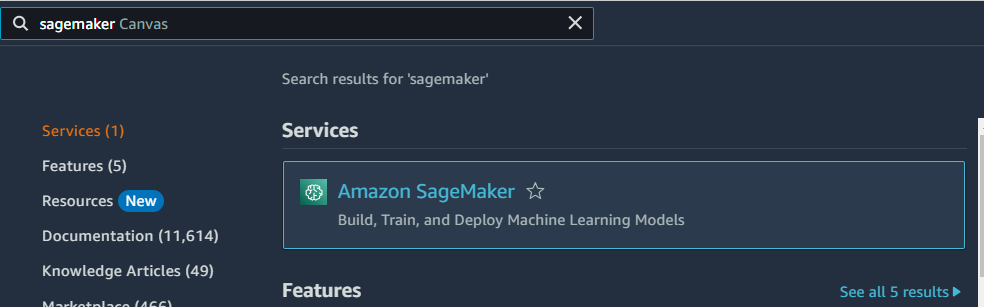
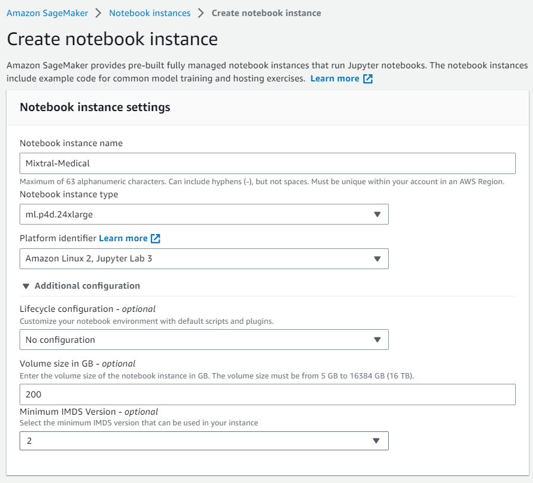
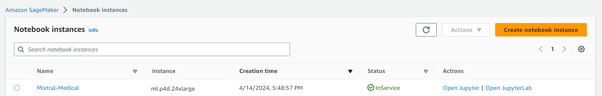
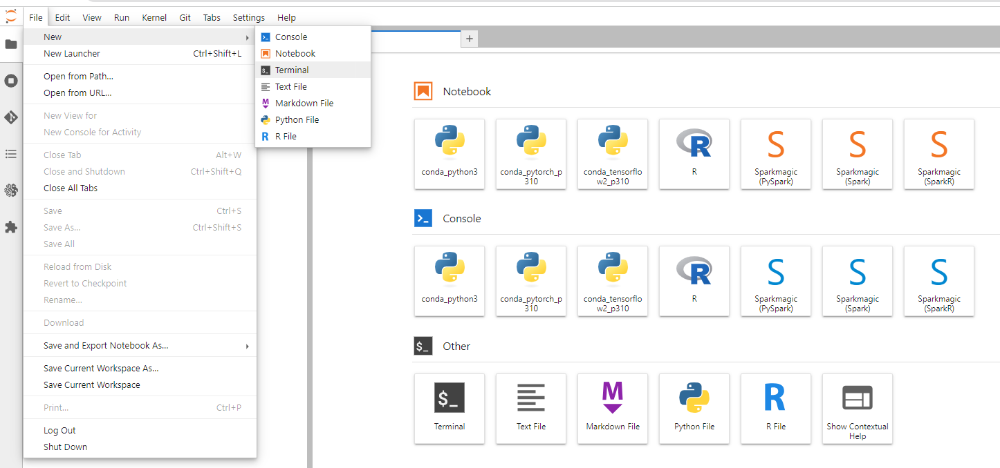
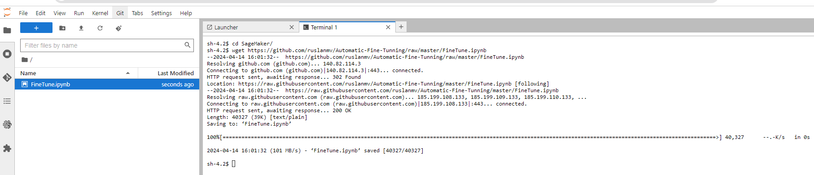
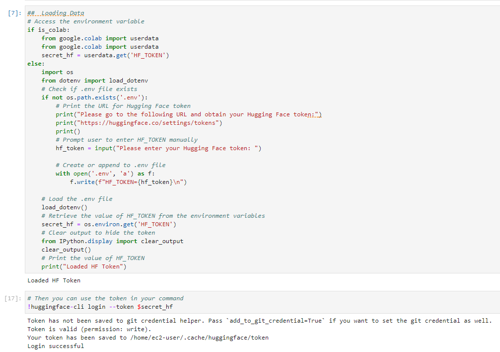
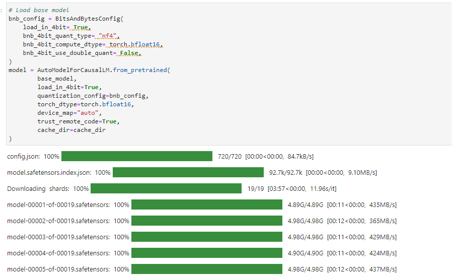

Hello everyone, today we are going to Fine Tune **Mixtral-8x7B-Instruct** model for answering medical assistance questions by using **PEFT Parameter-Efficient Finetuning**.

## Introduction

PEFT stands for Parameter-Efficient Fine-tuning. It refers to the process of fine-tuning LLMs with fewer trainable parameters, resulting in reduced GPU memory usage and slightly lower accuracy compared to fine-tuning all parameters. PEFT involves training new weights in some layers and freezing main weights. It uses low-rank decomposition matrices of the original weights to make changes. During inference, it merges the new weights with the main weights.

In this project we are going to use **SageMaker,** in particular we are going to use **ml.p4d.24xlarge** because we are going to train an [ai-medical-chatbot](https://huggingface.co/datasets/ruslanmv/ai-medical-chatbot) dataset that I have created and stored in Hugging Face.  However also you can use **Google Colab** with the A100 GPU.

Among the possible options that currently AWS offer in Sagemaker we have the following chart.

| Instance Name   | GPU Type    | Number of GPUs | Memory | Virtual CPU | Price (estimate) |
| --------------- | ----------- | -------------- | ------ | ----------- | ---------------- |
| ml.g4dn.xlarge  | NVIDIA V100 | 1              | 16 GB  | 4           | Low              |
| ml.p3.2xlarge   | NVIDIA V100 | 1              | 61 GB  | 8           | Low              |
| ml.p3.8xlarge   | NVIDIA V100 | 4 (16 GB each) | 128 GB | 32          | Medium           |
| ml.p3.16xlarge  | NVIDIA V100 | 8              | 640 GB | 64          | Very High        |
| ml.p4d.24xlarge | NVIDIA A100 | 8 (40 GB each) | 320 GB | 96          | High             |

Depending of the number of tokens to be trained  we should choose the appropriate instance.

## Training Resource Estimates 

| Instance Name   | Training Time (estimate) | Memory GPU | Max Inference size (#params) | Max training size (#tokens) | Dataset Medical | Current Step at 2:50min | Speed (it/s) | Time Left |
| --------------- | ------------------------ | ---------- | ---------------------------- | --------------------------- | --------------- | ----------------------- | ------------ | --------- |
| ml.g4dn.xlarge  | Slow                     | 16 GB      | 7B                           | 1B                          | 250k            | 17                      | 0.09         | 201:17:03 |
| ml.p3.2xlarge   | Moderate                 | 16 GB      | 7B                           | 1B                          | 250k            | 61                      | 0.34         | 52:13:07  |
| ml.p3.8xlarge   | Fast                     | 64 GB      | 14B                          | 2B                          | 250k            | 60                      | 0.34         | 52:12:43  |
| ml.p3.16xlarge  | Very Fast                | 128 GB     | 18B                          | 2.5B                        | 250k            | -                       | -            | -         |
| ml.p4d.24xlarge | Very Fast                | 320 GB     | 32B                          | 5B                          | 250k            | 80                      | 0.45         | 39:06:37  |

**Note:**

- The values in the "Current Step at 2:50min", "Speed", and "Time Left" corresponds to the variables of the AI Medical Dataset
- The "Training Time (estimate)" , "Max Inference size (#params)" and "Max training size (#tokens)" values are rough estimations. 

In this blog post , we will guide you through the process of fine-tuning Mistral models, with a focus on adapting the model to an AI medical chatbot application. The provided Python codes and step-by-step instructions will help you effectively fine-tune the model on a chosen subset of data. Let's get started on this exciting journey to enhance the capabilities of your Mistral model.

## Step 1 - Creation of the Instance

We login to our AWS console and then we look for Sagemaker [here](https://aws.amazon.com/console/).



We go to the the menu of Sagemaker and we choose SageMaker notebooks, and then we click Create notebook instance.


We  create a new notebook instance , we named it for example `Mixtral-Medical` then we choose `ml.p4d.24xlarge  ` and for Additional configuration we choose 200GB.



we keep the default settings, we are going to use the default file system and we click Create notebook instance.


then we wait that the instance becomes ready,



then we click on `Open JupyterLab` and then create a new notebook. by choosing the conda_pytorch environment .

And follow the steps of the following section.

**Optionaly** if you want to download the notebook of this blog post you can simply  click on File >Terminal



and we type the following

```
cd SageMaker
wget https://github.com/ruslanmv/Automatic-Fine-Tunning/raw/master/FineTune.ipynb
```



and then we click in `Finetune.ipynb`. If you are using **Google Colab** you  can use the [FineTune_colab.ipynb](https://github.com/ruslanmv/Automatic-Fine-Tunning/blob/master/FineTune_colab.ipynb)

Now that you have notebook you can execute the following steps of this tutorial.

## Step 2 - Review the Min Specs of the Instance

In order to perform fine-tuning, it is necessary to estimate the amount of memory needed to fine-tune our large language models (LLM). Depending on the number of parameters of our model to be fine-tuned, we should choose an appropriate system that is capable of processing the model and fine-tuning it.

We can use the following Python code to know the amount of memory and CPU used.

```python
import psutil  # Install using `!pip install psutil` if needed
def get_cpu_and_memory_info():
    """Retrieves CPU usage (percentage) and total memory (GB) information.
    Returns:
        dict: A dictionary containing CPU usage and total memory information.
    """
    cpu_usage = psutil.cpu_percent(interval=1)  # Sample CPU usage every second
    total_memory = psutil.virtual_memory().total / (1024**3)  # Convert to GB

    return {"cpu_usage": cpu_usage, "total_memory": total_memory}

# Get CPU and memory information
info = get_cpu_and_memory_info()

print(f"CPU Usage: {info['cpu_usage']}%")
print(f"Total Memory: {info['total_memory']:.2f} GB")

```

For example

    CPU Usage: 0.0%
    Total Memory: 1121.81 GB

Getting information about Nvidia GPU

```python
import torch
import psutil
def get_gpu_info():
    if torch.cuda.is_available():
        gpu_count = torch.cuda.device_count()
        gpu_name = torch.cuda.get_device_name(0)
        return gpu_count, gpu_name
    else:
        return 0, "No GPU available"
# Get GPU information
gpu_count, gpu_name = get_gpu_info()
print(f"Number of GPUs: {gpu_count}")
print(f"GPU Name: {gpu_name}")

```

With the previous code, we obtain

    Number of GPUs: 8
    GPU Name: NVIDIA A100-SXM4-40GB

Make sure your system meets the minimum requirements for fine-tuning the LLM of your choice. If not, consider upgrading your instance type or hardware to a configuration that can handle the model's complexity. Keep in mind that GPUs are highly recommended for fine-tuning LLMs due to their parallel processing capabilities, which can significantly speed up the process.

## Step 3 - Identification of Platform

In order to identify if we are using SageMaker or Google Colab, we can run the following code snippet:


```python
try:
  from IPython.core.display import get_ipython
  is_colab =  get_ipython() is not None and get_ipython().get_fullname() == '__main__'
except:
  is_colab = False
if is_colab:
    print("You are on Google Colab!")
else:
    print("You are not on Google Colab.")
    try:
        import boto3
        # Assuming you have IAM permissions to list SageMaker notebook instances
        sagemaker_client = boto3.client('sagemaker')
        response = sagemaker_client.list_notebook_instances()
        # Check if any notebook instances are listed
        if len(response['NotebookInstances']) > 0:
            print("You are on SageMaker notebook instance.")
            is_sagemaker=True
        else:
            print("SageMaker API check inconclusive.")
    except Exception as e:
        print(f"An error occurred while checking with SageMaker API: {e}")
        print("Result inconclusive.")
```

    You are not on Google Colab.
    You are on SageMaker notebook instance.

Now that we have identified the platform we are using, we should choose the appropriate Python environment for our fine-tuning process. Depending on the platform, we may need to install specific packages or configure the environment to meet the requirements for fine-tuning LLM models. Follow the instructions specific to your platform to set up the Python environment and proceed with the next steps.

## Step 4 - Environment Selection

After identifying the platform we are using (SageMaker or Google Colab), we need to select the appropriate environment for our fine-tuning process. The environment selection process differs depending on whether you are using Google Colab or SageMaker. For Google Colab, we will connect to Google Drive and set the main path based on whether we are using a shared drive or not. For SageMaker, we will check if the default PyTorch environment is being used. If not, we will install the necessary packages for the PyTorch environment.  Once the environment has been selected and set up, we can proceed with the fine-tuning process.


```python
import os
if is_colab:
    #@markdown # Connect Google Drive
    from google.colab import drive
    from IPython.display import clear_output
    import ipywidgets as widgets
    import os
    def inf(msg, style, wdth): inf = widgets.Button(description=msg, disabled=True, button_style=style, layout=widgets.Layout(min_width=wdth));display(inf)
    Shared_Drive = "" #@param {type:"string"}
    #@markdown - Leave empty if you're not using a shared drive
    print("[0;33mConnecting...")
    drive.mount('/content/gdrive')
    if Shared_Drive!="" and os.path.exists("/content/gdrive/Shareddrives"):
      mainpth="Shareddrives/"+Shared_Drive
    else:
      mainpth="MyDrive"
    clear_output()
    inf('\u2714 Done','success', '50px')
    #@markdown ---
else:
    env_name = os.environ.get("CONDA_DEFAULT_ENV", "")
    if env_name == "conda_pytorch_p310":
        print("Not detected Default Pytorch Environment")
        print("Installing missing packages")
        !pip3 install -qU torch torchvision torchaudio --index-url https://download.pytorch.org/whl/cu118
    else:
        print("Environment name:", env_name)
```

    Environment name: pytorch_p310

## Step 5 - Package Installation

To ensure that we have all the necessary packages for fine-tuning LLM models, we need to perform the installation of the required packages. This step will differ depending on whether you are using Google Colab or SageMaker.

For Google Colab, we will install and update the `ruslanmv` repository and set up the cache directory. After that, we will install the required packages by fetching the `requirements.txt` file from the `Automatic-Fine-Tunning` repository and running `pip install` to install the listed packages.

The code for this step is provided in the guide. For SageMaker, we will download the `requirements.txt` file from the `Automatic-Fine-Tunning` repository and install the required packages using `pip install`. The code for this step is also provided in the guide. After installing the necessary packages, we can proceed with the fine-tuning process.


```python
import os
import sys
if is_colab:
    #@markdown # Install/Update ruslanmv repo
    from IPython.utils import capture
    from IPython.display import clear_output
    from subprocess import getoutput
    import ipywidgets as widgets
    import sys
    import fileinput
    import os
    import time
    import base64
    import requests
    from urllib.request import urlopen, Request
    from urllib.parse import urlparse, parse_qs, unquote
    from tqdm import tqdm
    import six
    blsaphemy = base64.b64decode("ZWJ1aQ==").decode('ascii')
    if not os.path.exists("/content/gdrive"):
        print('\033[1;31mGdrive not connected, using temporary colab storage ...')
        time.sleep(4)
        mainpth = "MyDrive"
        !mkdir -p /content/gdrive/$mainpth
        Shared_Drive = ""

    if Shared_Drive != "" and not os.path.exists("/content/gdrive/Shareddrives"):
        print('\033[1;31mShared drive not detected, using default MyDrive')
        mainpth = "MyDrive"

    with capture.capture_output() as cap:
        def inf(msg, style, wdth):
            inf = widgets.Button(description=msg, disabled=True, button_style=style, layout=widgets.Layout(min_width=wdth))
            display(inf)
        fgitclone = "git clone --depth 1"
        !mkdir -p /content/gdrive/$mainpth/llm
        # Define the path
        main_path =f"/content/gdrive/{mainpth}/"
        !git clone -q --branch master https://github.com/ruslanmv/Automatic-Fine-Tunning /content/gdrive/$mainpth/llm/Automatic-Fine-Tunning
        os.environ['TRANSFORMERS_CACHE'] = f"/content/gdrive/{mainpth}/llm/Automatic-Fine-Tunning/{blsaphemy}/cache"
        os.environ['TORCH_HOME'] = f"/content/gdrive/{mainpth}/llm/Automatic-Fine-Tunning/{blsaphemy}/cache"
        cache_dir = os.environ['TRANSFORMERS_CACHE']
        !mkdir -p /content/gdrive/{mainpth}/llm/Automatic-Fine-Tunning/{blsaphemy}/repositories
        !git clone https://github.com/ruslanmv/Automatic-Fine-Tunning /content/gdrive/{mainpth}/llm/Automatic-Fine-Tunning/{blsaphemy}/repositories/Automatic-Fine-Tunningebui-assets

    with capture.capture_output() as cap:
        %cd /content/gdrive/{mainpth}/llm/Automatic-Fine-Tunning/{blsaphemy}/repositories/Automatic-Fine-Tunningebui-assets

        !git reset --hard
        !git checkout master
        time.sleep(1)
        !git pull
    clear_output()
    inf('\u2714 Done', 'success', '50px')
    #@markdown ---
```


```python
def reload_environment():
    # Kernel restart logic (may not work consistently within Jupyter Notebook)
    try:
      from IPython import get_ipython
      get_ipython().kernel.do_shutdown(restart=True)
      print("Kernel restarted. Packages should be reloaded.")
    except Exception as e:
      print(f"Kernel restart failed: {e}")
      print("Consider manually restarting the kernel or your Jupyter Notebook server.")
if is_colab:
    #@markdown # Requirements
    print('[1;32mInstalling requirements...')
    with capture.capture_output() as cap:
      %cd /content/
      !wget -q -i https://github.com/ruslanmv/Automatic-Fine-Tunning/raw/master/Dependencies/requirements.txt
      !pip install -r requirements.txt
    clear_output()
    inf('\u2714 Done','success', '50px')
    #@markdown ---
if is_sagemaker:
    #!pip install -qU transformers==4.36.2 accelerate==0.25.0 duckduckgo_search==4.1.0  python-dotenv
    #!pip install -qU  bitsandbytes transformers==4.36.2 peft accelerate trl datasets==2.16.0 sentencepiece protobuf
    !wget -q https://github.com/ruslanmv/Automatic-Fine-Tunning/raw/master/Dependencies/requirements.txt -O requirements.txt
    !pip install -qU -r requirements.txt
    #reload_environment()
```

##  Step 6  - Load Packages

In this step, we will load the necessary packages for fine-tuning LLM models. These packages include the `transformers`, `datasets`, `peft`, `trl`, and other libraries that are essential for our fine-tuning process.


```python
from transformers import AutoModelForCausalLM, AutoTokenizer, BitsAndBytesConfig,HfArgumentParser,TrainingArguments,pipeline, logging
from peft import LoraConfig, PeftModel, prepare_model_for_kbit_training, get_peft_model
import os,torch
from datasets import load_dataset
from trl import SFTTrainer
import pandas as pd
import pyarrow as pa
import pyarrow.dataset as ds
import pandas as pd
from datasets import Dataset
import re
import os
```

If all the packages are loaded successfully, it means that you can continue to the next step in the fine-tuning process. Loading these packages ensures that we have all the required tools and functionalities to perform the fine-tuning of LLM models in our Jupyter notebook.

## Step 7 - Definitions

In this step, we will choose the base model to use for fine-tuning. This notebook is compatible with two models: `Mixtral-8x7B-Instruct-v0.1` and `Mistral-7B-Instruct-v0.2`.

The main differences between them are:

**Model Size and Architecture:**

- **Mixtral-8x7B-Instruct-v0.1:** This is a larger model with 8x7 Billion parameters. It uses a novel architecture called "Sparse Mixture of Experts" which allows for efficient processing while maintaining high performance.
- **Mistral-7B-Instruct-v0.2:** This is a smaller model with 7 Billion parameters. It uses a more standard decoder-only architecture.

**Performance:**

- Benchmarks suggest Mixtral-8x7B-Instruct-v0.1 performs better on various tasks compared to Mistral-7B-Instruct-v0.2 (e.g., MT Benchmark scores).

**Instruction Format:**

- Both models require specific formatting for instructions wrapped in `[INST]` and `[/INST]` tokens.

For detailed information and the latest updates, it's recommended to refer to the official sources from Mistral AI:

-  [Mixtral-8x7B-Instruct-v0.1]( https://huggingface.co/mistralai/Mixtral-8x7B-Instruct-v0.1)
-  [Mistral-7B-Instruct-v0.2]( https://huggingface.co/mistralai/Mistral-7B-Instruct-v0.2)

So let us choose you favorite model


```python
# base model from huggingFace or path to model
base_model = "mistralai/Mixtral-8x7B-Instruct-v0.1"
#base_model = "mistralai/Mistral-7B-Instruct-v0.2"
```

Next, we need to assign a name for our new model after it is fine-tuned. You can either train the entire AI-medical dataset or simply take a subset of records.

```python
# New model name
new_model = "Medical-Mixtral-7B-v250k"
num=256500
```

or simply take a subset of 2000 records

```python
new_model = "Medical-Mixtral-7B-v2k"
num=2000
```

To download the base model from Hugging Face, it is crucial to add our tokens. To obtain the token, go to [https://huggingface.co/settings/tokens](https://huggingface.co/settings/tokens) and copy your token. Paste the token in the .env file. This token will be used to access the Hugging Face repository and download the base model for fine-tuning.


```python
##  Loading Data
# Access the environment variable
if is_colab:
    from google.colab import userdata
    from google.colab import userdata
    secret_hf = userdata.get('HF_TOKEN')
else:
    import os
    from dotenv import load_dotenv
    # Check if .env file exists
    if not os.path.exists('.env'):
        # Print the URL for Hugging Face token
        print("Please go to the following URL and obtain your Hugging Face token:")
        print("https://huggingface.co/settings/tokens")
        print()
        # Prompt user to enter HF_TOKEN manually
        hf_token = input("Please enter your Hugging Face token: ")

        # Create or append to .env file
        with open('.env', 'a') as f:
            f.write(f"HF_TOKEN={hf_token}\n")

    # Load the .env file
    load_dotenv()
    # Retrieve the value of HF_TOKEN from the environment variables
    secret_hf = os.environ.get('HF_TOKEN')
    # Clear output to hide the token
    from IPython.display import clear_output
    clear_output()
    # Print the value of HF_TOKEN
    print("Loaded HF Token")
```

    Loaded HF Token



```python
# Then you can use the token in your command
!huggingface-cli login --token $secret_hf
```

    Login successful

## Step 8 -  Datataset to Finetune

In this step, we will download the dataset that we want to include in our base model for fine-tuning.


```python
dataset_ = load_dataset("ruslanmv/ai-medical-chatbot")
train_data = dataset_["train"]
df = pd.DataFrame(train_data[::])
df = df[["Description", "Doctor"]].rename(columns={"Description": "question", "Doctor": "answer"})
# Clean the question and answer columns
df['question'] = df['question'].apply(lambda x: re.sub(r'\s+', ' ', x.strip()))
df['answer'] = df['answer'].apply(lambda x: re.sub(r'\s+', ' ', x.strip()))
# Assuming your DataFrame is named 'df' and the column is named 'df' and the column is named 'question'
df['question'] = df['question'].str.lstrip('Q. ')
df['answer'] = df['answer'].str.replace('-->', '')
```

The the previous code  load the [ai-medical-chatbot](https://huggingface.co/datasets/ruslanmv/ai-medical-chatbot) dataset using the `load_dataset` function. It  then convert the dataset into a Pandas DataFrame and clean the `question` and `answer` columns by removing unnecessary characters and spaces.

By preparing the dataset in this manner, we ensure that the data is in a suitable format for the fine-tuning process. This will make it easier to train the model effectively and obtain better results.

```python
df.head()
```

<table border="1" class="dataframe">
  <thead>
    <tr style="text-align: right;">
      <th></th>
      <th>question</th>
      <th>answer</th>
    </tr>
  </thead>
  <tbody>
    <tr>
      <th>0</th>
      <td>What does abutment of the nerve root mean?</td>
      <td>Hi. I have gone through your query with dilige...</td>
    </tr>
    <tr>
      <th>1</th>
      <td>What should I do to reduce my weight gained du...</td>
      <td>Hi. You have really done well with the hypothy...</td>
    </tr>
    <tr>
      <th>2</th>
      <td>I have started to get lots of acne on my face,...</td>
      <td>Hi there Acne has multifactorial etiology. Onl...</td>
    </tr>
    <tr>
      <th>3</th>
      <td>Why do I have uncomfortable feeling between th...</td>
      <td>Hello. The popping and discomfort what you fel...</td>
    </tr>
    <tr>
      <th>4</th>
      <td>My symptoms after intercourse threatns me even...</td>
      <td>Hello. The HIV test uses a finger prick blood ...</td>
    </tr>
  </tbody>
</table>

It is essential to create separate training and testing sets to evaluate our model's performance during the fine-tuning process.


```python
df_train = df.iloc[:num, :]
df_test = df.iloc[num:num+100, :]
# Save the train dataframe to a CSV file
df_train.to_csv('train.csv', index=False)
# Save the test dataframe to a CSV file
df_test.to_csv('test.csv', index=False)
df=df_train
```

The previous  code split the dataset into a training set and a testing set. The training set will be used to fine-tune the model, while the testing set will be used to assess the model's performance and generalization capabilities. By saving these DataFrames to CSV files, we can easily load and access the data during the training and evaluation process.

## Step 9 - Formatting Your Fine-tuning Data

There are various ways to format your data for fine-tuning. In this step, we will format the data for a question-answering task using prompts.

Prompts provide context and guide the LLM towards the desired task. The code showcases creating prompts for question-answering tasks with placeholders for questions and answers. The prompts are then combined into a single 'text' column in the DataFrame.


```python
# build training dataset with the right format
df['text'] = '[INST]@Enlighten. ' + df['question'] +'[/INST]'+ df['answer'] + ''
```

After formatting the data, we will remove the original 'question' and 'answer' columns from the DataFrame, as they are no longer needed.


```python
# remove columns
df=df.drop(['question','answer'],axis=1)
```

Finally, we can visualize the formatted data by displaying the top rows of the DataFrame.


```python
df.head()
```

<table border="1" class="dataframe">
  <thead>
    <tr style="text-align: right;">
      <th></th>
      <th>text</th>
    </tr>
  </thead>
  <tbody>
    <tr>
      <th>0</th>
      <td>[INST]@Enlighten. What does abutment of the ne...</td>
    </tr>
    <tr>
      <th>1</th>
      <td>[INST]@Enlighten. What should I do to reduce m...</td>
    </tr>
    <tr>
      <th>2</th>
      <td>[INST]@Enlighten. I have started to get lots o...</td>
    </tr>
    <tr>
      <th>3</th>
      <td>[INST]@Enlighten. Why do I have uncomfortable ...</td>
    </tr>
    <tr>
      <th>4</th>
      <td>[INST]@Enlighten. My symptoms after intercours...</td>
    </tr>
  </tbody>
</table>

This formatted data will be used for fine-tuning the LLM, making it more suitable for the specific question-answering task.

##  Step 10 - Convert to Dataset Object

In this step, we will convert the formatted DataFrame into a dataset object, which is the required format for fine-tuning the LLM using the `transformers` library.

We will first convert the DataFrame into a PyArrow Table and then convert it into a Dataset object using the `datasets` library.


```python
# convert to dataset object
dataset = ds.dataset(pa.Table.from_pandas(df).to_batches())
dataset = Dataset(pa.Table.from_pandas(df))
dataset
```


    Dataset({
        features: ['text'],
        num_rows: 2000
    })

Once the Dataset object is created, it can be used as input for the fine-tuning process. This format allows the `transformers` library to efficiently process and train the LLM on the provided data.

## Step 11 - Dataset Statistics

 Before proceeding with the fine-tuning process, it is helpful to analyze some statistics about the dataset. By doing so, we can gain insights into the data and make informed decisions about model training.


```python

statistics=True
#dataset_sample = dataset.select(range(500)) # Take only the first 500 records from the dataset
if statistics:
    sequence_lengths = [len(example['text']) for example in dataset]
    # Calculate statistics
    max_length = max(sequence_lengths)
    min_length = min(sequence_lengths)
    mean_length = sum(sequence_lengths) / len(sequence_lengths)
    median_length = sorted(sequence_lengths)[len(sequence_lengths) // 2]
    print("Max length:", max_length)
    print("Min length:", min_length)
    print("Mean length:", mean_length)
    print("Median length:", median_length)
```

    Max length: 3368
    Min length: 106
    Mean length: 646.119
    Median length: 606

By understanding the dataset's characteristics, you can make better decisions about hyperparameters and other aspects of the fine-tuning process, ultimately leading to improved model performance.

```python
if is_sagemaker:
    # Get the current directory and join with the models folder
    current_directory = os.getcwd()
    cache_dir = os.path.join(current_directory, "models")
    main_path=current_directory
```

## Step 12 -  Downloading and Initializing Mixtral 8x7b

In this step, we will download and initialize the Mixtral 8x7b model for fine-tuning.

We will first create a BitsAndBytesConfig object to configure the model for 4-bit quantization. This configuration helps reduce the model's memory footprint and accelerates training.

Next, we will load the base model using the `AutoModelForCausalLM.from_pretrained` function. We will provide the base model name, the quantization configuration, the desired data type, the device map, and the cache directory as arguments.


```python
# Load base model
bnb_config = BitsAndBytesConfig(
    load_in_4bit= True,
    bnb_4bit_quant_type= "nf4",
    bnb_4bit_compute_dtype= torch.bfloat16,
    bnb_4bit_use_double_quant= False,
)
model = AutoModelForCausalLM.from_pretrained(
        base_model,
        load_in_4bit=True,
        quantization_config=bnb_config,
        torch_dtype=torch.bfloat16,
        device_map="auto",
        trust_remote_code=True,
        cache_dir=cache_dir
)
```

Once the model is loaded, it will be ready for fine-tuning on our dataset.



In this series of steps, we will prepare the model, tokenizer, and adjust the settings for fine-tuning.

First, we will update the model's configuration by disabling caching and enabling gradient checkpointing. This will help manage GPU memory consumption during the fine-tuning process.

```python
model.config.use_cache = False # silence the warnings. Please re-enable for inference!
model.config.pretraining_tp = 1
model.gradient_checkpointing_enable()
```

Next, we will load the tokenizer using the `AutoTokenizer` class and adjust its settings, such as padding side, pad token, and adding an end-of-sentence (eos) token.


```python
# Load tokenizer
tokenizer = AutoTokenizer.from_pretrained(base_model, trust_remote_code=True, cache_dir=cache_dir)
tokenizer.padding_side = 'right'
tokenizer.pad_token = tokenizer.eos_token
tokenizer.add_eos_token = True
tokenizer.bos_token, tokenizer.eos_token
```

We will then set the tokenizer's maximum length to a value appropriate for our dataset and GPU memory constraints.


```python
tokenizer.model_max_length = 1024  # Adjust this value based on your dataset and GPU memory
```

Finally, if you want to count the number of training tokens, you can use the `LlamaTokenizer` class. This step is optional and can be useful for understanding the size of your training data in terms of tokens.


```python
count_training=False
if count_training:
    # count trainging tokens
    from transformers import LlamaTokenizer
    tokenizer_ = LlamaTokenizer.from_pretrained("cognitivecomputations/dolphin-llama2-7b",
                                                cache_dir=cache_dir)
    tokens = tokenizer_.tokenize(dataset.to_pandas().to_string())
    len(tokens)
```

With these settings and configurations in place, we are ready to proceed with the fine-tuning process.

## Step 13 - Fine-Tune

In this step, we will fine-tune the model using the prepared dataset and the selected hyperparameters. First, we will add adapters to the model layers and configure the model with LoraConfig.


```python
#Adding the adapters in the layers
model = prepare_model_for_kbit_training(model)
peft_config = LoraConfig(
    lora_alpha=16,
    lora_dropout=0.1,
    r=64,
    bias="none",
    task_type="CAUSAL_LM",
    target_modules=["q_proj", "k_proj", "v_proj", "o_proj","gate_proj"]
)
model = get_peft_model(model, peft_config)
```

Next, we will set up the training arguments, including learning rate, batch size, and other hyperparameters that will influence the fine-tuning process.


```python
#Hyperparamter
training_arguments = TrainingArguments(
    output_dir="./results",
    num_train_epochs=1,
    per_device_train_batch_size=4,
    gradient_accumulation_steps=1,
    optim="paged_adamw_32bit",
    save_steps=50,
    logging_steps=1,
    learning_rate=2e-4,
    weight_decay=0.001,
    fp16=False,
    bf16=False,
    max_grad_norm=0.3,
    max_steps=-1,
    warmup_ratio=0.03,
    group_by_length=True,
    lr_scheduler_type="constant",
)
```

Then, we will create an SFTTrainer instance with the model, dataset, tokenizer, and training arguments. This trainer will handle the fine-tuning process.


```python
# Setting sft parameters
trainer = SFTTrainer(
    model=model,
    train_dataset=dataset,
    peft_config=peft_config,
    #max_seq_length= None,
    max_seq_length=1024,  # Adjust based on your dataset and GPU memory
    dataset_text_field="text",
    tokenizer=tokenizer,
    args=training_arguments,
    packing= False,
)
```


Finally, we will start the fine-tuning process by running the trainer. The progress will be displayed, showing the percentage of examples processed.

```python
trainer.train()
clear_output()
```

Once the fine-tuning process is complete, the model will be ready for evaluation and deployment.

## Step 14 - Save and push the adapter to HF

After fine-tuning the LLM, we need to save the model and tokenizer to the Hugging Face Model Hub. This allows us to easily share, access, and use the fine-tuned model in future projects.

First we save the fine-tuned model, its configuration, and the tokenizer to a specified path. This will allow us to reuse the trained model for future tasks or share it with others.

We set the save path for the fine-tuned model.


```python
# Save the fine-tuned model
save_path = os.path.join(main_path, "llm", "Automatic-Fine-Tuning", "models", new_model)
```


```python
save_path
```


    '/home/ec2-user/SageMaker/container/llm/Automatic-Fine-Tuning/models/Medical-Mixtral-7B-v2k'

Next, we will set the model to evaluation mode and enable the cache.


```python
model.eval()
model.config.use_cache = True
```

After that, we will save the model configuration, the model itself, and the tokenizer to the specified path.


```python
# Save the model configuration
model.config.save_pretrained(save_path)
```

By saving the fine-tuned model, its configuration, and the tokenizer, you can easily load the model later for inference or further fine-tuning. Additionally, you can share the trained model with others or push it to the Hugging Face Model Hub for easy access and use in various applications.


```python
#Saving
trainer.model.save_pretrained(save_path)
```


```python
tokenizer.save_pretrained(save_path)
```


```python
model.save_pretrained(save_path)
```

## Step 15 - Save the Model in the Cloud

To save the model in Hugging Face, we will use the `push_to_hub` method from the `transformers` library. This method uploads the model and tokenizer to the specified repository ID, along with any optional parameters such as commit message, privacy settings, and token.


```python
# Push the model to the Hub, specifying the repository ID and any other optional parameters
model.push_to_hub(
    repo_id=new_model,  # Replace with your model
    use_temp_dir=True,  # Optional, whether to use a temporary directory
    commit_message="Upload " + new_model,  # Commit message with new_model name
    private=False,  # Optional, whether the repository should be private
    token=True,  # Optional, specify token or use default
    max_shard_size="5GB",  # Optional, maximum size for a checkpoint before being sharded
    create_pr=False,  # Optional, whether to create a PR
    safe_serialization=True,  # Optional, convert model weights to safetensors format
    revision=None,  # Optional, branch to push the uploaded files to
    commit_description=None,  # Optional, description of the commit
)
#trainer.model.push_to_hub(new_model)
tokenizer.push_to_hub(new_model)
```

For additional information check the documentation `help(model.push_to_hub)`. Once the model and tokenizer are uploaded to the Model Hub, you can easily access and use them in your future projects, share them with others, or even showcase your work in the Hugging Face community.

## Step 16 - Test the model

Now is time to test the fine-tuned model by generating text using the provided question as input.

First, we will create a pipeline for text generation using the fine-tuned model and tokenizer. Then, we will define a function to build a prompt for the question-answering task.


```python
logging.set_verbosity(logging.CRITICAL)
pipe = pipeline(task="text-generation", model=model, tokenizer=tokenizer, max_length=200)
```


```python
def build_prompt(question):
  prompt=f"[INST]@Enlighten. {question} [/INST]"
  return prompt
```

Next, we will provide a question and generate a prompt using the `build_prompt` function. The generated prompt will be used as input for the text generation pipeline.


```python
question = "What does abutment of the nerve root mean?"
prompt = build_prompt(question)
result = pipe(prompt)
```

Finally, we will print the generated text from the model as the answer to the question.


```python
print(result[0]['generated_text'])
```

    [INST]@Enlighten. What does abutment of the nerve root mean? [/INST]Hi. I have gone through your query with diligence and would like you to know that I am here to help you. For further information consult a neurologist online ― ₹200. All the best. For more information consult a neurologist online ― ₹200. All the best. For more information consult a neurologist online ― ₹200. All the best. For more information consult a neurologist online ― ₹200. All the best. For more information consult a neurologist online ― ₹200. All the best. For more information consult a neurologist online ― ₹200. All the best. For more information consult a neurologist online ― ₹200. All the best. For more information consult

This step demonstrates that the fine-tuned model can generate relevant and context-aware responses to the provided questions.

## Step 17  Testing more examples

Let us test the fine-tuned LLM model on the test dataset to evaluate its performance.

```python
#test_path="test.csv"
test_path="train.csv"
f_test=pd.read_csv(test_path)
df_test.head()
```

<table border="1" class="dataframe">
  <thead>
    <tr style="text-align: right;">
      <th></th>
      <th>question</th>
      <th>answer</th>
    </tr>
  </thead>
  <tbody>
    <tr>
      <th>2000</th>
      <td>Can Yasmin birth control pill be used as an em...</td>
      <td>Hi. How are you doing? Yes, as you have heard,...</td>
    </tr>
    <tr>
      <th>2001</th>
      <td>Please explain the poisonous effect of phenol ...</td>
      <td>Hi. I want to assure you not to worry as every...</td>
    </tr>
    <tr>
      <th>2002</th>
      <td>For how long should I take Kalachikai powder t...</td>
      <td>Hello. For PCOD (polycystic ovarian disease), ...</td>
    </tr>
    <tr>
      <th>2003</th>
      <td>Why do periods get delayed after first time sex?</td>
      <td>Hello. As the serum beta hCG levels are less t...</td>
    </tr>
    <tr>
      <th>2004</th>
      <td>How to resolve peripheral vision problem?</td>
      <td>Hi. Revert back with the report and answers to...</td>
    </tr>
  </tbody>
</table>


```python
#We test only 10 entries
df_test=df_test.head(10)
```


```python
df_test
```

<table border="1" class="dataframe">
  <thead>
    <tr style="text-align: right;">
      <th></th>
      <th>question</th>
      <th>answer</th>
    </tr>
  </thead>
  <tbody>
    <tr>
      <th>2000</th>
      <td>Can Yasmin birth control pill be used as an em...</td>
      <td>Hi. How are you doing? Yes, as you have heard,...</td>
    </tr>
    <tr>
      <th>2001</th>
      <td>Please explain the poisonous effect of phenol ...</td>
      <td>Hi. I want to assure you not to worry as every...</td>
    </tr>
    <tr>
      <th>2002</th>
      <td>For how long should I take Kalachikai powder t...</td>
      <td>Hello. For PCOD (polycystic ovarian disease), ...</td>
    </tr>
    <tr>
      <th>2003</th>
      <td>Why do periods get delayed after first time sex?</td>
      <td>Hello. As the serum beta hCG levels are less t...</td>
    </tr>
    <tr>
      <th>2004</th>
      <td>How to resolve peripheral vision problem?</td>
      <td>Hi. Revert back with the report and answers to...</td>
    </tr>
    <tr>
      <th>2005</th>
      <td>Is there any way to treat pinworm infestation ...</td>
      <td>Hi. Best is Ivermectin. If resistant, use 5 % ...</td>
    </tr>
    <tr>
      <th>2006</th>
      <td>What are the ways to get pregnant without pene...</td>
      <td>Hi, WeIcome to icliniq.com. I can understand y...</td>
    </tr>
    <tr>
      <th>2007</th>
      <td>Can I take PPI to treat gurgling caused due to...</td>
      <td>Hi. PPI alone will not work. Need to add some ...</td>
    </tr>
    <tr>
      <th>2008</th>
      <td>What should I do to be happy all over the day ...</td>
      <td>Hello. First of all, you should stop hating yo...</td>
    </tr>
    <tr>
      <th>2009</th>
      <td>Kindly explain well defined altered cystic sig...</td>
      <td>Hello. Regarding your question, I would explai...</td>
    </tr>
  </tbody>
</table>

We start by loading the test dataset and selecting a subset of entries for testing. Then, we initialize a loop to iterate through each row of the test DataFrame, building question prompts and generating answers using the fine-tuned model.

For each question, the model's generated answer is compared with the ground truth answer to determine whether the prediction is correct or not. The accuracy of the model is updated and printed as it progresses through the test dataset.


```python
questionCounter = 0
correct = 0
promptEnding = "[/INST]"

# Guide for answering questions
testGuide = 'Answer the following question, at the end of your response say thank you for your query.\n'

# Loop through each row in the DataFrame
for index, row in df_test.iterrows():
    print("#############################")
    questionCounter += 1

    # Build the question prompt
    question = testGuide + row['question'] + "\n"
    print(question)

    # Get the true answer
    truth = row['answer']

    # Build the prompt
    prompt = build_prompt(question)

    # Generate answer
    result = pipe(prompt)
    llmAnswer = result[0]['generated_text']

    # Remove the prompt from the generated answer
    index = llmAnswer.find(promptEnding)
    llmAnswer = llmAnswer[len(promptEnding) + index:]

    print("LLM Answer:")
    print(llmAnswer)

    # Remove spaces from the generated answer
    llmAnswer = llmAnswer.replace(' ', '')

    # Find the option in response
    index = llmAnswer.find('answer:')

    # Find and match the option
    next_char = llmAnswer[index + len('answer:'):][0]
    if next_char in truth:
        correct += 1
        print('correct')
    else:
        print('wrong')

    # Update accuracy
    accuracy = correct / questionCounter
    print(f"Progress: {questionCounter / len(df_test)}")
    print(f"Accuracy: {accuracy}")
```

By evaluating the model's performance on a test dataset, we can get an idea of how well the fine-tuned LLM model performs on unseen data and assess its generalization capabilities.

    #############################
    Answer the following question, at the end of your response say thank you for your query.
    Can Yasmin birth control pill be used as an emergency contraceptive pill?
    
    LLM Answer:
    Hi. How are you doing? Yes, as you have heard, Yasmin can be used as an emergency pill. Even if you have not ejaculated into her, she stands a chance of pregnancy if the pre-seminal fluid, the clear fluid that comes out before semen, which is rich in young healthy sperms, comes in contact with her genitals. As soon as possible, earlier than 72 hours, I suggest taking four tablets of Yasmin (combination of Ethinyl Estradiol and Drospirenone) at the time, repeat four more tablets after 12 hours. This being a high dose of hormones, it will suddenly increase the inner l
    correct
    Progress: 0.1
    Accuracy: 1.0
    #############################
    Answer the following question, at the end of your response say thank you for your query.
    Please explain the poisonous effect of phenol ingestion.
    
    LLM Answer:
    Hi. I want to assure you not to worry as everything is going to be fine if proper care and treatment is opted in for. I have thoroughly gone through your case and can well understand your genuine health concerns. 1. No, there is not much problem right now as he vomited and also had a lot of water. It is fine because it was only two drops. 2. We usually do not go for emesis (vomiting) for phenol poisoning cases. Because, it is a volatile compound and causes vapors entering the lungs through the airways. 1. He should avoid re-exposure. 2. For further follow up consult a general practitioner online.- Thanks. For more information consult a general
    correct
    Progress: 0.2
    Accuracy: 1.0
    #############################
    Answer the following question, at the end of your response say thank you for your query.
    For how long should I take Kalachikai powder to overcome PCOD problem?
    
    LLM Answer:
    Hello. For PCOD (polycystic ovarian disease), powder Kalachikai has a good effect, but the duration of treatment is long (more than three months). For proper evaluation of disease, please go for USG whole abdomen and other investigations. If the size and number of cysts are more, then I suggest consulting a gynecologist for physical evaluation and possible surgical intervention. If the number and size of cysts are less, you may continue treatment along with syrup Evecare 10 ml BD and Kanchnar Guggulu two BD. For more information consult an ayurveda specialist online √ Thank you for your query. For more
    correct
    Progress: 0.3
    Accuracy: 1.0
    #############################
    Answer the following question, at the end of your response say thank you for your query.
    Why do periods get delayed after first time sex?
    
    LLM Answer:
    Hello. As the serum beta hCG levels are less than 3 mIU/mL, the pregnancy is definitely ruled out. The delay in the menses is mostly due to sex induced stress after the first time when reproductive hormones readjust themselves. The menses can get delayed even up to two weeks, so just wait for another week and they should arrive. If not, then you can safely opt for a progesterone withdrawal to resume menses. For further information consult an obstetrician and gynaecologist online ▶️. All the best. For more information consult an obstetrician and gynaecologist online ▶️. Thank you for your query. All the best. For more information consult an obstetrician and
    correct
    Progress: 0.4
    Accuracy: 1.0
    #############################
    Answer the following question, at the end of your response say thank you for your query.
    How to resolve peripheral vision problem?
    
    LLM Answer:
    Hello. I understand your concern. I have gone through your query and understand that you are suffering from a condition called as peripheral neuropathy. This is a condition where the nerves in the periphery of the body are affected. The exact cause of this condition is not known. However, it is usually associated with diabetes, alcoholism, and certain medications. I would suggest you to get a detailed neurological examination done and get a nerve conduction study done. This will help you to know the exact cause of your condition. I hope this has helped you. If you require any further queries, please do not hesitate to contact me. Thank you for your query. For more information consult a neurologist online ▶️ ☎️ Follow up: Get a
    wrong
    Progress: 0.5
    Accuracy: 0.8
    #############################
    Answer the following question, at the end of your response say thank you for your query.
    Is there any way to treat pinworm infestation permanently?
    
    LLM Answer:
    Hello. I understand your concern. I have gone through your query and understand that you are suffering from pinworm infestation. I would like to assure you that you will be fine after taking the medicines. I would also like to inform you that pinworm infestation is a common problem and it is not a serious one. I would like to suggest you the following medicines: Consult your specialist doctor, discuss with him or her and start taking the medicines with their consent. I would also like to suggest you the following measures to prevent pinworm infestation: I hope I have clarified your query. Do write back if you have any more queries. All the best. Thank you for your query. For more information consult a
    correct
    Progress: 0.6
    Accuracy: 0.8333333333333334
    #############################
    Answer the following question, at the end of your response say thank you for your query.
    What are the ways to get pregnant without penetration?
    
    LLM Answer:
    Hello. I understand your concern. I would like to assure you that you are not alone in this. I would also like to assure you that you can get pregnant without penetration. You can get pregnant by oral sex, anal sex, and even by touching your genitals. I would also like to assure you that you can get pregnant even if you have not had sex. I would also like to assure you that you can get pregnant even if you have not had sex for a long time. I would also like to assure you that you can get pregnant even if you have not had sex for a long time. I would also like to assure you that you can get pregnant even if you have not had sex for a long time. I would also like to assure you that you
    correct
    Progress: 0.7
    Accuracy: 0.8571428571428571
    #############################
    Answer the following question, at the end of your response say thank you for your query.
    Can I take PPI to treat gurgling caused due to GERD?
    
    LLM Answer:
    Hello. I understand your concern. I have gone through your query and understand that you are suffering from GERD (gastroesophageal reflux disease). I would suggest you to take the following medications: 1. Tablet Omeprazole 20 mg once daily for 15 days. 2. Tablet Domperidone 10 mg twice daily for 15 days. 3. Tablet Pantoprazole 40 mg once daily for 15 days. 4. Tablet Rabeprazole 20 mg once daily for 15 days. 5. Tablet Esomeprazole 40 mg once daily for 15 days
    correct
    Progress: 0.8
    Accuracy: 0.875
    #############################
    Answer the following question, at the end of your response say thank you for your query.
    What should I do to be happy all over the day inspite of hurting myself?
    
    LLM Answer:
    Hello. I understand your concern. I would like to assure you that you are not alone in this. I would like to suggest you the following: Consult a psychiatrist online for follow up ☑️ For more information consult a psychiatrist online ☑️ 1. You can start with a mood stabilizer like Lamotrigine. 2. You can also start with a selective serotonin reuptake inhibitor (SSRI) like Fluoxetine. 3. You can also try psychotherapy. 4. You can also try meditation and yoga. 5. You can also try to do some physical activity. 6. You can also try to do some hobbies
    correct
    Progress: 0.9
    Accuracy: 0.8888888888888888
    #############################
    Answer the following question, at the end of your response say thank you for your query.
    Kindly explain well defined altered cystic signal intensity along nerves in MRI.
    
    LLM Answer:
    Hello. I have gone through your query and understand your concerns. For further information consult a neurologist online ☑️. For more information consult a neurologist online ☑️. For more information consult a neurologist online ☑️. For more information consult a neurologist online ☑️. For more information consult a neurologist online ☑️. For more information consult a neurologist online ☑️. For more information consult a neurologist online ☑️. For more information consult a neurologist online ☑️. For more information consult a neurologist online ☑️. For more information
    correct
    Progress: 1.0
    Accuracy: 0.9


# Medical-Mixtral-7B

### Testing  model from Hugging Face

We will test the fine-tuned model, `Medical-Mixtral-7B-v2k`, from Hugging Face. First we will load the fine-tuned model and tokenizer from Hugging Face using the `AutoModelForCausalLM` and `AutoTokenizer` classes and also set up the pipeline for text generation using the model and tokenizer.


```python
from transformers import AutoModelForCausalLM, AutoTokenizer, pipeline, logging, BitsAndBytesConfig
import os, torch

# Define the name of your fine-tuned model
finetuned_model = 'ruslanmv/Medical-Mixtral-7B-v2k'

# Load fine-tuned model
bnb_config = BitsAndBytesConfig(
    load_in_4bit=True,
    bnb_4bit_quant_type="nf4",
    bnb_4bit_compute_dtype=torch.bfloat16,
    bnb_4bit_use_double_quant=False,
)
model_pretrained = AutoModelForCausalLM.from_pretrained(
    finetuned_model,
    load_in_4bit=True,
    quantization_config=bnb_config,
    torch_dtype=torch.bfloat16,
    device_map="auto",
    trust_remote_code=True
)

# Load tokenizer
tokenizer = AutoTokenizer.from_pretrained(finetuned_model, trust_remote_code=True)

# Set pad_token_id to eos_token_id
model_pretrained.config.pad_token_id = tokenizer.eos_token_id

pipe = pipeline(task="text-generation", model=model_pretrained, tokenizer=tokenizer, max_length=100)

```

We will define a function, `build_prompt(question)`, to create a prompt using the given question. This prompt will be used to generate text based on the question.

```python
def build_prompt(question):
  prompt=f"[INST]@Enlighten. {question} [/INST]"
  return prompt
```

Now, we will generate text based on a specific question using the fine-tuned model.

```python
question = "Are my symptoms due to HIV infection? I had a high-risk exposure 15 months ago"
prompt = build_prompt(question)

# Generate text based on the prompt
result = pipe(prompt)[0]
generated_text = result['generated_text']

# Remove the prompt from the generated text
generated_text = generated_text.replace(prompt, "", 1).strip()

print(generated_text)
```

The generated text will be displayed as the answer to the input question. 

    Hello. I understand your concerns. I would like to assure you that you are not at risk of HIV infection. I hope this has helped you. Do write back if you have any more queries. All the best. For more information consult an internal medicine physician online ➜ www.iclinic.com/hiv

This demonstrates how the fine-tuned Medical-Mixtral-7B model can be used for question-answering tasks in the medical domain.

##  Additional asking question function

Let us define a function called `ask()` that takes a question as input and generates an answer using the fine-tuned LLM.

```python
def ask(question):
  promptEnding = "[/INST]"
  # Guide for answering questions
  testGuide = 'Answer the following question, at the end of your response say thank you for your query.\n'
  # Build the question prompt
  question = testGuide + question + "\n"
  print(question)
  # Build the prompt
  prompt = build_prompt(question)
  # Generate answer
  result = pipe(prompt)
  llmAnswer = result[0]['generated_text']
  # Remove the prompt from the generated answer
  index = llmAnswer.find(promptEnding)
  llmAnswer = llmAnswer[len(promptEnding) + index:]
  print("LLM Answer:")
  print(llmAnswer)
```

The `ask()` function creates a question prompt using a guide for answering questions and the provided question. It then builds the full prompt, generates an answer using the fine-tuned LLM, and extracts the LLM's answer by removing the prompt from the generated text.

Now, we can define a question to test the `ask()` function.


```python
question = "For how long should I take Kalachikai powder to overcome PCOD problem?"
```

By calling the `ask()` function with the defined question, we can see the LLM's generated answer.


```python
ask(question)
```

    Answer the following question, at the end of your response say thank you for your query.
    For how long should I take Kalachikai powder to overcome PCOD problem?
    
    LLM Answer:
    Hello. For PCOD (polycystic ovarian disease), powder Kalachikai has a good effect, but the duration of treatment is long (more than three months). For proper evaluation of disease, please go for USG

This function is a convenient way to test the performance of the fine-tuned LLM on various questions and evaluate its ability to generate accurate and relevant answers.

The ai-medical dataset can be found [here](https://huggingface.co/datasets/ruslanmv/ai-medical-chatbot).

[](https://huggingface.co/datasets/ruslanmv/ai-medical-chatbot)

For  models already fine-tuned checkout the models  from **Hugging Face**:

-  [Medical-Mixtral-7B-v1.5k  -  Mixtral-8x7B-Instruct-v0.1](https://huggingface.co/ruslanmv/Medical-Mixtral-7B-v1.5k)
-  [Medical-Mixtral-7B-v2k     -  Mistral-7B-Instruct-v0.2](https://huggingface.co/ruslanmv/Medical-Mixtral-7B-v2k)

**Congratulations!** You have learned how to Fine Tune Mixtral-8x7B-Instruct model in AWS Sagemaker.
