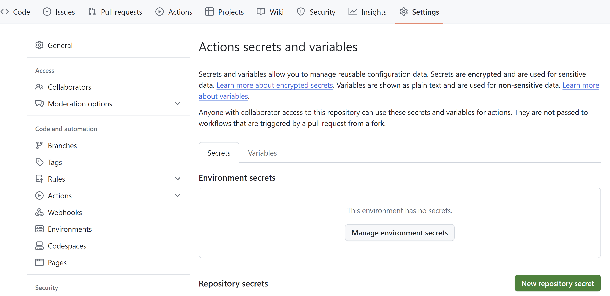
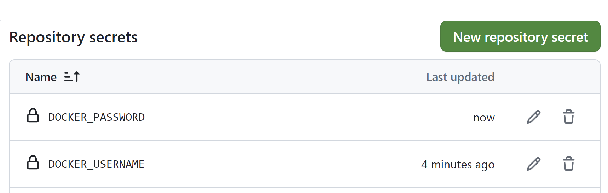
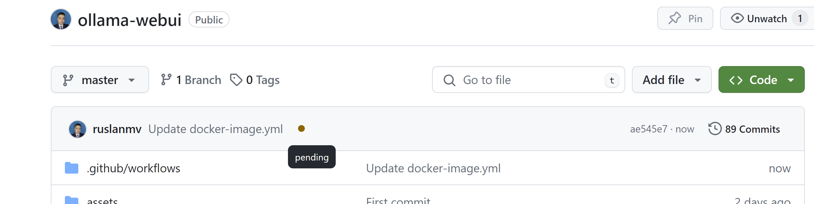
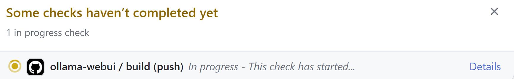
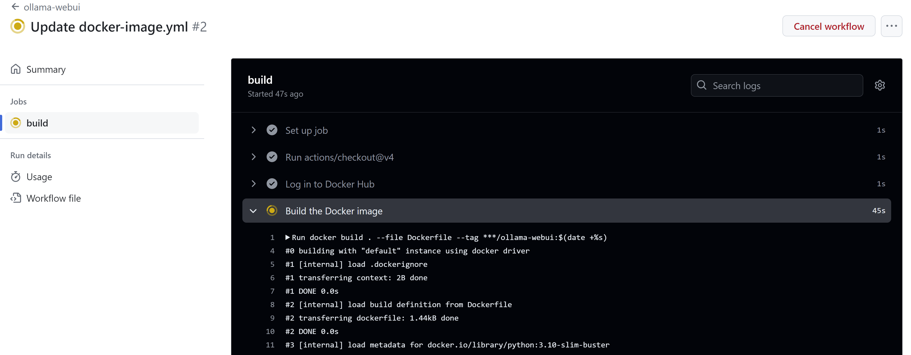
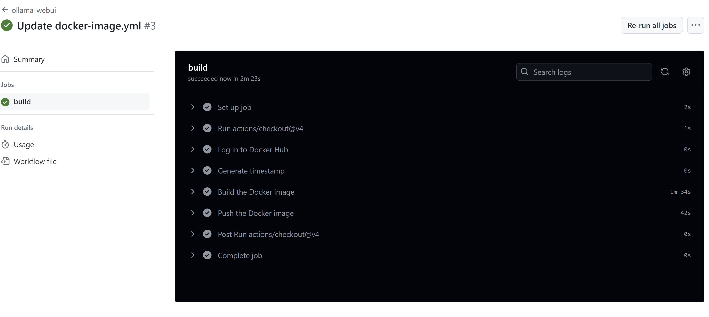
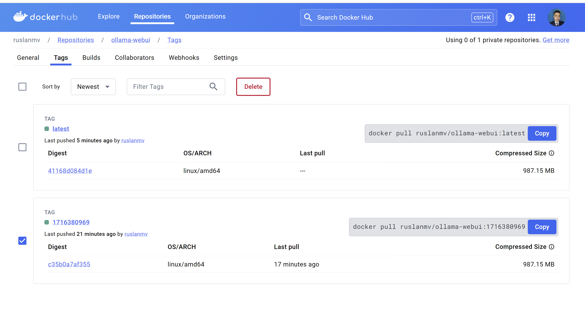

In this blog post, we'll walk you through the steps to automate the process of building and pushing Docker images to Docker Hub using GitHub Actions. By the end of this guide, you'll have a working GitHub Actions workflow that builds your Docker image and pushes it to Docker Hub whenever changes are pushed to the `master` branch or a pull request is made.

## Prerequisites

Before we begin, ensure you have the following:

- A GitHub account with a repository containing a Dockerfile.
- A Docker Hub account. In this example, we'll use the Docker Hub username `ruslanmv`.

## Step 1: Add Docker Hub Credentials to GitHub Secrets

First, we need to securely store our Docker Hub credentials in GitHub Secrets. This allows GitHub Actions to authenticate with Docker Hub.

1. Go to your GitHub repository.
2. Click on "Settings" in the repository menu.
3. In the left sidebar, click on "Secrets and variables" and then "Actions".
   
4. Click on the "New repository secret" button.
5. Add the following secrets:
   - `DOCKER_USERNAME`: Your Docker Hub username (`ruslanmv`).
   - `DOCKER_PASSWORD`: Your Docker Hub password.

## Step 2: Create and Update Your GitHub Actions Workflow
Next, we'll create a GitHub Actions workflow file to define the automation process. This file will include steps for checking out the code, logging into Docker Hub, building the Docker image, and pushing it to Docker Hub.

### Workflow File: `docker-image.yml`

Here's the updated workflow file:

```yaml
name: ollama-webui

on:
  push:
    branches: [ "master" ]
  pull_request:
    branches: [ "master" ]

jobs:

  build:

    runs-on: ubuntu-latest

    steps:
    - uses: actions/checkout@v4

    - name: Log in to Docker Hub
      run: echo "${{ secrets.DOCKER_PASSWORD }}" | docker login -u "${{ secrets.DOCKER_USERNAME }}" --password-stdin

    - name: Generate timestamp
      run: echo "TIMESTAMP=$(date +%s)" >> $GITHUB_ENV

    - name: Build the Docker image
      run: docker build . --file Dockerfile --tag ruslanmv/ollama-webui:${TIMESTAMP}

    - name: Push the Docker image
      run: docker push ruslanmv/ollama-webui:${TIMESTAMP}

```

### Explanation of Each Step

#### 1. Check Out the Code

```yaml
- uses: actions/checkout@v4
```

This step uses the `actions/checkout` action to check out your repository to the GitHub Actions runner, allowing the workflow to access your code and Dockerfile.

#### 2. Log In to Docker Hub

```yaml
- name: Log in to Docker Hub
  run: echo "${{ secrets.DOCKER_PASSWORD }}" | docker login -u "${{ secrets.DOCKER_USERNAME }}" --password-stdin
```

This step logs in to Docker Hub using the credentials stored in GitHub Secrets. It uses the `docker login` command with the `--password-stdin` flag for secure authentication.

### 3. Generation of version 

This step we generate a version of the image by assinging the timestamp value.
```yaml
    - name: Generate timestamp
      run: echo "TIMESTAMP=$(date +%s)" >> $GITHUB_ENV
```

#### 4. Build the Docker Image

```yaml
- name: Build the Docker image
  run: docker build . --file Dockerfile --tag ruslanmv/ollama-webui:${TIMESTAMP}
```

This step builds the Docker image using the `docker build` command. The `--file Dockerfile` flag specifies the Dockerfile to use, and the `--tag` option tags the image with a unique identifier based on the current timestamp.

#### 4. Push the Docker Image

```yaml
- name: Push the Docker image
  run: docker push ruslanmv/ollama-webui:${TIMESTAMP}
```

This step pushes the Docker image to Docker Hub using the `docker push` command. It uses the same tag as the build step to ensure the correct image is pushed.

## Step 3: Commit and Push Your Changes

After updating the workflow file, commit and push the changes to your GitHub repository:

```bash
git add .github/workflows/docker-image.yml
git commit -m "Add Docker push workflow"
git push origin master
```
If you have only create an image 


```yaml
name: ollama-webui

on:
  push:
    branches: [ "master" ]
  pull_request:
    branches: [ "master" ]

jobs:

  build:

    runs-on: ubuntu-latest

    steps:
    - uses: actions/checkout@v4

    - name: Log in to Docker Hub
      run: echo "${{ secrets.DOCKER_PASSWORD }}" | docker login -u "${{ secrets.DOCKER_USERNAME }}" --password-stdin

    - name: Build the Docker image
      run: docker build . --file Dockerfile --tag ruslanmv/ollama-webui:$(date +%s)

    - name: Push the Docker image
      run: docker push ruslanmv/ollama-webui:$(date +%s)
```
When you commit new things
you can see the status




and finally you can pull it.


## Conclusion

By following these steps, you have set up a GitHub Actions workflow that automates the process of building and pushing Docker images to Docker Hub. This automation ensures that your Docker images are always up-to-date with the latest changes in your repository, streamlining your development and deployment workflows.

Feel free to extend this workflow with additional steps, such as running tests or deploying the image to a staging environment, to further enhance your CI/CD pipeline. Happy coding!
