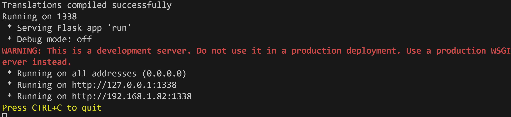
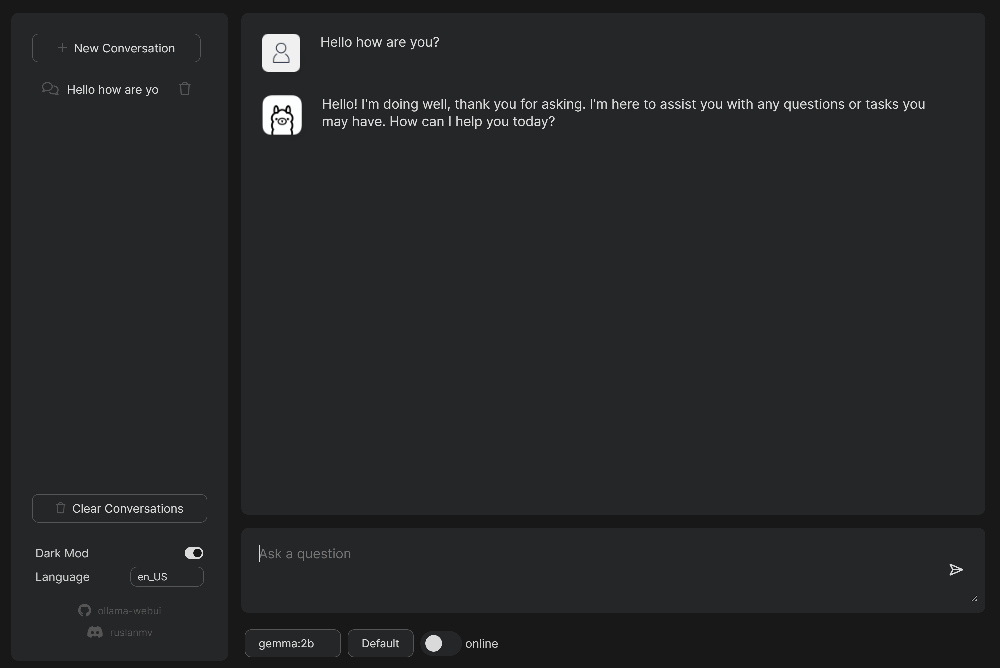
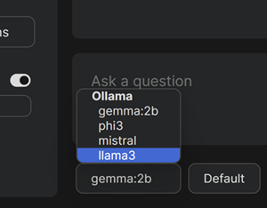
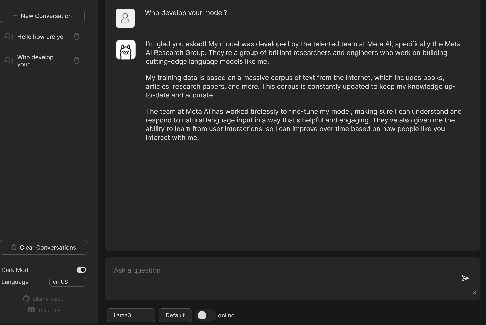
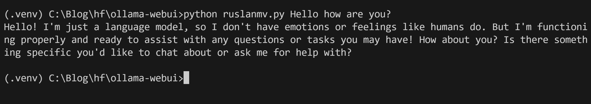

In today's connected world, access to powerful language models is often just a click away. However, there are times when internet access is not available, such as during flights, in remote areas, or even underwater (for those adventurous divers). For these situations, having a locally hosted chatbot like Ollama WebUI can be incredibly useful. This guide will walk you through the process of setting up and running Ollama WebUI on your local machine, ensuring you have access to a large language model (LLM) even when offline.

## Introduction to Ollama

Ollama WebUI is a versatile platform that allows users to run large language models locally on their own machines. This is particularly beneficial for scenarios where internet access is limited or unavailable. Ollama supports a variety of models, each tailored for different performance and quality needs. Below is a table detailing the available models, their parameters, size, compute power required, accuracy expectation, and quality.

| Model                | Parameters | Model Size (approx. in GB) | Compute Power Needed   | Accuracy Expectation | Quality               |
|----------------------|------------|----------------------------|------------------------|----------------------|-----------------------|
| llama3               | 13B        | 6.5GB                      | Moderate               | High                 | Good                  |
| llama3:70b           | 70B        | 35GB                       | High                   | Very High            | Excellent             |
| phi3                 | 12B        | 6GB                        | Moderate               | High                 | Good                  |
| mistral              | 7B         | 3.5GB                      | Low                    | Moderate             | Fair                  |
| neural-chat          | 6B         | 3GB                        | Low                    | Moderate             | Fair                  |
| starling-lm          | 11B        | 5.5GB                      | Moderate               | High                 | Good                  |
| codellama            | 14B        | 7GB                        | Moderate               | High                 | Good                  |
| llama2-uncensored    | 13B        | 6.5GB                      | Moderate               | High                 | Good                  |
| llava                | 20B        | 10GB                       | High                   | Very High            | Excellent             |
| gemma:2b             | 2B         | 1GB                        | Low                    | Moderate             | Fair                  |
| gemma:7b             | 7B         | 3.5GB                      | Low                    | Moderate             | Fair                  |
| solar                | 9B         | 4.5GB                      | Moderate               | High                 | Good                  |

## System Requirements

To run these models effectively, you will need a computer with the following minimum specifications:
- **CPU:** Multi-core processor (Quad-core or better recommended)
- **RAM:** At least 16GB of RAM (more for larger models)
- **Storage:** Sufficient free disk space to accommodate the model size (e.g., 10GB+)
- **Operating System:** Windows, macOS, or Linux

## Table of Contents
- [To-Do List](#to-do-list)
- [Getting Started](#getting-started)
  - [Cloning the Repository](#cloning-the-repository)
  - [Installing Dependencies](#installing-dependencies)
  - [Running the Application](#running-the-application)
- [Using Docker](#using-docker)
  - [Prerequisites](#prerequisites)
  - [Running the Docker](#running-the-docker)
- [Incorporated Projects](#incorporated-projects)
- [Legal Notice](#legal-notice)
- [Using Ollama on the Terminal](#using-ollama-on-the-terminal)

## To-Do List
1. Download and install Ollama.
2. Clone the repository.
3. Install dependencies.
4. Run the application.
5. Optionally, use Docker for easier setup.

## Getting Started ✅

To get started with Ollama WebUI, you'll first need to ensure you have Python installed on your system. Once that's done, you can proceed with downloading Ollama [here](https://ollama.com/download) and cloning the repository.

### Cloning the Repository 📥

Run the following command to clone the Ollama WebUI repository:

```bash
git clone https://github.com/ruslanmv/ollama-webui.git
```

### Installing Dependencies 🔧

Navigate to the project directory:

```bash
cd ollama-webui
```

Install the necessary dependencies:

```bash
pip install -r requirements.txt
```

### Running the Application 🚀

To start the application, use the following command:

```bash
python run.py
```

Once the application is running, you can access it in your web browser at:


[http://127.0.0.1:1338](http://127.0.0.1:1338)


or

[http://localhost:1338](http://localhost:1338)



## Change models
In the booton of  the webapp there is 

and


## Using Docker 🐳

If you prefer using Docker, follow these steps. Docker simplifies the setup process by encapsulating the application and its dependencies into a single container.

### Prerequisites

Make sure you have Docker installed on your machine. You can download Docker from [Docker's official website](https://www.docker.com/products/docker-desktop).

### Running the Docker

Pull the Docker image from Docker Hub:

```bash
docker pull ruslanmv/ollama-webui
```

Run the application using Docker:

```bash
docker run -p 1338:1338 ruslanmv/ollama-webui
```

Access the application in your web browser at:

[http://127.0.0.1:1338](http://127.0.0.1:1338)


or

[http://localhost:1338](http://localhost:1338)

When you're done using the application, you can stop the Docker container with the following command:

```bash
docker stop <container-id>
```

## Incorporated Projects

Ollama WebUI incorporates several projects to provide a seamless and robust experience. The primary focus is to offer an easy-to-use interface for running large language models locally, without the need for continuous internet access.

## Legal Notice

Before using Ollama WebUI, ensure you comply with any applicable laws and regulations related to the use and distribution of large language models. This software is provided "as is," without warranty of any kind.

## Using Ollama on the Terminal

While the web-based interface of Ollama WebUI is user-friendly, you can also run the chatbot directly from the terminal if you prefer a more lightweight setup. This can be particularly useful for advanced users or for automation purposes.

### Running Ollama without the WebUI

To run Ollama directly from the terminal, follow these steps:

1. **Navigate to the Project Directory:**
   ```bash
   cd ollama-webui
   ```

2. **Run the Model:**
   Use a Python script or an interactive Python session to load and interact with the model. For example:
   ```
   python ruslanmv.py Hello how are you?
   ```


   or if you want customize you own code you can  use:

   ```python
    import ollama
    from langchain_community.llms import Ollama
    # Replace with the desired model name
    model_name = "llama3" 
    #Check if you have the model
    !ollama list
    # Download the model 
    ollama.pull=model_name
    #Load the model
    llm = Ollama(model=model_name)
    prompt='''Hello, how can I help you?'''
        # Interact with the model
    response = llm.invoke(prompt)
    print(response)
   ```

3. **Ensure Dependencies are Met:**
   Ensure you have all necessary dependencies installed, including the specific model files and any required libraries.

While this method requires a bit more setup and knowledge of Python programming, it offers greater flexibility and can be integrated into various workflows or applications without relying on a web browser.

---

By following these steps, you can have Ollama WebUI running on your local machine, ready to assist you with various tasks even when you're offline. Whether you're in an airplane, deep in the forest, or anywhere else without internet access, you'll have a powerful language model at your fingertips. Happy chatting!
