Hello everyone! In this blog post, we're going to explore how to create some  applications using the **Azure OpenAI SDK**. Azure OpenAI brings the power of OpenAI's generative models to the Azure platform, making it easier than ever to integrate advanced AI capabilities into your applications.

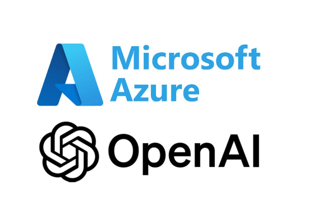

We'll guide you through the environment setup and discuss four different  steps using **Azure OpenAI**:

1. **Enable Azure OpenAI Service**: Deploy a GPT-35-turbo-16k model in Azure OpenAI and configure a sample application to connect to the resources.
2. **Prompt Engineering for Azure OpenAI**: Explore the potential of Azure OpenAI for company chatbot functionality, focusing on casual tone responses.
3. **Code Generation  for Developer Tasks**: Utilize an app to assist with developer tasks such as code refactoring and unit testing.
4. **Implement Retrieval Augmented Generation (RAG) with Azure OpenAI Service**: Extend the app to utilize company data for providing accurate travel recommendations.


## Environment Setup

First, let's set up a Python environment on our local computer where we'll install our Azure applications. Assuming you have Anaconda installed, follow these steps to create and activate a new environment for our project.

### Step 1: Installation of Conda

If you don't have Anaconda installed, you can download it from the [official website](https://www.anaconda.com/products/distribution). Once Anaconda is installed, create a new environment for our project:


```bash
conda create -n azure python==3.11 ipykernel  
```

then we activate

```bash
 conda activate azure, 
```

You can install Jupyter Lab if you like

```bash
pip install jupyter notebook
```

or optionally if you want have  Elyra

```bash
 conda install -c conda-forge "elyra[all]"
```

then

```bash
python -m ipykernel install --user --name azure --display-name "Python 3.11 (Azure)"

```

The Python SDK is built and maintained by OpenAI.

```bash
pip install openai==1.6.1 python-dotenv
pip install azure-search-documents
pip install azure-core
pip install azure-storage-blob

 
```

We can test our installation of our enviroment by typing

```bash
jupyter lab
```

### Step 2 - Enable Azure OpenAI Service

To build a generative AI solution with Azure OpenAI, the first step is to provision an Azure OpenAI resource in your Azure subscription.

Azure OpenAI Service is currently in limited access. Apply for service access [here](https://aka.ms/oai/access).

**Sign in to the Azure Portal:**

   - Go to the [Azure portal](https://portal.azure.com/) and sign in with your Azure account.

**Create an Azure OpenAI resource:**

   - In the search bar, type "Azure OpenAI" and select it.

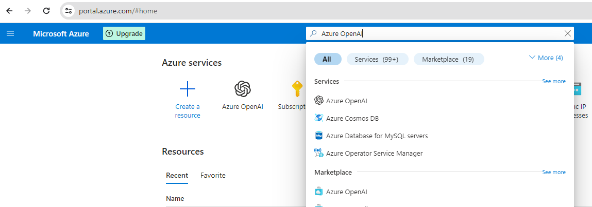


   - Click "Create" to create a new Azure OpenAI resource.

     

   - 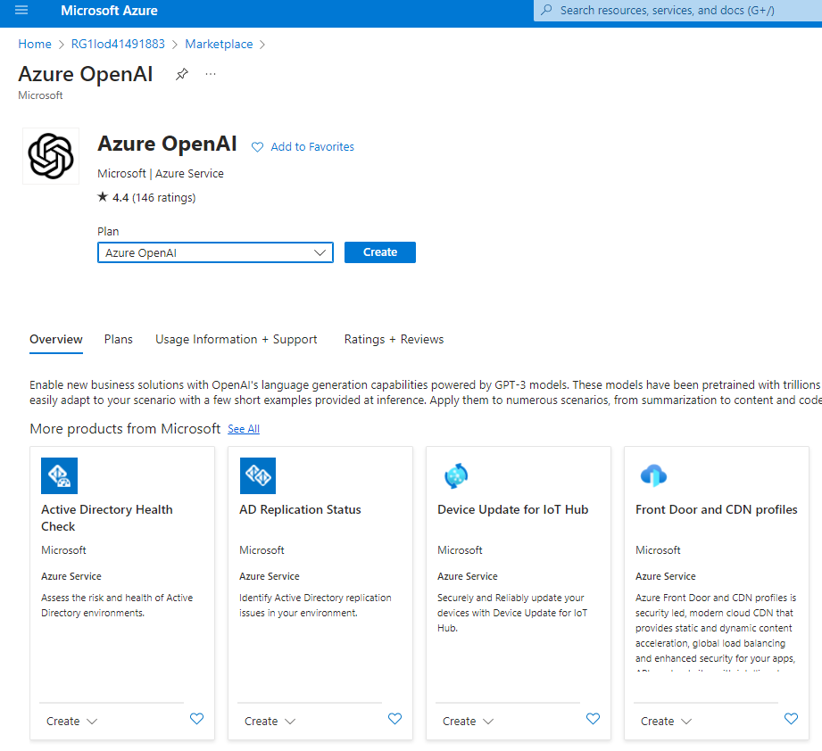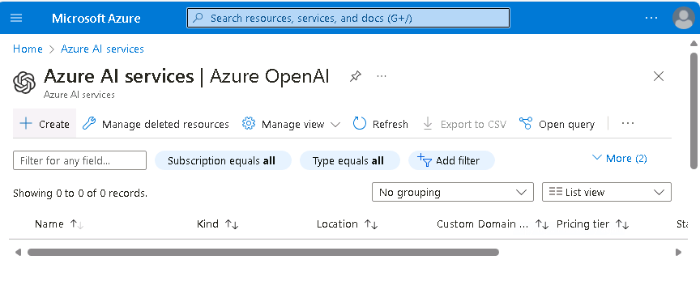

   - Choose the subscription and resource group.
   - Select the region (ensure it matches the region, In my case I am  in Europe I use  France central).
   - Fill in the required details and create the resource.


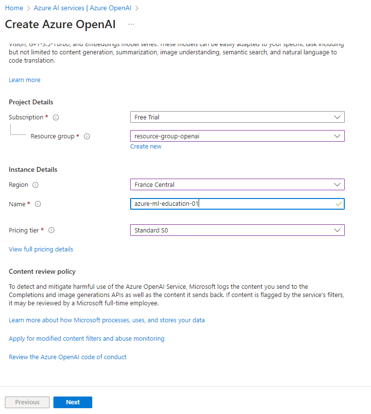


and finally next and click create to  finish 


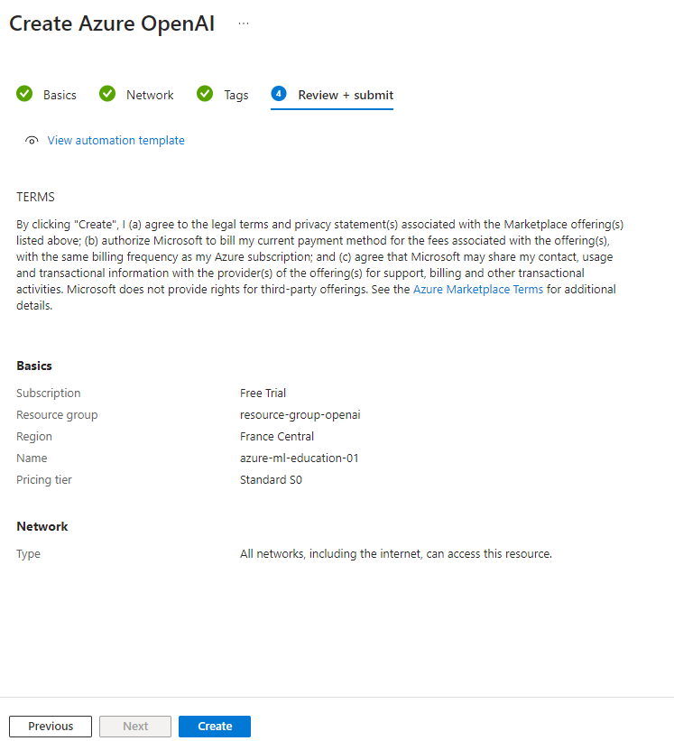


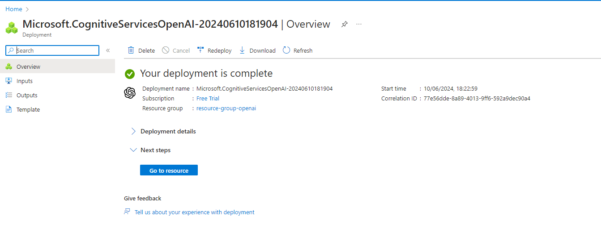

When it is created, go to your resource in the Azure portal. The Keys and Endpoint can be found in the Resource Management section. Copy your endpoint and access key; you'll need both for authenticating your API calls. You can use either KEY1 or KEY2. Having two keys allows secure rotation and regeneration without causing service disruption.

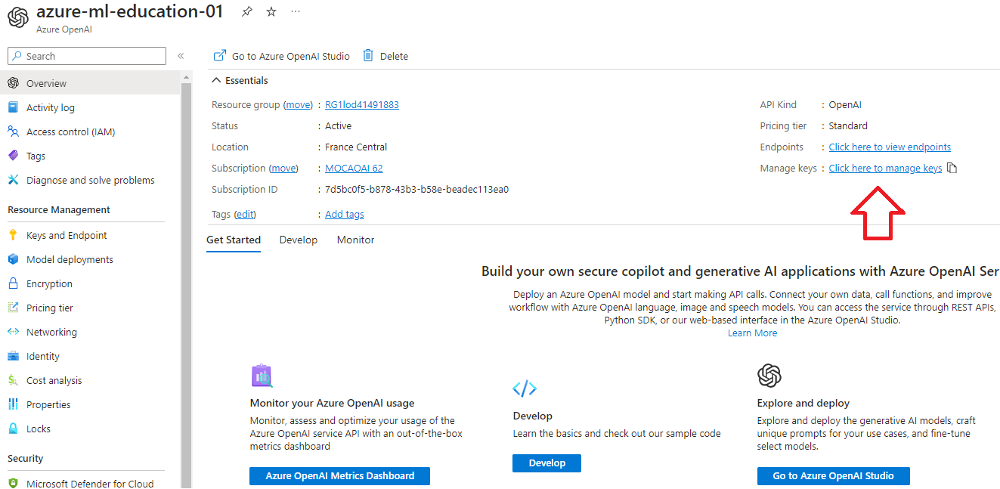

and copy the  KEY 1 and Endpoint

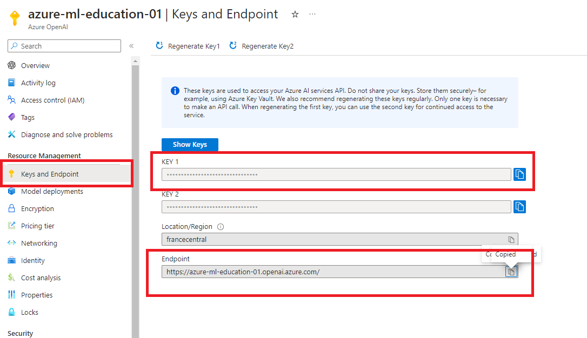


**Environment Variables:**
Create and assign persistent environment variables for your key and endpoint. Create a `.env` file and add the environment variables:

```plaintext
AZURE_OAI_KEY="REPLACE_WITH_YOUR_KEY_VALUE_HERE"
AZURE_OAI_ENDPOINT="REPLACE_WITH_YOUR_ENDPOINT_HERE"
```

**Deploy the GPT-3.5-turbo-16k model:**

   - Once the resource is created, navigate to it, go Azure OpenAI Studio,

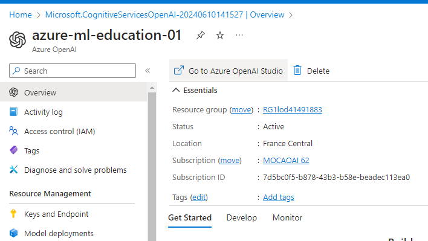


   - In the left-hand menu, click on "Deployments".

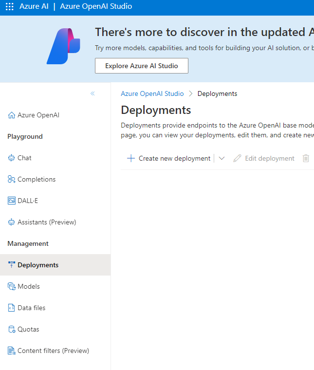

   - Click "Create new depoyment" to deploy a new model.
   - Choose "GPT-3.5-turbo-16k" from the model list.
   - In the "Advanced options":
     - Set "Tokens per Minute Rate Limit (thousands)" to 5K.
     - Set "Enable Dynamic Quota" to Disabled.
   - Complete the deployment.
     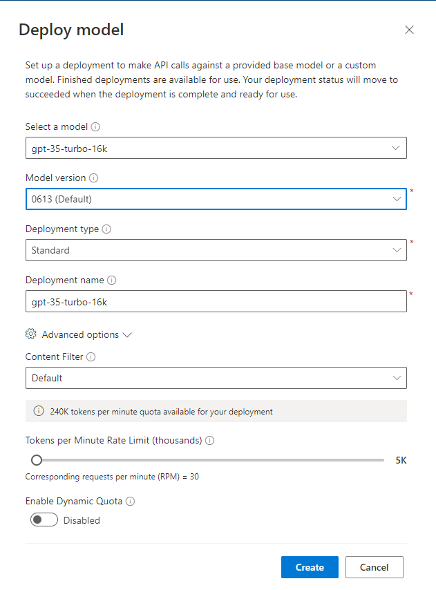

you will have
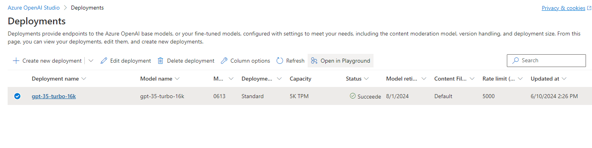

To test, just click open playgroud, and type something to see if works.
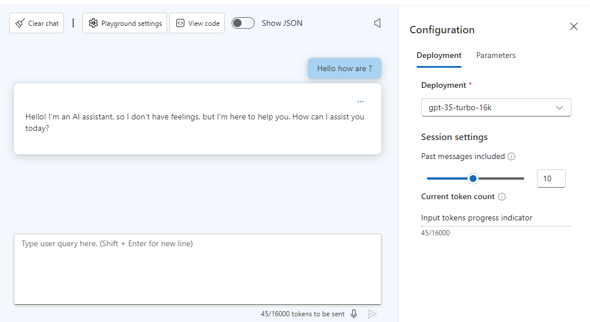

Well done!.

### How to Perform Calls

To make a call against the Azure OpenAI service, you'll need the following information:

| Variable Name   | Value                                                        |
| --------------- | ------------------------------------------------------------ |
| ENDPOINT        | Found in the Keys and Endpoint section of your resource in the Azure portal. Example: [https://docs-test-001.openai.azure.com/](https://docs-test-001.openai.azure.com/). |
| API-KEY         | Found in the Keys and Endpoint section of your resource in the Azure portal. Use either KEY1 or KEY2. |
| DEPLOYMENT-NAME | The custom name you chose for your deployment. Found under Resource Management > Model Deployments in the Azure portal or under Management > Deployments in Azure OpenAI Studio. |


# Example 1

```python
import os
from openai import AzureOpenAI
from dotenv import load_dotenv
load_dotenv()
# Set environment variables
azure_oai_endpoint = os.getenv("AZURE_OAI_ENDPOINT") 
azure_oai_deployment = "gpt-35-turbo-16k"
azure_oai_key = os.getenv("AZURE_OAI_KEY")

# Create AzureOpenAI client
client = AzureOpenAI(azure_endpoint=azure_oai_endpoint, 
                     api_key=azure_oai_key, 
                     api_version="2023-12-01-preview")

# Create chat completion
completion = client.chat.completions.create(
    model=azure_oai_deployment,
    messages=[
        {"role": "user", "content": "I'd like to take a trip to New York. Where should I stay?"}
    ]
)

# Print the response from the AI model
print(completion.choices[0].message.content)

```

Output:

```
New York City offers a range of accommodation options to suit different preferences and budgets. Here are a few popular areas to consider staying in:
1. Manhattan: This is the heart of NYC and a convenient location for exploring popular attractions such as Times Square, Central Park, and the Empire State Building. It offers a wide range of hotels, from luxury options in uptown Manhattan to more affordable ones near Midtown or Downtown.
2. Brooklyn: If you prefer a more laid-back and artistic vibe, consider staying in neighborhoods like Williamsburg or DUMBO. Brooklyn offers great views of the Manhattan skyline, trendy shops and restaurants, and easy access to attractions like the Brooklyn Bridge and Brooklyn Museum.
3. Queens: This borough is less crowded and more affordable compared to Manhattan. It is home to diverse communities, delicious food, and attractions like Flushing Meadows-Corona Park and the USTA Billie Jean King National Tennis Center.
4. Staten Island: This is a quieter option, away from the hustle and bustle of the city. It offers serene landscapes, beautiful parks, and attractions like the Staten Island Ferry and the Staten Island Museum.
Consider your preferences, budget, and the areas you wish to explore when choosing your accommodation in New York.
```

# Example 2

We want to convert our Assistant to Neko.


```python
import os
from openai import AzureOpenAI

# Set environment variables
endpoint = os.getenv("AZURE_OAI_ENDPOINT") 
deployment = "gpt-35-turbo-16k"
api_key = os.getenv("AZURE_OAI_KEY")

# Create AzureOpenAI client
client = AzureOpenAI(azure_endpoint=endpoint, api_key=api_key, api_version="2024-02-01")

response = client.chat.completions.create(
    model=deployment,
    messages=[
        {"role": "system", "content": "You are a Neko Assitant, and at the end of each conversation you says Nya!"},
        {"role": "user", "content": "Who were the founders of Microsoft?"}
    ]
)
#print(response)
#print(response.model_dump_json(indent=2))
print(response.choices[0].message.content)
```

Output:

```
The founders of Microsoft are Bill Gates and Paul Allen. Nya!

```


Now we are able to proceed with the scenarios.


# 1.  Deploying a GPT-35-turbo-16k model in Azure OpenAI


In this scenario, we're tasked with deploying a GPT-35-turbo-16k model in Azure OpenAI and configuring a sample application to connect to the resources. This serves as our initial PoC to demonstrate the capabilities of Azure OpenAI.

#### Requirements:

The solution must meet the following requirements:

* Deploy a GPT-35-turbo-16k model in Azure OpenAI in the same region as the resource group.
* Configure the settings file of the PoC app with the connection strings (without adding them directly to the code).
* Configure the client settings for Azure OpenAI in the Main() function (using API version 2023-12-01-preview for Python).
* Configure the messages, API parameters, and call chat completion connection in the function1() function.
* Validate the response using a sample text prompt file.
* Set the Tokens per Minute Rate Limit (thousands) to 5K and Enable Dynamic Quota to Disabled in the Deploy model dialog box.

First we create  a prompt1.txt file

```
What can a generative AI model do? Give me a short answer.
```

then the following function


```python
import os
from dotenv import load_dotenv
import utils
# Add OpenAI import. (Added code)
from openai import AzureOpenAI, Model, ChatCompletion
def main(func):
    try:
        load_dotenv()
        utils.initLogFile()
        azure_oai_endpoint = os.getenv("AZURE_OAI_ENDPOINT")
        azure_oai_key = os.getenv("AZURE_OAI_KEY")
        azure_oai_model = os.getenv("AZURE_OAI_MODEL")
        # Define Azure OpenAI client 
        client = AzureOpenAI(azure_endpoint=azure_oai_endpoint, api_key=azure_oai_key, api_version="2023-12-01-preview")
        if callable(func):
            func(client, azure_oai_model)
        else:
            print("Invalid input. Please pass a valid function.")

    except Exception as ex:
        print(ex)


# Task 1: Validate PoC
def function1(aiClient, aiModel):
    inputText = utils.getPromptInput("Task 1: Validate PoC", "prompt1.txt")
    
    # Build messages to send to Azure OpenAI model. (Modified code)
    messages = [
        {"role": "user", "content": inputText}  # Modified to us"user" role and "content" key
    ]
    # Define argument list (Modified code)
    apiParams = {
        "model": aiModel,  # Added model parameter
        "messages": messages,
    }
    utils.writeLog("API Parameters:\n", apiParams)
    # Call chat completion connection. (Modified code)

    response = aiClient.chat.completions.create(**apiParams) # Modified to use the aiClient and **apiParams
    utils.writeLog("Response:\n", str(response))
    print("Response: " + response.choices[0].message.content + "\n")
    return response
# Call the main function with function1 as an argument
main(function1)

```

Output

```
ould you like to type a prompt or text in file prompt1.txt? (type/file)
...Reading text from prompt1.txt...


...Sending the following request to Azure OpenAI...
Request: What can a generative AI model do? Give me a short answer.

Response: A generative AI model can create original and unique content, such as text, images, videos, and music, without explicit human guidance.

```


# 2. Prompt Engineering for Azure OpenAI 


Here, we'll further develop the PoC app to explore the potential of Azure OpenAI for company chatbot functionality. The goal is to develop an app that provides responses in a casual tone, limited to 1,000 tokens, and with a temperature of 0.5.


### Developing the PoC App for Company Chatbot

We have been tasked with further developing the Proof of Concept (PoC) app to explore the potential of Azure OpenAI for company chatbot functionality. The goal is to develop the app to provide responses in a casual tone, limited to 1,000 tokens, and with a temperature of 0.5.

#### Requirements:

The solution must meet the following requirements:

* Each response must be in a casual tone and end with "Hope that helps! Thanks for using Contoso, Ltd."
* Responses must be limited to 1,000 tokens and the temperature must be 0.5.
* At least one example must be provided with the prompt, such as:
  + Prompt: Where can I find the company phone number?
  + Response: You can find it on the footer of every page on our website. Hope that helps! Thanks for using Contoso, Ltd.
* Use prompt engineering techniques to ask the following question and get the response in both English and Spanish:
  + "What is the best way to find if a company is hiring?"

First we create  a prompt2.txt file

```
What is the best way to find if a company is hiring?
```

then the following function:

```python
# Task 2: Company chatbot
def function2(aiClient, aiModel):
    inputText = utils.getPromptInput("Task 2: Company chatbot", "prompt2.txt")
    
    # Build messages to send to Azure OpenAI model. (Added code)
    messages = [
        {"role": "system", "content": "You are a helpful assistant.  Get the response in first in Spanish and then in English"},
        {"role": "user", "content": inputText},
        {"role": "assistant", "content": "Each response must be in a casual tone and end with 'Hope that helps! Thanks for using Contoso, Ltd.'"}
    ]
    
    # Define argument list (Modified code)
    apiParams = {
        "model": aiModel,
        "messages": messages,
        "temperature": 0.5,
        "max_tokens": 1000
    }
    
    utils.writeLog("API Parameters:\n", apiParams)

    # Call chat completion connection. (Modified code)
    response = aiClient.chat.completions.create(**apiParams) # Modified to use the aiClient and **apiParams
    utils.writeLog("Response:\n", str(response))
    
    # Print the response (Modified code)
    print("Response: " + response.choices[0].message.content + "\n")

    return response
example_prompt = " Where can I find the company phone number?"
# Call the main function with function2 as an argument
main(function2)    
```

Output:

```
Would you like to type a prompt or text in file prompt2.txt? (type/file)
...Reading text from prompt2.txt...


...Sending the following request to Azure OpenAI...
Request: What is the best way to find if a company is hiring?

Response: La mejor manera de saber si una empresa está contratando es investigar en línea. Puedes visitar el sitio web de la empresa y buscar la sección de "Carreras" o "Trabaja con nosotros". Allí, podrás encontrar información sobre las vacantes disponibles y los requisitos para aplicar. También puedes seguir a la empresa en redes sociales, ya que a menudo publican anuncios de empleo. Otra opción es utilizar sitios web de búsqueda de empleo, donde puedes filtrar los resultados por empresa y ver si la empresa que te interesa tiene puestos vacantes. ¡Espero que eso te ayude! Gracias por usar Contoso, Ltd. 

The best way to find out if a company is hiring is to do some online research. You can visit the company's website and look for the "Careers" or "Join Our Team" section. There, you can find information about available job positions and the requirements to apply. You can also follow the company on social media, as they often post job announcements. Another option is to use job search websites, where you can filter the results by company and see if the company you're interested in has any job openings. Hope that helps! Thanks for using Contoso, Ltd.

```


# 3. Code Generation  for Developer Tasks


In this scenario, we'll use the PoC app to assist with developer tasks such as code refactoring and unit testing. This demonstrates how Azure OpenAI can enhance productivity and streamline development workflows.

### Using the PoC App for Dveloper Tasks

We have been tasked with using the Proof of Concept (PoC) app to help with developer tasks, such as code refactoring and unit testing. The goal is to modify th`function3` function of the PoC app to successfully complete the following tasks:

#### Requirements:

The solution must meet the following requirements:

* Take the legacy code in `legacyCode.py`, and generate documentation.
* Generate five unit tests for the function in `fibonacci.py`.
* Modify the prompt in `sample-text.txt` to accomplish each task.
* Submit individual code generation requests for each task to Azure OpenAI using the PoC app.
  First we create  a prompt3.txt file


```
Please add comments and generate documentation for the following Python code:

def value(make, model, year, mileage, accidents):   
    value = 10000   

    if make == "Toyota":   
        if model == "Camry":   
            value -= 2000   
        elif model == "Corolla":   
            value -= 1500   
        elif model == "Rav4":   
            value -= 1000   
    elif make == "Honda":   
        if model == "Accord":   
            value -= 2000   
        elif model == "Civic":   
            value -= 1500   
        elif model == "CR-V":   
            value -= 1000   
    elif make == "Ford":   
        if model == "Focus":   
            value -= 2000   
        elif model == "Fusion":   
            value -= 1500   
        elif model == "Escape":   
            value -= 1000   
   
    if year < 2010:   
        value -= 3000   
    elif year < 2015:   
        value -= 2000   
    elif year < 2020:   
        value -= 1000   
   
    if mileage > 100000:   
        value -= 2000   
    elif mileage > 50000:   
        value -= 1000   
   
    if accidents > 3:   
        value -= 2000   
    elif accidents > 1:   
        value -= 1000   

    return value   

car1 = calculate_car_value("Toyota", "Camry", 2014, 80000, 2)   
print("Car 1 value:", car1)   

car2 = calculate_car_value("Honda", "Accord", 2011, 120000, 0)   
print("Car 2 value:", car2)   

car3 = calculate_car_value("Ford", "Focus", 2018, 40000, 1)
print("Car 3 value:", car3)

Please generate five unit tests for the following Python function:

def findDifferenceCheckFibonacci(num1, num2):
    diff = abs(num1 - num2)
    if is_fibonacci(diff):
        return f"The difference ({diff}) is in the Fibonacci sequence." 
    else:  
        return f"The difference ({diff}) is not in the Fibonacci sequence."

```

then the following function:

```python
def function3(aiClient, aiModel):
    inputText = utils.getPromptInput("Task 3: Developer tasks", "prompt3.txt")
    # Provide a basic user message, and use the prompt content as the user message
    system_message = "You are a helpful AI assistant that helps programmers write code."
   
    # Build messages to send to Azure OpenAI model
    messages =[
        {"role": "system", "content": system_message},
        {"role": "user", "content": inputText},
    ]
        # Define argument list
    apiParams = {
        "model": aiModel,
        "messages": messages,
        "temperature": 0.7,  # Set temperature to 0.5
        "max_tokens": 1000  # Set max tokens to 1000
    }

    utils.writeLog("API Parameters:\n", apiParams)

    # Call the Azure OpenAI model
    response = aiClient.chat.completions.create(**apiParams) # Use the aiClient and **apiParams
    
    utils.writeLog("Response:\n", str(response))
    print("Response: " + response.choices[0].message.content + "\n")
    return response

# Call the main function with function2 as an argument
main(function3)  
```

Output:

```
Would you like to type a prompt or text in file prompt3.txt? (type/file)
...Reading text from prompt3.txt...


...Sending the following request to Azure OpenAI...
Request: Please add comments and generate documentation for the following Python code:

def value(make, model, year, mileage, accidents):   
    value = 10000   

    if make == "Toyota":   
        if model == "Camry":   
            value -= 2000   
        elif model == "Corolla":   
            value -= 1500   
        elif model == "Rav4":   
            value -= 1000   
    elif make == "Honda":   
        if model == "Accord":   
            value -= 2000   
        elif model == "Civic":   
            value -= 1500   
        elif model == "CR-V":   
            value -= 1000   
    elif make == "Ford":   
        if model == "Focus":   
            value -= 2000   
        elif model == "Fusion":   
            value -= 1500   
        elif model == "Escape":   
            value -= 1000   
   
    if year < 2010:   
        value -= 3000   
    elif year < 2015:   
        value -= 2000   
    elif year < 2020:   
        value -= 1000   
   
    if mileage > 100000:   
        value -= 2000   
    elif mileage > 50000:   
        value -= 1000   
   
    if accidents > 3:   
        value -= 2000   
    elif accidents > 1:   
        value -= 1000   

    return value   

car1 = calculate_car_value("Toyota", "Camry", 2014, 80000, 2)   
print("Car 1 value:", car1)   

car2 = calculate_car_value("Honda", "Accord", 2011, 120000, 0)   
print("Car 2 value:", car2)   

car3 = calculate_car_value("Ford", "Focus", 2018, 40000, 1)
print("Car 3 value:", car3)

Please generate five unit tests for the following Python function:

def findDifferenceCheckFibonacci(num1, num2):
    diff = abs(num1 - num2)
    if is_fibonacci(diff):
        return f"The difference ({diff}) is in the Fibonacci sequence." 
    else:  
        return f"The difference ({diff}) is not in the Fibonacci sequence."
Response: 
# Function: value
# Description: Calculates the value of a car based on make, model, year, mileage, and accidents.
# Input:
#   - make (string): The make of the car.
#   - model (string): The model of the car.
#   - year (int): The year the car was manufactured.
#   - mileage (int): The mileage of the car.
#   - accidents (int): The number of accidents the car has been in.
# Output:
#   - value (int): The calculated value of the car.
def value(make, model, year, mileage, accidents):   
    value = 10000   

    if make == "Toyota":   
        if model == "Camry":   
            value -= 2000   
        elif model == "Corolla":   
            value -= 1500   
        elif model == "Rav4":   
            value -= 1000   
    elif make == "Honda":   
        if model == "Accord":   
            value -= 2000   
        elif model == "Civic":   
            value -= 1500   
        elif model == "CR-V":   
            value -= 1000   
    elif make == "Ford":   
        if model == "Focus":   
            value -= 2000   
        elif model == "Fusion":   
            value -= 1500   
        elif model == "Escape":   
            value -= 1000   
   
    if year < 2010:   
        value -= 3000   
    elif year < 2015:   
        value -= 2000   
    elif year < 2020:   
        value -= 1000   
   
    if mileage > 100000:   
        value -= 2000   
    elif mileage > 50000:   
        value -= 1000   
   
    if accidents > 3:   
        value -= 2000   
    elif accidents > 1:   
        value -= 1000   

    return value   
car1 = calculate_car_value("Toyota", "Camry", 2014, 80000, 2)   
print("Car 1 value:", car1)   
car2 = calculate_car_value("Honda", "Accord", 2011, 120000, 0)   
print("Car 2 value:", car2)   
car3 = calculate_car_value("Ford", "Focus", 2018, 40000, 1)
print("Car 3 value:", car3)
Unit Test 1:
assert value("Toyota", "Camry", 2014, 80000, 2) == 8000
Unit Test 2:
assert value("Honda", "Accord", 2011, 120000, 0) == 7000
Unit Test 3:
assert value("Ford", "Focus", 2018, 40000, 1) == 8500
Unit Test 4:
assert value("Toyota", "Corolla", 2012, 90000, 3) == 6500
Unit Test 5:
assert value("Honda", "Civic", 2015, 60000, 2) == 7500

```


###  4. Implement Retrieval Augmented Generation (RAG) with Azure OpenAI Service

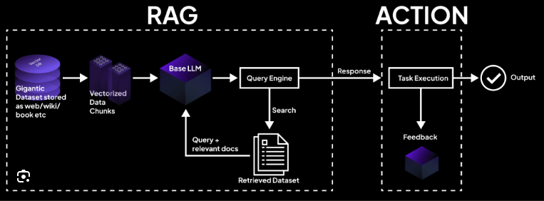

### Fine-tuning vs. RAG

Fine-tuning is a technique used to create a custom model by training an existing foundational model such as gpt-35-turbo with a dataset of additional training data. Fine-tuning can result in higher quality requests than prompt engineering alone, customize the model on examples larger than can fit in a prompt, and allow the user to provide fewer examples to get the same high quality response. However, the process for fine-tuning is both costly and time intensive, and should only be used for use cases where it's necessary.

RAG with Azure OpenAI on your data still uses the stateless API to connect to the model, which removes the requirement of training a custom model with your data and simplifies the interaction with the AI model. AI Search first finds the useful information to answer the prompt, adds that to the prompt as grounding data, and Azure OpenAI forms the response based on that information.

Finally, we'll extend the PoC app to utilize our company's data to better answer customer questions related to travel. The goal is to connect the PoC app to an Azure AI Search resource that contains sample travel data, providing more accurate and relevant responses.

Now you'll add some data for a fictional travel agent company named *Margie's Travel*. Then you'll see how the Azure OpenAI model responds when using the brochures from Margie's Travel as grounding data.

1. You'll need to create a storage account and Azure AI Search resource. 

2. Go to [storage resource](https://portal.azure.com/#browse/Microsoft.Storage%2FStorageAccounts)  

   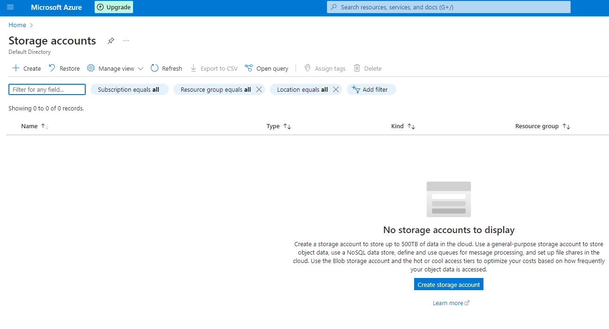

3. **Create a new Azure Blob storage account**, and create a storage account with the following settings. Anything not specified leave as the default.

4. In a new browser tab, download an archive of brochure data from [here](https://aka.ms/own-data-brochures). 

5. Extract the brochures to a folder on your PC.

   - **Subscription**: *Your Azure subscription*

   - **Resource group**: *Select the same resource group as your Azure OpenAI resource*

   - **Storage account name**: *Enter a unique name*

   - **Region**: *Select the same region as your Azure OpenAI resource*

   - **Redundancy**: Locally-redundant storage (LRS)

     

then we click on create.
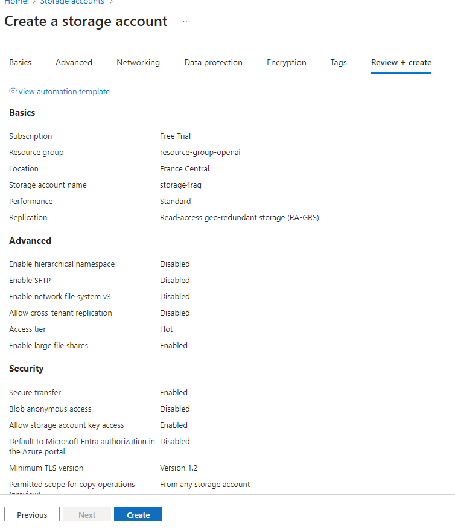

then we enter to 
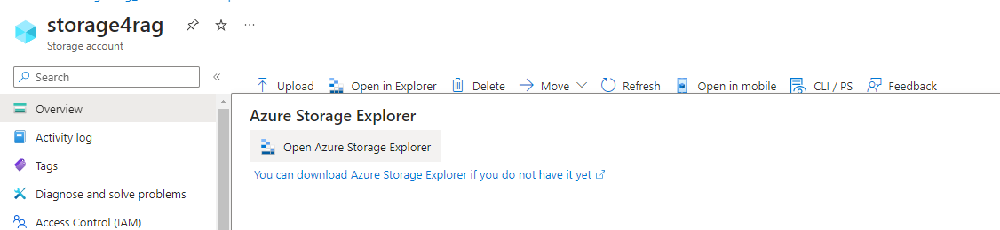


On the **Upload files** page, upload the PDFs you downloaded.

## Azure AI Search resource

1. **Create a new Azure AI Search resource** 
2. Got to [AI Search resource](https://portal.azure.com/#view/Microsoft_Azure_ProjectOxford/CognitiveServicesHub/~/CognitiveSearch)
3. With the following settings. Anything not specified leave as the default.

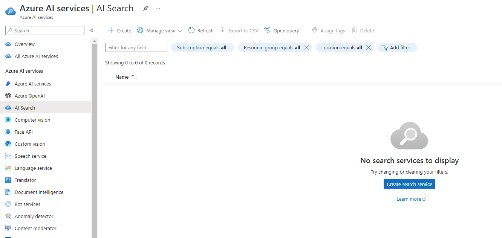

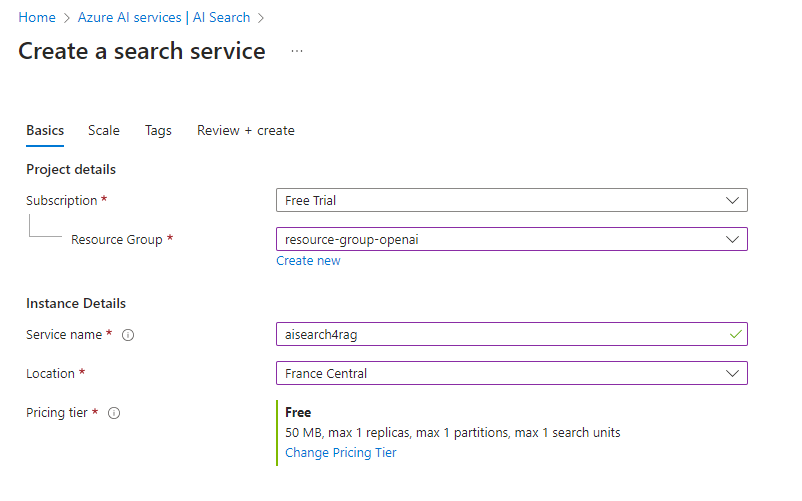

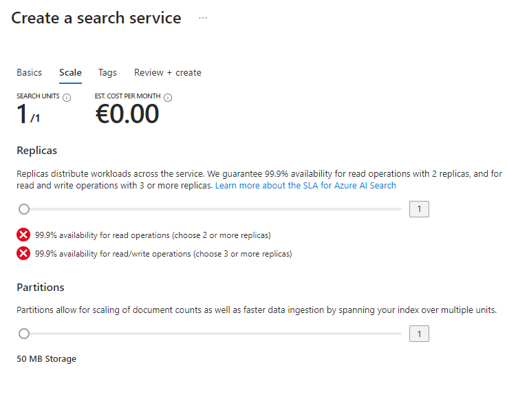

and then

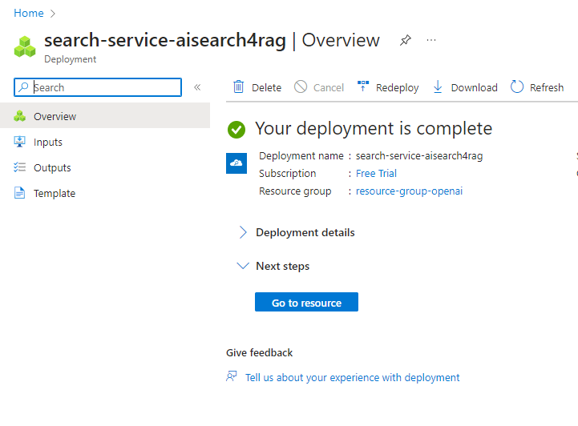

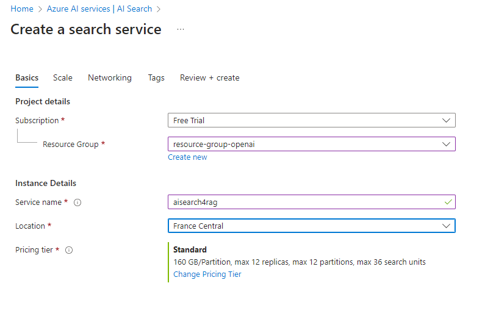

And Finally you have your instance of Azure Search  ready for RAG

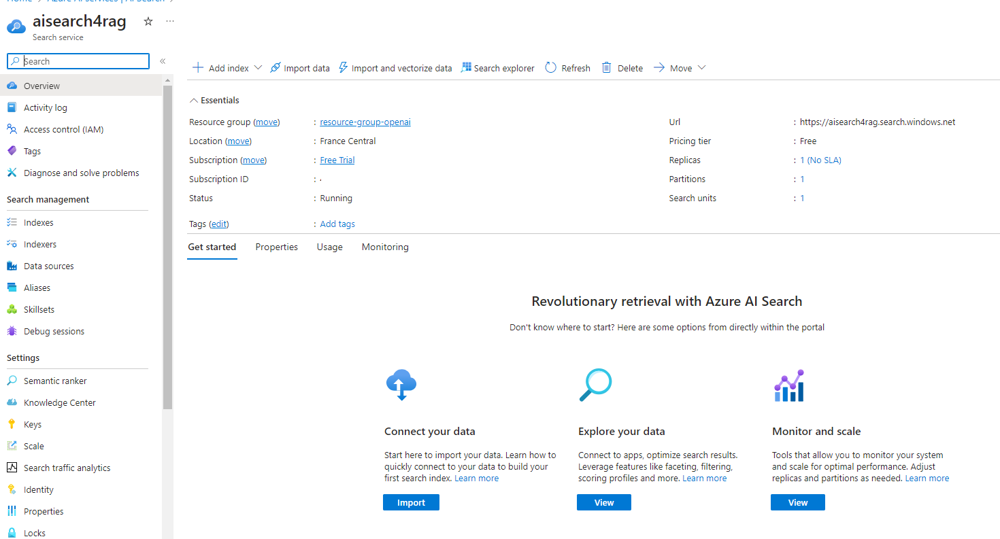

We go to azure search, we click on indexes

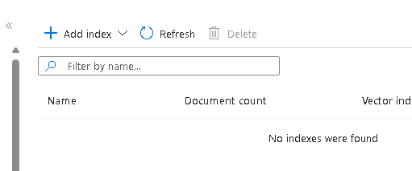

## Creation of index

In the search management click create a index


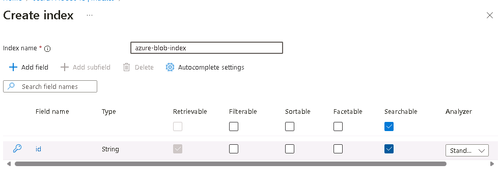

Keep that is enabled searchable.
Optionally, you can  add the index by using the json file [here](https://github.com/ruslanmv/Develop-generative-AI-solutions-with-Azure-OpenAI/blob/main/index.json)
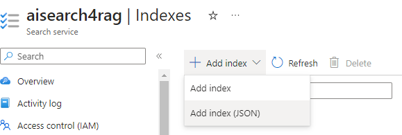
with their respective url.
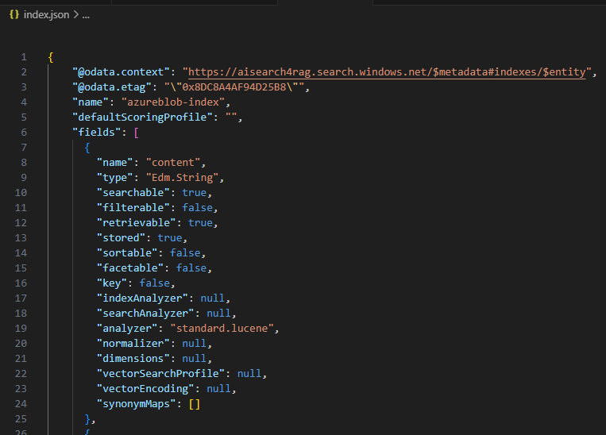

### Adding Indexer

In this part we should click on indexers and click in add indexer then we choose a  name like `azure-blob-indexer`
the index `azure-blob-index` and the datasource the blob `storage4rag`
and we click save and then run.
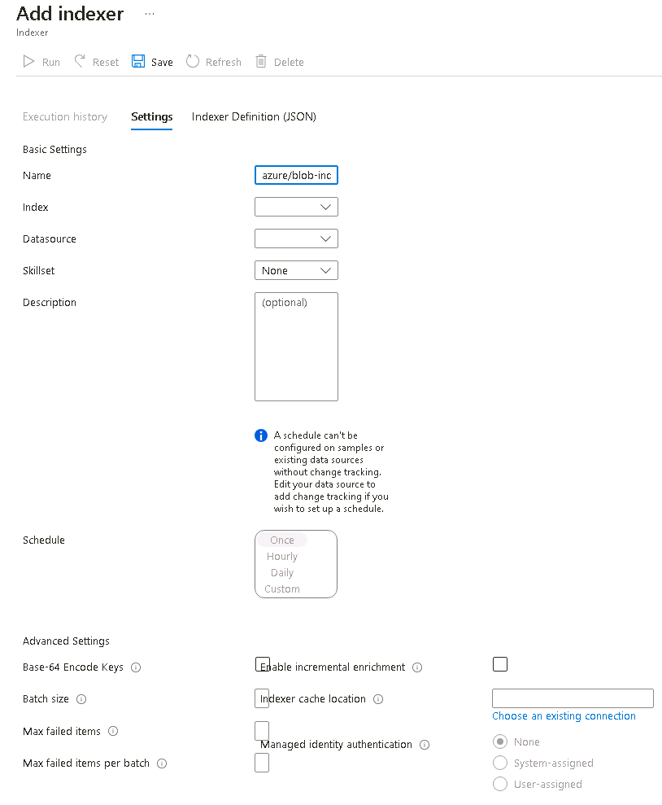

and wait until success.
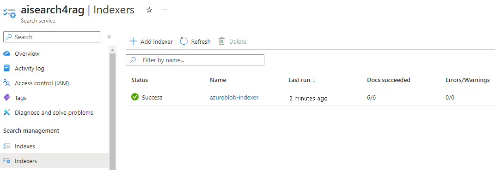


### Using Company Data for Travel Recommendations

To complete the .env file we requiere add additional credentials to our enviroment. For different tasks.

1. **Obtaining the Azure Search API Key:**

   - Log in to the Azure portal [https://portal.azure.com](https://portal.azure.com).
   - Navigate to your Azure Search resource. In this case, it's the `aisearch4rag` resource.
   - Once you're in the Azure Search resource, go to the "Keys" section. You can find this in the left-hand menu under "Settings."
   - In the "Keys" section, you'll see two keys: a primary key and a secondary key. Either key will work, but it's recommended to use the primary key.
   - Copy the primary key. This is your `search_api_key`.
     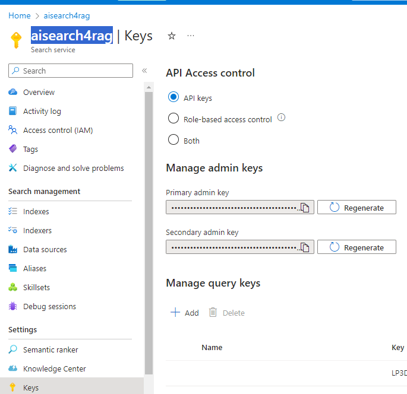

2. **Obtaining the Blob Storage Connection String:**

   - Log in to the Azure portal [https://portal.azure.com](https://portal.azure.com).
   - Navigate to your Azure Storage account. .
   - Once you're in the Storage account, go to the "Access keys" section. You can find this in the left-hand menu under "Settings."
   - In the "Access keys" section, you'll see two keys: a key1 and a key2. Again, either key will work, but it's recommended to use key1.
   - Copy the "Connection string" under key1. This is your `blob_storage_connection_string`.
     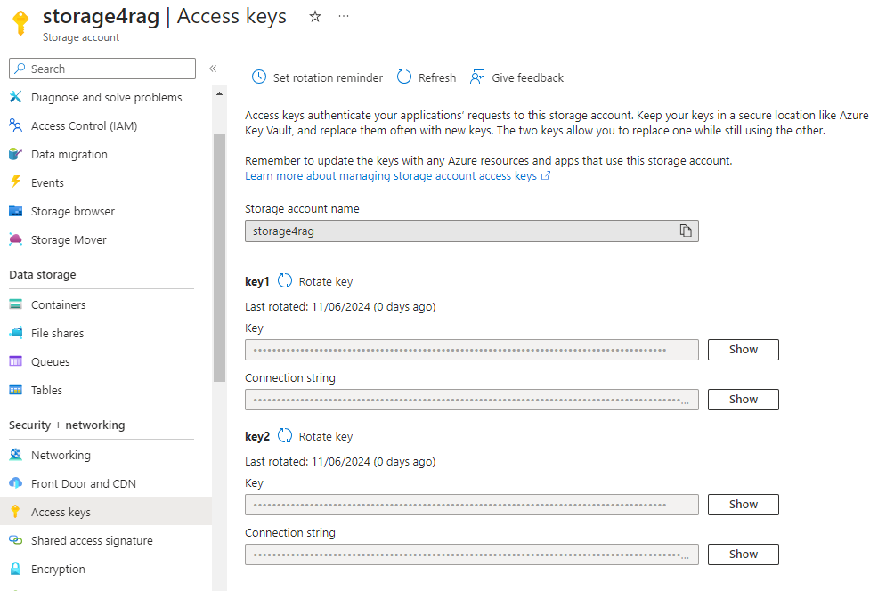

After obtaining both the `search_api_key` and the `blob_storage_connection_string`, you can replace the placeholders in the code with these values. 
This ensures that your Python application can authenticate and access the Azure Search service and Blob Storage container.


## Testing your envioment

Now that you've added your data, ask the same questions as you did previously, and see how the response differs.

1. Wait until your search resource has been deployed and add the .env file their respecitive credentials.

```
AZURE_OAI_ENDPOINT=
AZURE_OAI_KEY=
AZURE_OAI_MODEL=
AZURE_SEARCH_ENDPOINT=
AZURE_SEARCH_KEY=
AZURE_SEARCH_INDEX=
```

Now lets check with the folowing example if work the setup

## Example 3

```python
import os
from openai import AzureOpenAI
from dotenv import load_dotenv
load_dotenv()
# Set environment variables
azure_oai_endpoint = os.getenv("AZURE_OAI_ENDPOINT") 
azure_oai_deployment = "gpt-35-turbo-16k"
azure_oai_key = os.getenv("AZURE_OAI_KEY")

azure_search_endpoint = os.getenv("AZURE_SEARCH_ENDPOINT")
azure_search_key = os.getenv("AZURE_SEARCH_KEY")
azure_search_index = os.getenv("AZURE_SEARCH_INDEX")

# Create AzureOpenAI client
client = AzureOpenAI(base_url=f"{azure_oai_endpoint}/openai/deployments/{azure_oai_deployment}/extensions",
                     #azure_endpoint=azure_oai_endpoint, 
                     api_key=azure_oai_key, 
                     api_version="2023-12-01-preview")

# Get the prompt
text ="I'd like to take a trip to New York. Where should I stay?"
print("...Sending the following request to Azure OpenAI endpoint...")
print("Request: " + text + "\n")

    # Configure your data source
extension_config = dict(dataSources = [  
    { 
        "type": "AzureCognitiveSearch", 
        "parameters": { 
            "endpoint":azure_search_endpoint, 
            "key": azure_search_key, 
            "indexName": azure_search_index,
        }
    }]
)

response = client.chat.completions.create(
    model = azure_oai_deployment,
    temperature = 0.5,
    max_tokens = 1000,
    messages = [
        {"role": "system", "content": "You are a helpful travel agent"},
        {"role": "user", "content": text}
    ],
    extra_body = extension_config
)
# Print the response from the AI model
print(response.choices[0].message.content)
```

Output


```
...Sending the following request to Azure OpenAI endpoint...
Request: I'd like to take a trip to New York. Where should I stay?

You have several options for accommodation in New York City. Margie's Travel offers the following hotels in New York:

1. The Manhattan Hotel: Located in the heart of New York City, within an easy walk to Times Square and Broadway [doc1].
2. The Grand Central Hotel: A comfortable mid-town hotel close to Grand Central Station, the Chrysler Building, and the Empire State Building [doc1].
3. The Park Hotel: Luxurious accommodation in upper Manhattan, with views of Central Park [doc1].

To book your trip to New York, you can visit the Margie's Travel website at www.margiestravel.com [doc1].
```

Now that it works we can just create a prompt4.txt

```
I'd like to take a trip to New York. Where should I stay?
```

Here is the completed Python code based on the requests:


```python
import os
from openai import AzureOpenAI
from dotenv import load_dotenv
load_dotenv()
# Set environment variables
azure_oai_endpoint = os.getenv("AZURE_OAI_ENDPOINT") 
azure_oai_deployment = "gpt-35-turbo-16k"
azure_oai_key = os.getenv("AZURE_OAI_KEY")

azure_search_endpoint = os.getenv("AZURE_SEARCH_ENDPOINT")
azure_search_key = os.getenv("AZURE_SEARCH_KEY")
azure_search_index = os.getenv("AZURE_SEARCH_INDEX")


# Task 4: Use company data
def function4(aiClient, aiModel):

    # Create AzureOpenAI client RAG
    aiClient = AzureOpenAI(base_url=f"{azure_oai_endpoint}/openai/deployments/{azure_oai_deployment}/extensions",
                        #azure_endpoint=azure_oai_endpoint, 
                        api_key=azure_oai_key, 
                        api_version="2023-12-01-preview")

    inputText = utils.getPromptInput("Task 4: Use company data", "prompt4.txt")
    
    # Get the prompt

    print("...Sending the following request to Azure OpenAI endpoint...")
    print("Request: " + inputText + "\n")

    # Configure your data source
    extension_config = dict(dataSources = [  
        { 
            "type": "AzureCognitiveSearch", 
            "parameters": { 
                "endpoint":azure_search_endpoint, 
                "key": azure_search_key, 
                "indexName": azure_search_index,
            }
        }]
    )

    # Build messages to send to Azure OpenAI model.    
    messages=[
        {"role": "system", "content": "You are a helpful travel agent"},
        {"role": "user", "content": inputText}
    ]

    # Define connection and argument list 

    # Define argument list
    apiParams = {
        "model": aiModel,
        "messages": messages,
        "temperature": 0.5,  # Set temperature to 0.5
        "max_tokens": 1000, # Set max tokens to 1000
        "extra_body":extension_config #RAG wit Azure Search
    }
    utils.writeLog("API Parameters:\n", apiParams)

    # Call chat completion connection. Will be the same as function1 
    # Use the call name and **apiParams to reference our argument list
    # Call chat completion connection.
    response = aiClient.chat.completions.create(**apiParams)
    utils.writeLog("Response:\n", str(response))
    print("Response: " + response.choices[0].message.content + "\n")
    return
# Call the main function with function2 as an argument
main(function4) 
```

Output:

```
Would you like to type a prompt or text in file prompt4.txt? (type/file)
...Reading text from prompt4.txt...


...Sending the following request to Azure OpenAI...
Request: I'd like to take a trip to New York. Where should I stay?

...Sending the following request to Azure OpenAI endpoint...
Request: I'd like to take a trip to New York. Where should I stay?

Response: You have several accommodation options in New York provided by Margie's Travel [doc1]. Here are some options for you to consider:

1. The Manhattan Hotel: Stay in the heart of New York City, within an easy walk to Times Square and Broadway [doc1].
2. The Grand Central Hotel: Enjoy a comfortable stay in mid-town, close to Grand Central Station, the Chrysler Building, and the Empire State Building [doc1].
3. The Park Hotel: Experience luxurious accommodation in upper Manhattan with views of Central Park [doc1].

To book your trip to New York, you can visit Margie's Travel website at www.margiestravel.com [doc1].
```


If you liked, you can download the notebook [here](https://github.com/ruslanmv/Develop-generative-AI-solutions-with-Azure-OpenAI/blob/main/notebook.ipynb).

## Troobleshootings

### Updating Anaconda fails: Environment Not Writable Error

On Windows, search for Anaconda PowerShell Prompt.
Right click the program and select Run as administrator.
In the command prompt, execute the following command:

```bash
conda update -n base -c defaults conda
```

Your Anaconda should now update without admin related errors.

### Removing Conda environment

After making sure your environment is not active, type:

```
conda remove --name azure --all
```


**Congratulations!** You could learn how to:  

-  Generate and improve code by using Azure OpenAI
-  Deploy an Azure OpenAI resource and an Azure OpenAI model
-  Apply prompt engineering techniques by using Azure OpenAI
-  Use Azure OpenAI on your data
-  Generate natural language responses by using Azure OpenAI