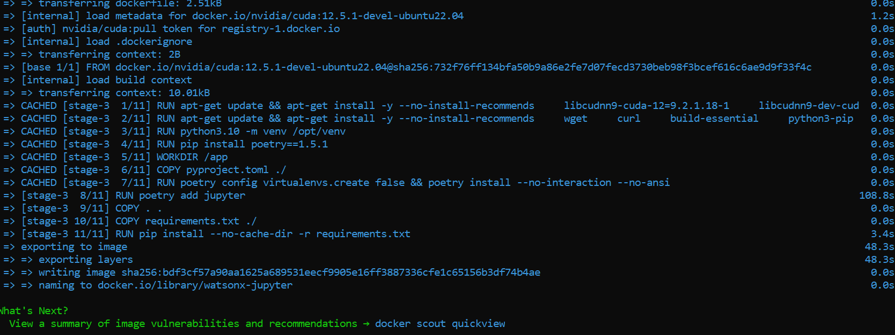
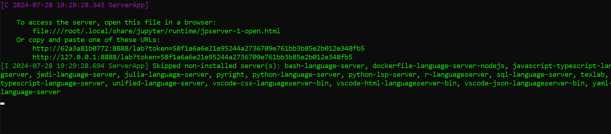
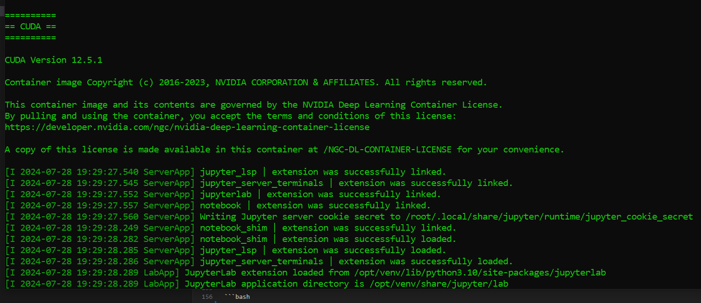
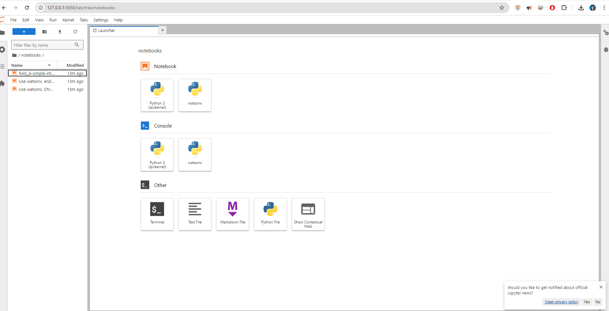
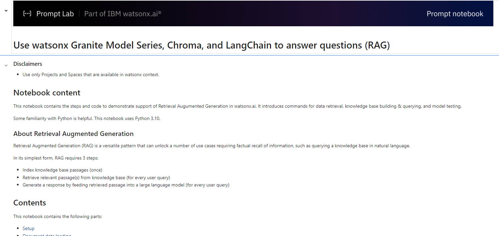
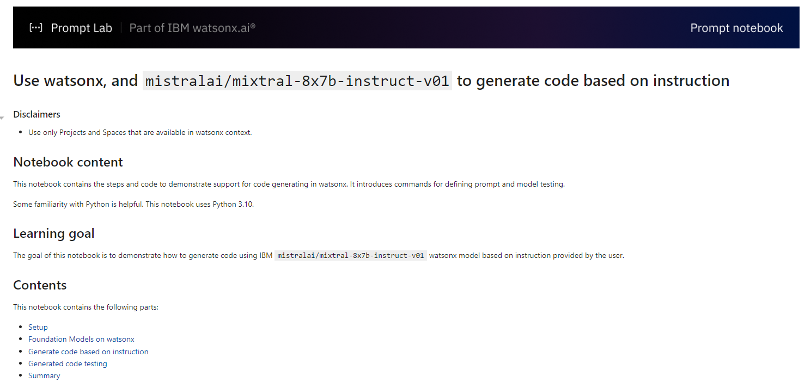
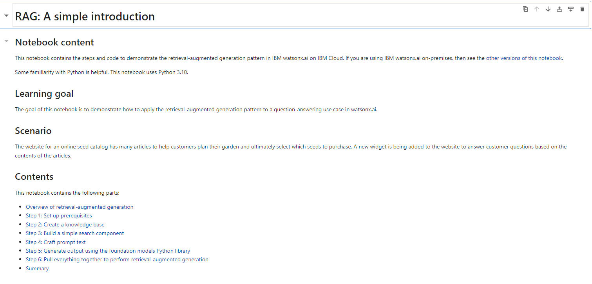

### Introduction

In this blog post, we will walk you through the process of creating a Docker container that is compatible with IBM Watsonx.ai, Langchain, and Jupyter Notebook, all while ensuring CUDA compatibility for GPU acceleration. This setup is perfect for those who need a powerful environment for AI and machine learning RAG tasks and pipelines automatizations.


If you want to run Jupyter notebook with Langchain and WatsonX packages loaded ready for RAG, ss you can just type


```
docker pull ruslanmv/watsonx-jupyter:latest
```

and then

```
docker run --gpus all -it --rm -p 8888:8888 watsonx-jupyter
```

Let explain how was  build this Docker container.


### Prerequisites

Before we begin, make sure you have the following installed on your system:

- Docker
- NVIDIA Docker support for GPU usage (optional)

### Dockerfile Explained

Below is the Dockerfile we will use to build our Docker image. It includes best practices, CUDA compatibility, and the installation of JupyterLab.

```Dockerfile
# ARG for the base image
ARG IMAGE_NAME=nvidia/cuda

# Base Image
FROM ${IMAGE_NAME}:12.5.1-devel-ubuntu22.04 as base

# Different stages for different architectures
FROM base as base-amd64

ENV NV_CUDNN_VERSION 9.2.1.18-1
ENV NV_CUDNN_PACKAGE_NAME libcudnn9-cuda-12
ENV NV_CUDNN_PACKAGE libcudnn9-cuda-12=${NV_CUDNN_VERSION}
ENV NV_CUDNN_PACKAGE_DEV libcudnn9-dev-cuda-12=${NV_CUDNN_VERSION}

FROM base as base-arm64

ENV NV_CUDNN_VERSION 9.2.1.18-1
ENV NV_CUDNN_PACKAGE_NAME libcudnn9-cuda-12
ENV NV_CUDNN_PACKAGE libcudnn9-cuda-12=${NV_CUDNN_VERSION}
ENV NV_CUDNN_PACKAGE_DEV libcudnn9-dev-cuda-12=${NV_CUDNN_VERSION}

# Using the appropriate base based on architecture
FROM base-${TARGETARCH}

ARG TARGETARCH

LABEL maintainer="NVIDIA CORPORATION <cudatools@nvidia.com>"
LABEL com.nvidia.cudnn.version="${NV_CUDNN_VERSION}"

# Install cuDNN
RUN apt-get update && apt-get install -y --no-install-recommends \
    ${NV_CUDNN_PACKAGE} \
    ${NV_CUDNN_PACKAGE_DEV} \
    && apt-mark hold ${NV_CUDNN_PACKAGE_NAME} \
    && rm -rf /var/lib/apt/lists/*

# Environment Variables
ENV DEBIAN_FRONTEND=noninteractive
ENV LANG=C.UTF-8
ENV LC_ALL=C.UTF-8
ENV POETRY_VERSION=1.5.1
ENV PIP_DISABLE_PIP_VERSION_CHECK=on

# System Updates and Essential Packages
RUN apt-get update && apt-get install -y --no-install-recommends \
    wget \
    curl \
    build-essential \
    python3-pip \
    python3.10 \
    python3.10-venv \
    python3-dev \
    nodejs \
    npm \
    libgl1-mesa-glx \
    libglib2.0-0 \
    git \
    && rm -rf /var/lib/apt/lists/*

# Create a Python virtual environment 
RUN python3.10 -m venv /opt/venv
ENV PATH="/opt/venv/bin:$PATH"

# Install Poetry (Using pip in the virtual environment)
RUN pip install poetry==${POETRY_VERSION}

# Set working director
WORKDIR /app

# Copy project files
COPY pyproject.toml ./

# Install Project Dependencies (Avoid creating a separate virtualenv)
RUN poetry config virtualenvs.create false && poetry install --no-interaction --no-ansi 

# Install JupyterLab and Elyra using Poetry
RUN poetry add jupyterlab

# Activate the Poetry environment (You can put this in a separate script)
#RUN poetry shell

# Copy Project Files
COPY . .

# Install additional Python packages using requirements.txt
COPY requirements.txt ./
RUN pip install --no-cache-dir -r requirements.txt

# Setup JupyterLab kernel
RUN python -m ipykernel install --user --name=watsonx

# Expose JupyterLab Port
EXPOSE 8888

# Start JupyterLab with Elyra on container launch
CMD ["jupyter", "lab", "--ip=0.0.0.0", "--port=8888", "--allow-root"]

```

### pyproject.toml

Here is the `pyproject.toml` file based on the packages you specified:

```
[tool.poetry]
name = "watsonx-container"
version = "0.1.0"
description = ""
authors = ["Ruslan Magana Vsevolodovna <contact@ruslanmv.com>"]
license = "MIT"

[tool.poetry.dependencies]
python = "^3.10"
ipykernel = "^6.29.5"
python-dotenv = "^1.0.1"
pandas = "^2.1.4"
langchain = "^0.2.6"
langchain-openai = "^0.1.14"
langchain-core = "^0.2.11"
langchain-ibm = "^0.1.8"
langchain-community = "^0.2.6"
ibm-watson-machine-learning = "^1.0.359"
azure-search-documents = "^11.4.0"
azure-core = "^1.30.2"
azure-storage-blob = "^12.20.0"
sentence-transformers = "^3.0.1"
openai = "^1.32.0"
chromadb = "0.5.3"
pydantic = "^2.8.0"
gradio = "^4.37.2"
lxml = "^5.2.2"
camelot-py = "^0.11.0"
opencv-python = "^4.10.0.84"
ghostscript = "^0.7"
pdfminer-six = "^20240706"

[build-system]
requires = ["poetry-core>=1.0.0"]
build-backend = "poetry.core.masonry.api"

```

if you want install additional packages with pip also you can use 

create a requirements.txt, if not just create the empty file.


### Building the Docker Image

To build the Docker image, run the following command in the directory containing your Dockerfile:

```bash
docker build -t watsonx-jupyter .
```


and we got


### Running the Docker Container

To run the Docker container and expose JupyterLab, use the following command:

```bash
docker run --gpus all -it --rm -p 8888:8888 watsonx-jupyter

```


The `--gpus all` flag ensures that the container can leverage your GPU for CUDA processing.

If we want to push this image for example  given the account name ruslanmv

```bash
docker tag watsonx-jupyter ruslanmv/watsonx-jupyter:latest
docker push ruslanmv/watsonx-jupyter:latest
```

After running these commands, your Docker image will be available in your Docker Hub repository under the name exampleuser/watsonx-jupyter, and you can pull it on any machine using:

```bash
docker pull ruslanmv/watsonx-jupyter:latest
```


# Examples

In the notebook folder,


 you can find different examples.

## Use watsonx Granite Model Series, Chroma, and LangChain to answer questions (RAG)

Like this.


[](https://github.com/ruslanmv/watsonx-docker-container/blob/master/notebooks/Use%20watsonx%2C%20Chroma%2C%20and%20LangChain%20to%20answer%20questions%20(RAG).ipynb)


## Use watsonx, and `mistralai/mixtral-8x7b-instruct-v01` to generate code based on instruction

[](https://github.com/ruslanmv/watsonx-docker-container/blob/master/notebooks/Use%20watsonx%2C%20and%20mixtral_8x7b_instruct_v01_q%20to%20generate%20code%20based%20on%20instruction.ipynb)


##  RAG: A simple introduction

[](https://github.com/ruslanmv/watsonx-docker-container/blob/master/notebooks/RAG_A-simple-introduction.ipynb)


### 

**Congratulations!** By following these steps, you will have a Docker container that is set up with IBM Watsonx.ai, Langchain, and Jupyter Notebook, all compatible with CUDA for GPU acceleration. This powerful environment will enable you to perform advanced AI and machine learning tasks efficiently.

Happy coding!

