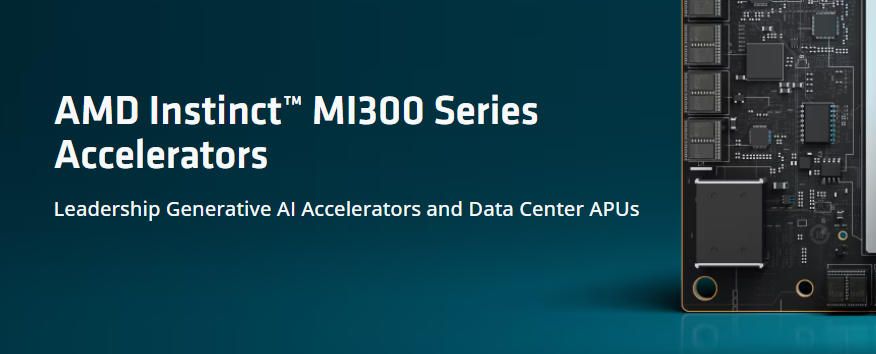

With the growing importance of generative AI and large language models, having access to **high-performance GPU accelerators** is critical for model inference. Traditionally, **NVIDIA’s CUDA** ecosystem has dominated the AI landscape. However, **AMD’s ROCm** (Radeon Open Compute) platform provides a strong alternative for AMD GPUs, including the cutting-edge AMD Instinct MI300X accelerators.



​														Photo by [AMD](https://www.amd.com/en/products/accelerators/instinct/mi300.html) 

In this blog, we will explore how to set up AMD GPUs for inference with Hugging Face models, covering driver installation, software setup, and how to execute model inference.

---

## **Step 1: Understanding AMD ROCm – The Equivalent of CUDA**

AMD ROCm (Radeon Open Compute) is an open software platform for GPU computing that provides tools for running AI workloads. Similar to NVIDIA's CUDA, ROCm enables deep learning frameworks and libraries to utilize AMD GPUs for training and inference.

Key components:

- **HIP (Heterogeneous-compute Interface for Portability):** A runtime and kernel compilation API for writing GPU programs that can run on AMD and NVIDIA GPUs.
- **miopen (AMD's Deep Learning Library):** Equivalent to cuDNN, it optimizes deep learning operations on AMD GPUs.
- **rocBLAS:** A GPU-accelerated library for matrix operations, similar to cuBLAS.

---

## **Step 2: Specifications of AMD Instinct MI300X**

The IBM-AMD collaboration introduces the MI300X accelerator with significant advancements tailored for generative AI and HPC applications:

- **192GB HBM3 Memory:** Handles large models efficiently.
- **Support for ROCm Software Stack:** Compatible with frameworks like PyTorch and TensorFlow.
- **Optimized for IBM watsonx AI and Red Hat OpenShift AI Platforms.**

This guide focuses on using these GPUs for Hugging Face model inference.

---

## **Step 3: Installing AMD ROCm Drivers**

Follow these steps to install AMD ROCm drivers and configure the environment for AMD GPU inference.

### **1. Check GPU Compatibility**

Ensure your server supports AMD ROCm. For MI300X accelerators, ROCm 5.x or later is required.

- Run the following command to check your GPU:

  ```bash
  lspci | grep -i vga
  ```

  Look for entries like `Advanced Micro Devices (AMD)`.

### **2. Add ROCm Repository**

AMD provides ROCm packages for Ubuntu and RHEL-based distributions.

For **Ubuntu**:

```bash
wget -qO - http://repo.radeon.com/rocm/rocm.gpg.key | sudo apt-key add -
echo 'deb [arch=amd64] http://repo.radeon.com/rocm/apt/5.x/ ubuntu main' | sudo tee /etc/apt/sources.list.d/rocm.list
sudo apt update
```

### **3. Install ROCm Software**

Install the ROCm platform and required libraries:

```bash
sudo apt install rocm-dev rocm-libs miopen-hip
```

### **4. Verify Installation**

- Check if ROCm is correctly installed:

  ```bash
  /opt/rocm/bin/rocminfo
  ```

- Ensure your AMD GPU is visible:

  ```bash
  /opt/rocm/opencl/bin/clinfo
  ```

---

## **Step 4: Installing PyTorch with ROCm Support**

Hugging Face models rely on PyTorch or TensorFlow as the backend. PyTorch natively supports ROCm.

1. **Install PyTorch for ROCm:**

   ```bash
   pip install torch torchvision torchaudio --index-url https://download.pytorch.org/whl/rocm5.4.2
   ```

2. **Test GPU Availability:**

   ```python
   import torch
   print(torch.cuda.is_available())  # Should print True for AMD GPUs
   ```

---

## **Step 5: Loading Hugging Face Models for Inference**

1. **Install Hugging Face Transformers:**

   ```bash
   pip install transformers
   ```

2. **Load the Model for GPU Inference:**
   Use the `device` argument to specify the ROCm-compatible GPU.

   ```python
   from transformers import AutoModelForCausalLM, AutoTokenizer
   
   model_name = "meta-llama/Llama-2-7b-hf"
   tokenizer = AutoTokenizer.from_pretrained(model_name)
   model = AutoModelForCausalLM.from_pretrained(model_name).to("cuda")
   
   # Inference
   inputs = tokenizer("Hello, how are you?", return_tensors="pt").to("cuda")
   outputs = model.generate(**inputs)
   print(tokenizer.decode(outputs[0]))
   ```

---

## **Step 6: Troubleshooting Common Issues**

- **Issue: GPU Not Recognized**

  - Ensure ROCm drivers are correctly installed.

  - Check if the GPU is visible:

    ```bash
    rocminfo
    ```

- **Issue: PyTorch Fails to Detect GPU**

  - Ensure the correct PyTorch version with ROCm support is installed.

  - Verify installation with:

    ```bash
    python -m torch.utils.collect_env
    ```

- **Issue: Slow Performance**

  - Use optimized batch sizes and enable mixed precision:

    ```python
    from torch.cuda.amp import autocast
    
    with autocast():
        outputs = model.generate(**inputs)
    ```

---

## **Step 7: Next Steps**

IBM Cloud's upcoming deployment of AMD Instinct MI300X accelerators opens new opportunities to scale generative AI workloads efficiently. By leveraging ROCm and AMD GPUs, you can significantly reduce costs and boost performance for Hugging Face models.

Stay tuned for updates on IBM Cloud’s support for MI300X accelerators and how to integrate them into your AI workflows.

---

**References:**

- [AMD ROCm Documentation](https://rocm.docs.amd.com/)
- [Hugging Face Transformers](https://huggingface.co/transformers/)
- [PyTorch ROCm Support](https://pytorch.org/get-started/locally/)

Enjoy building your generative AI models on AMD-powered infrastructure!