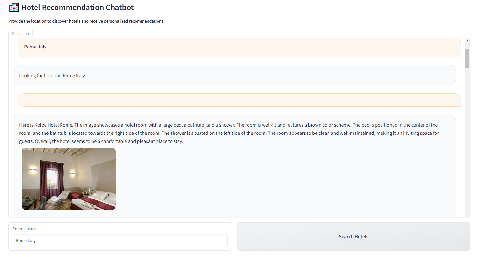
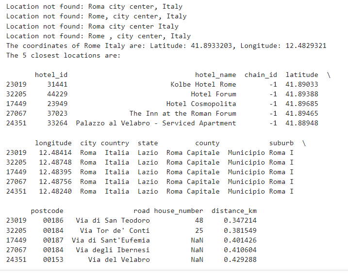
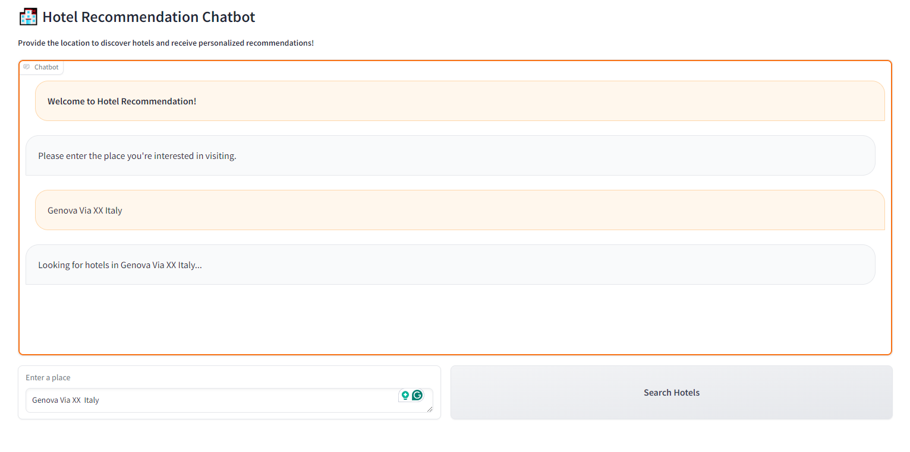
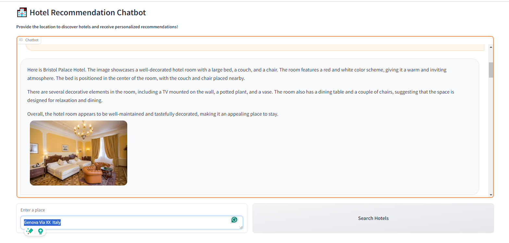
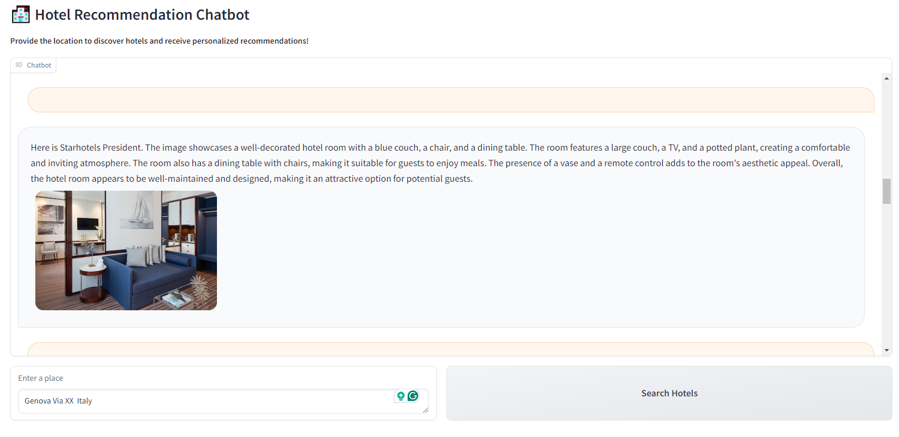
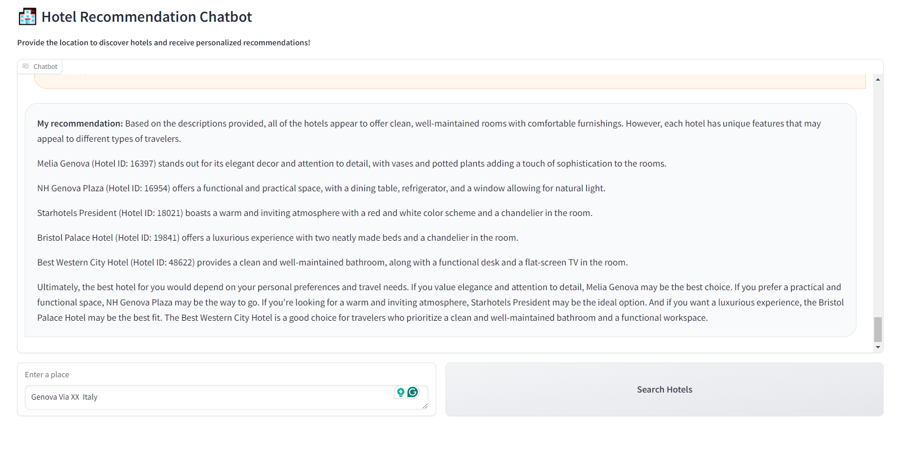
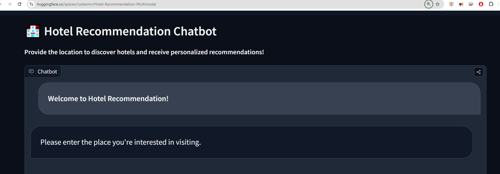

Hello everyone, today we are going to explain how to Create a Hybrid Chatbot by Integrating Multimodal Systems with Large Language Models.


## Contents

1. Introduction
2. Understanding Multimodal Systems
3. Differences Between Multimodal Systems and Conventional LLMs
4. Project Overview: Building the Hotel Recommendation Chatbot
5. Explanation of Each Function in the Code
6. Front-End Application Implementation
7. Conclusion
8. Summary

## 1. Introduction

In the modern world, chatbots are becoming increasingly sophisticated, thanks to advancements in machine learning and artificial intelligence. By leveraging large language models (LLMs) and multimodal capabilities, we can create hybrid chatbots that not only understand text but also analyze images, audio, and more. In this blog post, we will guide you through building a hybrid chatbot that provides hotel recommendations. This chatbot will utilize both LLMs and multimodal processing to deliver rich and informative responses, enhancing the user experience.

[](./../assets/images/posts/2024-08-13-Hybrid-Chatbot-with-Multimodal-and-LLM/2024-08-14-15-36-37.png)


## 2. Understanding Multimodal Systems

A multimodal system is a type of AI that can process and generate data across multiple modalities, such as text, images, audio, and video. Unlike traditional models that are limited to one form of data (e.g., text-only or image-only), multimodal systems can understand and synthesize information from different sources. This makes them particularly powerful for applications that require a more holistic understanding of the world, such as visual question answering, image captioning, and in our case, hotel recommendations.

## 3. Differences Between Multimodal Systems and Conventional LLMs

### Multimodal Systems

- **Data Inputs:** Can process multiple forms of data, such as images, text, and even audio.
- **Output:** Provides richer responses that may include text descriptions, analyzed images, or synthesized audio responses.
- **Applications:** Useful in areas like image captioning, visual question answering, and any task requiring multi-sensory input.

### Conventional LLMs

- **Data Inputs:** Primarily processes text data.
- **Output:** Generates text-based responses.
- **Applications:** Ideal for text generation, translation, summarization, and conversational agents.

In our project, the combination of these two approaches allows us to create a more dynamic and contextually aware chatbot.

## 4. Project Overview: Building the Hotel Recommendation Chatbot

We will build a hybrid chatbot that, when given a place, finds the nearest hotels and analyzes their images using multimodal processing. It will then append the results and analyze them using a conventional LLM. The end goal is to provide users with hotel recommendations based on both the proximity to the location and the visual appeal of the hotel, as analyzed by our multimodal system.

### Project Structure:

- **Multimodal Analysis:** Analyze hotel images to assess their quality and appeal.
- **LLM Integration:** Use a text-based LLM to generate recommendations based on the analyzed data.
- **Frontend Application:** Create a simple and user-friendly interface for users to interact with the chatbot.

## Setup environment

For this project we will use python 3.10, then we install the following packages.

```
pip install --upgrade -q accelerate bitsandbytes gradio
pip install git+https://github.com/huggingface/transformers.git
pip install datasets gradio_multimodalchatbot haversine langchain geopy
```

or simply

```
pip install -r requirements.txt
```


## 5. Explanation of Each Function in the Code

### Importing Libraries

```python
import gradio as gr
from gradio_multimodalchatbot import MultimodalChatbot
from gradio.data_classes import FileData
import os
import pandas as pd
import requests
from PIL import Image, UnidentifiedImageError
from io import BytesIO
import matplotlib.pyplot as plt
import urllib3
from transformers import pipeline
from transformers import BitsAndBytesConfig
import torch
import textwrap
import pandas as pd
import numpy as np
from haversine import haversine  # Install haversine library: pip install haversine
from transformers import AutoProcessor, LlavaForConditionalGeneration
from transformers import BitsAndBytesConfig
import torch
from huggingface_hub import InferenceClient
from transformers import AutoTokenizer
from transformers import AutoImageProcessor
from datasets import load_dataset
from geopy.geocoders import Nominatim
import pyarrow
```

These imports include libraries for handling image processing, geolocation, data handling, and model inference.

### Setting Up the Environment

```python
DEVICE = "cuda" if torch.cuda.is_available() else "cpu"
LOW_MEMORY = os.getenv("LOW_MEMORY", "0") == "1"
MODEL_ID = "llava-hf/llava-1.5-7b-hf"
TEXT_MODEL_ID = "mistralai/Mistral-7B-Instruct-v0.2"
```

This section sets up the device and model IDs, ensuring that the code runs efficiently.

### Loading the Models

```python
# Quantization configuration for efficient model loading
# Define BitsAndBytesConfig
quantization_config = BitsAndBytesConfig(
    load_in_4bit=True,
    bnb_4bit_compute_dtype=torch.float16
)

# Load the tokenizer associated with your 'MODEL_ID'
tokenizer_image_to_text = AutoTokenizer.from_pretrained(MODEL_ID)
# Load the image processor associated with your 'MODEL_ID'
image_processor = AutoImageProcessor.from_pretrained(MODEL_ID)
# Load models only once
processor = AutoProcessor.from_pretrained(MODEL_ID)
model = LlavaForConditionalGeneration.from_pretrained(MODEL_ID, quantization_config=quantization_config, device_map="auto")
# Pass the tokenizer, image processor explicitly to the pipeline
pipe_image_to_text = pipeline("image-to-text", model=model, tokenizer=tokenizer_image_to_text, image_processor=image_processor, model_kwargs={"quantization_config": quantization_config})
# Initialize the text generation pipeline

pipe_text = pipeline(
    "text-generation",
    model=TEXT_MODEL_ID,
    model_kwargs={
        "quantization_config": quantization_config,
        "use_auth_token": True  # This will use the environment variable
    }
)
# Ensure data files are available
current_directory = os.getcwd()
geocoded_hotels_path = os.path.join(current_directory, 'geocoded_hotels.csv')
csv_file_path = os.path.join(current_directory, 'hotel_multimodal.csv')

# Load geocoded hotels data
if not os.path.isfile(geocoded_hotels_path):
    url = 'https://github.com/ruslanmv/watsonx-with-multimodal-llava/raw/master/geocoded_hotels.csv'
    response = requests.get(url)
    if response.status_code == 200:
        with open(geocoded_hotels_path, 'wb') as f:
            f.write(response.content)
        print(f"File {geocoded_hotels_path} downloaded successfully!")
    else:
        print(f"Error downloading file. Status code: {response.status_code}")
else:
    print(f"File {geocoded_hotels_path} already exists.")
geocoded_hotels = pd.read_csv(geocoded_hotels_path)

# Load hotel dataset
if not os.path.exists(csv_file_path):
    dataset = load_dataset("ruslanmv/hotel-multimodal")
    df_hotels = dataset['train'].to_pandas()
    df_hotels.to_csv(csv_file_path, index=False)
    print("Dataset downloaded and saved as CSV.")
else:
    df_hotels = pd.read_csv(csv_file_path)

```

Here, we initialize the models and pipelines necessary for multimodal processing and text generation.

### Handling Geolocation

```python
def get_current_location():
    try:
        response = requests.get('https://ipinfo.io/json')
        data = response.json()
        location = data.get('loc', '')
        if location:
            return map(float, location.split(','))
        else:
            return None, None
    except Exception as e:
        print(f"An error occurred: {e}")
        return None, None

def get_coordinates(location_name):
    geolocator = Nominatim(user_agent="coordinate_finder")
    location = geolocator.geocode(location_name)
    if location:
        return location.latitude, location.longitude
    else:
        return None
```

This function gets the coordinates for a given location name using the Geopy library.

### Finding Nearby Hotels

```python
def find_nearby(place=None):
    if place:
        coordinates = get_coordinates(place)
        if coordinates:
            latitude, longitude = coordinates
            print(f"The coordinates of {place} are: Latitude: {latitude}, Longitude: {longitude}")
        else:
            print(f"Location not found: {place}")
            return None
    else:
        latitude, longitude = get_current_location()
        if not latitude or not longitude:
            print("Could not retrieve the current location.")
            return None

    geocoded_hotels['distance_km'] = geocoded_hotels.apply(
        lambda row: haversine((latitude, longitude), (row['latitude'], row['longitude'])),
        axis=1
    )

    closest_hotels = geocoded_hotels.sort_values(by='distance_km').head(5)
    print("The 5 closest locations are:\n")
    print(closest_hotels)
    return closest_hotels
```

This function finds hotels near the specified location by calculating the distance between the given location and hotel coordinates.




### Analyzing Hotel Images

```python
# Suppress InsecureRequestWarning
urllib3.disable_warnings(urllib3.exceptions.InsecureRequestWarning)

#@spaces.GPU
# Define the respond function
def search_hotel(place=None):
    df_found = find_nearby(place)
    if df_found is None:
        return pd.DataFrame()

    #df_found = df_found.head(2)  # Only last 2 hotels, to save runtime of Hugging Face ZERO GPU
    hotel_ids = df_found["hotel_id"].values.tolist()
    filtered_df = df_hotels[df_hotels['hotel_id'].isin(hotel_ids)]

    # Use .loc[] to avoid SettingWithCopyWarning
    filtered_df.loc[:, 'hotel_id'] = pd.Categorical(filtered_df['hotel_id'], categories=hotel_ids, ordered=True)
    filtered_df = filtered_df.sort_values('hotel_id').reset_index(drop=True)
    grouped_df = filtered_df.groupby('hotel_id', observed=True).head(2)
    description_data = []

    for index, row in grouped_df.iterrows():
        hotel_id = row['hotel_id']
        hotel_name = row['hotel_name']
        image_url = row['image_url']

        try:
            response = requests.get(image_url, verify=False)
            response.raise_for_status()
            img = Image.open(BytesIO(response.content))
            prompt = "USER: <image>\nAnalyze this image. Give me feedback on whether this hotel is worth visiting based on the picture. Provide a summary review.\nASSISTANT:"
            outputs = pipe_image_to_text(img, prompt=prompt, generate_kwargs={"max_new_tokens": 200})
            description = outputs[0]["generated_text"].split("\nASSISTANT:")[-1].strip()
            description_data.append({'hotel_name': hotel_name, 'hotel_id': hotel_id, 'image': img, 'description': description})
        except (requests.RequestException, UnidentifiedImageError):
            print(f"Skipping image at URL: {image_url}")

    return pd.DataFrame(description_data)


```

This function retrieves hotel images and analyzes them using the multimodal pipeline, generating descriptive summaries of the hotels.

### Generating Text-Based Recommendations

```python
def grouped_description(description_df):
    grouped_descriptions = description_df.groupby('hotel_id')['description'].apply(lambda x: ' '.join(x.astype(str))).reset_index()
    result_df = pd.merge(grouped_descriptions, description_df[['hotel_id', 'hotel_name']], on='hotel_id', how='left')
    result_df = result_df.drop_duplicates(subset='hotel_id', keep='first')
    result_df = result_df[['hotel_name', 'hotel_id', 'description']]
    return result_df

def create_prompt_result(result_df):
    prompt = ""
    for _, row in result_df.iterrows():
        hotel_name = row['hotel_name']
        hotel_id = row['hotel_id']
        description = row['description']
        prompt += f"Hotel Name: {hotel_name}\nHotel ID: {hotel_id}\nDescription: {description}\n\n"
    return prompt

def build_prompt(context_result):
    hotel_recommendation_template = """
<s>[INST] <<SYS>>
You are a helpful and informative chatbot assistant.
<</SYS>>
Based on the following hotel descriptions, recommend the best hotel:
{context_result}
[/INST]
"""
    return hotel_recommendation_template.format(context_result=context_result)
# Define the respond function
def generate_text_response(prompt):
    outputs = pipe_text(prompt, max_new_tokens=500)
    response = outputs[0]['generated_text'].split("[/INST]")[-1].strip()
    return response

def multimodal_results(description_df):
    conversation = []
    for _, row in description_df.iterrows():
        hotel_name = row['hotel_name']
        description = row['description']
        img = row['image']

        img_path = f"{hotel_name}.png"
        img.save(img_path)

        bot_msg = {
            "text": f"Here is {hotel_name}. {description}",
            "files": [{"file": FileData(path=img_path)}]
        }

        conversation.append([{"text": "", "files": []}, bot_msg])

    return conversation

def llm_results(description_df):
    result_df = grouped_description(description_df)
    context_result = create_prompt_result(result_df)
    recommendation_prompt = build_prompt(context_result)
    result = generate_text_response(recommendation_prompt)
    conversation = [[{"text": "Based on your search...", "files": []}, {"text": f"**My recommendation:** {result}", "files": []}]]
    return conversation
```

This function generates text-based recommendations by feeding the analyzed data into the LLM.

### Creating the Chatbot Conversation

```python
def chatbot_response(user_input, conversation):
    bot_initial_message = {
        "text": f"Looking for hotels in {user_input}...",
        "files": []
    }
    conversation.append([{"text": user_input, "files": []}, bot_initial_message])

    yield conversation

    description_df = search_hotel(user_input)

    if description_df is None or description_df.empty:
        error_message = {"text": f"Sorry, I couldn't find any hotels for {user_input}. Please try another location.", "files": []}
        conversation.append([{"text": user_input, "files": []}, error_message])
        yield conversation
        return  # Exit the function early

    hotel_conversation = multimodal_results(description_df)

    for message_pair in hotel_conversation:
        conversation.append(message_pair)
        yield conversation

    final_recommendation = llm_results(description_df)
    for message_pair in final_recommendation:
        conversation.append(message_pair)
        yield conversation

def initial_conversation():
    return [[
           {"text": "**Welcome to Hotel Recommendation!**", "files": []},
           {"text": "Please enter the place you're interested in visiting.", "files": []}
           ]]        
```

This function manages the overall conversation flow, combining the results from both the multimodal and LLM pipelines.

## 6. Front-End Application Implementation

We use the Gradio library to create an interactive web interface for the chatbot.

```python
with gr.Blocks() as demo:
    gr.Markdown("# 🏨 Hotel Recommendation Chatbot")
    gr.Markdown("**Provide the location to discover hotels and receive personalized recommendations!**")

    initial_conv = initial_conversation()
    chatbot = MultimodalChatbot(value=initial_conv, height=500)

    with gr.Row():
        place_input = gr.Textbox(label="Enter a place", placeholder="E.g., Paris France, Tokyo Japan, Genova Italy")
        send_btn = gr.Button("Search Hotels")

    send_btn.click(chatbot_response, inputs=[place_input, chatbot], outputs=chatbot)

demo.launch(debug=True)
```

This code sets up the front-end, allowing users to input a location and receive recommendations directly in the browser.

For example, if you type that you are looking for `Genova Via XX Italy`:

[](./../assets/images/posts/2024-08-13-Hybrid-Chatbot-with-Multimodal-and-LLM/2024-08-14-15-18-18.png)

you will obtain a list of different hotels with their photos and descriptions of the photos made by the multimodal model:

[](./../assets/images/posts/2024-08-13-Hybrid-Chatbot-with-Multimodal-and-LLM/2024-08-14-15-20-46.png)

[](./../assets/images/posts/2024-08-13-Hybrid-Chatbot-with-Multimodal-and-LLM/2024-08-14-15-22-40.png)


With the final results:

[](./../assets/images/posts/2024-08-13-Hybrid-Chatbot-with-Multimodal-and-LLM/2024-08-14-15-21-30.png)


## 7. Conclusion

In this blog post, we walked through the creation of a hybrid chatbot that utilizes both multimodal systems and LLMs to provide hotel recommendations. By integrating image analysis with text-based responses, we demonstrated how powerful and flexible modern AI systems can be. This project not only showcases the capabilities of multimodal and LLM-based systems but also provides a practical application that could be extended to various other domains, such as real estate, tourism, and e-commerce.

## 8. Summary

This blog covered the following key points:

- **Introduction:** Overview of hybrid chatbots using multimodal and LLM capabilities.
- **Multimodal Systems:** Explanation of multimodal systems and their advantages.
- **Project Overview:** Detailed walkthrough of building a hotel recommendation chatbot.
- **Code Explanation:** Step-by-step guide to the codebase used in the project.
- **Frontend Application:** Implementation of a user interface with Gradio.
- **Conclusion:** Recap of the project and its potential applications.

This project serves as a foundation for more advanced chatbot applications, merging the best of both multimodal and LLM technologies.

You can checkout the Hugging Face running app here

[](https://huggingface.co/spaces/ruslanmv/Hotel-Recommendation-Multimodal
)


or simply ran the following notebook on Google Colab [here](https://colab.research.google.com/github/ruslanmv/Hybrid-Chatbot-with-Multimodal-and-LLM/blob/master/5_Multimodal_Chat_Simple.ipynb).

**Congratulations!** You have learned how to build a simple chatbot with Multimodal Capabilities.