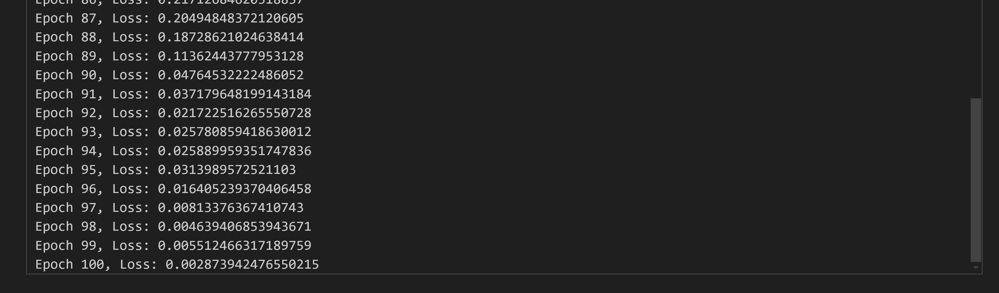
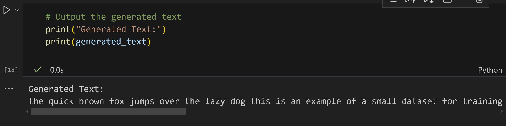
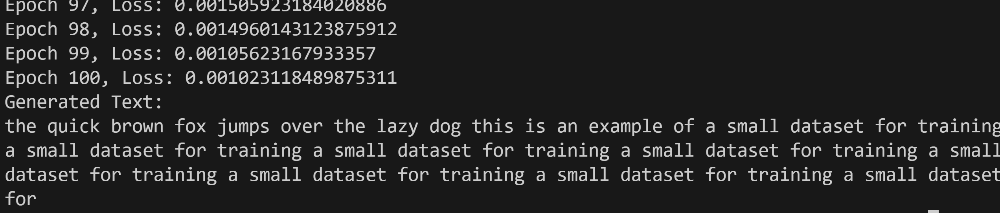
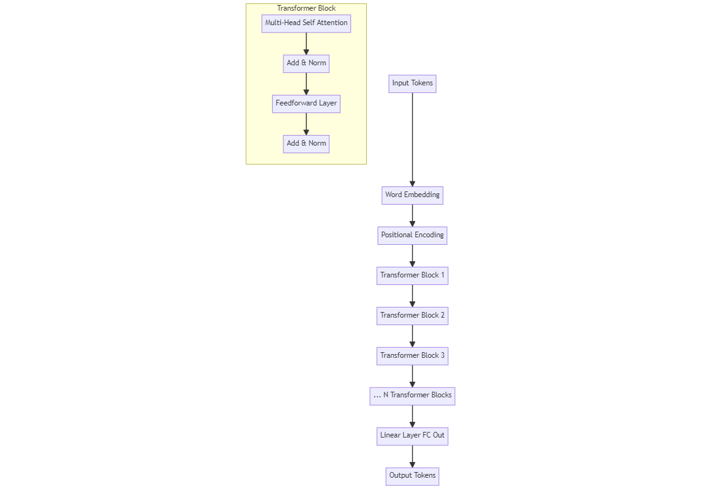

Large Language Models (LLMs) like OpenAI’s GPT (Generative Pretrained Transformer) have revolutionized natural language processing (NLP). These models are capable of generating text, answering questions, performing translations, and much more. The GPT architecture itself is based on a decoder-only Transformer, which focuses on generating text autoregressively — one token at a time, based on previous tokens.

In this blog, we’ll go through the process of building a basic Transformer model in Python from scratch, training it on a small text dataset, and implementing text generation using autoregressive decoding.

## Table of Contents

1. Introduction to Transformers and GPT
2. Setting Up the Environment
3. Building the Transformer Architecture
4. Preparing the Data
5. Training the Model
6. Implementing Text Generation Using Auto-Regressive Decoding
7. Conclusion

---

## 1. Introduction to Transformers and GPT

### Transformers

Transformers have become the de facto architecture for solving many NLP tasks. The key components of a Transformer include multi-head attention and feedforward layers. These layers allow models to handle long-range dependencies in sequences efficiently. A GPT model is a decoder-only Transformer that autoregressively predicts the next token given a sequence of previous tokens.

### GPT Architecture

GPT uses the following architecture:

- **Input Embeddings**: Converts input tokens into dense vectors.
- **Positional Encodings**: Adds information about the position of tokens since Transformers don't have a sense of order by default.
- **Decoder Blocks**: Consists of multi-head self-attention and feedforward layers.
- **Output Head**: Generates predictions for the next token.

Let’s get into building this model!


## 2. Setting Up the Environment

This guide provides step-by-step instructions for setting up the necessary environment within WSL Ubuntu to run the code presented in the accompanying blog post.

## Prerequisites

* **WSL Ubuntu:** Ensure you have WSL Ubuntu installed and running.

1. **Create a Project Directory:**

   ```bash
   cd gpt
   ```

2. **Create a Virtual Environment:**

   ```bash
   python3 -m venv .venv
   source .venv/bin/activate
   ```

3. **Install Dependencies:**

   * **Create `requirements.txt`:**

     ```bash
     echo "torch numpy" > requirements.txt 
     ```

   * **Install from `requirements.txt`:**

     ```bash
     pip install -r requirements.txt
     ```

4. **Optional: Install IPython Kernel and Jupyter Notebook:**

   * **Install Packages:**

     ```bash
     pip install ipykernel notebook
     ```

   * **Install Kernel:**

     ```bash
     python -m ipykernel install --user --name=gpt 
     ```


---

## 3. Building the Transformer Architecture

We will start by implementing the core building blocks of the GPT architecture: Multi-Head Self-Attention, Positionwise Feedforward Layers, and Positional Embeddings. We will then stack these components to form the GPT-like Transformer.

### Step 1: Import Libraries

```python
import numpy as np
import torch
import torch.nn as nn
import torch.nn.functional as F
```

### Step 2: Multi-Head Self-Attention Mechanism

Self-attention allows the model to attend to different parts of the input sequence. Multi-head attention uses several attention heads, each learning different aspects of the input sequence.

```python
class MultiHeadSelfAttention(nn.Module):
    def __init__(self, embed_size, heads):
        super(MultiHeadSelfAttention, self).__init__()
        self.embed_size = embed_size
        self.heads = heads
        self.head_dim = embed_size // heads

        assert (
            self.head_dim * heads == embed_size
        ), "Embedding size needs to be divisible by heads"

        self.values = nn.Linear(self.head_dim, embed_size, bias=False)
        self.keys = nn.Linear(self.head_dim, embed_size, bias=False)
        self.queries = nn.Linear(self.head_dim, embed_size, bias=False)
        self.fc_out = nn.Linear(embed_size, embed_size)

    def forward(self, values, keys, query, mask):
        N = query.shape[0]
        value_len, key_len, query_len = values.shape[1], keys.shape[1], query.shape[1]

        # Split the embedding into self.heads different pieces
        values = values.reshape(N, value_len, self.heads, self.head_dim)
        keys = keys.reshape(N, key_len, self.heads, self.head_dim)
        queries = query.reshape(N, query_len, self.heads, self.head_dim)

        # Scaled dot-product attention
        energy = torch.einsum("nqhd,nkhd->nhqk", [queries, keys])
        if mask is not None:
            energy = energy.masked_fill(mask == 0, float("-1e20"))
        
        attention = torch.softmax(energy / (self.embed_size ** (1 / 2)), dim=3)

        out = torch.einsum("nhql,nlhd->nqhd", [attention, values]).reshape(
            N, query_len, self.embed_size
        )

        out = self.fc_out(out)
        return out
```

### Step 3: Positional Encoding

Positional encodings are added to the input embeddings to provide the model with information about the order of tokens.

```python
#Step 3: Positional Encoding (Updated)
class PositionalEncoding(nn.Module):
    def __init__(self, embed_size, max_len=5000):
        super(PositionalEncoding, self).__init__()
        self.embed_size = embed_size
        self.max_len = max_len
        self.encoding = None  # Will be created dynamically based on the sequence length

    def get_positional_encoding(self, seq_len, device):
        if self.encoding is None or seq_len > self.encoding.size(0):
            pos = torch.arange(0, seq_len).unsqueeze(1).float()
            two_i = torch.arange(0, self.embed_size, 2).float()
            encoding = torch.zeros(seq_len, self.embed_size, device=device)
            encoding[:, 0::2] = torch.sin(pos / (10000 ** (two_i / self.embed_size)))
            encoding[:, 1::2] = torch.cos(pos / (10000 ** (two_i / self.embed_size)))
            self.encoding = encoding
        return self.encoding[:seq_len, :]

    def forward(self, x):
        seq_len = x.size(1)
        pos_enc = self.get_positional_encoding(seq_len, x.device)
        return x + pos_enc.to(x.device)

```

### Step 4: Transformer Block

A single Transformer block consists of multi-head attention followed by a feedforward network. We’ll also use layer normalization and residual connections for stability.

```python
class TransformerBlock(nn.Module):
    def __init__(self, embed_size, heads, dropout):
        super(TransformerBlock, self).__init__()
        self.attention = MultiHeadSelfAttention(embed_size, heads)
        self.norm1 = nn.LayerNorm(embed_size)
        self.norm2 = nn.LayerNorm(embed_size)
        self.feed_forward = nn.Sequential(
            nn.Linear(embed_size, embed_size * 4),
            nn.ReLU(),
            nn.Linear(embed_size * 4, embed_size),
        )
        self.dropout = nn.Dropout(dropout)

    def forward(self, value, key, query, mask):
        attention = self.attention(value, key, query, mask)
        x = self.dropout(self.norm1(attention + query))
        forward = self.feed_forward(x)
        out = self.dropout(self.norm2(forward + x))
        return out
```

### Step 5: GPT Model

Finally, we’ll stack multiple Transformer blocks to create the overall GPT architecture.

```python
class GPT(nn.Module):
    def __init__(self, vocab_size, embed_size, num_layers, heads, device, dropout, max_length):
        super(GPT, self).__init__()
        self.device = device
        self.embed_size = embed_size
        self.word_embedding = nn.Embedding(vocab_size, embed_size)
        self.position_embedding = PositionalEncoding(embed_size, max_length)
        self.layers = nn.ModuleList(
            [TransformerBlock(embed_size, heads, dropout) for _ in range(num_layers)]
        )
        self.fc_out = nn.Linear(embed_size, vocab_size)
        self.dropout = nn.Dropout(dropout)

    def forward(self, x, mask=None):
        # x is expected to be of shape (batch_size, sequence_length)
        batch_size, seq_length = x.shape
        
        # Get the word embeddings and apply positional encodings
        word_embeddings = self.word_embedding(x)  # (batch_size, sequence_length, embed_size)
        position_encodings = self.position_embedding(word_embeddings)  # Positional encoding dynamically adjusted
        
        out = self.dropout(position_encodings)

        # Pass through each Transformer block
        for layer in self.layers:
            out = layer(out, out, out, mask)

        logits = self.fc_out(out)
        return logits

```

---

## 4. Preparing the Data

We’ll now move to preparing a small text dataset for training. For simplicity, we’ll use a small corpus of text (like book chapters or articles).

### Step 1: Tokenization

We need to tokenize the text data and convert it into numerical representations that the model can understand.

```python
from collections import Counter
import re

def tokenize(text):
    tokens = re.findall(r'\w+', text.lower())
    return tokens

def build_vocab(text):
    tokens = tokenize(text)
    vocab = Counter(tokens)
    vocab = {word: idx for idx, (word, _) in enumerate(vocab.most_common())}
    return vocab

def encode(text, vocab):
    tokens = tokenize(text)
    return [vocab[token] for token in tokens if token in vocab]
```

---

## 5. Training the Model

### Step 1: Training Loop

We’ll use a cross-entropy loss function and the Adam optimizer to train the model.

```python
def train(model, data, vocab, epochs=10, lr=1e-4):
    optimizer = torch.optim.Adam(model.parameters(), lr=lr)
    criterion = nn.CrossEntropyLoss()

    model.train()
    for epoch in range(epochs):
        total_loss = 0
        for batch in data:
            inputs = batch[:, :-1].to(model.device)  # Inputs: all tokens except the last
            targets = batch[:, 1:].to(model.device)  # Targets: all tokens shifted by one position
            mask = None

            optimizer.zero_grad()
            output = model(inputs, mask)  # Forward pass
            loss = criterion(output.view(-1, output.size(-1)), targets.view(-1))  # Compute loss
            loss.backward()  # Backpropagation
            optimizer.step()  # Update weights

            total_loss += loss.item()
        print(f"Epoch {epoch + 1}, Loss: {total_loss / len(data)}")

```

### Step 2: Dummy Data for Testing

```python
text = "This is a small test dataset for GPT training."
vocab = build_vocab(text)
encoded_text = encode(text, vocab)
```

for vocab

```
{'this': 0,
 'is': 1,
 'a': 2,
 'small': 3,
 'test': 4,
 'dataset': 5,
 'for': 6,
 'gpt': 7,
 'training': 8}
```

for encoded_text

```
encoded_text
```

---

## 6. Implementing Text Generation Using Auto-Regressive Decoding

Once the model is trained, we can use it to generate text. We start with a prompt, feed it into the model, and use the model’s output to predict the next word. This process is repeated

 to generate a sequence of text.

```python
def generate_text(model, prompt, vocab, max_len=50):
    model.eval()
    words = tokenize(prompt)
    inputs = torch.tensor([vocab.get(word, 0) for word in words], dtype=torch.long).unsqueeze(0).to(model.device)  # Add batch dimension
    
    for _ in range(max_len):
        mask = None
        with torch.no_grad():
            output = model(inputs, mask)
            next_token_logits = output[0, -1, :]  # Get the logits of the last predicted token
            predicted_token = torch.argmax(next_token_logits).unsqueeze(0).unsqueeze(0)  # Add batch and sequence dimensions
            inputs = torch.cat([inputs, predicted_token], dim=1)  # Append predicted token to the input sequence
    
    decoded_sentence = ' '.join([list(vocab.keys())[i] for i in inputs[0].tolist()])
    return decoded_sentence

```

---


## 7. Example Use

In this section, we will train our GPT-like model using the dummy dataset and then use the `generate_text` function to generate text based on a prompt.

### Step 1: Training the Model

First, we’ll define a small dataset and train the model. This is a simplified training process, but it demonstrates how the model works.

```python
# Define a small dataset
text = """
The quick brown fox jumps over the lazy dog. 
This is an example of a small dataset for training a GPT model.
We are building a transformer-based architecture.
"""
vocab = build_vocab(text)
encoded_text = encode(text, vocab)

# Prepare the training data (this is token-based data)
# Here we split the text into batches of sequences
sequence_length = 10
train_data = [encoded_text[i:i + sequence_length + 1] for i in range(0, len(encoded_text) - sequence_length)]

# We need to ensure train_data is converted to tensors with batch dimensions.
train_data = [torch.tensor(seq, dtype=torch.long).unsqueeze(0) for seq in train_data]  # Adds batch dimension

# Define model hyperparameters
device = torch.device("cuda" if torch.cuda.is_available() else "cpu")
vocab_size = len(vocab)
embed_size = 128
num_layers = 2
heads = 8
dropout = 0.1
max_length = 50

# Instantiate the model
model = GPT(vocab_size, embed_size, num_layers, heads, device, dropout, max_length).to(device)


```


and finally we can train the model with

```python
# Training the model on small text dataset
train(model, train_data, vocab, epochs=100, lr=0.001)

```



### Step 2: Generating Text with a Prompt

Once the model is trained, we can use it to generate text based on a given prompt. The `generate_text` function takes in a prompt, generates the next sequence of tokens, and converts them back into readable text.

Here’s how we use it:

```python
# Define a prompt to generate text
prompt = "The quick brown"

# Generate text based on the prompt
generated_text = generate_text(model, prompt, vocab, max_len=50)

# Print the generated text
print("Generated Text:")
print(generated_text)
```

### Example Output

After training the model, we can expect output that resembles the data in our training set. Since we trained on a small dataset, the output won’t be perfect, but it will be able to predict and generate sentences that reflect patterns in the training text.

Here’s an example of what the generated text might look like:

```text
Generated Text:
the quick brown fox jumps over the lazy dog this is an example of a small dataset for training a small dataset for training a small dataset for training a small dataset for training a small dataset for training a small dataset for training a small dataset for training a small dataset for
```


While the generated text is repetitive and simple due to the small dataset, it shows that the model is successfully learning how to generate sentences based on input prompts.


## Running the Code

In ordering to reproduce the previos code follow the next steps.

1. **Copy Python Code:** Copy the Python code from the blog post into a file named `gpt_model.py`  from [here](https://github.com/ruslanmv/Building-LLM-from-Scratch-in-Python/blob/master/src/gpt/gpt_model.py), within the project directory.

2. **Execute the Code:**

   * **Direct Execution:**

     ```bash
     python gpt_model.py 
     ```

      you will get 

    


   * **Within Jupyter Notebook:**

     * Launch Jupyter Notebook:

       ```bash
       jupyter notebook
       ```

     * Select the `gpt` kernel when creating a new notebook.

     * Copy the code from `gpt_model.py` into the notebook cells or download the notebook from here.

     * Execute the cells to train the model and generate text. 

## Explanation

* **Virtual Environment (`.venv`)**: This isolates the project's dependencies, preventing conflicts with other Python projects.
* **`requirements.txt`**: Lists the required Python packages for easy installation.
* **IPython Kernel and Jupyter Notebook (Optional)**: Enable interactive code execution and experimentation. 

## Key Points

* The provided code demonstrates the core concepts of building a basic Transformer architecture.
* Adapt and experiment with this code to further explore the capabilities of Transformer models.
* Refer to the blog post for detailed explanations of the code and underlying concepts. 

**Remember:** 

* The `requirements.txt` currently includes only `torch` and `numpy`. Add any additional libraries your code might need (e.g., `re`, `collections`).
* Ensure you're in the activated virtual environment whenever you install packages or run the code.
* If using Jupyter Notebook, make sure you've selected the correct kernel associated with the virtual environment (`gpt` in this example). 

## Architecture 

[](./../assets/images/posts/2024-08-20-How-to-Build-a-basic-LLM-GPT-from-Scratch-in-Python/mermaid-diagram-2024-08-22-094843.png)

In this diagram:

- **Input Tokens** are passed through the **Word Embedding** and **Positional Encoding** layers.
- The encoded input is passed through several **Transformer Blocks**, each containing **Multi-Head Self Attention**, **Feedforward**, and **Add & Norm** layers.
- Finally, the output from the last Transformer block is passed through a **Linear Layer (FC Out)**, which predicts the next token.

**Key architectural components present in the code:**

- **Multi-Head Self-Attention:**  The `MultiHeadSelfAttention` class implements the core attention mechanism of the Transformer. It allows the model to weigh the importance of different parts of the input sequence when making predictions.
- **Positional Encoding:** The `PositionalEncoding` class adds information about the position of words in the sequence to the model's input embeddings. This is crucial because Transformers don't inherently understand word order.
- **Transformer Block:** The `TransformerBlock` class combines a multi-head self-attention layer with feed-forward neural networks and layer normalization to create the fundamental building block of the GPT model.
- **GPT Model:** The `GPT` class assembles multiple transformer blocks along with an embedding layer and output layer to form the complete GPT model.

This visual flow should help clarify how the components of the GPT-like architecture fit together! 

For more details about the Mathematical Aspects of this Architecture please visit this post [Mathematical Foundations of Building a Basic Generative Pretrained Transformer](https://ruslanmv.com/blog/Mathematics-of-a-Basic-Generative-Pretrained-Transformer).

## Conclusion

In this tutorial, we built a basic GPT-like Transformer model from scratch, trained it on a small dataset, and generated text using autoregressive decoding. Although this model is small and simplified, it demonstrates the core principles behind GPT architectures and can be scaled up with larger datasets and more layers for better results.

You can experiment by:

- Training the model on a larger and more diverse dataset.
- Adjusting the model’s hyperparameters (e.g., more layers, more attention heads).
- Modifying the text generation mechanism to include techniques like beam search for better text generation quality.


**Congratulations!** You have created your own LLM GPT , by understanding and building models from the ground up, we gain deeper insight into how modern language models work, giving us the foundation to develop more advanced NLP systems. Happy coding!

