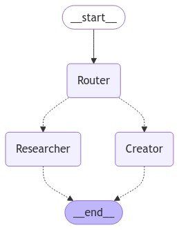

Hello everyone, today we are going to explain how to build a multi-agent system with WatsonX by using Langraph.

## Introduction

In the ever-evolving landscape of AI, creating structured, modular systems for managing intelligent agents has become essential. **Langraph** is a powerful library designed to help you build and orchestrate agent-based workflows efficiently. This blog post explains the core concepts behind Langraph, including **agents**, **workflows**, **nodes**, **states**, and **compilation** of workflows. By the end of this guide, you'll understand how to build your own multi-agent system, illustrated with a step-by-step code example and usage demonstration.

## What is Langraph?

Langraph is a framework designed to build agent-based systems using a state-machine-like approach. It integrates with LangChain, a powerful library for building LLM-based (Large Language Model) applications. Langraph allows you to create workflows by defining nodes and connecting them logically to handle various tasks such as routing, fetching data, or generating content.

Langraph shines in scenarios where you need a structured, modular approach to processing user input, routing queries to specific agents, and responding with the appropriate output. It’s especially useful when building applications that require dynamic decision-making and multi-step processes, such as chatbots, automated research tools, and multi-agent orchestration systems.

## Key Concepts


### 1. Agent

An **agent** is a component designed to perform a specific task. In the context of Langraph, an agent could be:

* **A language model:** Like the WatsonxLLM models we'll use, which responds to queries and generates text.
* **A tool:** Like the `TavilySearchResults` tool, which fetches data from the web.
* **A custom function:**  You can define your own Python functions to perform specific actions within the workflow.

Agents are the building blocks of the system and can be interconnected to form complex workflows.

### 2. Workflow

A **workflow** is the complete set of nodes and edges that define how agents interact and respond to different user inputs. It’s essentially the roadmap that guides the system’s behavior, dictating how information flows through various nodes and which agents are activated based on user input or state conditions.

### 3. Node

A **node** represents an action or decision point in the workflow. It is where an agent performs its task, such as generating a response or searching for data. Nodes are connected by edges that determine the flow from one node to another, based on specific conditions. 

### 4. State

The **state** is an object that holds information that is passed between nodes in the workflow. This allows agents to access and share information. In our example, the `AgentState` is a dictionary containing:

* `messages`: The history of messages in the conversation.
* `sender`: The name of the agent that sent the last message.
* `user_query`: The original query from the user.

### 5. Graph

**Graph**: consists of a set of vertices (or nodes), and a set of edges (or arcs) that each connect a pair of vertices.

These are often depicted as circles, connected by segments, e.g.


- **vertex**: a point or node in a graph
- **edge (or arc)**: a connection made between two vertices in a graph.

### 6. Compilation of the Workflow

**Compiling** a workflow means converting the defined nodes and transitions into an executable structure. This step is crucial as it transforms the logical setup of nodes and edges into an operational state machine. The compilation process prepares the workflow for evaluation, ensuring that it can run efficiently and handle different paths dynamically based on user input.

Let's walk through a step-by-step explanation of a complete example that builds a multi-agent system using Langraph.

## Setting Up the Environment

Before diving into the code and understanding how Langraph works, it's essential to set up the environment properly. This setup ensures that all the necessary dependencies are installed and the environment is configured for running the code examples. Below is a step-by-step guide:

### Step 1: Install Python 3.12

Ensure you have **Python 3.12** installed on your machine. You can verify your Python version with the following command:

```bash
python3 --version
```

If you don't have Python 3.12 installed, you can download it from [Python's official site](https://www.python.org/downloads/) or use a package manager like `pyenv` to manage multiple versions.

### Step 2: Create a Virtual Environment

To keep the environment isolated and organized, create a virtual environment (`.venv`) using Python 3.12:

```bash
python3.12 -m venv .venv
```

This command creates a `.venv` directory in your project folder that contains the virtual environment.

### Step 3: Activate the Virtual Environment

Activate the virtual environment to ensure all installations and commands are executed within it:

- On **macOS/Linux**:

```bash
source .venv/bin/activate
```

- On **Windows**:

```bash
.venv\Scripts\activate
```

After activation, you should see `(.venv)` prefixed in your terminal prompt, indicating that the virtual environment is active.

### Step 4: Create a `requirements.txt` File

Create a file named `requirements.txt` in your project directory and add the necessary dependencies for the project. Here’s an example:

```
ipykernel
ipython
langsmith
python-dotenv
ibm_watsonx_ai
tavily-python
langchain==0.2.0
langchain-anthropic==0.1.15
langchain-community==0.2.1
langchain-core==0.2.35
langchain-experimental==0.0.59
langchain-ibm==0.1.7
langchain-openai==0.1.8
langchain-text-splitters==0.2.0
langgraph==0.2.14
```

These dependencies include the libraries needed to work with Langraph, Watsonx, and other relevant tools for this project.

### Step 5: Install Dependencies

With your virtual environment activated, run the following command to install all the dependencies listed in `requirements.txt`:

```bash
pip install -r requirements.txt
```

This will ensure that all necessary libraries are installed within the virtual environment.

### Step 6: Create a `.env` File

In the project directory, create a file named `.env`. This file will hold sensitive information such as API keys, project IDs, and URLs needed for accessing external services like Watsonx.ai andd Tavily

Example `.env` file:

```
WATSONX_API_KEY=your-watsonx-api-key
PROJECT_ID=your-watsonx-project-id
WATSONX_URL=https://us-south.ml.cloud.ibm.com
TAVILY_API_KEY=your-tavily-api-key
```

Make sure to replace the placeholders with your actual credentials. The `.env` file allows you to keep your credentials safe and out of the codebase.

### Step 7: Create and Open the Jupyter Notebook

Ensure that **Jupyter Notebook** is installed in your virtual environment. You can install it using:

```bash
pip install jupyter
```

Afterward, launch the Jupyter Notebook:

```bash
jupyter notebook
```

This will open Jupyter in your browser. Create a new notebook, and you can start coding following the examples and explanations provided in the blog.

### Step 8: Building a Multi-Agent System

Here's a breakdown of the code example, highlighting how these concepts are applied:

```python
from langchain_core.prompts import ChatPromptTemplate, MessagesPlaceholder
from langchain_core.messages import AIMessage, HumanMessage
from langgraph.graph import END, StateGraph
from langchain_community.tools.tavily_search import TavilySearchResults
from langchain_ibm import WatsonxLLM
from dotenv import load_dotenv
import os
from IPython.display import Image, display
from typing_extensions import TypedDict
from typing import Sequence
import functools
from ibm_watsonx_ai.metanames import GenTextParamsMetaNames as GenParams
from ibm_watsonx_ai.foundation_models.utils.enums import DecodingMethods
```

The code imports necessary modules. We use `langchain_core` for message handling and prompt templates, `langgraph` for building workflows, `WatsonxLLM` for language model interactions, and `dotenv` for managing environment variables.

### 1. Setting Up Environment Variables

```python
load_dotenv()
```

Loads environment variables from a `.env` file. This is necessary for securely handling API keys and configuration details.

### 2. Defining the Agent State

Define the object passed between nodes (State)

```python
class AgentState(TypedDict):
    messages: Sequence[AIMessage]
    sender: str
    user_query: str  # Add user_query to the AgentState
```

The `AgentState` class defines the state structure that each agent node will use. It keeps track of the messages, the sender, and the user’s query.

### 3. Initializing Tools and Models

Tool Initialization for the Researcher (Agent)

```python
tavily_tool = TavilySearchResults(max_results=5)
```

Initializes the Tavily Search tool to fetch up to 5 results from the web. This will be used by the Researcher agent later.

### WatsonxLLM setup

```python
parameters = {
    GenParams.DECODING_METHOD: DecodingMethods.SAMPLE.value,
    GenParams.MAX_NEW_TOKENS: 100,
    GenParams.MIN_NEW_TOKENS: 50,
    GenParams.TEMPERATURE: 0.7,
    GenParams.TOP_K: 50,
    GenParams.TOP_P: 1
}
```

Sets up parameters for the WatsonxLLM. These parameters control the behavior of the language model, such as token sampling, temperature, and maximum output length.

### 4. Loading API Keys

```python
watsonx_api_key = os.getenv("WATSONX_API_KEY")
project_id = os.getenv("PROJECT_ID")
url = "https://us-south.ml.cloud.ibm.com"
```

Fetches the API key and project ID from the environment variables. The `url` defines the endpoint for the Watsonx service.

### 5. Defining Language Models

```python
llm_creator = WatsonxLLM(
    model_id="meta-llama/llama-3-70b-instruct",
    url=url,
    apikey=watsonx_api_key,
    project_id=project_id,
    params=parameters
)
```

Initializes the Creator agent's language model using WatsonxLLM. It sets up the model ID and API credentials.

```python
llm_router = WatsonxLLM(
    model_id="meta-llama/llama-3-70b-instruct",
    url=url,
    apikey=watsonx_api_key,
    project_id=project_id,
    params=parameters
)
```

Similarly, sets up the Router agent’s language model.

### 6. Defining Agent Nodes

#### Router Agent Node

```python
def router_agent_node(state, name):
    query = state["messages"][-1].content
    router_prompt = (
        "You are a routing agent..."
    )
    selected_agent = llm_router.predict(router_prompt).strip().lower()
    if 'researcher' in selected_agent:
        selected_agent = 'Researcher'
    elif 'creator' in selected_agent:
        selected_agent = 'Creator'
    else:
        raise ValueError(f"Unexpected agent response: {selected_agent}")
    return {
        "messages": [AIMessage(content=f"Router Agent: Selected {selected_agent}", name=name)],
        "sender": name,
        "selected_agent": selected_agent,
        "user_query": query,
    }
```

The Router agent analyzes the user query and determines which agent (Researcher or Creator) should handle it. It uses a language model to make this decision and updates the state accordingly.

#### Researcher Agent Node

```python
def researcher_agent_node(state, name):
    query = state["user_query"]
    search_results = tavily_tool.invoke(query)
    result = f"Researcher Agent: Fetched search results for '{query}': {search_results}"
    return {
        "messages": [AIMessage(content=result, name=name)],
        "sender": name,
    }
```

The Researcher agent uses the Tavily tool to fetch updated information based on the user query. It returns the search results as its response.

#### Creator Agent Node

```python
def creator_agent_node(state, name):
    query = state["user_query"]
    creator_prompt = f"Please answer the following query: {query}"
    result = llm_creator.predict(creator_prompt)
    return {
        "messages": [AIMessage(content=f"Creator Agent: {result}", name=name)],
        "sender": name,
    }
```

The Creator agent uses the language model to generate a response to the user query based on general knowledge.

### 7. Setting Up the Workflow

Define the graph and its nodes (Workflow)

```python
workflow = StateGraph(AgentState)
workflow.add_node("Router", functools.partial(router_agent_node, name="Router"))
workflow.add_node("Researcher", research_node)
workflow.add_node("Creator", creator_node)
```

Defines the workflow and adds nodes for each agent.

### 8. Adding Conditional Edges

Define edges and transitions

```python
def extract_selected_agent(state) -> str:
    return state["selected_agent"]

workflow.add_conditional_edges("Router", extract_selected_agent, {"Researcher": "Researcher", "Creator": "Creator"})
```

Adds conditional transitions based on the Router’s response, directing the flow to either the Researcher or Creator node.

### 9. Compiling the Workflow

Compile the workflow for execution (Compilation)

```python
graph = workflow.compile()
```

Compiles the workflow, turning it into an executable state machine. This step is necessary to make the workflow operational and capable of handling dynamic paths.

### 10. Displaying the Architecture

```python
def display_architecture():
    try:
        display(Image(graph.get_graph(xray=True).draw_mermaid_png()))
    except:
        print("Unable to display graph architecture. Extra dependencies might be missing.")
```

This function displays the architecture of the workflow using a mermaid diagram. It provides a visual representation of how the nodes and edges connect.

```python
display_architecture()
```




This function call displays the workflow architecture, providing a visual overview of the structure.

### 11. Evaluating the System

```python
def evaluate_message(message: str):
    events = graph.stream(
        {"messages": [HumanMessage(content=message)]},
        {"recursion_limit": 50}
    )
    for s in events:
        print(s)
        print("----")
    print("Final")
```

Evaluates user messages, routes them through the system, and prints the output step by step.

### 12. Example Usage

```python
evaluate_message("Fetch the bitcoin price over the past 5 days.")  # Researcher case
evaluate_message("Explain what Bitcoin is.")  # Creator case
```

```
{'Router': {'messages': [AIMessage(content='Router Agent: Selected Researcher', additional_kwargs={}, response_metadata={}, name='Router')], 'sender': 'Router', 'user_query': 'Fetch the bitcoin price over the past 5 days.'}}
----
{'Researcher': {'messages': [AIMessage(content='Researcher Agent: Fetched search results for \'Fetch the bitcoin price over the past 5 days.\': [{\'url\': \'https://www.investing.com/crypto/bitcoin/historical-data\', \'content\': "Get historical data for the Bitcoin prices. You\'ll find the historical Bitcoin market data for the selected range of dates. The data can be viewed in daily, weekly or monthly time intervals."}, {\'url\': \'https://www.coingecko.com/en/coins/bitcoin/historical_data\', \'content\': \'Get Bitcoin (BTC) USD historical prices. Coins: 14,997. Exchanges: 1,140. Market Cap: $2 ... Proudly powering over thousands of industry builders worldwide with accurate, live & independent data ... Do Not Show 7 Days\'}, {\'url\': \'https://www.nasdaq.com/market-activity/cryptocurrency/btc/historical\', \'content\': \'Bitcoin (BTC) Historical prices - Nasdaq offers historical cryptocurrency prices & market activity data for US and global markets.\'}, {\'url\': \'https://coinmarketcap.com/currencies/bitcoin/historical-data/\', \'content\': "The live Bitcoin price today is $66,825.49 USD with a 24-hour trading volume of $33,820,690,194.65 USD. We update our BTC to USD price in real-time. ... Bitcoin\'s price history is a testament to its evolution and growth over the years. It started with a value of almost nothing and has grown to be one of the most valuable assets in the world"}, {\'url\': \'https://coincodex.com/crypto/bitcoin/historical-data/\', \'content\': "Access the entire Bitcoin value history - simply select the time range you\'re interested in and you\'ll be able to find the open, high, low and close data for the Bitcoin price, as well as historical BTC trading volume and market capitalization. Track Bitcoin\'s history in its entirety, ranging from the Bitcoin starting price to the most"}]', additional_kwargs={}, response_metadata={}, name='Researcher')], 'sender': 'Researcher'}}
----
Final
{'Router': {'messages': [AIMessage(content='Router Agent: Selected Creator', additional_kwargs={}, response_metadata={}, name='Router')], 'sender': 'Router', 'user_query': 'Explain what Bitcoin is.'}}
----
{'Creator': {'messages': [AIMessage(content='Creator Agent:  Bitcoin is a digital currency that uses cryptography to secure and facilitate transactions. It is decentralized, meaning that it is not controlled by any government or financial institution. Bitcoin operates on a peer-to-peer network, allowing individuals to send and receive bitcoins directly without the need for intermediaries. The decentralized nature of Bitcoin allows for greater autonomy and freedom in financial transactions.', additional_kwargs={}, response_metadata={}, name='Creator')], 'sender': 'Creator'}}
----
Final

```


These example calls demonstrate how the system processes different queries:

- **"Fetch the bitcoin price over the past 5 days."** triggers the Researcher agent.
- **"Explain what Bitcoin is."** triggers the Creator agent.


### Conclusion

Langraph provides a powerful way to orchestrate multi-agent systems, offering flexibility and modularity. By defining workflows, nodes, and transitions, you can build complex, intelligent systems efficiently. 

**Congratulations!** You have learned how to build a multi-agent system with **Langraph** and **Watsonx.ai**