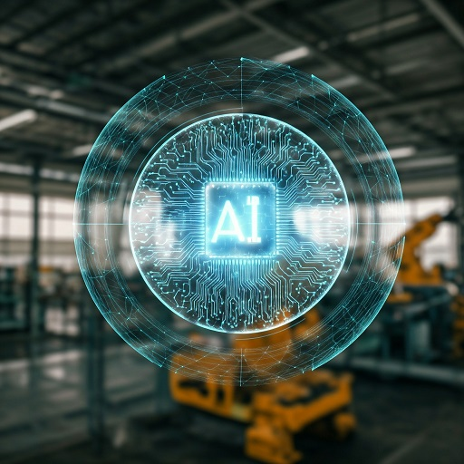

Hello everyone! Today, we’ll explore a pivotal question: **what can we expect for 2025**, and how can AI play a crucial role in shaping Europe’s future?

Reflecting on Mario Draghi’s recent report on European competitiveness, it becomes clear that we are standing at a crossroads where technology, innovation, and collaboration are no longer optional—they are necessities.

Draghi’s report paints a vivid picture of the challenges facing Europe. He warns that without **rapid adaptation to technological and economic changes**, the continent risks slipping further behind economic powerhouses like the United States and China. At the heart of his recommendations lies **artificial intelligence (AI)**—a transformative force that has the potential to redefine industries, boost productivity, and position Europe as a global competitor in the 21st century.

By 2025, Draghi envisions a Europe that must have already begun to reap the benefits of significant investments in **AI-driven systems**, **sustainable technologies**, and **innovation hubs**. These elements are not just aspirational—they are essential for Europe to remain a relevant and powerful force in the global economy. **Artificial intelligence, in particular, is projected to be the cornerstone of Europe’s competitive edge, enabling automation, smarter decision-making, and entirely new industries.**

In this blog, we’ll focus on a special case: **Italy, a country uniquely positioned to lead Europe’s charge into a brighter future.** Through its rich industrial history, robust manufacturing base, and emerging tech ecosystem, Italy can leverage AI and digital transformation to modernize its industries and strengthen its global presence. Central to this effort is **WatsonX**, which offers the tools  needed to bring Draghi’s vision to life.

---

### Why AI Matters in 2025: Draghi’s Vision for Europe

Draghi’s warning is underpinned by hard data and stark realities. **The global digital economy is advancing at breakneck speed**, and without significant investments in AI, Europe risks being left behind. Draghi highlights that:

- **AI is no longer a luxury**: It’s the engine of innovation, capable of automating complex processes, transforming data into actionable insights, and creating entirely new markets.
- **Digital transformation is essential**: Traditional industries must embrace cutting-edge technologies like AI, IoT, and multimodal systems to compete with the agility of global leaders.
- **Collaboration is key**: Europe must bridge the gap between research, talent, and capital to ensure AI innovations are implemented effectively across industries.

Draghi specifically calls for investments in **AI systems that are not only innovative but scalable**. By integrating AI into every aspect of the economy—from education to manufacturing—Europe can overcome productivity stagnation, modernize its industries, and create new growth opportunities.

---

IBM, armed with **Watsonx.ai**, **Watsonx.data**, **Watsonx.governance** and **IBM Cloud**, is at the forefront of driving this change. In this blog, we’ll explore three key areas where AI and IBM can make an immediate impact:

1. **Driving Digital Transformation in Italy’s Traditional Industries**
2. **Upskilling Talent and Establishing Innovation Hubs**
3. **Collaborating on High-Tech Projects with Strategic Partners**

Through these efforts, we’ll see how Italy can not only meet the challenges outlined in Draghi’s report but emerge as a leader in Europe’s AI-powered future. Let’s dive into how this transformation can unfold

---

### **1. Driving Digital Transformation in Italy’s Traditional Industries**

Italy’s traditional industries, such as agriculture, automotive, and manufacturing, are the backbone of its economy. However, these sectors have long relied on outdated systems, making them less competitive in the global market. 

#### **How to Act:**

- **Modernizing Processes with Watsonx.ai**: Deploy **AI-driven automation systems** to optimize operations like predictive maintenance in manufacturing and AI-enhanced production in agriculture. For instance, olive oil producers could use real-time analytics to improve yields while reducing costs.
- **Building Data-Driven Insights with Watsonx.data**: Create centralized data hubs for traditional industries, integrating multimodal datasets (e.g., IoT, market trends) to drive smarter, more efficient decision-making.
- **Multi-Agent Systems for Supply Chains**: Implement autonomous agents to coordinate logistics and inventory, enabling industries to adapt dynamically to demand and supply fluctuations.
- **IoT Integration via IBM Cloud**: Use IoT services to enable real-time monitoring of machinery, ensuring seamless operations and reducing downtime.

#### **Expected Impact by 2025:**

These efforts will modernize Italy’s legacy industries, improving productivity and competitiveness while ensuring sustainable growth. Becoming a  partner for digital transformation across traditional sectors.

---

### **2. Upskilling Talent and Establishing Innovation Hubs**

Draghi’s report also highlighted Europe’s significant skills gap and the need for ecosystems that nurture innovation. We can play a pivotal role in bridging this gap by using its technologies to enable talent development and foster innovation hubs.

#### **How to Act:**

- **AI-Powered Learning Systems**: Deploy **Watsonx.ai** to create **AI-driven upskilling platforms** that deliver personalized learning experiences. Multimodal AI can combine video, text, and interactive simulations to teach critical skills in cloud computing, AI, and automation.
- **Digital Innovation Hubs**: Establish centers in Italy powered by **IBM Cloud Pak for Data**, enabling startups, universities, and industries to experiment with sandbox environments for Proof of Concepts (PoCs).
- **PoC and PoCx Generators**: Use **Watsonx.data** to enable rapid prototyping of innovative solutions for sectors like renewable energy, smart cities, and autonomous systems.
- **Collaborations with Universities**: Partner with Italian educational institutions to deliver **AI-enabled programs**, preparing the next generation of digital innovators.

#### **Expected Impact by 2025:**

By fostering talent and creating innovation hubs, for Italy’s digital skills gap and build a sustainable pipeline of talent. This effort will ensure Italy remains competitive in the global digital economy.

---

### **3. Collaborating on High-Tech Projects with Strategic Partners**

Collaboration is essential to scale solutions and drive innovation. Draghi’s report stressed the importance of advanced technologies like AI, multimodal systems, and sustainable solutions. We can achieve this by forging partnerships with hyperscalers and emerging Italian AI companies.

#### **How to Act:**

- **Partnerships with Hyperscalers**:
  - Collaborate with **AWS, Google Cloud, and Microsoft Azure** to develop scalable, **multi-cloud solutions** tailored to Italian enterprises.
  - Use IBM’s hybrid cloud capabilities and hyperscaler infrastructure to drive **sustainable energy solutions** and create **smart electric grids** optimized by AI.
  - Co-develop **multimodal AI systems** for smart cities, transportation, and healthcare, combining IBM CIC’s expertise with the hyperscalers’ cloud power.
- **Engagement with Italian AI Startups**:
  - Partner with local AI innovators like **Datrix** and **Cognitive Technologies** to create groundbreaking solutions in robotics, autonomous systems, and personalized healthcare.
  - Use IBM’s **Environmental Intelligence Suite** to help startups design solutions for carbon tracking and renewable energy optimization.
  - Offer PoC collaboration opportunities by integrating IBM Watsonx.ai tools with Italian startups' innovations, creating scalable prototypes for global markets.
- **Sustainability Projects**:
  - Deploy **multi-agent systems** for decentralized energy management, ensuring efficient resource allocation across renewable power grids.
  - Collaborate on EU-funded initiatives to develop sustainable, high-tech solutions for industries like automotive, manufacturing, and digital health.

#### **Expected Impact by 2025:**

These collaborations will position corporations in high-tech innovation and sustainability, driving Italy’s economic growth while aligning with Europe’s broader goals for digital transformation.

---

### **4. Pioneering AI-Driven Proof of Concepts (PoC) and Proof of Concept Extended (PoCx) Tools**

Draghi’s report underlines the need for Europe to transform innovations into tangible business solutions. We can address this by enabling rapid prototyping and scalable solutions through PoC and PoCx tools.

#### **How to Act:**

- **PoC Generators**: Develop AI-powered PoC generators using **Watsonx.data**, allowing enterprises to test and validate new ideas quickly.
- **PoCx Innovations**: Extend these tools to include **multimodal capabilities**, enabling the creation of prototypes for complex systems such as autonomous vehicles or AI-powered diagnostic tools.
- **EU-Funded Collaboration**: Showcase these PoC tools in EU-funded projects, demonstrating their scalability and utility across industries.

#### **Expected Impact by 2025:**

PoC and PoCx tools will enable Italian enterprises to innovate faster, reducing risks and fostering an ecosystem of rapid technological advancement.

---

### **Conclusion**

Mario Draghi’s report is a wake-up call for Europe to prioritize AI, digital transformation, and sustainability to remain competitive on the global stage. By leveraging **Watsonx.ai**, **Watsonx.data**, **Watsonx.governance**, **IBM Cloud**, and its extensive expertise of innovation centers is uniquely positioned to drive this transformation in Italy. Through digital modernization, upskilling talent, fostering innovation hubs, and strategic collaborations we can help to organizations and indrustries enter into a new era of technological and economic growth.

As we look toward **2025**, the integration of cutting-edge AI technologies, collaboration with hyperscalers, and partnerships with Italian startups can ensure that Europe—and Italy—are ready to compete in the global digital economy. The future is digital, and WatsonX is poised to shape it.