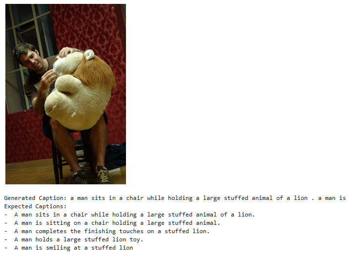

Image captioning, the task of automatically generating textual descriptions for images, stands at the intersection of computer vision and natural language processing. This blog post dives into the development of an image captioning model using deep learning techniques, specifically leveraging the power of Convolutional Neural Networks (CNNs) and Recurrent Neural Networks (RNNs), particularly LSTMs, as implemented in our Python code. We will first delve into the theoretical foundations of our model, including relevant mathematical equations, and then we will be able to see how these components work together to understand and describe images in natural language.

## **1. Introduction to Our Image Captioning Model**

Our image captioning model is a specific type of multimodal system. It doesn't fall strictly under the umbrella of Multimodal Large Language Models (LLMs) like GPT-4 with Vision, which are typically based on the Transformer architecture. Instead, our model follows a more traditional encoder-decoder approach:

*   **Encoder:** A Convolutional Neural Network (CNN) – specifically ResNet50 – to extract visual features from the input image.
*   **Decoder:** A Recurrent Neural Network (RNN) – specifically an LSTM – to generate the textual description (caption) based on the encoded image features.

While not as powerful as state-of-the-art multimodal LLMs, this architecture is a fundamental and widely-used approach to image captioning. It demonstrates the core principles of combining visual and textual information for a complex task.

## **2. Mathematical Foundations of Our Image Captioning Model**

Our model combines a CNN encoder with an LSTM decoder. Let's break down the mathematical operations involved in each component.

### **2.1 Input Representations**

#### **2.1.1 Text Input (for Decoder)**

For text, the input is a sequence of words representing the caption. Each word is first mapped to a unique token ID. Then, these tokens are converted into dense vector representations called **word embeddings**.

* **Tokenization:**

  Let $$ c_i $$ be the $$ i $$-th word in the input caption.  
  Let $$ V $$ be the vocabulary (set of all unique words).  

  Let $$ \text{Tokenize}(c_i) $$ be a function that maps $$ c_i $$ to its corresponding token ID $$ t_i \in \{1, 2, ..., |V|\} $$.

  

*   **Word Embeddings:**

    Let $$ E \in \mathbb{R}^{|V| \times d_e} $$ be the embedding matrix, where $$ d_e $$ is the embedding dimension.  

    The embedding $$ e_i $$ for token $$ t_i $$ is obtained by looking up the $$ t_i $$-th row of $$ E $$:
    $$
    e_i = E_{t_i}
    $$


#### **2.1.2 Image Input (for Encoder)**

Images are processed through a pre-trained ResNet50 model to extract visual features. These features represent a high-level, semantically rich encoding of the image content.

*   **Feature Extraction (using ResNet50):**
    * Let $$ I \in \mathbb{R}^{H \times W \times C} $$ be the input image, where $$ H $$ is the height, $$ W $$ is the width, and $$ C $$ is the number of channels (3 for RGB).
    
    * Let $$ \text{ResNet50}(I) $$ be the output of the pre-trained ResNet50 model applied to the image $$ I $$. We use the output of the layer just before the final classification layer.
    
    * $$ \text{ResNet50}(I) = f \in \mathbb{R}^{d_f} $$, where $$ d_f $$ is the feature dimension (2048 for ResNet50).
    
      
    
*   **Linear Projection:**
    *   The ResNet50 features $$ f $$ are linearly projected to match the embedding dimension $$ d_e $$ used in the decoder:
        $$ f' = f W^p + b^p $$
        where $$ W^p \in \mathbb{R}^{d_f \times d_e} $$ and $$ b^p \in \mathbb{R}^{d_e} $$ are learnable parameters.
    
*   **Batch Normalization:**
    *   Batch normalization is applied to the projected features:
        $$ f'' = \text{BatchNorm}(f') $$

### **2.2 Core Model Components**

#### **2.2.1 Encoder (ResNet50)**

The ResNet50 architecture is based on residual blocks that learn residual functions with reference to the layer inputs, instead of learning unreferenced functions. Each block can be represented as:

$$ y = F(x, \{W_i\}) + x $$

where $$ x $$ is the input, $$ y $$ is the output, and $$ F(x, \{W_i\}) $$ is the residual mapping to be learned. This residual learning helps to address the vanishing gradient problem in deep networks.

*Note: The provided code freezes the weights of ResNet, so no equations for backpropagation through the encoder are needed during the training phase.*

#### **2.2.2 Decoder (LSTM)**

The LSTM is the core of our decoder. It processes the encoded image features and generates the caption word by word.

*   **LSTM Cell:**
    *   At each time step $$ t $$, the LSTM cell takes the current word embedding $$ e_t $$, the previous hidden state $$ h_{t-1} $$, and the previous cell state $$ c_{t-1} $$ as inputs.
    *   **Forget Gate:**
        $$ f_t = \sigma(W_{f} \cdot [h_{t-1}, e_t] + b_f) $$
    *   **Input Gate:**
        $$ i_t = \sigma(W_{i} \cdot [h_{t-1}, e_t] + b_i) $$
    *   **Candidate Cell State:**
        $$ \tilde{C}_t = \tanh(W_{C} \cdot [h_{t-1}, e_t] + b_C) $$
    *   **New Cell State:**
        $$ C_t = f_t * C_{t-1} + i_t * \tilde{C}_t $$
    *   **Output Gate:**
        $$ o_t = \sigma(W_{o} \cdot [h_{t-1}, e_t] + b_o) $$
    *   **New Hidden State:**
        $$ h_t = o_t * \tanh(C_t) $$
        where $$ \sigma $$ is the sigmoid function, $$ W $$ and $$ b $$ are learnable weight matrices and biases, and $$ * $$ denotes element-wise multiplication.

*   **Initialization with Image Features:**
    *   The initial hidden state $$ h_0 $$ and cell state $$ c_0 $$ of the LSTM are typically initialized with the encoded image features (or a transformation of them). In our code this is implicit, as the features are concatenated with the first embedded word.

*   **Word Prediction:**
    *   At each time step, the LSTM's hidden state $$ h_t $$ is passed through a linear layer to produce a score for each word in the vocabulary:
        $$ \text{scores}_t = h_t W^d + b^d $$
        where $$ W^d \in \mathbb{R}^{d_h \times |V|} $$ and $$ b^d \in \mathbb{R}^{|V|} $$ are learnable parameters.
    *   A softmax function is applied to obtain a probability distribution over the vocabulary:
        $$ P(y_t | y_{<t}, f'') = \text{softmax}(\text{scores}_t) $$

### **2.3 Loss Function**

**Cross-Entropy Loss (for Captioning)**

The standard loss function for caption generation is the cross-entropy loss. It measures the difference between the predicted probability distribution and the true distribution (one-hot encoding of the ground truth word) for each word in the caption.

*   The loss for a single time step $$ t $$ is:
    $$ \mathcal{L}_{CE}(t) = - \log P(y^*_t | y^*_{<t}, f'') $$
    where $$ y^*_t $$ is the ground truth word at time step $$ t $$.
*   The total loss for a caption is the sum of the losses over all time steps:
    $$ \mathcal{L}_{CE} = \sum_t \mathcal{L}_{CE}(t) $$

### **2.4 Optimization**

**Adam Optimizer**

The Adam optimizer is used to update the model's parameters during training. It combines the benefits of AdaGrad and RMSProp.

*   **First Moment (Mean):**
    $$ m_t = \beta_1 \cdot m_{t-1} + (1 - \beta_1) \cdot g_t $$
*   **Second Moment (Uncentered Variance):**
    $$ v_t = \beta_2 \cdot v_{t-1} + (1 - \beta_2) \cdot g_t^2 $$
*   **Bias Correction:**
    $$ \hat{m}_t = \frac{m_t}{1 - \beta_1^t} $$
    $$ \hat{v}_t = \frac{v_t}{1 - \beta_2^t} $$
*   **Parameter Update:**
    $$ \theta_t = \theta_{t-1} - \alpha \cdot \frac{\hat{m}_t}{\sqrt{\hat{v}_t} + \epsilon} $$
    where $$ g_t $$ is the gradient at time step $$ t $$, $$ \alpha $$ is the learning rate, $$ \beta_1 $$ and $$ \beta_2 $$ are exponential decay rates, $$ \epsilon $$ is a small constant for numerical stability, and $$ \theta $$ represents the model parameters.


In the next section of the blog post, we will describe implementation part which will show the practical application of these theoretical concepts.

## **3. Implementation in Python**

Let's build our image captioning model in Python.

---

### **3.1 Import Libraries**

First, we import the necessary libraries:

```python
import torch
import torch.nn as nn
import torchvision.models as models
from torch.utils.data import Dataset, DataLoader, random_split
from torchvision import transforms
from PIL import Image
import nltk
from nltk.translate.bleu_score import sentence_bleu, SmoothingFunction
from nltk.translate.meteor_score import meteor_score
from rouge import Rouge
import numpy as np
from datasets import load_dataset
import matplotlib.pyplot as plt
from torch.nn.utils.rnn import pad_sequence
```

*   **PyTorch** is our deep learning framework.
*   **torchvision** provides access to popular datasets, model architectures, and image transformations.
*   **PIL (Pillow)** for image manipulation.
*   **nltk** for natural language processing tasks.
*   **datasets** to load the Flickr30k dataset.
*   **matplotlib** for displaying images.

---

### **3.2 Data Loading and Preprocessing**

#### **3.2.1 Dataset Class**

We define a custom dataset class `ImageCaptionDataset` to handle our image-caption pairs.

```python
class ImageCaptionDataset(Dataset):
    def __init__(self, images, captions, vocab, transform=None):
        self.images = images
        self.captions = captions
        self.vocab = vocab
        self.transform = transform

    def __len__(self):


```

```python
class ImageCaptionDataset(Dataset):
    def __init__(self, images, captions, vocab, transform=None):
        self.images = images
        self.captions = captions
        self.vocab = vocab
        self.transform = transform

    def __len__(self):
        return len(self.images)

    def __getitem__(self, idx):
        image = self.images[idx].convert('RGB')
        caption_list = self.captions[idx]

        if self.transform:
            image = self.transform(image)

        # Combine all captions into a single string
        combined_caption = " ".join(caption_list)

        # Tokenize and convert caption to numerical form
        tokens = nltk.tokenize.word_tokenize(str(combined_caption).lower())
        caption_vec = []
        caption_vec.append(self.vocab('<start>'))
        caption_vec.extend([self.vocab(token) for token in tokens])
        caption_vec.append(self.vocab('<end>'))
        target = torch.LongTensor(caption_vec)

        return image, target
```

*   `__init__`: Initializes the dataset with images, captions, vocabulary, and optional image transformations.
*   `__len__`: Returns the number of image-caption pairs.
*   `__getitem__`: Retrieves an image-caption pair by index. It preprocesses the image and converts the caption into a sequence of numerical tokens using the vocabulary.

#### **3.2.2 Vocabulary Builder**

The `Vocabulary` class maps words to numerical indices and vice-versa.

```python
class Vocabulary:
    def __init__(self):
        self.word2idx = {}
        self.idx2word = {}
        self.idx = 0

    def add_word(self, word):
        if not word in self.word2idx:
            self.word2idx[word] = self.idx
            self.idx2word[self.idx] = word
            self.idx += 1

    def __call__(self, word):
        if not word in self.word2idx:
            return self.word2idx['<unk>']  # Return <unk> if word not found
        return self.word2idx[word]

    def __len__(self):
        return len(self.word2idx)

def build_vocab(captions_list, threshold=1):  # Reduced threshold to 1
    counter = {}
    for captions in captions_list:
        for caption in captions:
            tokens = nltk.tokenize.word_tokenize(str(caption).lower())
            for word in tokens:
                counter[word] = counter.get(word, 0) + 1

    vocab = Vocabulary()
    vocab.add_word('<pad>')
    vocab.add_word('<start>')
    vocab.add_word('<end>')
    vocab.add_word('<unk>')

    words = [word for word, cnt in counter.items() if cnt >= threshold]
    for word in words:
        vocab.add_word(word)

    return vocab
```

*   `Vocabulary`: Builds a vocabulary from the captions.
*   `build_vocab`: Creates the `Vocabulary` object, adding special tokens (`<pad>`, `<start>`, `<end>`, `<unk>`) and words that appear at least a certain number of times (threshold).

#### **3.2.3 Data Preparation**

We load the Flickr30k dataset and split it into training, validation, and test sets.

```python
# Load the flickr30k dataset and select a subset
flickr_dataset = load_dataset("nlphuji/flickr30k", split="test").select(range(10))

# Split the dataset
train_size = int(0.8 * len(flickr_dataset))
val_size = int(0.1 * len(flickr_dataset))
test_size = len(flickr_dataset) - train_size - val_size

train_val_dataset, test_dataset = random_split(flickr_dataset, [train_size + val_size, test_size])
train_dataset_raw, val_dataset_raw = random_split(train_val_dataset, [train_size, val_size])

# Extract images and their descriptions
def extract_data(dataset):
    images = []
    captions = []
    for i in range(len(dataset)):
        try:
            image = dataset[i]["image"]
            caption_list = dataset[i]["caption"]
            images.append(image)
            captions.append(caption_list)
        except Exception as e:
            print(f"Error processing item {i}: {e}")
    return images, captions

# Extract data for each set
train_images, train_captions = extract_data(train_dataset_raw)
val_images, val_captions = extract_data(val_dataset_raw)
test_images, test_captions = extract_data(test_dataset)
```

*   We use the `load_dataset` function from the `datasets` library to load the Flickr30k dataset.
*   We then split it and extract the images and their corresponding captions using `extract_data`.

#### **3.2.4 Data Collation**

```python
def collate_fn(data):
    data.sort(key=lambda x: len(x[1]), reverse=True)
    images, captions = zip(*data)
    images = torch.stack(images, 0)
    lengths = [len(cap) for cap in captions]
    targets = pad_sequence(captions, batch_first=True)
    return images, targets, lengths
```

*   The `collate_fn` function is crucial for efficient batch processing of text data. It takes a batch of samples (images and captions) and prepares them for the model.
*   `data.sort(key=lambda x: len(x[1]), reverse=True)`: Sorts the batch items in descending order of caption length. This is essential for efficient processing with `pack_padded_sequence` later.
*   `images, captions = zip(*data)`: Unzips the batch into separate lists of images and captions.
*   `images = torch.stack(images, 0)`: Stacks the images into a single tensor.
*   `lengths = [len(cap) for cap in captions]`: Creates a list of caption lengths, which will be used for packing.
*   `targets = pad_sequence(captions, batch_first=True)`: Pads the captions to the same length using `pad_sequence`. This makes all captions in the batch have the same length by adding padding tokens at the end, so they can be processed as a tensor.
*   The function returns the stacked images, the padded target captions, and the list of original caption lengths.

---

### **3.3 Model Definition**

#### **3.3.1 Encoder (CNN)**

The `EncoderCNN` class defines our image encoder.

```python
class EncoderCNN(nn.Module):
    def __init__(self, embed_size):
        super(EncoderCNN, self).__init__()
        resnet = models.resnet50(pretrained=True)
        modules = list(resnet.children())[:-1]
        self.resnet = nn.Sequential(*modules)
        self.linear = nn.Linear(resnet.fc.in_features, embed_size)
        self.bn = nn.BatchNorm1d(embed_size, momentum=0.01)

        # Freeze resnet parameters (for initial debugging)
        for param in self.resnet.parameters():
            param.requires_grad = False

    def forward(self, images):
        with torch.no_grad(): # Added no grad since we are not updating resnet weights
            features = self.resnet(images)
        features = features.reshape(features.size(0), -1)
        features = self.bn(self.linear(features))
        return features
```

*   `__init__`: Initializes the encoder with a pre-trained ResNet50 model. We remove the final fully connected layer and add our own linear layer to project the features to the desired `embed_size`. We also add batch normalization.
*   `forward`: Defines the forward pass. It extracts features using ResNet50, reshapes them, and applies the linear and batch normalization layers.

#### **3.3.2 Decoder (RNN/LSTM)**

The `DecoderRNN` class defines our caption decoder.

```python
class DecoderRNN(nn.Module):
    def __init__(self, embed_size, hidden_size, vocab_size, num_layers=1, dropout_p=0.0):  # Removed dropout for simplicity
        super(DecoderRNN, self).__init__()
        self.embed = nn.Embedding(vocab_size, embed_size)
        self.lstm = nn.LSTM(embed_size, hidden_size, num_layers, batch_first=True)
        self.linear = nn.Linear(hidden_size, vocab_size)
        self.max_seq_length = 30 # Increased max sequence length

    def forward(self, features, captions, lengths):
        embeddings = self.embed(captions)
        embeddings = torch.cat((features.unsqueeze(1), embeddings), 1)
        packed = nn.utils.rnn.pack_padded_sequence(embeddings, lengths, batch_first=True, enforce_sorted=False)
        hiddens, _ = self.lstm(packed)
        outputs = self.linear(hiddens[0])
        return outputs
    
    def sample(self, features, states=None, max_len=None):
        """
        Generate captions for given image features using greedy search.
        """
        if max_len is None:
            max_len = self.max_seq_length
        
        sampled_ids = []
        inputs = features.unsqueeze(1)
        for i in range(max_len):
            hiddens, states = self.lstm(inputs, states)  # hiddens: (batch_size, 1, hidden_size)
            outputs = self.linear(hiddens.squeeze(1))  # outputs: (batch_size, vocab_size)
            _, predicted = outputs.max(1)  # predicted: (batch_size)
            sampled_ids.append(predicted)
            
            # Check for end of sequence
            if predicted.item() == self.vocab.word2idx['<end>']:
                break
            
            inputs = self.embed(predicted)  # inputs: (batch_size, embed_size)
            inputs = inputs.unsqueeze(1)  # inputs: (batch_size, 1, embed_size)
        sampled_ids = torch.stack(sampled_ids, 1)  # sampled_ids: (batch_size, max_seq_length)
        return sampled_ids
```

*   `__init__`: Initializes the decoder with an embedding layer, an LSTM layer, and a linear layer.
*   `forward`: Defines the forward pass during training. It embeds the captions, concatenates them with the image features, packs them into a `PackedSequence`, and feeds them through the LSTM and linear layers.
*   `sample`: Generates captions for given image features during inference using greedy search.

---

### **3.4 Training the Model**

#### **3.4.1 Training Setup**

```python
def main():
    # Hyperparameters (for debugging)
    embed_size = 256
    hidden_size = 512
    num_layers = 1
    learning_rate = 0.001
    num_epochs = 50  
    batch_size = 2  
    threshold = 1  # Reduced to include more words in vocabulary

    # Device configuration
    device = torch.device('cuda' if torch.cuda.is_available() else 'cpu')

    # Image preprocessing
    transform = transforms.Compose([
        transforms.Resize((224, 224)),
        transforms.ToTensor(),
        transforms.Normalize((0.485, 0.456, 0.46), (0.229, 0.224, 0.225))
    ])

    # Build vocabulary 
    vocab = build_vocab(train_captions, threshold=threshold)
    vocab_size = len(vocab)
    print(f"Vocabulary size: {vocab_size}")

    # Print vocabulary to check for <unk> issues
    print("Vocabulary (word2idx):", vocab.word2idx)

    # Data Loader 
    train_dataset = ImageCaptionDataset(train_images, train_captions, vocab, transform)
    train_loader = DataLoader(train_dataset, batch_size=batch_size, shuffle=True, num_workers=0, collate_fn=collate_fn)

    # Initialize model, loss, optimizer
    encoder = EncoderCNN(embed_size).to(device)
    decoder = DecoderRNN(embed_size, hidden_size, vocab_size, num_layers).to(device)
    decoder.vocab = vocab
    criterion = nn.CrossEntropyLoss()
    params = list(decoder.parameters()) + list(encoder.linear.parameters()) + list(encoder.bn.parameters())
    optimizer = torch.optim.Adam(params, lr=learning_rate)
```

*   We define hyperparameters, device configuration, and image preprocessing transformations.
*   We build the vocabulary using `build_vocab`.
*   We create the `ImageCaptionDataset` and `DataLoader`.
*   We initialize the encoder, decoder, loss function, and optimizer.

#### **3.4.2 Training Loop**

```python
    # --- Training Loop  ---
    encoder.train()
    decoder.train()
    
    for epoch in range(num_epochs):
        for i, (images, captions, lengths) in enumerate(train_loader):
            images = images.to(device)
            captions = captions.to(device)
            
            # Forward pass
            features = encoder(images)
            outputs = decoder(features, captions, lengths)

            # Calculate loss
            targets = nn.utils.rnn.pack_padded_sequence(captions, lengths, batch_first=True, enforce_sorted=False).data
            loss = criterion(outputs, targets)
            
            print(f'Epoch: {epoch+1}/{num_epochs}, Batch: {i+1}/{len(train_loader)}, Batch Loss: {loss.item():.4f}')

            # Backward and optimize
            decoder.zero_grad()
            encoder.zero_grad()
            loss.backward()
            optimizer.step()
```

*   The training loop iterates through epochs and batches of data.
*   In each iteration, it performs a forward pass through the encoder and decoder, calculates the loss, and updates the model parameters using backpropagation and the optimizer.

---

### **3.5 Generating Captions**

```python
def get_sentence_from_ids(word_ids, vocab):
    return ' '.join([vocab.idx2word.get(word_id.item(), '<unk>') for word_id in word_ids if word_id not in [vocab('<pad>'), vocab('<start>'), vocab('<end>')]])

def test_model_on_image(encoder, decoder, image_source, image_index, vocab, device, transform, max_len=20):
    if image_source == 'train':
        images = train_images
        captions = train_captions
    elif image_source == 'val':
        images = val_images
        captions = val_captions
    elif image_source == 'test':
        images = test_images
        captions = test_captions
    else:
        raise ValueError("Invalid image_source. Must be 'train', 'val', or 'test'")

    image = images[image_index]
    # Display the image
    plt.imshow(image)
    plt.axis("off")
    plt.show()

    # Preprocess and generate caption
    image = image.convert('RGB')
    image_tensor = transform(image).unsqueeze(0).to(device)

    encoder.eval()
    decoder.eval()
    with torch.no_grad():
        features = encoder(image_tensor)
        sampled_ids = decoder.sample(features, max_len=max_len)

    # Convert word IDs back to words
    generated_caption = get_sentence_from_ids(sampled_ids.squeeze(), vocab)
    print("Generated Caption:", generated_caption)

    # Print expected captions
    print("Expected Captions:")
    for cap in captions[image_index]:
        print("- ", cap)
```

#### **3.5.1. Caption Generation Function**

*   **`get_sentence_from_ids(word_ids, vocab)`:** This utility function takes a list of word IDs and converts them back into a human-readable sentence using the provided vocabulary. It handles special tokens like `<pad>`, `<start>`, and `<end>` by excluding them from the output sentence.
*   **`test_model_on_image(...)`:** This function takes an image from the specified dataset split (`train`, `val`, or `test`), displays the image, generates a caption using the trained encoder-decoder model, and then prints the generated caption alongside the expected (ground truth) captions for comparison.

    *   It first selects the correct set of images and captions based on the `image_source`.
    *   It displays the selected image using `matplotlib`.
    *   The image is preprocessed using the same transformation pipeline as during training.
    *   The encoder and decoder are set to evaluation mode (`encoder.eval()`, `decoder.eval()`).
    *   `with torch.no_grad():` ensures that no gradients are computed during inference, saving memory and computation.
    *   The encoder extracts features from the image.
    *   `decoder.sample()` generates a sequence of word IDs using the `sample` method (greedy search) defined in the `DecoderRNN` class.
    *   `get_sentence_from_ids()` converts the generated word IDs into a sentence.
    *   Finally, it prints the generated caption and the ground truth captions for comparison.

### **3.6 Evaluation and Testing**

After training, we evaluate the model's performance on the validation and test sets.

```python
    # --- Evaluation on the Same Image ---
    # Test on a training image:
    print("Testing on a training image:")
    test_model_on_image(encoder, decoder, 'train', 0, vocab, device, transform)

    # Test on a validation image:
    print("\nTesting on a validation image:")
    test_model_on_image(encoder, decoder, 'val', 0, vocab, device, transform)

    # Test on a test image:
    print("\nTesting on a test image:")
    test_model_on_image(encoder, decoder, 'test', 0, vocab, device, transform)

if __name__ == '__main__':
    nltk.download('punkt')
    nltk.download('wordnet')
    main()
```

We use the `test_model_on_image` function to generate captions for images from the training, validation, and test sets and visually inspect the results.

---

## **4. Example: Training and Generation**

### **4.1 Training the Model**

To train the model, you would run the `main()` function. This initializes the model, data loaders, optimizer, and loss function, and then executes the training loop.

### **4.2 Generating Captions**

After training, the code automatically generates captions for a sample image from each of the data splits (training, validation, and test) and prints the generated and expected captions.

Example of inference




---

## **5. Conclusion**

This blog detailed how image captioning models work, combining the power of CNNs and RNNs. We built a model capable of generating descriptive captions for images. We walked through the implementation, explaining the data preprocessing, model architecture, training process, and caption generation.

While this is a simplified implementation, it demonstrates the fundamental principles of image captioning. The architecture can be extended and improved in many ways, such as:

*   **Using attention mechanisms:** To allow the decoder to focus on specific regions of the image when generating each word. This aligns with the theoretical foundations discussed earlier, particularly the cross-attention mechanism where the text (decoder) attends to the image features (encoder output).
*   **Employing beam search:** Instead of greedy search, using beam search during caption generation to explore multiple possible captions and choose the most likely one.
*   **Using more advanced CNN and RNN architectures:** Exploring different pre-trained CNNs or more complex RNNs like GRUs.
*   **Training on larger datasets:** Using datasets like COCO Captions for improved performance.


By understanding these core concepts, you can further explore the exciting field of image captioning and develop more sophisticated models for a variety of applications. The theoretical foundations we laid out at the beginning, including the mathematical formulations of multimodal fusion, provide a strong basis for further development and research in this area.


If you liked this blog, you can give me a star and download the notebook in this repository [here](https://github.com/ruslanmv/Multimodal-Image-Captioning).

**Congratulations!** You have learned how to create multimodal models with deep learning.
