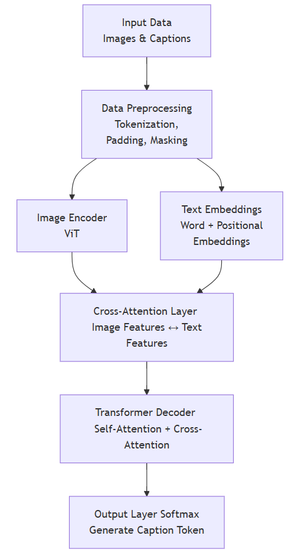
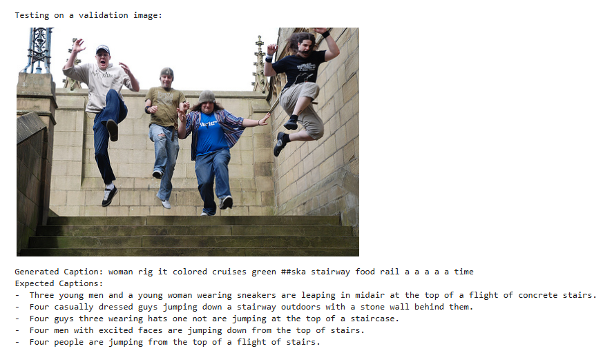

Hello everyone, in this blog, we dive deep into how **multimodal transformers** work, extending the traditional transformer architecture to handle both **text** and **image** inputs for image captioning tasks. We will explore the mathematical foundations, architectural components, theoretical underpinnings, and implementation details.


## **1. Introduction**

### **What is Multimodal Learning?**

Multimodal learning bridges the gap between different types of input data, such as text and images, enabling AI systems to perform sophisticated reasoning across modalities. Models like CLIP, Flamingo, and GPT-4 with Vision capabilities exemplify this advancement. These models are capable of intricate tasks like:

This paradigm has revolutionized artificial intelligence, empowering breakthroughs in:

- **Image Captioning**: Generating text that describes visual content.
- **Visual Question Answering (VQA)**: Answering textual questions based on an image.
- **Cross-Modal Retrieval**: Finding relevant text for a given image or vice versa.
- **Multimodal Reasoning**: Solving tasks that require simultaneous understanding of text and images.


The core idea behind multimodal LLMs is the **fusion** of information from different modalities using a shared transformer backbone. This allows the model to learn a unified representation that captures the semantic relationships between text and images.


### **Why Image Captioning?**

Image captioning is a critical task in multimodal AI, combining vision and language understanding. It requires:

1. **Image Processing**: Extracting meaningful features from the visual input.
2. **Language Generation**: Generating coherent, contextually relevant captions based on the extracted features.

### **Objective**

In this blog, we focus on building a multimodal transformer model designed for image captioning. The architecture integrates a Vision Transformer (ViT) for image feature extraction and a transformer-based decoder with cross-attention mechanisms to generate captions.

### **High-Level Diagram**

Below is a simplified diagram illustrating the flow of data through the system:




# **2. Mathematical Foundations of Multimodal Transformers**

Our multimodal transformer builds upon the standard transformer architecture, with modifications to handle both text and image inputs. This section explores the mathematical foundations of the model, including input representations, the core transformer operations, fusion mechanisms, and loss functions.

---

## **2.1 Input Representations**

Input representations transform raw text and image data into feature embeddings that the transformer can process. Below, we detail the operations for text and image inputs.

---

### **2.1.1 Text Input**

Textual inputs are sequences of words that are tokenized, embedded, and enriched with positional encodings to capture sequential information.

### **Tokenization**

Each word $$ x_i $$ in the input sentence is mapped to a unique token ID $$ t_i $$ using a tokenizer:

$$
T = [t_1, t_2, \ldots, t_n]
$$

Where $$ T $$ is the sequence of token IDs corresponding to the words in the sentence.


### **Word Embedding**

Tokens are converted into dense vector representations using an embedding matrix:

$$
E \in \mathbb{R}^{|V| \times d_e}
$$

where $$ \| V  \| $$ is the vocabulary size and $$ d_e $$ is the embedding dimension:

$$
e_i = E_{t_i}, \quad e_i \in \mathbb{R}^{d_e}
$$


### **Positional Encoding**

To encode positional information, a positional encoding $$ PE \in \mathbb{R}^{L \times d_e} $$ is added to the word embeddings:

$$
PE_{(pos, 2j)} = \sin\left(\frac{pos}{10000^{2j/d_e}}\right), \quad PE_{(pos, 2j+1)} = \cos\left(\frac{pos}{10000^{2j/d_e}}\right)
$$

Here:

- $$ pos $$: The position in the sequence.
- $$ j $$: The embedding dimension index.

### **Combined Text Representation**

The final representation of each word is the sum of its embedding and positional encoding:

$$
z^t_{0_i} = e_i + PE_i
$$

This vector is the input to the transformer layers for textual processing.

---

### **2.1.2 Image Input**

Images are divided into patches, transformed into embeddings using a Vision Transformer (ViT), and enriched with positional encodings to preserve spatial information.

### **Patch Extraction**

The input image $$ I \in \mathbb{R}^{H \times W \times C} $$ is divided into $$ N $$ non-overlapping patches of size $$ P \times P $$:

$$
N = \frac{H \times W}{P^2}
$$

Each patch $$ p_i $$ has dimensions $$ P \times P \times C $$.

### **Patch Embedding**

Patches are flattened and projected into a $$ d_f $$-dimensional feature space using a linear transformation $$ W^p $$:

$$
f_i = p_i \cdot W^p, \quad f_i \in \mathbb{R}^{d_f}
$$

### **Positional Encoding**

Each patch embedding is combined with a positional encoding $$ PE^v $$ to provide spatial context:

$$
z^v_{0_i} = f_i + PE^v_i
$$

### **Image Representation**

The set of patch embeddings forms the initial representation of the image:

$$
Z^v_0 = [z^v_{0_1}, z^v_{0_2}, \ldots, z^v_{0_N}]
$$

---

## **2.2 Transformer Architecture**

The core of the transformer architecture includes multi-head attention, feedforward layers, and normalization. These components are applied iteratively in both the encoder and decoder.

---

### **2.2.1 Self-Attention**

Self-attention enables the model to learn relationships between elements in a sequence.

### **Query, Key, Value Projections**

For input $$ z_i $$, compute queries $$ Q $$, keys $$ K $$, and values $$ V $$ using learned weight matrices 

$$ W^Q, W^K, W^V \in \mathbb{R}^{d \times d_k} $$:

$$
q_i = z_i W^Q, \quad k_i = z_i W^K, \quad v_i = z_i W^V
$$

### **Scaled Dot-Product Attention**

The attention scores are computed as:

$$
\text{Attention}(Q, K, V) = \text{softmax}\left(\frac{Q K^\top}{\sqrt{d_k}}\right) V
$$
Where:

- $$ Q $$: Queries matrix.
- $$ K $$: Keys matrix.
- $$ V $$: Values matrix.
- $$ d_k $$: Dimensionality of the keys.

---

### **2.2.2 Cross-Attention**

Cross-attention fuses information from text and image modalities.

### **Text Attending to Image**

Textual queries attend to image features as keys and values:

$$
\text{Attention}(Q^t, K^v, V^v) = \text{softmax}\left(\frac{Q^t (K^v)^\top}{\sqrt{d_k}}\right) V^v
$$

---

### **2.2.3 Feedforward Network**

Each transformer block includes a position-wise feedforward network:

$$
\text{FFN}(z) = \text{ReLU}(z W_1 + b_1) W_2 + b_2
$$

Where $$ W_1, W_2 $$ are learned weight matrices and $$ b_1, b_2 $$ are biases.

---

### **2.2.4 Layer Normalization and Residual Connections**

### **Layer Normalization**

Normalize inputs to stabilize training:

$$
\text{LayerNorm}(z) = \gamma \odot \frac{z - \mu}{\sigma} + \beta
$$

### **Residual Connections**

Add residual connections to improve gradient flow:

$$
z' = \text{LayerNorm}(z + \text{SubLayer}(z))
$$

---

## **2.3 Fusion Mechanisms for Multimodal Input**

To integrate text and image features, the model uses fusion mechanisms such as concatenation, cross-attention, and gating.

### **2.3.1 Concatenation**

Combine text and image features early:

$$
z_0 = [z^t_0; z^v_0]
$$

### **2.3.2 Cross-Attention**

Attend to one modality using features from another.

### **2.3.3 Gated Fusion**

Learn a gating function to weigh contributions from each modality:

$$
g = \sigma(W_g [z^t; z^v] + b_g)
$$

$$
z_{fused} = g \odot z^t + (1 - g) \odot z^v
$$

---

## **2.4 Output Layer**

### **2.4.1 Caption Generation**

For image captioning, use autoregressive decoding to predict one word at a time:

$$
P(y_t | y_{<t}, I) = \text{softmax}(h_t W^O + b^O)
$$

---

## **2.5 Loss Function**

### **Cross-Entropy Loss**

Compute the cross-entropy loss for caption generation:

$$
\mathcal{L}_{CE} = - \sum_t \log P(y^*_t | y^*_{<t}, I)
$$


This section provided a detailed overview of the mathematical foundations of multimodal transformers. These principles lay the groundwork for implementing and training a model capable of generating coherent captions for images. The next sections will demonstrate how to translate these ideas into Python code and train the model effectively.


## **3. Summary of the Model Structure**

### **3.1 Data Handling and Preprocessing**

* **`ImageCaptionDataset`:** A custom PyTorch dataset class that loads image-caption pairs. It handles image preprocessing using `torchvision.transforms` and text tokenization using a provided tokenizer. In this implementation, it leverages the `datasets` library to load the Flickr30k dataset.

  ```python
  class ImageCaptionDataset(Dataset):
      def __init__(self, images, captions, tokenizer, vocab, transform=None):
          self.images = images
          self.captions = captions
          self.tokenizer = tokenizer
          self.vocab = vocab
          self.transform = transform
  
      def __len__(self):
          return len(self.images)
  
      def __getitem__(self, idx):
          # Preprocess image
          image = self.images[idx].convert('RGB')
          if self.transform:
              image = self.transform(image)
  
          # Tokenize and vectorize caption
          caption_list = self.captions[idx]
          combined_caption = " ".join(caption_list)
          tokens = self.tokenizer.tokenize(str(combined_caption).lower())
          caption_vec = [self.vocab(self.tokenizer.cls_token)]
          caption_vec.extend([self.vocab(token) for token in tokens])
          caption_vec.append(self.vocab(self.tokenizer.sep_token))
          target = torch.LongTensor(caption_vec)
  
          return image, target
  
  ```

* **`Vocabulary`:** A class to build and manage a vocabulary from the training captions. It maps words to indices and vice-versa. It includes special tokens for padding, unknown words, start-of-sequence, and end-of-sequence.

  ```python
  class Vocabulary:
      def __init__(self, tokenizer):
          self.word2idx = {}
          self.idx2word = {}
          self.idx = 0
          self.tokenizer = tokenizer  # Store the tokenizer
  
      def add_word(self, word):
          if word not in self.word2idx:
              self.word2idx[word] = self.idx
              self.idx2word[self.idx] = word
              self.idx += 1
  
      def __call__(self, word):
          if word not in self.word2idx:
              return self.word2idx.get(self.tokenizer.unk_token, 0)  # Use tokenizer's unk_token
          return self.word2idx[word]
  
      def __len__(self):
          return len(self.word2idx)
  
  ```

* **`build_vocab`:** A function to create the `Vocabulary` object, filtering words based on a frequency threshold. This ensures that only frequent words are included in the vocabulary, reducing the impact of rare words.

  ```python
  def build_vocab(captions_list, threshold=1, tokenizer=None):
      if tokenizer is None:
          raise ValueError("A tokenizer must be provided to build the vocabulary.")
  
      # Count the frequency of each token
      counter = {}
      for captions in captions_list:
          for caption in captions:
              tokens = tokenizer.tokenize(str(caption).lower())
              for word in tokens:
                  counter[word] = counter.get(word, 0) + 1
  
      # Initialize the vocabulary
      vocab = Vocabulary(tokenizer)
  
      # Add special tokens from the tokenizer
      for special_token in [tokenizer.pad_token, tokenizer.unk_token, tokenizer.cls_token, tokenizer.sep_token]:
          if special_token is not None:
              vocab.add_word(special_token)
  
      # Add words that meet the frequency threshold
      words = [word for word, cnt in counter.items() if cnt >= threshold]
      for word in words:
          if word not in vocab.word2idx:  # Avoid duplicates
              vocab.add_word(word)
  
      return vocab
  ```

* **`custom_collate_fn`:** This function is crucial for creating batches of data during training. It pads captions to the same length within a batch using a padding token and creates a mask to distinguish between actual tokens and padding tokens.

  ```python
  def custom_collate_fn(batch):
      images, captions = zip(*batch)
  
      # Stack images into a batch tensor
      images = torch.stack(images)
  
      # Pad captions to the same length
      captions = [torch.tensor(caption) for caption in captions]
      captions_padded = pad_sequence(captions, batch_first=True, padding_value=0)  # Use padding token index (e.g., 0)
  
      # Create caption mask
      caption_mask = (captions_padded != 0)  # True for valid tokens, False for padding
  
      return images, captions_padded, caption_mask
  ```

### **3.2 Encoder (Image Feature Extraction)**

* **`EncoderViT`:** This class uses a pre-trained Vision Transformer (ViT) from the `transformers` library to extract features from the input images.

  *   **Feature Extraction:** It utilizes the `'google/vit-base-patch16-224-in21k'` model, a widely used ViT variant.
  *   **Freezing ViT Parameters:** The parameters of the ViT are frozen during training, meaning that the pre-trained weights are used without further fine-tuning.
  *   **Output Processing:** The output of the ViT (specifically, the `last_hidden_state` corresponding to the `[CLS]` token) is used as the image feature.
  *   **Linear Projection and Batch Normalization:** The extracted features are passed through a linear layer to project them to the desired embedding size (`embed_size`), followed by batch normalization.

  ```python
    
  class EncoderViT(nn.Module):
      def __init__(self, embed_size):
          super().__init__()
          self.vit = ViTModel.from_pretrained('google/vit-base-patch16-224-in21k')
          self.config = self.vit.config
          self.linear = nn.Linear(self.config.hidden_size, embed_size)
          self.bn = nn.BatchNorm1d(embed_size, momentum=0.01)
  
          for param in self.vit.parameters():
              param.requires_grad = False
  
      def forward(self, images):
          with torch.no_grad():
              features = self.vit(images).last_hidden_state
          features = features[:, 0, :]
          features = self.bn(self.linear(features))
          return features
  
  ```

### **3.3 Decoder (Caption Generation)**

* **`PositionalEncoding`:** This module adds positional encodings to the input embeddings. Positional encodings are essential in transformer models as they provide information about the order of words in a sequence, which is not inherently captured by the self-attention mechanism.

  ```python
    class PositionalEncoding(nn.Module):
        def __init__(self, embed_size, dropout_p=0.1, max_len=5000):
            super().__init__()
            self.dropout = nn.Dropout(p=dropout_p)
    
            pe = torch.zeros(max_len, embed_size)
            position = torch.arange(0, max_len, dtype=torch.float).unsqueeze(1)
            div_term = torch.exp(torch.arange(0, embed_size, 2).float() * (-math.log(10000.0) / embed_size))
            pe[:, 0::2] = torch.sin(position * div_term)
            pe[:, 1::2] = torch.cos(position * div_term)
            pe = pe.unsqueeze(0).transpose(0, 1)
            self.register_buffer('pe', pe)
    
        def forward(self, x):
            x = x + self.pe[:x.size(0), :]
            return self.dropout(x)
    ```

* **`FusionTransformer`:** This is the core of the decoder, responsible for generating captions based on image features.

  *   **Word Embeddings:** The input captions are first converted into numerical representations using an embedding layer (`nn.Embedding`).
  *   **Transformer Encoder:**  Defined but not explicitly used in the forward pass of this implementation.
  *   **Transformer Decoder:** Uses a standard transformer decoder architecture from `nn.TransformerDecoder`. It processes the combined features from the cross-attention layer.
      -   **`generate_square_subsequent_mask`:** Creates a mask to prevent the decoder from attending to future tokens during training. This is essential for autoregressive generation.
  *   **Cross-Attention Mechanism:** This is a key component that allows the model to attend to relevant parts of the image when generating each word of the caption.
      -   It uses `nn.MultiheadAttention` to perform cross-attention, where the queries come from the caption embeddings, and the keys and values come from the image features.
  *   **Output Layer:** A linear layer (`nn.Linear`) projects the decoder's output to the vocabulary size. During inference, a softmax function is applied to obtain probabilities for each word in the vocabulary.
  *   **`sample` method:** This method implements the caption generation process during inference. It starts with a start token and iteratively generates the next word by sampling from the probability distribution over the vocabulary, conditioned on the image features and previously generated words.

  ```python
  class FusionTransformer(nn.Module):
      def __init__(self, embed_size, num_heads, num_layers, vocab_size, vocab, tokenizer, dropout_p=0.1):
          super().__init__()
          self.embed_size = embed_size
          self.num_heads = num_heads
          self.num_layers = num_layers
          self.vocab_size = vocab_size
          self.vocab = vocab
          self.tokenizer = tokenizer
  
          # Positional Encoding
          self.pos_embed = PositionalEncoding(embed_size, dropout_p)
  
          # Word Embeddings
          self.word_embed = nn.Embedding(vocab_size, embed_size)
  
          # Transformer Components
          self.transformer_encoder = self._create_transformer_encoder(embed_size, num_heads, num_layers, dropout_p)
          self.transformer_decoder = self._create_transformer_decoder(embed_size, num_heads, num_layers, dropout_p)
  
          # Cross-Attention Layer
          self.cross_attention = nn.MultiheadAttention(embed_dim=embed_size, num_heads=num_heads, dropout=dropout_p, batch_first=True)
  
          # Output Layer
          self.fc_out = nn.Linear(embed_size, vocab_size)
  
      def _create_transformer_encoder(self, embed_size, num_heads, num_layers, dropout_p):
          encoder_layer = nn.TransformerEncoderLayer(
              d_model=embed_size, nhead=num_heads, dim_feedforward=embed_size * 4, dropout=dropout_p, batch_first=True
          )
          return nn.TransformerEncoder(encoder_layer, num_layers=num_layers)
  
      def _create_transformer_decoder(self, embed_size, num_heads, num_layers, dropout_p):
          decoder_layer = nn.TransformerDecoderLayer(
              d_model=embed_size, nhead=num_heads, dim_feedforward=embed_size * 4, dropout=dropout_p, batch_first=True
          )
          return nn.TransformerDecoder(decoder_layer, num_layers=num_layers)
  
      def forward(self, img_features, text_features, captions, caption_mask):
          # Positional Encoding for Captions
          captions = captions.clamp(0, self.vocab_size - 1)
          caption_embeddings = self.word_embed(captions) * math.sqrt(self.embed_size)
          caption_embeddings = self.pos_embed(caption_embeddings)
  
          # Cross-Attention
          # Query: Caption embeddings
          # Key & Value: Image features
          img_features = img_features.unsqueeze(1)  # Add sequence dimension if missing
          attended_features, _ = self.cross_attention(
              query=caption_embeddings,
              key=img_features,
              value=img_features,
              key_padding_mask=None  # Assuming all image features are valid
          )
  
          # Combine Attended Features with Captions for Decoding
          combined_features = attended_features + caption_embeddings
  
          tgt_mask = self.generate_square_subsequent_mask(captions.size(1)).to(captions.device)
          decoded_output = self.transformer_decoder(
              tgt=combined_features,
              memory=attended_features,
              tgt_mask=tgt_mask,
              tgt_key_padding_mask=~caption_mask.bool() if caption_mask is not None else None
          )
  
          return self.fc_out(decoded_output)
  
      def generate_square_subsequent_mask(self, sz):
          mask = torch.triu(torch.ones(sz, sz, device=self.fc_out.weight.device)) == 1
          mask = mask.float().masked_fill(~mask, float('-inf')).masked_fill(mask, float(0.0))
          return mask
  
      def sample(self, img_features, max_len=30):
          # Positional Encoding for Decoding
          start_token = torch.full(
              (img_features.size(0), 1),
              self.vocab(self.tokenizer.cls_token),
              dtype=torch.long,
              device=img_features.device
          )
          decoder_input = start_token
  
          sampled_ids = []
          for _ in range(max_len):
              tgt_mask = self.generate_square_subsequent_mask(decoder_input.size(1)).to(img_features.device)
              decoder_input_embedded = self.word_embed(decoder_input) * math.sqrt(self.embed_size)
              decoder_input_embedded = self.pos_embed(decoder_input_embedded)
  
              # Cross-Attention
              attended_features, _ = self.cross_attention(
                  query=decoder_input_embedded,
                  key=img_features.unsqueeze(1),
                  value=img_features.unsqueeze(1),
                  key_padding_mask=None
              )
  
              combined_features = attended_features + decoder_input_embedded
              decoded_output = self.transformer_decoder(
                  tgt=combined_features,
                  memory=attended_features,
                  tgt_mask=tgt_mask
              )
  
              output = self.fc_out(decoded_output[:, -1, :])
              probs = torch.softmax(output, dim=-1)
              predicted = torch.multinomial(probs, num_samples=1)
  
              decoder_input = torch.cat([decoder_input, predicted], dim=1)
              sampled_ids.append(predicted)
  
              if predicted.item() == self.vocab(self.tokenizer.sep_token):
                  break
  
          sampled_ids = torch.cat(sampled_ids, dim=1)  # Concatenate all sampled tokens along sequence dimension
          return sampled_ids
  
  ```


##  Setting Up Your Multimodal Playground

Multimodal AI is exploding!  Want to dive into this exciting world of combining text, images, and more?  First things first: a clean and organized environment. Conda to the rescue! 

Here's how to set up your `multimodal` playground:

**1. Create Your Conda Environment:**

Open your terminal and run:

```bash
conda create --name multimodal python=3.12 
```

This creates an environment named `multimodal` with Python 3.12 Feel free to adjust the Python version to your needs.

**2. Activate the Environment:**

```bash
conda activate multimodal
```

Now you're in your `multimodal` sandbox, ready to install packages without cluttering your main Python installation.

**3. Essential Tools:**

Let's install some key packages:

```bash
conda install jupyter notebook ipykernel  datasets matplotlib
```

* **Jupyter Notebook:** Your interactive coding environment.
* **ipykernel:**  Lets you use this environment as a kernel within Jupyter.

**4.  (Optional)  A Kernel with a View:**

Want to make your `multimodal` environment easily accessible from Jupyter?  Let's give it a name:

```bash
python -m ipykernel install --user --name multimodal --display-name "Multimodal" 
```

Now, when you launch Jupyter, you'll see "Multimodal" as an available kernel.

### Install libraries

```bash
conda install pytorch torchvision torchaudio pytorch-cuda=11.8 -c pytorch -c nvidia
```


## **4. Python Implementation**

Full ptyhon code

```python
import torch
import torch.nn as nn
from torch.utils.data import Dataset, DataLoader, random_split
from torchvision import transforms
from PIL import Image
from datasets import load_dataset
import math
from torch.nn.utils.rnn import pad_sequence
from transformers import BertTokenizer, ViTModel, BertModel
import matplotlib.pyplot as plt

# --- Data Loading and Preprocessing ---


def custom_collate_fn(batch):
    images, captions = zip(*batch)

    # Stack images into a batch tensor
    images = torch.stack(images)

    # Pad captions to the same length
    captions = [torch.tensor(caption) for caption in captions]
    captions_padded = pad_sequence(captions, batch_first=True, padding_value=0)  # Use padding token index (e.g., 0)

    # Create caption mask
    caption_mask = (captions_padded != 0)  # True for valid tokens, False for padding

    return images, captions_padded, caption_mask


class ImageCaptionDataset(Dataset):
    def __init__(self, images, captions, tokenizer, vocab, transform=None):
        self.images = images
        self.captions = captions
        self.tokenizer = tokenizer
        self.vocab = vocab
        self.transform = transform

    def __len__(self):
        return len(self.images)

    def __getitem__(self, idx):
        # Preprocess image
        image = self.images[idx].convert('RGB')
        if self.transform:
            image = self.transform(image)

        # Tokenize and vectorize caption
        caption_list = self.captions[idx]
        combined_caption = " ".join(caption_list)
        tokens = self.tokenizer.tokenize(str(combined_caption).lower())
        caption_vec = [self.vocab(self.tokenizer.cls_token)]
        caption_vec.extend([self.vocab(token) for token in tokens])
        caption_vec.append(self.vocab(self.tokenizer.sep_token))
        target = torch.LongTensor(caption_vec)

        return image, target


class Vocabulary:
    def __init__(self, tokenizer):
        self.word2idx = {}
        self.idx2word = {}
        self.idx = 0
        self.tokenizer = tokenizer  # Store the tokenizer

    def add_word(self, word):
        if word not in self.word2idx:
            self.word2idx[word] = self.idx
            self.idx2word[self.idx] = word
            self.idx += 1

    def __call__(self, word):
        if word not in self.word2idx:
            return self.word2idx.get(self.tokenizer.unk_token, 0)  # Use tokenizer's unk_token
        return self.word2idx[word]

    def __len__(self):
        return len(self.word2idx)


def build_vocab(captions_list, threshold=1, tokenizer=None):
    if tokenizer is None:
        raise ValueError("A tokenizer must be provided to build the vocabulary.")

    # Count the frequency of each token
    counter = {}
    for captions in captions_list:
        for caption in captions:
            tokens = tokenizer.tokenize(str(caption).lower())
            for word in tokens:
                counter[word] = counter.get(word, 0) + 1

    # Initialize the vocabulary
    vocab = Vocabulary(tokenizer)

    # Add special tokens from the tokenizer
    for special_token in [tokenizer.pad_token, tokenizer.unk_token, tokenizer.cls_token, tokenizer.sep_token]:
        if special_token is not None:
            vocab.add_word(special_token)

    # Add words that meet the frequency threshold
    words = [word for word, cnt in counter.items() if cnt >= threshold]
    for word in words:
        if word not in vocab.word2idx:  # Avoid duplicates
            vocab.add_word(word)

    return vocab


class EncoderViT(nn.Module):
    def __init__(self, embed_size):
        super().__init__()
        self.vit = ViTModel.from_pretrained('google/vit-base-patch16-224-in21k')
        self.config = self.vit.config
        self.linear = nn.Linear(self.config.hidden_size, embed_size)
        self.bn = nn.BatchNorm1d(embed_size, momentum=0.01)

        for param in self.vit.parameters():
            param.requires_grad = False

    def forward(self, images):
        with torch.no_grad():
            features = self.vit(images).last_hidden_state
        features = features[:, 0, :]
        features = self.bn(self.linear(features))
        return features


class PositionalEncoding(nn.Module):
    def __init__(self, embed_size, dropout_p=0.1, max_len=5000):
        super().__init__()
        self.dropout = nn.Dropout(p=dropout_p)

        pe = torch.zeros(max_len, embed_size)
        position = torch.arange(0, max_len, dtype=torch.float).unsqueeze(1)
        div_term = torch.exp(torch.arange(0, embed_size, 2).float() * (-math.log(10000.0) / embed_size))
        pe[:, 0::2] = torch.sin(position * div_term)
        pe[:, 1::2] = torch.cos(position * div_term)
        pe = pe.unsqueeze(0).transpose(0, 1)
        self.register_buffer('pe', pe)

    def forward(self, x):
        x = x + self.pe[:x.size(0), :]
        return self.dropout(x)


import math
import torch
import torch.nn as nn


class FusionTransformer(nn.Module):
    def __init__(self, embed_size, num_heads, num_layers, vocab_size, vocab, tokenizer, dropout_p=0.1):
        super().__init__()
        self.embed_size = embed_size
        self.num_heads = num_heads
        self.num_layers = num_layers
        self.vocab_size = vocab_size
        self.vocab = vocab
        self.tokenizer = tokenizer

        # Positional Encoding
        self.pos_embed = PositionalEncoding(embed_size, dropout_p)

        # Word Embeddings
        self.word_embed = nn.Embedding(vocab_size, embed_size)

        # Transformer Components
        self.transformer_encoder = self._create_transformer_encoder(embed_size, num_heads, num_layers, dropout_p)
        self.transformer_decoder = self._create_transformer_decoder(embed_size, num_heads, num_layers, dropout_p)

        # Cross-Attention Layer
        self.cross_attention = nn.MultiheadAttention(embed_dim=embed_size, num_heads=num_heads, dropout=dropout_p, batch_first=True)

        # Output Layer
        self.fc_out = nn.Linear(embed_size, vocab_size)

    def _create_transformer_encoder(self, embed_size, num_heads, num_layers, dropout_p):
        encoder_layer = nn.TransformerEncoderLayer(
            d_model=embed_size, nhead=num_heads, dim_feedforward=embed_size * 4, dropout=dropout_p, batch_first=True
        )
        return nn.TransformerEncoder(encoder_layer, num_layers=num_layers)

    def _create_transformer_decoder(self, embed_size, num_heads, num_layers, dropout_p):
        decoder_layer = nn.TransformerDecoderLayer(
            d_model=embed_size, nhead=num_heads, dim_feedforward=embed_size * 4, dropout=dropout_p, batch_first=True
        )
        return nn.TransformerDecoder(decoder_layer, num_layers=num_layers)

    def forward(self, img_features, text_features, captions, caption_mask):
        # Positional Encoding for Captions
        captions = captions.clamp(0, self.vocab_size - 1)
        caption_embeddings = self.word_embed(captions) * math.sqrt(self.embed_size)
        caption_embeddings = self.pos_embed(caption_embeddings)

        # Cross-Attention
        # Query: Caption embeddings
        # Key & Value: Image features
        img_features = img_features.unsqueeze(1)  # Add sequence dimension if missing
        attended_features, _ = self.cross_attention(
            query=caption_embeddings,
            key=img_features,
            value=img_features,
            key_padding_mask=None  # Assuming all image features are valid
        )

        # Combine Attended Features with Captions for Decoding
        combined_features = attended_features + caption_embeddings

        tgt_mask = self.generate_square_subsequent_mask(captions.size(1)).to(captions.device)
        decoded_output = self.transformer_decoder(
            tgt=combined_features,
            memory=attended_features,
            tgt_mask=tgt_mask,
            tgt_key_padding_mask=~caption_mask.bool() if caption_mask is not None else None
        )

        return self.fc_out(decoded_output)

    def generate_square_subsequent_mask(self, sz):
        mask = torch.triu(torch.ones(sz, sz, device=self.fc_out.weight.device)) == 1
        mask = mask.float().masked_fill(~mask, float('-inf')).masked_fill(mask, float(0.0))
        return mask

    def sample(self, img_features, max_len=30):
        # Positional Encoding for Decoding
        start_token = torch.full(
            (img_features.size(0), 1),
            self.vocab(self.tokenizer.cls_token),
            dtype=torch.long,
            device=img_features.device
        )
        decoder_input = start_token

        sampled_ids = []
        for _ in range(max_len):
            tgt_mask = self.generate_square_subsequent_mask(decoder_input.size(1)).to(img_features.device)
            decoder_input_embedded = self.word_embed(decoder_input) * math.sqrt(self.embed_size)
            decoder_input_embedded = self.pos_embed(decoder_input_embedded)

            # Cross-Attention
            attended_features, _ = self.cross_attention(
                query=decoder_input_embedded,
                key=img_features.unsqueeze(1),
                value=img_features.unsqueeze(1),
                key_padding_mask=None
            )

            combined_features = attended_features + decoder_input_embedded
            decoded_output = self.transformer_decoder(
                tgt=combined_features,
                memory=attended_features,
                tgt_mask=tgt_mask
            )

            output = self.fc_out(decoded_output[:, -1, :])
            probs = torch.softmax(output, dim=-1)
            predicted = torch.multinomial(probs, num_samples=1)

            decoder_input = torch.cat([decoder_input, predicted], dim=1)
            sampled_ids.append(predicted)

            if predicted.item() == self.vocab(self.tokenizer.sep_token):
                break

        sampled_ids = torch.cat(sampled_ids, dim=1)  # Concatenate all sampled tokens along sequence dimension
        return sampled_ids


def main():
    import torch
    import torch.nn as nn
    from torch.utils.data import DataLoader, random_split
    from torchvision import transforms
    from datasets import load_dataset
    from transformers import BertTokenizer
    import pickle
    import nltk

    # Hyperparameters
    embed_size = 256
    num_heads = 8
    num_layers = 3
    dropout_p = 0.1
    num_epochs = 50
    learning_rate = 1e-4
    padding_token_index = 0
    batch_size = 4

    # Initialize the tokenizer
    tokenizer = BertTokenizer.from_pretrained("bert-base-uncased")

    # Load dataset and increase image range
    flickr_dataset = load_dataset("nlphuji/flickr30k", split="test").select(range(20))
    captions_list = [item["caption"] for item in flickr_dataset]
    vocab = build_vocab(captions_list, threshold=1, tokenizer=tokenizer)

    # Save the vocabulary
    with open("vocab.pkl", "wb") as f:
        pickle.dump(vocab, f)
    print("Vocabulary saved.")

    vocab_size = len(vocab)
    fusion_transformer = FusionTransformer(embed_size, num_heads, num_layers, vocab_size, vocab, tokenizer, dropout_p).cuda()

    # Loss and Optimizer
    criterion = nn.CrossEntropyLoss(ignore_index=padding_token_index)
    optimizer = torch.optim.Adam(fusion_transformer.parameters(), lr=learning_rate)

    # Split the dataset
    train_size = int(0.8 * len(flickr_dataset))
    val_size = int(0.1 * len(flickr_dataset))
    test_size = len(flickr_dataset) - train_size - val_size

    train_val_dataset, test_dataset = random_split(flickr_dataset, [train_size + val_size, test_size])
    train_dataset_raw, val_dataset_raw = random_split(train_val_dataset, [train_size, val_size])

    def extract_data(dataset):
        images = []
        captions = []
        for i in range(len(dataset)):
            try:
                image = dataset[i]["image"]
                caption_list = dataset[i]["caption"]
                images.append(image)
                captions.append(caption_list)
            except Exception as e:
                print(f"Error processing item {i}: {e}")
        return images, captions

    train_images, train_captions = extract_data(train_dataset_raw)
    val_images, val_captions = extract_data(val_dataset_raw)
    test_images, test_captions = extract_data(test_dataset)

    transform = transforms.Compose([
        transforms.Resize((224, 224)),
        transforms.ToTensor(),
        transforms.Normalize(mean=[0.485, 0.456, 0.406], std=[0.229, 0.224, 0.225]),
    ])

    train_dataset = ImageCaptionDataset(train_images, train_captions, tokenizer, vocab, transform)
    train_loader = DataLoader(train_dataset, batch_size=batch_size, shuffle=True, collate_fn=custom_collate_fn)

    encoder = EncoderViT(embed_size).cuda()

    for epoch in range(num_epochs):
        fusion_transformer.train()
        for i, (images, captions, caption_mask) in enumerate(train_loader):
            img_features = encoder(images.cuda())
            outputs = fusion_transformer(img_features, img_features, captions.cuda(), caption_mask.cuda())
            outputs = outputs.view(-1, outputs.size(-1))
            targets = captions.view(-1).cuda()

            loss = criterion(outputs, targets)
            optimizer.zero_grad()
            loss.backward()
            optimizer.step()

            if (i + 1) % 1 == 0:
                print(f'Epoch: {epoch+1}/{num_epochs}, Batch: {i+1}/{len(train_loader)}, Batch Loss: {loss.item():.4f}')

    torch.save(fusion_transformer, "fusion_transformer.pth")
    print("Model and vocabulary saved.")


def evaluate_model():
    import torch
    import matplotlib.pyplot as plt
    from torchvision import transforms
    from datasets import load_dataset

    # Load the entire model (vocabulary and tokenizer are included)
   

    fusion_transformer = torch.load("fusion_transformer.pth")
    fusion_transformer.eval()

    vocab = fusion_transformer.vocab  # Access vocabulary from the model
    tokenizer = fusion_transformer.tokenizer  # Access tokenizer from the model
    fusion_transformer.eval()
    print("Model and vocabulary loaded.")

    # Load dataset and split
    flickr_dataset = load_dataset("nlphuji/flickr30k", split="test").select(range(20))

    train_size = int(0.8 * len(flickr_dataset))
    val_size = int(0.1 * len(flickr_dataset))
    test_size = len(flickr_dataset) - train_size - val_size

    train_val_dataset, test_dataset = random_split(flickr_dataset, [train_size + val_size, test_size])
    train_dataset_raw, val_dataset_raw = random_split(train_val_dataset, [train_size, val_size])

    def extract_data(dataset):
        images = []
        captions = []
        for i in range(len(dataset)):
            try:
                image = dataset[i]["image"]
                caption_list = dataset[i]["caption"]
                images.append(image)
                captions.append(caption_list)
            except Exception as e:
                print(f"Error processing item {i}: {e}")
        return images, captions

    # Extract images and captions
    train_images, train_captions = extract_data(train_dataset_raw)
    val_images, val_captions = extract_data(val_dataset_raw)
    test_images, test_captions = extract_data(test_dataset)

    def get_sentence_from_ids(word_ids, vocab):
        return ' '.join([
            vocab.idx2word.get(word_id.item(), tokenizer.unk_token)
            for word_id in word_ids
            if word_id not in [vocab(tokenizer.pad_token), vocab(tokenizer.cls_token), vocab(tokenizer.sep_token)]
        ])


    def test_model_on_image(encoder, fusion_transformer, image_source, image_index, vocab, device, transform, max_len=20):
        if image_source == 'train':
            images = train_images
            captions = train_captions
        elif image_source == 'val':
            images = val_images
            captions = val_captions
        elif image_source == 'test':
            images = test_images
            captions = test_captions
        else:
            raise ValueError("Invalid image_source. Must be 'train', 'val', or 'test'")

        if image_index >= len(images):
            raise IndexError(f"Image index {image_index} is out of range for {image_source} set with {len(images)} images.")

        image = images[image_index]
        plt.imshow(image)
        plt.axis("off")
        plt.show()

        image = image.convert('RGB')
        if transform is None:
            transform = transforms.Compose([
                transforms.Resize((224, 224)),
                transforms.ToTensor(),
                transforms.Normalize(mean=[0.485, 0.456, 0.406], std=[0.229, 0.224, 0.225]),
            ])
        image_tensor = transform(image).unsqueeze(0).to(device)

        encoder.eval()
        fusion_transformer.eval()
        with torch.no_grad():
            img_features = encoder(image_tensor)
            sampled_ids = fusion_transformer.sample(img_features, max_len=max_len)  # Fixed here

        generated_caption = get_sentence_from_ids(sampled_ids.squeeze(), vocab)
        print("Generated Caption:", generated_caption)

        print("Expected Captions:")
        for cap in captions[image_index]:
            print("- ", cap)


    encoder = EncoderViT(embed_size=256).cuda()
    device = torch.device("cuda" if torch.cuda.is_available() else "cpu")
    transform = transforms.Compose([
        transforms.Resize((224, 224)),
        transforms.ToTensor(),
        transforms.Normalize(mean=[0.485, 0.456, 0.406], std=[0.229, 0.224, 0.225]),
    ])

    print("Testing on a training image:")
    test_model_on_image(encoder, fusion_transformer, 'train', 0, vocab, device, transform)

    print("\nTesting on a validation image:")
    test_model_on_image(encoder, fusion_transformer, 'val', 0, vocab, device, transform)

    print("\nTesting on a test image:")
    test_model_on_image(encoder, fusion_transformer, 'test', 0, vocab, device, transform)


if __name__ == "__main__":
    import nltk
    nltk.download('punkt')
    nltk.download('wordnet')
    main()
    evaluate_model()


```


## **4. Example: Training and Generation**

### **4.1 Training the Model**

To train the model, execute the `main()` function in the provided code. Below are the essential steps:

1. **Initialization**:
   - Define hyperparameters like `embed_size`, `num_heads`, `num_layers`, `learning_rate`, `batch_size`, and `num_epochs`.
   - Initialize the `BertTokenizer` for text processing.
   - Load the Flickr30k dataset using the `datasets` library (note: the reduced dataset size for quick testing).
   - Build the vocabulary using the `build_vocab` function.
   - Initialize the `EncoderViT` and `FusionTransformer` models.
   - Set up the loss function (`nn.CrossEntropyLoss`) and optimizer (`torch.optim.Adam`).

2. **Data Loading**:
   - Split the dataset into training, validation, and test sets using `random_split`.
   - Use `DataLoader` to prepare batches with the custom collate function.

3. **Training Loop**:
   - Iterate through the dataset for the specified number of epochs.
   - For each batch, extract image features, predict captions, calculate loss, and backpropagate.
   - Save the model after each epoch.

4. **Model Saving**:
   - Save the trained model as `fusion_transformer.pth`.

```python
# Example training snippet
for epoch in range(num_epochs):
    for i, (images, captions, caption_mask) in enumerate(train_loader):
        # Extract image features
        img_features = encoder(images.cuda())
        # Predict captions
        outputs = fusion_transformer(img_features, img_features, captions.cuda(), caption_mask.cuda())
        # Calculate loss
        loss = criterion(outputs.view(-1, outputs.size(-1)), captions.view(-1).cuda())
        optimizer.zero_grad()
        loss.backward()
        optimizer.step()

    # Save model
    torch.save(fusion_transformer, "fusion_transformer.pth")
```

### **4.2 Generating Captions**

After training, the `evaluate_model()` function demonstrates how to use the model to generate captions:

1. **Model Loading**:
   - Load the saved `FusionTransformer` and vocabulary.

2. **Inference**:
   - Use `test_model_on_image` to evaluate a sample image:
     - Preprocess the image.
     - Extract image features with `EncoderViT`.
     - Generate captions using `FusionTransformer.sample()`.
     - Convert token IDs to text and display the caption.

```python
# Caption generation example
with torch.no_grad():
    img_features = encoder(image_tensor)
    sampled_ids = fusion_transformer.sample(img_features, max_len=20)
    generated_caption = get_sentence_from_ids(sampled_ids.squeeze(), vocab)
```

---


Example of evaluation 




## **5. Evaluation**

The current implementation provides qualitative evaluation by comparing generated captions with ground truth for a few images. To comprehensively evaluate the model, consider using established metrics:

### **5.1 Quantitative Metrics**

- **BLEU**: Evaluates n-gram overlap between generated and reference captions.
- **METEOR**: Considers synonyms and paraphrasing for a more robust evaluation.
- **ROUGE**: Measures recall of n-grams in the generated captions.
- **CIDEr**: Focuses on consensus-based evaluation by comparing captions to human-generated ones.
- **SPICE**: Assesses the semantic content of captions using scene graphs.

### **5.2 Implementing Metrics**

Use libraries like `pycocoevalcap` to compute these metrics. Below is an example of integrating BLEU evaluation:

```python
from pycocoevalcap.bleu.bleu import Bleu

def evaluate_bleu(encoder, fusion_transformer, data_loader, vocab, device, bleu_n=4):
    bleu_scores = []
    for images, captions, caption_mask in data_loader:
        img_features = encoder(images.to(device))
        sampled_ids = fusion_transformer.sample(img_features)
        for sampled_id, ref_captions in zip(sampled_ids, captions):
            gen_caption = get_sentence_from_ids(sampled_id.squeeze(), vocab)
            ref_captions = [ref.split() for ref in ref_captions]
            gen_caption_tokens = gen_caption.split()
            bleu_scorer = Bleu(bleu_n)
            score, _ = bleu_scorer.compute_score({0: ref_captions}, {0: [gen_caption_tokens]})
            bleu_scores.append(score[-1])  # BLEU-N score

    return sum(bleu_scores) / len(bleu_scores) if bleu_scores else 0
```

---

## **6. Conclusion**

This blog explored the development of a multimodal image captioning model leveraging transformers and vision-based encoders. We covered:

- **Model Architecture**: Combining `EncoderViT` for image features with a `FusionTransformer` for text generation.
- **Training Pipeline**: Preparing data, training with cross-entropy loss, and saving models.
- **Evaluation**: Highlighting qualitative and quantitative assessments.

### **Future Enhancements**

- **Advanced Decoding**: Implement beam search for improved caption quality.
- **Attention Insights**: Visualize attention maps for better interpretability.
- **Data Augmentation**: Increase robustness with augmented training data.
- **Larger Datasets**: Scale up training with datasets like COCO Captions.

If you liked this blog, you can give me a star and download the notebook in this repository [here](https://github.com/ruslanmv/Multimodal-Image-Captioning).

If you're curious about exploring a different method with Deep Learning, you can check out this blog post: [Creating a Robust Multimodal System for Image Captioning Using Deep Learning](https://ruslanmv.com/blog/Building-a-Multimodal-Model-for-Image-Captioning-with-Deep-Learning).


**Congratulations!**With this framework, you are equipped to further innovate in the field of multimodal learning. Explore, experiment, and push the boundaries of what's possible!
