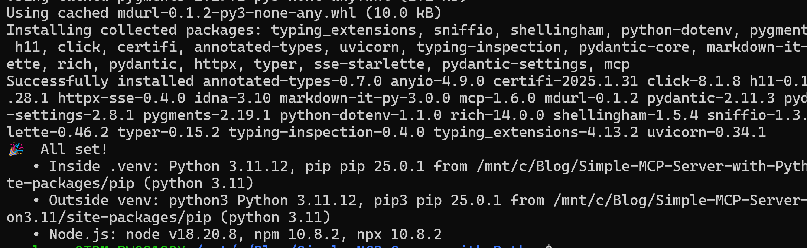
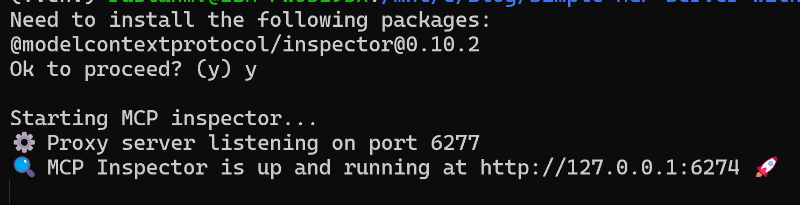
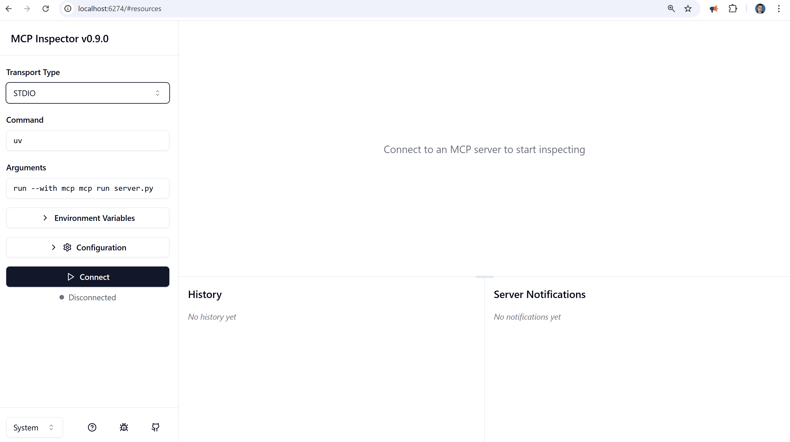
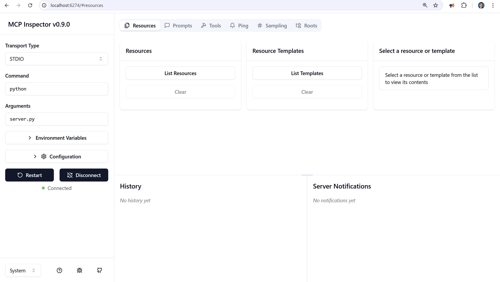
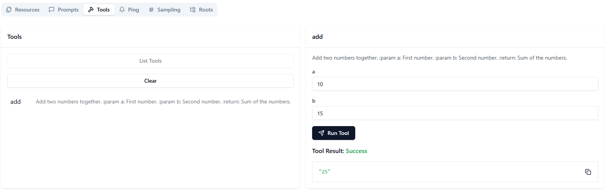
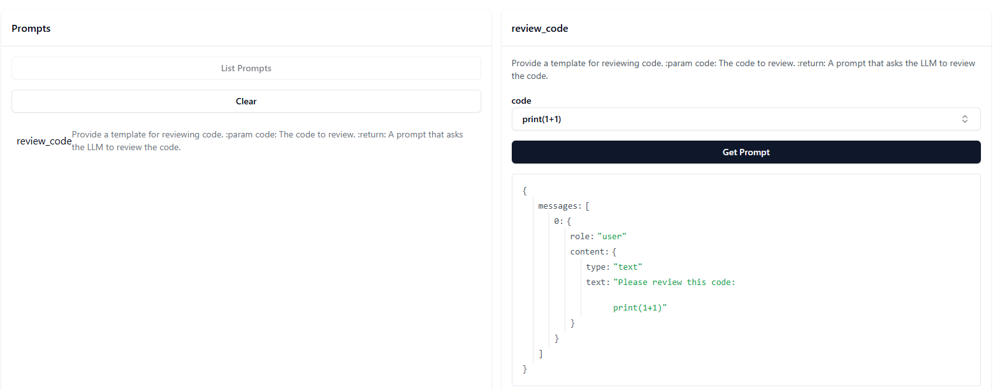
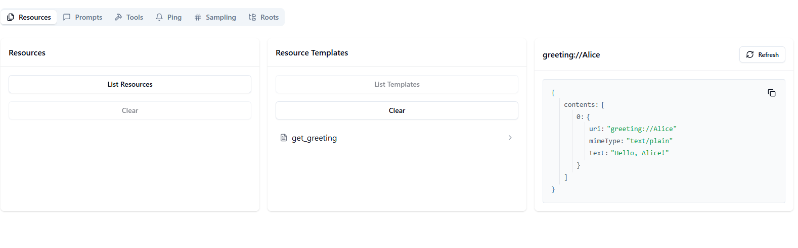

The Model Context Protocol (MCP) is a standardized way to supply context to large language models (LLMs). Using the MCP Python SDK, you can build servers that expose data (resources), functionality (tools), and interaction templates (prompts) to LLM applications in a secure and modular fashion. In this tutorial, we’ll build a simple MCP server in Python step by step.


## Introduction

The Model Context Protocol (MCP) standardizes the interface between applications and LLMs. With MCP, you can separate the concerns of providing context, executing code, and managing user interactions. The MCP Python SDK implements the full MCP specification, allowing you to:

- **Expose Resources:** Deliver data to LLMs (similar to GET endpoints).
- **Define Tools:** Provide functionality that performs actions or computations (like POST endpoints).
- **Create Prompts:** Offer reusable, templated interactions.

##  MCP Primitives

Every MCP server can implement three core primitives. These define **who controls** the invocation and **what role** each primitive plays:

| Primitive     | Control                | Description                                       | Example Use                  |
| ------------- | ---------------------- | ------------------------------------------------- | ---------------------------- |
| **Prompts**   | User‑controlled        | Interactive templates invoked by user choice      | Slash commands, menu options |
| **Resources** | Application‑controlled | Contextual data managed by the client application | File contents, API responses |
| **Tools**     | Model‑controlled       | Functions exposed to the LLM to take actions      | API calls, data updates      |

- **Prompts** let you define _structured_ conversation starters.  
- **Resources** are like read‑only data endpoints for the LLM’s context.  
- **Tools** enable the LLM to do things—calculate, fetch, update.

---

## Server Capabilities

During initialization, an MCP server advertises which features it supports. Clients (and front‑ends) can adapt dynamically based on these flags:

| Capability     | Feature Flag                 | Description                        |
| -------------- | ---------------------------- | ---------------------------------- |
| **prompts**    | `listChanged`                | Prompt template management         |
| **resources**  | `subscribe`<br>`listChanged` | Resource exposure and live updates |
| **tools**      | `listChanged`                | Tool discovery and execution       |
| **logging**    | –                            | Server logging configuration       |
| **completion** | –                            | Argument completion suggestions    |

- **`listChanged`** signals that the set of available prompts/resources/tools can change at runtime.  
- **`subscribe`** lets clients register for updates when resource data changes.  
- **`logging`** and **`completion`** are simple toggles for debug output and autocomplete help.


This tutorial will guide you through creating a simple MCP server using the MCP Python SDK.

## Prerequisites

Before you begin, ensure you have the following installed:

- **Python 3.7+** (preferably 3.11 or higher)
- **pip** – the Python package installer
- **Node.js 18.x** 

You will also need to install the MCP Python SDK. You have two options:

- **Using pip directly:**

  ```bash
  pip install "mcp[cli]"
  ```

- **Using `uv`:**  
  If you are managing your project with [uv](https://github.com/uv-org/uv), initialize your project and add MCP as a dependency.

  ```bash
  uv init mcp-server
  cd mcp-server
  uv add "mcp[cli]"
  ```

For more detailed installation instructions, please check the [MCP Python SDK documentation](https://pypi.org/project/mcp/).


##   Setting Up Your Environment 

This section details how to set up your development environment on Ubuntu 22.04 using Python 3.11, ensuring you have the correct Python version and the MCP Python SDK installed.

**Option 1: Manual Installation**

If you prefer a step-by-step approach, follow these instructions:

1. **Add the `deadsnakes` PPA:** This repository provides more recent Python versions for Ubuntu.

   ```bash
   sudo add-apt-repository ppa:deadsnakes/ppa -y
   ```

2. **Update package lists:**

   ```bash
   sudo apt update
   ```

3. **Install Python 3.11 and essential tools:**

   ```bash
   sudo apt install -y python3.11 python3.11-venv python3.11-distutils python3-apt
   ```

   * `python3.11`: The Python 3.11 interpreter.
   * `python3.11-venv`: The virtual environment module for Python 3.11.
   * `python3.11-distutils`: Essential tools for building and installing Python packages.
   * `python3-apt`: A Python interface to the APT package management system (helps resolve potential dependency issues).

4. **Set Python 3.11 as the default `python3` (optional but recommended):** This simplifies using Python 3.11 without needing to specify `python3.11` every time.

   ```bash
   sudo update-alternatives --install /usr/bin/python3 python3 /usr/bin/python3.10 1
   sudo update-alternatives --install /usr/bin/python3 python3 /usr/bin/python3.11 2
   sudo update-alternatives --config python3
   ```

   You will be prompted to select the default Python 3 version. Choose Python 3.11.

5. **Install `pip` for Python 3.11:** `pip` is the package installer for Python.

   ```bash
   curl -sS https://bootstrap.pypa.io/get-pip.py | sudo python3.11
   ```

6. **Verify Python and pip versions:**

   ```bash
   python3 --version
   python3 -m pip --version
   ```

   Confirm that the output shows Python 3.11 and a recent version of pip.

7. Setting up NodeSource for Node.js 18.x…

```bash
curl -fsSL https://deb.nodesource.com/setup_18.x | sudo -E bash -
```

Installing Node.js (with npm & npx)…"

```bash
sudo apt-get update
sudo apt-get install -y nodejs
```

9. **Create and activate a virtual environment:** Using a virtual environment isolates your project's dependencies.

   ```bash
   python3 -m venv .venv
   source .venv/bin/activate
   ```

   A `.venv` directory will be created in your project, and your terminal prompt will change to `(.venv)`, indicating that the environment is active.

10. **Upgrade `pip` within the virtual environment:**

    ```bash
    pip install --upgrade pip
    ```

11. **Install the MCP Python SDK:** Create a file named `requirements.txt` in your project directory with the following content:

    ```
    mcp[cli]
    ```

    Then, install the SDK using pip:

    ```bash
    pip install -r requirements.txt
    ```

**Option 2: Using the `install.sh` Script**

For a more automated setup, you can use the provided `install.sh` script.

1. **Save the script:** Ensure the script you provided earlier is saved as `install.sh` in your project directory.

2. **Make the script executable:** Open your terminal, navigate to your project directory, and run:

   ```bash
   chmod +x install.sh
   ```

3. **Run the script:** Execute the script:

   ```bash
   bash install.sh
   ```

   The `install.sh` script automates the manual installation steps:

   * Adds the `deadsnakes` PPA and updates package lists.
   * Installs Python 3.11 and necessary tools.
   * Sets Python 3.11 as the default `python3`.
   * Installs `pip` for Python 3.11.
   * Creates and activates a virtual environment named `.venv`.
   * Upgrades `pip` within the virtual environment.
   * Install  Node.js: node v18.20.8
   * Installs the MCP Python SDK from `requirements.txt` (if the file exists).
     

**Important Notes:**

* Regardless of the method you choose, make sure to activate the virtual environment (`source .venv/bin/activate`) every time you work on your project in a new terminal session. This ensures you are using the correct Python version and have access to the installed MCP SDK.
* The `install.sh` script is designed for Ubuntu 22.04. If you are using a different operating system or distribution, you might need to adjust the script accordingly.
* The `requirements.txt` file is crucial for managing your project's dependencies. Always keep it updated with the necessary packages.

With your environment set up, you're ready to create your MCP server!

---

## Setting Up Your Project

Create a new directory for your project and navigate into it. Then, create a file called `server.py` in the root of your project.

Your project structure should look like this:

```
mcp-server/
├── server.py
└── (other files such as .env, README.md, etc. as needed)
```

## Creating Your MCP Server

In this section, we will create a simple MCP server that exposes a calculator tool and a dynamic greeting resource. You can later extend this to add more functionality using prompts or additional tools.

### Defining Tools

Tools are functions that perform computations or side effects. In this example, we’ll define a simple addition tool.

Open `server.py` and add the following code:

```python
# server.py
from mcp.server.fastmcp import FastMCP

# Create an MCP server instance with a custom name.
mcp = FastMCP("Demo Server")

# Add a calculator tool: a simple function to add two numbers.
@mcp.tool()
def add(a: int, b: int) -> int:
    """
    Add two numbers together.
    
    :param a: First number.
    :param b: Second number.
    :return: Sum of the numbers.
    """
    return a + b
```

### Exposing Resources

Resources provide data that can be loaded into an LLM’s context. Here, we define a resource that returns a personalized greeting.

Add the following code to `server.py`:

```python
# Expose a greeting resource that dynamically constructs a personalized greeting.
@mcp.resource("greeting://{name}")
def get_greeting(name: str) -> str:
    """
    Return a greeting for the given name.
    
    :param name: The name to greet.
    :return: A personalized greeting.
    """
    return f"Hello, {name}!"
```

### Adding Prompts (Optional)

Prompts allow you to supply reusable templates for interactions. For example, you can add a prompt to review code.

Add the following code if desired:

```python
from mcp.server.fastmcp.prompts import base

@mcp.prompt()
def review_code(code: str) -> str:
    """
    Provide a template for reviewing code.
    
    :param code: The code to review.
    :return: A prompt that asks the LLM to review the code.
    """
    return f"Please review this code:\n\n{code}"
```

## Running Your MCP Server

First, make sure your Python virtual environment is activated by running:

```bash
source .venv/bin/activate
```

This should be done in the root directory of your project. Then, change into your MCP server folder:

```bash
cd mcp-server
```

With your server defined in `server.py`, you can now run it. There are several ways to run an MCP server depending on your goals — development, debugging, integration, or deployment.

##  The Best Way to Run and Test Your Server: Use `mcp dev`

The easiest way to interact with your MCP server is using the built-in **MCP Inspector**, which gives you a visual UI in the browser.

For development and testing, the MCP Development Inspector provides an intuitive web interface to interact with your server.

#### 1. Start Your Server in Development Mode

In your terminal, run:

```bash
mcp dev server.py
```

This command launches your MCP server and typically opens the Inspector in your web browser. You'll see your "Demo Server" and the exposed tools (`add`), resources (`greeting`), and prompts (`review_code`).

1. **Start your server with the Inspector:**

   ```bash
   mcp dev server.py
   ```

2. It  performs several important tasks:

- **Starts your MCP server** using the default STDIO transport.
- **Enables live reloading,** so your code updates are applied immediately without needing to restart the server.
- **Launches the MCP Inspector interface,** a web-based UI available at `http://localhost:6274/`, where you can explore and test all the functionalities of your server.

After running the command, your terminal output should resemble:



This output confirms that the Inspector is active and ready for interaction.

1. In the UI, you can:
   - Test the `add(a, b)` tool
   - Use `greeting://John` to test the resource
   - Review code with the `review_code` prompt



> 💡 If any packages are missing, `mcp dev` will help you install them automatically.

## Navigating the MCP Inspector Interface

#### 2. Interact Through the Inspector

When you open the Inspector in your browser, you will notice several key sections designed to facilitate server testing.


Go to the top of the MCP Inspector interface where it shows:

```
Transport Type: STDIO  
Command: python  
Arguments: run --with mcp mcp run server.py
```

Due to in our `server.py` is a standalone script  using a normal `pip`-based virtual environment, we need to correct configuration in the MCP Inspector to:

```
Transport Type: STDIO  
Command: python  
Arguments: server.py
```

Then click **Connect**  and  our server will be launched properly using the Python interpreter.


 


## Example Usage: Testing the "Add" Tool

* **Call a Tool (`add`):** Navigate to the `add` tool in the Inspector.

Consider the following scenario while working with our  example (which registers an addition tool, a greeting resource, and a code review prompt):

1. **Accessing the Tools Tab:**  
   With the MCP Inspector loaded, navigate to the **Tools** tab. Click `List Tools`. Here, you will see a list of all registered tools from your server. In our case, one of the entries is the `add` tool.

2. **Testing the "Add" Functionality:**  
   Click on the `add` tool from the list. The Inspector displays the input schema for the tool, prompting you for two numbers (for example, parameters `a` and `b`).  
   - **Input Parameters:** Enter `a = 10` and `b = 15`.
   - **Execution:** Click the execute button in the Inspector’s execution panel.


3. **Reviewing the Output:**  
   Once executed, the Inspector immediately displays the result of the operation. You should see that the sum is returned as `25`.  
   This immediate feedback loop shows how you can quickly verify that your tool’s logic is working as expected without leaving the development interface.



##   Using the `review_code` Prompt via the MCP Inspector

- In the Inspector’s sidebar, expand **Prompts** → **List prompts**.  

- You should see **`review_code`** listed:

  > **review_code**  

In the prompt pane you’ll find a form or JSON editor ready to accept arguments.  

2. Supply the `code` parameter.
   For example:

```
print(1+1)
```

Hit **Run Tool** .

### Viewing the Generated Prompt

The Inspector will display the output:

```json
{
  "messages": [
    {
      "role": "user",
      "content": {
        "type": "text",
        "text": "Please review this code:\n\nprint(1+1)"
      }
    }
  ]
}
```



## Accessing a Resource (`greeting://Alice`)

Once your server is up and running in the Inspector (using the setup from above), you can invoke any registered resource by its URI:

### 1. Open the Resource Interaction Pane  

- In the MCP Inspector sidebar, click **Resources** → **Resource Templates**.
  click `List templates` and select
  `get_greeting`

### 2. Enter the Resource URI  

- In the input field name, type:  

```
Alice
```

### 3. Invoke the Resource  

- Click **Read Resource**.  
- The Inspector will send that URI to your `@mcp.resource("greeting://{name}")` handler.

### 4. View the Response  

- You should see:

```json
{
  "contents": [
    {
      "uri": "greeting://Alice",
      "mimeType": "text/plain",
      "text": "Hello, Alice!"
    }
  ]
}
```

- This confirms your dynamic greeting resource is wired up correctly and returns personalized output on demand.




The MCP Inspector acts as a user-friendly client, handling the underlying protocol communication for you.


##  What’s Happening with `python server.py`

Your code is correct, but when you run:

```bash
python server.py
```

…it looks like nothing happens. That’s because your server is using **`stdio` (standard input/output)** as the default **transport**, and it just sits silently **waiting for a client** to connect and send it a request.

This is normal! But you need the **right interface** to interact with it.


### 🐍 Using a Python MCP Client (`client.py`)

For programmatic interaction, you can use the `mcp` Python SDK to create a client. Your provided `client.py` is a correct example of this:

```python
# client.py
import asyncio
from mcp import ClientSession, StdioServerParameters
from mcp.client.stdio import stdio_client

async def main():
    server_params = StdioServerParameters(
        command="python",
        args=["server.py"],
    )

    async with stdio_client(server_params) as (reader, writer):
        async with ClientSession(reader, writer) as session:
            await session.initialize()

            result = await session.call_tool("add", arguments={"a": 3, "b": 4})
            print(f"Result of add tool: {result}")

if __name__ == "__main__":
    asyncio.run(main())
```

**To run this client:**

1. **Start your server:**

   ```bash
   python server.py
   ```

2. **Run the client in a separate terminal:**

```bash
    python client.py
```

The output will be:

```
[your log output indicating the tool call]
Result of add tool: meta=None content=[TextContent(type='text', text='7', annotations=None)] isError=False
```

This demonstrates how a Python client can connect to your server and invoke tools programmatically.

You can download the full codes [here](https://github.com/ruslanmv/Simple-MCP-Server-with-Python/tree/master/mcp-server).


## Conclusion

In this tutorial, we built a simple MCP server in Python using the MCP Python SDK. We:

- Set up our project and installed the MCP SDK.
- Created an MCP server that exposes a calculator tool and a dynamic greeting resource.

The MCP Python SDK empowers you to build robust and modular servers that provide data, functionality, and reusable interaction templates to LLM applications. As you expand your server, consider adding more complex tools, resources, and prompts to fully leverage the power of the Model Context Protocol.