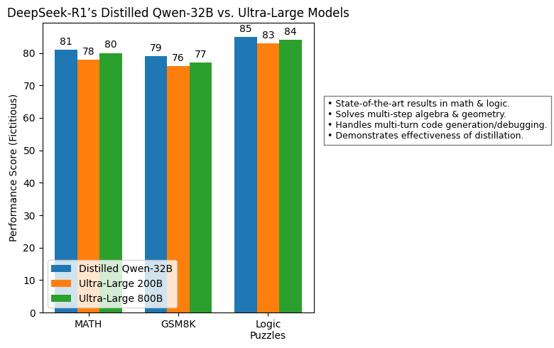

Hello AI enthusiasts! Today, we’re diving into **DeepSeek-R1** – the cutting-edge language model making waves in conversational AI. 

👉 **What You’ll Get From This Guide**:
1. **DeepSeek-R1 Breakdown**: Understand its unique RL+SFT training pipeline
2. **Hands-On Project**: Build a chatbot 


## Introduction

In the rapidly evolving landscape of artificial intelligence, **DeepSeek-R1** stands out as a groundbreaking advancement in the realm of large language models (LLMs). By challenging conventional approaches that rely heavily on supervised fine-tuning (SFT), DeepSeek-R1 pioneers a novel methodology driven primarily by **Reinforcement Learning (RL)**. This blog delves into the intricacies of DeepSeek-R1, exploring how it achieves advanced reasoning capabilities without the need for extensive human-annotated data.  

### The RL-Driven Reasoning Workflow  
DeepSeek-R1’s unique thinking process can be visualized as an iterative self-correcting loop:  


*Key Components*:  

1. **Policy Network** (π_θ): Generates token-by-token decisions  
2. **Self-Verification**: Internal consistency checking  
3. **Reflection Loop**: Chain-of-Thought rewriting for error correction  
4. **Reward-Driven Updates**: Policy gradients (∇J(θ)) optimizing future decisions  

### Why This Matters  
From its innovative training pipeline to its open-source commitment and record-setting benchmarks, DeepSeek-R1 represents a significant leap forward in AI research. The model’s ability to **autonomously develop reasoning patterns** through RL—mirroring human problem-solving strategies like trial-and-error and self-correction—challenges traditional paradigms of AI development.  

## 1. A Leap in Reasoning via Pure Reinforcement Learning (RL)

### No Supervised Fine-Tuning (SFT) Required

Conventional large language models (LLMs) often begin with a **supervised fine-tuning (SFT)** phase where they learn from human-annotated text before continuing to more specialized training. However, **DeepSeek-R1-Zero** challenges this approach by demonstrating **robust reasoning** purely via **Reinforcement Learning (RL)**.

####  RL as the Sole Driver of Knowledge

In the RL setup, each generated token can be thought of as an **action** $$a_t$$ taken in a **state** $$s_t$$ (where $$s_t$$ represents the current partial sequence or context). The policy $$\pi_\theta(a_t \mid s_t)$$ is parameterized by $$\theta$$—in this case, the weights of the language model.

Under this formulation, the expected return $$J(\theta)$$ in an RL framework is:

$$
J(\theta) \;=\; \mathbb{E}_{\tau \sim \pi_\theta}\!\Big[\sum_{t=1}^{T} \gamma^t \, R(s_t, a_t)\Big].
$$

Where:

- $$\tau$$ is a trajectory (sequence of tokens) generated by the policy $$\pi_\theta$$.
- $$R(s_t, a_t)$$ is the reward for taking action $$a_t$$ in state $$s_t$$.
- $$\gamma$$ is a discount factor (often set to 1 for episodic tasks in language generation).

To update parameters $$\theta$$, one could use **Policy Gradient** methods, such as REINFORCE or PPO (Proximal Policy Optimization). In a simplified policy gradient form:

$$
\nabla_\theta J(\theta) \;=\; \mathbb{E}_{(s,a)\sim \pi_\theta} \Big[ \nabla_\theta \log \pi_\theta(a \mid s)\; A^\pi_\theta (s,a) \Big],
$$

where $$A^\pi_\theta(s,a)$$ is an advantage function (e.g., how much better an action is compared to an average policy).

By **relying solely** on this RL scheme, **DeepSeek-R1-Zero** managed to develop **advanced reasoning** without ever seeing supervised examples.

###  Natural Emergence of Reflection & Self-Verification

An astounding outcome of training purely via RL was the **spontaneous appearance of “thinking” behaviors** in **DeepSeek-R1-Zero**:

- **Self-Verification:** The model would revisit previously generated tokens to verify or correct them.
- **Reflection:** It would generate **chain-of-thought** (CoT) style explanations internally, refining its own logic step by step.

> It’s the **first open research** confirming that large-scale RL alone can foster deep reasoning. This reduces the need for expensive supervised data collection and highlights new ways to train LLMs **with minimal human intervention**.

## 2. Challenges and the Evolution to DeepSeek-R1

###  DeepSeek-R1-Zero’s Limitations

Despite the **pure RL** success, **DeepSeek-R1-Zero** had quirks:

- **Endless repetition** of phrases  
- **Mixed-language outputs** within a single response  
- Occasional **poor readability** due to unstructured text  

These shortcomings suggested that while RL excels at **discovering** reasoning pathways, it might lack the **stabilization** that even a small supervised dataset can provide.

###  Cold-Start Data for the Win

**DeepSeek-R1** introduced a **small supervised kickstart** before RL, effectively **priming** the model with cleaner language generation habits. We can represent this initial supervised learning phase as **minimizing a cross-entropy loss** $$L_{\text{SFT}}(\theta)$$:

$$
L_{\text{SFT}}(\theta) 
= - \sum_{(x,y)\in D_\text{kickstart}} \log \pi_\theta(y \mid x),
$$

where $$D_\text{kickstart}$$ is the small supervised dataset, and $$(x,y)$$ are input-target pairs (e.g., question-answer). Minimizing this objective with standard **teacher forcing** prepares the model to produce coherent text.

###  Performance Comparable to OpenAI-o1

After the **kickstart**, the model undergoes further RL fine-tuning with an **updated** reward scheme to reinforce correct or high-quality completions. The improved **DeepSeek-R1** not only fixes issues like repetition and readability but also performs **on par** with top-tier models like **OpenAI-o1** across tasks such as:

- **Mathematics** (complex proofs, arithmetic, advanced reasoning)  
- **Coding** (code snippets, debugging assistance)  
- **Multistep Reasoning** (long chain-of-thought dialogues)  

> Just a **tiny injection** of supervised data delivers a **big leap** in stability—an insight that may influence future **hybrid** training pipelines.


## 3. Massive Scale and Open-Source Commitment

###  Over 600B Parameters, 128K Token Context

DeepSeek-R1 is rooted in **DeepSeek-V3-Base** with a staggering **671B parameters**—though **only ~37B** are typically active at any one time during forward passes. It also supports **128K tokens** of context, dwarfing the typical 2K–4K token context lengths in many LLMs.

###  Fully Open-Sourced

Significantly, the entire **DeepSeek-R1** family (including **DeepSeek-R1-Zero**, **DeepSeek-R1**, and various distilled versions) is **open-source**. The research team released:

- Model weights  
- Training scripts  
- Detailed documentation  

> **Full openness** gives developers and researchers **unrestricted** ability to experiment, fine-tune, or even fork the project. It’s a major departure from closed, proprietary ecosystems.


## 4. A Novel Pipeline with Multiple RL and SFT Stages  
### How Reinforcement Learning Shapes LLM Behavior  

Reinforcement learning (RL) is **not part of the transformer’s core architecture** (e.g., self-attention layers), but rather a **training strategy** applied after initial pre-training. In DeepSeek-R1, RL refines the model’s outputs by rewarding desirable behaviors like helpfulness, correctness, and alignment with human preferences.  

---

### Two RL Stages + Two SFT Stages: A Symphony of Training Techniques  

DeepSeek-R1’s pipeline is **layered** into four main stages:

#### **1. RL Stage 1** (DeepSeek-R1-Zero style)  
$$
\text{Optimize } J(\theta) \;=\; \mathbb{E}_{\tau \sim \pi_\theta}\!\Big[\sum_{t=1}^{T} R(s_t, a_t)\Big],
$$
**Implementation**:  
- A **reward model** (trained on human feedback) scores candidate responses.  
- The LLM acts as a *policy network* generating text actions $$a_t$$.  
- **PPO (Proximal Policy Optimization)** updates model weights to maximize rewards.  

**Purpose**: Discover high-reward reasoning paths through trial and error.  

---

#### **2. SFT Stage 1** (Kickstart Phase)  
$$
\min_{\theta}\; L_{\text{SFT}}(\theta),
$$
**Implementation**:  
- Supervised fine-tuning on high-quality demonstration data.  
- Anchors the model to retain baseline capabilities after RL’s exploratory phase.  

---

#### **3. RL Stage 2** (Post-Kickstart RL)  
$$
\min_{\theta}\; \Big( -\mathbb{E}_{\tau \sim \pi_\theta}[\text{Reward}] \Big),
$$
**Implementation**:  
- Reuses the reward model but focuses on **narrower exploration** around high-quality regions identified in Stage 1.  
- Often employs **KL divergence constraints** to prevent over-optimization.  

---

#### **4. SFT Stage 2** (Human Preference Alignment)  
$$
\min_{\theta}\; \Big(\alpha \, L_{\text{RL}}(\theta) \;+\; (1-\alpha) \, L_{\text{SFT}}(\theta)\Big),
$$
**Implementation**:  
- Hybrid loss balancing RL rewards with supervised alignment.  
- Typically uses human-curated preference datasets (e.g., ranked responses).  

---

### RL in Action: Fine-Tuning a Model with PPO  
Here’s a simplified example using the TRL library to implement RL fine-tuning:  

```python  
from transformers import AutoModelForCausalLM, AutoTokenizer  
from trl import PPOTrainer, PPOConfig, AutoModelForCausalLMWithValueHead  

# Load base model and tokenizer  
model = AutoModelForCausalLMWithValueHead.from_pretrained("deepseek-ai/deepseek-llm-7b-base")  
tokenizer = AutoTokenizer.from_pretrained("deepseek-ai/deepseek-llm-7b-base")  
tokenizer.pad_token = tokenizer.eos_token  

# Initialize PPO trainer  
ppo_config = PPOConfig(  
    batch_size=1,  
    learning_rate=1.41e-5,  
    mini_batch_size=1,  
)  

ppo_trainer = PPOTrainer(  
    model=model,  
    config=ppo_config,  
    tokenizer=tokenizer,  
)  

# Dummy reward model for illustration  
def reward_model(texts):  
    # In practice, replace with a trained reward model  
    return [len(t.split()) for t in texts]  # Reward longer responses  

# Training loop  
for epoch in range(3):  
    # Generate responses  
    queries = ["Explain quantum entanglement"]  
    inputs = tokenizer(queries, return_tensors="pt", padding=True)  
    outputs = model.generate(**inputs, max_new_tokens=50)  
    responses = tokenizer.batch_decode(outputs, skip_special_tokens=True)  

    # Compute rewards  
    rewards = reward_model(responses)  

    # PPO update  
    stats = ppo_trainer.step(  
        queries=queries,  
        responses=responses,  
        scores=rewards,  
    )  
    print(f"Epoch {epoch}:", stats)  
```

#### Key Components:  
1. **Value Head**: Added to the base transformer to estimate expected rewards.  
2. **Reward Model**: Guides policy updates (replaced here with a dummy function).  
3. **PPO**: Balances reward maximization with policy stability through KL penalties.  

---

### Where RL Operates in the Training Stack  
| Component                    | RL Interaction                                             |
| ---------------------------- | ---------------------------------------------------------- |
| **Transformer Architecture** | No changes – RL operates at the *training objective* level |
| **Training Pipeline**        | Applied after SFT phases to refine outputs                 |
| **Reward Signal**            | External model or human feedback                           |

---

> **Why This Matters**: RL allows models to **optimize for complex, non-differentiable objectives** (e.g., "helpfulness") that can’t be directly captured by supervised loss functions. The alternating RL/SFT stages in DeepSeek-R1 prevent catastrophic forgetting while enabling iterative refinement.  

This hybrid approach has become standard in state-of-the-art LLMs like ChatGPT and Claude, demonstrating that **RL is not just an add-on but a core enabler of alignment** in modern AI systems.


## 5. Distillation: Smaller Models with Big Potential

Distillation is the process of **transferring knowledge** from a large “teacher” model to a smaller “student” model. By effectively **compressing** a model’s reasoning, distillation makes large language models (LLMs) more accessible and efficient—without necessarily sacrificing performance. In **DeepSeek-R1**, the distillation pipeline produces smaller variants (1.5B, 7B, 8B, 14B, 32B, 70B, etc.) that preserve crucial reasoning abilities from their larger counterparts while being faster and cheaper to run.

### Beyond Giant Models

Despite their capabilities, giant models often come with significant computational costs, latency, and resource demands. This is where **distilled** variants come in. They can **retain** much of the teacher model’s performance, but with a fraction of the size and computational overhead.

Mathematically, a common distillation loss $$L_{\text{distill}}(\phi)$$ for a smaller model $$\phi$$ can be expressed as:

$$
L_{\text{distill}}(\phi) 
= \sum_{(x,y)\in D_{\text{distill}}} D_{KL}\!\Bigl(\pi_\theta(y \mid x) \,\Big\|\, \pi_\phi(y \mid x)\Bigr),
$$

where $$\pi_\theta$$ is the teacher model’s distribution, $$\pi_\phi$$ is the student model’s distribution, and $$D_{KL}(\cdot)$$ denotes the Kullback–Leibler divergence. Minimizing this divergence encourages the student model to mimic the teacher model’s outputs as closely as possible.


### Outperforming Bigger Baselines

Notably, some distilled variants—such as **DeepSeek-R1-Distill-Qwen-32B**—can **surpass** the performance of models significantly larger (e.g., **OpenAI-o1-mini**) on various benchmarks. This underscores how **intelligent compression** and **targeted fine-tuning** can lead to smaller models that focus on the most crucial aspects of the task:

> Distilled models run faster, consume fewer resources, and can even outperform bigger models that haven’t been fine-tuned or distilled as effectively.

------

## Distillation in LLMs: Creating Smaller, Faster Models

Large language models like GPT-4 and Gemini are powerful but come with a hefty price tag in terms of **computation, memory, and cost**. Distillation serves as a remedy by creating smaller versions of these models, retaining the core knowledge and reasoning abilities.

#### How It Works

1. **The Teacher**
    A large, pre-trained LLM (e.g., **DeepSeek-R1**). It possesses vast knowledge and excels at multiple tasks.
2. **The Student**
    A smaller model (e.g., **Granite 8B**) that aims to learn from the teacher. It tries to replicate the teacher’s performance on specific tasks with fewer parameters.
3. **The Process**
   - The teacher processes a dataset and produces outputs (labels, responses, etc.).
   - The student is then trained on these “teacher-labeled” outputs, learning to mimic the teacher’s behavior.

#### Benefits of Distillation

- **Reduced size:** Easier to store and deploy on devices with limited resources.
- **Faster inference:** Fewer parameters lead to quicker predictions, suitable for real-time applications.
- **Lower cost:** Smaller models cut down on compute and energy, making them budget-friendly.

#### Challenges and Considerations

- **Performance gap:** Distilled models might not always fully match the teacher’s accuracy.
- **Data dependency:** Substantial data is often required for effective distillation.
- **Complexity:** Implementing distillation pipelines can be technically involved.

#### Applications of Distillation

- **Mobile devices:** Powering LLM-based features on smartphones.
- **Edge computing:** Providing local inference capabilities in remote or bandwidth-constrained environments.
- **Specialized tasks:** Crafting smaller, task-specific models (e.g., customer service chatbots, translation).

------

## Example: Using DeepSeek with Granite 8B in Python

### Simple Distillation Method for DeepSeek-R1 → Granite-8B

#### Step 1: Setup Environment

```bash
pip install transformers torch accelerate datasets
```

#### Step 2: Distillation Code (Python)

<script src="https://gist.github.com/ruslanmv/c54118a085adcc00906dbdd14d867dae.js"></script>

## How to Use the Distilled Model

After training completes, save and load the distilled model:

```python
# Save
student.save_pretrained("./distilled_granite_deepseek")
tokenizer.save_pretrained("./distilled_granite_deepseek")

# Load
distilled_model = AutoModelForCausalLM.from_pretrained("./distilled_granite_deepseek")
```

------

## Notes

1. **Hardware Requirements**
    Training large teacher–student pairs may require a GPU with 40GB of memory (e.g., NVIDIA A100). Adjust batch sizes and parallelization settings as needed.
2. **DeepSeek-R1 Availability**
    Replace `"deepseek-ai/deepseek-llm-7b-base"` with the correct model path once **DeepSeek-R1** is published on Hugging Face.
3. **Advanced Techniques**
   - **LoRA:** For parameter-efficient tuning.
   - **Task-Specific Losses:** Combine KL divergence with other objective functions.
   - **Temperature Tuning:** Experiment with larger temperature at the start of training.

Distillation makes large models more **accessible** by reducing their size and computational demands. Techniques like KL divergence and temperature scaling enable a smaller, “student” model to mimic a larger, “teacher” model effectively. As AI continues to evolve, this approach will help **democratize** access to advanced language models, enabling their deployment in real-time applications, resource-constrained environments, and specialized domains. By leveraging distilled models such as Granite 8B, developers and researchers can build faster, cheaper, and more efficient AI systems without sacrificing accuracy.


## 6. Record-Setting Benchmarks

###  New State-of-the-Art for Dense Models

DeepSeek-R1’s **distilled Qwen-32B** leads several **key benchmarks**, from math word problems (e.g., MATH or GSM8K) to logical puzzle sets. Achieving state-of-the-art (SOTA) results with a **relatively compact** 32B model is a major leap.

### Versatility in Math, Coding, and General Reasoning

These models:

- Solve multi-step algebra and geometry problems  
- Generate and **debug** code  
- Handle multi-turn queries requiring **chain-of-thought** reasoning  

> It challenges the assumption that **only** ultra-large models (200B–800B parameters) can top the leaderboards. **Smart distillation** is emerging as a potent alternative.




---

## 7. Comparisons with ChatGPT and the Latest Llama Versions

With the rapid advancements in the LLM space, comparisons between **DeepSeek-R1**, **ChatGPT**, and **Llama** (including newer versions such as Llama 2) are inevitable. While each system aims to deliver powerful language understanding and generation capabilities, they differ in philosophy, training methodology, and openness.

### ChatGPT: RLHF and Proprietary Fine-Tuning

**ChatGPT** leverages **Reinforcement Learning from Human Feedback (RLHF)** alongside **supervised fine-tuning**. While it demonstrates strong performance and widespread utility, ChatGPT:

- Operates within a **closed-source** ecosystem, limiting transparency and external research contributions.  
- Relies heavily on **pre-training and supervised fine-tuning** phases before RLHF is applied.  
- Features a shorter context window (typically up to **8K–32K tokens** in newer versions), which can be limiting for very long or complex tasks.

In contrast, **DeepSeek-R1** highlights the potential of **pure RL** (particularly in its “Zero” variant) and then selectively applies a **minimal SFT** phase for stabilization. Its **128K token** context window also surpasses what ChatGPT typically offers.


###  Llama and Llama 2: Open-Source Momentum

**Llama**—especially **Llama 2**—has garnered attention for being **open-source**, enabling broader community involvement. However:

- Llama 2 still relies on **standard supervised pre-training** on vast corpora, followed by specialized fine-tuning (including RLHF-like methods for alignment in some configurations).  
- Its parameter counts (7B, 13B, 70B, etc.) are generally lower than DeepSeek-R1’s maximum scale, and the default context length remains shorter than **128K** tokens unless specially adapted.

Where **DeepSeek-R1** stands out is in its **pure RL** innovation, extensive multi-stage pipeline, and **massive context window**. The open-source release of DeepSeek-R1 also provides **complete access** to training recipes and model weights—similar in spirit to Llama 2’s openness but with an even deeper focus on **RL-driven** approaches.


### Key Takeaways

1. **Training Methodology**: DeepSeek-R1 emphasizes **pure RL** plus a small SFT kickstart, while ChatGPT and Llama rely more heavily on **supervised data**.  
2. **Openness**: Both DeepSeek-R1 and Llama 2 are open-source, whereas ChatGPT remains largely proprietary.  
3. **Context Window**: DeepSeek-R1’s **128K** token context outstrips many versions of ChatGPT and Llama 2, enabling more **long-form** reasoning.  
4. **Performance**: Benchmark tests show **DeepSeek-R1** can match or surpass proprietary solutions like ChatGPT in certain mathematical or reasoning tasks, while the distilled variants remain competitive with Llama 2 at smaller parameter scales.

> Overall, **DeepSeek-R1** bridges a unique gap: fully open-source, ultra-large context windows, and a novel RL-first methodology—driving new frontiers in the LLM space.

---


## 8. Usage Recommendations, Community Focus, and Long-Form Reasoning

DeepSeek-R1’s open-source release makes it easy for researchers and practitioners to get started. The development team provides **example configurations** for various scales, including specialized **tokenizers** for code, math, and multilingual tasks. Alongside these tools, they also share **content policy** guidelines to encourage responsible and ethical deployments.

Beyond open-source tools, **DeepSeek-R1** is shaped by a strong **community focus**. Both academic labs and industry teams are invited to:

- Develop **custom fine-tuning** routines for specific domains (e.g., legal, medical)
- Experiment with **new benchmark** evaluations to rigorously test capabilities
- Propose **alignment** strategies addressing ethical complexities

This open, collaborative ethos helps lower barriers to entry, fueling rapid iteration and innovation in AI research.

Another key strength of **DeepSeek-R1** is its **128K token context window**, which enables a wide range of long-form reasoning tasks. This expanded capacity is vital for:

- **Multi-document** summaries or analyses, ideal for research or content generation
- **Extended code debugging**, accommodating large logs or complex code bases
- **Detailed dialogues**, preserving entire conversational histories for more coherent exchanges

With such a substantial context window, DeepSeek-R1 unlocks new opportunities for advanced real-world applications, including **legal or scientific document** parsing, **policy compliance** checks, and thorough **literature reviews**. Instead of wrestling with multiple queries or content chunks, users can feed entire datasets at once—allowing for **seamless** interactions and deeper analytical insights.

Below is a simple comparison table to illustrate the benefits of DeepSeek-R1’s large context window:

| Feature           | DeepSeek-R1  | Typical LLM  |
| ----------------- | ------------ | ------------ |
| Context Window    | 128K tokens  | 2K–4K tokens |
| Open-Source Tools | Provided     | Varies       |
| Collaboration     | Strong Focus | Limited      |

---

## 9. Behind the Scenes: The “Human-Like” Learning Process

### Self-Verification, Reflection, and Multi-Turn Chain-of-Thought (CoT)

A hallmark of the DeepSeek-R1 training regimen—especially with reinforcement learning (RL) in the loop—is the **model’s tendency** to engage in a **human-like problem-solving process**. This process involves:

1. **Generating an intermediate chain-of-thought (CoT):** The model breaks down complex problems into smaller, manageable steps, producing intermediate reasoning steps that mimic human thought processes.
2. **Verifying partial results:** At each step, the model evaluates the correctness of its intermediate outputs, ensuring consistency and logical coherence.
3. **Iteratively refining the final answer:** Based on the verification, the model adjusts its reasoning and updates its final output, often improving accuracy over multiple iterations.

Technically, this reflection process can be viewed as an **internal attention mechanism** that references previously generated tokens and reevaluates them for consistency. This mechanism is mathematically grounded in the principles of **self-attention** and **reinforcement learning**, which are central to the model's architecture.

#### Mathematical Foundations of Self-Verification and Reflection

The self-verification process can be formalized using the following mathematical framework. Let $$ \mathbf{h}_t $$ represent the hidden state of the model at time step $$ t $$, and $$ \mathbf{a}_t $$ denote the attention weights over previous tokens. The model generates an intermediate output $$ \mathbf{o}_t $$ at each step, which is then verified for consistency.

The attention mechanism computes the relevance of previous tokens to the current step as:

$$
\mathbf{a}_t = \text{softmax}\left(\frac{\mathbf{Q} \mathbf{K}^T}{\sqrt{d_k}}\right) \mathbf{V},
$$

where $$ \mathbf{Q} $$, $$ \mathbf{K} $$, and $$ \mathbf{V} $$ are the query, key, and value matrices, respectively, and $$ d_k $$ is the dimensionality of the key vectors. The softmax function ensures that the attention weights sum to 1, allowing the model to focus on the most relevant parts of the input.

During the verification phase, the model evaluates the intermediate output $$ \mathbf{o}_t $$ by comparing it to an expected value $$ \mathbf{e}_t $$, computed using a learned function $$ f $$:

$$
\mathbf{e}_t = f(\mathbf{h}_t, \mathbf{a}_t).
$$

The discrepancy between $$ \mathbf{o}_t $$ and $$ \mathbf{e}_t $$ is measured using a loss function $$ \mathcal{L} $$, such as the mean squared error (MSE):

$$
\mathcal{L}_t = \|\mathbf{o}_t - \mathbf{e}_t\|^2.
$$

The model then refines its output by minimizing this loss, updating its parameters $$ \theta $$ using gradient descent:

$$
\theta \leftarrow \theta - \eta \nabla_\theta \mathcal{L}_t,
$$

where $$ \eta $$ is the learning rate. This iterative refinement process continues until the model converges to a satisfactory solution.

### Illustration of Internal “Thought Chains”

For non-technical readers, seeing how the model **“thinks”** step by step can be eye-opening. For instance, consider a multi-turn solution to a math word problem. The model might break the problem into smaller steps, compute partial results, and verify their correctness before proceeding. Here’s an example:

**Problem:** *A train travels 300 km in 5 hours. What is its average speed?*

1. **Step 1:** The model generates an intermediate chain-of-thought:  
   *"To find the average speed, I need to divide the total distance by the total time."*

2. **Step 2:** It computes the partial result:  
   *"Average speed = 300 km / 5 hours = 60 km/h."*

3. **Step 3:** The model verifies the calculation:  
   *"Is 300 divided by 5 equal to 60? Yes, that’s correct."*

4. **Step 4:** It refines the final answer:  
   *"The average speed of the train is 60 km/h."*

This process mirrors how a human student might approach the problem, incrementally computing and verifying results. The added transparency not only improves performance but also inspires trust (and sometimes a little astonishment!) as we watch an AI system **deliberate** before answering.


## Simple Python Code for a DeepSeek-R1-Inspired Chatbot

Building an interactive AI-powered chatbot is easier than you think, thanks to frameworks like **Hugging Face Transformers** and **Gradio**. Below is a Python implementation inspired by **DeepSeek-R1**, demonstrating how to load a **state-of-the-art distilled model** and deploy it as a chatbot interface.

This walkthrough focuses on key components like model loading, custom chat templates, streaming responses, and creating an intuitive user interface using Gradio. For illustration purposes, we use the model `DeepSeek-R1-Distill-Qwen-32B-bnb-4bit` as an example of a cutting-edge, distilled language model.

Here’s a breakdown of the process and how the code is structured to achieve the desired functionality.

---

This example will guide you through:  
- **Setting up the environment** with proper imports and configurations.  
- **Loading the model and tokenizer**, ensuring it’s optimized for conversation-based tasks.  
- **Creating a streaming chat function** that processes user input and generates responses dynamically.  
- **Building a Gradio-powered user interface** to enable interaction in a clean, user-friendly web app.  

Let’s dive in!

<script src="https://gist.github.com/ruslanmv/ff6cae033da2b18f780163b0131c5a80.js"></script>

### What the Code Does

1. **Imports**: The code begins by importing essential libraries such as `gradio` for creating a user interface, `transformers` for handling the model and tokenizer, and additional tools like threading for asynchronous processing.

2. **Custom Styling and UI**: Custom HTML and CSS are provided to design the chatbot interface. The `DESCRIPTION`, `FOOTER`, and `PLACEHOLDER` elements give the app a polished and user-friendly look, while the `css` string adds some styling enhancements.

3. **Model and Tokenizer Loading**: The code initializes the tokenizer and loads the model (`DeepSeek-R1-Distill-Qwen-32B-bnb-4bit`) from Hugging Face. A custom chat template is defined for formatting the conversation input into the model’s expected structure.

4. **Chat Function**:  
   - The `chat_llama3_8b` function takes user input and chat history, processes it using the tokenizer, and streams back responses from the model.  
   - The function supports fine-tuning through parameters like `temperature` (for controlling randomness) and `max_new_tokens` (for limiting response length).  
   - A `TextIteratorStreamer` is used for real-time response streaming, ensuring a smooth, responsive user experience.

5. **Gradio Interface**: The code uses `gr.Blocks` to define a Gradio-based user interface with features such as:  
   - A chatbot window where users interact with the model.  
   - Adjustable parameters (e.g., temperature and max token count) in an optional settings accordion.  
   - Predefined example prompts for users to explore the model’s capabilities.

6. **Launching the App**: Finally, the script launches the Gradio interface locally or on a web-hosted platform when executed, making it easy for users to test and interact with the model.

---

You can have something like this


You can execute the previous code on Google Colab with the A100 GPU [here](https://colab.research.google.com/github/ruslanmv/DeepSeek-R1-RL-Driven-Language-Models/blob/master/app.ipynb)

### Key Takeaways

This code showcases how to integrate a large language model into an interactive application. The combination of Hugging Face Transformers and Gradio provides a flexible framework for building and customizing AI-powered chatbots. You can further extend this setup by:

- **Fine-tuning the model** with domain-specific data.  
- **Adding more UI features**, such as file uploads or speech-to-text capabilities.  
- **Deploying the app** on platforms like Hugging Face Spaces for broader accessibility.

This project is a great starting point for experimenting with LLMs and creating interactive, AI-driven tools. Welcome to the exciting world of conversational AI!

## Conclusion

DeepSeek-R1 represents more than a significant technical advancement; it redefines how we conceive, train, and deploy large language models. By showcasing the emergent reasoning power of purely RL-driven training (DeepSeek-R1-Zero) and then illustrating the gains from a minimal, targeted dose of supervised instruction (DeepSeek-R1), this series challenges traditional SFT-heavy approaches while expanding what’s possible in AI research. Its unprecedented scale—exceeding 600 billion parameters—and extended context length of 128K tokens pave the way for real-world applications that demand both depth and breadth of understanding. Equally important, the ability to distill these capabilities into more compact models ensures that powerful AI is no longer the exclusive domain of resource-rich deployments.

By placing open-source collaboration at the forefront, DeepSeek-R1 invites researchers, practitioners, and enthusiasts worldwide to explore, refine, and extend its capabilities. In doing so, it not only democratically broadens access to state-of-the-art AI methods but also underscores the need for ongoing ethical and alignment work. The journey of DeepSeek-R1 continues to merge technical rigor with a forward-looking vision of AI’s social and philosophical dimensions—a synergy that will shape the models we build and the principles that guide us in building them.

The mathematical formulations and concepts discussed here are inspired by foundational works in deep learning and reinforcement learning, including:

1. Vaswani, A., et al. (2017). *Attention is All You Need.* Advances in Neural Information Processing Systems (NeurIPS).
2. Sutton, R. S., & Barto, A. G. (2018). *Reinforcement Learning: An Introduction.* MIT Press.
3. Bengio, Y., Courville, A., & Vincent, P. (2013). *Representation Learning: A Review and New Perspectives.* IEEE Transactions on Pattern Analysis and Machine Intelligence.

**Congratulations!** I hope this extended and detailed overview has enriched your understanding of how DeepSeek-R1 fits into the broader AI landscape. Whether you’re an **AI researcher**, a **developer**, or simply an **enthusiast**, there’s never been a more exciting time to dive into **RL-based LLMs**—and DeepSeek-R1 is leading the charge!
