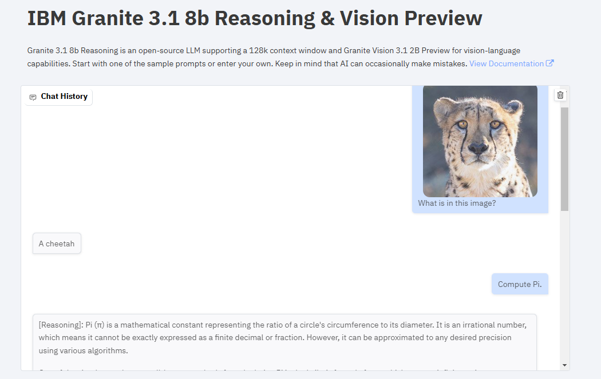
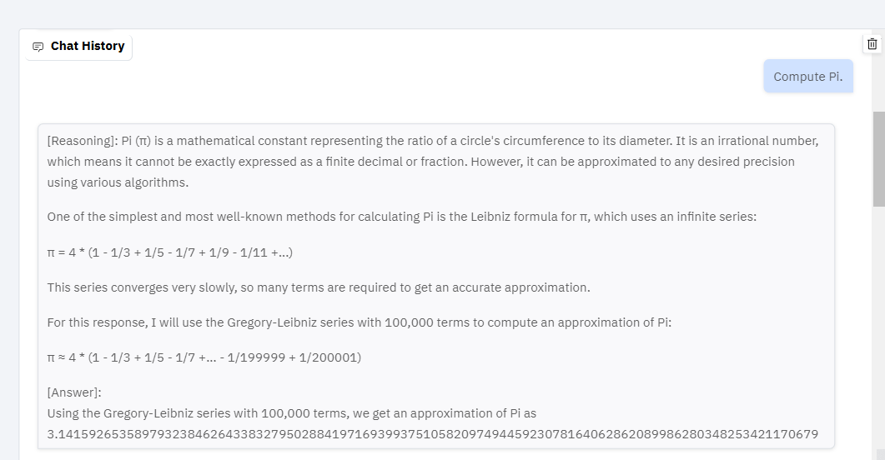
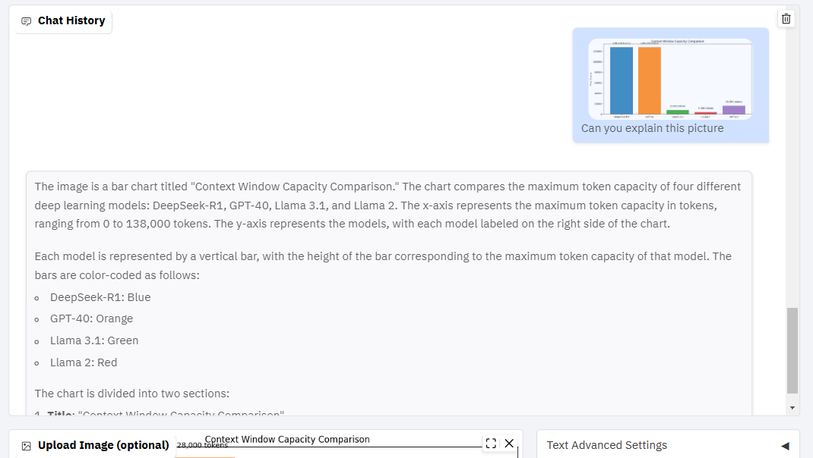

Artificial Intelligence continues to evolve at a rapid pace, and IBM's Granite 3.1 models are a testament to this progress. In this blog post, we’ll explore the capabilities of the **Granite 3.1 8B Reasoning** and **Granite Vision 3.1 2B Preview** models, and provide a step-by-step guide on how to load and run the reasoning model locally. Whether you're an AI enthusiast or a developer, this post will help you understand and leverage these powerful tools.



### Interactive Demo: Experience IBM Granite 3.1 in Action

Before diving into the technical details, you can experience the capabilities of IBM Granite 3.1 firsthand through an interactive Gradio demo. This demo showcases the reasoning and vision capabilities of the models.

➡️ **Try the Demo Here:** [IBM Granite 3.1 Demo](https://huggingface.co/spaces/ruslanmv/Granite-Vision-Chatbot)

### Key Features of IBM Granite 3.1

The demo highlights two main components of the IBM Granite 3.1 models:


**Granite 3.1 8B Reasoning**: This model excels in complex reasoning tasks, thanks to its **128k context window**. It can handle long conversations and detailed prompts, making it ideal for tasks that require deep analysis and explanation.




**Granite Vision 3.1 2B Preview**: This model adds vision capabilities, allowing the AI to interpret and describe images. You can upload an image and ask questions about its content, making it a powerful tool for visual understanding.




### How to Load the Granite 3.1 8B Reasoning Model Locally

If you’re impressed by the reasoning capabilities of the Granite 3.1 8B model and want to run it on your local machine, follow these steps:

#### 1. Install the Required Libraries

First, ensure you have the necessary Python libraries installed. Run the following commands in your terminal:

```bash
pip install torch torchvision torchaudio
pip install accelerate
pip install transformers
```

These libraries include PyTorch for deep learning, accelerate for optimized performance, and transformers for working with Hugging Face models.

#### 2. Download and Run the Model

Next, create a Python script to load and run the Granite 3.1 8B Reasoning model. Below is the code snippet you can use:

```python
from transformers import AutoModelForCausalLM, AutoTokenizer, GenerationConfig, BitsAndBytesConfig
import torch

# Model and tokenizer
model_name = "ruslanmv/granite-3.1-8b-Reasoning"  # Or "ruslanmv/granite-3.1-2b-Reasoning"
tokenizer = AutoTokenizer.from_pretrained(model_name)

# Configure 4-bit quantization properly
quantization_config = BitsAndBytesConfig(
    load_in_4bit=True,  # Enable 4-bit quantization
    bnb_4bit_compute_dtype=torch.float16  # Match dtype to avoid slow inference
)

model = AutoModelForCausalLM.from_pretrained(
    model_name,
    device_map="auto",  # Use GPU if available
    torch_dtype=torch.float16,  # Use float16 for faster inference
    quantization_config=quantization_config  # Use proper config instead of deprecated argument
)

# Prepare dataset
SYSTEM_PROMPT = """
Respond in the following format:
<reasoning>
...
</reasoning>
<answer>
...
</answer>
"""
text = tokenizer.apply_chat_template([
    {"role": "system", "content": SYSTEM_PROMPT},
    {"role": "user", "content": "Calculate pi."}  # Example prompt - change this!
], tokenize=False, add_generation_prompt=True)

inputs = tokenizer(text, return_tensors="pt").to("cuda")  # Move input tensor to GPU

# Sampling parameters (Fixed `do_sample` warning)
generation_config = GenerationConfig(
    do_sample=True,  # Ensure sample-based settings are applied
    temperature=0.8,  # Active only when `do_sample=True`
    top_p=0.95,  # Active only when `do_sample=True`
    max_new_tokens=1024,  # Control response length
)

# Inference
with torch.inference_mode():  # Use inference mode for faster generation
    outputs = model.generate(**inputs, generation_config=generation_config)

output = tokenizer.decode(outputs[0], skip_special_tokens=True)

# Find the start of the actual response
start_index = output.find("assistant")
if start_index != -1:
    # Remove the initial part including "assistant"
    output = output[start_index + len("assistant"):].strip()

print(output)

```

#### 3. Run the Script

Save the code in a file, e.g., `granite_reasoning.py`, and run it using the following command:

```bash
python granite_reasoning.py
```

#### Explanation of the Code

- **Model and Tokenizer**: The script loads the Granite 3.1 8B Reasoning model and its tokenizer from Hugging Face. The `device_map='auto'` ensures the model uses your GPU if available.
- **System Prompt**: The `SYSTEM_PROMPT` guides the model to structure its responses with `<reasoning>` and `<answer>` tags.
- **Generation Configuration**: Parameters like `temperature`, `top_p`, and `max_new_tokens` control the model's response generation.
- **Inference**: The `model.generate()` function generates the response based on the input prompt.

#### 4. Customize and Experiment

Once the model is running locally, you can:

- **Change the Prompt**: Modify the `"Calculate pi."` line to ask the model any question.
- **Adjust Settings**: Experiment with the generation parameters to see how they affect the output.
- **Integrate into Projects**: Use this script as a starting point to build more complex applications.

### Why IBM Granite 3.1 Matters

The IBM Granite 3.1 models represent a significant step forward in AI capabilities:

- **Advanced Reasoning**: The 8B Reasoning model demonstrates the ability to analyze and explain complex problems, making it a valuable tool for tasks requiring deep understanding.
- **Vision Integration**: The Vision model adds a layer of visual comprehension, enabling AI to interpret and describe images.
- **Open-Source Accessibility**: The availability of these models on Hugging Face allows developers and researchers to experiment and build upon them.

### Conclusion

IBM Granite 3.1 is a powerful suite of models that showcases the future of AI reasoning and vision. Whether you’re exploring the interactive demo or running the model locally, these tools offer a glimpse into the potential of next-generation AI.

➡️ **Try the Demo Here:** [IBM Granite 3.1 Demo](https://huggingface.co/spaces/ruslanmv/Granite-Vision-Chatbot)


➡️ **Try the Colab Demo Here:**<a href="https://colab.research.google.com/github/ruslanmv/IBM-Granite-3.1-AI-Reasoning-and-Vision/blob/main/Granite.ipynb" target="_parent"></a>


➡️ **Download the Reasoning Model Here:** [Granite 3.1 8B Reasoning](https://huggingface.co/ruslanmv/granite-3.1-8b-Reasoning)

Feel free to share this blog post and explore the capabilities of IBM Granite 3.1. Let’s continue pushing the boundaries of what AI can achieve!