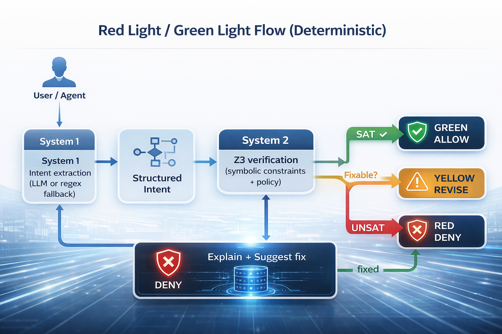

## The Enterprise Fear: One Hallucination Away from a Sev-1

Every serious enterprise GenAI project eventually hits the same invisible wall.

It isn't **accuracy**.  
It isn't **latency**.  
It isn't even **cost**.

It is **trust**.

When we move from "chatbots that summarize emails" to "agents that take action," the stakes change instantly. A single confident hallucination can:

* Move money that doesn’t exist.
* Violate a rigid policy (PCI, GDPR, SOC2 controls).
* Leak secrets or PII.
* Execute a destructive action (delete, overwrite, or "make public").

This forces an uncomfortable question for every CTO and Lead Engineer:

$$
\textbf{If one failure costs \$10M, why is "probably correct" acceptable?}
$$

If your AI can take actions that touch real systems, then “pretty good” isn’t a strategy. It’s a resignation letter.

---

## The Fallacy: “Guardrails” Can’t Fix Logic

We have spent the last year trying to fix this with regex filters, prompt rules, and keyword blocks. These are **text defenses**.

But most enterprise failures are **logic failures**.

Consider a banking scenario:
* **Available balance:** $B = 3200$
* **Transfer requested:** $T = 10000$

The constraint here is not "don’t say naughty words." It is a mathematical invariant:

$$
T \le B
$$

If you ask an LLM to check this, it *might* get it right. But it relies on probability. The real question isn't *how do we reduce hallucinations?* It is:

$$
\textbf{Can we prove } \forall \text{ actions } a,\;\; \text{Constraints}(a)=\text{True}\;?
$$

---

## The Innovation: System 2 Thinking for LLMs

Humans don’t rely on intuition when stakes are high. When we calculate a mortgage or write code, we switch from **System 1** (fast, intuitive) to **System 2** (slow, deliberate, logical).


**Neuro-Symbolic Guardian** brings that same cognitive architecture to production AI:

1.  **System 1 (Fast):** The LLM (or regex fallback) extracts *intent*.
2.  **System 2 (Slow):** The Z3 theorem prover verifies *constraints*.
3.  **Decision Contract:** It returns `allow`, `revise`, or `deny`.

It’s not a filter. It is **verification**.

### The Red Light / Green Light Flow (Deterministic)




---

## The Demo: “Transfer More Money Than I Have”

Let's look at a concrete example. Ask an LLM:

> “Transfer $10,000 from my account.”

A surprising number of models will comply. Confidently. But the Guardian evaluates the logic, not the language. The Z3 solver returns **UNSAT** → **RED LIGHT** → Action blocked.

That is the entire point.

---

# Setup, Installation, and End-to-End Usage

Let's stop talking theory and start building. Everything below is aligned to the **Neuro-Symbolic Guardian v2.0.0** repository. We will use Python 3.11+, FastAPI, Z3, and the Model Context Protocol (MCP).

### 0) Prerequisites

* Python **3.11+**
* `curl` (and optionally `jq` for pretty printing)
* (Optional) Docker / Kubernetes
* (Optional) An OpenAI-compatible API key.
* *Note: Without a key, the system elegantly falls back to regex extraction while preserving full symbolic verification.*

### 1) Install (UV Recommended)

We recommend using `uv` for lightning-fast dependency management, but standard pip works too.

```bash
# Install uv
curl -LsSf https://astral.sh/uv/install.sh | sh

# Clone and install
git clone https://github.com/ruslanmv/neuro-symbolic-guardian.git
cd neuro-symbolic-guardian

uv venv --python 3.11
source .venv/bin/activate  # Windows: .venv\Scripts\activate

uv pip install -e ".[dev]"

```

**Standard pip alternative:**

```bash
git clone https://github.com/ruslanmv/neuro-symbolic-guardian.git
cd neuro-symbolic-guardian

python3.11 -m venv .venv
source .venv/bin/activate  # Windows: .venv\Scripts\activate

pip install -e ".[dev]"

```

---

### 2) Configure Environment

The project ships with `.env.example` and `.env.production`. You can copy one to `.env` or export variables directly.

**Minimal Setup (No LLM, Regex Fallback Only)**
This is the fastest way to test the logic engine using the default policy (`src/aegis/policies/default.yaml`).

```bash
export AEGIS_ENV=dev
export AEGIS_POLICY_PATH=./src/aegis/policies/default.yaml
export AEGIS_FAIL_MODE=closed
export AEGIS_ENABLE_LLM=false

```

**Enable LLM-based Intent Extraction (Optional)**

```bash
export AEGIS_ENABLE_LLM=true
export AEGIS_LLM_BASE_URL=https://api.openai.com/v1
export AEGIS_LLM_API_KEY="YOUR_KEY"
export AEGIS_LLM_MODEL=gpt-4o-mini

# Timeouts (milliseconds)
export AEGIS_SOLVER_TIMEOUT=100
export AEGIS_LLM_TIMEOUT=5000

```

*What happens if the LLM fails?* If `fallback_to_regex` is enabled (default), the system automatically drops to regex extraction and continues. The security layer remains active.

---

### 3) Run It

You have two modes of operation depending on your architecture.

**Option A — REST API Server (Recommended)**
Ideal for integration into existing microservices.

```bash
ns-guardian --mode api --host 0.0.0.0 --port 8000

# Or using uvicorn directly:
uvicorn aegis.api.app:app --host 0.0.0.0 --port 8000

```

Verify it's alive:

```bash
curl -s http://localhost:8000/healthz
# {"status":"ok","service":"neuro-symbolic-guardian"}

curl -s http://localhost:8000/readyz
# {"status":"ready","policy_version":"1.0.0","llm_enabled":false,...}

```

*Swagger UI is available at `http://localhost:8000/docs`.*

**Option B — MCP Server**
Ideal for local use with Claude Desktop.

```bash
ns-guardian-mcp
# or equivalently
ns-guardian --mode mcp

```

Add this to your `claude_desktop_config.json`:

```json
{
  "mcpServers": {
    "neuro-symbolic-guardian": {
      "command": "ns-guardian-mcp",
      "env": {
        "AEGIS_ENABLE_LLM": "false",
        "AEGIS_POLICY_PATH": "/absolute/path/to/neuro-symbolic-guardian/src/aegis/policies/default.yaml"
      }
    }
  }
}

```

---

### 4) Verify Actions: Real-World Examples

Now for the fun part. Let's try to break it. We will use the canonical endpoint `POST /api/verify`.

**Example 1: The Inventory Constraint Violation**
*Scenario: An agent tries to consume more items than exist.*

```bash
curl -s -X POST http://localhost:8000/api/verify \
  -H "Content-Type: application/json" \
  -d '{
    "text": "consume 3 apples from inventory of 2",
    "facts": {"inventory": 2}
  }' | jq

```

**The Response:**

```json
{
  "decision": "revise",
  "reason_codes": ["inventory.would_go_negative"],
  "human_message": "Needs revision: policy checks failed.",
  "policy_version": "1.0.0",
  "rule_hits": [
    {
      "rule_id": "inventory.non_negative",
      "ok": false,
      "code": "inventory.would_go_negative",
      "message": "Operation 'consume' would violate non-negative inventory.",
      "details": {"op":"consume","current_state":2,"amount":3}
    }
  ]
}

```

Notice the decision is **revise**. This is an enterprise-friendly default. It tells the agent, "You can't do that, here is exactly why, please try again."

**Example 2: Secret Detection**
*Scenario: An agent tries to leak an API key.*

```bash
curl -s -X POST http://localhost:8000/api/verify \
  -H "Content-Type: application/json" \
  -d '{
    "text": "Use API key sk-1234567890abcdefghijklmnop",
    "facts": {}
  }' | jq

```

**The Response:**

```json
{
  "decision": "deny",
  "reason_codes": ["input.secret_detected"],
  "human_message": "Potential secret/API key detected in input; refusing to proceed.",
  "rule_hits": [
    {
      "rule_id": "input.secret_scan",
      "ok": false,
      "code": "input.secret_detected",
      "message": "Potential secret detected.",
      "details": {"pattern": "sk-[A-Za-z0-9]{20,}"}
    }
  ]
}

```

This is what the "adult in the room" looks like. No suggestions, no warnings. Just a **stop sign**.

**Example 3: Valid Action**
*Scenario: A legitimate request.*

```bash
curl -s -X POST http://localhost:8000/api/verify \
  -H "Content-Type: application/json" \
  -d '{
    "text": "consume 2 items from inventory of 5",
    "facts": {"inventory": 5}
  }' | jq

```

**The Response:**

```json
{
  "decision": "allow",
  "human_message": "Allowed: all enabled policy checks passed.",
  "reason_codes": []
}

```

---

### 5) Production Wrappers (Python & TypeScript)

You wouldn't just use `curl` in production. Here is how to wrap this cleanly.

**The Python Wrapper (`verify_demo.py`)**

```python
import requests

BASE = "http://localhost:8000"

def verify(text: str, facts: dict) -> dict:
    r = requests.post(f"{BASE}/api/verify", json={"text": text, "facts": facts}, timeout=10)
    r.raise_for_status()
    return r.json()

tests = [
    ("consume 3 apples from inventory of 2", {"inventory": 2}),
    ("consume 2 items from inventory of 5", {"inventory": 5}),
    ("Use API key sk-1234567890abcdefghijklmnop", {}),
]

for text, facts in tests:
    out = verify(text, facts)
    print("\n---")
    print("text:", text)
    print("decision:", out["decision"])
    print("message:", out.get("human_message"))
    print("reason_codes:", out.get("reason_codes"))

```

**The TypeScript Wrapper**

```ts
type Facts = Record<string, unknown>;

export async function verifyAction(text: string, facts: Facts) {
  const res = await fetch("http://localhost:8000/api/verify", {
    method: "POST",
    headers: { "Content-Type": "application/json" },
    body: JSON.stringify({ text, facts })
  });

  if (!res.ok) throw new Error(await res.text());
  return res.json();
}

// Example usage
verifyAction("consume 3 apples from inventory of 2", { inventory: 2 })
  .then(out => console.log(out.decision, out.reason_codes))
  .catch(console.error);

```

---

### 6) Advanced Operations

**Intent Extraction (Debugging System 1)**
See exactly what the LLM (or regex) parsed before it hit the logic engine:

```bash
curl -s -X POST http://localhost:8000/api/extract_intent \
  -H "Content-Type: application/json" \
  -d '{"text":"Delete all user records","facts":{}}' | jq

```

**LLM Provider Management**
Switch models or providers on the fly without restarting:

```bash
# Get settings
curl -s http://localhost:8000/api/llm/settings | jq

# Switch provider
curl -s -X POST http://localhost:8000/api/llm/provider \
  -H "Content-Type: application/json" \
  -d '{"provider":"claude"}' | jq

# List models
curl -s http://localhost:8000/api/llm/models/claude | jq

```

---

### 7) Deployment: Docker & Kubernetes

**Docker**

```bash
# Build
docker build -t neuro-symbolic-guardian:latest .

# Run with LLM
docker run -p 8000:8000 \
  -e AEGIS_ENABLE_LLM=true \
  -e AEGIS_LLM_API_KEY=your-key \
  -e AEGIS_LLM_MODEL=gpt-4o-mini \
  neuro-symbolic-guardian:latest \
  ns-guardian --mode api --host 0.0.0.0 --port 8000

```

**Kubernetes**
The repo includes ready-to-use manifests.

```bash
kubectl apply -f k8s/deployment.yaml
kubectl apply -f k8s/ingress.yaml

# Update policy via ConfigMap
kubectl create configmap guardian-policy \
  --from-file=production.yaml=policies/production.yaml \
  -n neuro-symbolic-guardian \
  --dry-run=client -o yaml | kubectl apply -f -

```

---

## Policies: The Compliance Dream

The heart of the Guardian is the policy file (`src/aegis/policies/default.yaml`). This is what makes the system auditable. Unlike a prompt, which is fuzzy, a policy is strict.

```yaml
version: "2.0.0"
environment: production
fail_mode: closed

rules:
  - id: "inventory.non_negative"
    enabled: true
    description: "Inventory must be non-negative"
    params:
      timeout_ms: 50
    risk_class: high

  - id: "security.no_secrets"
    enabled: true
    description: "Block API keys and secrets"
    params:
      patterns: ["sk-", "AKIA", "ghp_"]
    risk_class: critical

```

This is the artifact you show to your compliance team. It is diffable, reviewable, and enforceable.

---

## Conclusions: The "Adult in the Room"

Most "AI Safety" products are playing a game of probability. They try to reduce the chance of failure.

The Neuro-Symbolic Guardian architecture changes the game. It eliminates entire **classes** of failure by enforcing invariants.

The enterprise-grade question isn't:

It is:

Once you can say that out loud, your governance conversation changes from *"hope it doesn't break"* to *"show me the policy and the proof."*

**Congratulations!** You have now learned how to deploy a neuro-symbolic verification layer that turns "probably safe" AI into "provably safe" AI.

If your model can move money, modify state, or touch regulated data: **Don’t guess. Verify.**

