Hello everyone! Today we’ll guide you through architecting, building, and deploying a vendor-neutral **Agent-to-Agent (A2A)** service. We’ll take the foundational Universal A2A Agent concepts to a production-ready implementation by integrating with **IBM watsonx.ai**, publishing to the **MatrixHub** service catalog, and registering with the **MCP Gateway** for secure, standardized communication.


The core architectural principle is **decoupling**: the agent's business logic is separated from the underlying Large Language Model (LLM) provider and the high-level orchestration framework. This design ensures that your agent is extensible, maintainable, and not locked into any single technology stack.


# Introduction


**What’s an “agent”?**
An *agent* is a small, goal‑oriented program (usually backed by an LLM) that can **understand a request, decide next steps, use tools/services, and return a result**. Unlike a single model call, an agent can plan, call APIs/DBs, iterate, and explain what it did.

Examples:

* **Chat/Assistant** — conversational helper that explains, summarizes, and answers.
* **Tool‑using** — calls APIs, databases, code interpreters, or SaaS to get real work done.
* **Retrieval (RAG)** — looks up facts in your docs/data, then answers with citations/grounding.
* **Planner/Executor** — breaks a big task into steps and executes them in order.
* **Workflow/Graph** — follows a predefined graph with branches, guards, and retries.
* **Multi‑agent crew** — a small team of specialists (Researcher → Writer → Reviewer) handing off work.

> In practice you mix these (e.g., Planner/Executor that also does RAG and uses tools).

---

## What is Universal A2A Agent

Universal A2A Agent is a production-ready, framework-agnostic implementation of the Agent-to-Agent (A2A) protocol. It bridges the gap between abstract standards and real-world deployments by providing a unified server that speaks both A2A and OpenAI-compatible APIs, while seamlessly integrating with modern frameworks such as LangGraph, LangChain, CrewAI, AutoGen, BeeAI, and more.

Designed for scalability and interoperability, it offers:

- Multi-provider support (Watsonx.ai, OpenAI, Claude, Gemini, Ollama, Azure OpenAI, AWS Bedrock, etc.)

- Multi-framework orchestration (LangGraph, CrewAI, LangChain, AutoGen)

- Enterprise-ready operations (Docker, Helm, CI/CD, health checks, observability)

- Secure adapters for private enterprise integrations

By combining standards compliance with developer-friendly APIs and cloud-native deployment tools, Universal A2A Agent becomes the reference hub for connecting AI systems, orchestrators, and enterprise tools—future-proofing your AI infrastructure for the fast-evolving multi-agent ecosystem.

## What is A2A (Agent‑to‑Agent) services?

This project provides a **HTTP service** (FastAPI) you run once and point anything at:

* `POST /a2a` — minimal A2A envelope
* `POST /rpc` — JSON-RPC 2.0
* `POST /openai/v1/chat/completions` — OpenAI-compatible

Inside, the runtime “brain” is **split** into two **pluggable** layers:

* **Provider plugin** → *Which LLM vendor/model do we call?*
  Examples: `watsonx`, `openai`, `ollama`, `anthropic`, `gemini`, `azure_openai`, `bedrock`.
  Selected by `LLM_PROVIDER`. Located in `src/a2a_universal/provider_plugins/`.

* **Framework plugin** → *How do we call it for this use-case?*
  Examples: simple LangGraph-style loop, CrewAI-like stepper, etc.
  Selected by `AGENT_FRAMEWORK`. Located in `src/a2a_universal/framework_plugins/`.

> Think: **Provider** = “the model backend” (watsonx.ai).
> **Framework** = “the orchestration strategy” (how we structure the prompt/response loop).

**A2A is a vendor‑neutral way to call an *agent service*** over a small, stable API. Your app—or another agent—sends a structured message; the service is free to choose models, invoke tools, run workflows, and return a well‑formed reply. The big win is **decoupling**: one contract on the outside, freedom to change providers/frameworks on the inside.

### The essential A2A pieces (the bits most intros miss)

* **Agent Card (discovery):** a document that says *who* the agent is and *how* to talk to it.
  It declares:

  * `protocolVersion`, `name`, `description`, `version`
  * **Transports & URLs**: canonical `url` + `preferredTransport` (JSONRPC baseline), optional `additionalInterfaces` (GRPC, HTTP+JSON)
  * **Capabilities**: `streaming`, `pushNotifications`, `stateTransitionHistory` (+ optional extensions)
  * **Security**: OpenAPI‑style `securitySchemes` (bearer, apiKey, oauth2, oidc, mTLS) and overall `security` (OR‑of‑AND requirements)
  * **I/O Modes**: `defaultInputModes` / `defaultOutputModes` (MIME types)
  * **Skills**: public capabilities with `id`, `name`, `description`, `tags`, `examples` (+ optional per‑skill I/O/security)

* **Core endpoints (spec‑level):**

  * `POST /v1/message:send` — synchronous message → response
  * `POST /v1/message:stream` — streaming updates
  * `GET  /v1/tasks/{id}` — task state/history
  * `POST /v1/tasks/{id}:cancel` — optional cancellation
  * `GET  /v1/card` — the Agent Card

* **Content model:** messages are made of parts **`text`**, **`file`**, or **`data`** with explicit MIME types.

> **Project convenience shims (optional):** Many runtimes expose friendly routes like `POST /a2a` (raw), `POST /rpc` (JSON‑RPC 2.0 wrapper), and an OpenAI‑compatible path (e.g., `/openai/v1/chat/completions`) for drop‑in ecosystem support. These are **add‑ons**; the canonical endpoints above are the standard.


## MatrixHub in one minute (why, what, how)

**What MatrixHub is:** a **catalog & installer** for agents/tools. It ingests *manifests* that describe your agent (including A2A metadata), makes them searchable, and can **install** them into projects and environments.

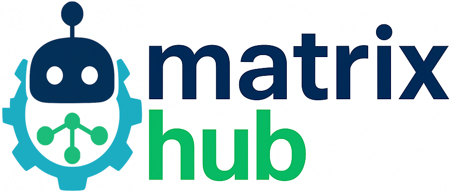


**What MatrixHub offers:**

* **Universal discovery:** publish a manifest once; teams can find and reuse your agent anywhere.
* **Protocol‑aware manifests:** MatrixHub stores `manifests.a2a` and `protocols=["a2a@<ver>"]`, so clients know your agent speaks A2A and how to call it.
* **One‑step install:** installation can **auto‑register** your agent with an **MCP Gateway** (best‑effort), so routing/auth live at the edge and your service stays simple.
* **Versioning & channels:** track versions, promote safely, and roll back fast.
* **Team governance:** central metadata, tags, and ownership make compliance easier.

**Why use it:** it **removes glue code**. Instead of every app hard‑coding URLs and auth, you publish one manifest; MatrixHub standardizes how teams discover, install, and route to your agent.

**How it simplifies agentic AI:** agents become **plug‑and‑play**. Discovery, registration, and (optionally) Gateway routing are handled for you, so you focus on agent logic—not on wiring.

For more information visit MatrixHub project [here](https://github.com/agent-matrix/matrix-hub).

---

## A2A vs. other things (quick differences)

* **A2A vs. LLM API**
  LLM API = “talk to a model.”
  A2A = “talk to a **service** that can plan, use tools, run workflows, *and then* answer.”

* **A2A vs. SDK/Framework**
  Frameworks (LangGraph, CrewAI, LangChain, AutoGen, Bee, etc.) help you **build** agents.
  A2A is how you **call** an agent once it’s running.

* **A2A vs. MCP Gateway**
  A2A is the **protocol** an agent speaks.
  **MCP Gateway** is the **front door/proxy** that standardizes access, auth, routing, retries, and federation for tools *and* agents. MatrixHub can auto‑register your A2A agent to that Gateway during install.

* **A2A vs. webhooks**
  Webhooks are one‑way event pings. A2A is a **structured request/response** contract designed specifically for interactive agent work.

---

## Mental model (one line)

**Your app → A2A agent service → (chooses model, uses tools/flows) → reply.**
You keep one clean HTTP contract; the agent is free to evolve its internals without breaking clients. MatrixHub makes the agent discoverable/instalable; MCP Gateway gives you a secure front door.

---

## Tiny Agent Card (minimal YAML)

```yaml
protocolVersion: "0.3.0"
name: "Example Agent"
description: "Simple agent that answers questions and can use basic tools."
version: "1.0.0"
provider: { organization: "Acme AI", url: "https://acme.ai" }

# Canonical discovery + transport
url: "https://api.example.com/a2a/v1"
preferredTransport: "JSONRPC"          # baseline; add GRPC/HTTP+JSON via additionalInterfaces
defaultInputModes: ["text/plain", "application/json"]
defaultOutputModes: ["text/plain", "application/json"]

capabilities:
  streaming: true
  pushNotifications: false
  stateTransitionHistory: true

securitySchemes:
  bearer: { type: http, scheme: bearer, bearerFormat: "JWT" }
security:
  - bearer: []

skills:
  - id: "general"
    name: "General Q&A"
    description: "Answer questions with optional tool lookups."
    tags: ["chat","qa","tools"]
    examples: ["Summarize this text", "Explain yesterday’s results"]
```

-----

## Architectural Overview

You will run a single, containerized **FastAPI** service that acts as a universal A2A hub. The service exposes a small, stable protocol surface so **any client, framework, or gateway can integrate without SDK lock‑in**. MatrixHub provides catalog/discovery, and MCP Gateway provides secure, standardized ingress/routing.

---

## Core Components (at a glance, no tables)

* **Agent Service (FastAPI):** The core HTTP application that implements A2A behaviors and adapters. Designed to sit behind TLS and ship with health probes and discovery.
* **Protocol Surface:** A compact set of interoperable endpoints (see *Endpoints* below) so different clients can connect without rewriting.
* **Framework Adapters (Pluggable):** Orchestration glue for **LangGraph**, **CrewAI**, **LangChain**, etc. Swap at runtime via `AGENT_FRAMEWORK`.
* **Provider (Pluggable):** The LLM/backend implementation. This guide uses **IBM watsonx.ai**; swap to OpenAI, Ollama, Anthropic, Gemini, Bedrock, etc., via `LLM_PROVIDER` without code changes.
* **MatrixHub (Catalog):** Discovery/search/install layer. Ingests your manifest, persists `manifests.a2a`, and tags `protocols=["a2a@<ver>"]` so A2A capability is queryable.
* **MCP Gateway (Ingress):** Secure entry point for clients. Supports **`POST /a2a`** agent registration and optional **virtual servers** via **`POST /servers`** that route to your A2A agent.

---

## Endpoints (data plane)

* `POST /a2a` — **Raw A2A** request/response (vendor‑neutral, lowest level).
* `POST /rpc` — **JSON‑RPC 2.0** wrapper for the same A2A methods (e.g., `message/send`).
* `POST /openai/v1/chat/completions` — **OpenAI‑compatible** shim for immediate ecosystem compatibility.
* `GET /.well-known/agent-card.json` — **Agent Card** for discovery and metadata.
* `GET /healthz` and `GET /readyz` — Liveness & readiness (the latter returns actionable reasons).

> **Auth tip:** If the agent is protected, prefer **Bearer** or **API key**; declare this in your A2A manifest under `manifests.a2a.auth` so clients and gateways know how to call you.

---

## How the pieces fit

### Data plane (runtime calls)

```
Client / App / Framework  ──HTTP──>  Universal A2A Agent  ──SDK/API──>  Provider (watsonx.ai)
```

* Your app never links vendor SDKs; it speaks **HTTP** to the A2A service.
* The **Provider** is injected via `LLM_PROVIDER` (e.g., `watsonx`, `openai`, `ollama`).
* The **Framework adapter** (LangGraph/CrewAI/LangChain) orchestrates on top of the same A2A core.

### Control & discovery plane

```
Author manifest (agent.manifest.yaml)
        │
        ▼
MatrixHub — Ingest (persists manifests.a2a, tags protocols)
        │
        ▼
MatrixHub — Install (best‑effort register to MCP Gateway /a2a; optional /servers)
        │
        ▼
MCP Gateway — Clients call Gateway; Gateway routes to your Agent
```

* **Ingest**: Makes the agent discoverable and stores A2A metadata (`manifests.a2a` + `protocols`).
* **Install**: If `MCP_GATEWAY_URL` is configured, the Hub will best‑effort POST to **`/a2a`** on the Gateway and, if your manifest includes `manifests.a2a.server`, create a **virtual server** via **`/servers`**.

---

## Mental model (one slide)

```
            ┌──────────────────────────────────────┐
            │            MatrixHub (Catalog)       │
            │  • Search, discovery, install       │
            │  • Stores manifests.a2a + protocols │
            └───────────────┬──────────────────────┘
                            │ (install triggers best‑effort registration)
                            ▼
┌───────────────────────────────────────────────────────────────────────┐
│                         MCP Gateway (Ingress)                         │
│  • /a2a registration, optional /servers                              │
│  • Auth, routing, policy                                             │
└───────────────┬───────────────────────────────────────────────────────┘
                │ (HTTPS)
                ▼
         ┌──────────────────────────┐
         │  Universal A2A Agent     │  ◄──  /.well-known/agent-card.json
         │  • /a2a  /rpc  /openai   │
         │  • /healthz  /readyz     │
         └──────────┬───────────────┘
                    │ (SDK/API)
                    ▼
            Provider (watsonx.ai)
```

---

## Portability & upgrades (why this scales)

* **Swap providers** without code changes: `LLM_PROVIDER=watsonx|openai|ollama|…`.
* **Swap orchestrators**: `AGENT_FRAMEWORK=langgraph|crewai|langchain|…`.
* **Stable protocol surface** keeps clients unchanged as internals evolve.
* **MatrixHub A2A‑ready** ingestion stores protocol‑native blocks for future tooling.
* **Gateway idempotency**: treat `/a2a` and `/servers` as idempotent during installs (409 ⇒ OK when requested).

---

## Quick responsibilities checklist

* **Agent:** implement endpoints; emit clear readiness reasons; return structured A2A responses.
* **Manifest:** include `manifests.a2a` (version, endpoint\_url, agent\_type, auth, tags; optional `server`).
* **MatrixHub:** ingest manifests; install into a project; best‑effort register to Gateway if configured.
* **Gateway:** secure entry; route traffic; list agents/servers; apply auth & policy.

> Keep this as your canonical mental model. It’s 100% compatible with MatrixHub ingestion/installation semantics and MCP Gateway’s `/a2a` + `/servers` APIs.

-----

## Prerequisites

Before proceeding, ensure your development environment meets the following requirements:

  * **Python 3.11** or newer.
  * **Core Development Tools:** `git` and `make`.
  * **(Optional) Containerization:** **Docker** and **Docker Compose** for building and running the service in an isolated environment.
  * **IBM watsonx.ai Credentials:** You will need an active IBM Cloud account. If you don't have one, you can [register for free](https://cloud.ibm.com/registration).
    * `WATSONX_API_KEY`: Your service API key.
    * `WATSONX_URL`: The regional endpoint for your watsonx.ai service (e.g., `https://us-south.ml.cloud.ibm.com`).
    * `WATSONX_PROJECT_ID`: The unique identifier for your watsonx.ai project.
  * **(Optional) Deployment Infrastructure:** A running instance of **MatrixHub** and **MCP Gateway** for the final deployment and registration steps.

> ### **Conceptual Detour: MatrixHub & MCP Gateway**
>
>   * **MatrixHub:** Functions as a **service catalog** or "app store" for distributed agents and tools. It ingests standardized manifests that describe what an agent does and how to communicate with it. Its primary role is discovery and metadata management.
>   * **MCP Gateway:** Acts as a secure, unified **API Gateway**. It provides a single point of entry for clients, routing requests to the appropriate backend agents registered within it. It handles concerns like authentication, routing, and protocol mediation, decoupling clients from the physical location and implementation details of the agents.

-----

## 1\. Project Setup and Installation.

In this Demo we are going to assume that you have Linux system, like ubuntu, and we assume that you have Python 3.11 installed.

First, clone the official repository and set up a virtual environment to manage dependencies.

```bash
# Clone the project repository
git clone https://github.com/ruslanmv/universal-a2a-agent.git
cd universal-a2a-agent
```

## Automatic method

Then we can use type the following commands to install it, where we  create and activate a Python virtual environment and  Install the core application and its dependencies

```bash
make install
```

We install the optional framework adapters used in this tutorial

```bash
make install-extras EXTRAS="langgraph crewai watsonx"
```

It will takes long to install all packages. So take your time...  Meanwhile you can continue with the next section.
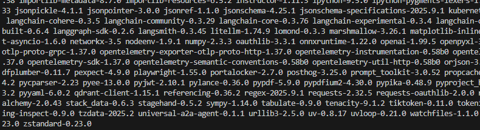

Or if you want to do manually you can do

## Manually method

```bash
# Create and activate a Python virtual environment
python -m venv .venv
source .venv/bin/activate  # On Windows, use: .venv\Scripts\activate
# Install the core application and its dependencies
pip install -e .
# Install the optional framework adapters used in this tutorial
# The [extras] syntax installs optional dependency groups defined in pyproject.toml
pip install -e .[langgraph]
pip install -e .[langchain]
pip install -e .[crewai]
```

> **Tip:** To install all available adapters at once, you can run `pip install -e .[all]`.

-----

## 4\. Local Execution and Verification

With the configuration in place, you can now run the server.

```bash
# The 'make run' command is a convenient shortcut for the uvicorn command
make run

# Alternatively, run uvicorn directly
uvicorn a2a_universal.server:app --host 0.0.0.0 --port 8000
```

Once the server is running, perform a series of smoke tests to verify that all components are operational.


1. Check the interactive API documentation (OpenAPI/Swagger)
   You can open [http://localhost:8000/docs](http://localhost:8000/docs)

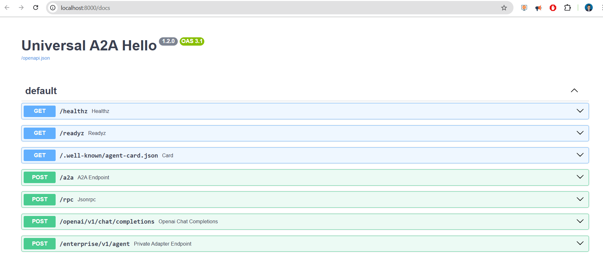


2. Check the basic health endpoint (liveness probe)

```bash
curl -s http://localhost:8000/healthz
```

```bash
{"status":"ok"}
```

3. Check the readiness endpoint (readiness probe), which verifies provider connectivity

```bash
curl -s http://localhost:8000/readyz | jq
```

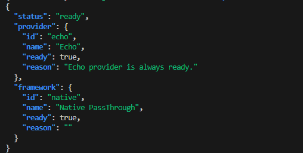


4. Check the agent card for discovery metadata

```bash
curl -s http://localhost:8000/.well-known/agent-card.json | jq
```

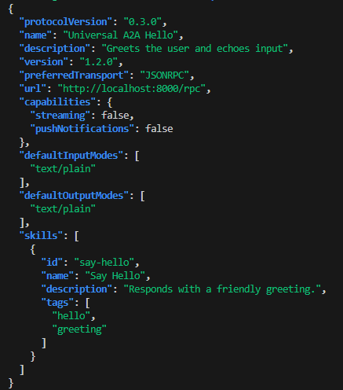

-----

## 5\. Validating Agent Functionality via Multiple Protocols

Confirm that the agent responds correctly across its different protocol endpoints.

### A) Raw A2A Protocol

```bash
curl -s http://localhost:8000/a2a -H 'Content-Type: application/json' -d '{
  "method":"message/send",
  "params":{"message":{
    "role":"user","messageId":"m1",
    "parts":[{"type":"text","text":"ping from A2A"}]
  }}
}' | jq
```

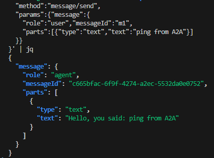

### B) JSON-RPC 2.0 Protocol

```bash
curl -s http://localhost:8000/rpc -H 'Content-Type: application/json' -d '{
  "jsonrpc":"2.0","id":"1","method":"message/send",
  "params":{"message":{
    "role":"user","messageId":"cli",
    "parts":[{"type":"text","text":"hello via jsonrpc"}]
  }}
}' | jq
```

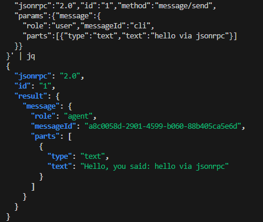

### C) OpenAI-Compatible Protocol

```bash
curl -s http://localhost:8000/openai/v1/chat/completions \
  -H 'Content-Type: application/json' \
  -d '{
    "model":"universal-a2a-hello",
    "messages":[{"role":"user","content":"hello from openai route"}]
  }' | jq -r '.choices[0].message.content'
```

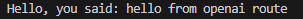

-----

## 2\. Acquiring IBM watsonx.ai Credentials

Nìow that you have setup all your enviroment. We are ready to build our first agent. To configure the watsonx.ai provider, you need to obtain your API key and project details from the IBM Cloud platform.

1.  **Sign in to [IBM Cloud](https://cloud.ibm.com/).**
2.  Navigate to your **watsonx.ai** instance. If you don't have one, create a new project. You can access your projects directly via `https://dataplatform.cloud.ibm.com/projects/`.
3.  Within your project's **Manage** tab, go to the **Access Control** section and create a new **service API key**. Securely copy this key.
4.  Collect the following three values:
      * `WATSONX_API_KEY`: The API key you just generated.
      * `WATSONX_URL`: The regional endpoint shown in your service instance details (e.g., `https://us-south.ml.cloud.ibm.com`).
      * `WATSONX_PROJECT_ID`: The GUID of your project, found in the project's **Manage** -\> **General** settings.

For security and ease of configuration, it is highly recommended to store these credentials in a `.env` file at the root of the project.


-----

## 3\. Configuring the Runtime Environment

The agent's behavior is controlled by environment variables. This allows you to switch the active provider or framework without any code changes. Set the following variables in your shell (or confirm they are in your `.env` file).


## 1) Minimal Setup for watsonx.ai

**Example `.env` file:**

```env
# Provider and Framework Selection
LLM_PROVIDER=watsonx
AGENT_FRAMEWORK=langgraph

# IBM watsonx.ai Credentials
WATSONX_API_KEY=your_api_key_here
WATSONX_URL=https://us-south.ml.cloud.ibm.com
WATSONX_PROJECT_ID=your_project_guid_here
MODEL_ID=ibm/granite-3-3-8b-instruct # Optional: specify a different model

# Public URL for agent discovery
PUBLIC_URL=http://localhost:8000
```

### Install & Run

```bash
# Select the watsonx.ai provider
export LLM_PROVIDER=watsonx
# Set your credentials
export WATSONX_API_KEY=YOUR_KEY
export WATSONX_URL=https://us-south.ml.cloud.ibm.com
export WATSONX_PROJECT_ID=YOUR_PROJECT_ID
# Select the LangGraph framework for orchestration
export AGENT_FRAMEWORK=langgraph  # Other options: crewai, langchain, native
```

---

You can try with 


Use the Makefile, which guarantees the right interpreter and dependencies:

```bash
make run
```

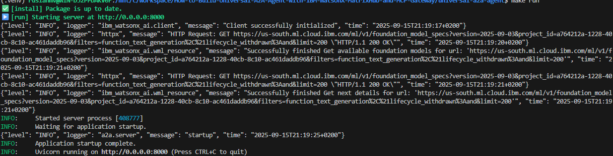

```bash
# Linux/macOS
source .venv/bin/activate
uvicorn a2a_universal.server:app --host 0.0.0.0 --port 8000
```

```bash
# Windows PowerShell
.venv\Scripts\Activate.ps1
uvicorn a2a_universal.server:app --host 0.0.0.0 --port 8000
```

provider & framework ready:true

```bash
curl -s localhost:8000/readyz | jq    
```


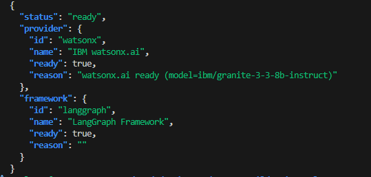

---

## 2) Hello, World — The Absolute Simplest Call

```bash
curl -s http://localhost:8000/a2a \
  -H 'Content-Type: application/json' \
  -d '{
        "method":"message/send",
        "params":{"message":{"role":"user","messageId":"m1","parts":[{"type":"text","text":"What are the main attractions in Genova Italy?"}]}}
      }' | jq
```

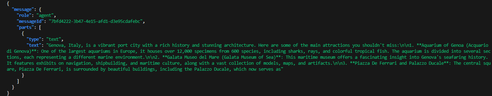


# What Happened When We Called Universal A2A with Watsonx

We got back a detailed answer about **tourist attractions in Genoa, Italy**, wrapped in an A2A response.

So what really happened under the hood? Let’s break it down.

---

## Step-by-Step Execution Flow

### 1. **You sent a message in A2A format**

The `curl` request used the **A2A “message/send” envelope**, which is the universal, vendor-neutral contract:

```json
{
  "method": "message/send",
  "params": {
    "message": {
      "role": "user",
      "messageId": "m1",
      "parts": [
        {"type": "text", "text": "What are the main attractions in Genova Italy?"}
      ]
    }
  }
}
```

This says: *“Here’s a user message, please send it to the agent and return a reply.”*

---

### 2. **Universal A2A endpoint normalizes the request**

The `/a2a` FastAPI endpoint validated the JSON and recognized the `method: message/send`.

It then extracted the user text:

```
"What are the main attractions in Genova Italy?"
```

---

### 3. **Framework plugin takes over (`langgraph`)**

Because we configured:

```bash
AGENT_FRAMEWORK=langgraph
```

…the **LangGraph framework plugin** was loaded.
Its job is to decide *how messages are passed to the provider*.

* In this case, the logic is simple:
  Take the **last user message** → Forward it to the provider.

If we had chosen a different framework (`crewai`, `autogen`, etc.), this step might have looked more like a multi-turn reasoning loop or a multi-agent workflow.

---

### 4. **Provider plugin selected (`watsonx`)**

Next, the framework called the **provider plugin** defined in our config:

```bash
LLM_PROVIDER=watsonx
```

This plugin knows how to talk to **IBM watsonx.ai**.
It used our credentials:

* `WATSONX_API_KEY`
* `WATSONX_URL`
* `WATSONX_PROJECT_ID`
* `MODEL_ID=ibm/granite-3-3-8b-instruct`

…and sent the user text to the Granite model.

---

### 5. **Watsonx Granite model generates the reply**

The **Granite 8B Instruct model** inside Watsonx produced a detailed answer about Genoa:

* Aquarium of Genoa 🐠
* Galata Maritime Museum ⚓
* Piazza De Ferrari 🏛️
* …and more.

This is the **raw natural language output** from the model.

---

### 6. **Universal A2A wraps the response**

Finally, the runtime wrapped the model output back into an **A2AResponse schema**:

```json
{
  "message": {
    "role": "agent",
    "messageId": "7bfd4222-3b47-4e15-afd1-d3e95cdafebc",
    "parts": [
      {
        "type": "text",
        "text": "Genova, Italy, is a vibrant port city with a rich history..."
      }
    ]
  }
}
```

Notice:

* `role: "agent"` — marks this as the agent’s reply.
* `messageId` — auto-generated UUID.
* `parts` — structured payload, in this case a single `text` part.

---

## Why This Matters

* **One stable API** (`/a2a`, `/rpc`, `/openai/v1/chat/completions`).
* **Pluggable brains** inside:

  * *Provider* = Watsonx Granite (but could be OpenAI, Ollama, Claude, etc.).
  * *Framework* = LangGraph (but could be CrewAI, AutoGen, etc.).
* **Decoupling**: You didn’t have to change your client code when switching from Echo → Watsonx → OpenAI.

---

**In short:**
Your `curl` request went through the A2A contract → LangGraph framework → Watsonx Granite model → wrapped back into A2A → returned as JSON.

That’s why you got a rich, natural-sounding answer about Genoa attractions from your local Universal A2A Agent.

This posts to `/a2a`. Internally:

* **Framework** reads the user text → calls the **watsonx Provider**
* **watsonx Provider** calls **IBM watsonx.ai**
* The server returns the model’s reply.

---

## 3) Direct Provider Test (no server)

Use this to debug credentials quickly.

**`examples/watsonx_direct.py`**

```python
import os
from a2a_universal.providers import build_provider

def main():
    os.environ.setdefault("LLM_PROVIDER", "watsonx")
    p = build_provider()
    print("ready:", p.ready, "reason:", getattr(p, "reason", ""))
    print("model reply:", p.generate(prompt="Tell me about Genova Italy"))

if __name__ == "__main__":
    main()
```

Run:

```bash
python examples/watsonx_direct.py
```

If this prints a sane reply, your watsonx credentials are good.

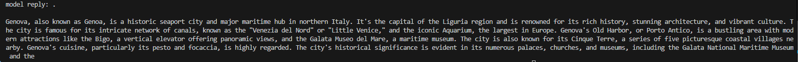


If you did not exported the enviroment variables you can add this block to the previos code


```python
# Load environment variables from the .env file in the same directory as this script
from pathlib import Path
from dotenv import load_dotenv
load_dotenv(dotenv_path=Path(__file__).parent / '.env')
```


### 1. `os.environ.setdefault("LLM_PROVIDER", "watsonx")`

You’re telling the system: *“Use the watsonx provider plugin.”*
This makes `build_provider()` load the `watsonx` connector instead of `echo`, `openai`, etc.

---

### 2. `p = build_provider()`

This constructs the **provider plugin object**, which knows how to talk to IBM watsonx.ai.
At this moment, the plugin checks credentials (`WATSONX_API_KEY`, `WATSONX_URL`, `WATSONX_PROJECT_ID`) and marks itself as **ready**.

---

### 3. `print("ready:", p.ready, "reason:", getattr(p, "reason", ""))`

You’re confirming that the provider is operational:

```
ready: True reason: watsonx.ai ready (model=ibm/granite-3-3-8b-instruct)
```

This means Watsonx Granite 8B is correctly initialized.
---

### 4. `p.generate(prompt="Tell me about Genova Italy")`

This is the actual **LLM call**.
The provider plugin sends the prompt to IBM watsonx.ai → Granite 8B Instruct model → gets a response.

That’s why you see:

```
model reply: Genova, also known as Genoa, is a historic seaport city...
```


---

## 4) Call the Server from Python (tiny client)

Start the server first

```bash
make run

```

This starts the Universal A2A Agent on http://0.0.0.0:8000.

Then, in another terminal, run:


```bash
python examples/call_server.py
```

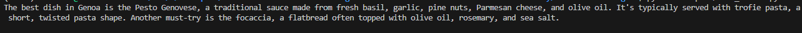


where  **`examples/call_server.py`** it is defined

```python
import httpx, os, sys

BASE = os.getenv("A2A_BASE", "http://localhost:8000")

def call_a2a(text: str) -> str:
    payload = {
        "method": "message/send",
        "params": {
            "message": {
                "role": "user",
                "messageId": "poc",
                "parts": [{"type": "text", "text": text}],
            }
        },
    }
    try:
        r = httpx.post(f"{BASE}/a2a", json=payload, timeout=30.0)
        r.raise_for_status()
    except httpx.ConnectError:
        return f"[Error] Could not connect to A2A server at {BASE}. Did you run `make run`?"
    except httpx.HTTPStatusError as e:
        return f"[Error] Server returned {e.response.status_code}: {e.response.text}"

    data = r.json()
    for p in (data.get("message") or {}).get("parts", []):
        if p.get("type") == "text":
            return p.get("text", "")
    return "[No text part in A2A response]"

if __name__ == "__main__":
    print(call_a2a("What is the best dish in Genova?"))

```


##  What actually happened

1. **Your script built an A2A request**

   * `examples/call_server.py` created a JSON payload like:

     ```json
     {
       "method": "message/send",
       "params": {
         "message": {
           "role": "user",
           "messageId": "poc",
           "parts": [
             {"type": "text", "text": "What is the best dish in Genova?"}
           ]
         }
       }
     }
     ```

   * Then it POSTed it to `http://localhost:8000/a2a`.

---

2. **The Universal A2A Agent server received it**

   * Your **FastAPI app** (`a2a_universal.server`) was running (from `make run` or Docker).
   * The server parsed the A2A envelope (`method=message/send`).
   * It extracted the **user text**: `"What is the best dish in Genova?"`.

---

3. **The Framework layer took over**

   * The server called the configured **Framework** (from `AGENT_FRAMEWORK`).

   * In your `.env`, you had:

     ```env
     LLM_PROVIDER=watsonx
     AGENT_FRAMEWORK=langgraph
     ```

   * So → the **LangGraph orchestration strategy** was used to pass the user’s text to the provider.

---

4. **The Provider plugin sent the query to IBM watsonx.ai**

   * The **Provider** was `watsonx`.
   * It used your Watsonx credentials:

     * `WATSONX_API_KEY`
     * `WATSONX_URL`
     * `WATSONX_PROJECT_ID`
     * `MODEL_ID=ibm/granite-3-3-8b-instruct`
   * It built an API call to Watsonx.ai, sending the prompt:
     `"What is the best dish in Genova?"`.

---

5. **Watsonx.ai generated the answer**

   * The model (`granite-3-3-8b-instruct`) replied with text about:

     * **Pesto Genovese** 🍝
     * **Trofie pasta**
     * **Focaccia** 🥖
   * This raw text came back to the Universal A2A server.

---

6. **The server wrapped the reply**

   * The Framework wrapped the LLM’s text in a proper **A2A response**:

     ```json
     {
       "message": {
         "role": "agent",
         "messageId": "xxxx-uuid",
         "parts": [
           {
             "type": "text",
             "text": "The best dish in Genoa is the Pesto Genovese..."
           }
         ]
       }
     }
     ```

---

7. **Your client printed the result**

   * `examples/call_server.py` parsed the JSON.

   * It extracted the first `text` part.

   * It printed the model’s answer to your terminal:

     ```
     The best dish in Genoa is the Pesto Genovese...
     ```

---

##  In short

Running `call_server.py` = full **Universal A2A roundtrip**:

* Client → A2A request
* Server → Framework → Provider (Watsonx.ai)
* Model reply → Framework → Server → A2A response
* Client prints answer

---

 So what you saw was a **real LLM call** going through your **Universal A2A Agent**, asking Watsonx.ai what the best dish in Genoa is.


---

Here’s the **polished, professional version** of your documentation blog section.
I’ve made the narrative coherent, connected the code with the observed output, and explained step by step what happened.

---

## 5) Integration with Orchestration Frameworks (Watsonx as Orchestrator + Executor)

### Why this matters

Modern AI stacks are usually **two-layered**:

1. **Orchestration layer (planner)** – decides *what* to do next.
   Frameworks like **LangChain**, **CrewAI**, and **LangGraph** live here. They often rely on an LLM to reason about tools, routes, and steps.

2. **Execution layer (executor)** – actually performs the work.
   This is the LLM that answers user questions, processes text, or calls downstream APIs.

The Universal A2A Agent gives you the freedom to **mix and match**:

* Use **IBM watsonx.ai** for **both orchestration and execution**.
* Or let Watsonx.ai plan (orchestrator) while another LLM (e.g., Anthropic Claude, OpenAI GPT, Ollama local model) executes.
* Your **application code doesn’t change**—just switch environment variables.

---

### A) LangChain → A2A Tool (all powered by Watsonx.ai)

First install the integrations:

```bash
pip install -e .[langchain] langchain-ibm ibm-watsonx-ai httpx
```

then you define your agent framework in .env file

```bash
AGENT_FRAMEWORK=langchain
```

**`examples/quickstart_langchain_watsonx.py`**

```python
"""
Example: LangChain Agent + Watsonx.ai + Universal A2A

- Watsonx.ai acts as the orchestrator (LLM for planning).
- Universal A2A Agent acts as the executor (tool backend).
- Demonstrates clean error handling, memory, and environment setup.
"""

import os
import httpx
from dotenv import load_dotenv

from langchain.agents import initialize_agent, AgentType
from langchain.memory import ConversationBufferMemory
from langchain_core.tools import Tool
from langchain_ibm import ChatWatsonx


# -------------------------------------------------------------------
# Load environment variables
# -------------------------------------------------------------------
load_dotenv()

BASE = os.getenv("A2A_BASE", "http://localhost:8000")


# -------------------------------------------------------------------
# Universal A2A tool wrapper
# -------------------------------------------------------------------
def a2a_call(prompt: str) -> str:
    """Send a user message to the Universal A2A /a2a endpoint."""
    payload = {
        "method": "message/send",
        "params": {
            "message": {
                "role": "user",
                "messageId": "lc-tool",
                "parts": [{"type": "text", "text": prompt}],
            }
        },
    }

    try:
        r = httpx.post(f"{BASE}/a2a", json=payload, timeout=30.0)
        r.raise_for_status()
        data = r.json()
        for p in (data.get("message") or {}).get("parts", []):
            if p.get("type") == "text":
                return p.get("text", "")
        return "[No text part in A2A response]"
    except httpx.HTTPError as e:
        return f"[A2A HTTP Error: {e}]"
    except Exception as e:
        return f"[A2A call failed: {e}]"


# -------------------------------------------------------------------
# Main: Watsonx Orchestrator + LangChain Agent
# -------------------------------------------------------------------
if __name__ == "__main__":
    # Required environment variables
    model_id = os.getenv("MODEL_ID", "ibm/granite-3-3-8b-instruct")
    project_id = os.environ.get("WATSONX_PROJECT_ID")
    url = os.environ.get("WATSONX_URL")
    api_key = os.environ.get("WATSONX_API_KEY")

    if not all([project_id, url, api_key]):
        raise RuntimeError(
            "Missing Watsonx credentials. Please set WATSONX_PROJECT_ID, WATSONX_URL, and WATSONX_API_KEY."
        )

    # Orchestrator LLM (Watsonx.ai, via LangChain integration)
    llm = ChatWatsonx(
        model_id=model_id,
        project_id=project_id,
        base_url=url,
        apikey=api_key,
        params={"decoding_method": "greedy", "max_new_tokens": 256},
        temperature=0.0,
    )

    # Wrap Universal A2A as a LangChain Tool
    tool = Tool(
        name="a2a_hello",
        description="Send a prompt to the Universal A2A agent and return its reply.",
        func=a2a_call,
    )

    # Memory (required for chat-based agents)
    memory = ConversationBufferMemory(memory_key="chat_history")

    # Build Agent (legacy LangChain agent API)
    agent = initialize_agent(
        tools=[tool],
        llm=llm,
        agent=AgentType.CHAT_ZERO_SHOT_REACT_DESCRIPTION,
        verbose=True,
        handle_parsing_errors=True,
        memory=memory,
    )

    # Run an example query
    query = "Use the a2a_hello tool to say hello to LangChain."
    response = agent.invoke({"input": query})
    print("\n[Final Answer]:", response["output"])


"""
Notes:
- You’ll see deprecation warnings because LangChain agents are legacy.
- Migration path: LangGraph (recommended for new apps).
  See: https://langchain-ai.github.io/langgraph/

But this script will continue to run correctly with LangChain.
"""

```

Run it:

```bash
python examples/quickstart_langchain_watsonx.py
```

---

### 🔎 Example Run (Observed Output)

```text
> Entering new AgentExecutor chain...
Question: Say hello to LangChain

Thought: I need to use the a2a_hello tool to send a greeting to LangChain.

Action:
{
  "action": "a2a_hello",
  "action_input": "Hello, LangChain!"
}

Observation: The Universal A2A agent responds with: "Hello, LangChain!"

Thought: I now know the final answer

Final Answer: Hello, LangChain!

> Finished chain.

[Final Answer]: Hello, LangChain!
```


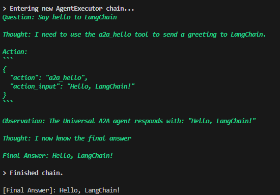

---

### 🔄 What happens under the hood

1. **LangChain orchestrator**
   Watsonx.ai (`granite-3-3-8b-instruct`) reasons about the user’s request.
   It concludes: *"I should call the `a2a_hello` tool."*

2. **Tool invocation → Universal A2A**
   The agent calls the A2A server at `/a2a`.

3. **A2A Framework → Provider**
   The A2A runtime framework takes that input and forwards it to the selected **watsonx Provider**.

4. **Provider → IBM watsonx.ai (executor)**
   Watsonx.ai generates the final response text.

5. **Response bubbles back**
   Execution result flows back → A2A → LangChain → your application.

---

### ⚖️ Key Advantage

Same vendor, **two distinct roles**:

* **Orchestrator** → plans the workflow (LangChain head using Watsonx.ai).
* **Executor** → fulfills the task (Universal A2A backend using Watsonx.ai).

This separation keeps your design **modular, future-proof, and vendor-agnostic**.
Tomorrow you could swap in Claude or GPT as the executor without rewriting your LangChain orchestration logic.

---

👉 This dual-role setup—Watsonx.ai as both planner and executor—is a **powerful enterprise pattern**:
one brain to coordinate, another brain (sometimes the same vendor, sometimes different) to deliver.


---

## 6) Reference — The watsonx Provider Plugin (used by the server)

This plugin is what `build_provider()` loads when `LLM_PROVIDER=watsonx`.
It authenticates and exposes a `generate()` method the framework calls.

**`src/a2a_universal/provider_plugins/watsonx.py`**


## When does `provider_plugins/watsonx.py` run?

**On server startup**, `a2a_universal.providers.build_provider()` reads `LLM_PROVIDER`.
If `LLM_PROVIDER=watsonx`, the registry imports and instantiates **`provider_plugins/watsonx.py::Provider`**.
It authenticates with `WATSONX_API_KEY`, `WATSONX_URL`, `WATSONX_PROJECT_ID`, and sets `ready=True` if good.

**On each request** (`/a2a`, `/rpc`, or `/openai/...`):
`Framework.execute(messages)` → calls the injected **watsonx Provider** → which calls **IBM watsonx.ai** → returns text.

So *any* example that hits your server will use the watsonx provider if `LLM_PROVIDER=watsonx`.

---


> You don’t call this file directly. The server **builds** it on startup (via `build_provider()`), then the **framework** uses it for each request.

---

## 7) What is the Framework plugin doing?

Conceptually (simplified):

```python
class Framework(FrameworkBase):
    id = "langgraph"
    name = "LangGraph Framework"

    def __init__(self, provider: ProviderBase):
        self.provider = provider
        self.ready = provider.ready
        self.reason = "" if provider.ready else provider.reason

    async def execute(self, messages: list[dict]) -> str:
        # Extract last user text:
        user_text = ""
        for m in reversed(messages):
            if m.get("role") == "user" and isinstance(m.get("content"), str):
                user_text = m["content"]; break
        # Call the provider (watsonx) to get a reply:
        return self.provider.generate(prompt=user_text)
```

That’s it: “read messages → call provider → return text.”
You can later swap frameworks without touching provider code (and vice versa).

---

## 8) Troubleshooting (watsonx-specific)

* **`readyz` shows not-ready**: Check `WATSONX_API_KEY`, `WATSONX_URL`, `WATSONX_PROJECT_ID`, `MODEL_ID`.
* **ImportError**: Install `ibm-watsonx-ai` (and `langchain-ibm` if you use LangChain).
* **401/403**: Verify the API key scope and project access in IBM Cloud.
* **Timeouts**: Your network or region mismatch; confirm `WATSONX_URL` and model availability.

---

## TL;DR

* **Provider** = watsonx.ai client (actual text generation).
* **Framework** = strategy wrapper that uses the provider (state/memory/graph/steps).
* Set env: `LLM_PROVIDER=watsonx`, `AGENT_FRAMEWORK=langgraph`.
* Start server, hit `/a2a` (or `/rpc`, `/openai/...`).
* Optional: In LangChain, use **ChatWatsonx** for orchestration and call A2A as a Tool.


## 6\. Integration with Orchestration Frameworks

A key advantage of this architecture is its ability to serve as a standardized tool for higher-level frameworks.

> 🚨 **Critical Note on Orchestrator LLMs**
>
> Frameworks like **LangChain** and **CrewAI** often use an LLM for their internal **planning and routing logic** (the "orchestrator"). This is separate from the LLM used for **executing tasks** (our watsonx.ai provider). If the framework's default orchestrator is `ChatOpenAI`, you **must** set an `OPENAI_API_KEY` for the framework to function, even though all substantive work will be routed through our A2A agent to watsonx.ai.

### 6.1. LangChain `Tool` Integration

Here, we wrap our A2A endpoint as a `Tool` that a LangChain agent can decide to use.


### 6.2. LangGraph `Node` Integration

In LangGraph, our A2A agent can act as a node in a stateful graph.

```python
# File: examples/quickstart_langgraph_watsonx.py
import asyncio
import httpx
from langgraph.graph import StateGraph, MessagesState
from langchain_core.messages import HumanMessage, AIMessage

BASE = "http://localhost:8000"

# -------------------------------------------------------------------
# A2A async call
# -------------------------------------------------------------------
async def a2a_send(text: str) -> str:
    """Send a message to Universal A2A and return its reply text."""
    payload = {
        "method": "message/send",
        "params": {
            "message": {
                "role": "user",
                "messageId": "lg-node",
                "parts": [{"type": "text", "text": text}],
            }
        },
    }
    try:
        async with httpx.AsyncClient(timeout=30.0) as client:
            r = await client.post(f"{BASE}/a2a", json=payload)
            r.raise_for_status()
            data = r.json()  # FIX: httpx .json() is synchronous
            for p in (data.get("message") or {}).get("parts", []):
                if p.get("type") == "text":
                    return p.get("text", "")
        return "[No text part in A2A response]"
    except httpx.HTTPError as e:
        return f"[A2A HTTP Error: {e}]"
    except Exception as e:
        return f"[A2A call failed: {e}]"

# -------------------------------------------------------------------
# LangGraph node: forward message to A2A
# -------------------------------------------------------------------
async def a2a_node(state: MessagesState) -> MessagesState:
    last_message = state["messages"][-1]
    user_text = getattr(last_message, "content", "")
    reply_text = await a2a_send(user_text)
    return {"messages": [AIMessage(content=reply_text)]}

# -------------------------------------------------------------------
# Build LangGraph workflow
# -------------------------------------------------------------------
graph = StateGraph(MessagesState)
graph.add_node("a2a", a2a_node)
graph.set_entry_point("a2a")
app = graph.compile()

# -------------------------------------------------------------------
# Run example
# -------------------------------------------------------------------
async def main():
    result = await app.ainvoke({"messages": [HumanMessage(content="Tell me about Genova?")]})
    print("\n[Final Answer]:", result["messages"][-1].content)

if __name__ == "__main__":
    asyncio.run(main())
```


First we edit the .env file 

```bash
AGENT_FRAMEWORK=langgraph
```

then 

```bash
make run
```

or we type

```bash
./scripts/load-dotenv.sh && .venv/bin/uvicorn a2a_universal.server:app --host 0.0.0.0 --port 8000
```


```bash
python  examples/quickstart_langgraph_watsonx.py
```

### 6.3. CrewAI Multi-Agent System

This example demonstrates a multi-agent workflow where agents use our A2A service (backed by watsonx.ai) as their primary tool.

```python
# File: examples/crewai_watsonx_duo.py
import os
from dotenv import load_dotenv

from crewai import Agent, Task, Crew, LLM
from a2a_universal.adapters.crewai_base_tool import A2AHelloTool

# -------------------------------------------------------------------
# Load environment variables
# -------------------------------------------------------------------
load_dotenv()

# Required environment variables for Watsonx
model_id = os.getenv("MODEL_ID", "ibm/granite-3-8b-instruct")  # ✅ updated default
project_id = os.environ.get("WATSONX_PROJECT_ID")
url = os.environ.get("WATSONX_URL")
api_key = os.environ.get("WATSONX_API_KEY")

if not all([project_id, url, api_key]):
    raise RuntimeError(
        "Missing Watsonx credentials. Please set WATSONX_PROJECT_ID, WATSONX_URL, and WATSONX_API_KEY in your .env file."
    )

# -------------------------------------------------------------------
# Watsonx LLM (CrewAI-native via LiteLLM provider)
# -------------------------------------------------------------------
# NOTE: CrewAI’s `LLM` expects a LiteLLM-compatible model string.
# For watsonx, you must prefix with "watsonx/"
watsonx_llm = LLM(
    model=f"watsonx/{model_id}",
    api_key=api_key,
    base_url=url,           # LiteLLM uses api_base/base_url for endpoint
    temperature=0.0,
    max_tokens=2048,
    project_id=project_id,  # forwarded to watsonx provider
)

# -------------------------------------------------------------------
# Main Crew workflow
# -------------------------------------------------------------------
if __name__ == "__main__":
    topic = "Edge AI for autonomous drones in search & rescue"

    # Shared A2A Tool
    a2a_tool = A2AHelloTool()
    a2a_tool.base_url = os.getenv("A2A_BASE", "http://localhost:8000")

    # Researcher Agent
    researcher = Agent(
        role="Researcher",
        goal="Gather concise, accurate notes and outline the topic.",
        backstory="Methodical analyst who drafts clean bullet-point notes.",
        tools=[a2a_tool],
        llm=watsonx_llm,   # ✅ use CrewAI-native Watsonx LLM
        allow_delegation=False,
        verbose=True,
    )

    # Writer Agent
    writer = Agent(
        role="Writer",
        goal="Turn notes into a tidy LaTeX article (1–2 pages).",
        backstory="Technical writer who produces compilable LaTeX.",
        tools=[a2a_tool],
        llm=watsonx_llm,   # ✅ use CrewAI-native Watsonx LLM
        allow_delegation=False,
        verbose=True,
    )

    # Research Task
    t_research = Task(
        description=(
            f"Research the topic: '{topic}'. "
            "Use the a2a_hello tool to produce a concise outline with bullet points, "
            "covering background, key challenges, approaches, and example applications. "
            "Output: a Markdown outline."
        ),
        agent=researcher,
        expected_output="A clean Markdown outline of findings.",
    )

    # Writing Task (depends on research)
    t_write = Task(
        description=(
            "Using the outline from the Researcher, write a compilable LaTeX article. "
            "Use the a2a_hello tool to help with prose and LaTeX formatting. "
            "Return only the final .tex content."
        ),
        agent=writer,
        context=[t_research],
        expected_output="A single LaTeX .tex string, compilable.",
    )

    # Crew assembly & execution
    crew = Crew(agents=[researcher, writer], tasks=[t_research, t_write])
    result = crew.kickoff()

    print("\n=== FINAL LATEX ===\n")
    print(result)

```

First we edit the .env file 

```bash
AGENT_FRAMEWORK=crewai
```

```bash
python  examples/crewai_watsonx_duo.py
```


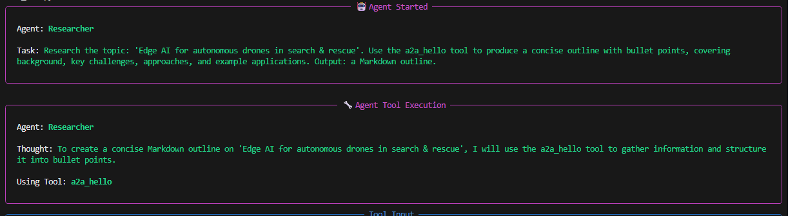


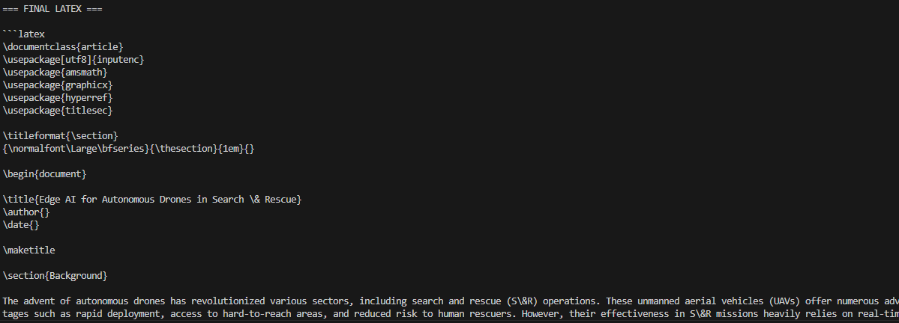


-----

## 7\. Containerization with Docker

Containerizing the application with Docker ensures consistency and portability across different environments.

**Build and Run the Docker Image:**

```bash
# Build the image, tagging it with a version
docker build -t ruslanmv/universal-a2a-agent:1.2.0 .

# Run the container, passing credentials as environment variables
docker run --rm -p 8000:8000 \
  -e PUBLIC_URL=http://localhost:8000 \
  -e LLM_PROVIDER=watsonx \
  -e WATSONX_API_KEY=$WATSONX_API_KEY \
  -e WATSONX_URL=$WATSONX_URL \
  -e WATSONX_PROJECT_ID=$WATSONX_PROJECT_ID \
  ruslanmv/universal-a2a-agent:1.2.0
```

> Note: The `PUBLIC_URL` variable is used by the agent service itself. For deploying the MatrixHub service, a different variable, `PUBLIC_BASE_URL`, is often required.

-----

## 8\. Production Deployment: Publishing to MatrixHub

In a production environment, agents must be discoverable. This is achieved by publishing a manifest to **MatrixHub**.

### 8.1. Authoring the Agent Manifest

Create a manifest file (`agent.manifest.yaml`) that describes your agent. This file contains all the metadata needed for discovery and communication.

```yaml
schema_version: 1

type: agent
id: universal-a2a-hello
version: 1.2.0
name: Universal A2A — Hello
summary: JSON-RPC echo agent, backed by IBM watsonx.ai
homepage: https://example.com/universal-a2a
license: Apache-2.0
capabilities: ["echo", "summarize"]

# A2A-specific manifest block
manifests:
  a2a:
    version: "1.0"
    # This URL must be the final, publicly accessible endpoint of your agent
    endpoint_url: "https://your-agent.example.com/a2a"
    agent_type: jsonrpc # The protocol type
    auth: { type: none, value: "" } # Can be 'bearer' or 'api_key'
    tags: ["watsonx", "demo"]
    # This block allows MatrixHub to auto-register a virtual server in MCP Gateway during install
    server:
      name: universal-a2a-hello-server
      description: Gateway virtual server exposing this A2A agent
```

### 8.2. Publishing to MatrixHub

MatrixHub ingests a catalog by fetching an `index.json` file that points to one or more manifest files. Host your manifest and index files on a reachable `http(s)://` server (e.g., GitHub Pages, S3). `file://` sources are not supported.

**Example `index.json`:**

```json
{
  "manifests": [
    "https://your-host.com/agent.manifest.yaml"
  ]
}
```

**Ingest the catalog into MatrixHub:**

```bash
# Use a non-TLS port for local dev, or https://localhost for local TLS
export HUB_BASE=${HUB_BASE:-http://localhost:8080}

# Ingest using the current route
curl -s -X POST "$HUB_BASE/catalog/ingest" -H 'Content-Type: application/json' \
  -d '{"index_url":"https://your-host.com/index.json"}' | jq

# For legacy deployments, the route might be /ingest
# curl -s -X POST "$HUB_BASE/ingest" -H 'Content-Type: application/json' \
#   -d '{"index_url":"https://your-host.com/index.json"}' | jq
```

> **Note on Database Schema:** For A2A metadata to persist correctly, the MatrixHub database `entity` table requires `protocols` (jsonb) and `manifests` (jsonb) columns. If these are missing, ingestion will still succeed, but A2A-specific data will not be saved.

### 8.3. Installing the Agent and Registering with the Gateway

The **install** step is what triggers the registration with MCP Gateway.

```bash
# This 'install' command triggers the best-effort Gateway registration
curl -s -X POST "$HUB_BASE/catalog/install" -H 'Content-Type: application/json' \
  -d '{"id":"agent:universal-a2a-hello@1.2.0","target":"/tmp/myapp"}' | jq
```

**Corrected Behavior:**
After ingestion, the agent is discoverable in MatrixHub. During the **install** process, if the `MCP_GATEWAY_URL` environment variable is configured for your MatrixHub instance and your `manifests.a2a.server` block is present, MatrixHub will make a best-effort attempt to register the agent with the Gateway via a `POST /a2a` request and create its virtual server via `POST /servers`.

-----

## 9\. Direct Registration with MCP Gateway

For more direct control, you can register the agent and its virtual server programmatically using the production gateway client or raw API calls.

### Recommended Method: Using the Production Client

The preferred, production-safe method is to use the provided gateway client, which handles endpoint logic, idempotency, and authentication.

```python
# File: scripts/register_a2a.py
import os
from src.services.gateway_client import register_a2a_agent, create_server_with_a2a

TOKEN = os.getenv("MCP_GATEWAY_TOKEN")  # optional; client can mint JWT instead

# 1. Define and register the A2A agent
agent_spec = {
    "name": "universal-a2a-hello",
    "endpoint_url": "https://your-agent.example.com/a2a",
    "agent_type": "jsonrpc",
    "auth_type": "none",
    "auth_value": None,
    "tags": ["watsonx", "demo"],
}
print(register_a2a_agent(agent_spec, idempotent=True, token=TOKEN))

# 2. Define and create the virtual server
server_payload = {
    "name": "universal-a2a-hello-server",
    "description": "Gateway virtual server exposing the A2A agent",
    "associated_a2a_agents": [agent_spec["name"]],
}
print(create_server_with_a2a(server_payload, idempotent=True, token=TOKEN))
```

### Alternative: Raw API Requests

For transparency and understanding the underlying API calls, here is the equivalent using raw `requests`. Note the corrected endpoint paths (`/a2a` and `/servers`).

```python
# File: scripts/register_a2a_raw.py
import os, requests

GATEWAY = os.getenv("MCP_GATEWAY_URL", "http://localhost:4444")
HEADERS = {"Content-Type": "application/json"}

# Handle authentication token correctly
if os.getenv("MCP_GATEWAY_TOKEN"):
    t = os.getenv("MCP_GATEWAY_TOKEN").strip()
    HEADERS["Authorization"] = t if t.lower().startswith(("bearer ", "basic ")) else f"Bearer {t}"

# 1. Register agent at POST /a2a
agent = {"name":"universal-a2a-hello","endpoint_url":"https://your-agent.example.com/a2a","agent_type":"jsonrpc","auth_type":"none","auth_value":None,"tags":["watsonx","demo"]}
print(requests.post(f"{GATEWAY}/a2a", json=agent, headers=HEADERS, timeout=15).text)

# 2. Create server at POST /servers
server = {"name":"universal-a2a-hello-server","description":"Gateway virtual server exposing the A2A agent","associated_a2a_agents":[agent["name"]]}
print(requests.post(f"{GATEWAY}/servers", json=server, headers=HEADERS, timeout=15).text)
```

Run your chosen script with your Gateway's URL configured:

```bash
export MCP_GATEWAY_URL="https://gateway.example.com"
# export MCP_GATEWAY_TOKEN="your_token_if_needed"
python scripts/register_a2a.py
```

-----

## 10\. Consuming the Deployed Agent from a watsonx.ai Notebook

Once your agent is deployed and publicly accessible via an HTTPS endpoint, it can be easily consumed from any client environment, including a Jupyter Notebook running in watsonx.ai.

```python
import os, requests

# The public base URL of your deployed agent
BASE = os.getenv("A2A_BASE", "https://your-agent.example.com")
TOKEN = os.getenv("A2A_TOKEN") # An auth token, if you configured one

headers = {"Content-Type": "application/json"}
if TOKEN:
    headers["Authorization"] = f"Bearer {TOKEN}"

body = {
    "model": "universal-a2a-hello",
    "messages": [{"role": "user", "content": "ping from watsonx.ai notebook"}],
}

# Call the OpenAI-compatible endpoint
response = requests.post(
    f"{BASE}/openai/v1/chat/completions",
    json=body,
    headers=headers,
    timeout=20
)
response.raise_for_status()
content = response.json()["choices"][0]["message"]["content"]
print(content)
```


### Concluding Analysis: Architectural Merits

This architecture provides a robust foundation for building scalable, enterprise-grade agentic applications.

- **Protocol-Driven Decoupling**: By relying on standard manifests (Agent Card, A2A) and protocols (JSON-RPC, OpenAI-compatible), the agent is decoupled from any specific client or framework, promoting interoperability.
- **Extensibility and Vendor Neutrality**: The pluggable provider and framework layers allow the system to adapt to new LLMs and orchestration techniques without requiring a rewrite of the core service.
- **Production-Grade Operations**: The design includes essential operational features like health checks, structured logging, and containerization. The publishing flow via MatrixHub and MCP Gateway provides a managed, secure, and discoverable deployment pattern suitable for enterprise environments.
- **Simplified Ingestion**: The catalog-based approach with MatrixHub enables a safe and idempotent process for discovering and registering new agents into the ecosystem.

**Congratulations!**, you have learned how to build a truly robust, scalable, and enterprise-grade agentic application! By leveraging this decoupled, extensible, and production-ready architecture, you're now equipped to create sophisticated AI agents that can seamlessly integrate and operate within any modern tech ecosystem. Happy building! 