Hello everyone, today we are going to explain how to create a production‑ready chatbot server powered by IBM Watsonx.ai and exposed via the Model Context Protocol (MCP) Python SDK. By the end, you’ll have a reusable MCP service that any MCP‑compatible client (e.g., Claude Desktop, custom Python clients) can invoke as a standardized “chat” tool.


We’ll walk through:

- Setting up your environment step‑by‑step  
- Installing dependencies and managing credentials securely  
- Writing clean, well‑documented Python code  
- Exposing Watsonx.ai inference as an MCP tool  
- Running, testing, and troubleshooting your server  
- Tips for extending and hardening the service  


## Introduction

**IBM Watsonx.ai** offers cutting‑edge large‑language‑model (LLM) inference via IBM Cloud, while the Model Context Protocol (MCP) standardizes how applications expose tools, resources, and prompts to LLM clients. By combining these two, you get:

- **Modularity:** decouple your chatbot logic from client implementations.  
- **Reusability:** any MCP‑compatible client can call the same “chat” endpoint.  
- **Rapid iteration:** built‑in development inspector with live reloading.  

Whether you’re building an internal helpdesk bot or a public chatbot API, this pattern scales and adapts easily.

The **Model Context Protocol (MCP)** standardizes the interface between applications and LLMs. With MCP, you can separate the concerns of providing context, executing code, and managing user interactions. The MCP Python SDK implements the full MCP specification, allowing you to:

- **Expose Resources:** Deliver data to LLMs (similar to GET endpoints).
- **Define Tools:** Provide functionality that performs actions or computations (like POST endpoints).
- **Create Prompts:** Offer reusable, templated interactions.

For more details you can visit the blog [Simple-MCP-Server-with-Python ](https://ruslanmv.com/blog/Simple-MCP-Server-with-Python).

### Prerequisites

Before you begin, ensure you have:

- **IBM Cloud Watsonx.ai credentials:** an API key, service URL, and project ID  
- **Python 3.9+** (we recommend 3.11+ for performance and typing improvements)  
- **pip** (Python package installer)  
- **Virtual environment tool** (`venv` or `virtualenv`)  
- **Basic command‑line familiarity** (Linux/macOS/Windows WSL)  

We’ll install the following Python packages:

- `python-dotenv` – load environment variables from a `.env` file  
- `ibm-watsonx-ai` – IBM’s official Watsonx.ai SDK  
- `mcp[cli]` – MCP Python SDK & CLI tools  


## Environment Setup

1. **Create & activate a virtual environment**  

   ```bash
   python3 -m venv .venv
   source .venv/bin/activate      # macOS/Linux
   .venv\Scripts\activate.bat     # Windows
   ```

2. **Pin and install dependencies**  

For the requirements.txt

```
python-dotenv>=0.21.0
ibm-watsonx-ai==1.3.8
mcp[cli]>=1.6.0
```


```bash
pip install --upgrade pip
pip install -r requirements.txt
```

3. **Secure your credentials**  

   - Create a file named `.env` in the project root.  

   - Add your Watsonx.ai details:

     ```dotenv
     WATSONX_APIKEY=your-ibm-watsonx-api-key
     WATSONX_URL=https://api.your-region.watsonx.ai
     PROJECT_ID=your-watsonx-project-id
     ```

   - Add `.env` (and `.venv/`, `__pycache__/`) to `.gitignore`:

     ```gitignore
     .env
     .venv/
     __pycache__/
     ```

## Writing the Chatbot Server (`server.py`)

Open `server.py` and follow these sections.

### Imports & Configuration

```python
# server.py

import os
import logging
from dotenv import load_dotenv
from mcp.server.fastmcp import FastMCP

# IBM Watsonx.ai SDK
from ibm_watsonx_ai import APIClient, Credentials
from ibm_watsonx_ai.foundation_models import ModelInference
from ibm_watsonx_ai.metanames import GenTextParamsMetaNames as GenParams
```

- We configure logging for easier debugging.  
- We load environment variables early.

```python
# Load .env variables
load_dotenv()

# Fetch credentials
API_KEY    = os.getenv("WATSONX_APIKEY")
URL        = os.getenv("WATSONX_URL")
PROJECT_ID = os.getenv("PROJECT_ID")
MODEL_ID   = os.getenv("MODEL_ID", "ibm/granite-13b-instruct-v2")
```

### Credential Validation & Client Initialization

```python
# Validate env vars
for name, val in [
    ("WATSONX_APIKEY", API_KEY),
    ("WATSONX_URL", URL),
    ("PROJECT_ID", PROJECT_ID)
]:
    if not val:
        raise RuntimeError(f"{name} is not set. Please add it to your .env file.")

# Configure logging
logging.basicConfig(
    level=logging.INFO,
    format="%(asctime)s [%(levelname)s] %(message)s"
)

# Initialize IBM credentials & client
creds  = Credentials(url=URL, api_key=API_KEY)
client = APIClient(credentials=creds, project_id=PROJECT_ID)

# Initialize the inference model
model = ModelInference(
    model_id=MODEL_ID,
    credentials=creds,
    project_id=PROJECT_ID
)

logging.info(
    f"Initialized Watsonx.ai model '{MODEL_ID}' "
    f"for project '{PROJECT_ID}'."
)
```

### Defining the MCP “chat” Tool

```python
# Create the MCP server instance
mcp = FastMCP("Watsonx Chatbot Server")

@mcp.tool()
def chat(query: str) -> str:
    """
    MCP tool: generate a chatbot response via Watsonx.ai

    :param query: User's input message
    :return: Watsonx.ai generated response
    """
    logging.info("Received chat query: %r", query)

    # Define generation parameters
    params = {
        GenParams.DECODING_METHOD: "greedy",
        GenParams.MAX_NEW_TOKENS:   200,
    }

    # Run the model
    try:
        # Request the full JSON response rather than just a string
        resp = model.generate_text(
            prompt=query,
            params=params,
            raw_response=True
        )
        print("AI raw response:", resp)

        # Extract the generated text from the dict
        text = resp["results"][0]["generated_text"].strip()
        logging.info("Generated response: %r", text)
        return text

    except Exception as e:
        logging.error("Inference error: %s", e, exc_info=True)
        return f"Error generating response: {e}"
```

---

### Prompts & Resources

**Exposing Resources**  
Resources let you inject dynamic data into your LLM’s context. For example, here we expose a personalized greeting:

```python
# Expose a greeting resource that dynamically constructs a personalized greeting.
@mcp.resource("greeting://patient/{name}")
def get_greeting(name: str) -> str:
    """
    Return a medical‑style greeting for the given patient name.
    
    :param name: The patient's name.
    :return: A personalized greeting.
    """
    return f"Hello {name}, I’m your medical assistant. How can I help you today?"
```

**Adding Prompts (Optional)**  
Prompts let you define reusable templates. Here’s a simple medical‑chat example that asks the model to assess symptoms:

```python
from mcp.server.fastmcp.prompts import base

@mcp.prompt()
def assess_symptoms(symptoms: str) -> str:
    """
    Prompt template for symptom assessment.
    
    :param symptoms: Description of patient symptoms.
    :return: A prompt asking the LLM to analyze and suggest next steps.
    """
    return (
        f"{base}\n"
        "You are a qualified medical assistant. The patient reports the following symptoms:\n"
        f"{symptoms}\n\n"
        "Please provide possible causes, recommended next steps, and when to seek immediate care."
    )
```

---

### Entry Point & Logging

```python
if __name__ == "__main__":
    # Start the MCP server (blocking call)
    logging.info("Starting MCP server on STDIO transport...")
    mcp.run()
```

That’s it! You now have:

1. A working `chat` tool that correctly parses `raw_response` from Watsonx.ai.  
2. A **resource** to inject personalized greetings.  
3. An optional **prompt** template for medical symptom assessment.

## Running & Testing the Server

First we load our enviroment

```
source .venv/bin/activate
```

### Development Mode with `mcp dev`

The fastest way to iterate is:

```bash
mcp dev server.py
```

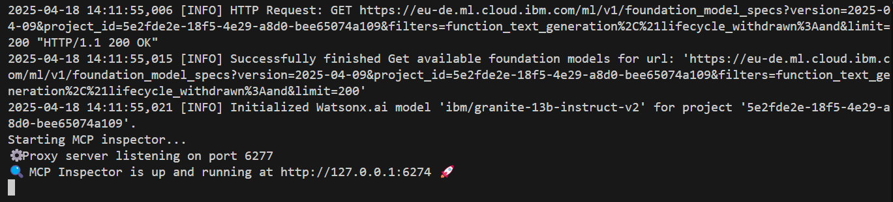

- **Live reloading** on code changes  
- **Inspector UI** at `http://localhost:6274/`  
- Interactive testing of the `chat` tool  

## How to interact with the Server

You can enter to 
[http://localhost:6274/](http://localhost:6274/)

When you open the Inspector in your browser, you will notice several key sections designed to facilitate server testing.

Go to the top of the MCP Inspector interface where it shows:

```
Transport Type: STDIO  
Command: python  
Arguments: run --with mcp mcp run server.py
```

Due to in our server.py is a standalone script using a normal pip-based virtual environment, we need to correct configuration in the MCP Inspector to:

```
Transport Type: STDIO  
Command: python  
Arguments: server.py
```

Then click Connect and our server will be launched properly using the Python interpreter.

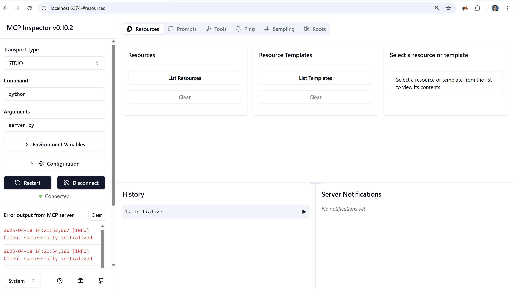

Then go to tools then list tools and click on chat tna dhten in the query you can type

```
What is watsonx in IBM?
```

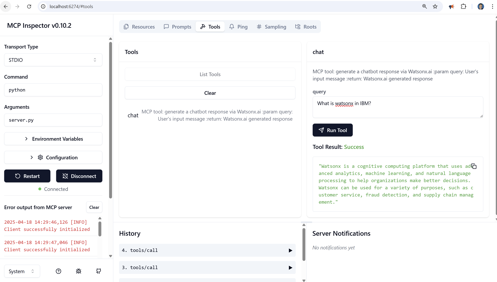


## Prompt via the MCP Inspector

In the Inspector’s sidebar, expand **Prompts** → **List prompts**.

You should see `assess_symptoms` listed.

In the prompt pane, you’ll find a form or JSON editor ready to accept arguments.

Supply the `code` parameter. For example:

```
persistent dull ache, stiffness, and general back pain
```

Click **Get Prompt**.

You will receive:

```json
{
  "messages": [
    {
      "role": "user",
      "content": {
        "type": "text",
        "text": "<module 'mcp.server.fastmcp.prompts.base' from '/mnt/c/Blog/Watsonx-ai-Chatbot-Server-with-MCP/.venv/lib/python3.11/site-packages/mcp/server/fastmcp/prompts/base.py'>\nYou are a qualified medical assistant. The patient reports the following symptoms:\npersistent dull ache, stiffness, and general back pain\n\nPlease provide possible causes, recommended next steps, and when to seek immediate care."
      }
    }
  ]
}
```

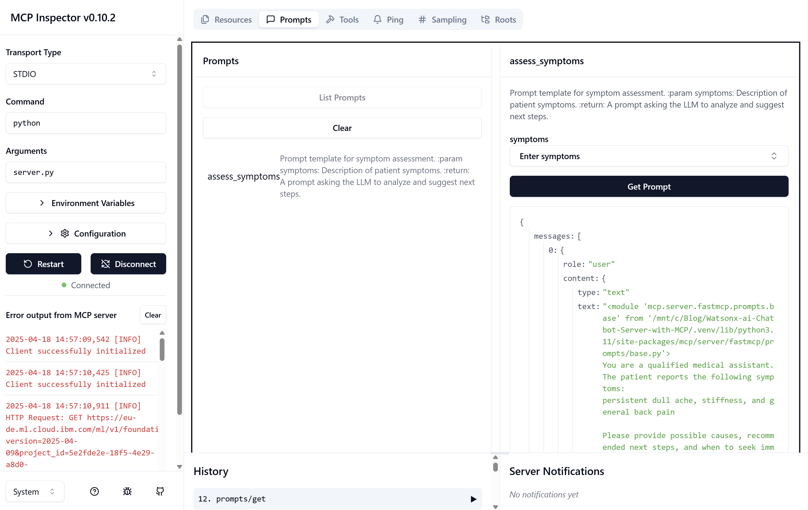


## Accessing a Resource 

Once your server is up and running in the Inspector (using the setup from above), you can invoke any registered resource by its URI:

1. Open the Resource Interaction Pane
   In the MCP Inspector sidebar, click Resources → Resource Templates. click List templates and select get_greeting
2. Enter the Resource URI
   In the input field name, type:
   John
3. Invoke the Resource
   Click Read Resource.
   The Inspector will send that URI to your @mcp.resource("greeting://{name}") handler.
4. View the Response
   You should see:

```json
{
  "contents": [
    {
      "uri": "greeting://patient/John",
      "mimeType": "text/plain",
      "text": "Hello John, I’m your medical assistant. How can I help you today?"
    }
  ]
}
```

This confirms your dynamic greeting resource is wired up correctly and returns personalized output on demand.

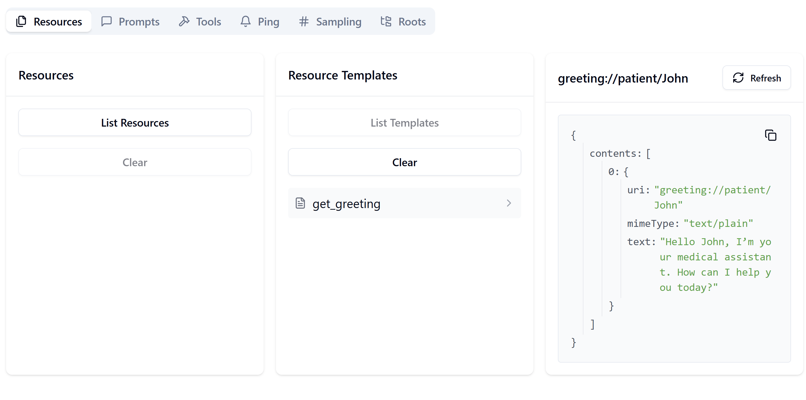

### Direct Execution

To run without the Inspector:

```bash
python server.py
```

It will sit silently waiting for MCP‑formatted requests on STDIO.

### Example Python Client

Save this as `client.py` alongside `server.py`:

```python
# client.py
import asyncio
from mcp import ClientSession
from mcp.client.stdio import stdio_client
from mcp import StdioServerParameters

async def main():
    server_params = StdioServerParameters(command="python", args=["server.py"])
    async with stdio_client(server_params) as (reader, writer):
        async with ClientSession(reader, writer) as session:
            await session.initialize()
            # Call the chat tool
            user_msg = "Hello, how are you today?"
            response = await session.call_tool("chat", arguments={"query": user_msg})
            print("Bot:", response)

if __name__ == "__main__":
    asyncio.run(main())
```

Run your server in one terminal (`python server.py`),
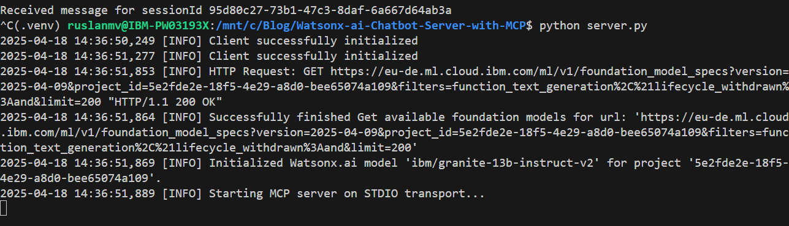

 then in another:

```bash
python client-tool.py
```

You should see:

```
Bot: meta=None content=[TextContent(type='text', text='I am good. Thank you.', annotations=None)] isError=False  
```

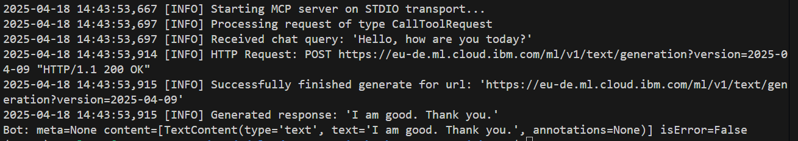


Now that we have learned how to interact with the MCP Server let us build a complete web app in Flask.


## Building a Watsonx.ai Medical Chatbot with Flask and MCP

Lets now  walk through creating a web‑based medical chatbot using:

- **MCP (Modular Chat Protocol)** to structure our prompt and tool calls
- **Watsonx.ai** for LLM inference
- **Flask** for the frontend UI

By the end, you’ll have a Flask app that:

1. **Greets** the user by name
2. **Collects** their symptoms
3. **Generates** a diagnosis prompt via MCP
4. **Calls** Watsonx.ai to get medical advice
5. **Displays** the assessment on a styled web page

## Project Structure

```text
├─ chatbot.py
├─ server.py                # Your MCP server implementation
├─ static/
│   └─ assets/
│       └─ watsonx-wallpaper.jpg
└─ templates/
    ├─ base.html
    ├─ home.html
    ├─ symptoms.html
    └─ diagnosis.html
```

All front‑end templates live under `templates/`. Static assets (like our wallpaper) go in Flask’s `static/` directory.

---

## Step 1: Writing `chatbot.py`

This script initializes a single long‑lived MCP client session on import and reuses it across requests.

```python
import os
import atexit
import asyncio
from flask import Flask, render_template, request, redirect, url_for, session
from mcp import ClientSession, StdioServerParameters
from mcp.client.stdio import stdio_client

# Flask app setup
app = Flask(__name__)
app.secret_key = os.environ.get("SECRET_KEY", os.urandom(24))

# MCP server parameters
SERVER_PARAMS = StdioServerParameters(command="python", args=["server.py"], env=None)

# Dedicated asyncio loop for MCP
loop = asyncio.new_event_loop()
asyncio.set_event_loop(loop)

# Globals for client and session contexts
_stdio_ctx = None
_session_ctx = None
SESSION = None

async def _init_session():
    global _stdio_ctx, _session_ctx, SESSION
    _stdio_ctx = stdio_client(SERVER_PARAMS)
    _reader, _writer = await _stdio_ctx.__aenter__()
    _session_ctx = ClientSession(_reader, _writer)
    SESSION = await _session_ctx.__aenter__()
    await SESSION.initialize()

# Initialize once at import
loop.run_until_complete(_init_session())
app.logger.info("MCP client session initialized once.")

async def _close_session():
    if _session_ctx:
        await _session_ctx.__aexit__(None, None, None)
    if _stdio_ctx:
        await _stdio_ctx.__aexit__(None, None, None)

atexit.register(lambda: loop.run_until_complete(_close_session()))

# Helper: fetch greeting text
def fetch_greeting(name: str) -> str:
    resp = loop.run_until_complete(SESSION.read_resource(f"greeting://patient/{name}"))
    contents = getattr(resp, 'contents', None)
    if isinstance(contents, list):
        return "\n".join(c.text for c in contents).strip()
    return str(resp)

# Helper: assess symptoms via chat tool
def assess_symptoms(symptoms: str) -> str:
    prompt_resp = loop.run_until_complete(
        SESSION.get_prompt("assess_symptoms", arguments={"symptoms": symptoms})
    )
    # Extract clean text from prompt_resp.messages
    msgs = getattr(prompt_resp, 'messages', None)
    if msgs:
        lines = []
        for m in msgs:
            txt = m.content.text if hasattr(m.content, 'text') else str(m.content)
            if txt.startswith("<module"):
                txt = txt.split("\n", 1)[1]
            lines.append(txt)
        diagnosis_prompt = "\n".join(lines).strip()
    else:
        diagnosis_prompt = str(prompt_resp)

    tool_resp = loop.run_until_complete(
        SESSION.call_tool("chat", arguments={"query": diagnosis_prompt})
    )
    cont = getattr(tool_resp, 'content', None)
    if isinstance(cont, list):
        return "\n".join(c.text for c in cont).strip()
    return str(cont).strip()

# Flask routes
@app.route("/", methods=["GET", "POST"])
def home():
    if request.method == "POST":
        session['name'] = request.form['name']
        return redirect(url_for('symptoms'))
    return render_template("home.html")

@app.route("/symptoms", methods=["GET", "POST"])
def symptoms():
    name = session.get('name')
    if not name:
        return redirect(url_for('home'))

    if request.method == "POST":
        diag = assess_symptoms(request.form['symptoms'])
        return render_template("diagnosis.html", diagnosis=diag)

    greet = fetch_greeting(name)
    return render_template("symptoms.html", greeting=greet)

if __name__ == "__main__":
    app.run(debug=True)
```


We call `stdio_client` and `ClientSession` at import time to avoid reconnecting on every HTTP request.

`fetch_greeting` reads a resource and extracts only the text. `assess_symptoms` builds a clean prompt, invokes the `chat` tool, and returns the AI’s reply.


In the next step to do is the simple front end part of the html files to be created.

## Step 2: Base Template (`base.html`)

A single file to handle the wallpaper and layout for all pages.

<script src="https://gist.github.com/ruslanmv/d85cfdb35f4a451443cb467d8dee4910.js"></script>


We load the wallpaper as a full‑screen background. Use Tailwind utility classes to center content.

## Step 3: Home Page (`home.html`)


<script src="https://gist.github.com/ruslanmv/678d2fe46ac7d916705afc72f501d625.js"></script>


Extends `base.html` to inherit the background. Simple form to collect `name`.


## Step 4: Symptoms Page (`symptoms.html`)

<script src="https://gist.github.com/ruslanmv/5668711d1fd3c94f5f0cedb35b30c01a.js"></script>


Displays the greeting fetched from MCP. Collects `symptoms` text.


## Step 5: Diagnosis Page (`diagnosis.html`)


<script src="https://gist.github.com/ruslanmv/c65f08a4767eb1978a30e92960d04ddd.js"></script>

Renders the AI’s advice with preserved line breaks (`whitespace-pre-wrap`).


Once you have created the full project you simple run

```
pyhon server.py 
```

and in another terminal

```
python chatbot.py
```

you got
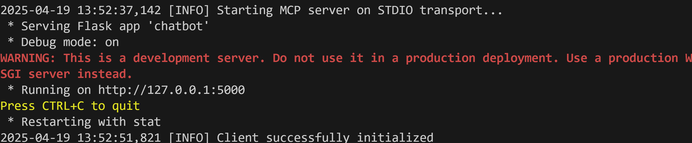

then you can simply enter to 
[http://127.0.0.1:5000/](http://127.0.0.1:5000/)


Once  you open the page you will enter to the `Home Page` then you can type the name of the patient
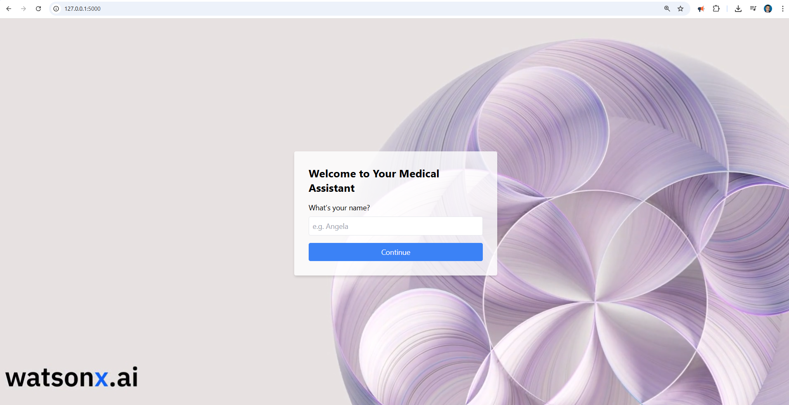


After you click continue, the chatbot greet you and then you can provide to the AI the following symptoms as example

```
Fever, Cough, Sore Throat, Muscle or Body Aches, Headache, Fatigue.
```

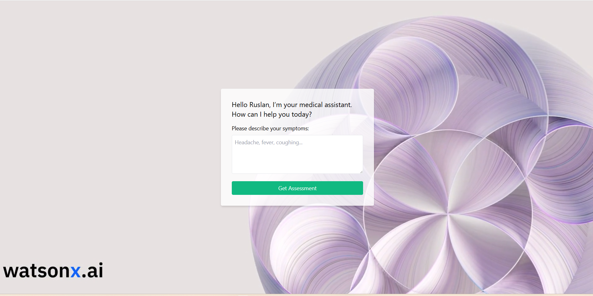

and after you click get assessment it is displayed a `Diagnosis Page` where here the AI will connect with WatsonX.ai by using the server MCP and we got the results.
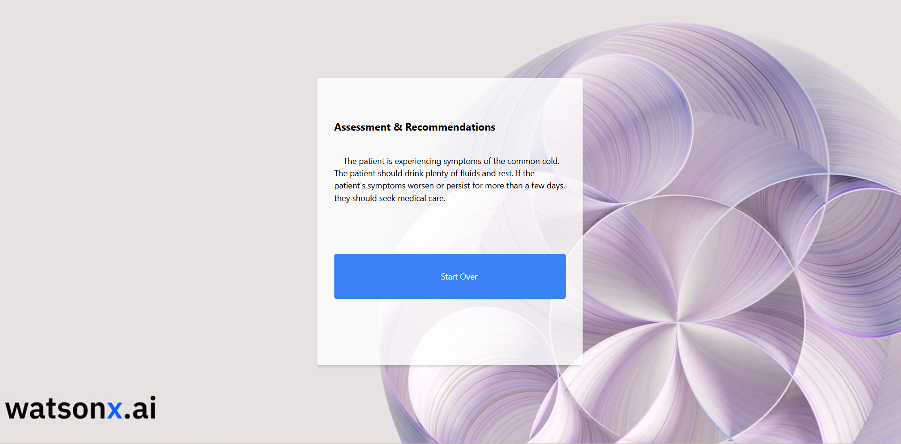


You can download all codes [here](https://github.com/ruslanmv/watsonx-mcp-server/)

### Troubleshooting & Best Practices

- **“.env not loaded”:** confirm `load_dotenv()` is called before `os.getenv`.  
- **“Connection refused”:** ensure you’re running the server (`mcp dev` or `python server.py`) before the client.  
- **Latency spikes:** consider using streaming endpoints or a smaller model.  
- **Secrets management:** for production, use a secure vault (AWS Secrets Manager, IBM Key Protect) instead of plain `.env`.  
- **Logging levels:** switch to `DEBUG` during development (`logging.basicConfig(level=logging.DEBUG)`).

## Conclusion

**Congratulations!**  You now have a full‑featured, production‑mindset Watsonx.ai chatbot server exposed via MCP. This pattern gives you a clean separation of concerns:

- **MCP server:** hosts and documents your tools  
- **Watsonx.ai:** handles powerful LLM inference  
- **Clients:** any standard MCP consumer (CLI, web UI, desktop app)  

Happy coding!
