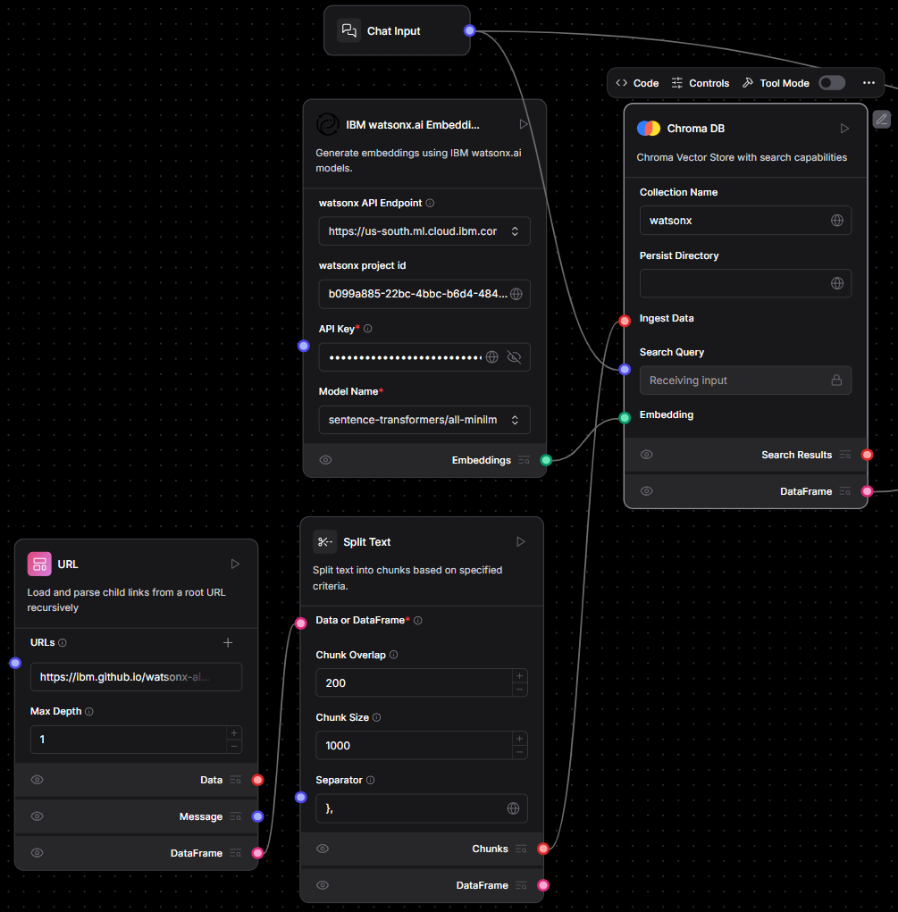

This tutorial provides a comprehensive and structured guide to integrating **IBM watsonx.ai** foundation models into the **Langflow** visual programming environment using custom components.  You will learn how to install Langflow, configure IBM watsonx.ai, develop chatbot and agent flows, and implement vector-based Retrieval-Augmented Generation (RAG) systems.

## Project Structure Overview

```
watsonx-langflow-integration/
├── .gitignore
├── LICENSE
├── README.md
├── requirements.txt
├── install.sh                  # Installation script for setting up the environment
└── components/
    ├── llm/
    │   └── watsonx.py          # IBM watsonx.ai LLM integration component
    └── embeddings/
        └── watsonx_embedding.py  # IBM watsonx.ai Embedding integration component
```

## What is Langflow?

Langflow is an open-source visual programming platform for building and orchestrating LLM (Large Language Model) applications without needing extensive coding.
 It enables users to create flexible AI workflows by connecting modular components through an intuitive drag-and-drop interface.

Langflow supports custom components, such as LLMs, embeddings, vector stores, tools, and agents, making it an ideal choice for building Retrieval-Augmented Generation (RAG) pipelines.

### Example: Generic Vector Store RAG Workflow

Below is a basic illustration of how Langflow integrates with vector stores to power RAG-based applications:


This modular structure allows you to easily extend, modify, or embed the components into a Langflow-based application for your specific needs.


## Features of the Integration

- Custom components fully compatible with Langflow's architecture.
- Secure API key management using `SecretStrInput`.
- Full parameterization of text generation settings (e.g., temperature, top_p, max_tokens, logprobs).
- Automatic dynamic retrieval of available IBM watsonx.ai models.
- Embedding generation support for use in RAG and vector search pipelines.
- Example integration of agent flows leveraging Langflow’s tool-calling framework.


## Installation and Environment Setup

### Prerequisites

To install Langflow and use this integration, you will need the following:

- Python 3.11 to 3.13
- `uv`, `pip`, or `pipx` for package management.
- A virtual environment (recommended for environment isolation)
- An IBM watsonx.ai account with a valid API key and project ID

### Cloning the Repository

First, clone the integration repository:

```bash
git clone https://github.com/ruslanmv/watsonx-langflow-integration
```

Then, navigate into the project directory:

```bash
cd watsonx-langflow-integration
```

### Installing the Environment with `install.sh`

You can set up the environment automatically by running the provided installation script. Open your terminal in the project directory and execute:

```bash
bash install.sh
```

This script will:

- Update system packages and install necessary dependencies.
- Set up Python 3.11 (or a compatible version) along with pip.
- Create and activate a virtual environment (named `.venv`).
- Install Langflow and required dependencies.
- Verify that the environment is ready for running Langflow.


## Adding IBM watsonx.ai Integration

### Step 1: Prepare Components

Create directories for Langflow custom components:

```bash
mkdir -p ~/.langflow/components/llm ~/.langflow/components/embeddings
```

Copy the provided files into these locations:

```bash
cp components/llm/watsonx.py ~/.langflow/components/llm/
cp components/embeddings/watsonx_embeddings.py ~/.langflow/components/embeddings/
```

### Step 2: Configure IBM watsonx.ai Access

To use IBM watsonx.ai, you will need:

- An IBM Cloud account
- A watsonx.ai project
- A project ID
- An API key

Visit [IBM watsonx.ai](https://dataplatform.cloud.ibm.com/) to create a project and retrieve these values.

Supported endpoint regions include:

- `https://us-south.ml.cloud.ibm.com`
- `https://eu-de.ml.cloud.ibm.com`
- `https://eu-gb.ml.cloud.ibm.com`
- `https://au-syd.ml.cloud.ibm.com`
- `https://jp-tok.ml.cloud.ibm.com`
- `https://ca-tor.ml.cloud.ibm.com`

### Step 3: Test Available Models

Run the following script to list available embeddings models in your region:

```bash
python components/utils/list_embeddings.py
```


```bash
python components/utils/list_models.py
```


This script queries the watsonx.ai model endpoint for currently supported models and lists them in the terminal.


## Creating Your First Langflow Flow with watsonx.ai  


Langflow turns the usually code-heavy task of building an LLM pipeline into a visual experience. In this walk-through you will spin up Langflow locally, drop IBM watsonx.ai components onto the canvas, and weave them together into a Retrieval-Augmented-Generation (RAG) chatbot that understands a documentation website in real time.

---

### Step 1 — Launching Langflow  

Begin by activating the virtual environment that was created during installation:

```bash
source .venv/bin/activate
```

With the environment live, start Langflow:

```bash
langflow run
```

Point your browser at **http://127.0.0.1:7860** and you will be greeted by the Langflow canvas. Create a fresh project by clicking **New Flow** and selecting **Blank Flow**; an empty grid now awaits your creativity.


### Step 2 — Feeding the Pipeline with Web Content  

Drag a **URL Loader** block onto the canvas. In its settings paste the page you want to study—for example `https://ibm.github.io/watsonx-ai-python-sdk/base.html`. Set the **Max Depth** field to 1 so the crawler stays on that single page rather than wandering through every internal link.  


Directly beneath it drop a **Split Text** block. Connect the blue *Data* pin of the URL Loader to the purple *Data* pin of Split Text. Inside the Split Text panel choose a chunk size of 1000 characters and an overlap of 200; this keeps each slice manageable while preserving enough context across boundaries for later embedding.


---

### Step 3 — Distilling Text into Embeddings  

Place the custom **Watsonx Embeddings** component onto the grid. Fill in your endpoint (for instance `https://us-south.ml.cloud.ibm.com`), your project ID and your API key, then select `sentence-transformers/all-minilm-l6-v2` as the model. Link the *Chunks* output of Split Text to the *Text* input of the Watsonx Embeddings block. Every chunk now emerges as a semantic vector ready for similarity search.


### Step 4 — Indexing Vectors with ChromaDB  

Add a **ChromaDB** block and name the collection `watsonx_docs`. If you want the database to survive restarts, specify a *Persist Directory* as well. Two connections are required: feed the text chunks from Split Text into the *Ingest Data* pin, and feed the vectors from the Embeddings block into the *Embedding* pin. Click the play icon and ChromaDB quietly indexes every vector it receives.




### Step 5 — Parsing Search Results for the LLM  

Introduce a **Parser** block, switch its mode to **Stringify**, and route the *Search Results* output of ChromaDB into the Parser’s input. Each retrieval will be flattened into plain text—ideal food for a prompt.


### Step 6 — Accepting Questions and Crafting Prompts  

Drop a **Chat Input** block onto the canvas. Wire its *Search Query* pin to the corresponding *Search Query* pin on ChromaDB, ensuring every user message triggers a nearest-neighbour lookup.  

Next bring in a **Prompt** block and type a minimal template such as:

```
Use the following context to answer the question:
{context}

Question: {question}
```

Send the stringified context from the Parser to the Prompt’s *Context* pin and the raw user text from Chat Input to the *Question* pin. The Prompt component now assembles a fully-formed instruction containing both knowledge and query.


### Step 7 — Generating Answers with watsonx.ai  

Position an **IBM watsonx.ai LLM** block. Supply the same endpoint, project ID and API key you used for embeddings, then pick an instruction-tuned model—for example `meta-llama/llama-4-scout-17b-16e-instruct`. Connect the *Prompt Message* output of the Prompt component to the LLM’s input. Whenever the user speaks, the model will receive a rich prompt and return a text response.


### Step 8 — Showing the Response to the User  

Finally, add a **Chat Output** block and join the LLM’s *Message* pin to Chat Output’s input. The conversational loop is now closed: question in, answer out.

Press **Run** at the top-right corner of Langflow, ask something like “How do I authenticate with the watsonx-ai Python SDK?” and watch the flow fetch the relevant snippet, build a context-aware prompt and deliver a precise explanation.


### Building an Agent-Style Flow  

Langflow can also orchestrate tool-enabled agents. Start a new flow and choose **Simple Agent** as the template. Replace the default LLM with the **IBM watsonx.ai LLM** you configured earlier, optionally drop in tools such as a URL reader or calculator, connect *Chat Input* to the agent and the agent to *Chat Output*, then run a prompt like “Create a tabletop RPG character.” The agent decides which tools to invoke and drafts a coherent reply via watsonx.ai.


### Putting the Finished Flow to Work  

Once the full RAG workflow is running, open **Playground** (the rightmost tab on the Langflow toolbar). In the chat panel type:

```
what are the Parameters of the APIClient
```

Langflow forwards your question through the pipeline, retrieves the matching chunk from the SDK documentation, builds a prompt and calls your LLM. With the example model **`meta-llama/llama-4-maverick-17b-128e-instruct-fp8`** you should see something close to:


---

### Using Langflow via Python (Recommended API Approach)

To interact with your Langflow flow programmatically, use the built-in **HTTP API** rather than importing components directly. This avoids circular import issues and follows Langflow's supported architecture.

Here’s a working example in Python using `requests`:

```python
import requests

# Replace with your actual Flow UUID
url = "http://127.0.0.1:7860/api/v1/run/<your-flow-uuid>"

payload = {
    "input_value": "Tell me about the IBM watsonx.ai platform.",
    "output_type": "chat",
    "input_type": "chat"
}

headers = {
    "Content-Type": "application/json"
}

try:
    response = requests.post(url, json=payload, headers=headers)
    response.raise_for_status()
    print("Response from Langflow:")
    print(response.text)
except requests.exceptions.RequestException as e:
    print(f"Error making API request: {e}")
```

> 💡 You can find your Flow UUID in the Langflow UI under `Export > API`.

This method allows you to run and test your Langflow workflows from any Python script or backend service without needing to access internal components directly.


Then you can  use

```python
import requests

# Replace with your actual Flow UUID
FLOW_ID = "2c02349f-303c-4fbd-b95d-d69646817840"
API_URL = f"http://127.0.0.1:7860/api/v1/run/{FLOW_ID}"

# Input payload for Langflow
payload = {
    "input_value": "hello world!",
    "input_type": "chat",
    "output_type": "chat"
}

headers = {
    "Content-Type": "application/json"
}

try:
    # Send the POST request to Langflow's API
    response = requests.post(API_URL, json=payload, headers=headers)
    response.raise_for_status()

    # Parse the JSON response
    data = response.json()

    # Attempt to extract the chatbot's response message
    message = (
        data.get("outputs", [{}])[0]
            .get("outputs", [{}])[0]
            .get("results", {})
            .get("message", {})
            .get("text", "")
    )

    if message:
        print("✅ AI Response:")
        print(message)
    else:
        print("⚠️ No valid message found in the response.")
        print("Raw Response:", response.text)

except requests.exceptions.RequestException as e:
    print(f"❌ Network or connection error: {e}")
except ValueError as e:
    print(f"❌ Error decoding JSON: {e}")

```


### Troubleshooting  


If you encounter caching hiccups, remove the `.cache/langflow/` folder in your home directory and restart the application. For deeper issues, lean on the [Langflow documentation](https://docs.langflow.org) or IBM watsonx.ai support.

### Where to Go from Here  

You have just created a fully working Retrieval-Augmented-Generation chatbot powered by IBM watsonx.ai.  Experiment with larger context windows, swap in different embedding models, or export the entire flow as a Python script and drop it straight into production. Langflow’s visual canvas combined with watsonx.ai’s enterprise-grade models gives you a rapid yet robust path from idea to deployed application.


**Congratulations!** You have learned how to build a Visual RAG Pipeline with Langflow and IBM watsonx.ai