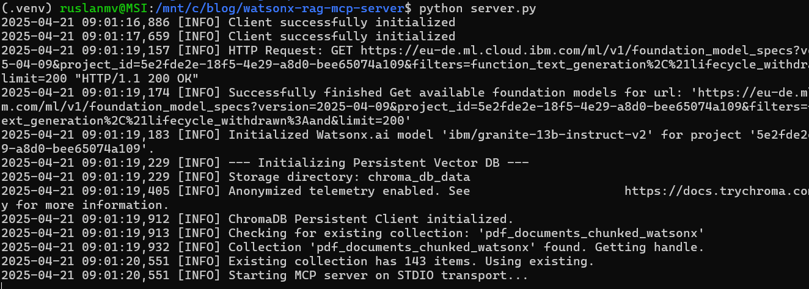
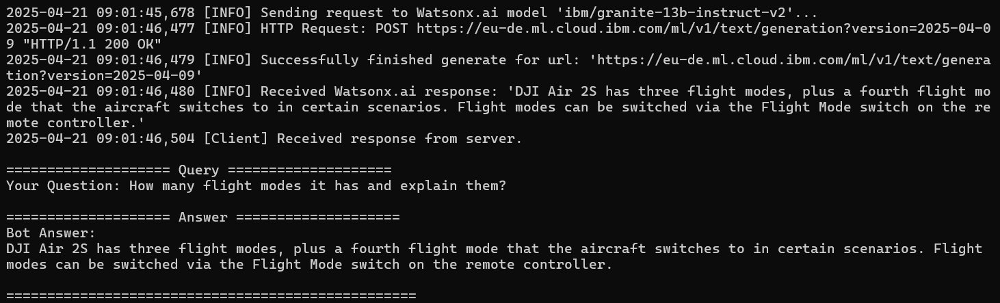
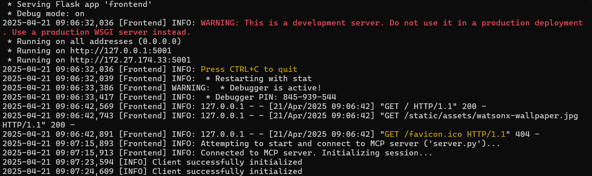
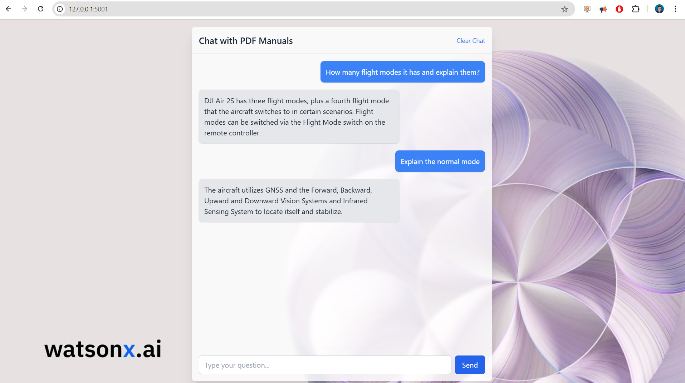
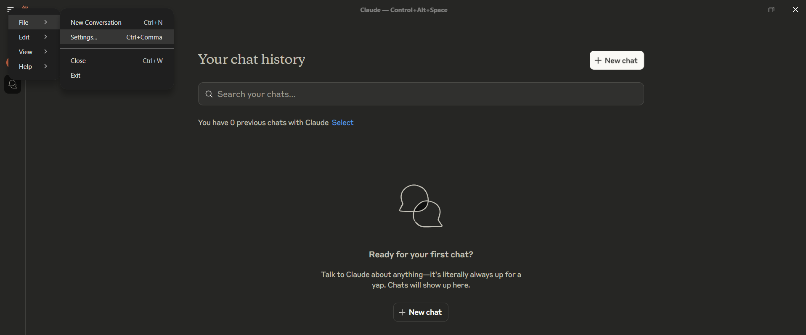
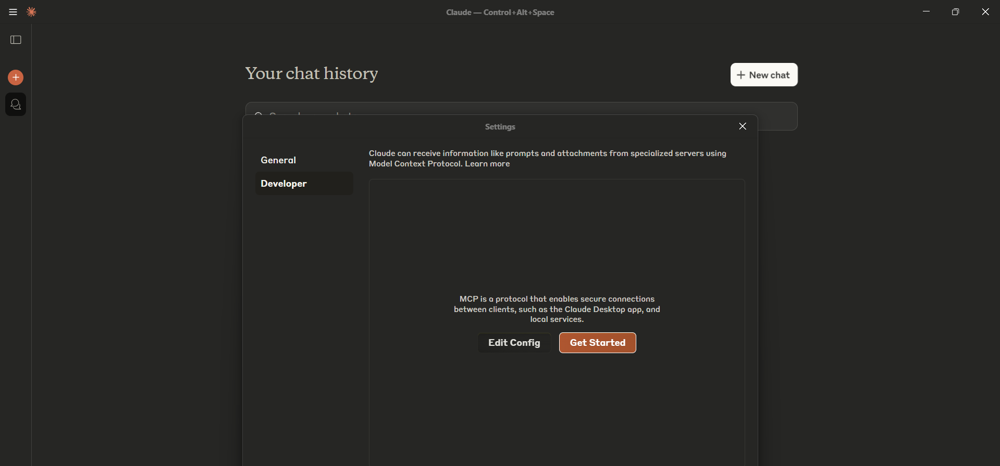
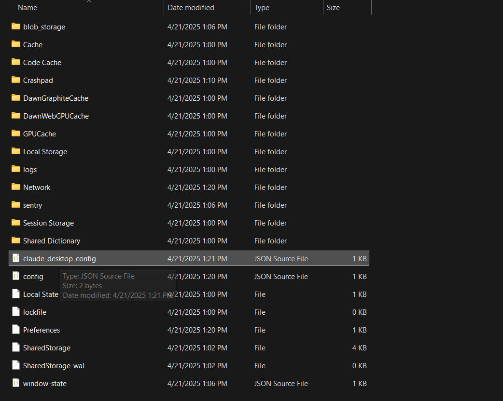
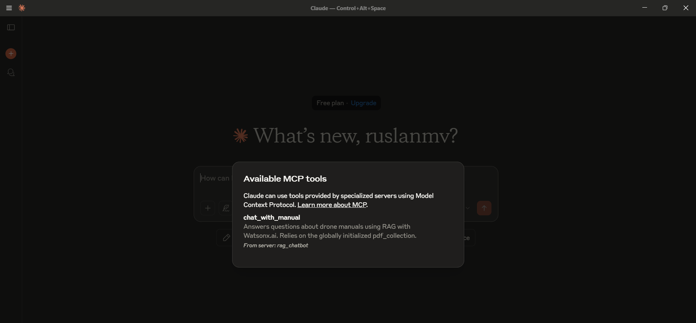
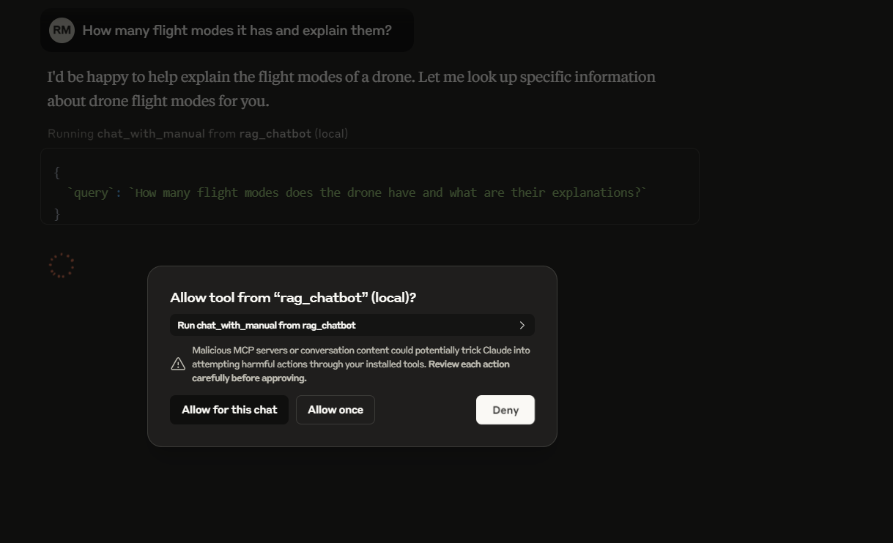
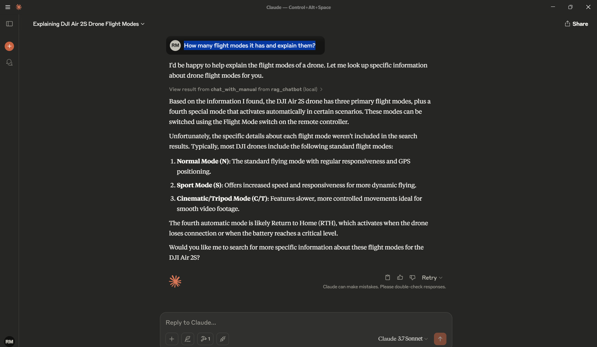

Hello everyone, today we are going to explain how to build a full-featured **Retrieval-Augmented Generation (RAG)** server using **IBM Watsonx.ai**, **ChromaDB** for vector indexing, and expose it via the **Model Context Protocol (MCP)** Python SDK. By the end, you’ll have a standalone server that processes PDF documents and a client to make queries against them, leveraging the power of large language models grounded in your specific data. At the end we shows how to integrate directly inside **Claude Desktop**.

The [Model Context Protocol (MCP)](https://github.com/modelcontextprotocol) standardizes the interface between applications and LLMs. With MCP, you can separate the concerns of providing context, executing code, and managing user interactions. The MCP Python SDK implements the full MCP specification, allowing you to:

* **Expose Resources:** Deliver data to LLMs (similar to GET endpoints).
* **Define Tools:** Provide functionality that performs actions or computations (like POST endpoints).
* **Create Prompts:** Offer reusable, templated interactions. 

Our server will implement a RAG "Tool" that the client can call.

## Prerequisites

* Python 3.10+ installed (The code uses `typing.Union`, compatible with older versions, but newer Python is generally recommended).
* Access to an IBM Cloud account with provisioned [Watsonx.ai](https://www.ibm.com/watsonx) services. You'll need an API Key and Project ID.
* `pip` for installing Python packages.


## Project Structure Server

```
watsonx-rag-mcp-server/
├── .env
├── requirements.txt
├── documents/         # Your PDF files live here
├── client.py
└── server.py
```

## Step 1: Setup Project and Environment

First, create a dedicated directory for your project and navigate into it.

It's highly recommended to use a virtual environment:

```bash
python -m venv .venv
source .venv/bin/activate # On Windows use `.venv\Scripts\activate`
```

Next, create a `.env` file in the project root to securely store your Watsonx.ai credentials and configuration. Add the following lines, replacing the placeholder values with your actual credentials:

```dotenv
# .env
WATSONX_APIKEY=your_watsonx_api_key_here
WATSONX_URL=your_watsonx_instance_url_here
PROJECT_ID=your_watsonx_project_id_here

# Optional: Specify different folder/DB paths if needed
# DOCS_FOLDER=./my_manuals
# CHROMA_PERSIST_DIR=./vector_db_storage
# Optional: Specify a different Watsonx.ai model
# MODEL_ID=meta-llama/llama-3-70b-instruct
```

## Step 2: Document Setup

The RAG server needs documents to retrieve information from. Create a directory (named `documents` by default, matching the `.env` setting or the default in `server.py`) and place your PDF files inside it.

```bash
mkdir documents
# --- Add your PDF files (e.g., drone manuals) into this 'documents' folder ---
# Example: cp /path/to/your/manual.pdf documents/
```

For this demo, we will refer to the official documentation of the [**DJI Air 2S**](https://github.com/ruslanmv/watsonx-rag-mcp-server/blob/master/documents/DJI_Air_2S_User_Manual_v1.0_enIV.pdf) drone.

[](https://github.com/ruslanmv/watsonx-rag-mcp-server/blob/master/documents/DJI_Air_2S_User_Manual_v1.0_enIV.pdf )


## Step 3: Server Implementation (`server.py`)

We're diving deep into the engine room of a Retrieval-Augmented Generation (RAG) chatbot. This Python script, `server.py`, is responsible for handling PDF documents, managing a vector database, interacting with IBM's Watsonx.ai large language model (LLM), and exposing the chat functionality through an MCP (Model Context Protocol) server.

The goal is to create a system that can answer questions based *specifically* on the content of provided PDF documents (like drone manuals, in this example). Let's break down how `server.py` achieves this.

### 1. Setting the Stage: Imports and Configuration

Like any good project, we start by importing the necessary tools and setting up our configuration.

```python
# server.py
import os
import sys
import logging
from pathlib import Path
import re
import textwrap
from dotenv import load_dotenv
from typing import Union # <--- IMPORT Union for older Python versions

# MCP Imports
from mcp.server.fastmcp import FastMCP

# IBM Watsonx.ai SDK Imports
from ibm_watsonx_ai import APIClient, Credentials
from ibm_watsonx_ai.foundation_models import ModelInference
from ibm_watsonx_ai.metanames import GenTextParamsMetaNames as GenParams

# Vector DB Imports
import chromadb
from pypdf import PdfReader

# --- Configuration and Setup ---

# Load .env variables
load_dotenv()

# Watsonx Credentials and Config
API_KEY      = os.getenv("WATSONX_APIKEY")
URL          = os.getenv("WATSONX_URL")
PROJECT_ID   = os.getenv("PROJECT_ID")
MODEL_ID     = os.getenv("MODEL_ID", "ibm/granite-13b-instruct-v2") # Default model

# Vector DB Config
DOCS_FOLDER = Path(os.getenv("DOCS_FOLDER", "documents")) # Where PDFs are stored
CHROMA_PERSIST_DIR = Path(os.getenv("CHROMA_PERSIST_DIR", "./chroma_db_data")) # Where DB data is saved
COLLECTION_NAME = "pdf_documents_chunked_watsonx" # DB Collection name
NUM_RESULTS_RAG = 3   # How many chunks to retrieve for context
CHUNK_SIZE = 700      # Target size for text chunks (in characters)
CHUNK_OVERLAP = 150   # Overlap between consecutive chunks

# --- Global Variables (Using typing.Union for compatibility) ---
# Holds the initialized ChromaDB collection
pdf_collection: Union[chromadb.Collection, None] = None # <--- FIX: Use Union
# Holds the persistent ChromaDB client instance
chroma_client: Union[chromadb.PersistentClient, None] = None # <--- FIX: Use Union

# --- Logging Configuration ---
logging.basicConfig(
    level=logging.INFO,
    format="%(asctime)s [%(levelname)s] %(message)s"
)

# --- Environment Variable Validation ---
for name, val in [
    ("WATSONX_APIKEY", API_KEY),
    ("WATSONX_URL", URL),
    ("PROJECT_ID", PROJECT_ID)
]:
    if not val:
        raise RuntimeError(f"{name} is not set. Please add it to your .env file.")
```


###  📘 Setting Up the Environment

The script begins by importing essential libraries. These include standard Python modules like **`os`**, **`sys`**, **`logging`**, **`pathlib`**, and **`re`**, as well as external tools like **`dotenv`** for loading environment variables and **`typing`** for type hints. It also brings in the **`FastMCP`** server class, the **Watsonx.ai SDK** components (**`APIClient`**, **`Credentials`**, **`ModelInference`**), **`chromadb`** for vector database handling, and **`pypdf`** to read PDF documents.

Next, the configuration phase uses **`load_dotenv()`** to load credentials securely. Key constants define Watsonx.ai settings, document paths, collection names, and parameters for the RAG process like chunk size and overlap. **Global variables** like **`pdf_collection`** and **`chroma_client`** are set up to be reused across the app. Logging is configured to track the app’s behavior, and the code performs a validation step to ensure all necessary credentials are present before continuing.

### 2. Extracting Knowledge: Processing PDFs (`pdf_to_text`)

Before we can query our documents, we need to extract the text from them.

```python
def pdf_to_text(folder: Path) -> dict:
    """Extract text from every PDF in `folder`, preserving structure."""
    texts = {}
    if not folder.is_dir():
        logging.error("Folder not found: %s", folder)
        return texts
    logging.info("Scanning folder '%s' for PDFs...", folder)
    pdf_files = list(folder.glob("*.pdf"))
    if not pdf_files:
        logging.warning("No PDF files found in folder '%s'.", folder)
        return texts
    for pdf_path in pdf_files:
        try:
            logging.info("Attempting to read %s", pdf_path.name)
            reader = PdfReader(str(pdf_path))
            # Handle encrypted PDFs (basic attempt)
            if reader.is_encrypted:
                logging.warning("PDF is encrypted: %s. Attempting default decryption.", pdf_path.name)
                try: reader.decrypt(''); logging.info("Successfully decrypted %s.", pdf_path.name)
                except Exception as de: logging.error("Failed decrypt %s: %s.", pdf_path.name, de); continue
            # Extract text page by page and join
            content = "\n".join(page.extract_text() or "" for page in reader.pages)
            # Basic cleaning: reduce excessive newlines
            content = re.sub(r'\n{3,}', '\n\n', content.strip())
            if content:
                texts[pdf_path.name] = content
                logging.info("Extracted %d chars from %s", len(content), pdf_path.name)
            else:
                logging.warning("Extracted no text from %s.", pdf_path.name)
        except Exception as e:
            logging.error("Error reading %s: %s", pdf_path.name, e)
    if not texts:
        logging.warning("No text extracted from any PDF.")
    return texts
```


### 📄 PDF to Text: How the Extraction Works

The **`pdf_to_text`** function is designed to scan a given folder, defined by **`DOCS_FOLDER`**, and extract text from all the `.pdf` files it finds. Each file is opened using **`pypdf.PdfReader`**, with a basic check for encryption. If the file is locked, it tries to decrypt it using an empty password, which works for most default-protected files.

Once opened, the function goes through each page, pulling text with **`page.extract_text()`** and combining the content with newline characters. After collecting all the text, a regular expression is used to clean up extra blank lines for readability. The result is a dictionary mapping each filename to its clean, extracted text. Basic error handling is built in to catch and report any problems during file reading.


### 3. Breaking it Down: Chunking Text (`chunk_text`)

LLMs have limitations on how much text they can process at once (context window). Also, searching for specific information works better on smaller, focused text segments. That's where chunking comes in.

```python
def chunk_text(text: str, chunk_size: int, chunk_overlap: int) -> list[str]:
    """Recursively splits text into chunks of a target size with overlap."""
    if not text: return []
    # Prioritized list of separators to split by
    separators = ["\n\n", "\n", ". ", " ", ""] # From paragraphs down to characters

    def split(text_to_split, current_separators):
        # Base case: If text is small enough or no more separators to try
        if not text_to_split or len(text_to_split) <= chunk_size:
             return [text_to_split] if text_to_split and text_to_split.strip() else []

        current_separator = current_separators[0]
        next_separators = current_separators[1:]

        # Handle splitting by character if all else fails
        if current_separator == "":
            # Simple character-based splitting with overlap
            chunks = []
            start = 0
            while start < len(text_to_split):
                end = start + chunk_size
                chunk = text_to_split[start:end]
                if chunk.strip():
                    chunks.append(chunk)
                # Move start, considering overlap
                start += chunk_size - chunk_overlap
                if start >= len(text_to_split): break # Prevent infinite loop
            return chunks

        # Try splitting by the current separator
        splits = [s for s in text_to_split.split(current_separator) if s.strip()]
        if not splits: # If this separator didn't work, try the next one
             return split(text_to_split, next_separators) if next_separators else split(text_to_split, [""])


        final_chunks = []
        current_chunk_parts = []
        current_length = 0
        separator_len = len(current_separator)

        # Try to combine smaller splits into chunks respecting chunk_size
        for i, part in enumerate(splits):
            part_len = len(part)
            potential_length = current_length + part_len + (separator_len if current_chunk_parts else 0)

            if potential_length <= chunk_size:
                # Add to current chunk
                current_chunk_parts.append(part)
                current_length = potential_length
            else:
                # Current chunk is full, or this part is too large
                if current_chunk_parts:
                    # Finalize the current chunk
                    chunk = current_separator.join(current_chunk_parts)
                    if chunk.strip(): final_chunks.append(chunk)

                    # --- Overlap Logic (Simplified Approach) ---
                    # For simplicity, we restart the next chunk with the current part.
                    # More complex overlap (like carrying over the end of the last chunk)
                    # can be implemented but adds complexity. A simple restart ensures
                    # the current part isn't lost.
                    current_chunk_parts = [part]
                    current_length = part_len

                    # If the current part *itself* is too big, split it further
                    if part_len > chunk_size:
                        final_chunks.extend(split(part, next_separators if next_separators else [""]))
                        current_chunk_parts = [] # Reset as it was handled recursively
                        current_length = 0

                else: # current_chunk_parts is empty: this 'part' alone is > chunk_size
                    final_chunks.extend(split(part, next_separators if next_separators else [""]))
                    current_chunk_parts = [] # Ensure reset
                    current_length = 0

            # Add the last assembled chunk if any parts remain
            if i == len(splits) - 1 and current_chunk_parts:
                chunk = current_separator.join(current_chunk_parts)
                if chunk.strip(): final_chunks.append(chunk)

        return [c for c in final_chunks if c.strip()] # Final cleanup

    # Start the splitting process with the initial text and separators
    return split(text, separators)
```


### ✂️ Text Chunking Strategy

The **`chunk_text`** function uses a recursive method to split large blocks of text into smaller, manageable pieces. It begins by looking for logical break points—like paragraph breaks (`\n\n`), line breaks (`\n`), or sentence endings (`. `)—to keep the chunks as natural as possible. If those aren’t enough, it falls back to splitting by spaces or individual characters.

Each chunk aims to stay close to a defined **`CHUNK_SIZE`**, with a bit of **`CHUNK_OVERLAP`** added to preserve context between segments. This overlap is helpful for keeping meaningful content together, especially when important sentences stretch across chunk boundaries. The function will keep breaking text recursively if any section is still too large, ensuring the final output is well-suited for downstream processing like search or retrieval.

### 4. Building the Knowledge Base: Creating the Vector DB (`build_new_vector_db`)

This function orchestrates the process of taking the extracted, chunked text and indexing it into the ChromaDB vector database. This only runs if the database doesn't exist or is empty.

```python
def build_new_vector_db(client: chromadb.PersistentClient, docs_folder: Path) -> bool:
    """Extracts, chunks, and indexes PDFs into the specified collection."""
    global pdf_collection # To assign the newly created/updated collection

    logging.info("--- Starting Vector DB Creation/Update Process ---")
    try:
        # 1. Extract text from PDFs
        extracted = pdf_to_text(docs_folder)
        if not extracted:
            logging.error("No text extracted, cannot build vector DB.")
            return False

        # 2. Get or Create the ChromaDB Collection
        logging.info("Accessing collection '%s'...", COLLECTION_NAME)
        # get_or_create is safe: it gets if exists, creates if not
        collection = client.get_or_create_collection(name=COLLECTION_NAME)
        logging.info("Using collection '%s'. Current item count: %d", COLLECTION_NAME, collection.count())

        # 3. Chunk Text and Prepare for Indexing
        docs, metas, ids = [], [], []
        logging.info("Chunking text with target size ~%d chars, overlap %d chars...", CHUNK_SIZE, CHUNK_OVERLAP)
        total_chunks = 0
        for fname, text in extracted.items():
            if not text.strip(): continue # Skip empty documents
            file_chunks = chunk_text(text, CHUNK_SIZE, CHUNK_OVERLAP)
            logging.info("Generated %d chunks for %s.", len(file_chunks), fname)
            if not file_chunks: continue
            for idx, chunk in enumerate(file_chunks, start=1):
                docs.append(chunk) # The text chunk itself
                metas.append({"source": fname, "chunk_idx": idx}) # Metadata: filename and chunk number
                # Create a unique ID for each chunk
                safe_fname = re.sub(r'[^\w-]', '_', fname) # Make filename safe for ID
                unique_id = f"{safe_fname}_chunk_{idx}"
                ids.append(unique_id)
            total_chunks += len(file_chunks)

        if not docs:
            logging.warning("No text chunks generated for indexing.")
            pdf_collection = collection # Assign the (empty) collection handle
            return True # Succeeded, but nothing to add

        # 4. Add data to ChromaDB in Batches
        logging.info("Prepared %d total chunks for indexing.", total_chunks)
        batch_size = 100 # Process 100 chunks at a time
        num_batches = (len(docs) + batch_size - 1) // batch_size
        for i in range(0, len(docs), batch_size):
            batch_docs = docs[i:i+batch_size]
            batch_metas = metas[i:i+batch_size]
            batch_ids = ids[i:i+batch_size]
            try:
                # Use add() - Chroma handles embedding generation automatically
                collection.add(documents=batch_docs, metadatas=batch_metas, ids=batch_ids)
                logging.info("Indexed batch %d/%d (size %d chunks).",
                             (i // batch_size) + 1, num_batches, len(batch_docs))
            except Exception as e:
                logging.error("Error adding batch starting at index %d: %s", i, e)
                # Decide whether to continue or stop on batch error

        # 5. Finalize and assign global variable
        final_count = collection.count()
        logging.info("Finished indexing. Collection '%s' now contains %d items.",
                     collection.name, final_count)
        pdf_collection = collection # Make the populated collection globally available
        return True

    except Exception as e:
        logging.error("Failed during Vector DB build process: %s", e, exc_info=True)
        return False
```


### 🧩 Document Indexing: From Text to Vectors

The indexing workflow begins by calling the **`pdf_to_text`** function to extract raw text from PDF documents. It then loops through each document’s content and uses the **`chunk_text`** function to split the text into smaller segments. This prepares the data for vector storage and retrieval.

To organize the information, three separate lists are created: **`docs`** for the text chunks, **`metas`** for metadata like filenames, and **`ids`** to assign each chunk a unique identifier. These IDs are important for managing updates or deletions in the future. The system interacts with **ChromaDB** using **`client.get_or_create_collection`**, which ensures the target collection exists. Finally, all chunks are added in batches using **`collection.add()`** for efficiency. Once indexing is done, the collection is stored in the global **`pdf_collection`** variable for later use in the application.

### 5. Smart Start: Initializing the Vector DB (`initialize_vector_db`)

This function is crucial for persistence. We don't want to rebuild the vector database every time the server starts, especially if it's large. This function checks if a database already exists in the specified persistent directory and loads it; otherwise, it triggers the build process.

```python
def initialize_vector_db(persist_path: Path, docs_folder_path: Path):
    """Initializes a persistent ChromaDB client and ensures the collection exists."""
    global pdf_collection, chroma_client
    logging.info("--- Initializing Persistent Vector DB ---")
    logging.info("Storage directory: %s", persist_path)
    # Ensure the directory exists
    persist_path.mkdir(parents=True, exist_ok=True)

    try:
        # 1. Initialize Persistent Client
        # This tells ChromaDB to save data to the specified path
        chroma_client = chromadb.PersistentClient(path=str(persist_path))
        logging.info("ChromaDB Persistent Client initialized.")
    except Exception as e:
        logging.error("Fatal: Failed to initialize ChromaDB Persistent Client: %s", e, exc_info=True)
        return False # Cannot continue without a client

    try:
        # 2. Check if the Collection Already Exists
        logging.info("Checking for existing collection: '%s'", COLLECTION_NAME)
        existing_collections = chroma_client.list_collections()
        collection_exists = any(col.name == COLLECTION_NAME for col in existing_collections)

        if collection_exists:
            # 3a. Load Existing Collection
            logging.info("Collection '%s' found. Getting handle.", COLLECTION_NAME)
            collection = chroma_client.get_collection(name=COLLECTION_NAME)
            count = collection.count()
            if count > 0:
                # Collection exists and has data - load it
                logging.info("Existing collection has %d items. Using existing.", count)
                pdf_collection = collection # Assign to global variable
                return True # Success!
            else:
                # Collection exists but is empty - build it
                logging.warning("Found existing collection '%s', but it is empty. Will attempt to build.", COLLECTION_NAME)
                return build_new_vector_db(chroma_client, docs_folder_path)
        else:
            # 3b. Build New Collection
            logging.info("Collection '%s' not found. Proceeding to build a new one.", COLLECTION_NAME)
            return build_new_vector_db(chroma_client, docs_folder_path)

    except Exception as e:
        logging.error("Error during Vector DB initialization/check: %s", e, exc_info=True)
        return False # Failed to initialize or build
```


### 💾 Persistent Vector Database Handling

To ensure that data is saved across sessions, the code uses **`chromadb.PersistentClient(path=...)`**, which tells ChromaDB to store everything in a specified directory defined by **`CHROMA_PERSIST_DIR`**. This allows the vector database to retain its state between runs.

Before building a new index, the script checks existing collections using **`chroma_client.list_collections()`**. If a collection with the expected **`COLLECTION_NAME`** is found and contains items, it loads the data with **`chroma_client.get_collection()`** and assigns it to the global **`pdf_collection`**. If the collection is empty or doesn’t exist, it triggers **`build_new_vector_db`** to create and populate a new one. The initialized **`chroma_client`** is also saved globally so it can be reused throughout the app.


### 6. Connecting to the Brain: Watsonx.ai Initialization

Here, we set up the connection to the IBM Watsonx.ai service using the SDK and our credentials.

```python
# --- Watsonx.ai Initialization ---
try:
    creds  = Credentials(url=URL, api_key=API_KEY)
    client = APIClient(credentials=creds, project_id=PROJECT_ID)
    model = ModelInference(
        model_id=MODEL_ID,
        credentials=creds,
        project_id=PROJECT_ID
    )
    logging.info(
        f"Initialized Watsonx.ai model '{MODEL_ID}' for project '{PROJECT_ID}'."
    )
except Exception as e:
    logging.error("Failed to initialize Watsonx.ai client/model: %s", e, exc_info=True)
    sys.exit(1) # Exit if we can't connect to the LLM service
```


### 🔐 Connecting to Watsonx.ai

The connection to **Watsonx.ai** starts by creating **`Credentials`** using the API key and URL from the `.env` file. An **`APIClient`** is also initialized for general access to the platform, though it’s not directly involved in generating responses in this case.

To perform inference, a **`ModelInference`** object is created using the **`MODEL_ID`**, credentials, and **`PROJECT_ID`**. This object, referred to as **`model`**, is what the application uses to generate answers. If the connection to Watsonx.ai fails during this setup, the server exits early with an error to prevent further issues.

### 7. Opening the Doors: MCP Server Setup

We need a way for clients (like a command-line interface or a web app) to communicate with our backend logic. `FastMCP` provides a simple way to expose Python functions.

```python
# --- MCP Server Setup ---
mcp = FastMCP("Watsonx RAG Chatbot Server")
```


### 🚀 Starting the FastMCP Server

An instance of **`FastMCP`** is created with a string name, which is mainly used for logging or identification. By default, **`FastMCP`** communicates using standard input and output (STDIO), making it a good fit for lightweight client-server setups where the server runs as a subprocess.

### 8. The Core Logic: The RAG Tool (`chat_with_manual`)

This is the heart of the RAG process, exposed as a tool callable via MCP.

```python
# --- RAG Tool Definition ---
@mcp.tool()
def chat_with_manual(query: str) -> str:
    """
    Answers questions about drone manuals using RAG with Watsonx.ai.
    Relies on the globally initialized pdf_collection.
    """
    global pdf_collection # Access the globally initialized DB collection
    logging.info("Received RAG query: %r", query)

    # Ensure the vector DB is ready
    if pdf_collection is None:
        logging.error("Vector DB collection is not available. Initialization might have failed.")
        return "Error: The document database is not ready. Please check server logs."

    # 1. Retrieve: Query the Vector DB
    try:
        logging.info("Querying Vector DB ('%s') for top %d results...", pdf_collection.name, NUM_RESULTS_RAG)
        # Find chunks most similar to the user's query
        results = pdf_collection.query(
            query_texts=[query],          # The user's question
            n_results=NUM_RESULTS_RAG,    # How many results to fetch (configured earlier)
            include=['documents']         # We need the actual text content ('documents')
        )
    except Exception as e:
        logging.error("Error querying ChromaDB: %s", e, exc_info=True)
        return f"Error: Could not retrieve information from the document database."

    # 2. Augment: Prepare the Context
    retrieved_docs = results.get('documents', [[]])[0] # Extract the list of document texts
    logging.info(f"Retrieved documents: {retrieved_docs}") # Log the actual content

    if not retrieved_docs:
        # Handle case where no relevant documents were found
        logging.warning("No relevant documents found in Vector DB for query: %r", query)
        # Return a message indicating nothing was found (alternative: let the LLM try without context)
        return "I couldn't find specific information about that in the available documents."
    else:
        # Combine the retrieved chunks into a single context string
        logging.info("Retrieved %d document chunks.", len(retrieved_docs))
        context_string = "\n\n---\n\n".join(retrieved_docs) # Separate chunks clearly

    # 3. Generate: Construct Prompt and Call LLM
    # Create a prompt that instructs the LLM to use *only* the provided context
    prompt_template = f"""
    You are a helpful assistant that answers questions based *only* on the information provided from the manual below.

    --- Manual Context ---
    {context_string}
    --- End of Context ---

    Using only the context above, please answer the following question clearly and accurately.

    Question: {query}

    Answer:
    """
    logging.info("Constructed prompt for Watsonx.ai (length: %d chars)", len(prompt_template))
    # Use DEBUG level for logging full prompts to avoid cluttering INFO logs
    logging.debug("Prompt:\n%s", prompt_template)
    # Define LLM generation parameters
    params = {
        GenParams.DECODING_METHOD: "greedy", # Simple, deterministic output
        GenParams.MAX_NEW_TOKENS:  300,     # Max length of the generated answer
        GenParams.MIN_NEW_TOKENS:  10,      # Min length of the generated answer
        # GenParams.TEMPERATURE: 0.7, # Uncomment for more varied/creative answers
        GenParams.STOP_SEQUENCES: ["\n\n", "---", "Question:", "Context:"] # Stop generation if these appear
    }
    logging.info("Sending request to Watsonx.ai model '%s'...", MODEL_ID)

    # Call the Watsonx.ai model
    try:
        resp = model.generate_text(prompt=prompt_template, params=params, raw_response=True)
        # Carefully parse the response structure
        if resp and isinstance(resp, dict) and "results" in resp and isinstance(resp["results"], list) and len(resp["results"]) > 0:
            first_result = resp["results"][0]
            if isinstance(first_result, dict) and "generated_text" in first_result:
                answer = first_result["generated_text"].strip()
                logging.info("Received Watsonx.ai response: %r", answer)
                # Simple post-processing to remove trailing incomplete sentences
                if answer.endswith("..."):
                    last_period = answer.rfind('.')
                    if last_period != -1:
                        answer = answer[:last_period+1]
                return answer
            else:
                logging.error("Watsonx.ai response structure unexpected ('generated_text' missing): %s", first_result)
                return "Error: Received an unexpected response format from the AI model (Detail 1)."
        else:
            logging.error("Watsonx.ai response structure unexpected (main structure): %s", resp)
            return "Error: Received an unexpected response format from the AI model (Detail 2)."
    except Exception as e:
        logging.error("Watsonx.ai inference error: %s", e, exc_info=True)
        return f"Error: Failed to generate an answer due to an AI model issue."

```


### The `chat_with_manual` Tool: RAG in Action

The **`@mcp.tool()`** decorator registers the `chat_with_manual` function with the MCP server, making it accessible to clients. Inside this function, the global **`pdf_collection`** is accessed to retrieve document chunks previously indexed and stored. This setup allows the tool to perform real-time search and generation based on user queries.

When a query comes in, the function uses **`pdf_collection.query()`** to find the most relevant chunks—based on vector similarity—to the user’s input. The number of returned results is controlled by **`NUM_RESULTS_RAG`**, and only the actual document texts are requested. If results are found, they are joined into a **`context_string`** separated by clear markers (`\n\n---\n\n`). If no relevant documents are retrieved, the function returns a message letting the user know.

To generate a response, the function builds a well-structured prompt using **prompt engineering** techniques. It makes sure the Watsonx.ai model answers **only** using the context provided, preventing hallucinated content. Important generation parameters like **`max_new_tokens`**, **`decoding_method`**, and **`stop_sequences`** are also defined. Finally, **`model.generate_text()`** is called, and the response is parsed to extract and clean up the answer before sending it back to the user. Error handling is included at both the retrieval and generation stages to ensure stability.


### 9. Showtime: Main Execution Block

Finally, the `if __name__ == "__main__":` block ensures that the following code runs only when the script is executed directly (not when imported as a module).

```python
# --- Main Execution ---
if __name__ == "__main__":
    # 1. Initialize/Load the Persistent Vector DB *before* starting the server
    # This ensures the RAG tool has data to query
    if not initialize_vector_db(CHROMA_PERSIST_DIR, DOCS_FOLDER):
         logging.error("CRITICAL: Failed to initialize Vector DB. Exiting.")
         sys.exit(1) # Stop server if DB isn't ready

    # 2. Start the MCP server (this call is blocking)
    # It will listen for client connections (on STDIO by default)
    # and dispatch calls to registered tools like chat_with_manual
    logging.info("Starting MCP server on STDIO transport...")
    mcp.run()

    # This line is reached only when the server stops (e.g., Ctrl+C)
    logging.info("MCP server stopped.")
```


### 🏁 Running the Server

The script begins by calling **`initialize_vector_db`**, ensuring the vector database is ready before the server starts. If this setup fails, the script exits immediately to avoid running without proper data. Once the database is confirmed, **`mcp.run()`** launches the MCP server, which then listens for incoming client requests. It stays active, routing each query to the registered **`@mcp.tool`** function, such as **`chat_with_manual`**. The script only moves forward once the server shuts down, either through a client disconnect or a manual interrupt. This clean structure makes it easy to understand how PDF data is transformed into LLM-powered, context-aware answers—ready for integration with a client application.


## Step 4. Talking to the RAG Bot: The `client.py` Script

In the previous section, we built the powerful `server.py` backend for our RAG chatbot. But how do we actually *use* it? That's where `client.py` comes in. This script acts as the user interface (albeit a simple command-line one for now), responsible for starting the server, sending a question, and displaying the answer received from our RAG system.

It uses the Model Context Protocol (MCP) client library, specifically configured to communicate over standard input/output (STDIO), which is a perfect fit for interacting with the `FastMCP` server we set up in `server.py`.

Here's the complete `client.py` code:

```python
# client.py
import asyncio
import logging
from mcp import ClientSession, StdioServerParameters
from mcp.client.stdio import stdio_client

# Configure basic logging for the client
logging.basicConfig(level=logging.INFO, format='%(asctime)s [Client] %(message)s')

async def main():
    # Command to start the server.py script using the python interpreter
    server_params = StdioServerParameters(command="python", args=["server.py"])
    logging.info("Attempting to start and connect to MCP server ('server.py')...")

    try:
        # 1. Start the server and establish connection via STDIO
        async with stdio_client(server_params) as (reader, writer):
            logging.info("Connected to MCP server. Initializing session...")
            # 2. Establish MCP Session using the reader/writer streams
            async with ClientSession(reader, writer) as session:
                await session.initialize() # Perform MCP handshake
                logging.info("MCP session initialized.")

                # --- Interaction Logic ---
                # Define the question to ask the RAG system
                user_msg = "How many flight modes it has and explain them?"
                # Example alternative question:
                # user_msg = "What is the maximum flight time?"

                logging.info("Calling tool 'chat_with_manual' with query: %r", user_msg)

                try:
                    # 3. Call the remote tool on the server
                    response = await session.call_tool(
                        "chat_with_manual",          # Name must match the @mcp.tool function in server.py
                        arguments={"query": user_msg} # Arguments expected by the tool
                    )
                    logging.info("Received response from server.")

                    # 4. Process and Display the Response
                    # MCP might wrap responses; attempt to extract raw text if needed
                    final_answer = response # Default to the raw response
                    if hasattr(response, 'content') and response.content and isinstance(response.content, list):
                        # Check if response has structured content
                        first_content = response.content[0]
                        if hasattr(first_content, 'text'):
                            final_answer = first_content.text # Extract text if available

                    # Print clearly formatted question and answer
                    print("\n" + "="*20 + " Query " + "="*20)
                    print(f"Your Question: {user_msg}")
                    print("\n" + "="*20 + " Answer " + "="*20)
                    print(f"Bot Answer:\n{final_answer}")
                    print("\n" + "="*50)

                except Exception as e:
                    # Handle errors during the tool call specifically
                    logging.error("Error calling tool 'chat_with_manual': %s", e, exc_info=True)
                    print(f"\nError interacting with the chatbot: {e}")

    except Exception as e:
        # Handle errors during connection or session setup
        logging.error("Failed to connect or communicate with the MCP server: %s", e, exc_info=True)
        print(f"\nCould not connect to or run the server: {e}")

if __name__ == "__main__":
    # Run the asynchronous main function
    asyncio.run(main())

```


## 🧪 Dissecting `client.py`: How the Client Talks to the Server

The `client.py` script begins with important **imports and logging** setup. It brings in **`asyncio`** because the client operations are asynchronous, and uses components from **`mcp`** like `ClientSession`, `StdioServerParameters`, and `stdio_client` to manage communication. Basic **logging** is configured to track what the client is doing during runtime.

The core logic lives inside the **`main` async function**, which sets up and runs the client-server interaction. First, it defines how to launch the server using **`StdioServerParameters`**, pointing to `"python server.py"`. Then, using **`stdio_client`**, the script starts the server process and connects to it through standard input/output. Inside that connection block, **`ClientSession`** wraps the communication streams in a format that understands the MCP protocol. The client then performs an initialization handshake with **`session.initialize()`**, prepares a query in `user_msg`, and uses **`session.call_tool`** to send that query to the server’s **`chat_with_manual`** tool. The server responds with an answer, which the client reads and prints out. Error handling is included to manage failures like server startup issues or communication problems.

Finally, the script runs using **`if __name__ == "__main__":`**, which ensures the client only starts when the file is executed directly. The asynchronous **`main()`** function is triggered with **`asyncio.run()`**, which manages the event loop. Altogether, this setup makes it easy to test the full RAG workflow locally by launching both client and server in a seamless loop.


### Completing the Loop

This `client.py` script successfully bridges the gap between the user and our sophisticated `server.py` backend. By running `python client.py`, the user triggers the entire RAG process: the client starts the server, the server initializes the vector database (loading or building it), the client sends the query, the server retrieves relevant context from the database, sends the context and query to Watsonx.ai, gets the generated answer, and sends it back to the client, which finally displays it to the user.

## Step 5: Setting up Dependencies

To ensure all required libraries are installed, create a `requirements.txt` file:

```plaintext
# requirements.txt
ibm-watsonx-ai>=1.0.0
chromadb>=0.4.0 # Use a recent version
pypdf>=3.0.0
python-dotenv>=1.0.0
mcp-sdk>=0.3.0
# tiktoken might be needed by chromadb's default embedding model
tiktoken>=0.5.0
```

Install the dependencies (make sure your virtual environment is activated):

```bash
pip install -r requirements.txt
```

## Step 6: Running the RAG Server & Client

You can start the server optinally 

```
python server.py
```




The client script is designed to start the server automatically. You only need to run the client.

Open your terminal (ensure you are in the `watsonx_rag_mcp_server` directory and your virtual environment is active) and run:

```bash
python client.py
```



**What happens:**

1.  `client.py` starts.
2.  It executes `python server.py` as a subprocess.
3.  `server.py` starts, initializes the Watsonx.ai connection.
4.  `server.py` checks for the ChromaDB database.
    * **First time:** It won't find it, so it will process the PDFs in the `documents` folder, chunk them, and save the embeddings to the `./chroma_db_data` directory. This might take some time depending on the size and number of PDFs.
    * **Subsequent times:** It will find the `./chroma_db_data` directory and the collection inside, load it quickly, and skip the processing step.
5.  `server.py` starts the MCP server, listening on STDIO.
6.  `client.py` connects to the server via STDIO and initializes the MCP session.
7.  `client.py` sends the predefined query ("How many flight modes...") to the `chat_with_manual` tool.
8.  `server.py` receives the request, queries ChromaDB, gets relevant text chunks, builds the prompt with context, calls Watsonx.ai, gets the answer, and sends it back to the client.
9.  `client.py` receives the answer and prints it to your terminal.

## Step 7: Querying the RAG Server

When you run `client.py`, it will ask the hardcoded question:

```
Your Question: How many flight modes does the drone have and explain them?
```

You should see a response generated by Watsonx.ai, based *only* on the information found within the PDF documents you provided. The quality and completeness of the answer depend heavily on whether the information exists in the documents and how well it was retrieved by the vector search.

## Explanation of Core Components

* **IBM Watsonx.ai Integration:** Provides the Large Language Model (LLM) that understands the context provided from your documents and generates a human-like answer to your query. We use the `ibm-watsonx-ai` SDK to interact with it.
* **ChromaDB for Vector Indexing:** Acts as the memory for our RAG system. It takes the text chunks from your PDFs, converts them into numerical representations (vector embeddings) using an embedding model (ChromaDB uses a default one if not specified), and stores them. When you query, it finds the chunks whose embeddings are closest (most semantically similar) to your query's embedding. We use `chromadb.PersistentClient` to make this database survive between runs.
* **Model Context Protocol (MCP):** Provides a standardized way for the client and server to communicate. Instead of defining custom API endpoints, we use MCP's concepts:
  * **Tools:** Our `chat_with_manual` function is exposed as an MCP Tool. The client calls this tool to perform the RAG action. This is like a specialized function call or a POST request in web terms.
  * *(Resources & Prompts):* While not used heavily in this specific example, MCP also allows exposing data sources directly as *Resources* (like GET requests) and defining reusable *Prompts*.

## Tips and Troubleshooting

* **Check Logs:** Both `server.py` and `client.py` produce detailed logs. If something goes wrong, check the terminal output for `[INFO]`, `[WARNING]`, or `[ERROR]` messages. Increase logging levels (e.g., `logging.DEBUG`) for more detail if needed.
* **`.env` Configuration:** Double-check that your API key, URL, and Project ID in the `.env` file are correct and that the file is being loaded (no typos in filenames).
* **PDF Accessibility:** Ensure the PDF files in the `documents` folder are readable and not password-protected (or that the simple decryption attempt in `pdf_to_text` works). Corrupted PDFs can cause errors.
* **Dependencies:** Make sure all libraries listed in `requirements.txt` are installed correctly in your active virtual environment.
* **Force Rebuild:** If you update your PDFs and want the server to re-index them, you need to **delete the `chroma_db_data` directory** before running `client.py` again. The server will then detect the absence of the database and trigger the `build_new_vector_db` process.
* **Watsonx.ai Model:** The default `ibm/granite-13b-instruct-v2` is used. You might get different results or need different parameters for other models (like Llama 3). You can change `MODEL_ID` in your `.env` file.

# Frontend

Let's create a simple Flask web interface that acts like a ChatGPT-style chat, interacting with your `server.py` backend.

This solution will:

1.  Use Flask for the web framework.
2.  Use the provided `base.html` with the Watsonx wallpaper.
3.  Simulate a chat interface using `chat.html`.
4.  Launch and communicate with `server.py` for each user message using logic adapted from `client.py`. **Note:** This is inefficient for production (re-initializing the server/DB connection repeatedly) but simpler to implement in a standard Flask setup without complex async management.
5.  Maintain conversation history in the Flask session.
6.  Trim the conversation history based on character count (as a proxy for tokens) to keep it manageable.

**Project Structure Frontend:**

Make sure your files are organized like this:

```
/chatbot
├── static/
│   └── assets/
│       └── watsonx-wallpaper.jpg  <-- Place your wallpaper image here
├── templates/
│   ├── base.html
│   └── chat.html
├── frontend.py            <-- The Flask app we will create
├── server.py              <-- Your existing server script
├── documents/             <-- Folder needed by server.py
│   └── ... (your PDFs)
├── .env                   <-- File needed by server.py
└── chroma_db_data/        <-- Directory created/used by server.py
```

---

### 1. Base Template (`templates/base.html`)

This is the template you provided, setting up the background and Tailwind CSS.

<script src="https://gist.github.com/ruslanmv/e29f23f09f8604446389c41bccc33664.js"></script>

*(Note: Updated Tailwind CDN link and added `background-attachment: fixed` and flexbox layout to better handle content centering and scrolling with the fixed background).*

---

### 2. Chat Interface Template (`templates/chat.html`)

This template extends `base.html` and creates the chat UI.

<script src="https://gist.github.com/ruslanmv/5515a2657b5bb1fdb43db446d608c998.js"></script>

*(Note: Added `pre` tag for assistant messages to preserve formatting like newlines, added `id="chatbox"` and basic JavaScript in `base.html` for auto-scrolling, added a clear chat link, and basic error display)*

---

### 3. Flask Application (`frontend.py`)

This is the main Python script for the web frontend.

```python
import os
import sys
import asyncio
import logging
import uuid # To generate unique session IDs if needed, but Flask session handles this
from flask import Flask, render_template, request, redirect, url_for, session

# --- MCP Client Imports ---
# Assuming mcp library is installed: pip install meta-compute-protocol
# Make sure server.py is in the same directory or Python path
try:
    from mcp import ClientSession, StdioServerParameters
    from mcp.client.stdio import stdio_client
    # from mcp.common.content import TextContent # Might be needed depending on exact response wrapping
except ImportError:
    print("ERROR: 'meta-compute-protocol' library not found.")
    print("Please install it: pip install meta-compute-protocol")
    sys.exit(1)

# --- Configuration ---
logging.basicConfig(level=logging.INFO, format='%(asctime)s [Frontend] %(levelname)s: %(message)s')

# --- Flask App Setup ---
app = Flask(__name__)
# IMPORTANT: Change this to a random secret key for production!
app.secret_key = os.environ.get("FLASK_SECRET_KEY", "dev-secret-key-replace-me")

# --- Conversation Memory Configuration ---
MAX_HISTORY_CHARS = 4000 # Approximate token limit (adjust as needed) ~1000 tokens

# --- Helper Function for MCP Interaction ---

async def async_mcp_call(user_query: str):
    """
    Starts server.py, connects via MCP, calls the tool, and returns the response.
    This runs the full client logic for each call - inefficient but simpler for Flask.
    """
    server_params = StdioServerParameters(command=sys.executable, args=["server.py"]) # Use sys.executable for portability
    logging.info("Attempting to start and connect to MCP server ('server.py')...")
    response_text = None
    error_message = None

    try:
        async with stdio_client(server_params) as (reader, writer):
            logging.info("Connected to MCP server. Initializing session...")
            async with ClientSession(reader, writer) as mcp_session:
                await mcp_session.initialize()
                logging.info("MCP session initialized.")
                logging.info("Calling tool 'chat_with_manual' with query: %r", user_query)

                try:
                    response = await mcp_session.call_tool(
                        "chat_with_manual",
                        arguments={"query": user_query}
                    )
                    logging.info("Received response from server.")

                    # Process response (handle potential wrapping)
                    final_answer = response
                    # Example check if response is wrapped like TextContent (adjust based on actual MCP response)
                    if hasattr(response, 'content') and response.content and isinstance(response.content, list):
                         first_content = response.content[0]
                         if hasattr(first_content, 'text'):
                             final_answer = first_content.text
                    elif isinstance(response, str): # If it's already a string
                         final_answer = response

                    # Ensure we have a string before returning
                    response_text = str(final_answer) if final_answer is not None else "Received an empty response."


                except Exception as tool_call_e:
                    logging.error("Error calling tool 'chat_with_manual': %s", tool_call_e, exc_info=True)
                    error_message = f"Error calling backend tool: {tool_call_e}"

    except Exception as connection_e:
        logging.error("Failed to connect or communicate with the MCP server: %s", connection_e, exc_info=True)
        error_message = f"Could not connect to or run the server: {connection_e}"

    # Ensure server process is terminated (stdio_client context manager handles this)
    logging.info("MCP client connection closed.")
    return response_text, error_message


def get_rag_response(user_query: str) -> tuple[str | None, str | None]:
    """
    Synchronous wrapper to run the asynchronous MCP call.
    Returns (response_text, error_message)
    """
    # --- Running asyncio logic within Flask ---
    # Note: Running asyncio.run() inside a synchronous Flask route handler
    # is generally discouraged for production scalability, but works for simple demos.
    # More robust solutions involve running the server independently (e.g., via TCP)
    # or using async Flask extensions.
    try:
        # For Python 3.7+
        response_text, error_message = asyncio.run(async_mcp_call(user_query))
        return response_text, error_message
    except RuntimeError as e:
        # Handle cases like "asyncio.run() cannot be called from a running event loop"
        # This might happen in certain deployment scenarios or with specific Flask extensions.
        logging.error("Asyncio runtime error: %s. Trying get_event_loop().run_until_complete()", e)
        try:
            loop = asyncio.get_event_loop()
            response_text, error_message = loop.run_until_complete(async_mcp_call(user_query))
            return response_text, error_message
        except Exception as fallback_e:
             logging.error("Fallback asyncio execution failed: %s", fallback_e)
             return None, f"Internal server error during async execution: {fallback_e}"
    except Exception as e:
        logging.error("Unexpected error during RAG response retrieval: %s", e)
        return None, f"Unexpected error: {e}"


# --- Conversation History Management ---

def trim_history(history: list, max_chars: int) -> list:
    """Removes oldest messages if total character count exceeds max_chars."""
    current_chars = sum(len(msg.get('content', '')) for msg in history)
    # Keep removing the oldest messages (index 1 and 2, skipping potential system prompt at 0)
    # until the total character count is below the limit.
    while current_chars > max_chars and len(history) > 2: # Always keep at least one pair if possible
        # Remove the first user message and the first assistant response
        removed_user = history.pop(0) # Assuming user message is older
        current_chars -= len(removed_user.get('content', ''))
        if history: # Ensure there's another message to remove (the assistant's reply)
            removed_assistant = history.pop(0)
            current_chars -= len(removed_assistant.get('content',''))
        logging.info(f"History trimmed. Current chars: {current_chars}")

    # Simplified trimming (removes oldest message regardless of role):
    # while current_chars > max_chars and len(history) > 1:
    #     removed_message = history.pop(0) # Remove the very first message
    #     current_chars -= len(removed_message.get('content', ''))
    #     logging.info(f"History trimmed. Current chars: {current_chars}")
    return history


# --- Flask Routes ---

@app.route('/')
def index():
    """Displays the chat interface."""
    if 'history' not in session:
        session['history'] = [] # Initialize history for new session
        # Optional: Add an initial system message
        # session['history'].append({"role": "system", "content": "You are chatting with PDF manuals."})
    return render_template('chat.html', history=session['history'])

@app.route('/chat', methods=['POST'])
def chat():
    """Handles user messages and gets bot responses."""
    user_message = request.form.get('message')

    if not user_message:
        # Handle empty submission if required='required' is removed from input
        return redirect(url_for('index'))

    # Ensure history exists in session
    if 'history' not in session:
        session['history'] = []

    # Add user message to history
    session['history'].append({"role": "user", "content": user_message})

    # --- Get Response from RAG Backend ---
    bot_response, error = get_rag_response(user_message)
    # ------------------------------------

    if error:
        session['history'].append({"role": "error", "content": error})
    elif bot_response:
        session['history'].append({"role": "assistant", "content": bot_response})
    else:
        # Handle case where bot gives no response and no error
        session['history'].append({"role": "error", "content": "No response received from the backend."})

    # Trim history after adding new messages
    session['history'] = trim_history(session['history'], MAX_HISTORY_CHARS)

    # Mark session as modified since we changed a mutable list inside it
    session.modified = True

    return redirect(url_for('index')) # Redirect back to display the updated chat

@app.route('/clear')
def clear_chat():
    """Clears the chat history from the session."""
    session.pop('history', None) # Remove history safely
    logging.info("Chat history cleared.")
    return redirect(url_for('index'))

# --- Run the App ---
if __name__ == '__main__':
    # Make sure the static folder is correctly configured relative to this script
    # app.static_folder = 'static'
    # Consider using waitress or gunicorn for production instead of Flask's dev server
    app.run(debug=True, host='0.0.0.0', port=5001) # Run on port 5001 to avoid conflict if server.py uses 5000
```

---

**How to Run:**

1. **Save the code:** Save the Flask code as `frontend.py`, the HTML templates in the `templates` folder, and ensure your `watsonx-wallpaper.jpg` is in `static/assets`.

2. **Place Dependencies:** Make sure `server.py`, your `.env` file, and the `documents` folder are in the same directory as `frontend.py` or accessible in the Python path.

3. **Install Libraries:**

   ```bash
   pip install Flask meta-compute-protocol python-dotenv ibm-watsonx-ai chromadb pypdf
   ```

4. **Run the Flask App:**

   ```bash
   python frontend.py
   ```

   


5.  **Access in Browser:** Open your web browser and go to `http://127.0.0.1:5001` (or `http://<your-ip-address>:5001` if running on a different machine/network).
    


##  Docker Image: Pulling and Running the Image Elsewhere (Optional)

You can execute the previous server by doing.

### 1. Pull the Image

```bash
docker pull ruslanmv/watsonx-rag-chatbot:latest
```

### 2. Run the Container

Ensure local copies of `.env`, `documents`, and `chroma_db_data` exist.

```bash
docker run --rm -p 5001:5001 \
  -v "$(pwd)/.env:/app/.env" \
  -v "$(pwd)/documents:/app/documents" \
  -v "$(pwd)/chroma_db_data:/app/chroma_db_data" \
  --name rag-chat-container \
  ruslanmv/watsonx-rag-chatbot:latest
```

> Adjust volume paths for Windows as shown earlier.

## Notes and Considerations

- **`.env` Security:**  
  Mounting via volume is common in development. For production, consider using `-e VARIABLE=value` or Docker secrets.

- **Persistence:**  
  The `chroma_db_data` volume allows vector index reuse across runs.

- **Stopping/Removing:**  
  - Use `Ctrl+C` to stop foreground containers.  
  - Use `docker stop rag-chat-container` and `docker rm rag-chat-container` if run detached.


## Integrating Your Custom Python RAG Server with Claude Desktop (Optional)

We have built a powerful Retrieval‑Augmented Generation (RAG) server in Python (`server.py`) that can answer questions based on your PDF documents. Now, wouldn’t it be great to interact with it directly inside **Claude Desktop**?  
Thanks to the **Meta Compute Protocol (MCP)**, you can!

This guide walks you through configuring Claude Desktop to launch and communicate with your custom `server.py`.


## Prerequisites

1. **Claude Desktop**  
   *Latest version for macOS or Windows.* Download it [here](https://www.anthropic.com/claude-desktop).

2. **Python 3.x**  
   Make sure it’s on your system `PATH`. Verify with:

   ```bash
   python --version   # or
   python3 --version
   ```

3. **Your `server.py` project**  
   Have these ready in a known folder:

   - `server.py`
   - `requirements.txt` (dependencies installed in the same Python environment)
   - `.env` file (API keys, etc.)
   - `documents/` folder containing PDFs
   - `chroma_db_data/` folder (persistent vector database)


## Step 1 – Locate the Claude Desktop configuration file

1. **Open Claude Desktop Settings**  
   - macOS: **Claude ▸ Settings…** in the menu bar  
   - Windows: **Claude icon ▸ Settings…** in the system‑tray menu



2. **Developer ▸ Edit Config**  
   Click **Developer** in the sidebar, then **Edit Config**.  
   Claude either opens the existing file or creates a new one and reveals it in your file system.




Typical locations:

| OS      | Path                                                         |
| ------- | ------------------------------------------------------------ |
| macOS   | `~/Library/Application Support/Claude/claude_desktop_config.json` |
| Windows | `%APPDATA%\Claude\claude_desktop_config.json`<br/>(e.g. `C:\Users\<You>\AppData\Roaming\Claude\claude_desktop_config.json`) |
|         |                                                              |





## Step 2 – Configure your custom `server.py`

Open `claude_desktop_config.json` in a text editor and add an entry under the top‑level `mcpServers` object.

<details>
<summary>Example configuration</summary>


```jsonc
{
  "mcpServers": {
    "rag_chatbot": {
      // Name shown inside Claude (change if you like)
      "command": "python3",          // Or "python" or full path to python.exe
      "args": [
        "/absolute/path/to/your_project/server.py"
      ],
      "workingDirectory": "/absolute/path/to/your_project/"   // ← highly recommended
    }

    /* You can add additional servers here, e.g.
    , "filesystem": { ... }
    */
  }
}
```

for example in my case is


```jsonc
{
    "mcpServers": {
      "rag_chatbot": {
   
        "command": "wsl",
  
        "args": [
          "bash",
          "-c",
          "cd /mnt/c/blog/watsonx-rag-mcp-server && source .venv/bin/activate && python3 server.py"
        ],
  
        "workingDirectory": "/mnt/c/blog/watsonx-rag-mcp-server"
      }
    }
  }
```


</details>

### Key points

| Field                                           | Purpose                                                   | Tips                                                         |
| ----------------------------------------------- | --------------------------------------------------------- | ------------------------------------------------------------ |
| `"rag_chatbot"`                                 | Internal name Claude displays                             | Pick anything memorable                                      |
| `"command"`                                     | Executable to launch                                      | Use `python`/`python3` if on PATH, otherwise the **full path** (e.g. `/usr/local/bin/python3` on macOS or `C:\\Python310\\python.exe` on Windows — note double back‑slashes) |
| `"args"`                                        | Arguments passed to the command                           | Usually just the absolute path to `server.py`                |
| `"workingDirectory"` (optional but recommended) | Directory Claude switches into before running the command | Ensures `.env`, `documents/`, etc. are found correctly       |

> **Dependencies:** Claude Desktop runs the command directly. Make sure the chosen Python interpreter has all packages from `requirements.txt` available (globally or in the environment you specify).


## Step 3 – Restart Claude Desktop

Close Claude Desktop completely, then reopen it so the new configuration is loaded.
Open the settings and enable the developer mode.

---

## Step 4 – Verify the integration

1. In a chat window, look for the **hammer icon (🔨)** in the lower‑right of the message box.  
2. Click it.  
3. You should see **`rag_chatbot`** (or whatever name you gave) under **Custom Tools**.  
4. Its tools (e.g. `chat_with_manual`) should appear beneath it.





If something is missing:

- Re‑check the absolute path and JSON syntax.
- Confirm the Python path is correct.
- Run the same command manually in your terminal to catch runtime errors.
- Consult Claude Desktop troubleshooting docs.

---

## Step 5 – Chat with your RAG server

Try prompts like:

- “Using the **RAG chatbot**, what is the maximum flight time mentioned in the manuals?”  
- “Ask the PDF server about the different flight modes.”  
- “Can the **rag_chatbot** tool tell me how to calibrate the drone?”

Claude will detect the intent, call your `chat_with_manual` tool via `server.py`, and incorporate the result into its reply.

You can ask  

`How many flight modes it has and explain them?`




and you get 


---


By editing a single JSON configuration file, you’ve integrated your custom Python MCP server with Claude Desktop. Now you can:

- Develop powerful bespoke tools in Python  
- Access them seamlessly inside your favorite chat interface  
- Empower Claude with domain‑specific knowledge from your PDFs

You can download the full project [here](https://github.com/ruslanmv/watsonx-rag-mcp-server).

**Congratulations!** You have successfully built a functional **Watsonx.ai RAG** server integrated with **ChromaDB** for persistent vector storage and the **Model Context Protocol (MCP)** for standardized communication. This server can effectively answer queries based on the content of your provided PDF documents, demonstrating a powerful pattern for building domain-specific chatbots and information retrieval systems. You can now adapt the client to take user input or integrate this server into larger applications.