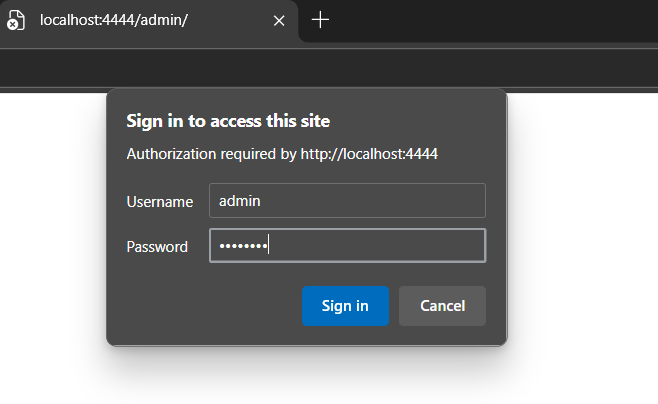
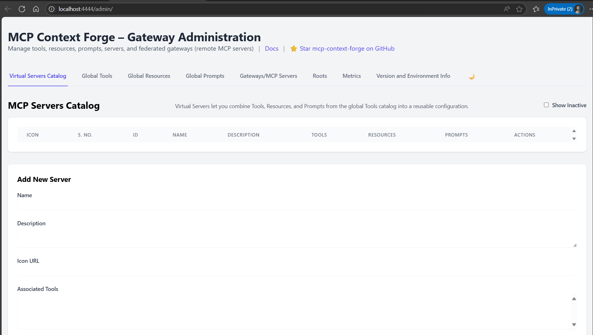
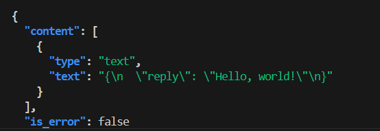
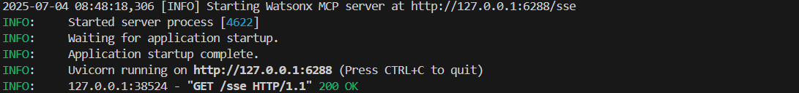
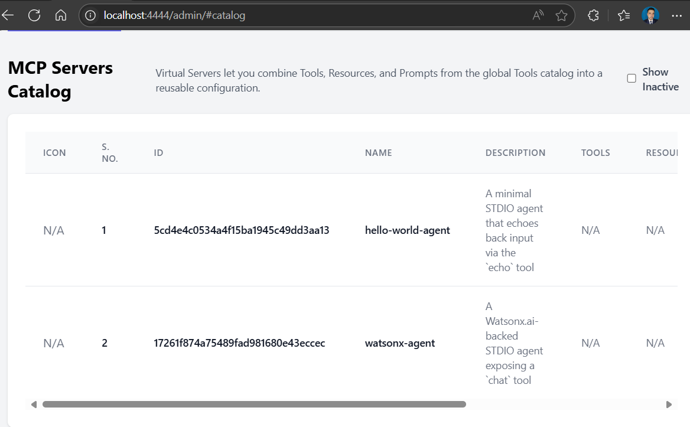
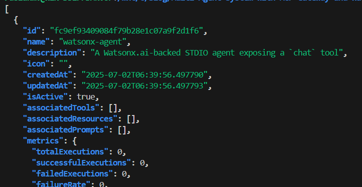
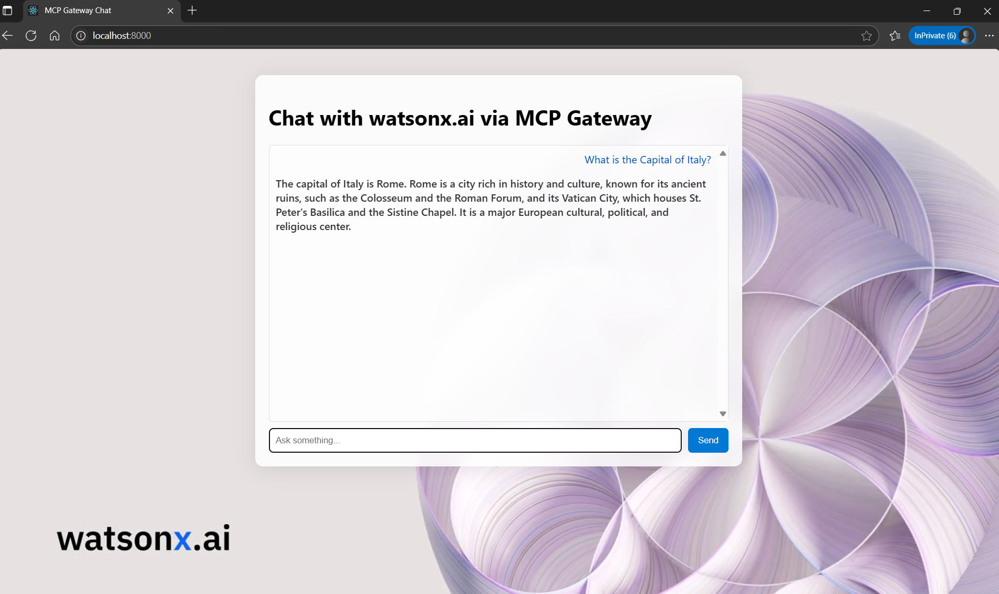

Have you ever felt like you're trying to build something amazing with AI, but you spend most of your time wrestling with different APIs, models, and tools that just don't want to talk to each other? It feels like trying to connect a dozen different devices with unique plugs—a tangled, frustrating mess.

In this series, we're going to build our way out of that mess. Our final destination is a sleek, full-stack application: a custom frontend that talks to a powerful **Watsonx.ai agent**, all orchestrated seamlessly by the **Model Context Protocol (MCP) Gateway**.

But every great journey starts with a single step. Before we integrate a sophisticated model like Watsonx, we're going to start with the basics. We'll build a simple **"Hello World" agent**. This isn't just a detour; it's how we'll learn the core concepts, set up our workshop, and ensure we have a solid foundation before building the skyscraper.

### What's the Big Idea? The Magic of MCP

So, what is this magic that promises to untangle our AI services?

Think of the **Model Context Protocol (MCP)** as a universal language for AI tools. It's like a universal translator that allows any model, tool, or service to communicate with any other, no matter how they were built or where they're running. It standardizes the conversation, making different AI components interchangeable.

The **MCP Gateway** (also known as Context Forge) is the central hub for this conversation—the "air traffic controller" for all your services. Instead of connecting everything point-to-point, you simply register each service with the Gateway. The Gateway then handles everything else: discovering what tools are available, routing requests to the right place, and providing a single dashboard to manage it all. It transforms chaos into a robust, scalable system.

### Getting Our Workshop Ready 🛠️

Before we can start building, we need to set up our workspace. The first step is getting the MCP Gateway itself.

First, clone the official repository from GitHub. We'll put it in a folder named `mcpgateway` to keep things tidy.

```bash
git clone https://github.com/IBM/mcp-context-forge.git mcpgateway
cd mcpgateway
```

For this guide, we'll lock into a specific version to ensure we're all on the same page. Run this command to check out the exact commit we'll be using:

```bash
git checkout d5a5019a6b0622f81728cc5a25bbdbcb3d5b3735
```

Next, let's create a dedicated Python virtual environment right inside this folder. This keeps our project dependencies clean and isolated.

```bash
python3 -m venv .venv
source .venv/bin/activate
```

With our environment active, let's upgrade `pip` and install all the project dependencies with a single command:

```bash
pip install --upgrade pip
pip install -e .
```

Finally, the Gateway needs some basic credentials to secure itself. Create a file named `.env` in your `mcpgateway` directory and add the following lines. This sets up a default user and a secret key for signing security tokens.

```bash
export BASIC_AUTH_USERNAME=admin
export BASIC_AUTH_PASSWORD=changeme
export JWT_SECRET_KEY=my-test-key
```

With our setup complete, it's time to bring the Gateway to life. Make sure you are in the `mcpgateway` directory with your virtual environment activated, and then run the start script:

```bash
./run.sh
```

Alternatively, you can start it and tell it to be accessible from other machines on your network (which is useful for when we build our frontend later):

```bash
mcpgateway --host 0.0.0.0 --port 4444 &
```

You should see log messages indicating that the MCP Gateway is up and running. Our workshop is now open for business\! We have our central hub running, and we're ready for our first project: building the simple "Hello World" agent that will teach us the ropes.

## The Keys to the Kingdom: Generating Your First Admin JWT

Before we can build our first agent and introduce it to the MCP Gateway, we need to learn how to talk to the Gateway as an administrator. Think of the Gateway as a busy workshop. While anyone can knock on the front door, only those with the right keys can access the control room—the place where you can see all the tools, register new ones, and manage the floor.

Getting into this control room requires a special kind of two-factor security. It's not enough to have the main key; you also need a temporary, one-time-use passcode.

1. **The Main Key (Basic Auth):** This is your permanent admin username and password. It proves you're a trusted user.
2. **The Temporary Passcode (JWT):** This is a short-lived JSON Web Token. It's a cryptographically signed token that proves your request is fresh and hasn't been intercepted. It expires quickly (usually in 60 seconds) for extra security.

To perform administrative tasks, like telling the Gateway about a new agent we've built, we need to present both of these at the same time. Let's walk through the ritual of creating this temporary passcode.

### The Four Steps to Gaining Admin Access

#### Step 1: Enter the Workshop (Activate the Environment)

First, we need to be in the right place with the right tools. In our world, this means activating the Python virtual environment that the Gateway itself uses. This ensures we have access to all the same libraries and utilities.

Bash

```
source ./mcpgateway/.venv/bin/activate
```

#### Step 2: Gather Your Credentials (Export Environment Variables)

Next, we need to have our main key and the secret ingredient for our passcode ready. We'll load our admin credentials into our terminal's environment.


```Bash
export BASIC_AUTH_USER="${BASIC_AUTH_USER:-admin}"
export BASIC_AUTH_PASSWORD="${BASIC_AUTH_PASSWORD:-changeme}"
export JWT_SECRET_KEY="${JWT_SECRET_KEY:-my-test-key}"
```


#### Step 3: Create the Magic Passcode (Generate the Token)

Now for the exciting part. We'll use a built-in utility from the `mcpgateway` library to generate our JWT. This command creates a token that's valid for just 60 seconds and saves it into a variable called `ADMIN_TOKEN`.


```bash
ADMIN_TOKEN=$(
  python3 -m mcpgateway.utils.create_jwt_token \
    --username "$BASIC_AUTH_USER" \
    --secret   "$JWT_SECRET_KEY" \
    --exp 60
)
echo "🔑 Generated Admin JWT"
```


#### Step 4: Unlock the Door (Call an Admin Endpoint)


With both our main key and our temporary passcode in hand, we can finally make an authenticated request. We'll use `curl` to ask the Gateway to list all the servers it knows about. We provide our Basic Auth credentials with the `-u` flag and our JWT passcode in an `Authorization: Bearer ...` header.


```bash
curl -u "$BASIC_AUTH_USER:$BASIC_AUTH_PASSWORD" \
  -H "Authorization: Bearer $ADMIN_TOKEN" \
  http://localhost:4444/servers | jq .
```


Success! The Gateway recognizes our authority and responds with the information we requested. We've successfully entered the control room.

### A Script to Make it Effortless

Doing those four steps manually is great for learning, but it can be tedious. To make life easier, we can bundle this entire process into a single, reusable shell script. This script will handle activating the environment, loading the credentials, and generating a fresh token every time you run it.

Now that we have the keys to the kingdom and know how to perform administrative tasks, we're ready for the main event. In the next section, we will build our very first "Hello World" agent and use our newfound admin powers to introduce it to the Gateway.

### The `get_token.sh` Script

Save this as `get_token.sh`, make it executable with `chmod +x get_token.sh`, and you'll have a reusable tool for generating admin tokens whenever you need them.

```bash
#!/usr/bin/env bash
set -euo pipefail

# -----------------------------------------------------------------------------
# 1) Activate the project’s Python virtualenv
# -----------------------------------------------------------------------------
if [ -f "./mcpgateway/.venv/bin/activate" ]; then
  # shellcheck disable=SC1090
  source ./mcpgateway/.venv/bin/activate
  echo "✅ Activated Python environment"
else
  echo "❌ Virtualenv not found at ./mcpgateway/.venv/bin/activate; please run setup first." >&2
  exit 1
fi

# -----------------------------------------------------------------------------
# 2) Load env-vars (or use defaults)
# -----------------------------------------------------------------------------
export BASIC_AUTH_USER="${BASIC_AUTH_USER:-admin}"
export BASIC_AUTH_PASSWORD="${BASIC_AUTH_PASSWORD:-changeme}"
export JWT_SECRET_KEY="${JWT_SECRET_KEY:-my-test-key}"

# -----------------------------------------------------------------------------
# 3) Generate and print the JWT (valid for 60 seconds)
# -----------------------------------------------------------------------------
python3 -m mcpgateway.utils.create_jwt_token \
  --username "$BASIC_AUTH_USER" \
  --secret   "$JWT_SECRET_KEY" \
  --exp 60
```


Now, let's take a peek inside the Gateway's control room. Point your browser to 

[http://localhost:4444/admin/](http://localhost:4444/admin/)  and log in with the username **admin** and password **changeme**.



and you will get



You'll land on the main dashboard. As you can see, it's a blank slate for now. Our list of agents is empty because we haven't introduced any to the Gateway yet

## Your First Agent: From Silence to "Hello, World!"

So, you're ready to build your first MCP agent. It's an exciting moment! You write a simple script, hit run, and... nothing happens. The Gateway doesn't see it. You've just encountered the classic "silent agent" problem, a rite of passage for every developer entering the MCP world. Let's walk through why this happens and build your first agent the right way.

### The Handshake That Wasn't 

Imagine the MCP Gateway is a friendly host at a party. Its job is to walk around, greet new guests (your agents), and ask them what they can do (their "tools"). This greeting process is a specific sequence, a kind of digital handshake: `initialize` ➡️ `list_tools`.

But for this to work, the guest has to be able to talk back over the network. When you run a standard Python script, it does its work quietly, without opening a network port for the Gateway to connect to. The Gateway tries to call your agent at its address, say `http://127.0.0.1:6277`, but it's like knocking on a door with no one home. All it finds is a silent, unresponsive TCP socket. The connection times out, and the Gateway sadly marks your agent as "failed to register."

To join the party, our agent needs to learn to speak a language the Gateway understands over the web. We'll teach it **Server-Sent Events (SSE)**.

### Building the "Hello World" Agent (SSE Edition) 

Let's create an agent that knows how to announce itself. We'll make a new file, `agents/hello_world/hello_server_sse.py`, and give it a voice.

First, we set up some basic logging and import our key component, `FastMCP`. Then, we create our agent.

```python
import logging
from typing import Union
from mcp.server.fastmcp import FastMCP

# Readable logs for our journey
logging.basicConfig(level=logging.INFO,
                    format="%(asctime)s [%(levelname)s] %(message)s")

PORT = 6274  # The port our agent will listen on
mcp = FastMCP(name="hello-world-agent", port=PORT)
```

Think of the `FastMCP` line as giving our agent its name and a dedicated phone number (`PORT`). Now, it has an identity.

Next, we need to teach our agent its first skill. We'll use the `@mcp.tool` decorator to define a simple `echo` function. This is the "trick" our agent will tell the Gateway it can do.

```python
@mcp.tool(description="Echo back whatever you send (str or int)")
async def echo(text: Union[str, int]) -> dict:
    """
    Accept both strings and integers so the Gateway's test dialog
    (which auto-fills 0) passes validation.
    """
    logging.info("echo(%r)", text)
    return {"reply": str(text)}
```

We make it accept either a string or an integer (`Union[str, int]`). This is a small but clever trick to make sure it works perfectly with the Gateway's Admin UI, which sometimes tests tools by sending the number `0`.

Finally, the most important part. We tell our agent to run, but specifically using the SSE transport. This is the **key that unlocks communication**.

```python
if __name__ == "__main__":
    logging.info("🚀 Serving on http://127.0.0.1:%d/sse", PORT)
    mcp.run(transport="sse")  # ⭐ The magic line: use SSE!
```

By changing `mcp.run()` to `mcp.run(transport="sse")`, we've transformed our silent script into a web-savvy agent that is ready to be discovered.

### The Complete Agent Code

Here is the full code for your `hello_server_sse.py` file.

```python
import logging
from typing import Union
from mcp.server.fastmcp import FastMCP

# readable logs
logging.basicConfig(level=logging.INFO,
                    format="%(asctime)s [%(levelname)s] %(message)s")

PORT = 6274                                     # the port you'll register
mcp  = FastMCP(name="hello-world-agent", port=PORT)

@mcp.tool(description="Echo back whatever you send (str or int)")
async def echo(text: Union[str, int]) -> dict:
    """
    Accept both strings and integers so the Gateway's test dialog
    (which auto-fills 0) passes validation.
    """
    logging.info("echo(%r)", text)
    return {"reply": str(text)}

if __name__ == "__main__":
    logging.info("🚀 Serving on http://127.0.0.1:%d/sse", PORT)
    mcp.run(transport="sse")                    # ⭐  key line: use SSE
```

### How to Run Your Agent

It's time to bring our agent to life! Follow these steps in your terminal.

1. **Activate Your Environment**: First, you need to be in the same Python environment as your MCP Gateway. This ensures you have all the necessary libraries.

   Bash

   ```
   source ./mcpgateway/.venv/bin/activate
   ```

2. **Navigate to the Directory**: Change into the folder where you saved your agent script.

   Bash

   ```
   cd agents/hello_world
   ```

3. **Run the Script**: Now, simply execute the Python file.

   Bash

   ```
   python hello_server_sse.py
   ```

You'll see output that feels like a launch sequence, ending with a line that says `Uvicorn running on http://127.0.0.1:6274`.

```
🚀 Serving on http://127.0.0.1:6274/sse
INFO:     Started server process [94661]
INFO:     Application startup complete.
INFO:     Uvicorn running on http://127.0.0.1:6274 (Press CTRL+C to quit)
```

That's it! Your agent is now running and broadcasting its availability. It's on the network, waiting for the Gateway to come by, perform the handshake, and officially welcome it to the party.

### 3 Register it in the Gateway

Open **Admin UI → Federated Gateways → Add New Gateway** and fill:

* **Name** `hello-world-dev`
* **URL**  `http://127.0.0.1:6274/sse`
* **Transport Type** `SSE`
* **Auth** `None`

Click **Add Gateway**. You should instantly see:

```
hello-world-dev   http://127.0.0.1:6274/sse   Active   <timestamp>
```

Opening the entry shows *Capabilities* and a single *Echo* tool.

---

### 4 Test the tool from the UI

1. Navigate to **Tools** → find `hello-world-dev-echo`.
2. Click **Test**.
3. Replace the default `0` with any text, e.g. `Hello Gateway`.
4. Press **Run Tool**.

The response pane shows:

```json
{
  "reply": "Hello Gateway"
}
```

---


* **STDIO** agents are great for piping output in a terminal,
  but the Gateway speaks **HTTP streams**.
* Switching `mcp.run()` to `transport="sse"` (or `"streamable-http"`) gives
  the Gateway a live URL to open, negotiate, and keep healthy.
* Once registered, the agent’s tools behave just like native ones—ready to
  combine into virtual servers or call via the Gateway’s `/rpc` endpoint.


### 5 Publish in the Virtual Servers Catalog

Once your Hello World agent is federated as an MCP Server (under **Federated Gateways**) and its `echo` tool appears in the **Global Tools** catalog, the final step is to bundle it into a **Virtual Server**—a single endpoint that exposes one or more tools (and any resources or prompts) under your own chosen name.

1. **Open** the Admin UI and navigate to **Virtual Servers Catalog → Add New Server**.

2. **Fill in** the form fields:

   * **Name**: `hello-world-dev`
   * **Description**: (optional, e.g. “Demo echo server”)
   * **Icon URL**: (leave blank or supply a link to a 64×64 PNG)
   * **Associated Tools**: select both

    ```
   watsonx-agent-chat
   hello-world-dev-echo
    ```

   * **Associated Resources**: type the resource IDs you registered earlier, comma-separated, e.g.

     ```
     hello-world-dev
     ```

   * **Associated Prompts**: leave empty for this demo

3. **Click** **Add Server**.

Your **Virtual Servers Catalog** now lists:

```text
hello-world-dev   Demo echo server   Active   <timestamp>
```

Under **Tools** you’ll see the combined toolset:

```text
hello-world-dev-echo   Echo back whatever you send (str or int)
watsonx-agent-chat     Chat with IBM watsonx.ai (dummy)
```


### 6 Calling your Virtual Server from the CLI

With the virtual server in place, you can invoke its tools from any script or terminal—no UI required. Below is a standalone Bash script, `call_echo.sh`, that demonstrates:

* **Minting** a short-lived admin JWT
* **Building** a JSON-RPC request to the `/rpc` endpoint
* **Calling** the `hello-world-dev-echo` tool with a prompt
* **Pretty-printing** the response

```bash
#!/usr/bin/env bash
# call_echo.sh – invoke any federated MCP tool via Gateway /rpc
set -euo pipefail

# ─── Configuration ──────────────────────────────────────────────────────────
GATEWAY_URL="${GATEWAY_URL:-http://localhost:4444}"
RPC_URL="${GATEWAY_URL}/rpc"

# First argument: full tool name as shown in Admin UI
TOOL_NAME="${1:-hello-world-dev-echo}"
# Second argument: the text to echo
PROMPT="${2:-Hello, world!}"

# Basic Auth credentials for /rpc (if still enabled)
BASIC_AUTH_USER="${BASIC_AUTH_USER:-admin}"
BASIC_AUTH_PASS="${BASIC_AUTH_PASS:-changeme}"

# JWT secret (must match Gateway’s JWT_SECRET_KEY)
JWT_SECRET_KEY="${JWT_SECRET_KEY:-my-test-key}"

# ─── Mint an admin token (valid 60s) ────────────────────────────────────────
ADMIN_TOKEN=$(python3 -m mcpgateway.utils.create_jwt_token \
  --username "$BASIC_AUTH_USER" \
  --secret   "$JWT_SECRET_KEY" \
  --exp      60)

# ─── Build JSON-RPC payload via jq (proper quoting) ─────────────────────────
JSON_PAYLOAD=$(jq -n \
  --arg method "$TOOL_NAME" \
  --arg txt    "$PROMPT" \
  '{jsonrpc:"2.0",id:1,method:$method,params:{text:$txt}}')

# ─── Invoke and display the response ────────────────────────────────────────
echo
echo "🚀 Calling tool: $TOOL_NAME"
echo "   Prompt: \"$PROMPT\""
echo

curl -s -u "${BASIC_AUTH_USER}:${BASIC_AUTH_PASS}" \
     -H "Authorization: Bearer ${ADMIN_TOKEN}" \
     -H "Content-Type: application/json" \
     -d "$JSON_PAYLOAD" \
     "$RPC_URL" \
  | jq .

echo
```


### 7 Example run

```bash
chmod +x call_echo.sh
./call_echo.sh 

🚀 Calling tool: hello-world-dev-echo
   Prompt: "Hello, world!"

{
  "content": [
    {
      "type": "text",
      "text": "{\n  \"reply\": \"Hello, world!\"\n}"
    }
  ],
  "is_error": false
}
```




The `"content"` array holds the structured tool output. In this demo the
tool returned `{"reply":"Hello, world!"}` and the Gateway wrapped it in an
MCP-compliant notification envelope.


With that, you have:

1. **Built** an SSE-based Hello World agent
2. **Federated** it into the MCP Gateway
3. **Bundled** it into a Virtual Server
4. **Invoked** its tool via a simple CLI script


### 8) Next up: Watsonx.ai Agent 

With the Hello World demo behind you, you’re ready to plug in our full **Watsonx.ai** agent exactly the same way—just substitute:

* **Tool name**: `chat`
* **Server code**: your `agents/watsonx-agent/server.py` 
* **Associated Tools**: `chat`

Everything else (JWT, UI, CLI) stays identical. Enjoy building your multi-agent workflows!


## Building a Watsonx.ai Agent

Now let’s build and register a real-world agent that wraps IBM Watsonx.ai.

### Phase 1: Bootstrapping the Agent

1. **Provision Watsonx.ai**

   * In IBM Cloud, create or reuse a Watsonx.ai inference service.
   * Generate an API key and note your service URL (e.g. `https://api.us-south.watsonx.ai`).
   * Retrieve your **Project ID**.

2. **Initialize Project**

   ```bash
   mkdir watsonx-agent && cd watsonx-agent
   python3.11 -m venv .venv
   source .venv/bin/activate
   ```

3. **Define Dependencies** in `requirements.txt`:

   ```text
   python-dotenv>=0.21.0
   ibm-watsonx-ai>=1.3.8
   mcp[cli]>=1.6.0
   ```

   Install them:

   ```bash
   pip install --upgrade pip
   pip install -r requirements.txt
   ```

4. **Secure Credentials**
   Create `.env` (add to `.gitignore`):

   ```dotenv
   WATSONX_API_KEY=YOUR_API_KEY
   WATSONX_URL=https://api.us-south.watsonx.ai
   PROJECT_ID=YOUR_PROJECT_ID
   MODEL_ID=ibm/granite-3-3-8b-instruct
   ```

5. **Write `server_sse.py`** (stdio transport):

```python
# server.py  – lenient Watsonx agent
import os, logging
from typing import Union
from dotenv import load_dotenv

from mcp.server.fastmcp import FastMCP
from ibm_watsonx_ai import APIClient, Credentials
from ibm_watsonx_ai.foundation_models import ModelInference
from ibm_watsonx_ai.metanames import GenTextParamsMetaNames as GenParams

# ─── Load env vars ───────────────────────────────────────────────
load_dotenv()
API_KEY    = os.getenv("WATSONX_API_KEY")
URL        = os.getenv("WATSONX_URL")
PROJECT_ID = os.getenv("PROJECT_ID")
MODEL_ID   = os.getenv("MODEL_ID", "ibm/granite-3-3-8b-instruct")
PORT       = int(os.getenv("PORT", 6288))

for name, val in [("WATSONX_API_KEY", API_KEY),
                  ("WATSONX_URL",     URL),
                  ("PROJECT_ID",      PROJECT_ID)]:
    if not val:
        raise RuntimeError(f"{name} is not set")

logging.basicConfig(
    level=logging.INFO,
    format="%(asctime)s [%(levelname)s] %(message)s"
)

creds  = Credentials(url=URL, api_key=API_KEY)
client = APIClient(credentials=creds, project_id=PROJECT_ID)
model  = ModelInference(model_id=MODEL_ID,
                        credentials=creds,
                        project_id=PROJECT_ID)

# ─── Define MCP server ───────────────────────────────────────────
mcp = FastMCP("Watsonx Chat Agent", port=PORT)

@mcp.tool(description="Chat with IBM watsonx.ai (accepts str or int)")
def chat(query: Union[str, int]) -> str:
    # Coerce to string so int → str
    query = str(query).strip()
    # Substitute a real prompt if UI sent the placeholder 0
    if query == "0":
        query = "What is the capital of Italy?"

    logging.info("chat() got %r", query)

    params = {
        GenParams.DECODING_METHOD: "greedy",
        GenParams.MAX_NEW_TOKENS:   200,
    }
    resp  = model.generate_text(prompt=query, params=params, raw_response=True)
    reply = resp["results"][0]["generated_text"].strip()
    logging.info("→ %r", reply)
    return reply

# ─── Run ─────────────────────────────────────────────────────────
if __name__ == "__main__":
    logging.info(f"Starting Watsonx MCP server at http://127.0.0.1:{PORT}/sse")
    mcp.run(transport="sse")   # SSE endpoint is /sse

```

6. **Test Locally** 

  ```
python server_sse.py
  ```




  or with the MCP Inspector:

   ```bash
mcp dev server_sse.py
# Inspector UI: http://localhost:6274
   ```

 Or tell mcp dev to use different ports

```bash
mcp dev server_sse.py --inspect-port 6280 --proxy-port 6281
```


## Phase 2: Starting and Testing Your Agent Locally

Before the MCP Gateway can see our agent, we need to get it running and confirm it works on its own.

### 1. Start the Watsonx Agent

This script navigates to the agent's directory, activates its dedicated Python virtual environment, and starts the SSE (Server-Sent Events) server, which will listen for requests from the Gateway.

**`5-start-watsonx-agent.sh`**

```bash
#!/bin/bash
# A simple script to start the watsonx-agent server.

# --- Configuration ---
# Set the full path to your project directory.
PROJECT_DIR="./agents/watsonx-agent"

# --- Script Execution ---

echo "Navigating to the project directory..."
cd "$PROJECT_DIR" || { echo "Error: Could not change to directory $PROJECT_DIR. Please check the path."; exit 1; }

echo "Activating Python virtual environment..."
source .venv/bin/activate || { echo "Error: Failed to activate the virtual environment. Make sure it exists at '.venv/bin/activate'."; exit 1; }

echo "Starting the watsonx-agent server..."
# The script will run python sse.py until manually stopped (Ctrl+C).
python sse.py

echo "Server has been stopped."
```

Run this script and leave it running in a terminal. It is now ready to be registered.

### 2. Run Local Tests

It's always good practice to run local tests to ensure the agent's logic is sound before connecting it to the Gateway. This script runs the agent's internal test suite.

**`6-Test-WatsonX-agent.sh`**

```bash
#!/bin/bash
# A simple script to run the watsonx-agent tests.

# --- Configuration ---
PROJECT_DIR="./agents/watsonx-agent"

# --- Script Execution ---

echo "Navigating to the project directory..."
cd "$PROJECT_DIR" || { echo "Error: Could not change to directory $PROJECT_DIR. Please check the path."; exit 1; }

echo "Activating Python virtual environment..."
source .venv/bin/activate || { echo "Error: Failed to activate the virtual environment. Make sure it exists at '.venv/bin/activate'."; exit 1; }

echo "Navigating to the test directory..."
cd test || { echo "Error: Could not change to directory 'test'. Make sure it exists inside $PROJECT_DIR."; exit 1; }

echo "Running the Python test script..."
python test_sse.py

echo "Test script has finished."
```


## Phase 3: Registering the Watsonx.ai Agent in the Gateway

Now that our agent is running, we'll register it in the Gateway using the Admin UI.

### Via Admin UI

1.  **Add the Agent as a Federated Gateway**: The MCP Gateway treats external agents like ours as "Federated Gateways."

      * Navigate to the Admin UI (`http://localhost:4444/admin`).
      * Go to the **Gateways/MCP Servers** section.
      * Click **Add New Gateway** and fill in the details:
        * **Name**: `watsonx-agent`
        * **URL**: `http://127.0.0.1:6288/sse`
        * **Description**: `watsonx agent demo`
        * **Transport Type**: `SSE`
        * **Authentication Type**: `None`
      * The agent will now appear in the list with an **Active** status.

2.  **Verify Tool Discovery**: The Gateway automatically discovers the tools exposed by the agent.

      * Navigate to **Global Tools**. You will see `watsonx-agent-chat` has been automatically discovered.
      * You can click **View** to inspect its details and even **Test** it directly from the UI to confirm end-to-end connectivity.

3.  **Create a Virtual Server**: The final step is to bundle the tool into a "Virtual Server," which provides a clean endpoint for clients.

      * Go to **Virtual Servers Catalog**.
      * Click **Add New Server** and fill out the form:
        * **Name**: `watsonx-agent`
        * **Associated Tools**: Select `watsonx-agent-chat` from the list.
      * The server is now created and will be assigned a unique ID.

-----

## Phase 3: Verifying and Using Your Agent

With the agent running and registered, we can now interact with it through the Gateway.

### 1. Verify Registration via API

You can programmatically verify that the Gateway sees your new virtual server. This script mints a temporary admin token and uses it to list all active servers.

**`verify-servers.sh`**

```bash
#!/usr/bin/env bash
set -euo pipefail

# 1) Activate venv
source ./mcpgateway/.venv/bin/activate

# 2) Ensure creds
export BASIC_AUTH_USER="${BASIC_AUTH_USER:-admin}"
export JWT_SECRET_KEY="${JWT_SECRET_KEY:-my-test-key}"

# 3) Mint JWT
ADMIN_TOKEN=$(
  JWT_SECRET_KEY="$JWT_SECRET_KEY" \
    python3 -m mcpgateway.utils.create_jwt_token \
      --username "$BASIC_AUTH_USER" \
      --secret   "$JWT_SECRET_KEY" \
      --exp      60
)

# 4) List servers & their tools
echo "Verifying active servers in the Gateway..."
curl -s \
  -H "Authorization: Bearer $ADMIN_TOKEN" \
  http://localhost:4444/servers \
| jq .
```

Running this will show a JSON output containing your `watsonx-agent` object, confirming it's ready.




---





## MCP Servers Catalog

Virtual Servers let you combine Tools, Resources, and Prompts from the global Tools catalog into a reusable configuration.

> **Show Inactive**

| Icon | S. No. | ID                                 | Name          | Description                                          | Tools | Resources | Prompts | Actions                           |
| ---- | ------ | ---------------------------------- | ------------- | ---------------------------------------------------- | :---: | :-------: | :-----: | --------------------------------- |
| N/A  | 1      | `ed4d915a5ad2461795010e5e28af4848` | watsonx-agent | A Watsonx.ai-backed SSE agent exposing a `chat` tool |  N/A  |    N/A    |   N/A   | Deactivate · View · Edit · Delete |

[Add New Server](#/admin/servers/add)


### 2\. Run an End-to-End Test

This final script, `query-agent.sh`, provides a complete, interactive, end-to-end test of the entire system.

#### Script Description

The `query-agent.sh` script is a powerful tool for testing your MCP Gateway setup. Here’s how it works:

  * **Authentication**: It begins by minting a short-lived JSON Web Token (JWT) to securely authenticate with the Gateway's API.
  * **Agent Discovery**: It calls the `/servers` endpoint to get a list of all *active* virtual servers (agents) currently registered in the Gateway.
  * **Interactive Selection**: It presents you with a numbered list of these agents and prompts you to pick one. It then does the same for the tools associated with your chosen agent.
  * **Request Crafting**: Once you enter a text prompt, the script builds a valid JSON-RPC request payload, correctly setting the `method` to the full name of the tool you selected (e.g., `watsonx-agent-chat`).
  * **Execution & Response**: Finally, it sends the request to the Gateway's `/rpc` endpoint and prints both the complete JSON response and just the clean, extracted reply text from the Large Language Model.

#### The Script

**`query-agent.sh`**

```bash
#!/usr/bin/env bash
# mcp_tool_tester.sh – choose an agent, choose a tool, send a prompt
set -euo pipefail

GATEWAY="http://localhost:4444"
RPC_URL="${GATEWAY}/rpc"          # ← Gateway’s JSON-RPC endpoint
VENV_PATH="./mcpgateway/.venv"

# ───────── 1) Activate venv ─────────
if [[ -f "${VENV_PATH}/bin/activate" ]]; then
  # shellcheck disable=SC1090
  source "${VENV_PATH}/bin/activate"
else
  echo "❌ Virtual environment not found at ${VENV_PATH}"
  exit 1
fi

# ───────── 2) Credentials ─────────
export BASIC_AUTH_USER="${BASIC_AUTH_USER:-admin}"
export BASIC_AUTH_PASSWORD="${BASIC_AUTH_PASSWORD:-adminpw}"
export JWT_SECRET_KEY="${JWT_SECRET_KEY:-my-test-key}"

# ───────── 3) Mint JWT ─────────
echo "🔑 Minting admin token ..."
ADMIN_TOKEN=$(
  python -m mcpgateway.utils.create_jwt_token \
    --username "$BASIC_AUTH_USER" \
    --secret   "$JWT_SECRET_KEY" \
    --exp      60
)

jget() { curl -s -H "Authorization: Bearer ${ADMIN_TOKEN}" "$@"; }

# ───────── 4) Pick an agent ─────────
echo -e "\n📡 Active agents:"
mapfile -t AGENTS < <(jget "${GATEWAY}/servers" |
  jq -r '.[] | select(.isActive) | "\(.name) (\(.id))"')

if ((${#AGENTS[@]} == 0)); then
  echo "❌ No active agents in the Gateway."
  exit 1
fi

select AGENT_LINE in "${AGENTS[@]}"; do
  [[ $AGENT_LINE ]] && break
done
SERVER_ID=$(awk -F'[()]' '{print $2}' <<<"$AGENT_LINE")
SERVER_NAME=$(awk '{print $1}' <<<"$AGENT_LINE")
echo "✅ You picked: $SERVER_NAME  (ID=$SERVER_ID)"

# ───────── 5) Pick a tool ─────────
echo -e "\n🛠  Tools in $SERVER_NAME:"
mapfile -t TOOLS < <(jget "${GATEWAY}/servers/${SERVER_ID}/tools" | jq -r '.[].name')

if ((${#TOOLS[@]} == 0)); then
  echo "❌ No tools exposed by this agent."
  exit 1
fi

select TOOL_LIST_NAME in "${TOOLS[@]}"; do
  [[ $TOOL_LIST_NAME ]] && break
done
echo "✅ You picked: $TOOL_LIST_NAME"


# ───────── 5.5) Set the JSON-RPC Method [FIXED] ─────────
# The JSON-RPC method is the exact name of the tool.
METHOD="$TOOL_LIST_NAME"


# ───────── 6) Prompt text ─────────
read -r -p $'\n💬 Enter your prompt: ' PROMPT
PROMPT=${PROMPT:-What is the capital of Italy?}

# ───────── 7) Build JSON-RPC payload safely ─────────
RPC_BODY=$(jq -n \
  --arg method "$METHOD" \
  --arg q      "$PROMPT" \
  '{jsonrpc:"2.0",id:1,method:$method,params:{query:$q}}')

# ───────── 8) Call the Gateway ─────────
echo -e "\n🚀 Sending request ..."
RESPONSE=$(curl -s \
  -u "${BASIC_AUTH_USER}:${BASIC_AUTH_PASSWORD}" \
  -H "Authorization: Bearer ${ADMIN_TOKEN}" \
  -H "Content-Type: application/json" \
  -d "$RPC_BODY" \
  "$RPC_URL")

# ───────── 9) Pretty-print result ─────────
echo -e "\n📨 Full JSON response:"
echo "$RESPONSE" | jq .

echo -e "\n💡 LLM reply text:"
echo "$RESPONSE" | jq -r '.result.reply // .result.content[0].text // "-- no text field --"'
```

#### Example Execution

Running the script provides a seamless, interactive experience:

```bash
bash query-agent.sh
```

```console
🔑 Minting admin token ...

📡 Active agents:
1) watsonx-agent (afe82182b99b43a889f8971b78788454)
#? 1
✅ You picked: watsonx-agent  (ID=afe82182b99b43a889f8971b78788454)

🛠  Tools in watsonx-agent:
1) watsonx-agent-chat
#? 1
✅ You picked: watsonx-agent-chat

💬 Enter your prompt: How are you ?

🚀 Sending request ...

📨 Full JSON response:
{
  "content": [
    {
      "type": "text",
      "text": "I'm an artificial intelligence and don't have feelings, but I'm here and ready to assist you. How can I help you today?"
    }
  ],
  "is_error": false
}

💡 LLM reply text:
I'm an artificial intelligence and don't have feelings, but I'm here and ready to assist you. How can I help you today?
```


## Phase 5: From Zero to Chat: Wiring a FastAPI Micro-Frontend to MCP Gateway

Ever had that feeling? You're staring at a sleek, beautiful frontend on one screen and a powerful, complex backend API on the other, wondering how to get them to talk to each other without a mountain of boilerplate. I've been there. This is the story of how a single Python file, powered by FastAPI, can become the perfect translator between your user's browser and the mighty MCP Gateway. It's less of a formal tutorial and more of a travel log from that journey.


## Setting the Stage

Our adventure begins in a file we'll call `frontend.py`. Like any good trip, it starts with packing the essentials. We import our libraries and, most importantly, we set our coordinates by loading environment variables.

```python
load_dotenv()
GATEWAY_RPC     = os.getenv("GATEWAY_RPC", "http://localhost:4444/rpc")
BASIC_AUTH_USER = os.getenv("BASIC_AUTH_USER", "admin")
BASIC_AUTH_PASS = os.getenv("BASIC_AUTH_PASS", "changeme")
JWT_SECRET_KEY  = os.getenv("JWT_SECRET_KEY", "my-test-key")
```

Think of these as the address of our destination (`GATEWAY_RPC`), the secret handshake to get in the door (`BASIC_AUTH_USER`, `BASIC_AUTH_PASS`), and the key to the treasure chest (`JWT_SECRET_KEY`). Getting these right is the first step to making sure our micro-frontend knows exactly where it's going and how to announce itself.

-----

## Rolling Out the Welcome Mat 🏡

A backend service isn't much use if a browser can't find the front door. Our app needs to serve the actual user interface—the HTML, CSS, and JavaScript that users will interact with. FastAPI makes this incredibly simple.

```python
FRONTEND_DIR = Path(__file__).parent / "frontend"
app = FastAPI()

app.mount(
    "/static",
    StaticFiles(directory=FRONTEND_DIR / "static"),
    name="static"
)

@app.get("/", include_in_schema=False)
async def homepage():
    index = FRONTEND_DIR / "index.html"
    if not index.exists():
        raise HTTPException(404, "index.html not found")
    return FileResponse(index)
```

With these few lines, we've essentially hung up a sign that says, "All UI assets served here\!" We tell FastAPI to serve our `index.html` when someone visits the root URL and to make everything in the `/static` directory available. Just like that, our application has a face.

-----

## The Secret Passport: Minting JWTs 🤫

Our MCP Gateway is a secure, protected resource. We can't just send it requests; we need to prove we're allowed in. We do this with a JSON Web Token (JWT), which acts like a short-lived, single-use passport. Instead of building the token logic from scratch, we cleverly reuse the `mcpgateway` library's own tools.

```python
def mint_jwt() -> str:
    cmd = [
        sys.executable, "-m", "mcpgateway.utils.create_jwt_token",
        "--username", BASIC_AUTH_USER,
        "--secret",   JWT_SECRET_KEY,
        "--exp",      "60",
    ]
    token = subprocess.check_output(cmd, text=True).strip()
    if not token:
        raise RuntimeError("Failed to mint JWT")
    return token
```

By running a subprocess, we guarantee the token is signed exactly as the Gateway expects. We also set it to expire in **60 seconds**, which is great for security. Each request will get its own freshly minted passport, valid just long enough to complete its mission.

-----

## The Bridge: The `/call` Endpoint 🌉

This is where the real magic happens. All the user's prompts, questions, and commands will funnel through a single `/call` endpoint. This endpoint is the heart of our micro-frontend, acting as the crucial bridge.

First, when a request arrives from the browser with a `tool` and a `prompt`, we package it into the formal JSON-RPC format that the Gateway understands. It's like putting a handwritten note into a very specific type of formal envelope. Notice the small but important detail: some tools expect the prompt in a field named `"query"`, while others look for `"text"`. Our code handles both.

```python
@app.post("/call", response_model=ChatResponse)
async def call_tool(req: ChatRequest):
    # ...
    payload = {
        "jsonrpc": "2.0",
        "id":      1,
        "method":  req.tool,
        "params":  {param_key: prompt}
    }
```

Next, we mint our passport (the JWT) and use the `httpx` library to forward the request to the Gateway, with the token included in the authorization header.

When the Gateway replies, the answer might be tucked away in one of several places. To be robust, our code patiently checks each possible pocket—`result.reply`, `result.content[0].text`, or `content[0].text`—until it finds the text.

```python
    # ...
    data = resp.json()
    # Extract reply in whichever field it lands
    text = (
        data.get("result", {}).get("reply")
        or (data.get("result", {}).get("content") or [{}])[0].get("text")
        or (data.get("content") or [{}])[0].get("text")
        or ""
    )
```

Finally, we clean up any stray punctuation and send the clean result back to the browser. We also wrap our logic in `try...except` blocks to handle things gracefully. If the Gateway is down, the browser gets a clear "Gateway connection error" (a 502 status), not a cryptic failure.

-----

## Tying It All Together

With our bridge built, the only thing left is to open it for traffic. The final piece of the puzzle is starting the server.

```python
if __name__ == "__main__":
    uvicorn.run(app, host="0.0.0.0", port=8000)
```

And that's the whole story\! What started as two separate systems—a frontend and a backend—are now connected by a lightweight, secure, and intelligent Python service. This micro-frontend does one job, and it does it well: it translates, authenticates, and relays messages, allowing your UI to seamlessly tap into the power of the MCP Gateway.

Now, you can take this code, drop it into your project, and let your own frontend start a conversation.

### The Complete Code

```python
#!/usr/bin/env python3
"""
frontend.py – FastAPI micro-frontend for MCP Gateway
"""

import os, sys, subprocess, logging, re
from pathlib import Path
from typing import Union
from contextlib import asynccontextmanager

import httpx
import uvicorn
from dotenv import load_dotenv
from fastapi import FastAPI, HTTPException
from fastapi.responses import FileResponse
from fastapi.staticfiles import StaticFiles
from pydantic import BaseModel

# ─── Configuration & Logging ────────────────────────────────────────────────
load_dotenv()
GATEWAY_RPC     = os.getenv("GATEWAY_RPC", "http://localhost:4444/rpc")
BASIC_AUTH_USER = os.getenv("BASIC_AUTH_USER", "admin")
BASIC_AUTH_PASS = (
    os.getenv("BASIC_AUTH_PASS")
    or os.getenv("BASIC_AUTH_PASSWORD")
    or "changeme"
)
JWT_SECRET_KEY  = os.getenv("JWT_SECRET_KEY", "my-test-key")

logging.basicConfig(
    level=logging.INFO,
    format="%(asctime)s [%(levelname)s] %(name)s: %(message)s"
)
logger = logging.getLogger("frontend")

# ─── Static Files Setup ─────────────────────────────────────────────────────
FRONTEND_DIR = Path(__file__).parent / "frontend"
app = FastAPI()

app.mount(
    "/static",
    StaticFiles(directory=FRONTEND_DIR / "static"),
    name="static"
)

@app.get("/", include_in_schema=False)
async def homepage():
    index = FRONTEND_DIR / "index.html"
    if not index.exists():
        raise HTTPException(404, "index.html not found")
    return FileResponse(index)

# ─── Request / Response Models ──────────────────────────────────────────────
class ChatRequest(BaseModel):
    tool: str
    prompt: str

class ChatResponse(BaseModel):
    result: str

# ─── JWT Minting Helper ─────────────────────────────────────────────────────
def mint_jwt() -> str:
    cmd = [
        sys.executable, "-m", "mcpgateway.utils.create_jwt_token",
        "--username", BASIC_AUTH_USER,
        "--secret",   JWT_SECRET_KEY,
        "--exp",      "60",
    ]
    token = subprocess.check_output(cmd, text=True).strip()
    if not token:
        raise RuntimeError("Failed to mint JWT")
    return token

# ─── Chat Invocation Endpoint ───────────────────────────────────────────────
@app.post("/call", response_model=ChatResponse)
async def call_tool(req: ChatRequest):
    tool   = req.tool
    prompt = req.prompt.strip()
    logger.info("Invoking %s with prompt: %r", tool, prompt)

    # Build JSON-RPC payload; use "text" or "query" depending on the tool
    param_key = "query" if "chat" in tool else "text"
    payload = {
        "jsonrpc": "2.0",
        "id":      1,
        "method":  tool,
        "params":  {param_key: prompt}
    }

    # Mint a fresh token
    try:
        jwt_token = mint_jwt()
    except Exception as e:
        logger.exception("JWT mint failed")
        raise HTTPException(500, "Authentication error")

    headers = {
        "Authorization": f"Bearer {jwt_token}",
        "Content-Type":  "application/json"
    }

    # Forward the request to the Gateway
    async with httpx.AsyncClient(timeout=30.0) as client:
        try:
            resp = await client.post(GATEWAY_RPC, json=payload, headers=headers)
            resp.raise_for_status()
        except httpx.HTTPStatusError as exc:
            logger.error("Gateway HTTP error: %s", exc.response.text)
            raise HTTPException(exc.response.status_code, exc.response.text)
        except Exception as exc:
            logger.exception("Connection failed")
            raise HTTPException(502, "Gateway connection error")

    data = resp.json()
    # Extract reply in whichever field it lands
    text = (
        data.get("result", {}).get("reply")
        or (data.get("result", {}).get("content") or [{}])[0].get("text")
        or (data.get("content") or [{}])[0].get("text")
        or ""
    )

    # Clean up stray punctuation
    text = re.sub(r"^\?\s*", "", text).strip()
    logger.info("Received reply: %r", text)

    if not text:
        raise HTTPException(500, "No reply from agent")

    return ChatResponse(result=text)

# ─── Entrypoint ─────────────────────────────────────────────────────────────
if __name__ == "__main__":
    uvicorn.run(app, host="0.0.0.0", port=8000)
```

This is the final result:





This project is just the beginning. You can easily extend this chatbot with more advanced features, such as building an **agent selector** or implementing custom **orchestrators**.

To explore these concepts and access the complete, feature-rich code, visit the full project repository:

[https://github.com/ruslanmv/watsonx-agent-to-mcp-gateway](https://github.com/ruslanmv/watsonx-agent-to-mcp-gateway)


## Where We Go From Here: Your Journey with MCP


And just like that, we’ve reached the end of our journey for today. Take a moment and look back at the ground we've covered together. What started with a simple idea has blossomed into a fully-realized, end-to-end AI application.

We began with the basics, teaching a humble **"Hello World" agent** to speak the right language—**SSE**—so it could introduce itself to the world. We learned how to become system administrators, generating the **secure JWTs** needed to manage the Gateway's inner workings. We then officially registered our agent, transforming it from a standalone script into a trusted member of our new AI ecosystem.

From there, we built a bridge for our users, crafting a sleek **FastAPI frontend** that acts as a secure proxy, allowing browser-based applications to tap into the power of our backend tools. Finally, we put all these skills to the test by graduating from our simple echo agent to integrating a powerful, real-world model with the **Watsonx.ai agent**.

This pattern an SSE agent, federated through the Gateway, and exposed via a lightweight proxy UI—is more than just a one-off tutorial; it's a **blueprint**. It's a playbook you can use to integrate any AI service or tool into a unified, secure, and observable system. Whether you're wrapping a massive cloud LLM, an on-premise data tool, or even a legacy script, the MCP Gateway provides the consistent architecture you need to compose and share those capabilities with the world.

**Congratulations!** on building, testing, and integrating a powerful AI agent into your MCP Gateway. The tangled mess of APIs is now a clean, organized, and powerful ecosystem. The workshop is yours, and you now have the skills to build anything you can imagine. Happy coding!