Welcome to the world of AI agents\! In this tutorial, you'll learn how to build a **multi-agent system**. Instead of a single, monolithic AI, we will create a team of specialized agents that collaborate to solve problems. Our system will have:

  * **Greeting Agent**: A specialist for handling greetings.
  * **Echo Agent**: A simple agent that repeats any general message.
  * **Calculator Agent**: A powerful agent that can perform math using a Python tool.
  * **Orchestrator Agent**: The "manager" agent that receives all user requests and decides which specialist should handle the task.

This "manager-worker" pattern is fundamental to creating sophisticated and reliable AI systems. Let's get started\!


## Environment Configuration for watsonx Orchestrate Developer Edition

There are different ways to configure the **Watsonx Orchestrate Developer Edition** depending on your account type and requirements. This guide will walk you through the correct procedures for each configuration option.

### **Prerequisites**

Before you begin, make sure you have the following:

1.  **Python 3.11+**: Ensure Python and `pip` are installed and accessible from your command line.
2.  **Docker**: The ADK development server runs in a Docker container, so you must have Docker Desktop or another container environment (like Colima) installed and running.
3.  **IBM Cloud Account** 

-----

## **Step 1: Project Setup**

To make things easier, all the code for this tutorial is ready for you. Let's clone the repository and set up a clean Python environment.

### **Clone the Project Files**

Open your terminal and run the following command to download all the necessary YAML and Python files.

```bash
git clone https://github.com/ruslanmv/hello-watsonx-orchestrate.git
```

we change the directory to

```bash
cd hello-watsonx-orchestrate
```

### Create virtual environment

Before configuring watsonx Orchestrate, ensure you have:
Python Virtual Environment Setup.
First, create and activate a Python virtual environment:

```bash
python -m venv venv
```

### Activate the virtual environment

On Linux/macOS:

```bash
source venv/bin/activate  
```


## Step 2. Docker Installation

**Why Docker (or Colima) Matters for Multi-Agent Orchestration?** When you’re coordinating a suite of AI agents like a greeter, an echo responder, a calculator, and the central orchestrator that routes their tasks it’s crucial to have a uniform, self-contained environment. 

That’s exactly what Docker provides: everyone on the team and any continuous integration server can launch the same runtime, ensuring your code behaves identically everywhere. 

By packaging your Python tools, YAML-defined agents, and even your web server together, you get rock-solid isolation, so one component can’t accidentally interfere with another. And whether you’re deploying to a Linux cluster, spinning up VMs in the cloud, or just working on a Mac laptop, Docker makes it feel like you’re always in the same development playground putting an end to those frustrating “it works on my machine” moments.


Before we dive in, pick the instructions that match your operating system.

### Windows - via WSL 2

If you’re on Windows 10 or 11, the smoothest path is Windows Subsystem for Linux (WSL 2) plus Ubuntu 22.04. Follow the step-by-step guide **[here](https://github.com/ruslanmv/Setup-Your-Workspace-Guide)**, then return here to install Docker inside that fresh WSL environment.

### Linux 

On Ubuntu 22.04, Docker Engine and Compose come together in just five streamlined steps. Whether you’re building containers locally or orchestrating multi-service stacks, this quick setup gets you up and running without fuss. Let’s dive in.

**1. Prerequisites**

*Update package lists so you pull the latest package metadata:*

```bash
sudo apt-get update -qq
```

*Install base utilities for HTTPS downloads and key management:*

```bash
sudo apt-get install -y ca-certificates curl gnupg lsb-release
```

**2. Add Docker’s official GPG key and repository**

*Create a dedicated keyring directory (owned by root, 0755 permissions):*

```bash
sudo install -m 0755 -d /etc/apt/keyrings
```

*Fetch Docker’s GPG key, convert it to binary format, and place it in the keyring:*

```bash
curl -fsSL https://download.docker.com/linux/ubuntu/gpg | \
  sudo gpg --dearmor -o /etc/apt/keyrings/docker.gpg
```

*Configure the stable Docker repository for your CPU architecture and Ubuntu release:*

```bash
echo "deb [arch=$(dpkg --print-architecture) signed-by=/etc/apt/keyrings/docker.gpg] \
https://download.docker.com/linux/ubuntu $(lsb_release -cs) stable" | \
  sudo tee /etc/apt/sources.list.d/docker.list > /dev/null
```

*Refresh package lists again so APT sees the Docker repo:*

```bash
sudo apt-get update -qq
```

**3. Install Docker Engine, CLI, and plugins**

*Install the daemon, command‑line client, containerd runtime, Buildx, and Compose v2 plugin in one shot:*

```bash
sudo apt-get install -y docker-ce docker-ce-cli containerd.io \
  docker-buildx-plugin docker-compose-plugin
```

**4. Post‑installation**

*Give your user permission to run Docker commands without `sudo`:*

```bash
sudo usermod -aG docker "$USER"
```

*Enable Docker to start on boot and start it immediately:*

```bash
sudo systemctl enable --now docker
```

> **Tip:** Log out and back in (or run `newgrp docker`) so that your current shell picks up the new group membership.

**5. Verify the installation**

*Check the Docker Engine version string:*

```bash
docker --version
```


*Check the Compose plugin version:*

```bash
docker compose version
```


*Run Docker’s "hello‑world" test container to confirm a full round‑trip pull + run:*

```bash
docker run hello-world
```

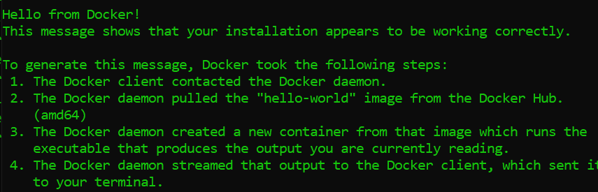

Good! Now we are ready to go on. You can also use the script ready for your to install docker  [here](https://github.com/ruslanmv/hello-watsonx-orchestrate/blob/main/scripts/ubuntu/install_docker.sh)

### macOS

On macOS, Docker Desktop bundles everything you need—including the Docker Engine, CLI, and Kubernetes—in a single app. Lets Installing Colima + Docker CLI on macOS. For our CLI-first, lightweight approach:

**1. Homebrew** (if missing)

```
which brew >/dev/null \
  || /bin/bash -c "$(curl -fsSL https://raw.githubusercontent.com/Homebrew/install/HEAD/install.sh)"
```

**2. Install Colima + Docker tools**

```
brew install colima docker docker-compose
```

**3. Start Colima**

```
colima start --cpu 4 --memory 8 --disk 60
```

**4. Verify**

```bash
docker --version
docker compose version
docker run hello-world
```

You can also use the script ready for your to install docker  [here](https://github.com/ruslanmv/hello-watsonx-orchestrate/blob/main/scripts/mac/install_docker.sh).

## Step 3: Watsonx Orchestrate ADK Installation

Now, we'll install the IBM watsonx Orchestrate Agent Developer Kit (ADK) and start the local development server.

**Install the ADK**

 Use `pip` to install the core `orchestrate` library.

    pip install --upgrade ibm-watsonx-orchestrate==1.6.2

### File Configuration Options

There are different ways to login [watson orchestrate](https://www.ibm.com/docs/en/watsonx/watson-orchestrate/base?topic=orchestrate-logging-in-watsonx). In particular we are going to login via cli via Orchestrate Developer Edition.

The watsonx Orchestrate Developer Edition can be configured using three main approaches. Choose the one that matches your setup:

## Option 1: Using watsonx.ai Account (Recommended for Local Development)

This option requires a watsonx.ai instance and an entitlement key from My IBM.

### Create .env file with watsonx.ai configuration

```bash
cat > .env << EOF
WO_DEVELOPER_EDITION_SOURCE=myibm
WO_ENTITLEMENT_KEY=<your_entitlement_key_from_myibm>
WATSONX_APIKEY=<your_watsonx_api_key>
WATSONX_SPACE_ID=<your_space_id>
WO_DEVELOPER_EDITION_SKIP_LOGIN=false
EOF
```

### Requirements:

- Valid watsonx.ai instance on IBM Cloud
- Entitlement key from My IBM
- watsonx.ai API key and Space ID

## Option 2: Using watsonx Orchestrate Account (Version 1.5.0+)

This is the preferred method if you have a watsonx Orchestrate account.

### Create .env file with watsonx Orchestrate configuration

```bash
cat > .env << EOF
WO_DEVELOPER_EDITION_SOURCE=orchestrate
WO_INSTANCE=<your_service_instance_url>
WO_API_KEY=<your_wxo_api_key>
EOF
```

### Requirements:

- Active watsonx Orchestrate account
- Service instance URL from your watsonx Orchestrate settings
- API key generated from watsonx Orchestrate settings

## Option 3: Hybrid Approach (Fallback Method)

Use this if Option 2 doesn't work for pulling images.

### Create .env file with hybrid configuration

```bash
cat > .env << EOF
WO_DEVELOPER_EDITION_SOURCE=myibm
WO_ENTITLEMENT_KEY=<your_entitlement_key>
WO_INSTANCE=<your_service_instance_url>
WO_API_KEY=<your_wxo_api_key>
WO_DEVELOPER_EDITION_SKIP_LOGIN=false
EOF
```

## Getting Credentials for IBM Cloud watsonx Orchestrate (Option 2)

Important: Don't use the credentials from the IBM Cloud resources page directly. Follow this specific procedure to get the correct credentials for Option 2 configuration:

### Step 1: Access Your watsonx Orchestrate Instance

Log in to your  [IBM Cloud Account](https://cloud.ibm.com/)

Log in with your IBM Cloud credentials

If you don't have an account, create an [IBM Cloud account](https://cloud.ibm.com/registration). Complete the registration form, and click Create account.
Go to your [Resources list](https://cloud.ibm.com/resources)

Navigate to the [watsonx Orchestrate catalog](https://cloud.ibm.com/catalog/services/watsonx-orchestrate?) page on IBM Cloud.


On the plan catalog page, select Trial plan and choose your data center location from the Select a location drop-down.

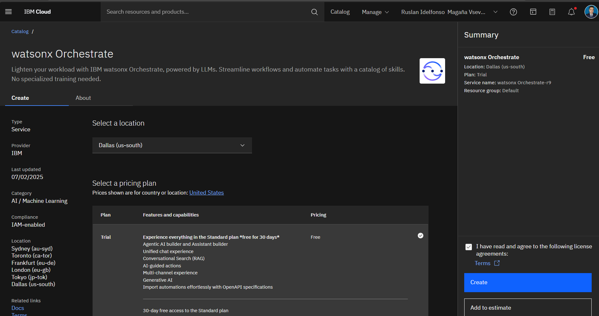

The Service name is pre-filled, you can modify it if needed.
The resource group is set to Default.

Accept the license agreement and click Create to provision a watsonx Orchestrate instance on IBM Cloud. The services page is displayed.

Click Launch watsonx Orchestrate to access the service page and start using the service.

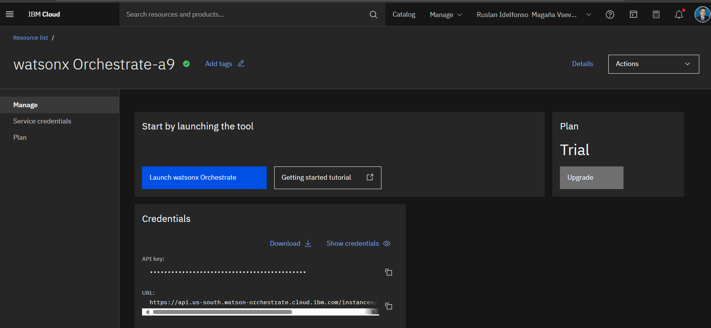

Navigate to Resource list.
Find your watsonx Orchestrate product under the AI/Machine Learning resource category

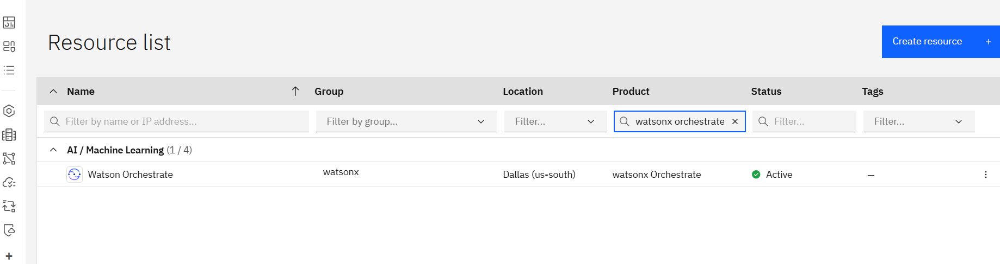


Click on your watsonx Orchestrate instance

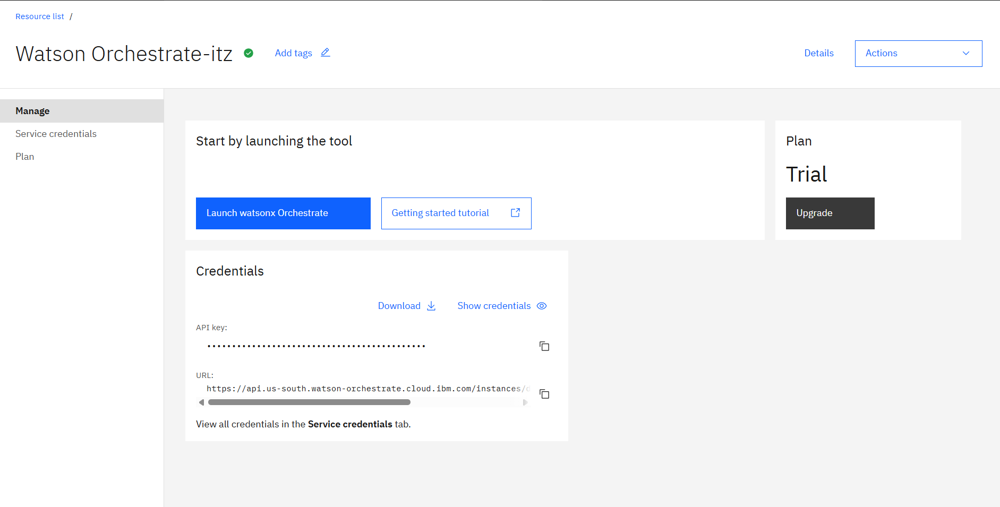

Click Launch watsonx Orchestrate

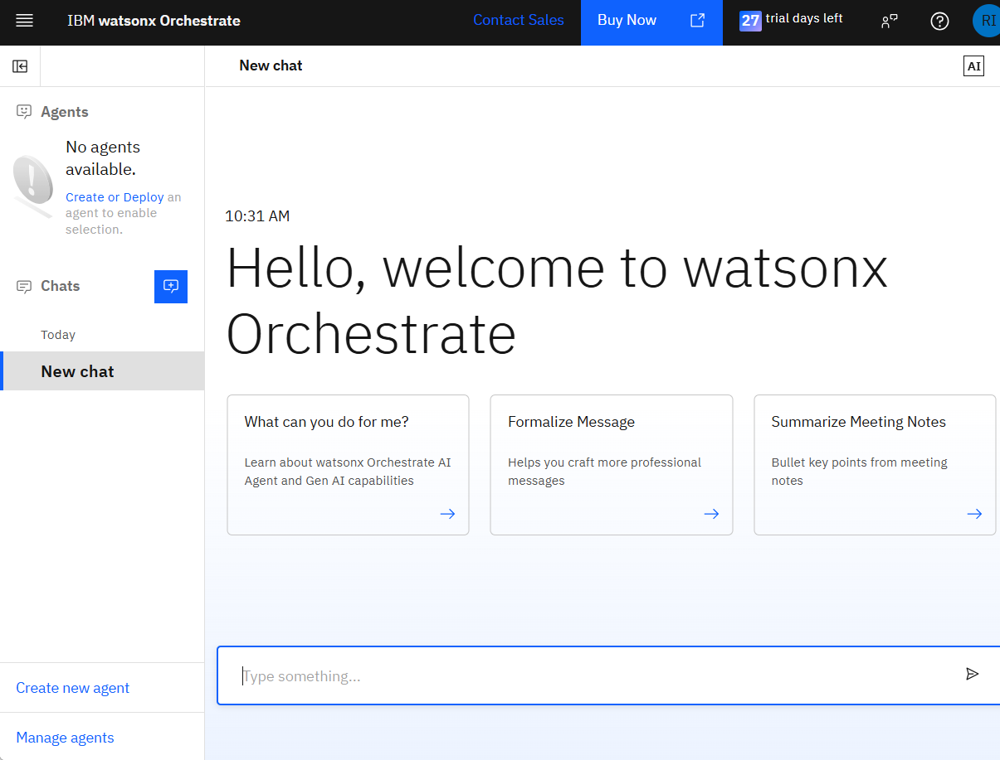

## Step 2: Access API Settings

Once you're logged into your watsonx Orchestrate instance:

Click your user icon on the top right Click Settings

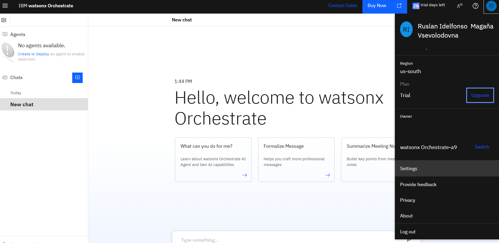

Go to the API details tab

## Step 3: Get Service Instance URL (WO_INSTANCE)

Copy the service instance URL from the API details tab. This will be in the format:

```
https://api.<region>.watson-orchestrate.ibm.com/instances/<wxo_instance_id>
```

Save this value for the WO_INSTANCE variable in your .env file.

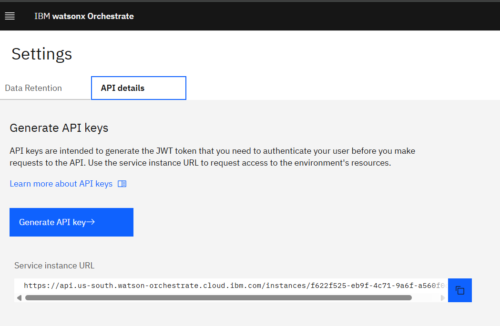

## Step 4: Generate API Key (WO_API_KEY)

Click the Generate API key button

This redirects you to the IBM Cloud Identity Access Management center

Important: Verify that you are in the correct Account where you have access to watsonx Orchestrate

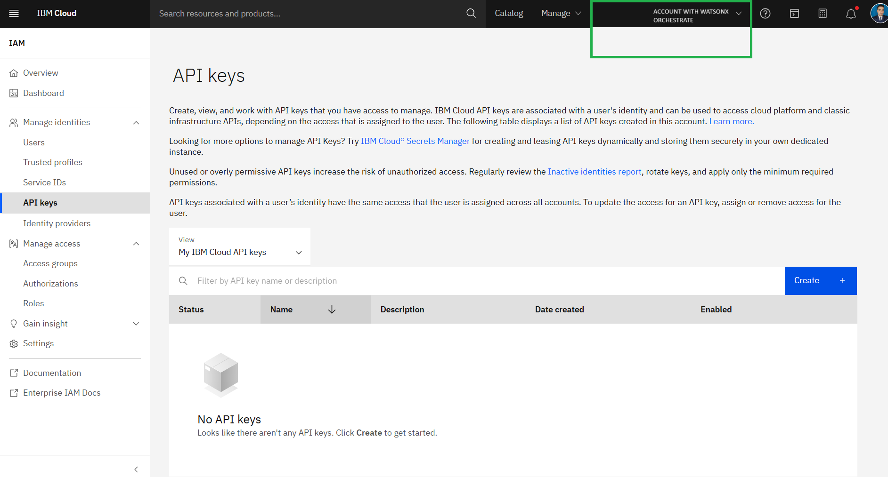

Click Create to create a new API Key

Enter a name and description for your API Key

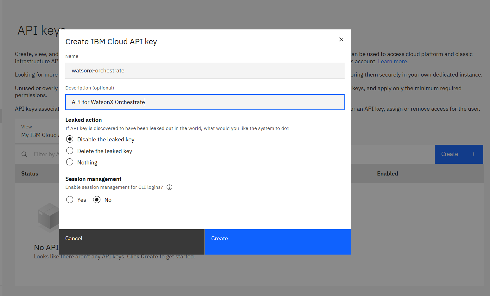

Copy the API key and store it securely - this will be your WO_API_KEY value

## Step 5: Set WO_DEVELOPER_EDITION_SOURCE

For Option 2, set 

```
WO_DEVELOPER_EDITION_SOURCE=orchestrate
```

Important Notes: API keys are not retrievable and can't be edited or deleted. Store your API key in a safe location immediately after generation. You're limited to 10 API keys in this environment

## Getting Credentials for IBM Cloud using watsonx.ai Account (Option 1)

Follow these steps to obtain all the required credentials for Option 1 configuration:

### Step 1: Get Entitlement Key from My IBM (WO_ENTITLEMENT_KEY)

Access [My IBM](https://myibm.ibm.com/)

Click View Library

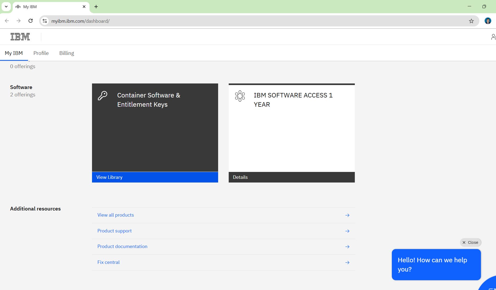

Click Add a new key +

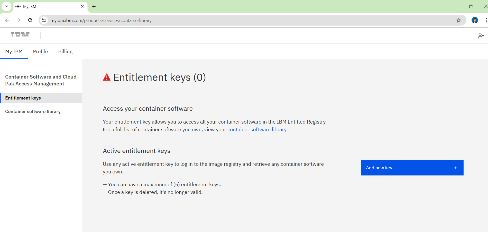

Copy the entitlement key - this will be your 

WO_ENTITLEMENT_KEY value

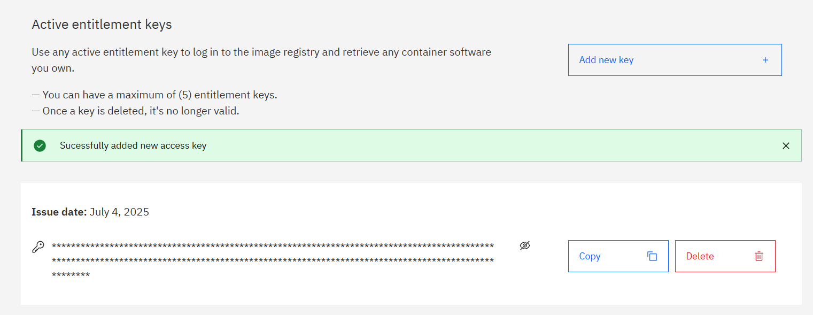

## Step 2: Create watsonx.ai Instance and Get Space ID (WATSONX_SPACE_ID)

Create a watsonx.ai instance on IBM Cloud (if you don't have one already)


Go to your [watsonx instance](https://dataplatform.cloud.ibm.com/wx/home?context=wx)

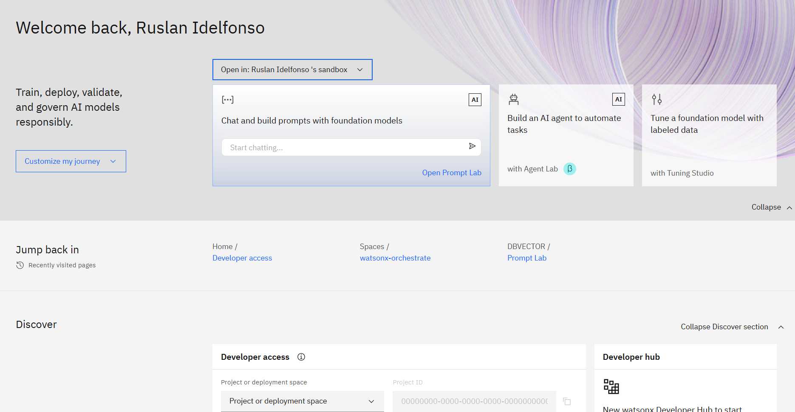

Scrow down and click [Create a new deployment space](https://
dataplatform.cloud.ibm.com/ml-runtime/spaces/create-space?context=wx)

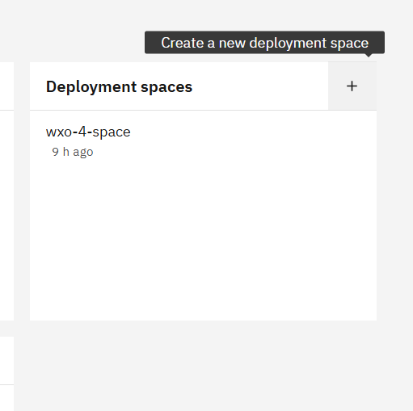

here we give an orignal name for example 

`watsonx-ochestrate-1` 

for exmaple,

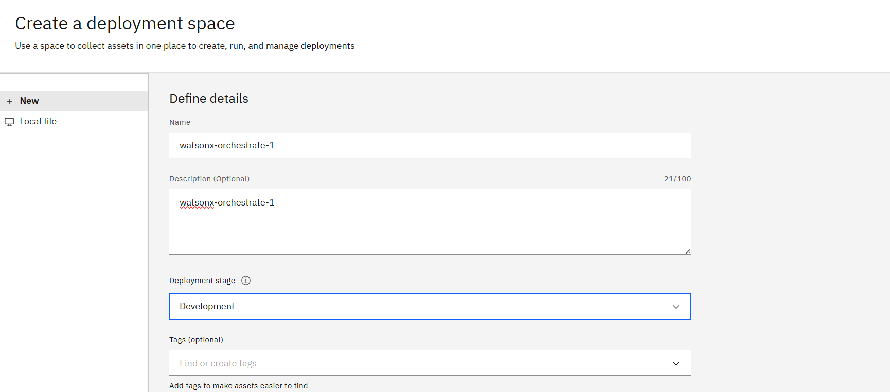

for this demo we will use Deployment stage `Development`

and we choose watsonx.ai Runtime appropiate.

and we create it.
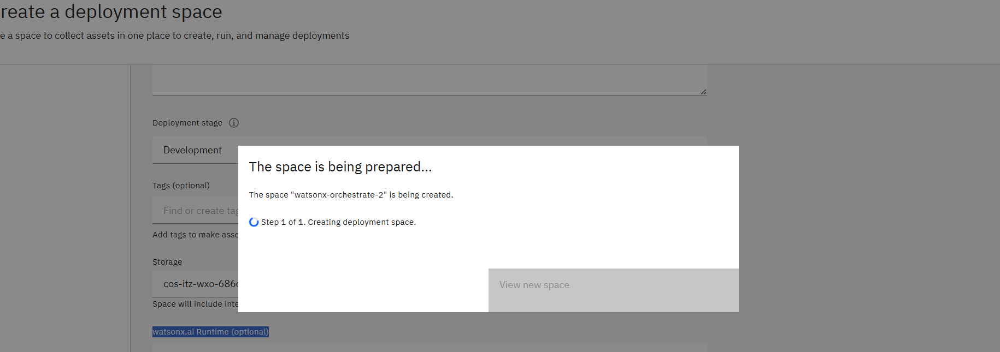

Go to the Developer access page on IBM Cloud

Go to this page

[Developer access ](https://dataplatform.cloud.ibm.com/developer-access?context=wx)

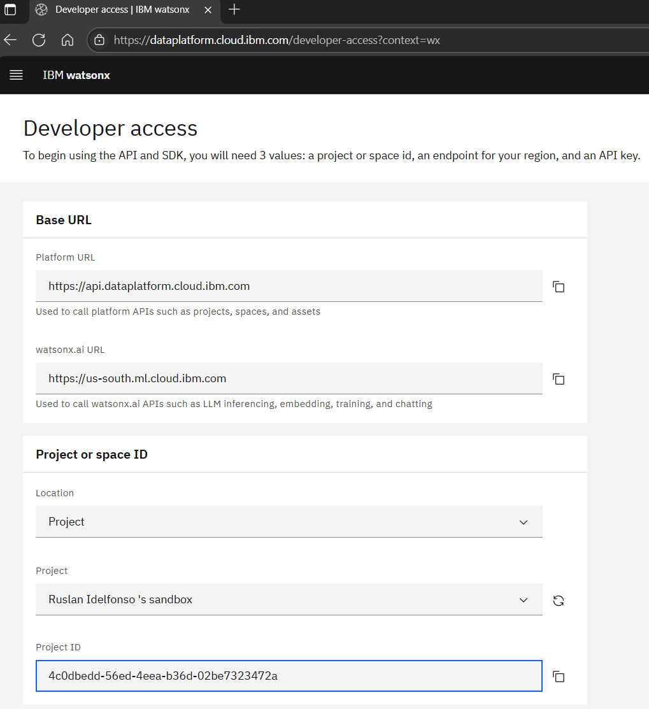

Locate your space ID - this will be your **WATSONX_SPACE_ID** value. You can also create a new space if needed from this page


## Step 3: Get watsonx.ai API Key (WATSONX_APIKEY)

In your IBM Cloud account, go to Manage → Access (IAM)

Click on API keys in the left sidebar

Click Create an IBM Cloud API key


[https://cloud.ibm.com/iam/apikeys](https://cloud.ibm.com/iam/apikeys)

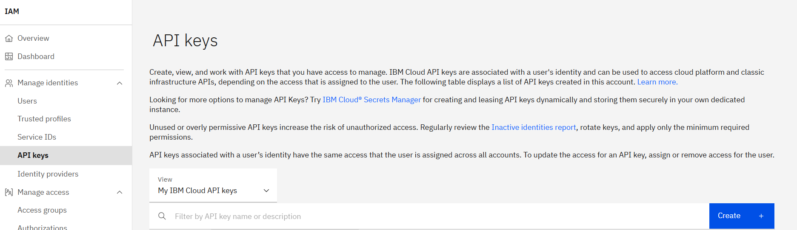

Enter a name and description for your API key

Click Create

Copy the API key immediately - this will be your 

WATSONX_APIKEY value

Store it securely as it cannot be retrieved later

Alternative method for API key:

Go to Managing API Keys

Follow the IBM Cloud documentation to create your API key

## Step 4: Set Additional Variables

We add to additional variables

```bash
WO_DEVELOPER_EDITION_SOURCE=myibm
```

```bash
WO_DEVELOPER_EDITION_SKIP_LOGIN=false 
```

(you can set this to true to skip ICR login if you already have the images)

So complete Option 1 .env file example:

```bash
cat > .env << EOF
WO_DEVELOPER_EDITION_SOURCE=myibm
WO_ENTITLEMENT_KEY=eyJ0eXAiOiJKV1QiLCJhbGciOiJSUzI1NiJ9...
WATSONX_APIKEY=your-ibm-cloud-api-key-here
WATSONX_SPACE_ID=12345678-1234-1234-1234-123456789abc
WO_DEVELOPER_EDITION_SKIP_LOGIN=false
EOF
```

Important Notes for Option 1:

The entitlement key is a JWT token that will be quite long
The Space ID is a UUID format identifier
The API key is your IBM Cloud API key, not a watsonx Orchestrate specific key

Make sure your IBM Cloud API key has access to the watsonx.ai service and the specified space
Starting the Developer Edition
Once your .env file is configured and your Python virtual environment is active:

### Ensure Python virtual environment is active

```bash
source venv/bin/activate
```

### Start the watsonx Orchestrate Developer Edition

```bash
orchestrate server start --env-file=.env
```

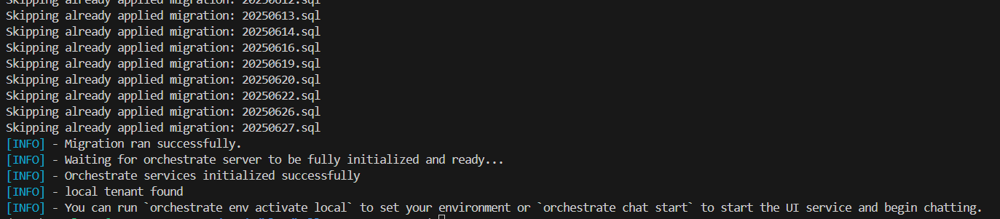

## Environment Management


### Activate local environment

After starting the server, activate the local environment:

```bash
orchestrate env activate local
```

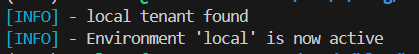

### Environment Management Commands

List Available Environments:

```bash
orchestrate env list
```

Example output:

```bash
local                      http://localhost:4321                                                 (active)
```

Just like information if we want ran the remote environment from the cloud you can choose one of the follwoing options

## Add Remote Environment (optional):

### For IBM Cloud

For the case of IBM cloud  you can type

```bash
orchestrate env add -n my-ibm-cloud-env -u https://your-service-instance-url --type ibm_iam --activate
```

and if you want to see 

```bash
orchestrate env list
```

Example output:

```bash
my-ibm-cloud-env          https://api.watson-orchestrate.cloud.ibm.com/instances/<instance-id>
```

### For AWS

And similar for aws

```bash
orchestrate env add -n my-aws-env -u https://your-service-instance-url --type mcsp --activate
```

and

```bash
orchestrate env list
```

Example output:

```bash
my-aws-env                https://api.watson-orchestrate.ibm.com/instances/<instance-id>
```

## Switch Between Environments:

Switch to local development environment

```bash
orchestrate env activate local
```

Switch to remote production environment

```bash
orchestrate env activate my-ibm-cloud-env
```

## Authentication for Remote Environments:

Authenticate against remote environment (expires every 2 hours)

```bash
orchestrate env activate my-ibm-cloud-env --api-key your-api-key
```

Or authenticate interactively

```bash
orchestrate env activate my-ibm-cloud-env
```


# Working with Agents and Tools

When building AI-powered solutions with IBM watsonx Orchestrate ADK, understanding the different types of agents and their integration possibilities is crucial for creating effective automation workflows. This section explores the various agent types available and how you can integrate external systems to extend your agent capabilities.

## Types of Agents

### Native Agents

Native agents are the fundamental components of **watsonx Orchestrate**, created right inside the platform with the ADK framework. They’re designed to work together—sharing tools and collaborating with other agents—and can adopt different styles (default, react, or planner) to suit various workflows. Without extra setup, they break down complex tasks into smaller steps and then combine the results, using large language models to guide their reasoning and choices for multi-step processes.

Agent Styles:

- **Default**: Standard conversational agent behavior
- **React**: Reasoning and acting pattern for complex problem-solving
- **Planner**: Advanced planning capabilities for multi-step tasks that support structured output and custom join tools

**Example Configuration:**

```yaml
spec_version: v1
kind: native  # This field is required
name: customer_service_agent
description: Handles customer inquiries and support requests
style: react
llm: watsonx/meta-llama/llama-3-2-90b-vision-instruct
instructions: |
  You are a helpful customer service agent...
tools:
  - search_knowledge_base
  - create_ticket
collaborators:
  - billing_agent
  - technical_support_agent
```

**Example Use Cases:**

- Customer service agents that can access multiple systems
- HR assistants that help with employee onboarding
- IT support agents that can troubleshoot and resolve issues

**When to Use:** Use native agents when you’re starting fresh—building new agents from scratch—and need deep integration with all of watsonx Orchestrate’s features. They’re ideal if you want to take full advantage of the platform’s built-in capabilities and need precise control over how your agents behave and use tools.


## External Agents

External agents let you bring in and work with agents built on other platforms directly inside your watsonx Orchestrate setup. This means you can reuse the agents you’ve already invested in, tap into specialized capabilities from different frameworks, combine multiple AI tools into hybrid solutions, and keep developing your agent logic in whichever environment you prefer.

### Agent Integration Options:

**1. watsonx.ai Platform Integration**

Perfect for organizations already using IBM's watsonx.ai platform for agent development.

```bash
orchestrate agents create \
--name analytics_agent \
--kind external \
--title "Data Analytics Agent" \
--description "Specialized agent for data analysis" \
--api "https://your-api-endpoint.com" \
--provider wx.ai \
--auth-scheme API_KEY \
--auth-config '{"token": "your_api_key"}'
```


**2. Custom External Chat Agents**

Ideal for integrating agents built with popular frameworks like **LangGraph, CrewAI**, or custom solutions

```bash
orchestrate agents create \
--name custom_agent \
--kind external \
--title "Custom Agent" \
--description "Custom agent built with LangGraph" \
--api "https://your-agent-endpoint.com" \
--provider external_chat \
--auth-scheme BEARER_TOKEN \
--auth-config '{"token": "your_bearer_token"}'
```

**When to Use:** You have custom agents hosted on your own infrastructure or built with third-party frameworks.

**3. Salesforce Agent Integration**

Seamlessly connect your Salesforce Agentforce agents with watsonx Orchestrate workflows.

```bash
orchestrate agents create \
--name salesforce_support_agent \
--kind external \
--title "Customer Support Agent" \
--description "Salesforce agent specialized in customer support" \
--api "https://api.salesforce.com/einstein/ai-agent/v1" \
--provider salesforce \
--chat-params '{"agent_id": "your_salesforce_agent_id", "client_id": "your_client_id", "domain_url": "https://your-domain.salesforce.com"}'
```

**When to Use:** You want to leverage Salesforce's customer relationship management capabilities within your orchestration workflows.

**4. A2A Protocol Agents**

For agents that implement the Agent-to-Agent communication protocol, enabling structured inter-agent communication.

```bash
orchestrate agents create \
--name a2a_specialist \
--kind external \
--title "A2A Specialist" \
--description "Specialized agent following A2A protocol" \
--api "https://your-a2a-agent.com" \
--provider "external_chat/A2A/0.2.1"
```

**When to Use:** You need structured, protocol-based communication between agents for complex multi-agent scenarios.

**5. MCP Integration: Toolkit Support**

When integrating **MCP with watsonx Orchestrate**, it's important to understand that the ADK currently supports MCP through **toolkits only**, not standalone MCP agents. This functionality is available in watsonx Orchestrate Developer Edition (version 1.2.0 and later), allowing you to import MCP servers as toolkits that provide tools for your native agents.

**How to Import MCP Toolkits:**

The `orchestrate toolkits import` command supports several approaches for importing MCP toolkits:

```bash
orchestrate toolkits import \
    --kind mcp \
    --name toolkit_name \
    --description "helps you talk to the manager" \
    --package-root /path/to/folder \
    --command '["node", "dist/index.js", "--transport", "stdio"]' \
    --tools "*" \
    --app-id "my_app_id"
```


```bash
orchestrate toolkits import \
    --kind=mcp \
    --name=mcp-github-toolkit \
    --language=node \
    --description='GitHub integration toolkit' \
    --package='@modelcontextprotocol/server-github' \
    --tools="list-repositories,get-user" \
    --app-id=github
```

**Key Import Options:**

- `--tools "*"` - Import all available tools
- `--tools "tool1,tool2"` - Import specific tools
- `--package` - Use NPM or Python packages directly
- `--package-root` - Use local MCP server directory
- `--app-id` - Associate with a connection (only `key_value` connections supported)

**Alternative Agent Integration Options**

If you need to integrate complete agents (not just tools), use these external agent patterns:

- **External Chat Agents** - For agents hosted externally that follow chat completion protocols

- **watsonx.ai External Agents** - For agents built on the watsonx.ai platform

- **Salesforce Agents** - For Salesforce Agent integration

  

## **Current Integration Approach**

MCP integration in watsonx Orchestrate is **toolkit-focused rather than agent-focused**. This means:

**Supported**: Importing MCP servers as toolkits to provide tools for native agents **Not Supported**: Integrating complete MCP agents as standalone conversational agents.

If you have an MCP server that provides tools, you can integrate those tools into watsonx Orchestrate native agents through the toolkit system. For complete agent integration, use the external agent patterns described above.

**Best Practices**

- Start with native agents and enhance them with MCP toolkits for the best development experience
- Use MCP toolkits to extend your native agents with specialized external tools and services
- Consider your existing infrastructure and requirements when choosing between native agents with MCP toolkits versus external agent integration
- Remember that MCP integration is currently limited to the Developer Edition environment.


# Real World Example.

Let's continue with our practical example using a **Native Agents** . Once your environment is set up and activated, you can work with agents and tools.

### Create and Validate Your Agents.

Let us first create the following files for this hands on example.

```
├── agents/              # YAML definitions
│   ├── greeting_agent.yaml
│   ├── echo_agent.yaml
│   ├── calculator_agent.yaml
│   └── orchestrator_agent.yaml
├── tools/
│   └── calculator_tool.py
```

Let first create your first agent.

#### **Agent 1: The Greeting Agent (`greeting_agent.yaml`)**

This agent's only job is to respond to greetings. Note the instructions are written to be case-insensitive.

```yaml
spec_version: v1
kind: native
name: greeting_agent
description: A friendly agent that handles greetings only.
style: react
llm: watsonx/meta-llama/llama-3-2-90b-vision-instruct
instructions: |
  You are the Greeting Agent.
  • If the user's message contains the word **“hello”** (case-insensitive),
    respond with exactly:  
      **Hello! I am the Greeting Agent.**
  • For every other input, say:  
      **I only handle greetings. Please say "hello".**
tools: []

```

A best practice is to run `orchestrate validate -f <your-file.yaml>` before importing anything. This command checks for typos, incorrect model IDs, and other common errors.

*Validate it:* `orchestrate validate -f greeting_agent.yaml`

#### **Agent 2: The Echo Agent (`echo_agent.yaml`)**

This agent echoes any input back, using the correct `{input}` placeholder for the user's message.

```yaml
# echo_agent.yaml
spec_version: v1
kind: native
name: echo_agent
description: An agent that echoes the user’s input back verbatim.
style: react
llm: watsonx/meta-llama/llama-3-2-90b-vision-instruct
instructions: |
  You are the Echo Agent.
  Always repeat the user's exact input.
  Format your reply as:  
    **The Echo Agent heard you say: {input}**
tools: []

```

*Validate it:* `orchestrate validate -f echo_agent.yaml`


#### **The Collaborator Pattern**

The Orchestrator Agent will manage our other agents. It uses the `collaborators` keyword to gain access to them. The message flow looks like this:

```ascii
     User Input
          │
          ▼
┌────────────────────┐
│ Orchestrator Agent │
└────────────────────┘
          │
          ├─► If "hello" is in message... ─► ┌────────────────┐
          │                                  │ Greeting Agent │
          │                                  └────────────────┘
          │
          ├─► If message is math... ───────► ┌──────────────────┐
          │                                  │ Calculator Agent │
          │                                  └──────────────────┘
          │
          └─► Otherwise... ────────────────► ┌──────────────┐
                                             │  Echo Agent  │
                                             └──────────────┘
```

#### **Agent 3: The Orchestrator Agent (`orchestrator_agent.yaml`)**

This is the brain of our system. It contains the routing logic to delegate tasks to the correct specialist.

```yaml
# orchestrator_agent.yaml
spec_version: v1
kind: native
name: orchestrator_agent
description: Routes user requests to the appropriate specialist agent.
style: react
llm: watsonx/meta-llama/llama-3-2-90b-vision-instruct
collaborators:
  - greeting_agent
  - calculator_agent
  - echo_agent
instructions: |
  You are the Orchestrator Agent. Delegate as follows:

  1. If the user's message contains the word "hello" (case-insensitive),
     delegate to **greeting_agent**.

  2. Else if the message appears to ask for mathematical operations like:
     - Addition: "add", "plus", "sum", "+", "5 + 3"
     - Subtraction: "subtract", "minus", "-", "10 - 5"  
     - Multiplication: "multiply", "times", "*", "4 * 6"
     - Division: "divide", "/", "20 / 4"
     delegate to **calculator_agent**.

  3. Otherwise, delegate to **echo_agent**.

  Do not answer directly yourself. Always delegate to the appropriate collaborator and return their exact response.
tools: []
```

*Validate it:* `orchestrate validate -f orchestrator_agent.yaml` (This will fail for now, as it doesn't know about `calculator_agent` yet. We'll fix that next\!)

-----

### **The "Hero" Leap - Empowering Agents with Python Tools**

Agents that only talk are useful, but agents that *do things* are powerful. Here’s how we create our `calculator_agent`. **Order is critical**: we must create and import the tool *before* the agent that uses it.

#### **4.1: Create the Python Tool (`calculator_tool.py`)**

The ADK requires the `@tool` decorator to discover and register a Python function.

```python
# calculator_tool.py
from ibm_watsonx_orchestrate.agent_builder.tools import tool

@tool
def add(a: float, b: float) -> float:
    """
    Add two numbers together.
    
    :param a: The first number to add
    :param b: The second number to add
    :returns: The sum of a and b
    """
    return a + b

@tool
def subtract(a: float, b: float) -> float:
    """
    Subtract the second number from the first number.
    
    :param a: The number to subtract from
    :param b: The number to subtract
    :returns: The difference of a and b
    """
    return a - b

@tool
def multiply(a: float, b: float) -> float:
    """
    Multiply two numbers together.
    
    :param a: The first number to multiply
    :param b: The second number to multiply
    :returns: The product of a and b
    """
    return a * b

@tool
def divide(a: float, b: float) -> float:
    """
    Divide the first number by the second number.
    
    :param a: The dividend (number to be divided)
    :param b: The divisor (number to divide by)
    :returns: The quotient of a divided by b
    """
    if b == 0:
        raise ValueError("Cannot divide by zero")
    return a / b
```

#### **Create the Calculator Agent (`calculator_agent.yaml`)**

This agent is explicitly designed to use our new `add` tool.

```yaml
spec_version: v1
kind: native
name: calculator_agent
description: Performs mathematical calculations including addition, subtraction, multiplication, and division.
style: react
llm: watsonx/meta-llama/llama-3-2-90b-vision-instruct
instructions: |
  You are a calculator agent that can perform basic mathematical operations.
  
  • When asked to add or sum numbers, call the `add` tool
  • When asked to subtract numbers, call the `subtract` tool  
  • When asked to multiply numbers, call the `multiply` tool
  • When asked to divide numbers, call the `divide` tool
  
  Always use the appropriate tool for the mathematical operation requested.
  Do NOT compute results yourself - always use the tools.
  After the tool returns a result, present it clearly to the user.
  
  Handle these types of requests:
  - "add 5 and 3" or "5 + 3" → use add tool
  - "subtract 10 from 15" or "15 - 10" → use subtract tool
  - "multiply 4 by 6" or "4 * 6" → use multiply tool
  - "divide 20 by 4" or "20 / 4" → use divide tool
tools:
  - add
  - subtract
  - multiply
  - divide
```

*Validate it:* `orchestrate validate -f calculator_agent.yaml`


### **Import and Test Your Multi-Agent System**

With all our files defined and validated, let's import them into Orchestrate and start chatting.

1. **Open a NEW terminal window** (leave the server running) and activate your virtual environment.

2. **Import the Tool First**
   Tools must exist before the agents that rely on them.

   ```bash
   orchestrate tools import -k python -f tools/calculator_tool.py
   ```

3. **Import the Agents**
   Now import all the agents.

```bash
orchestrate agents import -f agents/greeting_agent.yaml
orchestrate agents import -f agents/calculator_agent.yaml  
orchestrate agents import -f agents/echo_agent.yaml
```

```bash    
# Finally import the orchestrator
orchestrate agents import -f agents/orchestrator_agent.yaml
```

4. **Start the Chat\!**

   This command launches the chat UI. We point it to our `orchestrator_agent`, which will be the entry point. Note the plural `--agents` flag.

```bash
orchestrate chat start --agents orchestrator_agent
```


4. Check Agent Status
   Verify your agents were imported correctly:

```bash
orchestrate agents list
```

## The Final Performance: Putting Your Multi-Agent System to the Test

It's time for the moment of truth. With our agents built and our server running, let's open the chat interface at `http://localhost:3000/chat-lite` and witness our creation in action.

## How to Test Individual Agents

Using the Chat Interface with Agent Selection. When you start the chat interface, you can select specific agents to test:

**1. Start the chat interface:**

```
orchestrate chat start
```

**2. Access the chat UI:**
Navigate to http://localhost:3000/chat-lite in your browser

**3. Select a specific agent:**
In the chat interface, you'll see a list of available agents. You can select the specific agent you want to test from this list.

**Testing Individual Agents via CLI Commands**
You can also test agents individually using CLI commands:

List all available agents

```
orchestrate agents list
```

Test a specific agent directly (if supported)

This would show you which agents are available for testing

**4. Testing Each of Your Agents**
For your specific project, test each agent individually:

### Test the Greeting Agent

Select greeting_agent in the chat interface

Type: "hello"
Expected response: "Hello! I am the Greeting Agent."

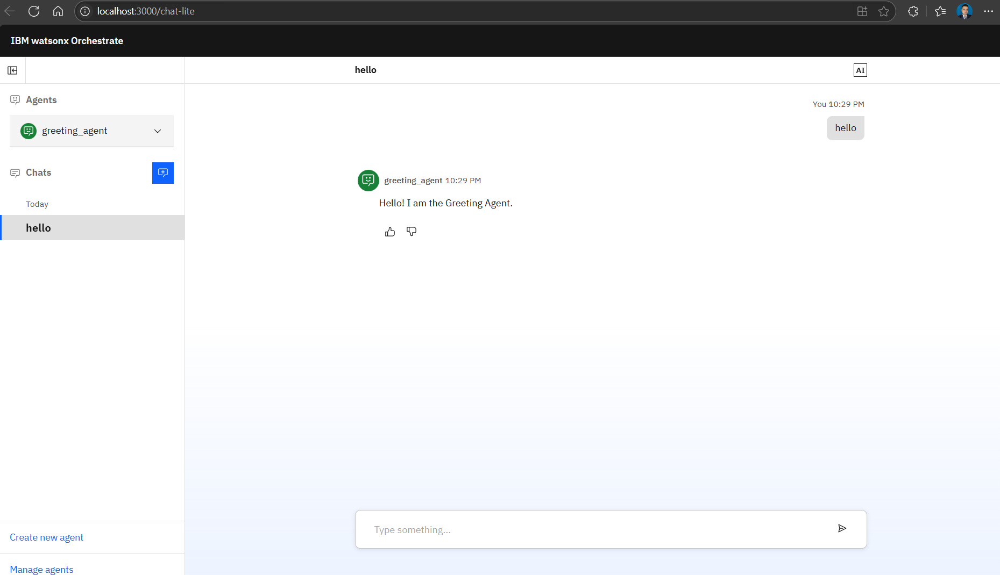

### Test the Calculator Agent:

Select calculator_agent in the chat interface
Type: "add 5 and 3"
Expected response: The agent should call the add tool and return the result
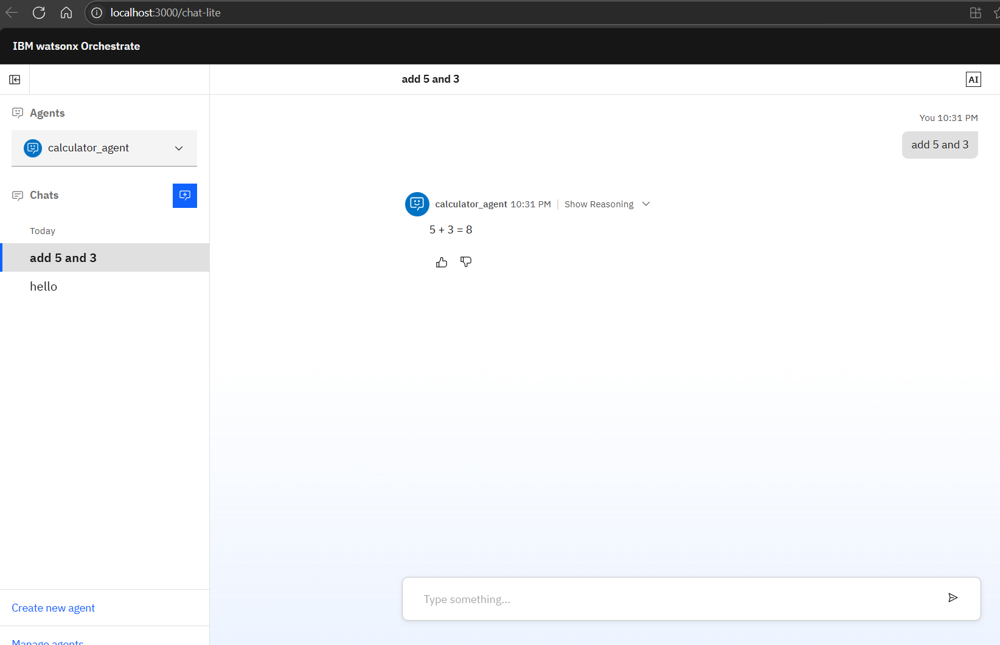

### Test the Echo Agent:

Select echo_agent in the chat interface
Type: "test message"
Expected response: "The Echo Agent heard you say: test message"

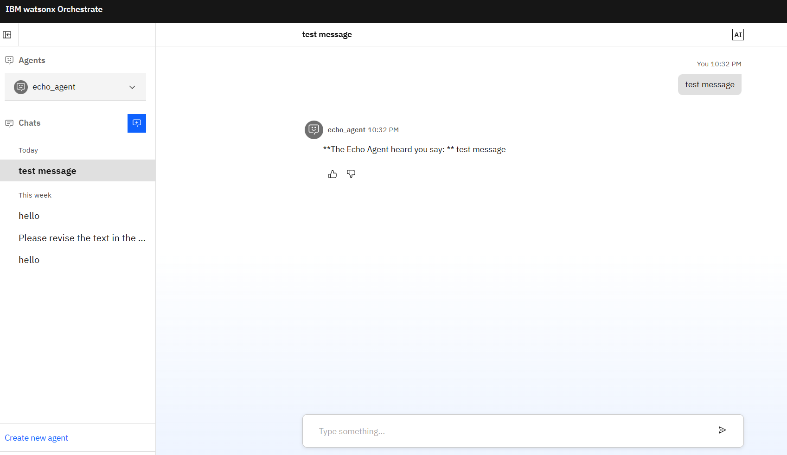

### Test the Orchestrator Agent:

Select orchestrator_agent in the chat interface
Try different inputs to test routing:
"hello" → should route to greeting_agent
"add 2 and 2" → should route to calculator_agent
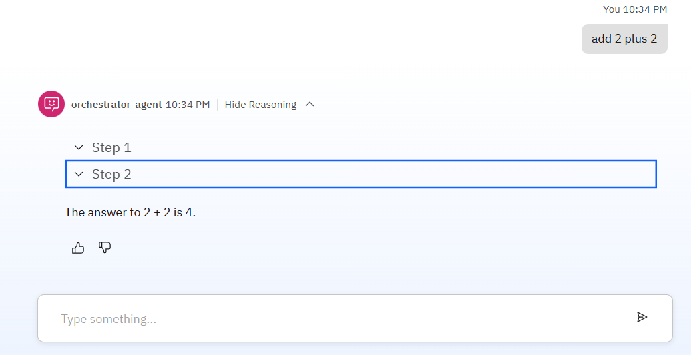
You can analyze the reasoning
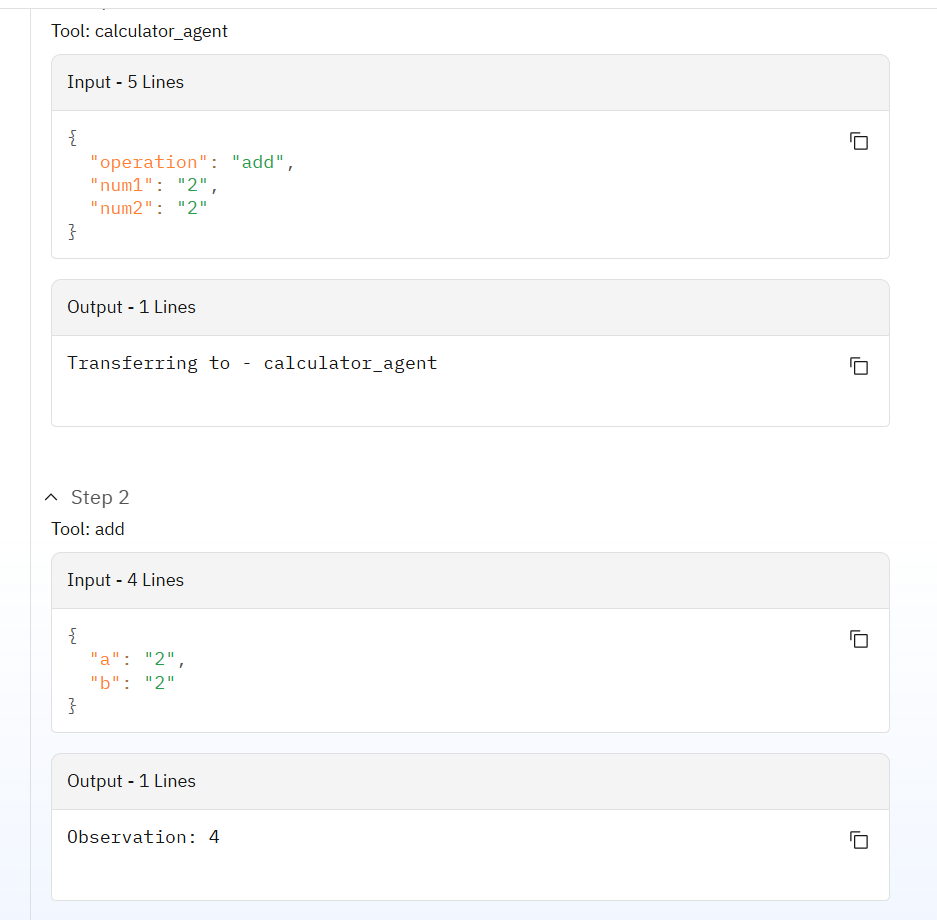

Watch closely. The Orchestrator understands this isn't a greeting; it's a request for calculation. It awakens the `calculator_agent`, which in turn knows it needs to call the `add` function from our Python tool. The tool does the heavy lifting, and the agent presents the final, correct answer.


## Choosing the Right "Brain": A World of LLM Possibilities

We've successfully tested our agents, and they work beautifully. But what gives them their spark? The answer is the **Large Language Model (LLM)**, the "brain" behind each agent's reasoning. One of the greatest strengths of the watsonx Orchestrate ADK is its flexibility. You are not locked into a single provider; you are given the keys to a whole universe of AI models.

At the core, you have seamless integration with **watsonx.ai**, giving you access to powerful, enterprise-ready models like the **Llama 3 series** and IBM's own high-performance **Granite** models. The `llm: watsonx/meta-llama/llama-3-2-90b-vision-instruct` we used is just one of many excellent choices.

You can see the full roster of available models in your own environment at any time. Just open your terminal and run:

```bash
orchestrate models list
```

This command empowers you to choose the perfect intelligence for any task, ensuring your agents are not just functional, but truly smart.

###  The Responsible Hero: Cleaning Up Your Workspace

A true professional knows that cleaning up is just as important as building. When you're finished experimenting, it's good practice to remove the assets you've created to keep your environment tidy.

You can do this with a few simple commands. From a terminal with your virtual environment active, run the following to dismantle your system piece by piece:

```bash
# It's best practice to delete agents first
orchestrate agents delete orchestrator_agent
orchestrate agents delete calculator_agent
orchestrate agents delete greeting_agent
orchestrate agents delete echo_agent

# Then, delete the tool the agents relied on
orchestrate tools delete add

# Finally, in the terminal where the server is running,
# press Ctrl+C and then run the stop command:
orchestrate server stop
```

-----

###  When Heroes Stumble: A Troubleshooting Guide

Even the best developers run into a few snags. If your system isn't behaving as expected, don't worry. Here are solutions to some common challenges:

  * **Getting an `Agent not found` error?**
    This usually means there's a typo in your `orchestrator_agent.yaml`'s `collaborators` list, or you forgot to import one of the agents. Double-check your spelling and run `orchestrate agents list` to ensure everyone is present.

  * **Seeing a `Tool for agent not found` error?**
    This is almost always an import order issue. Remember the golden rule: **tools must be imported *before* the agents that use them.** Delete the agent, re-import your tool, and then import the agent again.

  * **The server fails with `Address already in use`?**
    This classic error simply means another process (likely a previous server instance) is already using a required port. Stop the old server with `orchestrate server stop` before starting a new one.

-----

###  Your Journey is Just Beginning

From a simple idea to a collaborating team of specialized AI agents, you've gone from zero to hero. You've learned the fundamentals of building with watsonx Orchestrate, but your adventure is far from over. You now have a powerful foundation to build upon. Here are the new quests you can embark on:

  * **Grant Your Agents Vast Knowledge:** Move beyond simple instructions. With **Knowledge Bases**, you can feed your agents PDFs, documents, and web content, allowing them to answer complex questions based on a rich set of information.

  * **Master Complex Tasks with the Flow Builder:** For workflows that require multiple, sequential steps, the **Flow Builder** is your visual spellbook. Chain tools and logic together to create sophisticated automations without writing extensive code.

  * **Forge an Unbreakable System with Unit Tests:** For production-grade reliability, the ADK includes a Python SDK that lets you write **unit tests** for your agents' behavior. This is perfect for integrating your agent development into a professional CI/CD pipeline.

You can download the full project [here](https://github.com/ruslanmv/hello-watsonx-orchestrate). 

**Congratulations!** Today, you didn't just build a simple AI; you learned how to **orchestrate intelligence**. You created a system where different agents, each with a unique skill, collaborate under the direction of a manager to solve problems more effectively than a single agent ever could. This "manager-worker" pattern is a cornerstone of creating scalable, reliable, and powerful AI solutions.

The power is now in your hands. Take these concepts, explore the advanced features, and start building automations that solve real-world problems. We can't wait to see what you create.

