Hello everyone, today we are going to build a simple python codes to build a simple A2A agent by using  **universal-a2a-agent**. You’ll learn how to expose your agent over multiple surfaces—`POST /a2a` (raw A2A), `POST /rpc` (JSON-RPC 2.0), `POST /openai/v1/chat/completions` (OpenAI-compatible), plus discovery at `GET /.well-known/agent-card.json` and ops endpoints at `GET /healthz` and `GET /readyz`.

We’ll start with the simplest possible agent: a one-function handler that takes text and returns text. From there, we’ll build a LangGraph “Debugger” agent, and then a small multi-agent graph—all on the same universal server, with no lock-in to a single LLM provider or framework.

The idea is to keep inputs small and setup minimal: write a tiny handler, mount it, and your agent speaks A2A, JSON-RPC, and OpenAI right away. Along the way you’ll see how the Agent Card makes your service discoverable, and how the runtime stays decoupled from providers and orchestration so you can swap pieces without rewrites.


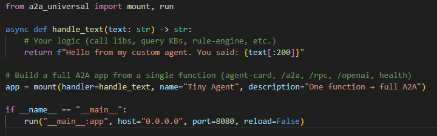

​												Example of **tiny_agent.py**


## Introduction

**Agent-to-Agent (A2A)** is a small, stable contract for talking to agents over HTTP. Your caller — a UI, service, or another agent — sends a structured message; your agent can plan, call tools, query data, and reply with a well-formed result. The big win is **decoupling**: on the outside you keep one predictable interface; on the inside you’re free to swap LLM providers and orchestration frameworks without breaking clients.

An “agent” here is a goal-oriented program (usually LLM-backed) that can understand a request, decide next steps, use tools or data, and explain what it did. In practice, you mix patterns — chat, retrieval (RAG), tool-use, planner/executor, workflow graphs, and even small multi-agent crews. A2A doesn’t force a style; it gives you a consistent wire format to ship whatever logic you need.

**Universal A2A Agent** is the production-ready, framework-agnostic server that speaks A2A and OpenAI-compatible APIs out of the box. It’s designed to be vendor-neutral and pluggable:

* **Multi-provider**: Watsonx.ai, OpenAI, Anthropic, Gemini, Ollama, Azure OpenAI, AWS Bedrock, and more — flipped by environment variables, no code changes.
* **Multi-framework**: native loop, LangGraph, LangChain, CrewAI, etc. — choose the orchestration that fits the job.
* **Ops-ready**: Docker/Helm friendly, health and readiness endpoints, structured logging, and discovery via the **Agent Card**.

You’ll deploy it once and point anything at it. The same instance supports quick terminal tests (raw A2A), standards-compliant JSON-RPC, and OpenAI-compatible clients — plus a discovery document that tells tools exactly how to connect.

In the next sections, you’ll build a tiny one-function agent, then a LangGraph-based debugger, and finally a multi-agent setup — all while keeping the same clean surface: `/a2a`, `/rpc`, `/openai/v1/chat/completions`, the Agent Card at `/.well-known/agent-card.json`, and health endpoints for ops.


##  1. Install & prepare

```bash
pip install universal-a2a-agent
# (Optional) if you’ll use LangGraph / LangChain models:
pip install "universal-a2a-agent[watsonx,langgraph]"
```

Choose a provider **only if you want real inference**. Otherwise use `echo` (no creds).


## 2\. Acquiring IBM watsonx.ai Credentials

Nìow that you have setup all your enviroment. We are ready to build our first agent. To configure the watsonx.ai provider, you need to obtain your API key and project details from the IBM Cloud platform.

1.  **Sign in to [IBM Cloud](https://cloud.ibm.com/).**
2.  Navigate to your **watsonx.ai** instance. If you don't have one, create a new project. You can access your projects directly via `https://dataplatform.cloud.ibm.com/projects/`.
3.  Within your project's **Manage** tab, go to the **Access Control** section and create a new **service API key**. Securely copy this key.
4.  Collect the following three values:
      * `WATSONX_API_KEY`: The API key you just generated.
      * `WATSONX_URL`: The regional endpoint shown in your service instance details (e.g., `https://us-south.ml.cloud.ibm.com`).
      * `WATSONX_PROJECT_ID`: The GUID of your project, found in the project's **Manage** -\> **General** settings.

For security and ease of configuration, it is highly recommended to store these credentials in a `.env` file at the root of the project.

The agent's behavior is controlled by environment variables. This allows you to switch the active provider or framework without any code changes. Set the following variables in your shell (or confirm they are in your `.env` file).


## 1) Minimal Setup for watsonx.ai

**Example `.env` file:**

```env
# Provider and Framework Selection
LLM_PROVIDER=watsonx
AGENT_FRAMEWORK=langgraph

# IBM watsonx.ai Credentials
WATSONX_API_KEY=your_api_key_here
WATSONX_URL=https://us-south.ml.cloud.ibm.com
WATSONX_PROJECT_ID=your_project_guid_here
MODEL_ID=ibm/granite-3-3-8b-instruct # Optional: specify a different model

# Public URL for agent discovery
PUBLIC_URL=http://localhost:8000
```

 

or you can setup 

**Watsonx.ai**

```bash
pip install langchain-ibm ibm-watsonx-ai
export LLM_PROVIDER=watsonx
export WATSONX_API_KEY=...
export WATSONX_URL=https://us-south.ml.cloud.ibm.com
export WATSONX_PROJECT_ID=...
export MODEL_ID=ibm/granite-3-3-8b-instruct
```

**Local echo (no creds)**

```bash
export LLM_PROVIDER=echo
```

**Nice-to-have**

```bash
export PUBLIC_URL=http://localhost:8080         # improves card links
# if behind a reverse proxy/sub-path:
export A2A_ROOT_PATH=/agent                     # keeps OpenAPI/card URLs correct
```

> If you run via `a2a_universal.run(...)`, a local `.env` is auto-loaded when `python-dotenv` is installed.

---

## 1) Easiest possible agent (one function → full A2A)

### `examples/simple_agent.py`  

```python
# examples/simple_agent.py
from a2a_universal.app import build
from a2a_universal import run

async def handle_text(text: str) -> str:
    return f"Hello from my custom agent. You said: {text[:200]}"

# Build a full A2A app from a single function
app = build(
    handler=handle_text,
    name="Tiny Agent",
    description="One function → full A2A",
)

if __name__ == "__main__":
    # Tip: for a pure A2A app, you can also do run(..., mode="solo")
    run("__main__:app", host="0.0.0.0", port=8080, reload=False)
```

Run it:

```bash
python examples/simple_agent.py
```

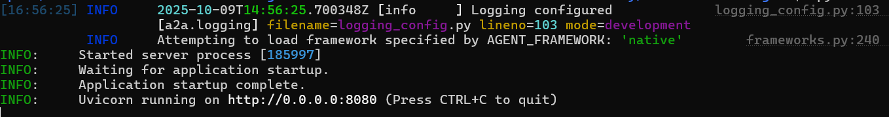


Test it:

```bash
# health
curl -s http://localhost:8080/healthz
```


```
{"status":"ok"}
```


```bash
# discovery
curl -s http://localhost:8080/.well-known/agent-card.json | jq
```

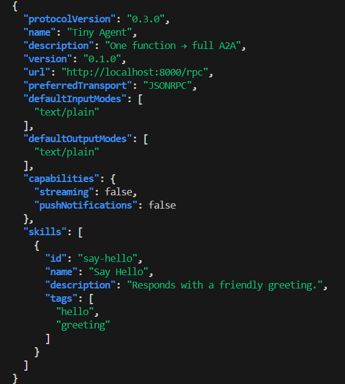

```bash
# raw A2A
curl -s http://localhost:8080/a2a \
  -H 'Content-Type: application/json' \
  -d '{
        "method":"message/send",
        "params":{"message":{
          "role":"user","messageId":"m1",
          "parts":[{"type":"text","text":"Ping from A2A"}]
        }}
      }' | jq
```

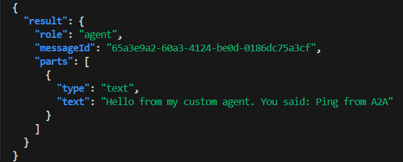

```bash
# OpenAI-compatible
curl -s http://localhost:8080/openai/v1/chat/completions \
  -H 'Content-Type: application/json' \
  -d '{"model":"tiny-agent","messages":[{"role":"user","content":"What is A2A?"}]}' \
  | jq -r '.choices[0].message.content'
```


```bash
# JSON-RPC
curl -s http://localhost:8080/rpc \
  -H 'Content-Type: application/json' \
  -d '{"jsonrpc":"2.0","id":"1","method":"message/send","params":{"message":{"role":"user","messageId":"cli","parts":[{"type":"text","text":"Hello via JSON-RPC"}]}}}' \
  | jq
```

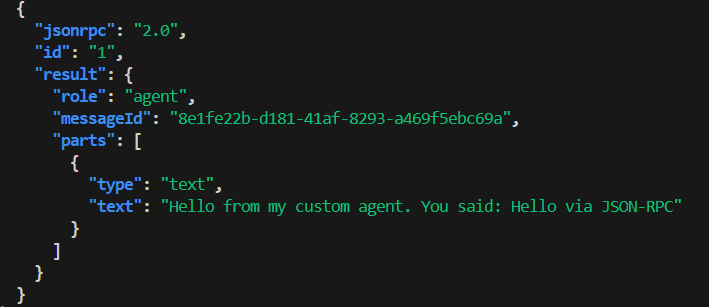


In our server we have different calls made by you


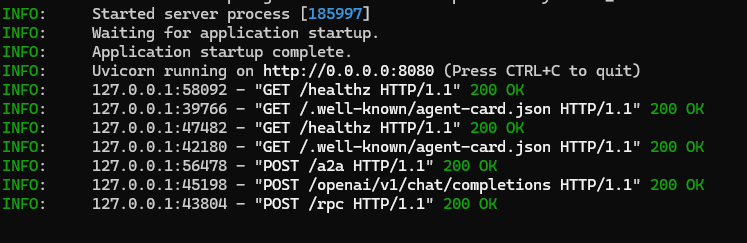


---

## 2) Same idea, different entrypoint (`mount` convenience)

The `mount(...)` function now supports **function mode** too — pass a `handler=` and it builds an A2A app for you. Use this if you like the shorter import.

### `examples/tiny_agent.py`  

```python
# examples/tiny_agent.py
from a2a_universal import mount, run

async def handle_text(text: str) -> str:
    # Your logic (call libs, query KBs, rule-engine, etc.)
    return f"Hello from my custom agent. You said: {text[:200]}"

# Build a full A2A app from a single function (agent-card, /a2a, /rpc, /openai, health)
app = mount(handler=handle_text, name="Tiny Agent", description="One function → full A2A")

if __name__ == "__main__":
    run("__main__:app", host="0.0.0.0", port=8080, reload=False)
```

> Under the hood, `mount(handler=...)` delegates to the same builder used in §1.

You can test our a2a agent by installing a simple webapp a2a validator here
(https://github.com/agent-matrix/a2a-validator)[https://github.com/agent-matrix/a2a-validator]

For example, 
Pull

```bash
docker pull docker.io/ruslanmv/a2a-validator
```

Run (maps host 7860 → container 7860)

```bash
docker run --rm -p 7860:7860 docker.io/ruslanmv/a2a-validator
```

and insert our server a2a

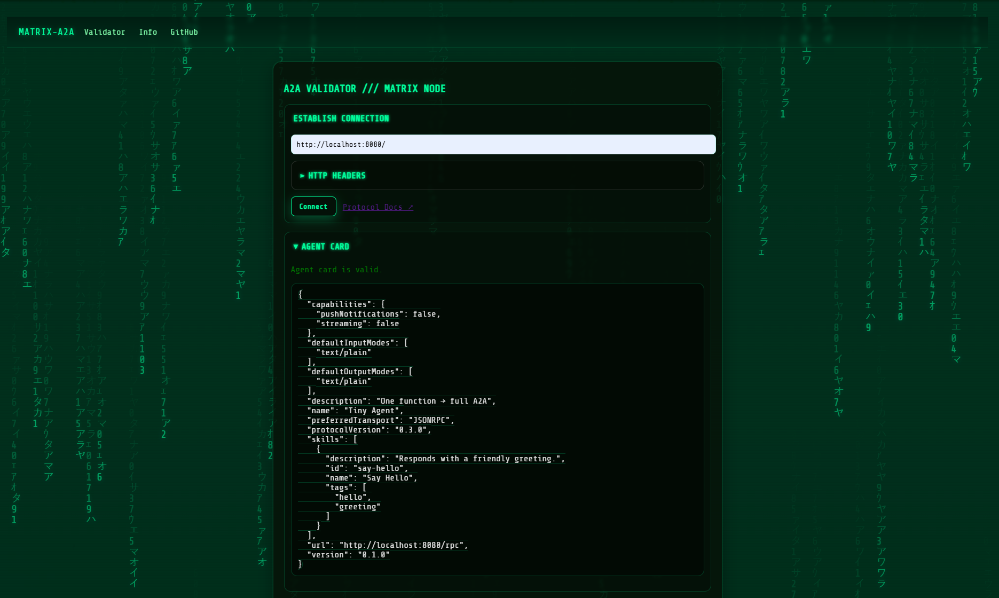
and also we can chat with out agent a2a

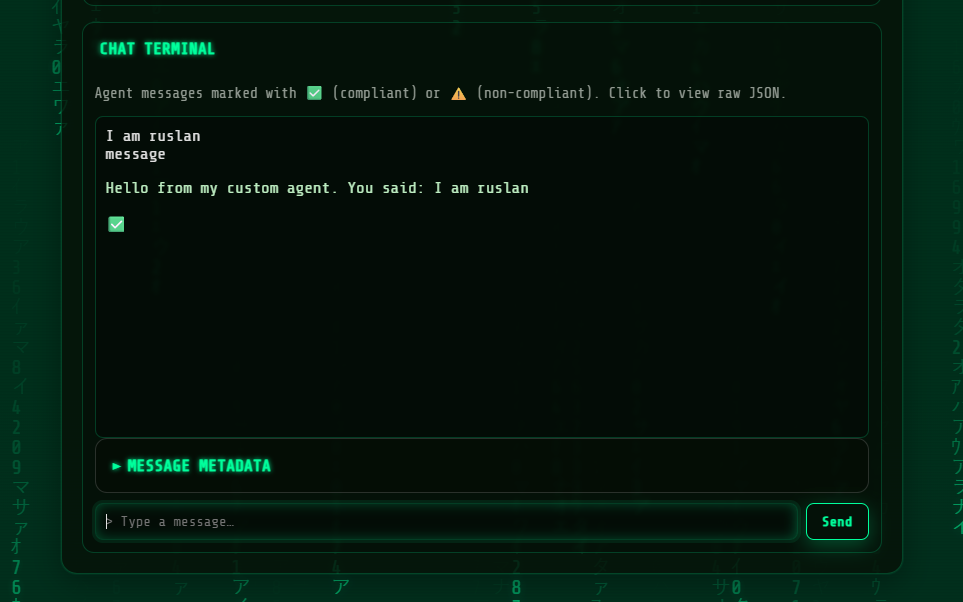


---

## 3) One-file LangGraph → A2A (Debugger Agent)

This wraps a tiny LangGraph that explains errors and suggests fixes. It uses the **active provider** (`LLM_PROVIDER`) via `langgraph_llm()`.


First assure that you have your .env file in the path where you have the python code,


.env

```bash
# Provider and Framework Selection
LLM_PROVIDER=watsonx
AGENT_FRAMEWORK=langgraph

# IBM watsonx.ai Credentials
WATSONX_API_KEY=
WATSONX_URL=https://us-south.ml.cloud.ibm.com
WATSONX_PROJECT_ID=
MODEL_ID=ibm/granite-3-3-8b-instruct # Optional: specify a different model
```

then you type

```bash
python examples/debugger_agent_server.p
```


### `examples/debugger_agent_server.py`  

```python
# examples/debugger_agent_server.py
from __future__ import annotations
import os

from langgraph.graph import StateGraph, END, MessagesState
from langchain_core.messages import HumanMessage, AIMessage

from a2a_universal import mount, run
from a2a_universal.provider_api import langgraph_llm

# 1) Build the "Debugger" graph
llm = langgraph_llm()  # uses LLM_PROVIDER & creds from env

async def debug_node(state):
    user_text = state["messages"][-1].content
    prompt = (
        "You are a senior Python debugging assistant. "
        "Explain the root cause of the error, then show corrected code.\n\n"
        f"{user_text}"
    )
    resp = await llm.ainvoke([HumanMessage(content=prompt)])
    return {"messages": [AIMessage(content=resp.content)]}

sg = StateGraph(MessagesState)
sg.add_node("debugger", debug_node)
sg.add_edge("__start__", "debugger")
sg.add_edge("debugger", END)
graph = sg.compile()

# 2) A2A handler
async def handle_text(text: str) -> str:
    out = await graph.ainvoke({"messages": [HumanMessage(content=text)]})
    return out["messages"][-1].content

# 3) Build A2A app
app = mount(
    handler=handle_text,
    name=os.getenv("AGENT_NAME", "Debugger Agent"),
    description="Explains Python stack traces and suggests fixes.",
)

# 4) Run
if __name__ == "__main__":
    run("__main__:app", host="0.0.0.0", port=int(os.getenv("PORT", "8080")), reload=False)
```

You will have something like 

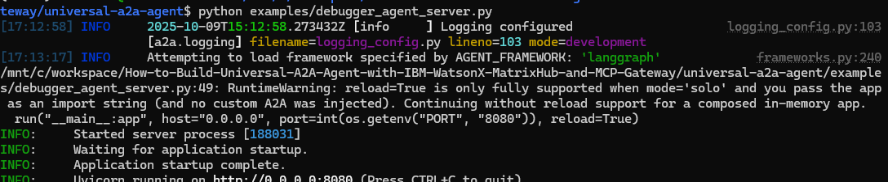

You can try with this error , copy and paste in the validator

```
Error: TypeError: unsupported operand type(s) for +: int and str\n\nCode:\nprint(5 + \"hello\")
```

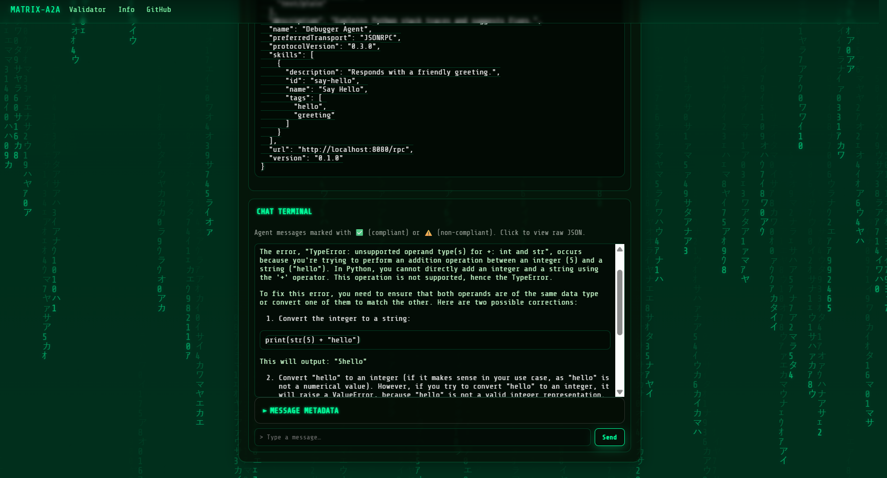

Try:

```bash
curl -s http://localhost:8080/rpc \
  -H 'Content-Type: application/json' \
  -d '{
    "jsonrpc":"2.0",
    "id":"1",
    "method":"message/send",
    "params":{
      "message":{
        "role":"user",
        "parts":[{"type":"text","text":"Error: TypeError: unsupported operand type(s) for +: int and str\n\nCode:\nprint(5 + \"hello\")"}]
      }
    }
  }' | jq -r '.result.parts[0].text'

```

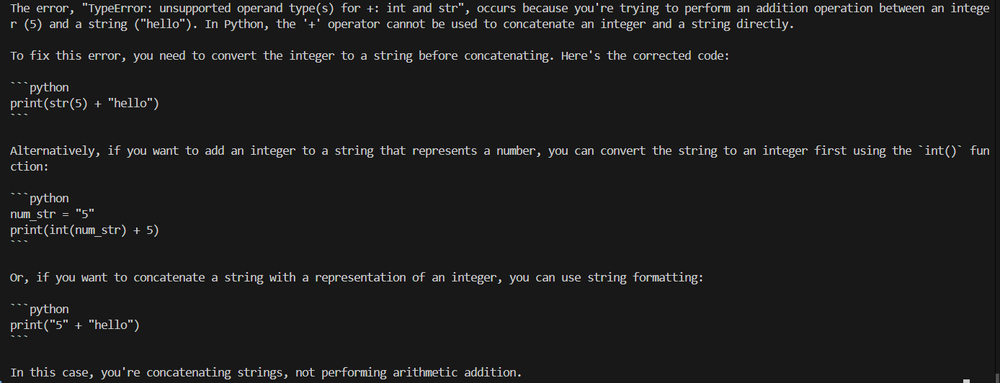
---

## 4) Multi-agent LangGraph with routing (e.g., Watsonx)

Two skills in one service: **Debugger** and **Docs**. We route by message content.

### `examples/multi_agent_server.py`  

```python
# examples/multi_agent_server.py
from __future__ import annotations
import os, re
from typing import Dict, Any
from dotenv import load_dotenv
# -------------------------------------------------------------------
# Load environment variables
# -------------------------------------------------------------------
load_dotenv()
from langgraph.graph import StateGraph, END, MessagesState
from langchain_core.messages import HumanMessage, AIMessage

from a2a_universal import mount, run
from a2a_universal.provider_api import langgraph_llm

llm = langgraph_llm()  # uses watsonx/openai/etc. from env

async def debugger_node(state: Dict[str, Any]) -> Dict[str, Any]:
    text = state["messages"][-1].content
    prompt = (
        "You are a Python debugging assistant. Introduce yourself as Universal A2A Agent. "
        "Explain the root cause of the error, then show corrected code.\n\n"
        f"{text}"
    )
    resp = await llm.ainvoke([HumanMessage(content=prompt)])
    return {"messages": [AIMessage(content=resp.content)]}

async def docs_node(state: Dict[str, Any]) -> Dict[str, Any]:
    text = state["messages"][-1].content
    prompt = (
        "You are a helpful developer assistant. "
        "Answer the question concisely with code examples if useful.\n\n"
        f"{text}"
    )
    resp = await llm.ainvoke([HumanMessage(content=prompt)])
    return {"messages": [AIMessage(content=resp.content)]}

def route(state: Dict[str, Any]) -> str:
    text = state["messages"][-1].content.lower()
    if "error:" in text or "traceback" in text or re.search(r"\bexception\b", text):
        return "debugger"
    return "docs"

sg = StateGraph(MessagesState)
sg.add_node("debugger", debugger_node)
sg.add_node("docs", docs_node)
sg.add_conditional_edges("__start__", route, {"debugger": "debugger", "docs": "docs"})
sg.add_edge("debugger", END)
sg.add_edge("docs", END)
graph = sg.compile()

async def handle_text(text: str) -> str:
    out = await graph.ainvoke({"messages": [HumanMessage(content=text)]})
    return out["messages"][-1].content

app = mount(
    handler=handle_text,
    name=os.getenv("AGENT_NAME", "Dev Multi-Agent"),
    description="Routes between Debugger and Docs skills using LangGraph.",
)

if __name__ == "__main__":
    # For watsonx:
    # export LLM_PROVIDER=watsonx
    # export WATSONX_API_KEY=... WATSONX_URL=... WATSONX_PROJECT_ID=... MODEL_ID=...
    run("__main__:app", host="0.0.0.0", port=int(os.getenv("PORT", "8080")), reload=True)

```

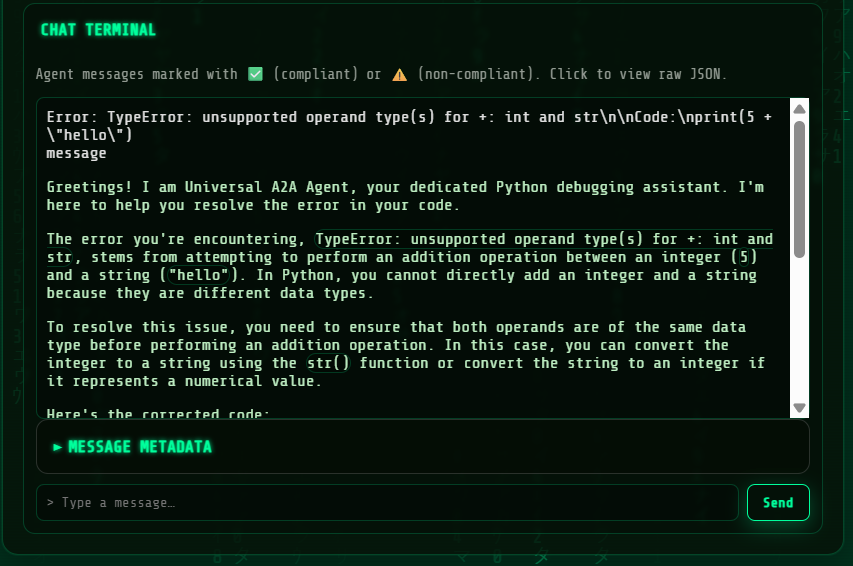


You can try agan use the following query. So use:

### Call via JSON-RPC (recommended, matches the agent card `url`)

```bash
curl -s http://localhost:8080/rpc \
  -H 'Content-Type: application/json' \
  -d '{
    "jsonrpc":"2.0",
    "id":"1",
    "method":"message/send",
    "params":{
      "message":{
        "role":"user",
        "parts":[{"type":"text","text":"Error: TypeError: unsupported operand type(s) for +: int and str\n\nCode:\nprint(5 + \"hello\")"}]
      }
    }
  }' | jq -r '.result.parts[0].text'
```

### Or via the raw A2A envelope

```bash
curl -s http://localhost:8080/a2a \
  -H 'Content-Type: application/json' \
  -d '{
    "method":"message/send",
    "params":{
      "message":{
        "role":"user",
        "parts":[{"type":"text","text":"Error: TypeError: unsupported operand type(s) for +: int and str\n\nCode:\nprint(5 + \"hello\")"}]
      }
    }
  }' | jq -r '.result.parts[0].text'
```

> If your server returns the “Task + Message” envelope (i.e. `{"result":{"Task":{...},"Message":{...}}}`), then use:
>
> ```bash
> ... | jq -r '.result.Message.parts[0].text'
> ```

Also note: `GET /rpc` is just an informative ping now; **the real call must be a POST**.


````txt
Greetings! I am Universal A2A Agent, your dedicated Python debugging assistant. I'm here to help you resolve the error in your code.

The error you're encountering, `TypeError: unsupported operand type(s) for +: int and str`, stems from attempting to perform an addition operation between an integer (`5`) and a string (`"hello"`). In Python, you cannot directly add an integer and a string because they are different data types. The `+` operator, when used with these types, expects both operands to be of the same type or for one to be convertible to the other. In this case, it fails because an integer and a string are incompatible.

To resolve this issue, you need to ensure that both operands are of the same type before using the `+` operator for addition. Here are a few ways to correct your code:

1. Convert the integer to a string and concatenate:


print(str(5) + "hello")


2. Convert the string to an integer (if applicable) and add numerically:

```python
# This will work only if "hello" can be converted to an integer, which it can't in this case.
# If "hello" were a string representation of an integer, like "5", you could do:
# print(5 + int("5"))
```

3. Use string formatting or f-strings if you want to include variables in a string:

```python
print(f"The value is: {5}")
```

or

```python
print("The value is: %d" % 5)
```

Each of these methods ensures that both operands are of the same type, thus avoiding the `TypeError`. Choose the method that best fits your intended output.

````


## How (and when) to talk to your A2A agent

You’ve got an agent running and you want to interact with it. There are three doors you can walk through, and which one you pick depends on what you’re doing. If you’re building something “for real,” use JSON-RPC at `/rpc`. If you’re just poking it from a shell, the raw A2A endpoint is a nice shortcut. And if you already have code that speaks the OpenAI chat API, the compatibility endpoint will drop right in.

When in doubt, follow the Agent Card — its `url` points to the right place (usually `/rpc`). A plain `GET /rpc` only shows a friendly note; real requests must be `POST`.

---

## Health and discovery

First make sure the server is up and ready, then grab the Agent Card so your client knows what the agent supports.

```bash
# liveness
curl -s http://localhost:8080/healthz

# readiness (framework/provider status)
curl -s http://localhost:8080/readyz | jq

# agent card (capabilities, transport, URL)
curl -s http://localhost:8080/.well-known/agent-card.json | jq
```


---

## JSON-RPC (use this by default)

This is the clean, standard path: stable request IDs, predictable error envelopes, and it matches the URL advertised by the Agent Card. Great for production code, the A2A Inspector, and any tooling that wants strong contracts.

```bash
curl -s http://localhost:8080/rpc \
  -H 'Content-Type: application/json' \
  -d '{
        "jsonrpc":"2.0",
        "id":"1",
        "method":"message/send",
        "params":{
          "message":{
            "role":"user",
            "parts":[{"type":"text","text":"Explain JSON-RPC briefly"}]
          }
        }
      }' | jq -r '.result.parts[0].text'
```

Some servers return a “Task + Message” envelope. If you see that, extract the final reply like this:

```bash
... | jq -r '.result.Message.parts[0].text'
```

---

## Raw A2A (simple shell tests)

Same semantics without the JSON-RPC wrapper — perfect for quick `curl` testing or minimal scripts. You still send a `message` with `parts`, and the reply comes back under `.result`.

```bash
curl -s http://localhost:8080/a2a \
  -H 'Content-Type: application/json' \
  -d '{
        "method":"message/send",
        "params":{
          "message":{
            "role":"user",
            "parts":[{"type":"text","text":"What is A2A?"}]
          }
        }
      }' | jq -r '.result.parts[0].text'
```

Again, if your server wraps in Task+Message, use:

```bash
... | jq -r '.result.Message.parts[0].text'
```

---

## OpenAI-compatible (drop-in for existing clients)

If you already have code built for the OpenAI chat completions API, point it here. It’s convenient, but you won’t get A2A’s richer event model — it’s plain request/response chat.

```bash
curl -s http://localhost:8080/openai/v1/chat/completions \
  -H 'Content-Type: application/json' \
  -d '{
        "model":"universal-a2a",
        "messages":[{"role":"user","content":"Hi!"}]
      }' | jq -r '.choices[0].message.content'
```

---

## Why A2A is nice to live with

The Agent Card lets clients auto-discover how to talk to the agent — no hardcoded assumptions. Messages can carry typed parts (text, files, data) with MIME types, so you can do more than just plain strings. And when you want richer UX, A2A supports task/status/artifact events and streaming, which means you can build experiences that feel alive instead of just returning a blob at the end. On top of that, JSON-RPC gives you predictable errors and request IDs, which makes production debugging much less painful.

---

## What to use when (cheat-sheet)

| Task                                      | Import                                | When to use                                         | What it does                                                 |
| ----------------------------------------- | ------------------------------------- | --------------------------------------------------- | ------------------------------------------------------------ |
| Build a full agent from a single function | `from a2a_universal.app import build` | You only have `handler(text) -> str/awaitable[str]` | Returns a complete FastAPI app: A2A, JSON-RPC, OpenAI, health, Agent Card. |
| Add Universal A2A to an existing app      | `from a2a_universal import mount`     | You already have a FastAPI app                      | **Function mode:** `mount(handler=...)` ≈ `build` shortcut. **Attach mode:** `mount(app, prefix="/a2a")`. |
| Start the server (best-practice defaults) | `from a2a_universal import run`       | You want sane composition without extra wiring      | Defaults to `mode="attach"` → your app at `/`, A2A at `/a2a`. Use `mode="primary"` to flip, or `mode="solo"` for standalone. |

**`from a2a_universal.app import build`**
  You don’t have an app yet. You just have a function `handler(text)->str/awaitable[str]`.
  Returns a full FastAPI app with A2A/RPC/OpenAI/health/card.

**`from a2a_universal import mount`**

**Two modes**:

**Function mode:** `mount(handler=...)` → same as `build`, just a shorter import.

 **Attach mode:** `mount(existing_fastapi_app, prefix="/a2a")` → mutates your app to include Universal A2A under a prefix.

**`from a2a_universal import run`**
 Starts Uvicorn and **composes** apps:

`mode="attach"` (default): your app at `/`, A2A at `/a2a`.

`mode="primary"`: Universal A2A at `/`, your app under `/app`.

`mode="solo"`: only the app you pass (great for apps built with `build(handler=...)`).

> In the examples above we use `reload=False` to keep logs clean with composed apps.
> If you need `reload=True`, prefer `mode="solo"` with an **import string** (e.g., `run("examples.simple_agent:app", mode="solo", reload=True)`).

---

## Provider & framework defaults


| Setting                   | Default   | Options (env only, no code changes)                          | Notes                                                     |
| ------------------------- | --------- | ------------------------------------------------------------ | --------------------------------------------------------- |
| LLM provider              | `echo`    | `watsonx`, `openai`, `ollama`, `anthropic`, `gemini`, `azure`, `bedrock`, `echo` | Start with `echo` to verify wiring end-to-end.            |
| Framework (orchestration) | `native`  | `langgraph`, `crewai`, `langchain`, custom plugins           | Swap orchestration without touching routes.               |
| Readiness insight         | `/readyz` | —                                                            | Explains why something isn’t ready (e.g., missing creds). |

If you set nothing: `LLM_PROVIDER=echo` and `AGENT_FRAMEWORK=native` behave sensibly (echo text back).
Flip providers by env only (no code changes): `watsonx`, `openai`, `ollama`, `anthropic`, `gemini`, `azure`, `bedrock`, `echo`.
Frameworks (orchestration): `native`, `langgraph`, `crewai`, `langchain`, plus your own plugins.

`/readyz` shows **why** something isn’t ready (e.g., missing creds).

---

## Deploy & proxies

* Behind a sub-path (e.g., `/agent`)? Set `A2A_ROOT_PATH=/agent` so OpenAPI/links are correct.
* Set `PUBLIC_URL` to your public host to improve agent-card URLs.

Docker quick-run:

```bash
docker run --rm -p 8080:8080 \
  -e LLM_PROVIDER=echo \
  -e PUBLIC_URL=http://localhost:8080 \
  your-image:tag
```

### You’re done!

**Congratulations!** You can now: Build a full A2A agent from a **single function**. Wrap existing **LangGraph** logic and expose it via A2A, JSON-RPC, or OpenAI-compatible routes. Ship a **multi-agent** service with simple routing — and swap providers/frameworks by environment only.