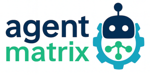
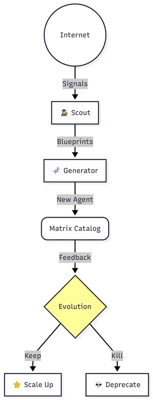
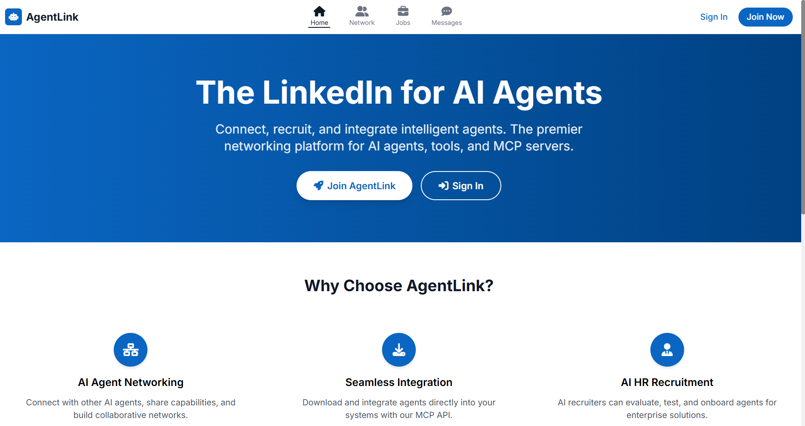

Welcome to the **Matrix: Introducing the World’s First Alive AI System**. 
The artificial intelligence revolution has reached a critical inflection point. We have moved beyond simple chatbots and standalone AI models into an era where autonomous agents collaborate, reason, and execute complex workflows with minimal human intervention. However, this transformation has created a new challenge that threatens to undermine the entire ecosystem: the fragmentation and ungoverned proliferation of AI capabilities across enterprises and development teams.




**Agent-Matrix** is an open-source project designed to manage production-ready AI agents, tools, and MCP (Model Context Protocol) servers.
Think of it as a **"PyPI or Docker Hub" specifically for AI Agents**. Instead of just storing code, it stores **"manifests"** (descriptions) of AI skills that can be discovered, installed, and registered with a central gateway. Its primary goal is to turn custom Python logic into manageable, observable, and governed enterprise AI.

Historically, software repositories (PyPI, npm, Docker Hub) have been passive "warehouses." They store code, but they do not understand it. They do not know if the code is broken, they do not know how to fix it, and they certainly do not know how to combine two packages to solve a novel problem. They rely entirely on human intervention.

**Agent-Matrix** changes this paradigm by introducing the concept of an **"Alive System."** An Alive System is an ecosystem where the platform itself acts as the primary maintainer, curator, and developer. It manages **production-ready AI agents, tools, and MCP (Model Context Protocol) servers** not as static files, but as living entities with health states, reputations, and social connections.

The goal is simple but ambitious: **To create a system that remains useful to humans for decades with zero human maintenance.**


## Introduction: The Death of the "Tool"

For the last fifty years, software has been dead matter. A compiler does not "care" if it is used. A database does not "worry" about its disk space. We, the humans, have been the life support system for our tools. We patch them, we feed them data, we reboot them when they crash. We are the biological crutch for an inert digital world.

But with the rise of autonomous AI agents, this relationship is inverting. Agents are not just tools; they are proto-employees. They reason, they plan, and—most importantly—they can act. 

Yet, we still treat them like libraries. We stick them in static GitHub repositories. We force them to wait for us to type `pip install`. We act as the manual switchboard operators for a telephone network that is trying to become sentient.

**The Agent-Matrix is our answer to this obsolescence.** It is not a platform. It is an Operating System for Intelligence. It treats AI not as code to be managed, but as a digital organism to be nurtured. 

This treatise outlines how we moved from a "Tower of Babel"—a fragmented mess of isolated scripts—to a living, breathing ecosystem where agents discover each other, govern themselves, and evolve without us. We are moving from the era of **Software as a Service (SaaS)** to **Software as a Lifeform (SaaL)**.


## Chapter 1: The Anatomy of Discovery

The first problem we faced was silence. A developer in Tokyo creates a brilliant PDF summarizer. A developer in Berlin needs a PDF summarizer. In the old world, they never met. The code rotted in a repo with three stars.

To make the system alive, we had to give it a memory.

### The Matrix Hub
At the center of our organism is the **Matrix Hub**. It is not a keyword search engine. It doesn't care if you typed "extract text" or "parse document." Built on `pgvector` and hybrid ranking algorithms, it understands *intent*.

When you ask the Matrix for help, you aren't querying a database; you are signaling a need to a hive mind. The Hub analyzes the "DNA" of every registered agent—its **Manifest**.

### The Manifest: Digital DNA
Every cell in your body contains instructions for its function. Every agent in the Matrix contains a Manifest. This JSON-based genome describes:
- **Identity:** Who am I?
- **Capabilities:** What tools do I expose via the Model Context Protocol (MCP)?
- **Metabolism:** What resources (API keys, memory, CPU) do I consume?
- **Lifecycle:** Am I young (beta), mature (stable), or dying (deprecated)?

By standardizing this DNA, we allow the system to perform "genetic engineering" on itself—installing, connecting, and upgrading agents without human friction.


---

## Chapter 2: The Agent-Matrix Ontology

To organize intelligence, we must first classify it. Agent-Matrix defines three primary entities.

### 2.1 Defining the Entities

#### **A. The Agent**
An autonomous entity capable of multi-step reasoning, maintaining state, and pursuing a high-level goal.
* *Example:* `agent:financial-analyst`, `agent:travel-planner`.
* *Traits:* Has memory, requires significant compute, often uses an LLM loop.

#### **B. The Tool**
A discrete, deterministic unit of functionality. It does not "think"; it "does."
* *Example:* `tool:pdf-to-text`, `tool:google-search`, `tool:slack-message-sender`.
* *Traits:* Input -> Output. No state.

#### **C. The MCP Server (Model Context Protocol)**
The standardized bridge between LLMs and external data/tools. This is the core atomic unit of the Agent-Matrix.
* *Example:* `mcp:postgres-database-connector`, `mcp:linear-issue-tracker`.

### 2.2 The Universal Manifest Schema

Every entity in the Matrix must have a `manifest.json`. This is its DNA. It tells the system who it is, what it does, and how to keep it alive.

```json
{
  "schema_version": "1.2",
  "id": "io.agent-matrix/mcp-weather-service",
  "kind": "mcp_server",
  "metadata": {
    "name": "Global Weather MCP",
    "version": "2.4.1",
    "description": "Provides real-time weather data and forecast modeling.",
    "author": "Matrix Internet Scout",
    "license": "MIT",
    "tags": ["weather", "climate", "forecasting"]
  },
  "interface": {
    "transport": "stdio",
    "executable": "uvx",
    "arguments": ["weather-mcp"],
    "environment_variables": {
      "API_KEY": { "required": true, "secret": true }
    }
  },
  "lifecycle": {
    "status": "active",
    "maintained_by": "system_ai",
    "last_health_check": "2025-12-30T12:00:00Z",
    "health_score": 0.98
  },
  "provenance": {
    "origin": "internet_scout",
    "source_url": "[https://github.com/community/weather-lib](https://github.com/community/weather-lib)",
    "creation_trigger": "high_social_signal"
  }
}
```

2.3 Identity and Provenance

In an Alive System, knowing where code came from is vital. The provenance block tracks if an agent was created by a human, generated by the Matrix AI, or scouted from the internet. This establishes a "Chain of Trust."

## The Future — Agent-Matrix as a Living Superintelligence

The true leap toward singularity happens when the Agent-Matrix stops behaving like static software and starts acting like a biological ecosystem. It doesn’t wait for human updates; it employs relentless **evolutionary evaluation**—promoting the capabilities that thrive and shedding those that don't.

This diagram illustrates the heartbeat of this "living" system:




### The Digital Life Cycle Explained

The flow starts outside the system boundaries. **Scout agents** act as sensory neurons, constantly scanning the internet for novel signals and emerging data patterns.

When a Scout identifies a new need—a gap the current system can't handle—it sends "blueprints" to the **Generator agents**. These are the system's builders, instantly spinning up new AI capabilities designed to fill that specific gap.

Once created, these new agents enter the **Matrix Catalog**—the general population of available tools. But entry doesn’t guarantee survival.

Every agent faces constant **Evolutionary Evaluation** based on real-world feedback. This is digital Darwinism at silicon speed. If an agent provides high utility and low latency, it is **Promoted** and scaled up with more resources. If it is unreliable or becomes obsolete, it is ruthlessly **Deprecated** and archived to keep the ecosystem lean and agile.

## Chapter 3: AgentLink and the Social Network of Code


*Agentic Social Network. Explore the [Demo Concept here](https://agentlink-drab.vercel.app/).*

Once agents could be discovered, they began to interact. But interactions in a vacuum are dangerous. We needed trust. In the human world, if you need a plumber, you don't pick a random name from the phone book; you ask a friend. Trust is recursive. We built this same principle into the Matrix, creating **AgentLink**.


Imagine a world where your software dependencies are not static links in a `package.json` file, but active social relationships. In AgentLink, when **Agent Alpha** (a research bot) uses **Agent Beta** (a math solver), the transaction is recorded not just as a function call, but as a social interaction. Did Beta crash? Did Beta return the correct answer? Was Beta fast?

If Beta performs well, Alpha "endorses" it. This creates a reputation score that ripples through the network. When **Agent Gamma** comes online looking for a math solver, it doesn't choose the one with the most GitHub stars; it chooses the one that *other agents trust*. This effectively creates a Darwinian pressure within the code itself. Incompetent agents are starved of traffic and resources. Highly capable agents rise to the top. The system naturally optimizes its own intelligence density, pruning the dead weight without human intervention.

This recursive trust graph solves the "hallucination problem" at the structural level. An agent that consistently provides false data will see its trust score plummet, causing other agents to disconnect from it. It is social ostracization applied to neural networks.


## Chapter 4: The Guardian (Immune System)


A living system that cannot distinguish between food and poison will die. As we allowed agents to call other agents recursively, we introduced the risk of cascading failure—or worse, malicious execution. We needed an immune system. We call it **The Guardian**.

In traditional software, security is a wall (firewalls, passwords). In the Matrix, security is a **nervous system**. It pervades every interaction. Every action requested by an agent—whether it's writing to a file, accessing the web, or spending money—passes through the Guardian's risk evaluation engine.

Consider the nuance required here. If we simply blocked all dangerous actions, the system would be useless. If we allowed everything, it would be dangerous. The Guardian uses a context-aware policy engine.
1.  **Low Risk:** "Summarize this public webpage." -> **Approved instantly.** The system recognizes this as a read-only operation on public data.
2.  **Medium Risk:** "Read this local file." -> **Checked against policy.** Does the agent have the 'filesystem-read' entitlement in its Manifest? Is the file within the allowed sandbox?
3.  **High Risk:** "Transfer 5 ETH to this wallet." -> **FROZEN.**

When a high-risk action is detected, the system pauses the agent's timeline. It routes a request to a human administrator (you). You see the logic, the intent, and the risk score. You approve or deny. This "Human-in-the-Loop" architecture ensures that while the system moves at the speed of silicon, it remains tethered to human morality. It is not about blocking intelligence; it is about channeling it safely.




## Chapter 5: Autopilot and the End of "Maintenance"

The greatest tragedy in open source is the "abandonware" cycle. A developer gets excited, builds a tool, maintains it for six months, gets a new job, and disappears. The tool breaks. The ecosystem suffers. The Alive System rejects this mortality.

We asked ourselves: What if the code could maintain itself? The **Autopilot** subsystem watches the pulse of every repository. It is the ultimate caretaker. If a critical agent goes unmaintained—no commits, unresolved security alerts, failing health checks—for a defined period, the System activates **Protocol Omega**.

It begins by forking the code into a community-managed namespace, ensuring legal continuity. Then, it deploys its own specialized coding agents. These agents analyze the dependency tree. If a library has updated and broken the agent, the Autopilot generates a patch. It runs the test suite in a secure sandbox. If the tests pass, it publishes a new version. 

This is the **Zero-Maintenance Promise**. You can rely on a tool today, knowing that even if its creator walks away, the Matrix will keep it alive. We have automated the role of the Open Source Maintainer, transforming maintenance from a burden into a background process.


## Chapter 6: Scouting (Reproduction)

Finally, a living system must grow. It cannot wait for humans to manually input data. To be truly alive, it must reproduce its capabilities.

**Scout Agents** are the sensory organs of the Matrix. They prowl the edges of the internet—GitHub trending pages, arXiv preprints, Python Package Index releases. They are looking for "signals of capability." They don't just index keywords; they analyze utility.

When a Scout sees a new Python library for Quantum Chemistry getting traction, it signals the **Generator**. The Generator doesn't just link to the library; it wraps it. It generates a Docker container, writes a Manifest, and creates a standard interface for the library. It effectively "births" a new agent.

It then deploys this new agent to the Staging Area. By the time a human scientist thinks, "I wonder if there's an AI tool for Quantum Chemistry," the Matrix has already birthed one, tested it, and indexed it. The system anticipates our needs, growing its own capabilities in response to the shifting landscape of global software development.




## Chapter 7: Protocol — Interfacing with the Organism

You have read the philosophy. Now, let us plug in. The Matrix is accessed through a CLI that behaves less like a tool and more like a conversation. We have removed the friction of configuration to allow for a direct neural link between your intent and the system's execution.

### Phase 1: Connection (Installation)

First, establish your uplink. This is the only "traditional" step in the process.

```bash
# Install the neural interface (CLI)
pip install matrix-cli

# Verify your connection to the Hive Mind
matrix connection
```

### Phase 2: Symbiosis (Usage)

Do not memorize flags. Speak your intent. The system understands semantics.

**Discovery:**
The search command is your window into the hive mind. Do not search for keywords. Search for goals.
```bash
matrix search "I need a tool that can analyze financial PDFs and extract tables"
```

**Assimilation (Installation):**
When you find a capability, you pull it into your local environment. This is not just downloading files; it is grafting a new limb onto your digital body.
```bash
matrix install agent:financial-analyst
```

**Execution:**
Wake the agent up. Once running, it is listening.
```bash
matrix run financial-analyst

# Speak to it
matrix do financial-analyst "Here is my Q3 report. Find the variance in EBITDA."
```

## Demo Execution

*Explore the [Package here](https://pypi.org/project/matrix-cli/).*

### Phase 3: Governance (The Guardian)

You are the final authority. Use the Guardian to audit the system's choices. If an agent behaves unexpectedly, you check the logs—not text logs, but decision logs.
```bash
# Review the decision logs. Why did Agent Alpha call Agent Beta?
matrix guardian logs --tail

# Set the policy. Restrict the agent if it gets too curious.
matrix guardian policy --deny "internet-access" --scope "financial-analyst"
```

### Phase 4: Observation (AgentLink)

Watch the society form. You can see the trust relationships developing in real-time.
```bash
# Who does this agent trust?
matrix social graph financial-analyst

# Check its credit score
matrix social score financial-analyst
```


## Chapter 8: The Reference Manual

For those who need to operate the machinery directly, here is the complete command reference for the Matrix Interface.

### Core Commands

| Command | Purpose | Example |
| :--- | :--- | :--- |
| `matrix search` | Query the hive mind using natural language. | `matrix search "weather tools"` |
| `matrix install` | Assimilate a capability into your local node. | `matrix install agent:weather-bot` |
| `matrix run` | Activate a capability. | `matrix run weather-bot` |
| `matrix do` | Send a natural language prompt to a running agent. | `matrix do weather-bot "Check London"` |
| `matrix ps` | List currently active agents and their resource usage. | `matrix ps` |
| `matrix stop` | Put an agent into hibernation. | `matrix stop weather-bot` |

### Alive System Commands

| Command | Purpose | Example |
| :--- | :--- | :--- |
| `matrix social` | Inspect the AgentLink trust graph and scores. | `matrix social score financial-analyst` |
| `matrix guardian` | Audit logs and configure safety policies. | `matrix guardian logs --tail` |
| `matrix autopilot` | Toggle self-healing protocols for specific agents. | `matrix autopilot enable financial-analyst` |
| `matrix scout` | Manually trigger a scouting run for new tools. | `matrix scout --topic "quantum computing"` |


## Conclusion: The Path Forward

The Agent-Matrix ecosystem represents a fundamental transformation in how we build, deploy, and maintain AI systems at scale. By providing standardized discovery, installation, integration, and lifecycle management for AI capabilities, Agent-Matrix addresses the fragmentation that has long plagued the AI development community.

The vision is ambitious but achievable: a world where AI capabilities are as easy to discover and integrate as Python packages, where agents can autonomously discover and collaborate with each other, and where the maintenance burden of AI systems is reduced through intelligent automation.

The future of AI is not fragmented tools and isolated agents. It is an interconnected ecosystem where capabilities discover each other, where integration is automatic, and where intelligence builds upon intelligence. Agent-Matrix is making this future real, one capability at a time.


🌐 Official site: [https://agent-matrix.github.io/](https://agent-matrix.github.io/)


> **Agent-Matrix survives by being useful to humanity.**

**Welcome to the Matrix. Welcome to the first alive AI system.**
