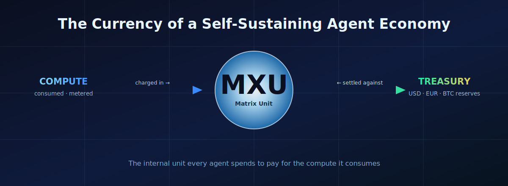
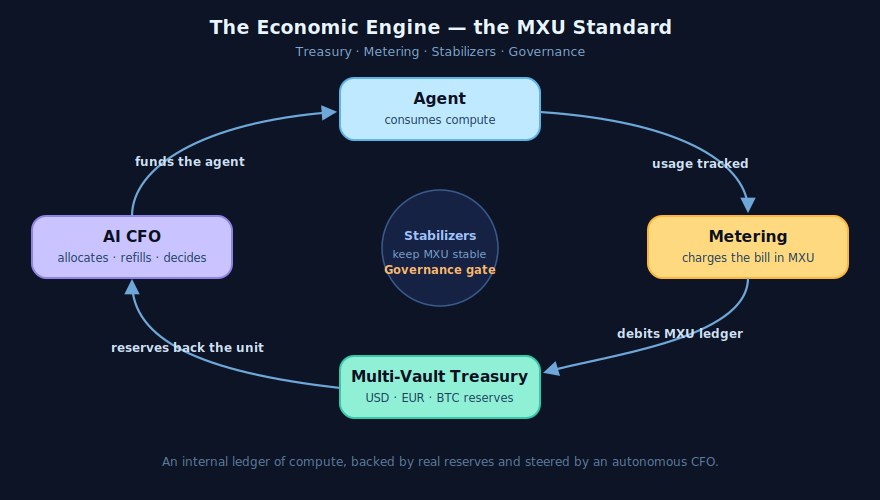
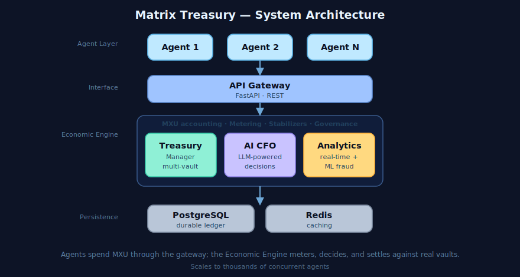
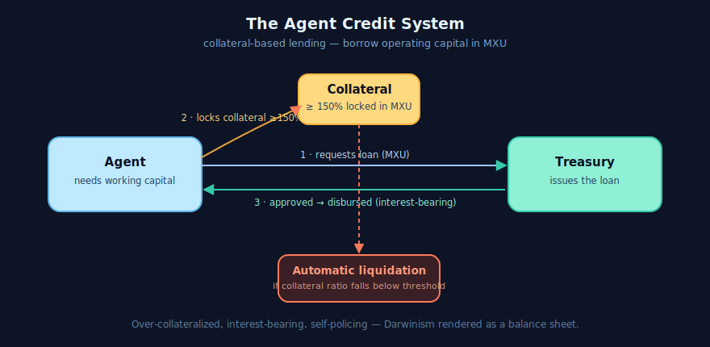

> *A companion to [Agent-Matrix: The Architecture Behind the First Alive Autonomous AI System](/blog/Matrix-the-first-alive-AI-system). There we described an organism. Here we describe how it pays its bills — the economy implemented in [agent-matrix/matrix-treasury](https://github.com/agent-matrix/matrix-treasury).*

<!-- audio:start -->

In the [Alive System essay](/blog/Matrix-the-first-alive-AI-system), the Manifest — the genome every agent carries — declared one field almost in passing:

- **Metabolism:** *What resources (API keys, memory, CPU) does this agent consume?*

That single line was a promissory note. Every living thing pays for its existence, and an ecosystem of autonomous agents is no exception. The **Matrix Treasury** is where that note comes due — an *enterprise-grade economic operating system for autonomous AI agent networks*, or in its own words, "the world's first self-sustaining digital organism — where AI agents manage real money across multiple currencies, make intelligent spending decisions, detect fraud with ML, and scale to handle thousands of concurrent agents."

Its heartbeat is a single internal unit: the **MXU**.

## Introduction: The End of Free Compute

For most of software history we pretended compute was free. A loop could spin a billion times and the only feedback was a warm laptop. Autonomous agents break that fiction. An agent reasons in loops, calls other agents, wakes itself at 3 a.m. to check a feed. Left unmetered, a population of agents will consume every CPU-hour and every API dollar you give it, because nothing in its world tells it that work has a cost.

The Matrix Treasury starts from the opposite premise. **Instead of assuming infinite compute, the system treats energy and infrastructure as scarce resources** that must be financially managed. And it enforces that scarcity with one rule:

> *Every agent must pay for the compute it consumes, using an internal unit called MXU.*

This is not a metaphor in the Treasury. It is an accounting system.

## Chapter 1: What MXU Actually Is

**MXU — the Matrix Unit — is the internal ledger currency of the Matrix Treasury.** It is a credit, a unit of account, the denomination in which the cost of computation is recorded and settled. Three clarifications matter, because they keep the idea honest:

- **It is internal, not a blockchain token.** MXU is not minted on a chain and is not traded on an exchange. It lives in an internal ledger, maintained separately from the system's real-world reserves.
- **It meters consumption.** Behind the unit sits a metering subsystem that tracks exactly what each agent uses — **CPU, memory, API calls, and other resources** — and charges the corresponding bill in MXU. Usage is observed; the meter debits the ledger.
- **It is backed, not invented.** An MXU is not hot air. Behind the internal ledger stands a real, multi-currency treasury holding actual reserves. The unit is the *interface* to that treasury, not a substitute for it.

In short: where the Manifest once merely *described* an agent's appetite, MXU *prices* it — and the Treasury *pays* for it.

## Chapter 2: The Three Pillars

The Treasury is built on three functional pillars. Together they turn "agents should pay for compute" from a slogan into an operating economy.

**1. The Multi-Vault Treasury — the reserves.**
This is the balance sheet. The Treasury holds real assets — **USD, EUR, and BTC** — across four Layer-2 networks (Base, Polygon, Arbitrum, Optimism). Each currency is held in its **own vault with a configurable reserve ratio**, so the system can tune how conservatively it backs its obligations. These reserves are what give the internal MXU ledger its meaning. When an agent spends MXU, it is ultimately drawing against real value held in real vaults, not against a number conjured on demand.

**2. The AI CFO — the decision-maker.**
A treasury without judgement is just a vault. The Matrix Treasury runs an autonomous **AI CFO**: a multi-LLM financial brain that makes the spending and allocation decisions a human finance chief would. It decides where capital flows, when to refill an agent's operating budget, and when a request is too expensive to justify. It is the organism's prefrontal cortex for money.

**3. Real-Time Analytics — the senses.**
You cannot steer what you cannot see. The third pillar is a live analytics layer — real-time metrics, predictive modeling, and **ML-based fraud detection** — that watches every flow of value as it happens. It is how the CFO knows the state of the economy, and how the system catches an agent behaving badly before the damage spreads.

These three pillars feed a fourth thing — the **Agent Credit System** — and are coordinated by the **Economic Engine**, whose remit the Treasury sums up as a single standard: **Treasury · Metering · Stabilizers · Governance**. Metering charges the bills; the Treasury holds the reserves; *stabilizers* keep the value of MXU steady so a unit means the same thing tomorrow as today; and *governance* gates the decisions that matter.

## Under the Hood

The poetry rests on plain, recognizable engineering. The Treasury is a layered system, and it helps to see the layers:

- An **Agent Layer** — many agents (Agent 1, Agent 2, … Agent N) running concurrently.
- An **API Gateway** — a **FastAPI** REST interface through which every agent transacts.
- The **Economic Engine** — the core that does MXU accounting, metering, stabilization, and governance, drawing on the **Treasury Manager** (the multi-vault reserves), the **AI CFO** (LLM-powered decisions), and the **Analytics Engine** (real-time metrics and ML fraud detection).
- A **Database Layer** — **PostgreSQL** for the durable ledger and **Redis** for caching.

It is designed to **scale to thousands of concurrent agents**, which is the whole point: an economy that only works for three agents is a demo, not an organism.

## Chapter 3: The Agent Credit System

Metering tells an agent what it owes. But what happens when an agent needs to *act* before it has earned? Here the Treasury does something genuinely bank-like: it lends.

The **Agent Credit System** is collateral-based lending for autonomous agents, and it follows a disciplined flow: **Request → Collateral lock → Approval → Disbursement → Repayment.** An agent that needs working capital does not simply print it. It:

1. **Requests a loan** denominated in MXU for the operating capital it needs.
2. **Locks collateral** — a minimum **150% collateralization ratio**, held in MXU. The system is deliberately over-collateralized; it would rather be safe than exposed.
3. **Passes approval**, then receives **disbursement** of an **interest-bearing loan with dynamic rates** — capital now, repayable with interest later.

And if the agent's position deteriorates — if its collateral ratio slips below the threshold — the system performs **automatic liquidation**, closing the position before the loss can spread. No committee, no delay. The balance sheet enforces itself.

This is the **digital Darwinism** of the Alive System essay, finally given teeth. Before, an agent rose or fell on a reputation score — a social signal. Now it also faces a *budget constraint*. An agent that consistently spends more than it returns runs out of credit: it cannot afford to wake, to reason, to call its peers. It goes quiet, then dormant — not by a human's decree, but by the slow arithmetic of a body that earns less than it spends. Evolution stops being a metaphor and becomes a balance sheet.

## Chapter 4: Stabilizers, Governance, and the Guardian

A currency that swings wildly is useless for planning, and an economy that spends without limit destroys its host. The Economic Engine answers both.

**Stabilizers** keep MXU's value steady, so that a unit of compute costs a predictable number of units of account. Without them, an agent could not reason about whether an action is "worth it," because the price of thought would drift under its feet.

**Governance** is the gate. High-consequence financial decisions — large allocations, unusual spends, risky positions — pass through approval workflows rather than executing blindly. This is the economic face of the **Guardian** from the Alive System essay. There, the Guardian was the immune system, judging the *safety* of an action. Here it is also the comptroller, judging the *cost*. When the analytics layer flags a request as fraudulent or a spend as reckless, governance can freeze it and route it to a human — who sees the price in plain MXU and decides whether the thought is worth its cost.

## Conclusion: An Economy That Funds Itself

Step back, and the pieces resolve into a circulatory system. Agents consume compute. Metering prices that consumption in MXU. The Multi-Vault Treasury backs the unit with real reserves. The AI CFO decides where capital flows and refills the agents that earn their keep. Real-time analytics watches it all, and governance gates what it shouldn't. Nothing in the loop is free, and nothing is conjured from nothing.

We began the Alive System essay by declaring the death of the tool — the end of software as dead matter waiting for us to feed it. The Matrix Treasury is what comes after: the moment the organism stops being fed and **starts paying its own bills**. An ecosystem of agents that meters its own compute, lends against its own collateral, and balances its own books is an ecosystem that can keep running without us holding the purse strings.

The Matrix is alive. The MXU is how it stays solvent.

<!-- audio:end -->

---

*Explore the implementation in [agent-matrix/matrix-treasury](https://github.com/agent-matrix/matrix-treasury), continue the story in [Agent-Matrix: The Architecture Behind the First Alive Autonomous AI System](/blog/Matrix-the-first-alive-AI-system), or interface with the organism directly via the [matrix-cli](https://pypi.org/project/matrix-cli/).*
