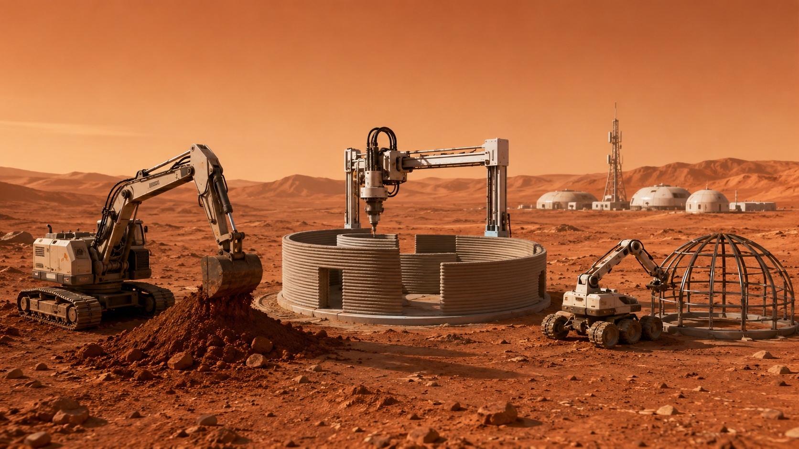
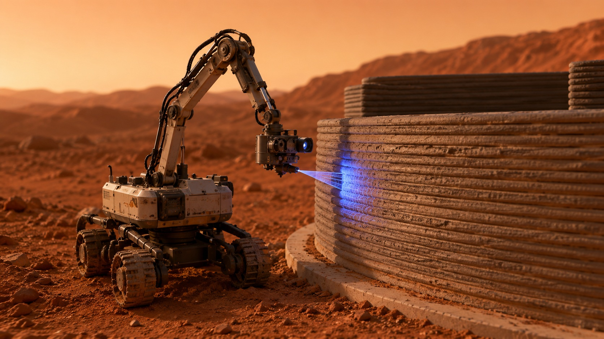
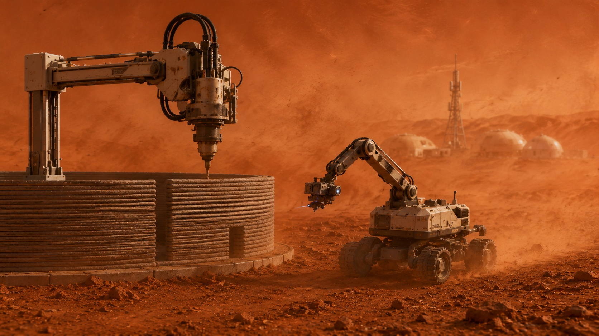

<!-- audio:start -->

A radio signal from Mars takes about twenty minutes to reach Earth, and twenty minutes to come back. Hold that number in your mind for a moment, because everything else follows from it. If a robot on the Martian surface begins extruding a structural wall a few degrees out of true, and a human controller on Earth notices, the correction they send will arrive more than half an hour after the mistake was made. By then the wall is built. By then the next wall is being built on top of it. There is no real-time rescue. There is no taking the controls. The distance has quietly removed the one safeguard that almost every autonomous system on Earth secretly relies upon: a person, watching, ready to step in.

We rarely admit how much we lean on that person. We talk about autonomous agents as though they were independent, but most of them are autonomous only in the way a learner driver is autonomous — fine until something unexpected happens, at which point an instructor takes the wheel. Strip the instructor away and you find out what the system is really made of. That is why building on another planet is not a publicity stunt or a distant fantasy to me. It is the most honest stress test I know. It asks a question that enterprise software has been able to dodge for years: what does an agent do when it is wrong and no one is coming to help?

[AutoSelf](https://github.com/ruslanmv/AutoSelf-Consistent-Multi-Agent-Platform) is my attempt to take that question seriously. It is a platform for orchestrating autonomous multi-robot operations — excavation, 3D printing, assembly — in environments that are remote, uncertain, and unforgiving, with extraterrestrial construction as the headline scenario. But the Moon and Mars are the setting, not the subject. The subject is reliability, and the claim I want to make is simple to state and surprisingly hard to honour: autonomy is not about doing more. It is about being trusted to correct yourself when no one is watching.

<figure>
  
  <figcaption>Autonomous habitat construction as a coordinated multi-robot operation: excavation, printing, and assembly without real-time human control.</figcaption>
</figure>

## The thing that actually fails

When autonomous agents fail in the field, they rarely fail for the reason people expect. The failure is almost never that the agent could not act. Modern systems are extravagantly capable; they can plan elaborate sequences, call tools, write code, command motors. The failure is subtler and more dangerous. The agent acts, the world does not respond the way the plan assumed, and the agent carries on regardless — confidently, fluently, wrongly — because nothing in its loop forces it to check whether reality matched intention. It is not blindness exactly. It is the absence of a second glance.

On Earth we paper over this with supervision. A human reviews the output, spots the drift, nudges it back. The agent looks reliable, but the reliability lives in the human, not in the system. Move that system somewhere the human cannot follow — a twenty-minute signal delay, a factory floor running overnight, a fleet too large to babysit — and the borrowed reliability evaporates. What is left is an agent that can do a great deal and verify almost none of it.

This is the gap AutoSelf is built around. Not a capability gap. A *consistency* gap.

## Execute, verify, correct

The core of the platform is a loop, and the loop is deliberately unglamorous. An orchestrator decomposes a mission into tasks and dispatches them to robotic agents — in the lunar simulation these are concrete characters: an excavator, a printer, an assembler, each with its own job. That is the **execute** step, and on its own it is nothing special; every agent framework can dispatch work.

What matters is what comes next. After execution, the system does not assume success. It **verifies**: it compares the actual outcome against the intended goal, and where the situation is ambiguous it consults a large language model to reason about what the result really means and whether the mission is still on track. Only then does it **correct** — re-planning when reality has diverged, retrying what failed, routing around what broke. Execute, verify, correct, and then again, continuously, with no human in the middle of the cycle. The word doing the heavy lifting is *consistent*: the system is built to keep its actions and its intentions in agreement over time, even as the environment refuses to cooperate.

<figure>
  
  <figcaption>Verification is the missing second glance: the system must compare what it intended with what the world actually became.</figcaption>
</figure>

> Autonomy is not the freedom to act without a human. It is the discipline to stay correct without one.

That discipline is easy to describe and hard to engineer, because verification is where most systems quietly give up. It is far cheaper to act than to check whether the action worked, and a verification step that consults a reasoning model on every cycle costs latency and money. The temptation is always to trust the plan and move on. AutoSelf is, in a sense, a long argument against that temptation — a bet that the unglamorous second glance is the part you cannot skip.

## Why the hardest environment is the best teacher

To see whether a self-consistent loop earns its keep, you have to break it on purpose. So the platform's simulations do not depict a tidy mission going smoothly; they inject the kinds of trouble the real world specialises in. A 3D printer's nozzle clogs mid-build — a mechanical failure that invalidates the current plan. A dust storm rolls in — an environmental hazard that changes what is safe to do at all. These are not edge cases bolted on for drama. They are the whole point. An autonomous system that only works when nothing goes wrong is not autonomous; it is merely unattended, which is a different and more frightening thing.

<figure>
  
  <figcaption>Failure is the real test: a clogged printer, a dust storm, and no human close enough to take over.</figcaption>
</figure>

What the extreme setting buys you is clarity. On Earth, a flawed agent can limp along for a long time because a human keeps catching it, and you never quite learn how brittle it was. Put the same agent twenty minutes from any help, with a dust storm closing in and a half-printed habitat that has to hold pressure, and the brittleness has nowhere to hide. The environment becomes a teacher precisely because it refuses to forgive. Solve construction on the Moon — really solve it, loop and all — and you have not learned something about space. You have learned what *any* autonomous agent needs in order to be trusted with work that matters.

## The same loop, much closer to home

Here is where the Moon stops being exotic. Strip away the regolith and the radiation and the signal delay, and the reliability primitive that AutoSelf depends on is exactly the one ordinary enterprise agents are missing.

Consider the agents being deployed inside companies right now: a procurement agent that files orders, a support agent that resolves tickets, a data agent that runs analyses and writes them up. Each of them can act with impressive fluency. Almost none of them verify. They produce a result, a human skims it, and the organisation calls that oversight. It works until the volume grows past what humans can skim, or the agent runs overnight, or the task is one where a confident-but-wrong answer does real damage before anyone notices. At that point the procurement agent is the printer with the clogged nozzle, building wall after wall slightly out of true, and there is no controller fast enough to stop it.

The fix is not a smarter model. It is the loop. An enterprise agent that executes, then verifies its output against the goal it was actually given, then corrects when the two have drifted, is trustworthy in a way that a more capable but unchecked agent never will be. This is the same conviction that runs through everything I build, and it is the thread that connects a robot on the Moon to the wider [Agent-Matrix](https://agent-matrix.github.io) vision of systems that stay alive rather than running once and stopping: an alive system is one that perceives, acts, *and checks itself*, on a loop, indefinitely. AutoSelf is that philosophy pushed to its hardest case and made to work where no human can intervene. If you want to see the machinery — the orchestrator, the verification cycle, the failure simulations, the full demo notebook that reproduces the runs — it is all [open in the repository](https://github.com/ruslanmv/AutoSelf-Consistent-Multi-Agent-Platform).

## Reliability is the frontier

For a decade the story of AI has been a story of capability: bigger models, broader skills, more things an agent can attempt. That story is not over, but I think the interesting frontier has quietly moved. The question that now separates a demo from a system is not *can it act* but *can it be trusted to act unsupervised*, and that is a question about verification and self-correction, not about raw ability. The organisations that win the next phase will not be the ones with the most capable agents. They will be the ones whose agents can be left alone.

Extraterrestrial construction is simply the cleanest place to learn this, because it removes the human safety net completely and forces the system to own its own correctness. The Moon does not let you cheat. And the lesson it teaches — that a quiet, relentless loop of execute, verify, correct is worth more than another increment of capability — is the lesson every autonomous system on Earth will eventually have to learn too. Better to learn it now, in simulation, than later, in production, on a wall that is already built.

<!-- audio:end -->

---

*AutoSelf is part of a larger body of work on autonomous systems that govern and sustain themselves. If the idea of agents that stay correct without supervision interests you, it is the same principle behind [Agent-Matrix](https://agent-matrix.github.io) — and the [code is open](https://github.com/ruslanmv/AutoSelf-Consistent-Multi-Agent-Platform) for anyone who wants to take it apart.*

*Acknowledgement — this work is developed in collaboration with space architect Melodie Yashar, whose expertise in autonomous construction and off-world habitat design shaped the scenarios that make the reliability problem so concrete. The architecture and ideas discussed here are shared at a conceptual level; the underlying research is ongoing.*